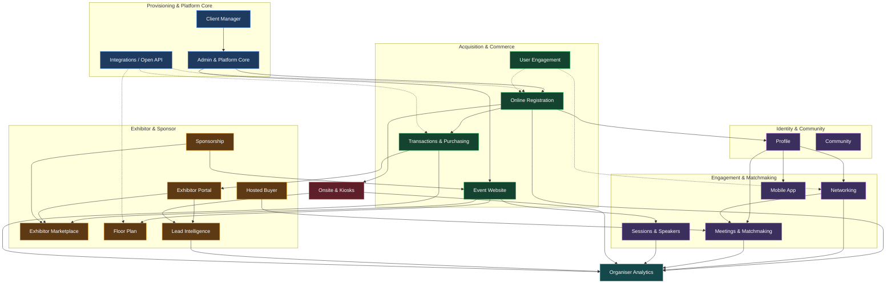

# ExpoPlatform — Product Ecosystem Map (Cross-Product Analysis)

## 1. Executive Summary
The **ExpoPlatform** product ecosystem is an end-to-end event & community platform spanning **21 product modules** across seven domains, from internal provisioning to onsite badge printing and post-event analytics. This document is the **breadth-first ecosystem map** (Phase 1): it identifies every product, its purpose and owners, how products depend on one another, the components and business rules they share, and the master event-lifecycle journey that ties them together.

It is reconstructed from three sources: the **ExpoDoc** Confluence space (923 product/feature pages), the **P2 "Product 2026"** space (339 pages: playbook, PRDs, per-team user-story folders) and the **EP Jira project** (1,149 Stories/Epics). Only Jira work in **delivered or actively-developed** statuses is included; future/unapproved work is excluded (see §13).

> [!GOOD] Reading order: start here for the whole picture, then open each product's dedicated document (Phase 2) for the full 15-section specification, workflows, business rules, data model, edge cases and traceable user stories.

## 2. How This Documentation Was Built
**Two-phase method.** Phase 1 (this document) discovers all products, relationships, shared components and the master journey. Phase 2 produces a complete specification per product — beginning with the **Organizer & Admin** cluster (Client Manager, Organiser Analytics, Onsite & Kiosks, Transactions & Purchasing).

**Sources & scope**

| Source | What it provided | Volume |
| --- | --- | --- |
| ExpoDoc Confluence | Authoritative product & feature behaviour, configuration, workflows, notifications, reports | 923 pages |
| P2 Confluence | 2026 PRDs, user-story specs, glossary, per-team backlogs, roadmap | 339 pages |
| EP Jira | Delivered & active Stories/Epics → requirements, acceptance criteria, traceability | 1,149 issues |

**Issue-type filter:** only **Stories, Epics and Features** were analysed. Tasks, Bugs, Sub-tasks and technical tickets were excluded by design. **Status filter:** strict — only delivered/active statuses count (§13).

## 3. Product Ecosystem Map
Products are organised into seven domains. Solid arrows show the **primary data/handoff flow**; dotted arrows show **cross-cutting services** (integration, engagement, analytics) that touch many modules.

## 4. Product Catalog
All 21 modules, their domain, primary users and in-scope delivery footprint (Jira stories/epics in approved statuses + Confluence pages).

| Product | Domain | Primary users | In-scope stories | Epics | Confluence pages |
| --- | --- | --- | --- | --- | --- |
| **Client Manager** | Provisioning & Core | ExpoPlatform staff (Super Admin) | 0 | 0 | 0 |
| **Admin / Platform Core** | Provisioning & Core | Organiser Admin, Super Admin | 18 | 9 | 64 |
| **Integrations** | Provisioning & Core | Organiser, Partner/Developer | 6 | 25 | 119 |
| **Event Website** | Acquisition & Commerce | Organiser, Attendee | 62 | 6 | 39 |
| **Online Registration** | Acquisition & Commerce | Organiser, Attendee | 27 | 1 | 27 |
| **Transactions & Purchasing** | Acquisition & Commerce | Organiser, Attendee, Exhibitor | 13 | 1 | 29 |
| **User Engagement** | Acquisition & Commerce | Organiser | 18 | 1 | 31 |
| **Profile** | Identity & Community | Attendee, all roles | 6 | 1 | 0 |
| **Community** | Identity & Community | Member, Organiser | 4 | 1 | 44 |
| **Networking & Interactions** | Engagement | Attendee, Exhibitor, Organiser | 37 | 7 | 49 |
| **Meetings & Matchmaking** | Engagement | Attendee, Exhibitor, Hosted Buyer, Organiser | 38 | 5 | 114 |
| **Sessions & Speakers** | Engagement | Organiser, Speaker, Attendee | 45 | 7 | 32 |
| **Mobile App** | Engagement | Attendee, Exhibitor, Speaker | 26 | 0 | 87 |
| **Exhibitor Portal** | Exhibitor & Sponsor | Organiser, Exhibitor | 85 | 10 | 18 |
| **Exhibitor Marketplace** | Exhibitor & Sponsor | Attendee, Exhibitor, Organiser | 27 | 1 | 32 |
| **Sponsorship** | Exhibitor & Sponsor | Organiser, Sponsor | 5 | 0 | 18 |
| **Floor Plan** | Exhibitor & Sponsor | Organiser, Attendee, Exhibitor | 15 | 2 | 21 |
| **Hosted Buyer Management** | Exhibitor & Sponsor | Organiser, Agent, Hosted Buyer | 5 | 0 | 11 |
| **Lead Intelligence** | Exhibitor & Sponsor | Exhibitor, Organiser | 12 | 4 | 24 |
| **Onsite & Kiosks** | Onsite | Organiser, Onsite staff, Attendee | 35 | 3 | 42 |
| **Organiser Analytics** | Insight | Organiser | 16 | 4 | 17 |

> [!INFO] Client Manager shows 0 mapped stories because its few admin tickets are captured under *Admin / Platform Core*; it is documented primarily from Confluence. *Profile* is a shared sub-domain rather than a standalone Confluence tree.

## 5. Architecture Layers & Ownership Boundaries
The platform is best understood as concentric layers. Each outer layer depends on the ones beneath it.

1. **Provisioning layer — Client Manager (ExpoPlatform staff only).** Creates and gates every client environment. No organiser or attendee ever touches it.
2. **Platform Core (Organiser Client / Admin).** Within a provisioned client, organisers manage events, event settings, participant categories, admin accounts/permissions and global search. Defines the *event context* every other module operates in.
3. **Acquisition & Commerce.** Website + Registration + Transactions turn visitors into attendee/exhibitor records; User Engagement drives them in.
4. **Identity.** Registration produces a Profile — the single identity reused everywhere (matchmaking, listings, app, community).
5. **Engagement.** Networking, Meetings, Sessions and the Mobile App act on Profiles and the event programme.
6. **Exhibitor & Sponsor.** A parallel value chain: Exhibitor Portal → Marketplace listing → Lead Intelligence ROI, with Floor Plan, Sponsorship and Hosted Buyer.
7. **Onsite.** Onsite & Kiosks converts the digital record into a physical badge and check-in/lead events.
8. **Insight.** Organiser Analytics consumes events from every layer; Integrations exposes them externally.

**Ownership boundaries.** Client Manager is owned by ExpoPlatform operations; everything else is operated by the **Organiser** for their event/community, with delegated controls to **Exhibitors** (their listing, team, leads), **Sponsors** (placements), **Speakers** (their sessions) and **Attendees** (their profile, schedule, meetings).

## 6. Shared Components (Reusable Modules)
These cross-cutting building blocks appear in many products — a change here ripples widely, so they are documented once and referenced everywhere.

| Shared component | Used by | Why it is shared |
| --- | --- | --- |
| **Form Builder** (fields, conditional logic, custom questions) | Online Registration, Exhibitor Portal, Lead Intelligence (question builder), Surveys | One engine for every data-collection form on the platform |
| **Email Builder & Notification engine** | User Engagement, Registration, Meetings, Exhibitor Manual, Onsite | Single templating + send/queue path for all email/push/in-app messages |
| **Profile / Identity** | Networking, Meetings, Marketplace, Mobile App, Community, Analytics | One user record drives matchmaking, listings and personalisation |
| **Participant Categories & Permissions** | Registration, Marketplace, Networking, Lead access, Pricing | Category + role decide visibility, access and price across the platform |
| **Matchmaking engine** (interests, exclusion filters, data matching) | Networking, Meetings, Recommendations, Speed Networking | Shared scoring/recommendation logic |
| **Basket & Payments** | Transactions, Registration (tickets), Exhibitor Manual (equipment), Lead Capture (paid) | Single checkout, tax, invoice and gateway layer |
| **Badge Builder** | Onsite & Kiosks (print), Mobile App (digital badge), Exhibitor service badges | One badge design used for print, kiosk, email and app |
| **CMS / Block system** | Event Website, Community home, custom pages, Marketplace | Reusable standard/system blocks |
| **Data Import/Export & Reporting** | Analytics, Registration reports, Leads export, Meetings export | Common export framework feeding 25+ report types |
| **Global Search** | Admin panel + frontend listings | Unified cross-entity search and filters |
| **Open API / Webhooks** | Integrations layer for all of the above | Single external contract |

## 7. Shared Business Rules
Rules that hold *across* products (full per-product rules live in each product document):

- **Participant category is king.** A user's category (+ role) governs what they can see, do, buy and be matched with — enforced in Registration, Marketplace, Networking, Lead access and pricing.
- **Permission cascade.** Organisers grant capabilities to Exhibitors/Sponsors; those grants bound everything the downstream role can do (e.g., free vs paid lead capture, listing edit rights, team-member limits).
- **Visibility & restrictions across frontend listings.** A single visibility model controls whether a profile/exhibitor/product appears in search, marketplace, recommendations and the app.
- **GDPR / opt-out propagation.** When a user opts out, their data is suppressed consistently across favourites, matchmaking, listings and exports.
- **Matchmaking exclusion filters** prevent intra-company or category-excluded matches everywhere matchmaking runs.
- **Sponsored placement precedence.** Sponsored exhibitors/products are boosted in search, marketplace and listings according to sponsorship configuration.
- **Event lifecycle gating.** Many actions (registration open/close, meeting windows/"allowed meeting times", check-in) are gated by event-phase dates.

## 8. Product-to-Product Integration Matrix
Key internal dependencies (producer → consumer). "Provides" = data/events it emits; "Depends on" = what it needs to function.

| Product | Depends on | Provides to |
| --- | --- | --- |
| Client Manager | — | Provisions environments for **all** modules |
| Admin / Platform Core | Client Manager | Event context, categories, permissions → all modules |
| Online Registration | Admin (categories), Transactions (paid tickets) | Profile, attendee list → Onsite, Networking, Analytics |
| Transactions & Purchasing | Registration, Exhibitor Portal, Integrations (gateways) | Orders, invoices → Analytics, Exhibitor, Registration |
| Event Website | Admin, Sponsorship, Sessions, Floor Plan | Public pages, embedded listings |
| Profile | Registration | Identity → Networking, Meetings, App, Marketplace, Community |
| Networking & Interactions | Profile, Matchmaking engine | Connections, favourites → Meetings, Analytics |
| Meetings & Matchmaking | Networking, Hosted Buyer, Profile | Meetings → Mobile App, Analytics, Lead Intelligence |
| Sessions & Speakers | Admin, Website | Agenda → Mobile App, Schedule, Analytics |
| Exhibitor Portal (Manual) | Transactions (equipment/lead purchase), Admin | Exhibitor data → Marketplace, Lead Intelligence, Badges |
| Exhibitor Marketplace | Exhibitor Portal, Sponsorship, Profile | Listings → Website, App, Search |
| Lead Intelligence | Onsite (scan), Meetings, Exhibitor Portal | Leads → Exhibitor dashboard, Export, Analytics |
| Floor Plan | Admin, Integrations (Invisual/ExpoFP/Bluedot) | Stand map → Website, App, Marketplace |
| Onsite & Kiosks | Registration (badge data), Transactions (ticket) | Check-in & scan events → Lead Intelligence, Analytics |
| Mobile App | Profile, Networking, Meetings, Sessions, Onsite | Engagement events → Analytics |
| User Engagement | Registration, Profile, Email builder | Campaign/notification sends → all audiences |
| Organiser Analytics | **All modules** | Dashboards, 25+ exportable reports |
| Integrations | All modules | Open API + native sync to external systems |

## 9. External Integrations
Confirmed third-party touchpoints found in the documentation:

- **Floor Plan:** Invisual, ExpoFP, CrowdConnected (Bluedot indoor navigation), external floor-plan linking.
- **Payments:** payment gateway integrations with taxes, invoicing and reporting (Transactions & Purchasing).
- **Identity / SSO:** Firebird SSO (Exhibitor Manual), platform SSO options.
- **Analytics:** Google Analytics / GA4 (re-enabled for custom pages and validation).
- **Platform:** Open API (Option 1) and native integrations (Option 2) for bidirectional data exchange.

Each product document details the trigger, data exchanged, failure/retry handling and security considerations for its integrations.

## 10. Master User Journey (Event Lifecycle)
The end-to-end journey from creating a client to post-event follow-up, and which products are active at each phase.

```mermaid
flowchart LR
  classDef core fill:#1e3a5f,stroke:#3b82f6,color:#fff
  classDef acq fill:#14432f,stroke:#22c55e,color:#fff
  classDef eng fill:#3b2f5e,stroke:#a855f7,color:#fff
  classDef ons fill:#5e1f2a,stroke:#ef4444,color:#fff
  classDef ins fill:#14484a,stroke:#22d3ee,color:#fff
  A["1 · Provision<br/>Client Manager → Organiser Client"]:::core
  B["2 · Build<br/>Website · Registration form · Tickets · Floor Plan"]:::acq
  C["3 · Promote<br/>User Engagement · SEO · Marketplace"]:::acq
  D["4 · Register<br/>Registration → Profile → Payment"]:::acq
  E["5 · Engage (pre-event)<br/>Networking · Meetings · Sessions · App"]:::eng
  F["6 · Onsite<br/>Badge/Kiosk · Check-in · Lead scan"]:::ons
  G["7 · Post-event<br/>Analytics · Follow-up · Community"]:::ins
  A-->B-->C-->D-->E-->F-->G
  G -. "year-round community" .-> E
```

**Narrative.** ExpoPlatform staff provision the client (1). The organiser configures the event in the Organiser Client and builds the public Website, Registration form, ticket/pricing and floor plan (2), then promotes it through email/push campaigns, SEO and the marketplace (3). Attendees, exhibitors and hosted buyers register — creating Profiles and, for paid items, going through Basket → Payment (4). Before the event they network, request/accept meetings, build schedules and use the mobile app (5). Onsite, badges are printed at kiosks or in advance, attendees are checked in, and exhibitors scan leads (6). Afterwards organisers analyse behaviour and ROI, follow up, and keep the audience engaged year-round in the community (7).

## 11. Master Feature Inventory
Per-product summary of delivered scope. Open each product's dedicated document for the full feature-by-feature specification.

### Client Manager
*Internal-only console that houses and grants access to every customer environment. Staff provision client accounts, enable/disable frontends, and open organiser events.*

**In-scope:** 0 stories · 0 epics · 0 Confluence pages

**Representative delivered epics/themes:** Documented primarily in Confluence (few/no dedicated in-scope epics).

### Admin / Platform Core
*Cross-cutting admin panel: organiser client/event management, global search, participant categories, roles & permissions, pagination, settings, security/GDPR. The backbone every module runs inside.*

**In-scope:** 18 stories · 9 epics · 64 Confluence pages

**Representative delivered epics/themes:** BE Microservices Preparation and Establishing - V1; Build a context-agnostic test data seeding infrastructure for the AUT ; Create a components library for react; Global Search functionality; HINTE - Genesis World Integration; Hyve Communication improvements

### Integrations
*Open API plus native integrations for exchanging registration, attendee, meeting, floor-plan and payment data with external systems (CRM, analytics, floor-plan vendors, SSO).*

**In-scope:** 6 stories · 25 epics · 119 Confluence pages

**Representative delivered epics/themes:**  Refactoring Api Test stage 1; Accounts api v2 ; Admins - Writing tests for api V1 Admin Panel on PlayWright; EPIC-FC: Microservice Monolith Full Circle flow with MicroGateway, New; Foundation of the API; Integration HUB - Integrations EPIC

### Event Website
*Drag-and-drop website builder — standard & system blocks, content management, SEO, preview/history — to publish on-brand event and community sites.*

**In-scope:** 62 stories · 6 epics · 39 Confluence pages

**Representative delivered epics/themes:** AI-Assisted Website Builder Phase I; Changes to the footer based on CSS tasks; Header Menu Customization Options; New Website Builder; New web builder - Custom Forms; Website builder. Custom grids

### Online Registration
*Configurable registration flows with a form builder, conditional logic, custom questions, participant categories and confirmation pages; creates the attendee record.*

**In-scope:** 27 stories · 1 epics · 27 Confluence pages

**Representative delivered epics/themes:** Participant Registration on New UI

### Transactions & Purchasing
*Shopping basket, ticketing, payments (gateways, taxes, invoicing, reporting) and discounts — the money layer behind registration, exhibitor equipment and lead-capture purchases.*

**In-scope:** 13 stories · 1 epics · 29 Confluence pages

**Representative delivered epics/themes:** Qdrant Pilot (IMEX)

### User Engagement
*Email campaigns (two tools), scheduled push notifications and platform notifications via a shared email builder — drives sign-ups and pre/post-event engagement.*

**In-scope:** 18 stories · 1 epics · 31 Confluence pages

**Representative delivered epics/themes:** Email nurturing 

### Profile
*The shared user identity and profile data (interests, contact, visibility) reused across event and community contexts; feeds matchmaking and listings.*

**In-scope:** 6 stories · 1 epics · 0 Confluence pages

**Representative delivered epics/themes:** Hyve Q4. November+December Delievery.

### Community
*Year-round professional networking, collaboration and training beyond a single event — community home, groups, and platform-wide features such as sessions.*

**In-scope:** 4 stories · 1 epics · 44 Confluence pages

**Representative delivered epics/themes:** Messages / group chats

### Networking & Interactions
*All the ways participants connect: meetings, speed networking, recommendations, matches, favourites, messaging and My Schedule, with organiser matchmaking controls.*

**In-scope:** 37 stories · 7 epics · 49 Confluence pages

**Representative delivered epics/themes:** Combining Personalized Matchmaking and Recommendations; Data Science configuration; Hyve Meeting Program; Improve Speed Networking Service; Recreate category-based Recommendation Service; Speed Networking

### Meetings & Matchmaking
*Self-requested meetings plus specialised formats — Concierge, Speed Networking, Meeting Program, Round Tables, Exhibitor Events — with statuses, tags, reminders and ratings.*

**In-scope:** 38 stories · 5 epics · 114 Confluence pages

**Representative delivered epics/themes:** Creating Meetings; Meeting Formats: Admin Re-arrangement; Meeting Transcription Tool (MTT, a.k.a. AI Meeting notes) transforming; Meeting Wizard  (arranging meetings in Admin panel); Sprint Automation Front end ver 2

### Sessions & Speakers
*Session & speaker content, agenda display, personal schedules, session/online/on-demand registration and exhibitor events shown alongside the programme.*

**In-scope:** 45 stories · 7 epics · 32 Confluence pages

**Representative delivered epics/themes:** Authentication Enablement; Hyve Round tables improvements; New autoapproval mechanism for Exhibitor events; Schedule; Session Calendar View; Sessions api v2

### Mobile App
*The onsite companion app: networking, schedule, real-time notifications, digital badge and lead scanning — increases engagement and exhibitor satisfaction.*

**In-scope:** 26 stories · 0 epics · 87 Confluence pages

**Representative delivered epics/themes:** Documented primarily in Confluence (few/no dedicated in-scope epics).

### Exhibitor Portal
*The Exhibitor Manual — organisers collect info/requests and exhibitors order stand items. Sections: documents, service badges, table form, equipment shop, lead capture, team members, edit profile.*

**In-scope:** 85 stories · 10 epics · 18 Confluence pages

**Representative delivered epics/themes:**  Exhibitor profile; Exhibitor Manual Import Enhancements (global); Exhibitor profile; Exhibitors api v2; Implement Exhibitor CRUD; Microservices ADRs review and Architecture Adaptation

### Exhibitor Marketplace
*Public directory where exhibitors, products, brands, news and events are viewed, searched and filtered; organiser controls categories/permissions, exhibitors control listing content.*

**In-scope:** 27 stories · 1 epics · 32 Confluence pages

**Representative delivered epics/themes:** Redesign of Exhibitor account in Admin panel

### Sponsorship
*Sponsorship packages and placements surfaced across the website, marketplace, search and meetings (sponsored exhibitors/products, banners).*

**In-scope:** 5 stories · 0 epics · 18 Confluence pages

**Representative delivered epics/themes:** Documented primarily in Confluence (few/no dedicated in-scope epics).

### Floor Plan
*Hall and stand setup, layout, DXF stand import, vendor integrations (Invisual, ExpoFP, CrowdConnected/Bluedot) and end-user display, search and wayfinding.*

**In-scope:** 15 stories · 2 epics · 21 Confluence pages

**Representative delivered epics/themes:** Floor plan api v2; Rewrite floorplan in threejs

### Hosted Buyer Management
*Tools to run a hosted-buyer programme — agents, buyer categories, benefits, document dashboard, automated filters and buyers list — feeding curated meetings.*

**In-scope:** 5 stories · 0 epics · 11 Confluence pages

**Representative delivered epics/themes:** Documented primarily in Confluence (few/no dedicated in-scope epics).

### Lead Intelligence
*Configurable lead capture & management: question builders, access management (free/paid), leads dashboard, scanning and export — the exhibitor ROI engine.*

**In-scope:** 12 stories · 4 epics · 24 Confluence pages

**Representative delivered epics/themes:** AI Search Service (tools); Check-in Analytics refresh; Download leads and Scanned me lists refactor; Lead Capture pro settings

### Onsite & Kiosks
*Badge builder (print + digital), check-in app with attendance tracking, kiosk self-print and badge printing/emailing options for the door experience.*

**In-scope:** 35 stories · 3 epics · 42 Confluence pages

**Representative delivered epics/themes:** Badges fixes and improvements; Scan Badges / Scanned Me (Display lists after scan); Visit G2 Implementation (External page for badge/scanner)

### Organiser Analytics
*Insight into user behaviour across events and communities — general dashboard, real-time meeting and session analytics, and a large set of exportable reports.*

**In-scope:** 16 stories · 4 epics · 17 Confluence pages

**Representative delivered epics/themes:** Implement BI tool; Reporting run 2024; Statistics api v2; VAPT report / secure fixes

## 12. Story-to-Product Mapping
Every in-scope Jira issue was assigned to a product using a prioritised rule: **(1)** Jira component when present and product-aligned; **(2)** parent-epic name keywords; **(3)** summary/description keywords; **(4)** otherwise *Unassigned / Cross-cutting*. The full per-issue mapping is in `_data/mapping/story_product_map.csv` (521 in-scope stories, 100% assigned).

| Product | In-scope stories | Epics | Jira components |
| --- | --- | --- | --- |
| Exhibitor Portal | 85 | 10 | Exhibitor Manual, Exhibitor Marketplace, Profile, Sponsorship |
| Event Website | 62 | 6 | Website |
| Sessions & Speakers | 45 | 7 | Online Meetings & Webinars, Schedule Management, Session & Speaker Management |
| Meetings & Matchmaking | 38 | 5 | Curated Meeting  |
| Networking & Interactions | 37 | 7 | Networking, Session & Speaker Management |
| Onsite & Kiosks | 35 | 3 | — |
| Exhibitor Marketplace | 27 | 1 | Curated Meeting , Exhibitor Marketplace, Profile |
| Online Registration | 27 | 1 | Online Registration |
| Mobile App | 26 | 0 | Curated Meeting , Mobile App, Networking |
| Unassigned / Cross-cutting | 21 | 44 | — |
| User Engagement | 18 | 1 | Marketing |
| Admin / Platform Core | 18 | 9 | Admin Interface, Online Registration, Session & Speaker Management |
| Organiser Analytics | 16 | 4 | Reporting |
| Floor Plan | 15 | 2 | Floor Plan, Mobile App, Website |
| Transactions & Purchasing | 13 | 1 | Payments |
| Lead Intelligence | 12 | 4 | Lead Intelligence |
| Integrations | 6 | 25 | — |
| Profile | 6 | 1 | Profile |
| Hosted Buyer Management | 5 | 0 | Curated Meeting , Hosted Buyer Management |
| Sponsorship | 5 | 0 | Sponsorship |
| Community | 4 | 1 | Membership Management, Online Registration |

## 13. Jira Status Scope & Coverage Snapshot
Per the approved rule, only **delivered or actively-developed** work is included. The EP project's real statuses mapped as follows:

| Status | Issues | In scope? |
| --- | --- | --- |
| COMPLETE | 612 | ✅ Included |
| In Progress | 39 | ✅ Included |
| QA Tested | 2 | ✅ Included |
| Estimated request | 248 | ❌ Excluded (pre-dev pipeline) |
| Open | 120 | ❌ Excluded |
| Tech Brief | 42 | ❌ Excluded |
| Closed by reject | 32 | ❌ Excluded (rejected) |
| On-hold | 24 | ❌ Excluded |
| Ready for development | 15 | ❌ Excluded (per scope decision) |
| Ready for decomposition | 8 | ❌ Excluded |
| Brief ready for review | 5 | ❌ Excluded |
| Awaiting Estimation | 1 | ❌ Excluded |
| Business Analysis | 1 | ❌ Excluded (per scope decision) |

**Totals:** 1,149 Story/Epic issues → **653 in scope** (521 Stories + 132 Epics), **496 excluded** by status. There are **0 Features** and **0 unclassifiable** statuses. A full validation/coverage report is produced after Phase 2.

## 14. Source Index & Navigation
- **ExpoDoc** (`/wiki/spaces/ExpoDoc`) — 923 pages — the authoritative admin/product documentation; 21 product landing pages are the entry points used here.
- **P2 "Product 2026"** (`/wiki/spaces/P2`) — 339 items — Product Playbook (PRD & user-story templates, glossary, prioritisation), per-team folders (Visitor, Organizer, App, DS, Integrations, Exhibitor) and 2026 user-story specs.
- **EP Jira** (`/jira/.../projects/EP`) — Stories & Epics; this reconstruction used in-scope issues only.

Datasets backing this reconstruction (in `_data/`): `jira/issues_full.jsonl`, `jira/epics.json`, `jira/status_distribution.json`, `confluence/pages_expodoc.json`, `confluence/pages_p2.json`, `mapping/story_product_map.csv`, `mapping/product_inventory.json`.
