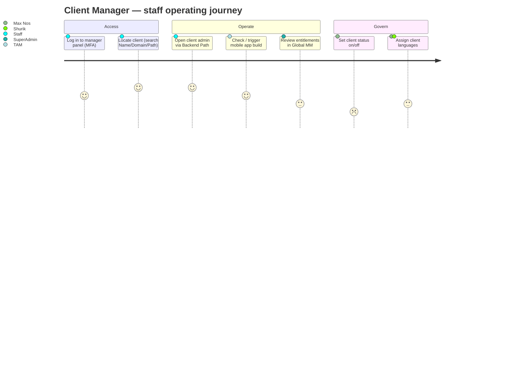
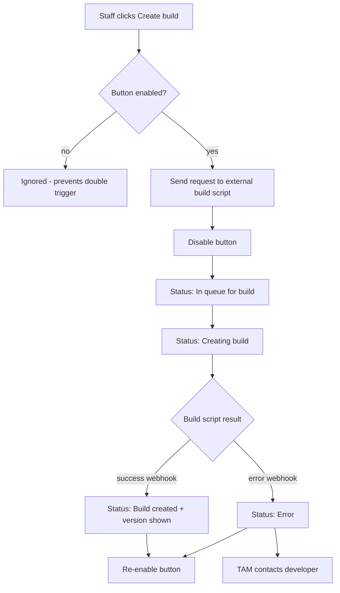
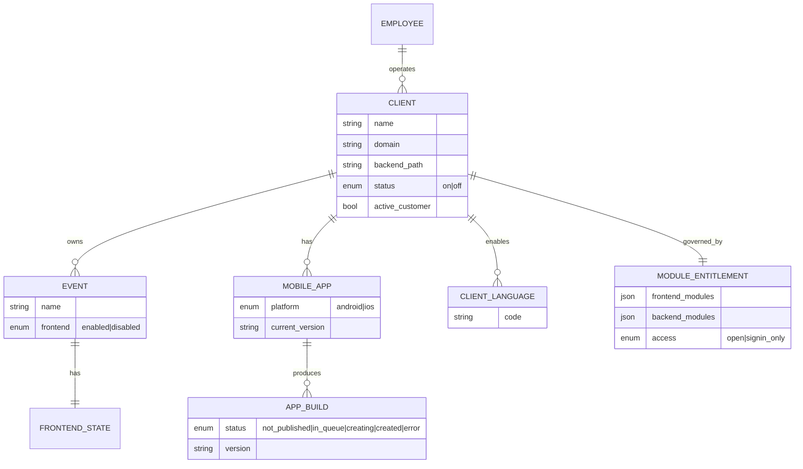
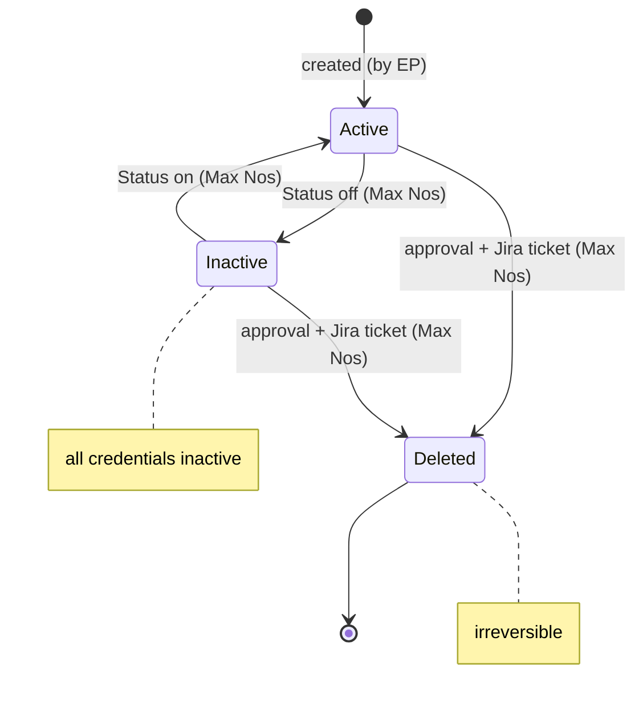
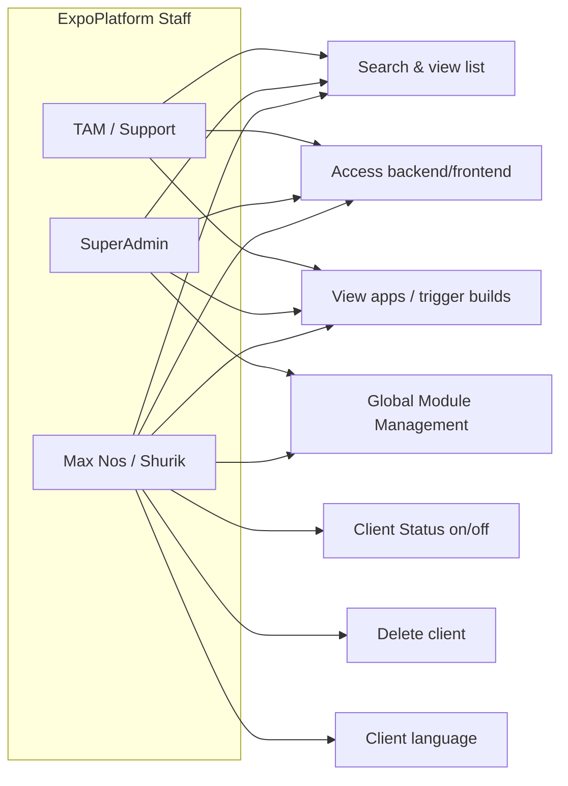

## 1. Product Overview
**Purpose.** The Client Manager is ExpoPlatform's internal control plane. It houses, and provides access to, **every customer environment** on the platform. It is used **only by ExpoPlatform staff** (never by organisers, exhibitors or attendees) to provision client environments, open client events and admin panels, govern which platform modules and languages a client has, and trigger client mobile-app builds.

**Problem being solved.** ExpoPlatform runs hundreds of isolated client environments. Staff need one authoritative place to find a client, jump into the right backend/frontend, switch a client on or off, control feature entitlements per client, and operate the mobile-app build pipeline — without editing each environment by hand or risking changes to the wrong client.

**Business value.**
- Single source of truth for the full client estate (search across Name, Domain, Backend Path).
- Safe, audited provisioning and de-provisioning (status on/off; delete restricted to one named owner).
- Commercial entitlement control — Global Module Management gates exactly what a client has paid for.
- Operational leverage — one console to launch app builds and manage languages for any client.

**Target users.** ExpoPlatform internal teams only: Technical Account Managers (TAMs), Support, Delivery/Onboarding, and platform operations. Two named gatekeepers — **Max Nos (Maksym Nosenko)** and **Shurik** — hold the most destructive controls.

**User personas.**
- *TAM / Support agent* — finds a client, opens its admin panel, checks app build state, reviews entitlements. Day-to-day read/operate.
- *SuperAdmin operator* — configures Global Module Management (entitlements) and event configuration.
- *Platform owner (Max Nos / Shurik)* — sets client status, deletes clients, assigns client languages. Highest-risk actions.

**Success metrics.** Time-to-locate a client environment; provisioning/offboarding cycle time; number of misrouted changes (should trend to zero); mobile-app build success rate; entitlement-related support tickets.

## 2. Product Scope
### Included
- A searchable **Client list** of every environment (alphabetical), filterable to active customers only.
- **Search by client name** across Name, Domain and Backend Path columns.
- **Access client's events / admin panel** via Backend Path link or Actions arrow; jump to client frontend via Domain link.
- **Enable / disable frontend** per event.
- **Client Status** (on/off) governing all client credentials.
- **Delete client** (restricted).
- **View mobile apps** and operate the **app build pipeline** (Android/iOS create-build, version tracking, build statuses).
- **Organiser Client (internal)** controls: **Client language** assignment and **Global Module Management** (frontend & backend module/page/function entitlements, access-control modes).
- **Employee Login** to the manager admin panel with MFA.

### Excluded
- Any organiser-, exhibitor- or attendee-facing capability (those live in the respective products).
- Per-event content/configuration done inside a client's own admin panel (covered by *Admin / Platform Core* and each product) — Client Manager only *launches into* it.
- Billing/invoicing of the client (commercial systems outside the platform).
- Building the mobile app itself (handled by the external build script; Client Manager triggers and tracks it).

## 3. User Roles
Client Manager is staff-only, so the platform's external roles (Organizer, Exhibitor, Sponsor, Attendee, Speaker) have **no access**. Access is differentiated within the ExpoPlatform team.

| Role | Access in Client Manager | Notes / restrictions |
| --- | --- | --- |
| Attendee / Speaker / Exhibitor / Sponsor | **None** | Cannot see or reach the Client Manager at all |
| Organizer (client admin) | **None** | Operates only inside their own admin panel, which Client Manager links to |
| ExpoPlatform Staff (TAM / Support) | Search, view list, access client backend/frontend, view apps, trigger app builds | Must not apply unauthorised changes on client events; use **New DEMO** client for testing |
| **Admin (SuperAdmin operator)** | All of the above **+ Global Module Management** (`/admin/manage`) and event configuration | Module entitlement changes require Save + cache clear |
| **Super Admin / Platform Owner (Max Nos, Shurik)** | All of the above **+ Client Status on/off, Delete client, Client language** | Highest-risk; deletion needs management approval + Jira ticket |

## 4. Feature Inventory

### 4.1 Employee Login (Manager Admin Panel access)
**Description.** Authenticated entry point for ExpoPlatform staff at `https://manager.expoplatform.com/admin/`.
**Why it exists.** Restricts the client estate to authorised employees and protects against credential compromise.
**User value.** Secure, personal, audited access to all client environments.
**Functional logic.** Personal username/password (issued by Max Nos) + **Two-Factor Authentication** via Google Authenticator (TOTP). Delivered/strengthened by **EP-11695 — MFA | Admins**.
**Preconditions.** Employee has been issued personal credentials and enrolled a TOTP device.
**Trigger conditions.** Staff navigates to the manager admin URL.
**Processing logic.** Validate credentials → prompt for TOTP code → establish session → render Client list.
**Outputs.** Authenticated manager session.
**Dependencies.** Identity/auth service; Google Authenticator.
**Configurations.** Per-employee credentials; MFA enrolment.
**Validation rules.** Credentials are personal (not shared); MFA mandatory.
**Permissions.** ExpoPlatform staff only.
**Error handling.** Invalid credentials or TOTP → access denied. Lost device → re-enrol via Max Nos.
**Edge cases.** Shared-credential attempts; expired/again-used TOTP code; testing must use the **New DEMO** client to avoid touching live clients.

### 4.2 Client List & Search by client name
**Description.** Alphabetical list of all client environments with a dynamic search box.
**Why it exists.** Staff must instantly locate one environment among hundreds.
**User value.** Fast, reliable lookup regardless of current page.
**Functional logic.** Search matches **Name**, **Domain** and **Backend Path**. It is **dynamic and page-independent** — from page 20 of 281 a search still returns matches from the whole set. **Not case-sensitive.** A **"Show Active Customers Only"** filter exists, but **search still returns inactive environments** even when that filter is on.
**Preconditions.** The client environment has been created/added.
**Trigger conditions.** Staff types a query and presses **Enter**.
**Processing logic.** Trim-sensitive match (leading/trailing spaces are **not** trimmed) → query across the three columns → render results.
**Outputs.** Filtered client list.
**Dependencies.** Client registry.
**Configurations.** "Show Active Customers Only" toggle.
**Validation rules.** Query is sent verbatim; surrounding spaces cause no-match.
**Permissions.** Any authenticated staff member.
**Error handling.** No results → verify the environment was actually created.
**Edge cases.** Leading/trailing spaces → false "not found"; ALL-CAPS still matches (case-insensitive); inactive environments appear even with the active-only filter applied.

### 4.3 Access client's events & admin panel
**Description.** Jump from the list into a client's backend or frontend.
**Functional logic.** Click the **Backend Path** link (or the blue **arrow** in Actions) → opens the client's **admin panel**. Click the **Domain** link → opens the client's **event frontend**; if the client has multiple events the link opens a **random** event's main page.
**Outputs.** New context inside the chosen client environment.
**Dependencies.** Client routing (Backend Path, Domain).
**Permissions.** Any authenticated staff member (must not make unauthorised changes).
**Edge cases.** Multi-event client → Domain link is non-deterministic (random event); use Backend Path for a specific admin target.

### 4.4 Enable / Disable Frontend (per event)
**Description.** Turn an individual event's public frontend on or off.
**Functional logic.** Click **Frontend** → a pop-up lists the client's events, each with an on/off toggle. **Off** → visitors hitting the event URL receive **"The event is disabled"**.
**Trigger conditions.** Staff toggles a specific event.
**Outputs.** Event frontend reachable / blocked.
**Validation rules.** Per-event scope (does not disable the whole client).
**Permissions.** Staff (operational).
**Edge cases.** Disabling frontend does **not** deactivate credentials or other events; differs from Client Status (whole-client).

### 4.5 Client Status (on/off)
**Description.** Whole-client master switch.
**Functional logic.** Two states only — **on** / **off**. When **off**, **all credentials become inactive and the client becomes inactive**.
**Permissions.** **Only Max Nos** can change it.
**Outputs.** Client fully active or fully suspended.
**Edge cases.** Off cascades to every event and credential; not reversible by ordinary staff.

### 4.6 Delete Client
**Description.** Permanent removal of a client environment.
**Functional logic.** **Only Max Nos** can delete. Process: obtain **internal management approval** → raise a **Jira task ticket** → deletion performed.
**Validation rules.** Approval + ticket are mandatory pre-conditions.
**Error handling.** Without approval/ticket, the request is not actioned.
**Edge cases.** Irreversible; must be distinguished from Status-off (suspend) which is recoverable.

### 4.7 View Mobile Apps & App Build Pipeline
**Description.** View a client's mobile apps and drive Android/iOS builds. Delivered by **EP-13787 — Applications update functional in manager admin panel (create builds)**.
**Functional logic.** Click **Apps** → pop-up lists the client's apps (those in "In preparation" per the Mobile App builder). Columns **Android/iOS app update** carry a **create build** button; clicking sends a request to the external **build script** and starts the pipeline. The button is **disabled** after first click until a success/error webhook returns (prevents double-trigger). **Android/iOS current version** columns are empty until the first successful build, then show the version.
**Build statuses.** *Not published* (no builds in stores) → *In queue for build* → *Creating build* → *Build created* (available in store) / *Error* (build failed; TAM must contact the developer).
**Trigger conditions.** Staff clicks create build.
**Outputs.** Build task queued; status + version updated via webhook.
**Dependencies.** External build script; app store pipelines; webhook receiver; Mobile App builder.
**Error handling.** *Error* status → TAM coordinates with developer; button re-enables on webhook.
**Edge cases.** Rapid double-click prevented by disabling; lost/never-received webhook leaves status stale.

### 4.8 Client Language
**Description.** Assign the languages available to a client environment.
**Functional logic.** Set by **Max Nos or Shurik** via a dedicated pop-up. **Available languages:** EN, US, DE, FR, ES, ES(lat), IT, RU, KZ, SV, TR, TR_ALT, NL, THA, JA, ZH, IS, KO, TW, VN, PL, AR, PT, FI. Languages enabled here then appear in the **Frontend Languages** selector at `/admin/general/edit`. **Multilanguage** must also be enabled in Global and Event Module Management. The NextJS PortalUI supports a **subset** (ar, en, de, nl, fr, es, ru, it, pl, pt, tr, tr2, tha, es_lat, vn, fi, is); us, sv, ja, zh, ko, tw, kk currently lack translations. Related delivered work: **EP-18901 / EP-23090 (Multilanguage)**.
**Permissions.** Max Nos / Shurik only.
**Dependencies.** Module Management (multilanguage toggle); frontend language selector.
**Edge cases.** A language enabled for the client but missing PortalUI translations falls back; multilanguage not enabled in MM → selector unavailable despite client languages set.

### 4.9 Global Module Management (Organiser Client)
**Description.** Entitlement control governing which modules/pages/functions a client has, on both frontend and backend. Available to **SuperAdmin** on the events list page (`/admin/exhibitions/list`) via the **Module Management** button → `/admin/manage`.
**Functional logic.** Two tabs — **Modules Managing** and **Settings**. Modules Managing has two tables:
- **Frontend table** — disable modules/pages/functions for the client's public site. Disabling an item also removes its toggle(s) from per-event Module Management. Some controls are **grouped** (e.g., *Registration* → visitor vs exhibitor registration separately; *Exhibitors / Participants / Buyers / Team Members* → controls for that user type; settings outside a group affect all users).
- **Backend table** — disable modules/pages/functions in the admin panel.
**Access-control modes** (per page): **Open access** (anyone can view; must log in to interact — login pop-up) or **Sign-in only** (only authenticated users can view/interact — redirected to login page).
**Processing logic.** Edit toggles → **Save** → **clear cache** for changes to take effect faster.
**Outputs.** Client entitlement set; per-event toggles appear/disappear accordingly.
**Dependencies.** Event Module Management (per-event toggles derive from these globals); cache layer.
**Validation rules.** Disabling a global removes the corresponding per-event control.
**Permissions.** SuperAdmin only.
**Error handling.** Changes not reflected → confirm Save + cache cleared.
**Edge cases.** Global disable overrides per-event enable; grouped vs ungrouped settings scope differs; stale cache hides recent changes.

## 5. User Stories Mapping
Client Manager is documented primarily in Confluence (it is an internal operations tool), so it has **no dedicated in-scope story bucket** of its own — its tickets sit under *Admin / Platform Core*. The in-scope, delivered stories that directly shaped Client Manager capabilities are traced below.

| Story ID | Title | Summary | Acceptance (as documented) | Related feature | Status |
| --- | --- | --- | --- | --- | --- |
| EP-13787 | Applications update functional in manager admin panel (create builds) | Add create-build controls + status/version tracking for client apps in the manager panel | Create-build buttons per OS; button disabled until webhook; statuses Not published→In queue→Creating→Build created/Error; version columns populate on success | 4.7 App Build Pipeline | COMPLETE |
| EP-11695 | MFA \| Admins | Enforce multi-factor authentication for admin/employee login | Admins complete TOTP (Google Authenticator) on login | 4.1 Employee Login | COMPLETE |
| EP-18901 | Part 2 — Multilanguage | Multilanguage support across the platform | Enabled languages surface in frontend selector when MM multilanguage on | 4.8 Client Language | COMPLETE |
| EP-23090 | Multilanguage webview pages for mobile app | Localise mobile webview pages | Webview pages render in supported PortalUI languages | 4.8 Client Language / 4.7 Apps | COMPLETE |

> [!INFO] Traceability note: provisioning, status, delete and language assignment are governed by internal SOPs and named-owner controls rather than tracked feature stories, so they are evidenced from ExpoDoc rather than Jira. Excluded (out-of-scope status) tickets were not mapped here.

## 6. End-to-End Workflows

### User journey — provision & operate a client (ExpoPlatform staff)

### System workflow — mobile app build pipeline

### Happy path
Staff logs in (MFA) → searches client → opens Backend Path → performs the operation (e.g., trigger build / review entitlements) → change saved (cache cleared if entitlements) → verifies result.

### Alternate paths
- Open the **Domain** link instead of Backend Path to reach the client frontend (random event if multiple).
- Use **"Show Active Customers Only"** to narrow the list, while still being able to search inactive ones.
- Use the **New DEMO** client for any testing.

### Exception paths
- Client not found → environment may not have been created, or query has stray spaces.
- Build returns **Error** → pipeline failed; status shows Error.
- Entitlement change not visible → Save not applied or cache not cleared.

### Recovery paths
- Stray-space no-match → remove leading/trailing spaces and retry.
- Build Error → TAM contacts developer, then re-triggers create build (button re-enabled by webhook).
- Suspended client (Status off) → Max Nos re-enables to restore credentials; (Delete is **not** recoverable).
- Stale entitlements → re-Save and clear cache.

## 7. Business Rules Engine
| # | Rule | Condition | Exception / Priority | Conflict resolution |
| --- | --- | --- | --- | --- |
| BR-1 | Only ExpoPlatform staff may access Client Manager | Always | No exceptions | External roles blocked at auth |
| BR-2 | MFA is mandatory for employee login | Every login | None | Login denied without TOTP |
| BR-3 | Client Status **off** inactivates **all** client credentials & the client | When toggled off | Only Max Nos may toggle | Status (whole-client) overrides per-event Frontend toggle |
| BR-4 | Frontend enable/disable is **per event** | Per event toggle | — | Whole-client Status off supersedes any per-event on |
| BR-5 | Client deletion requires management approval **and** a Jira ticket, performed only by Max Nos | On delete request | No self-service deletion | Approval gate blocks otherwise |
| BR-6 | Global Module disable removes the matching per-event toggle | On MM save | Grouped vs ungrouped scope | **Global disable wins** over per-event enable |
| BR-7 | A language must be enabled for the client **and** Multilanguage enabled in MM to appear in the frontend selector | On language setup | PortalUI subset only | Missing translation → fallback language |
| BR-8 | Create-build button disabled until success/error webhook | After a build trigger | — | Prevents duplicate build tasks |
| BR-9 | Language assignment restricted to Max Nos / Shurik | On change | — | Others have read-only view |

## 8. Data Model

### Core objects, relationships & lifecycle

**Inputs.** Client identifiers (Name, Domain, Backend Path); status toggles; build triggers; language selections; module entitlement toggles; access-control mode.
**Outputs.** Client list/search results; backend/frontend routing; build tasks + statuses/versions (via webhook); entitlement state; available languages.
**Lifecycle states.**
- *Client:* Active (on) ⇄ Inactive (off) → Deleted (terminal).
- *Event frontend:* Enabled ⇄ Disabled.
- *App build:* Not published → In queue → Creating → Build created / Error.

### State transition — Client lifecycle

## 9. Permissions Matrix

| Capability | TAM/Support | SuperAdmin | Max Nos / Shurik | External roles |
| --- | --- | --- | --- | --- |
| Search & view client list | ✅ | ✅ | ✅ | ❌ |
| Access client backend/frontend | ✅ | ✅ | ✅ | ❌ |
| View apps / trigger builds | ✅ | ✅ | ✅ | ❌ |
| Enable/disable event frontend | ✅ | ✅ | ✅ | ❌ |
| Global Module Management | ❌ | ✅ | ✅ | ❌ |
| Client Status on/off | ❌ | ❌ | ✅ | ❌ |
| Delete client | ❌ | ❌ | ✅ (+approval+ticket) | ❌ |
| Assign client language | ❌ | ❌ | ✅ | ❌ |

## 10. Integrations
| Integration | Purpose | Trigger | Data exchanged | Failure handling | Retry | Security |
| --- | --- | --- | --- | --- | --- | --- |
| **Mobile app build script** | Build Android/iOS apps | Create-build click | Build request out; status + version back | *Error* status; TAM contacts developer | Re-click after webhook re-enables button | Staff-only trigger; webhook-authenticated |
| **App stores (Android/iOS)** | Publish builds | Build pipeline | Built binaries/versions | Build created vs Error | Via build script | Store credentials managed externally |
| **Google Authenticator (TOTP)** | MFA for staff login | Each login | TOTP code | Access denied | Re-enrol via Max Nos | Personal credentials; 2FA mandatory |
| **Client environments (routing)** | Open backend/frontend | Backend Path / Domain click | Routing/session | Random event for multi-event Domain link | Use Backend Path | Authenticated session |

## 11. Notifications
Client Manager is an operations console with **minimal end-user notifications**. The notable machine-to-machine signals are:
- **Build webhooks** — the external build script notifies Client Manager of build *success* or *error*, updating status/version and re-enabling the create-build button.
- **Frontend-disabled response** — when an event frontend is off, end users hitting the URL see **"The event is disabled."**
- **Login-required prompts** — pages in *Open access* show a login pop-up on interaction; *Sign-in only* pages redirect to the login page (driven by Module Management access mode).

No marketing email/SMS/push is sent from Client Manager itself (those belong to *User Engagement* and per-product notification systems).

## 12. Reporting & Analytics
Client Manager has **no dedicated analytics/report module**; it is a real-time operational view. The reporting-style surfaces are:

| Surface | Inputs | Metrics shown | Filters | Export |
| --- | --- | --- | --- | --- |
| Client list | Client registry | Name, Domain, Backend Path, active/inactive | "Show Active Customers Only"; dynamic name search | — (operational view) |
| Apps pop-up | Build pipeline state | Build status, Android/iOS current version | Per client | — |

Cross-client behavioural analytics live in **Organiser Analytics** (per event/community), not here.

## 13. Configuration Guide
| Setting | Where | Effect | Who |
| --- | --- | --- | --- |
| Employee credentials + MFA | Identity/auth (issued by Max Nos) | Grants/secures staff access | Max Nos |
| Client Status | Client list (per client) | on = active; off = all credentials inactive | Max Nos |
| Event frontend toggle | Frontend pop-up (per event) | Enables/disables that event's public site | Staff |
| Global Module Management | `/admin/manage` (Frontend/Backend tables) | Sets client entitlements; removes per-event toggles when disabled | SuperAdmin |
| Access-control mode | Module Management (per page) | Open access vs Sign-in only | SuperAdmin |
| Client language | Language pop-up | Adds languages to the frontend selector (needs MM multilanguage on) | Max Nos / Shurik |
| App build | Apps pop-up | Triggers Android/iOS build | TAM/Staff |
| **Save + clear cache** | After MM changes | Makes entitlement changes take effect faster | SuperAdmin |

## 14. Edge Cases
**User edge cases.** Shared-credential login attempts (blocked — credentials are personal); lost MFA device (re-enrol via Max Nos); staff testing on a live client instead of **New DEMO**.
**Data edge cases.** Leading/trailing spaces in search → false "not found"; ALL-CAPS query still matches; duplicate client names disambiguated by Domain/Backend Path.
**Workflow edge cases.** Multi-event client → Domain link opens a *random* event; per-event Frontend off while whole-client Status remains on (and vice-versa); entitlement change invisible until cache cleared.
**Integration edge cases.** Build webhook never arrives → status stuck on "Creating"; build returns Error → manual developer escalation; app store rejects build.
**Permission edge cases.** TAM attempts Global MM (denied — SuperAdmin only); SuperAdmin attempts Status/Delete/language (denied — Max Nos/Shurik only).
**Concurrency edge cases.** Two staff trigger builds for the same app — second click ignored while button disabled; simultaneous MM edits — last Save wins (then cache clear).
**Event-lifecycle edge cases.** Disabling frontend mid-event blocks all visitors ("event is disabled"); Status off mid-event suspends the entire client; deletion is irreversible and must never be confused with suspension.

## 15. FAQs
**Who can access the Client Manager?** Only ExpoPlatform staff, via `https://manager.expoplatform.com/admin/` with personal credentials and MFA.
**I can't find a client — why?** Check it was actually created, and remove any leading/trailing spaces from your search (the field doesn't trim them). Search is case-insensitive and works from any page.
**Difference between disabling a frontend and turning a client off?** *Enable/disable frontend* is per-event (visitors see "The event is disabled"). *Client Status off* (Max Nos only) inactivates the whole client and all its credentials.
**How do I build a client's mobile app?** Open the Apps pop-up and click create-build for Android/iOS. The button disables until a success/error webhook returns; on success the version appears, on error a TAM contacts the developer.
**Why didn't my Module Management change take effect?** Click **Save** and then **clear cache**. Disabling a global module also removes its per-event toggle.
**A client language isn't showing on the frontend.** Ensure the language is enabled for the client *and* Multilanguage is enabled in Global/Event Module Management; note the NextJS PortalUI supports only a subset of languages.
**Can a deleted client be restored?** No — deletion is irreversible (only Max Nos can delete, after management approval and a Jira ticket). Use Status off to suspend recoverably.
