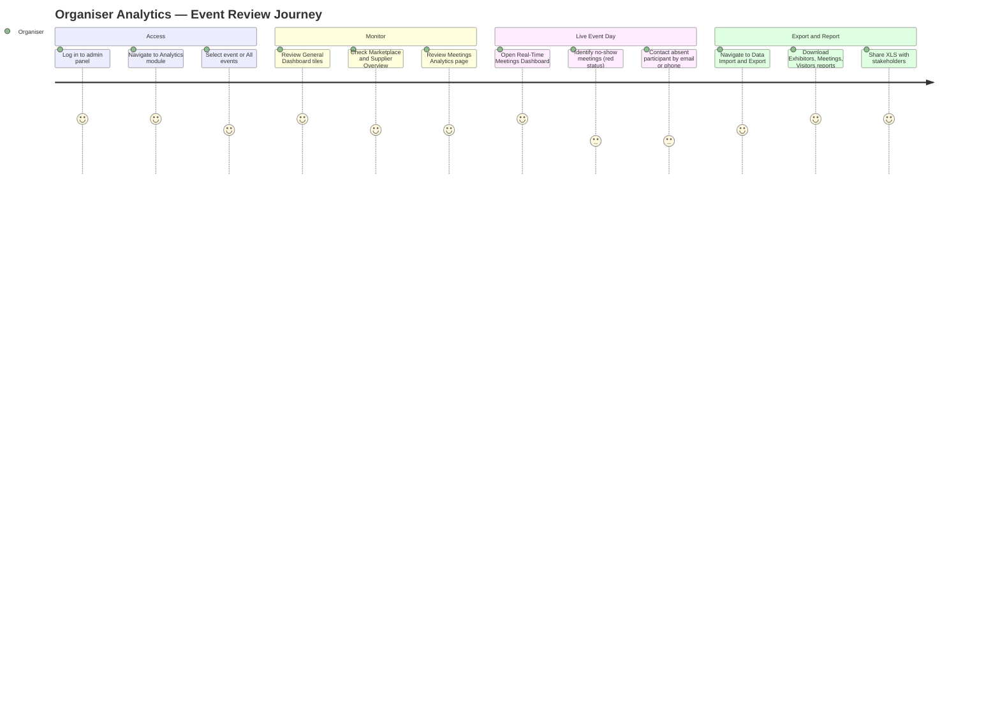
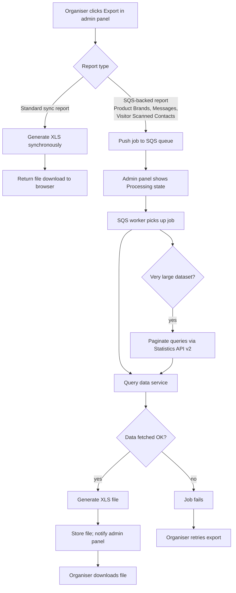
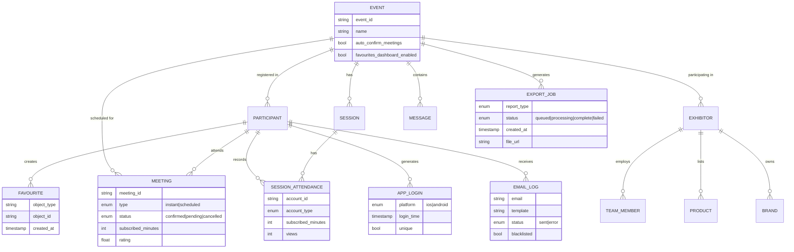
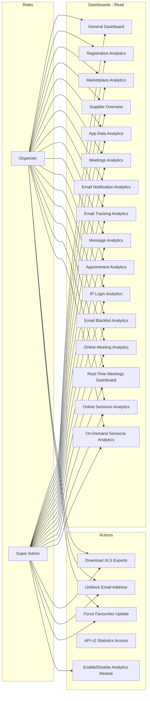

## 1. Product Overview

**Purpose.** Organiser Analytics is ExpoPlatform's data intelligence layer for event organisers. It provides comprehensive, real-time and historical insight into every measurable dimension of an event — registrations, marketplace activity, meetings, sessions, content engagement, mobile usage, and email communications — all accessible from a single module in the admin panel.

**Problem being solved.** Event organisers run complex multi-stakeholder environments where hundreds of variables affect success — exhibitor engagement, attendee activity, meeting conversion, session attendance and revenue. Without a unified analytics module, organisers are forced to guess, rely on fragmented manual exports, or commission bespoke reports. Organiser Analytics solves this by surfacing every key metric in one place, across single events or across all events simultaneously, with exportable reports covering every participant type and interaction.

**Business value.**
- Gives organisers instant visibility into event health without requiring SQL queries or third-party BI tools.
- Exportable reports (25+ types) let event teams share structured data with stakeholders, sponsors and exhibitors.
- The real-time meetings dashboard enables active no-show management during live event days.
- Cross-event ("All events") view supports portfolio-level decisions for multi-event clients.
- Async data collection via SQS (EP-1083, EP-1096, EP-1098) delivers reliable exports even for large datasets, eliminating timeouts.
- Mobile analytics (EP-20705, EP-1110) extend visibility into app-based engagement channels.

**Target users.** Event organisers and their operations teams who need to monitor, optimise and report on event performance. Accessed via the admin panel (`/admin/stat/`).

**User personas.**
- *Event Organiser* — monitors daily registration pace, confirms exhibitor and meeting engagement, tracks revenue. Primary consumer of dashboards and leaderboards.
- *Event Operations Manager* — downloads bulk exports for reconciliation, invoicing, and attendee/exhibitor communications lists.
- *Exhibitor Success Manager* — reviews Supplier Overview to identify underperforming exhibitors and intervene.
- *Content / Programme Manager* — monitors session attendance, on-demand views, speaker popularity.
- *IT / Data Team* — accesses Login Data, IP Login and API statistics exports for security audit and BI ingestion.

**Success metrics.** Organiser adoption rate (% of events with analytics viewed at least weekly); export usage volume; time-to-insight (from event open to first dashboard review); reduction in manual data requests to the EP support team; API pagination performance for large interaction datasets.

## 2. Product Scope

### Included
- **Dashboards** accessible from the admin panel Analytics module: General Dashboard, Registration Analytics, Marketplace Analytics, Supplier Overview, App Data / Mobile App Analytics, Meetings Analytics, Email Notification Analytics, Email Tracking Analytics, Message Analytics, Appointment Analytics, IP Login Analytics, Email Blacklist Analytics.
- **Specialised analytics pages**: Online Meeting Analytics, Real-Time Meetings Dashboard, Online Sessions Analytics, On-Demand Sessions Analytics.
- **Cross-event view**: "All events" selector for portfolio-level data.
- **Exportable reports** (25+ types) under Data Import/Export: Visitors, Buyers, Exhibitors, Pending Exhibitors, Team Members, Speakers, Sessions, Exhibitor Scanned Contacts, Visitor Scanned Contacts, Login Data, Meetings, Seated Meetings, Favourites, Messages, Check-in List, Payments, Exhibitor Interactions, Exhibitor Daily Interactions, Product Brands, Products, RFP Report, Content QR Code Scans, Unique Mobile App Logins, Custom Visitor Reports.
- **Statistics API v2** (`/api/v2/statistics/`) for programmatic access to interaction data, including paginated accounts interactions endpoint (EP-8193).
- **Meetings export API** (`/api/v2/meetings/export`) with last-modified date filter (EP-40013).
- **SQS-based async export pipeline** for high-volume reports (Product Brands, Messages, Visitor Scanned Contacts).
- **Favourites Dashboard** with 30-minute automated recalculation and forced update capability (EP-19897).
- **Mobile analytics** for iOS and Android app usage (EP-20705, EP-1110).

### Excluded
- Raw event configuration (covered by Admin / Platform Core).
- Real-time BI dashboards beyond the platform (Implement BI tool — EP-47158 is In Progress and not yet delivered).
- Financial invoicing and payment gateway operations (covered by Transactions & Purchasing).
- Exhibitor-facing analytics views accessible directly by exhibitors without organiser context.
- Third-party analytics integrations other than the platform's own data pipeline (e.g., Google Analytics GA4 is referenced in the ecosystem but not detailed in these Confluence pages — noted as a source gap).

## 3. User Roles

| Role | Access in Organiser Analytics | Notes / Restrictions |
| --- | --- | --- |
| **Organizer (Admin)** | Full access to all dashboards and export reports for their own event(s) | Can select "All events" for cross-event view; leaderboards hidden in All events mode |
| **Super Admin** | Full access across all client events including global module management | Can enable/disable the Analytics module per event via Module Management |
| **Exhibitor** | No direct access to the Organiser Analytics admin panel | Supplier Overview and Marketplace data is about exhibitors, not accessible by them |
| **Sponsor** | No direct access | Sponsor Category column visible in Supplier Overview; sponsors cannot access the panel |
| **Attendee (Participant / Visitor / Buyer)** | No access | Attendees are subjects of the analytics, not consumers |
| **Speaker** | No access | Speakers appear in leaderboards and session analytics as subjects |
| **Team Member (Exhibitor staff)** | No access | Team Member counts appear in dashboards; no panel access |

> [!INFO] The Analytics module visibility is governed by Module Management. Even when Appointments is turned off in module management, the Meetings Analytics tab remains visible. The module can be toggled at global and per-event level by a Super Admin.

## 4. Feature Inventory

### 4.1 General Analytics Module — Navigation & Global Behaviour

#### Description
The analytics module provides a unified navigation menu at the top of every analytics page, allowing organisers to switch between dashboards and analytical tabs without losing context.

#### Why it exists
Organisers need to move fluidly between registration data, marketplace performance, session engagement and operational metrics. A persistent top-level navigation prevents context loss and reduces the number of clicks to insight.

#### User value
One place to access every dimension of event performance, with a consistent event selector that applies to all views simultaneously.

#### Functional logic
- Event selector: single-select; includes an "All events" option for cross-event portfolio view.
- Leaderboards are hidden when "All events" is selected.
- Almost all graphs span from 2 years before the event start date through to today. The Online now widget is the single exception (always real-time).

#### Preconditions
Organiser is authenticated in the admin panel; Analytics module is enabled in Module Management.

#### Trigger conditions
Staff navigates to the Analytics section of the admin panel.

#### Processing logic
Time range logic for line and bar charts adapts automatically: Daily view for events up to 12 days; Weekly view for 12 days to 12 weeks; Monthly view beyond 12 weeks. Charts display 12 units at a time. Community events default to Monthly. Left/right arrows advance or retreat by 12 units. Initial view displays the segment with the highest value; after page refresh the highest-value segment is re-selected. Switching between daily/weekly/monthly keeps the same calendar period centred.

#### Outputs
Rendered analytics dashboard for the selected event or all events.

#### Dependencies
Event data services; participant and exhibitor registration systems; meeting, session, and messaging platforms; mobile app data pipeline.

#### Configurations
Event selector; date range inherited from event configuration; daily/weekly/monthly view toggle.

#### Validation rules
"All events" selection suppresses leaderboard blocks. Charts always start from 2 years before event (not from "today minus 2 years").

#### Permissions
Organizer role and above.

#### Error handling
If no data exists for the selected period, charts render empty with zero values rather than an error state.

#### Edge cases
First day of an event: average daily views on previous period = 0, so increase/decrease percentage is not shown (division by zero suppressed). Events shorter than one day still render in daily view.

---

### 4.2 General Dashboard

#### Description
The summary view of an event's key entities and activity, displayed as a set of metric tiles, category charts, an activity graph and leaderboards.

#### Why it exists
Organisers need a single-glance health check of their event — how many people registered, how many exhibitors are active, how many meetings are happening — without drilling into separate reports.

#### User value
Immediate situational awareness; the leaderboard surfaces star performers and most engaged users, creating actionable follow-up opportunities.

#### Functional logic
The dashboard renders 16+ distinct blocks. Each block is described below:

| Block | What it shows |
| --- | --- |
| Online now | Participants currently online (real-time) + top 8 user countries |
| Registered people | Total Participant accounts in all statuses as of today |
| Active people | Total Participant accounts in Active status as of today |
| Team member | Total Team Member accounts in all statuses as of today |
| Buyers | Total Buyer accounts in all statuses as of today |
| Organizer news | Total Organizer News items as of today |
| Exhibitor news | Total Exhibitor News items as of today |
| Exhibitors | Total approved Exhibitors as of today |
| Products | Total Products as of today |
| Sessions | Total Sessions as of today |
| Speakers | Total Speaker accounts in all statuses as of today |
| Favourites | Total Favourite actions as of today |
| Conversations | Total chats initiated as of today |
| Participant interest categories | Top 6 Participant Interest Categories + count |
| Exhibitor activity categories | Top 6 Exhibitor Activity Categories + count |
| Activity graph | Cumulative duration in Online Meetings, Online Sessions, Marketplace, and total Online Time |
| Number of meetings | Confirmed / Pending / Cancelled totals as of today |
| Leaderboard | Top participant; most active participant; most popular exhibitor; most popular product; most active buyer; most popular speaker; most popular session; most popular on-demand session; most popular organizer article; most popular exhibitor article; most favourited entity; most communicative user |
| Accounts diagram | Progression over time: Registered Participants, Active Participants, Exhibitors, Team Members, Speakers, Buyers |

#### Preconditions
Event exists; participants/exhibitors are registered.

#### Trigger conditions
Organiser opens General > Dashboard tab.

#### Processing logic
"Online now" is always real-time and ignores start/end date filters. All count tiles (Registered people, Exhibitors, etc.) reflect the state as of "today" regardless of the selected date range start. The Activity graph and Accounts diagram follow the time-range logic described in 4.1.

#### Outputs
Rendered dashboard view; no direct export from this tab.

#### Dependencies
Participant and exhibitor services; meeting service; session service; messaging service; favourites service; content service; real-time presence service.

#### Configurations
Event selector. Leaderboard suppressed for "All events".

#### Validation rules
"Online now" does not respect start/end date. Count tiles always show today's totals regardless of date range selected.

#### Permissions
Organizer role and above.

#### Error handling
Zero counts render as "0" not blank. Leaderboards with no qualifying data are hidden gracefully.

#### Edge cases
If the auto-confirm meetings toggle is on, pending meeting counts are concealed in the meeting summary tile. Leaderboard is entirely hidden when "All events" is selected.

---

### 4.3 Registration Analytics

#### Description
Tracks how registrations of Exhibitors, Team Members and Participants evolve over time, with breakdowns by category, country, interest categories, activity categories, and cumulative revenue.

#### Why it exists
Registration pace and demographic distribution are the primary leading indicators of event success. Organisers need to know not just total registrations but where registrants are coming from and what they are interested in.

#### User value
Enables targeted outreach — if a geographic market is underrepresented, the organiser can act before the event. Revenue tables allow financial forecasting.

#### Functional logic
Three subtabs: Exhibitors, Team Members, Participants. Team Members are not included in the Participants subtab.
Each subtab includes: registration over time (day/week/month/year selector), category breakdown, country breakdown, top 6 interest categories (as of end date), top 6 activity categories (as of end date), cumulative revenue filterable by year or quarter.
Revenue tables show count of registrations and money spent over the same date range.

#### Preconditions
Registrations have occurred; registration form includes category, country, and interest/activity category fields.

#### Processing logic
Interest and activity category counts reflect what is present on the end date (not the start date), making them a snapshot rather than a flow metric.

#### Outputs
Charts and tables rendered on screen; no direct export from Registration Analytics tab (raw data accessible via Visitors/Exhibitors/Team Members export reports).

#### Dependencies
Registration system; payment/transaction service (for revenue data); category and country master data.

#### Configurations
Date range; day/week/month/year granularity for time chart; year/quarter filter for revenue.

#### Validation rules
Team Members excluded from Participants subtab to avoid double-counting of attendees.

#### Permissions
Organizer role and above.

#### Edge cases
First registrations on the first day of an event may produce an empty "previous period" for comparison charts, suppressing percentage change indicators.

---

### 4.4 Marketplace Analytics

#### Description
Shows supplier (exhibitor + team member) performance metrics: totals, interactions, RFP activity, and a Supply vs Demand bubble chart.

#### Why it exists
The marketplace is the commercial heart of most events. Organisers need to know which exhibitors are driving engagement, whether RFP demand matches supply, and how product/brand discovery is performing.

#### User value
Identifies high-performing and under-engaged exhibitors; validates whether the exhibitor mix meets attendee demand; tracks commercial momentum (confirmed meetings, RFP value).

#### Functional logic
Blocks include: Total numbers (Products, Brands, Suppliers over time — switchable to Interactions view); Interactions involving suppliers (unique conversations); Meeting Requests; Confirmed Meetings; Supplier/product/brand totals and averages; RFP statistics; Supply and Demand bubble chart.

The Supply and Demand chart plots product categories on two axes: Y axis = Participant Interest (excludes team members); X axis = Supply (Exhibitor/Supplier Activity and Product categories including team members). Bubble size proportional to number of active products in that category.

RFP block shows: unique request count, total requests generated, average generated per unique request, total RFP value, accepted/pending/declined counts and percentages.

#### Preconditions
Exhibitors, products and brands are configured for the event; RFP module is enabled.

#### Processing logic
All "as of today" totals ignore date range. Interaction counts (conversations, meeting requests) do respect the date range. Supplier totals include both exhibitor and all their team members collectively.

#### Dependencies
Exhibitor service; product/brand service; RFP service; meeting service; messaging service.

#### Configurations
Event selector; date range; day/week/month view toggle for interaction graphs.

#### Permissions
Organizer role and above.

#### Edge cases
If RFP module is not enabled, the RFP blocks render empty or are hidden. The Supply and Demand chart requires both active participants with declared interests and active products with activity categories to be meaningful.

---

### 4.5 Supplier Overview Analytics

#### Description
A per-exhibitor data table showing the complete performance profile of every supplier, searchable and exportable as XLS.

#### Why it exists
Organisers and exhibitor success teams need to assess each exhibitor's engagement level, identify those who are inactive before the event, and provide account managers with talking points for client calls.

#### User value
Single-view supplier health check: one row per exhibitor with every key metric side by side.

#### Functional logic
Search by company name or category. Export Data button produces an XLS of all rows regardless of current search filter.

Columns: Name, Exhibitor Category, Sponsor Category (if enabled), Was Added Date, Last Activity Date, Team Member Number, Profile Views Number, Profile Favorited Number, Active Products Number, Products View Number, Products Favorited Number, Content Publish Number, Content Downloads Number, Chats Number, RFPs Received / Accepted / Declined, Meetings (incoming / pending / canceled / confirmed), Badge Scans.

#### Preconditions
Exhibitors are approved for the event.

#### Trigger conditions
Organiser opens General > Supplier Overview tab.

#### Processing logic
If "All events" is selected, Last Activity Date and Was Added Date reflect the platform-wide latest/first activity, not per-event.

#### Outputs
On-screen searchable table; XLS export.

#### Dependencies
Exhibitor service; product/brand service; badge scan service; meeting service; messaging service; RFP service.

#### Configurations
Event selector; search filter; Export Data button.

#### Permissions
Organizer role and above (delivered in EP-1070 as part of New Analytics UI).

#### Error handling
Export produces all data regardless of search filter state.

#### Edge cases
Sponsor Category column only appears if Sponsor feature is enabled for the exhibitor. Badge Scans = 0 if badge scanning module is not enabled.

---

### 4.6 App Data / Mobile App Analytics

#### Description
Tracks mobile app engagement: logins, page views, favouriting, meeting scheduling, and badge scanning — broken down by iOS/Android, user role, and time period.

#### Why it exists
Mobile apps are a primary engagement channel for exhibitors and attendees during live events. Organisers need to know app adoption rates and in-app behaviour to justify the mobile channel and improve UX.

#### User value
Proves app ROI; identifies which in-app pages are most visited; shows whether badge scanning is being used; benchmarks mobile meeting activity.

#### Functional logic
Top bar: total + unique logins for iOS and Android; total + unique badge scans.
Sections (each with additional filters):

| Section | Description | Key Filter |
| --- | --- | --- |
| Total Mobile App Logins | Total login statistics over time | Login Uniqueness (total vs unique) |
| Total Mobile Page Views | Pages viewed in the app | System pages; Public profile pages; Custom pages; Other system pages |
| Total Favourites | Favourite actions in app | Object type: Exhibitors/Products/Brands/Accounts |
| Total Meeting Appointments | Meetings scheduled via app | — |
| Total Confirmed Meetings | Confirmed meetings via app | — |
| Total Badge Scans | Badges scanned at event | Badge scans uniqueness |

Tooltips on bar charts show total for each bar plus split by iOS/Android. Date coverage note in tooltip varies by view option (daily/weekly/monthly).

#### Preconditions
Mobile app is deployed and enabled for the event (EP-1110). Analytics data collection from mobile app must be active (EP-1127 for new UI).

#### Processing logic
Default filters: both iOS and Android; all user categories/roles; daily view. All graphs follow the 12-unit time-range logic from 4.1. Data is collected on the new UI using the same scheme as the old UI (page visits, views, time spent).

#### Outputs
Bar charts per metric; tooltip breakdowns by OS. No direct XLS export from this page; Unique Mobile App Logins export report available under Data Import/Export.

#### Dependencies
Mobile app event tracking SDK; analytics data pipeline; EP-1110 (data collection); EP-1127 (new UI data collection).

#### Permissions
Organizer role and above.

#### Edge cases
If only one OS is deployed (e.g., iOS-only), Android columns render zero. Badge Scans metric requires badge scanning to be enabled in Module Management.

---

### 4.7 Meetings Analytics

#### Description
Comprehensive overview of all meeting activity for an event: request volumes, online vs offline split, exhibitor engagement, source attribution, initiator breakdown, over-time trends, feedback ratings and leaderboards.

#### Why it exists
Meetings are the primary value exchange at B2B events. Organisers need to demonstrate meeting ROI to exhibitors and identify whether the matchmaking and scheduling systems are working.

#### User value
Quantifies meeting value generated; surfaces top meeting performers for recognition and follow-up; enables identification of exhibitors without any confirmed meetings for outreach.

#### Functional logic

| Block | Description | Notes |
| --- | --- | --- |
| Total Meeting Requests | Total requests with accepted/pending/cancelled breakdown and % | Pending details hidden when auto-confirm toggle is on |
| Count of Online Meetings | Meetings held online | — |
| Count of Offline Meetings | Offline meetings including concierge | — |
| Exhibitors with a Confirmed Meeting | Total exhibitors with ≥1 confirmed meeting | Excludes Round Tables and Speed Networking; each meeting counted once regardless of team members |
| Average Confirmed Meetings per Exhibitor | Avg meetings per exhibitor | Includes regular + concierge, excludes Round Tables and Speed Networking |
| Source | Meeting request source pages | Web: 15+ sources; Mobile App: 5 sources |
| Meeting Initiator | Who initiated meeting requests | Role hierarchy applied (see special cases) |
| Meetings Over Time | Accepted/pending/cancelled per period | Auto-confirm suppresses pending |
| Meeting Feedback | Ratings distribution | — |
| Unique Participants in Meetings | Count over time | Each participant counted once |
| Most Requests Sent | Top 5 senders; show more +5 | Hidden for "All events" |
| Most Requests Received | Top 5 receivers; show more +5 | Hidden for "All events" |

**Special cases (sourced from Confluence):**
- For suppliers: all team member meetings are attributed to the exhibitor; team member names do not appear on leaderboards.
- Role hierarchy for initiator classification: Supplier team member > Buyer > Speaker/Moderator > Participant.
- If a participant's role changes (e.g., from Participant to Buyer), all previous meetings are re-attributed to the new role.
- If a participant later becomes a Team Member, all their meeting history transitions to the exhibitor they belong to.
- Only the meeting initiator is designated as initiator; co-participants are not.
- Both regular and concierge meetings are counted. Concierge meetings are classified as offline.

#### Preconditions
Meetings module is enabled; meetings have been requested.

#### Trigger conditions
Organiser opens General > Meetings tab. Note: this tab is visible even when Appointments is turned off in Module Management.

#### Processing logic
Meetings with auto-confirm toggle active suppress the "Pending" category in all related blocks. "All events" hides Most Requests Sent/Received leaderboard blocks.

#### Outputs
Charts and tables on screen; Meetings and Seated Meetings export reports available in Data Import/Export.

#### Dependencies
Meeting/appointment service; matchmaking service; mobile app meeting data; role/account service.

#### Configurations
Event selector; date range; auto-confirm toggle (affects display of pending data).

#### Permissions
Organizer role and above.

#### Edge cases
Round Tables and Speed Networking are excluded from per-exhibitor meeting counts. Role transitions retroactively re-attribute meetings in the analytics; this may cause historical counts for a user's previous role to change.

---

### 4.8 Email Notification Analytics

#### Description
A log of all platform-generated emails sent to event participants, showing creation time, recipient, template used and delivery status.

#### Why it exists
Organisers and operations teams need to verify that automated platform emails (registration confirmations, meeting notifications, etc.) were delivered successfully and diagnose delivery failures.

#### User value
Quick identification of failed email deliveries; ability to search by recipient address or template to investigate specific issues.

#### Functional logic
Table: Created (timestamp), Email (recipient address), Template (platform email template name), Status (Sent / Error: Unknown error). Filters: email address; template name. Export XLS includes all records regardless of active filters.
Pagination: 5/10/15/20/25/50/100 rows per page with page switcher showing total pages. Sorting available on all four columns.

#### Preconditions
Platform email notifications are configured and have been sent.

#### Processing logic
"Error: Unknown error" indicates a sending failure; no further error classification is exposed in this view. Customer service admin logins are excluded from triggering email notifications that would appear here.

#### Outputs
On-screen filterable table; XLS export.

#### Dependencies
Platform email delivery service (SMTP/SES); email template system.

#### Permissions
Organizer role and above.

#### Error handling
Delivery errors surface as "Error: Unknown error". Root cause investigation requires access to the underlying delivery service logs.

#### Edge cases
Blacklisted email addresses (see 4.11 Email Blacklist Analytics) will show as Error if a platform email was attempted before the blacklist was updated.

---

### 4.9 Email Tracking Analytics

#### Description
Tracks engagement actions on sent emails — opens and link clicks — at the individual recipient level.

#### Why it exists
Delivery confirmation (4.8) only tells you an email was sent. Tracking tells you whether recipients opened it and which links they clicked, enabling engagement measurement for campaigns and platform notifications.

#### User value
Measures email campaign effectiveness; identifies unopened communications for follow-up.

#### Functional logic
Table: Created (timestamp), Email address, Template, Action (Opened / Link — clicked link shown in tooltip). Filters: email address; template. Export XLS. Pagination same as 4.8. Sorting on all four columns.

#### Preconditions
Email tracking pixels/link wrappers must be active in the platform email templates.

#### Processing logic
Link clicks record the specific URL clicked in a tooltip column. Multiple opens or clicks by the same recipient generate separate rows.

#### Outputs
On-screen filterable table; XLS export.

#### Dependencies
Email delivery service with tracking; click-tracking URL wrapper.

#### Permissions
Organizer role and above.

#### Edge cases
Email clients that block tracking pixels (common in enterprise security environments) will suppress "Opened" records, understating open rates.

---

### 4.10 Message Analytics

#### Description
A complete log of all messages sent between participants in the platform's messaging system.

#### Why it exists
Organisers need visibility into messaging volume to understand engagement and to investigate disputes or inappropriate content.

#### User value
Quantifies conversation activity; supports moderation and community management.

#### Functional logic
Table: Message ID, Created (date), From (sender name/details), To (receiver name/details). Pagination: 5/10/15/20/25/50/100 rows. No export button documented for this page. No search filter documented; pagination only.

#### Preconditions
Messaging module is enabled; messages have been sent.

#### Outputs
On-screen paginated table.

#### Dependencies
Messaging service.

#### Permissions
Organizer role and above.

#### Edge cases
Messages between exhibitor team members and participants appear with the sender's role at the time of sending. The Messages export report (Data Import/Export) was reworked to use SQS for reliability (EP-1096).

---

### 4.11 Appointment Analytics

#### Description
A full list of all appointments (meetings) with status, parties, and timing, plus XLS export.

#### Why it exists
Provides a raw, exportable record of every meeting row — more granular than the summary tiles in Meetings Analytics — for reconciliation, operations logistics and post-event reporting.

#### User value
Full meeting roster for operations teams; useful for venue/room planning (Location column) and for status-based filtering.

#### Functional logic
Table: Appointment ID, Created time, Appointment time, Location (online or physical location set by initiator), Initiator, Participants, Status (Incoming / Pending / Confirmed / Cancelled). Export XLS includes all data regardless of filters. Sorting on Appointment ID, Appointment time, Location, Initiator, Participants, Status. Pagination: 5/10/15/20/25/50/100 rows.

#### Preconditions
Meetings module is enabled.

#### Processing logic
"Location" reflects the value set by the meeting initiator — can be a platform virtual room URL, or a free-text physical location.

#### Outputs
On-screen sortable/paginated table; XLS export.

#### Dependencies
Meeting/appointment service.

#### Permissions
Organizer role and above.

#### Edge cases
If Appointments module is turned off in Module Management, this tab is still visible (per Meetings Analytics documentation).

---

### 4.12 IP Login Analytics

#### Description
A timestamped log of every user login, identified by name, IP address and login time. Customer service logins are excluded.

#### Why it exists
Security and compliance monitoring — organisers and IT teams need to identify unusual login patterns (e.g., same account from multiple IPs, logins from unexpected countries).

#### User value
Supports security audits; helps investigate account compromise or unauthorised access.

#### Functional logic
Table: Date-Time, Name (participant or exhibitor), IP. Filter by IP address. Sorting on Date-Time, Name, IP. Pagination: 5/10/15/20/25/50/100 rows. Customer service admin logins are explicitly excluded.

#### Preconditions
Users have logged in to the event frontend.

#### Processing logic
IP address is captured at login time. No geolocation enrichment is applied in this view (raw IP only).

#### Outputs
On-screen filterable table. Login Data export report (Data Import/Export) provides bulk XLS of login records.

#### Dependencies
Authentication service; login event log.

#### Configurations
IP address filter.

#### Permissions
Organizer role and above.

#### Edge cases
Users logging in from VPNs will show the VPN exit IP, not their true location. IPv6 addresses may be shown depending on the user's connection.

---

### 4.13 Email Blacklist Analytics

#### Description
Shows email addresses that have been blocked from receiving platform emails after a bounce event.

#### Why it exists
Persistent bouncing addresses degrade platform email sender reputation. The blacklist prevents repeated delivery attempts and surfaces addresses that need attention (e.g., the organiser should update the participant's email).

#### User value
Allows organisers to identify blocked participant emails and take corrective action (unblock or update the address).

#### Functional logic
An email is blocked when a bounce response is received after a platform email is sent to it. Table: Email, Blocked time, Action (Unblock button per row). Filter by email address. Sorting on Email, Blocked time. Pagination: 5/10/15/20/25/50/100 rows.

#### Preconditions
Email delivery service is configured; at least one bounce has been received.

#### Processing logic
The Unblock action removes the address from the blacklist, allowing subsequent platform emails to be attempted again.

#### Outputs
On-screen filterable/sortable table. No XLS export documented for this page.

#### Dependencies
Email delivery service; bounce handling webhook.

#### Permissions
Organizer role and above.

#### Edge cases
Unblocking a permanently invalid email (e.g., a typo) will result in repeated bounces re-blacklisting it. The organiser should correct the underlying email address in the participant record before unblocking.

---

### 4.14 Online Meeting Analytics

#### Description
Detailed statistics on online (video) meetings across the event — overall totals, per-day breakdowns, and a per-meeting record with participant-level data, exportable to XLS.

#### Why it exists
Organisers need to understand how much engagement happened in virtual meeting rooms — not just meeting count, but actual time spent and unique users reached.

#### User value
Quantifies virtual networking ROI; surfaces detailed per-participant meeting records for post-event follow-up.

#### Functional logic
**General info block:**
- Total subscribed minutes (all users, all meetings)
- Total meetings
- Average participants per meeting
- Average subscribed minutes per meeting
- Number of unique users who had meetings

**Day info block:** same five metrics for a specific selected date.

**Meetings table** (on-screen):

| Column | Description |
| --- | --- |
| Meeting ID | Unique identifier |
| Meeting Date | Date of the meeting |
| Meeting type | Instant or Scheduled |
| Meeting Role | Initiator or Receiver (one initiator; multiple receivers possible) |
| Account ID | User's account ID |
| Account type | Exhibitor Team Member / Visitor / Buyer / Exhibitor owner |
| Account Name/Surname | First and last name |
| Company Name | User's company |
| Account Country | User's country |
| Account Agent | Agent (buyers only) |
| Account Rating | Rating left after meeting |
| Subscribed time | Total connected time in meeting |
| Log in time | Time user joined |
| Log out time | Time user left |
| Participants count | Total participants connected |

**XLS additional columns:**
Creation Date, Creation Time, Appointment Time, Account Last Name, Account Job Title, Account Category, Account Email, Account Phone Number, Account Comment, Account Rating Creation Time, Account Rating Creation Date.

#### Preconditions
Online meetings module is enabled; meetings have been held.

#### Outputs
On-screen stats and table; XLS export.

#### Dependencies
Online meeting/video room service; account service.

#### Permissions
Organizer role and above.

#### Edge cases
Users who join and immediately disconnect may have zero subscribed minutes but still appear in the table. Rating fields are empty if the user did not leave a rating. Meetings export from Data Import/Export provides a similar but differently scoped dataset (includes all meeting types, not just online).

---

### 4.15 Real-Time Meetings Dashboard

#### Description
Live monitoring of all meetings occurring on the current event day, with three tabs (Past, Current, Future) and the ability to identify no-shows in real time.

#### Why it exists
During live event days, the operations team needs to see which meetings are happening right now, whether both parties have joined, and who has not shown up — so they can intervene and minimise no-shows.

#### User value
Real-time no-show management; enables staff to contact absent parties immediately; confirms meeting execution during the event.

#### Functional logic
Three tabs: Past meetings, Current meetings, Future meetings. Search by first name, last name, email or company name across all three tabs.

**Meeting-level columns:**

| Column | Description |
| --- | --- |
| Status indicator | Red = one or both parties absent; Green = both parties in the room |
| Meeting ID | — |
| Date | Date of meeting |
| Time | Time of meeting |
| Subject | Meeting title |
| Description | Meeting description |
| Meeting Run Time | Actual elapsed time from meeting start |
| Meeting Duration | Confirmed duration of the meeting |

**Attendee-level columns (per meeting):**

| Column | Description |
| --- | --- |
| Account type | Initiator or Receiver |
| First Name | — |
| Last Name | — |
| Company Name | — |
| Job Title | — |
| Category | Participant's or Exhibitor's category |
| Email | Email address |
| Phone | Phone number |
| Time in Room | Total time the user stayed in the room |
| Time Joined | Time the user joined the meeting |

#### Preconditions
Meetings module is enabled; event is in live day mode.

#### Processing logic
Status indicator (red/green) updates in real time based on whether each party has joined the virtual room. Red indicates either one party is absent after the meeting start time, or neither party has joined.

#### Outputs
Live dashboard view. No export documented for the Real-Time Dashboard itself; exports available via Meetings and Online Meeting Analytics pages.

#### Dependencies
Online meeting/video room presence service; real-time data feed.

#### Configurations
Search filter (name, email, company).

#### Permissions
Organizer role and above.

#### Edge cases
Meetings in the "Future" tab have no status indicators (not yet started). Meetings in the "Past" tab may show historical status from when they ran. Time Joined = null for parties that never connected.

---

### 4.16 Online Sessions Analytics

#### Description
Statistics on live online sessions (Breakout, Livestream, External) — overall, per day, and per session — with per-attendee detail on click and time spent. Exportable to XLS. On-demand sessions are excluded and reported separately (4.17).

#### Why it exists
Session attendance is a primary KPI for event content programmes. Organisers need to know total time invested in sessions, which sessions were most attended, and who attended each session.

#### User value
Content programme ROI measurement; identifies most and least popular sessions; enables per-session attendance lists for speakers and CPD tracking.

#### Functional logic
**General info:** Total subscribed minutes; Total Breakout minutes; Total Livestream minutes; Total sessions; Average participants/session; Average subscribed minutes/session; Number of unique users.

**Day info:** Total subscribed minutes; Total sessions; Average participants/session; Average subscribed minutes/session; Unique users.

**Sessions table:** Session ID; Session Type (Breakout / Livestream / External); Session Date; Session Title; Participants count; Subscribed time.

Clicking a session expands to show attendee detail: Account ID, Account type (visitor/exhibitor owner/buyer/team member), Account Name/Surname, Company Name, Account Country, Account Agent (buyers only), Subscribed time.

#### Preconditions
Online sessions module is enabled; sessions have been held.

#### Outputs
On-screen stats and expandable table; XLS export.

#### Dependencies
Session/virtual room service; attendance tracking service.

#### Permissions
Organizer role and above.

#### Edge cases
External session type: subscribed time may be zero if the session was hosted on an external platform without an embedded time tracker. Attendees who join and immediately leave appear with near-zero subscribed time.

---

### 4.17 On-Demand Sessions Analytics

#### Description
Statistics on on-demand (recorded/video-on-demand) sessions — views, watch time, and per-session / per-viewer detail, exportable to XLS. Live online sessions are excluded and reported separately (4.16).

#### Why it exists
On-demand content extends event value beyond live days. Organisers need to know how much of the content library is being consumed and by whom.

#### User value
Quantifies post-event content engagement; surfaces most-watched sessions for promotion; informs future content strategy.

#### Functional logic
**General info:** Total On-demand minutes; Total sessions; Total times on-demand sessions were viewed; Average views/session (total views / total sessions); Average participants/session; Average subscribed minutes/session; Number of unique users.

**Day info:** Total sessions; Total views; Average views/session; Average participants/session; Average subscribed minutes/session; Unique users.

**On-demand sessions table** (per user per session): Account ID, Account type, Account Name/Surname, Company Name, Account Country, Account Agent (buyers only), Number of views, Subscribed time.

#### Preconditions
On-demand sessions module is enabled; recordings have been uploaded or generated.

#### Processing logic
"Number of views" counts how many times a user has started watching a session — a user who watches the same session three times contributes 3 views. "Subscribed time" is cumulative across all views by that user.

#### Outputs
On-screen stats and table; XLS export.

#### Dependencies
On-demand video service; view tracking service.

#### Permissions
Organizer role and above.

#### Edge cases
Users who start a session and watch only a few seconds will have a very low subscribed time. The Sessions export report (Data Import/Export) covers session metadata; this page covers attendance/viewing data.

---

### 4.18 Exportable Reports Catalogue

#### Description
A collection of 25+ structured data export reports available under Data Import/Export in the admin panel. High-volume reports (Product Brands, Messages, Visitor Scanned Contacts) are processed via SQS for reliability and speed.

#### Why it exists
Organisers, sponsors, exhibitors and the EP support team regularly need raw data extracts for CRM import, post-event analysis, compliance, and third-party integrations.

#### Why SQS matters
Before EP-1083/EP-1096/EP-1098, large exports ran synchronously and would fail or time out for large events. Moving to SQS-based async processing makes these exports queued, reliable, and decoupled from request timeouts.

#### Functional logic — Report Directory

| Report | Key data included |
| --- | --- |
| Visitors | Visitor/participant profile fields, registration data |
| Buyers | Buyer-specific profile fields and registration data |
| Exhibitors | Exhibitor company profile, approval status, category |
| Pending Exhibitors | Exhibitors in pending/not yet approved status |
| Team Members | Exhibitor team member profiles |
| Speakers | Speaker profiles and session assignments |
| Sessions | Session metadata (title, type, date, capacity) |
| Exhibitor Scanned Contacts | Contacts scanned by exhibitor badge scanners |
| Visitor Scanned Contacts | Contacts scanned by visitor badge scanners (SQS, EP-1098) |
| Login Data | User login records (timestamp, user ID, IP) |
| Meetings | All meetings with status, parties, type, creation and appointment time |
| Seated Meetings | Meetings held at assigned/concierge seating |
| Favourites | Favourite actions by user and object type |
| Messages | All platform messages sender/receiver/content (SQS, EP-1096) |
| Check-in List | Badge check-in records with time and user identity |
| Payments | Payment transaction records |
| Exhibitor Interactions | All interactions (views, chats, meetings) received by exhibitors |
| Exhibitor Daily Interactions | Same as Exhibitor Interactions, broken down by day |
| Product Brands | Brand-level interaction data (SQS, EP-1083) |
| Products | Product-level data including views, favourites, interaction counts |
| RFP Report | RFP requests, statuses and values per exhibitor |
| Content QR Code Scans | QR code scan events on content items |
| Unique Mobile App Logins | One row per unique user who logged in via the mobile app |
| Custom Visitor Reports | Configurable reports based on custom registration form fields |

> [!INFO] Acceptance criteria for SQS-reworked reports (EP-1083, EP-1096, EP-1098): "Given that admin downloads report, When report is downloaded, Then all respective info displays in file." This confirms the output content contract is unchanged; only the pipeline was improved.

#### Preconditions
The relevant module is enabled for the event; data exists (registrations, meetings, etc.).

#### Trigger conditions
Organiser or admin navigates to Data Import/Export and clicks the export button for the desired report type.

#### Processing logic
SQS-based reports are queued and processed asynchronously. The admin panel indicates processing state. Non-SQS reports generate synchronously.

#### Outputs
XLS/CSV file download.

#### Dependencies
SQS queue (for applicable reports); data services per report type; file generation service.

#### Permissions
Organizer and Admin role. Some reports (e.g., Login Data, IP Login) may have additional sensitivity.

#### Error handling
SQS pipeline: if queue processing fails, the report does not generate; organiser can retry. Synchronous reports: timeout errors for very large datasets should prompt migration to SQS.

#### Edge cases
Custom Visitor Reports depend on the custom fields configured in the registration form; if no custom fields are defined, this report is empty or unavailable.

---

### 4.19 Favourites Dashboard

#### Description
A dedicated dashboard showing favouriting activity, with pre-calculated data refreshed every 30 minutes and a manual force-update capability.

#### Why it exists
Querying favourites data in real time across a large event is expensive and slow. Pre-calculation every 30 minutes (EP-19897) gives organisers near-real-time data without performance degradation.

#### Functional logic
New DB table stores pre-calculated favourites data. Automatic recalculation runs every 30 minutes for all events where the Favourites Dashboard is enabled. Manual "Update" button triggers an immediate recalculation.

Admin panel block shows: Last updated time and date; "Update" button (forces immediate recalculation); Loader/spinner shown instead of button while update is in progress. During in-progress updates, all users see the spinner.

#### Preconditions
Favourites Dashboard enabled in Module Management (EP-19897 states "all events where favourites dashboard is turned on").

#### Processing logic
Both automatic 30-minute refresh and manual forced update apply to all events with the feature enabled. The pre-calculated table is the source for the Favourites report export and the dashboard counts visible in the General Dashboard.

#### Outputs
Updated favourites count tiles and charts; spinner during processing.

#### Dependencies
Favourites service; scheduled job runner; DB pre-calculation table.

#### Permissions
Organizer role and above. "Update" button accessible to Organizer.

#### Edge cases
If a force-update is in progress and another organiser tries to initiate another, they will see the spinner. The 30-minute automatic refresh is background and does not interrupt the UI.

---

### 4.20 Statistics API v2

#### Description
The platform's programmatic statistics interface, providing access to interaction data for integration with external BI and reporting tools. Includes paginated response support for accounts interactions (EP-8193).

#### Why it exists
Large clients (particularly Informa EMEA) need to pull statistics programmatically without manual exports. Pagination (EP-8193) was introduced specifically because the accounts interactions endpoint returned unbounded result sets that caused performance issues.

#### Functional logic
Base path: `/api/v2/statistics/`. The accounts interactions endpoint (`/api/v2/statistics/accountsInteractions`) now supports pagination parameters: `page`, `per_page`, `total_pages`, `total_current_page_items`, `total_items`. Code logic inherited from `/api/v2/statistics/accountsPageVisits`. The meetings export endpoint (`/api/v2/meetings/export`) was enhanced with a `last_modified` date filter (EP-40013) so clients can fetch only meetings modified after their last sync, eliminating redundant full-dataset pulls.

#### Preconditions
Client has API access; valid authentication token.

#### Outputs
Paginated JSON responses per API specification.

#### Dependencies
Statistics data store; API gateway; authentication service.

#### Permissions
API-authenticated clients; access gated by client configuration.

#### Edge cases
Clients not using pagination will continue to receive full result sets (backwards compatible). The `last_modified` filter on meetings export is optional; omitting it returns all meetings.

## 5. User Stories Mapping

| Story ID | Title | Summary | Acceptance (from description) | Related Feature | Status |
| --- | --- | --- | --- | --- | --- |
| EP-1064 | (New Analytics UI) Dashboard page basic | Implement new analytics UI dashboard for mobile/tablet with global analytics (cross-event) | New analytics module global for all events per client; top menu icon opens analytics with "All events" filter applied; mobile/tablet responsive | 4.2 General Dashboard | COMPLETE |
| EP-1067 | (New Analytics UI) Content | New UI for content analytics pages | Same global cross-event module behaviour; new UI design adaptation applied | 4.2 General Dashboard / 4.3 Registration | COMPLETE |
| EP-1070 | (New Analytics UI) Supplier Overview | Supplier Overview in organiser dashboard | Supplier Overview tab added with full per-exhibitor data table and XLS export | 4.5 Supplier Overview | COMPLETE |
| EP-1083 | Product Brands export rework | Rework Product Brands export via SQS for speed and stability | Given admin downloads report, When report downloaded, Then all info displays in file | 4.18 Exportable Reports (Product Brands) | COMPLETE |
| EP-1096 | Messages export rework | Rework Messages export via SQS | Same acceptance criteria as EP-1083 | 4.18 Exportable Reports (Messages) | COMPLETE |
| EP-1098 | Visitor Scanned Contacts export rework | Rework Visitor Scanned Contacts export via SQS | Same acceptance criteria as EP-1083 | 4.18 Exportable Reports (Visitor Scanned Contacts) | COMPLETE |
| EP-1110 | Analytic data collection from mobile apps | Collect analytics from iOS and Android apps | Mobile app analytics data available in admin panel | 4.6 App Data / Mobile App | COMPLETE |
| EP-1127 | Analytic data collection on New UI | Implement same data collection scheme (page visits, views, time spent) for new UI as old UI | Page visits, views and time spent collected for new UI | 4.1 General Behaviour; 4.6 | COMPLETE |
| EP-8193 | EMEA: Introduce Pagination — Interactions API | Add pagination to accounts interactions API endpoint | Pagination params (page, per_page, total_pages, etc.) present in accountsInteractions response | 4.20 Statistics API v2 | COMPLETE |
| EP-9617 | (New Analytics) Dashboard fixes | Fixes for new analytics dashboard blocks | Online now, registered/active people, team members, buyers blocks corrected per spec | 4.2 General Dashboard | COMPLETE |
| EP-9620 | (New Analytics) Content fixes | Fixes for new analytics content/registration blocks | Organiser news, exhibitor news, registration charts corrected per spec | 4.3 Registration Analytics | COMPLETE |
| EP-14482 | Statistics API v2 | Build Statistics API v2 | Statistics API v2 operational | 4.20 Statistics API v2 | COMPLETE |
| EP-19897 | Favorites Dashboard — Optimize data load time | Pre-calculate favourites data; 30-min auto-refresh; manual force-update | Pre-calculated table created; 30-min job runs; UI shows last updated + Update button + spinner | 4.19 Favourites Dashboard | COMPLETE |
| EP-20705 | Mobile analytics page | New mobile analytics page replacing existing App Data page | Mobile analytics page with unified graph structure, total/unique app logins, badge scans, page views, actions | 4.6 App Data / Mobile App | COMPLETE |
| EP-24020 | Reporting run 2024 | 2024 reporting improvements | See linked Google Sheets for scope | 4.18 Exportable Reports | In Progress |
| EP-40013 | /api/v2/meetings/export — New parameter for IMEX | Add last_modified date filter to meetings export API | last_modified_from and last_modified_to params accepted; response filtered accordingly | 4.20 Statistics API v2 | COMPLETE |
| EP-47158 | Implement BI tool | Introduce BI tool for advanced analytics | Linked to Platform General Performance Analytics Specifications | Future scope | In Progress |
| EP-10562 | Web secure fixes | Security fixes for frontend, admin panel and server | VAPT report findings resolved in web frontend and admin panel | 4.1 (security posture) | COMPLETE |
| EP-10563 | Applications secure fixes | Security fixes for iOS and Android applications | VAPT report findings resolved in mobile apps | 4.6 (security posture) | COMPLETE |
| EP-10561 | VAPT report / secure fixes (Epic) | Address VAPT-identified security issues across the platform | All VAPT sub-items resolved | Platform-wide | COMPLETE |

## 6. End-to-End Workflows

### User journey — organiser reviewing event performance

### System workflow — report export pipeline

### Happy path
Organiser logs in to admin panel → navigates to Analytics module → selects target event → reviews General Dashboard (registrations, meetings, online count) → opens Supplier Overview and searches for a specific exhibitor → downloads XLS report via Data Import/Export → receives file immediately (standard) or waits for SQS job to complete (large report) → shares file with client.

### Alternate paths
- Organiser selects "All events" to see portfolio-level data; leaderboards are hidden but all aggregate metrics remain visible.
- Operations team opens Real-Time Meetings Dashboard on live event day to monitor meeting room occupancy and contact no-shows.
- Technical team queries Statistics API v2 programmatically with `last_modified` filter on the meetings export endpoint to sync only recently changed records.
- Organiser uses Online Meeting Analytics for post-event video meeting analysis, or Online Sessions Analytics for session attendance review.

### Exception paths
- SQS export job fails: admin panel shows no completed file; organiser retries. If failure persists, EP support investigates the queue.
- Data not appearing in a chart: module may be disabled in Module Management; or no data exists yet for the selected event/date range.
- Pending meeting data hidden: auto-confirm meetings toggle is active for the event.

### Recovery paths
- Failed SQS export → retry via the export button.
- Missing chart data → verify the relevant module is enabled in Module Management; check event date range.
- "All events" selected accidentally → re-select a specific event to restore leaderboard blocks.
- Blacklisted email blocking reports → unblock via Email Blacklist Analytics and resend platform notification.

## 7. Business Rules Engine

| # | Rule | Condition | Exception / Priority | Conflict resolution |
| --- | --- | --- | --- | --- |
| BR-1 | Leaderboards are hidden when "All events" is selected | Event selector = All events | Leaderboards require single-event context | Leaderboard blocks removed from UI; all other metrics remain |
| BR-2 | "Online now" is always real-time; date range filters do not apply to it | Always | Single exception to date-range filtering | This block ignores start/end date entirely |
| BR-3 | Count tiles (Registered people, Exhibitors, etc.) show today's state regardless of date range start | Always | Date range does not filter these snapshot tiles | Today's count is always shown |
| BR-4 | Chart time unit auto-adapts: Daily ≤12 days; Weekly 12d–12w; Monthly >12w | On chart render | Community events default to Monthly regardless of event length | Longest applicable unit takes precedence for community events |
| BR-5 | Interest/Activity category counts reflect the end date, not a range | On Registration Analytics render | These are snapshots not flows | End-date snapshot always used |
| BR-6 | Team Members are not included in the Participants subtab of Registration Analytics | Always | Team Members have their own subtab | Double-counting prevented |
| BR-7 | Auto-confirm meetings toggle suppresses pending meeting data across all related analytics blocks | When auto-confirm toggle is on | Applies to that specific event; All events view also suppresses pending for events with the toggle on | Pending category hidden from Meetings Analytics and Meeting tiles |
| BR-8 | Round Tables and Speed Networking are excluded from per-exhibitor confirmed meeting counts | Always | All other meeting types included | These meeting types are tracked separately from 1-to-1 meeting metrics |
| BR-9 | Supplier meeting analytics attributes team member meetings to their exhibitor | Always | Team member names do not appear on meeting leaderboards | Exhibitor receives credit for all team member meetings |
| BR-10 | Role hierarchy governs meeting initiator classification: Supplier TM > Buyer > Speaker/Moderator > Participant | On role change or role-based meeting attribution | Retroactive — role change re-attributes all historical meetings | Highest role always wins; previous role counts transferred on role change |
| BR-11 | Favourites Dashboard data refreshes automatically every 30 minutes | Feature enabled | Manual force-update triggers immediate recalculation | During update, all users see spinner; button replaced by spinner |
| BR-12 | SQS-backed reports (Product Brands, Messages, Visitor Scanned Contacts) are processed asynchronously | On export request | Standard reports remain synchronous | If SQS job fails, organiser retries |
| BR-13 | Customer service admin logins are excluded from IP Login Analytics | Always | No exceptions | These logins are filtered out at the log-recording level |
| BR-14 | An email is added to the blacklist when a bounce is received | On bounce event | Organiser can unblock; re-bounce re-blacklists | Unblock + email correction required to permanently resolve |
| BR-15 | Initial chart view defaults to the segment with the highest value | On first page load | After refresh: returns to highest value | Page refresh resets to highest-value segment, not last-viewed |

## 8. Data Model

### Entity-relationship diagram

### Data inputs
Registration forms; meeting scheduler; session attendance tracking; mobile app event SDK; email delivery service; badge scan system; payment service; SQS export pipeline.

### Data outputs
Dashboard metric tiles; charts and graphs; XLS/CSV export files; Statistics API v2 JSON responses.

### Key data objects
- **Event**: the top-level context for all analytics; governs date range, module flags, and cross-event aggregation.
- **Participant / Exhibitor / Team Member / Buyer / Speaker**: the subject accounts whose activities are tracked.
- **Meeting**: a confirmed, pending or cancelled appointment between two or more parties; carries subscribed time and rating.
- **Session / SessionAttendance**: an online or on-demand session and the attendance record per user.
- **ExportJob**: an asynchronous report generation task with lifecycle states.
- **EmailLog**: a record of a platform-sent email including delivery status and blacklist state.

### Lifecycle states (Export Job)

```mermaid
stateDiagram-v2
  [*] --> Queued : Organiser triggers export
  Queued --> Processing : SQS worker picks up job
  Processing --> Complete : File generated successfully
  Processing --> Failed : Data query or generation error
  Complete --> [*] : Organiser downloads file
  Failed --> Queued : Organiser retries export
  note right of Processing : Async - UI shows spinner<br/>or "Processing" state
  note right of Complete : File URL available<br/>for download
  note right of Failed : Organiser can retry;<br/>EP support investigates<br/>persistent failures
```

## 9. Permissions Matrix

### Permission flow

### Role × Capability table

| Capability | Attendee / Visitor / Buyer | Exhibitor / Team Member | Speaker | Organizer | Super Admin |
| --- | --- | --- | --- | --- | --- |
| View General Dashboard | No | No | No | Yes | Yes |
| View Registration Analytics | No | No | No | Yes | Yes |
| View Marketplace / Supplier Overview | No | No | No | Yes | Yes |
| View App Data Analytics | No | No | No | Yes | Yes |
| View Meetings Analytics | No | No | No | Yes | Yes |
| View Email / Message / IP Analytics | No | No | No | Yes | Yes |
| View Real-Time Meetings Dashboard | No | No | No | Yes | Yes |
| View Online / On-Demand Session Analytics | No | No | No | Yes | Yes |
| Download export reports (Data Import/Export) | No | No | No | Yes | Yes |
| Unblock email in Email Blacklist | No | No | No | Yes | Yes |
| Force Favourites Dashboard update | No | No | No | Yes | Yes |
| Enable/disable Analytics module (Module Management) | No | No | No | No | Yes |
| Access Statistics API v2 | No | No | No | API-credentialed | Yes |

> [!INFO] Exhibitors and Attendees are subjects of the analytics data. They cannot access the Organiser Analytics admin panel. Their data appears in reports but only organisers and admins can view or export it.

## 10. Integrations

| Integration | Purpose | Trigger | Data exchanged | Failure handling | Retry | Security |
| --- | --- | --- | --- | --- | --- | --- |
| **SQS (AWS Simple Queue Service)** | Async processing of large report exports (Product Brands, Messages, Visitor Scanned Contacts) | Organiser triggers export in admin panel | Export job parameters (report type, event ID, filters) queued; generated file URL returned | Job fails silently; organiser retries export; persistent failures escalated to EP support | Manual retry via export button | Authenticated via AWS IAM; queue access restricted to EP services |
| **Statistics API v2** (`/api/v2/statistics/`) | Programmatic access to interaction and attendance data for BI tools and client integrations | API client request (e.g., IMEX/Informa EMEA) | Paginated JSON (accountsInteractions, accountsPageVisits) | API returns error code; client retries | Client-controlled retry; pagination prevents unbounded payloads | API authentication token required |
| **Meetings Export API** (`/api/v2/meetings/export`) | Incremental meeting data sync for external systems | API client request with optional `last_modified` filter | JSON array of meeting records, filtered by last modification date | Standard HTTP error response | Client retries; `last_modified` filter reduces retry cost | API authentication token required |
| **Mobile App Analytics SDK** | Collects in-app event data (logins, page views, badge scans, favourites, meeting actions) from iOS and Android | User interactions within the mobile app | Event types, timestamps, account IDs, platform type (iOS/Android) | Lost events not recovered; SDK fires-and-forgets; significant data gaps would require SDK patch | Automatic SDK retry on transient network errors | App authentication token; data sent over HTTPS |
| **Platform Email Delivery Service** | Sends platform-generated emails; records delivery status and bounce events | Platform events (registration, meeting notification, etc.) | Email payload (to, template, body); delivery status (sent/error); bounce signal | Bounce triggers blacklist update; delivery error recorded in Email Notification Analytics | No automatic retry after error; organiser can unblock and re-trigger platform notification | Authenticated SMTP/SES channel; sender domain verification |
| **Email Tracking Service** | Tracks email open and link-click events | Recipient opens email or clicks tracked link | Open event + timestamp; link-click event + URL + timestamp | If tracking pixel blocked by email client, open event not recorded | None (passive tracking) | Tracking pixel URL served over HTTPS |
| **Badge Scanning System** | Captures badge scan events at exhibitor booths and event entry | Physical badge scan action at scanner hardware | Scan timestamp, scanned badge ID, scanning account ID | Missed scans are lost (no retroactive scan recovery) | None | Local hardware + sync to platform over authenticated API |
| **BI Tool (EP-47158)** | Advanced analytics and reporting beyond the built-in dashboards | In Progress — not yet delivered | TBD per Platform General Performance Analytics Specifications | TBD | TBD | TBD |

> [!WARN] Google Analytics / GA4 integration is referenced in the broader ExpoPlatform ecosystem but is not detailed in the Organiser Analytics Confluence pages. If GA4 event tracking is implemented for the frontend, the collected data does not feed back into the Organiser Analytics dashboards — those are powered by EP's own data pipeline.

## 11. Notifications

Organiser Analytics is primarily a read/export module. It does not itself dispatch outbound notifications to participants. The notification-relevant behaviours within the module are:

| Notification / Signal | Type | Recipient | Timing | Notes |
| --- | --- | --- | --- | --- |
| Export ready (SQS-backed reports) | In-app state change (admin panel UI) | Organiser who triggered export | When SQS job completes | No email/push sent; organiser must return to the export page to download |
| Favourites Dashboard update in progress | In-app spinner (admin panel UI) | All users viewing the Favourites Dashboard | During the 30-min auto-refresh or force-update | Button replaced by spinner while processing; restores on completion |
| Email delivery failure alert | Surfaced in Email Notification Analytics table | Organiser (must actively check the table) | Discoverable at any time; no push notification | Status column shows "Error: Unknown error" |
| Email blacklist event | Surfaced in Email Blacklist Analytics table | Organiser (must actively check) | Discoverable at any time | No automatic alert to organiser on new blacklist entry |

> [!INFO] Platform-generated emails to participants (meeting confirmations, registration, etc.) are tracked in Email Notification Analytics and Email Tracking Analytics. Organiser Analytics surfaces the results of those emails but does not send them. The notification system itself belongs to the User Engagement / Communications product.

## 12. Reporting & Analytics

This section is the functional core of the product. It catalogues every report surface by type, inputs, metrics, calculation methods, filters, and export options.

### Dashboard Reports

#### General Dashboard

| Aspect | Detail |
| --- | --- |
| Inputs | Participant/exhibitor registrations; meeting records; session records; content items; chat messages; favourites; real-time presence |
| Key Metrics | Online now; Registered/Active/Team Member/Buyer/Speaker counts; Exhibitor count; Product/Session counts; Favourites; Conversations; Meeting status totals; Top interest/activity categories |
| Calculations | Count tiles: snapshot as of today. Online now: real-time presence query. Leaderboard: ranking by count (views/meetings/favourites/chats) per entity per event. Activity graph: cumulative sum over time buckets. |
| Filters | Event selector (single or All events); date range (inherited from chart time-range logic) |
| Export | No direct export; underlying data accessible via individual export reports |

#### Registration Analytics

| Aspect | Detail |
| --- | --- |
| Inputs | Registration records (Participant, Exhibitor, Team Member); payment/revenue records; category and country profile fields |
| Key Metrics | Registration count over time; category distribution; country distribution; top 6 interest categories; top 6 activity categories; cumulative revenue |
| Calculations | Count over time: events in the period grouped by selected granularity (day/week/month/year). Category/country: distinct count of registrations per value. Interest/activity categories: count of category assignments present on the end date. Revenue: sum of payments by registration type filtered by year/quarter. |
| Filters | Event selector; date range; time granularity (day/week/month/year); year/quarter for revenue |
| Export | Visitors, Buyers, Exhibitors, Team Members, Speakers reports via Data Import/Export |

#### Marketplace Analytics

| Aspect | Detail |
| --- | --- |
| Inputs | Exhibitor/product/brand records; conversation records; meeting records; RFP records; interest/activity category assignments |
| Key Metrics | Total Suppliers/Products/Brands; Unique Conversations; Meeting Requests; Confirmed Meetings; Supplier/Product/Brand totals and averages; Favourites; Profile Views; RFP counts and value; Supply vs Demand |
| Calculations | Totals: snapshot today counts. Interactions: count over date range. RFP Avg generated = total sent / unique requests. Supply/Demand: participant interest count (Y) vs exhibitor supply count (X), bubble = active product count. |
| Filters | Event selector; date range; day/week/month view for interaction graphs |
| Export | Products, RFP Report, Exhibitor Interactions, Exhibitor Daily Interactions via Data Import/Export |

#### Supplier Overview Analytics

| Aspect | Detail |
| --- | --- |
| Inputs | Exhibitor profiles; team members; products; conversations; meetings; RFPs; badge scans; content uploads and downloads |
| Key Metrics | Per-exhibitor: profile views/favourites; product views/favourites; content publish/download; chats; RFP received/accepted/declined; meetings by status; badge scans |
| Calculations | All metrics are event-scoped counts. Team member metrics roll up to the exhibitor. |
| Filters | Search by company name or category |
| Export | XLS via "Export Data" button (all rows, ignores current search filter) |

#### App Data / Mobile App Analytics

| Aspect | Detail |
| --- | --- |
| Inputs | Mobile app SDK events: login (iOS/Android), page view, favourite action, meeting request, meeting confirm, badge scan |
| Key Metrics | Total + unique app logins; total page views; total favourites; total meeting appointments; total confirmed meetings; total badge scans |
| Calculations | Total: raw event count. Unique: distinct user count. All metrics grouped by time bucket (daily/weekly/monthly). |
| Filters | iOS/Android toggle; user category/role; daily/weekly/monthly; page type filter; object type filter (favourites); badge scan uniqueness |
| Export | Unique Mobile App Logins report via Data Import/Export |

#### Meetings Analytics

| Aspect | Detail |
| --- | --- |
| Inputs | Meeting records (status, type, source, initiator, participants, feedback ratings); account role records |
| Key Metrics | Total Meeting Requests; Online/Offline meeting counts; Exhibitors with confirmed meeting; Avg confirmed meetings/exhibitor; Source breakdown; Initiator breakdown; Meeting feedback ratings; Unique participants over time; Top senders/receivers |
| Calculations | Confirmed meeting counts exclude Round Tables and Speed Networking. Per-exhibitor count includes team member meetings (de-duped to exhibitor). Role hierarchy applied retroactively on role change. |
| Filters | Event selector; date range; auto-confirm toggle (hides pending) |
| Export | Meetings export; Seated Meetings export; Online Meeting Analytics XLS |

### Specialised Analytics Reports

#### Online Meeting Analytics

| Aspect | Detail |
| --- | --- |
| Inputs | Online meeting session records (join/leave events, duration, rating) |
| Key Metrics | Total subscribed minutes; total meetings; avg participants/meeting; avg subscribed minutes/meeting; unique users |
| Calculations | Subscribed minutes: sum of (log-out time – log-in time) per participant per meeting. Average participants = total participant-meeting records / total meetings. |
| Filters | Event selector; date selector for Day info |
| Export | XLS (on-screen columns + 10 additional columns including email, phone, category, job title, rating details) |

#### Real-Time Meetings Dashboard

| Aspect | Detail |
| --- | --- |
| Inputs | Real-time meeting room presence signals; meeting schedule |
| Key Metrics | Status (red/green per meeting); meeting run time vs confirmed duration; time in room and time joined per attendee |
| Calculations | Meeting Run Time: elapsed time from scheduled start. Status: real-time presence of both parties in the virtual room. |
| Filters | Tab (Past/Current/Future); search by first name/last name/email/company name |
| Export | No direct export from this page |

#### Online Sessions Analytics

| Aspect | Detail |
| --- | --- |
| Inputs | Session attendance records (join/leave timestamps by session type: Breakout/Livestream/External) |
| Key Metrics | Total subscribed minutes (overall, Breakout, Livestream); total sessions; avg participants/session; avg subscribed minutes/session; unique users |
| Calculations | Average participants = participant count / total sessions. Average subscribed minutes = total subscribed minutes / total sessions. |
| Filters | Event selector; date selector for Day info |
| Export | XLS (session-level and attendee-level data combined) |

#### On-Demand Sessions Analytics

| Aspect | Detail |
| --- | --- |
| Inputs | On-demand view events (start, duration, user identity) |
| Key Metrics | Total on-demand minutes; total sessions; total views; avg views/session; avg participants/session; avg subscribed minutes/session; unique users |
| Calculations | Average views/session = total views / total on-demand sessions. Each user's multiple views of the same session counted separately in total views. |
| Filters | Event selector; date selector for Day info |
| Export | XLS (per-user per-session: account details, view count, subscribed time) |

### Tabular / Log Analytics

| Page | Inputs | Columns / Metrics | Filters | Export |
| --- | --- | --- | --- | --- |
| Email Notification Analytics | Email delivery log | Created, Email, Template, Status (Sent/Error) | Email address; template name | XLS (all data, ignores filters) |
| Email Tracking Analytics | Email open/click events | Created, Email, Template, Action (Opened/Link+URL) | Email address; template name | XLS |
| Message Analytics | Platform messaging log | Message ID, Created, From, To | None documented | None documented |
| Appointment Analytics | Meeting/appointment records | Appointment ID, Created time, Appointment time, Location, Initiator, Participants, Status | None documented | XLS |
| IP Login Analytics | Authentication log | Date-Time, Name, IP | IP address | Login Data export report |
| Email Blacklist Analytics | Email bounce/block log | Email, Blocked time, Unblock action | Email address | None documented |

## 13. Configuration Guide

| Setting | Where | Effect | Who |
| --- | --- | --- | --- |
| Analytics module on/off | Module Management > Analytics | Enables or disables the Analytics section in the admin panel for the event | Super Admin |
| Event selector | Analytics navigation bar | Scopes all dashboards and charts to the selected event; "All events" aggregates across the client's portfolio | Organizer |
| Auto-confirm meetings toggle | Event settings > Meetings | When on: suppresses pending meeting counts in Meetings Analytics and General Dashboard tile | Organizer / Super Admin |
| Favourites Dashboard enabled | Module Management | Activates the Favourites Dashboard and triggers the 30-minute auto-refresh job | Super Admin |
| Force Favourites Update button | Favourites Dashboard admin block | Triggers immediate recalculation of pre-calculated favourites table for all enabled events | Organizer |
| Export report type selection | Data Import/Export | Selects which of the 25+ report types to generate | Organizer |
| Chart time granularity (day/week/month/year) | Individual chart controls | Changes time bucket size for registration, interaction and meeting charts | Organizer |
| Revenue filter (year/quarter) | Registration Analytics | Scopes the cumulative revenue table to a specific year or quarter | Organizer |
| Email blacklist unblock | Email Blacklist Analytics > Action column | Removes a specific email address from the bounce blacklist | Organizer |
| IP login filter | IP Login Analytics | Filters the login table to a specific IP address | Organizer |
| App OS filter | App Data Analytics | Filters to iOS, Android, or both | Organizer |
| Statistics API pagination | API request parameters | Controls page size and page number for API v2 responses (`page`, `per_page`) | API client / developer |
| Meetings export `last_modified` filter | API parameter on `/api/v2/meetings/export` | Returns only meetings modified after the specified date, reducing sync payload | API client / developer |

## 14. Edge Cases

### User edge cases
- An organiser selects "All events" and expects to see leaderboard data — leaderboards are always hidden in this mode and the organiser must select a specific event.
- An organiser refreshes the chart page expecting to continue from where they left off — the page always resets to the highest-value segment after a refresh.
- An organiser triggers a force-update of the Favourites Dashboard during a live event and expects instantaneous data — the update is asynchronous and the spinner will show until it completes; all other users also see the spinner.
- A new user without historical data queries the Registration Analytics for a just-launched event — "previous period" comparison charts show no percentage change because the prior period value is zero (division by zero suppressed).

### Data edge cases
- A participant's role changes mid-event (e.g., from Participant to Team Member): all their historical meeting records are retroactively re-attributed to the exhibitor they now belong to, changing historical meeting counts for the participant's previous role.
- A meeting is categorised as "Concierge" — it counts in offline meeting totals and in general meeting analytics but does not affect the per-exhibitor confirmed meeting count logic for Round Table/Speed Networking exclusions.
- On-demand sessions: a user watches the same session 10 times — all 10 views are counted in "Total views" but only 1 unique user is recorded.
- Interest/activity category snapshots in Registration Analytics reflect the end date, so if a participant removes a category interest before the report is viewed, it will not appear even if it was present during the event.

### Workflow edge cases
- An organiser opens the Meetings Analytics tab even when the Appointments module is turned off in Module Management — this tab remains visible regardless of the module toggle.
- Export of a large Visitor Scanned Contacts report via SQS: the file is not immediately available; the organiser must return to the export page after the job completes.
- The "Show more" button in Meetings Analytics leaderboards (Most Requests Sent/Received) adds 5 results at a time — if the list is very long, the organiser must click repeatedly to see all entries.

### Integration edge cases
- Mobile app tracking pixel blocked by enterprise security: open events in Email Tracking Analytics will be under-counted.
- Statistics API v2 client not using pagination: for events with very high interaction volumes, response sizes may be large; the EP-8193 pagination was introduced specifically for this scenario but is not enforced as mandatory.
- Badge scanning device loses network during event: badge scans are not retroactively synced if the local device buffer is lost; gaps in Check-in List report.
- BI tool (EP-47158) is In Progress — any integrations designed around it should account for the fact that it is not yet delivered.

### Permission edge cases
- An exhibitor representative asks for a copy of the Supplier Overview data — only organisers can access and export this; exhibitors must be provided a summary by the organiser.
- An organiser with access to "All events" view sees aggregate data across all events belonging to that client — if the organiser should only see their own event, the event selector must be used explicitly.

### Concurrency edge cases
- Two organisers trigger simultaneous Favourites Dashboard force-updates: the second trigger is handled by the job scheduler; both users see the spinner until the single in-progress update completes.
- Two organisers run the same SQS-backed export simultaneously: two separate jobs are queued; both will complete (possible duplicate files).

### Event-lifecycle edge cases
- Analytics data from 2 years before the event start date is visible in charts — for very old events, this includes pre-event lead-up data which may look unusual.
- Community events default to Monthly time granularity — a community event with only a few weeks of data may show only 1–2 monthly bars rather than the expected 12.
- First day of an event: daily/weekly/monthly averages comparing to a "previous period" with zero data will suppress the percentage change indicator rather than showing infinity.

## 15. FAQs

**What is the difference between Online Meeting Analytics and the Meetings Analytics tab?**
Meetings Analytics (under General) provides a broad overview of all meetings (online and offline), including source attribution, initiator breakdown, leaderboards, and over-time trends. Online Meeting Analytics (a separate page) provides granular per-session video room data including exact log-in/log-out times, subscribed minutes per participant, and ratings. Use Meetings Analytics for high-level KPIs; use Online Meeting Analytics for a participant-level audit of video room usage.

**Why is my leaderboard not showing?**
Leaderboards are hidden when "All events" is selected in the event dropdown. Select a specific event to see leaderboard data.

**The Meetings Analytics page shows pending meetings, but I have auto-confirm meetings enabled — is this correct?**
No — when auto-confirm is enabled for an event, the pending meeting count and breakdown should be hidden. If you see pending data for the auto-confirm event, verify the toggle is active in event settings, or refresh the page.

**An exhibitor's meeting count changed retrospectively — why?**
If a participant who had meetings was promoted to an Exhibitor Team Member, their meeting history is re-attributed to the exhibitor under the role hierarchy rule. This is by design and can cause historical counts to shift.

**My SQS-backed export (Product Brands / Messages / Visitor Scanned Contacts) never completed — what do I do?**
Wait a few minutes and refresh the export page. If the file is still not available, retry the export. If the issue persists, contact EP support to investigate the SQS queue.

**Why does "Registered people" on the dashboard show a number that doesn't match my date range?**
Snapshot metrics (Registered people, Active people, Exhibitors, Products, etc.) always reflect today's state, regardless of the date range you have selected. The date range only applies to trend charts and time-based graphs.

**How do I see which exhibitors have no confirmed meetings?**
Use the Supplier Overview Analytics tab and look for exhibitors where "Meetings (confirmed)" = 0. You can also cross-reference with the Exhibitors with a Confirmed Meeting count on Meetings Analytics to know the universe.

**Can exhibitors access their own performance data?**
No — Organiser Analytics is exclusively accessible from the admin panel by organisers and super admins. Exhibitors must request data from the organiser.

**How often does the Favourites Dashboard update?**
Automatically every 30 minutes. You can force an immediate update by clicking the "Update" button in the Favourites Dashboard admin block. The "Last updated" timestamp shows the most recent successful recalculation.

**What is the difference between Online Sessions Analytics and On-Demand Sessions Analytics?**
Online Sessions covers live virtual sessions (Breakout, Livestream, External) — real-time attendance. On-Demand Sessions covers recorded/video-on-demand content viewed after the fact. They are tracked separately and each has its own analytics page.

**I need to filter meetings by last-modified date for an API integration — is this supported?**
Yes — the `/api/v2/meetings/export` endpoint supports `last_modified_from` and `last_modified_to` parameters (EP-40013), allowing incremental synchronisation without re-fetching the full dataset.

**The Email Blacklist Analytics shows an email address I want to unblock — will it stay unblocked?**
Clicking "Unblock" removes the address from the blacklist and allows future platform emails to be sent. However, if the underlying email address is genuinely invalid or the mailbox is full, a new bounce will re-blacklist it. Update the participant's email address in their profile before unblocking to avoid an immediate re-block.

**What does a red circle in the Real-Time Meetings Dashboard mean?**
A red status indicator means that either one party has not shown up after the meeting start time, or neither party has joined the virtual room yet. Green means both parties are present. This view is only meaningful on live event days.
