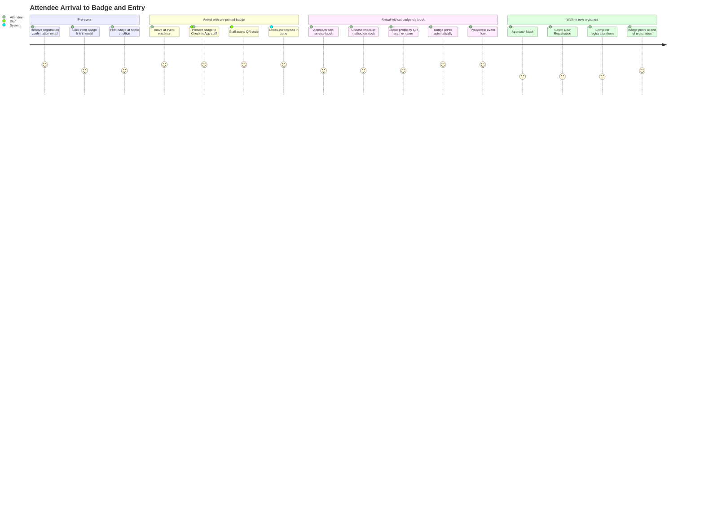
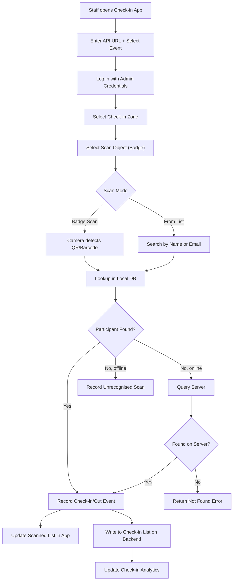
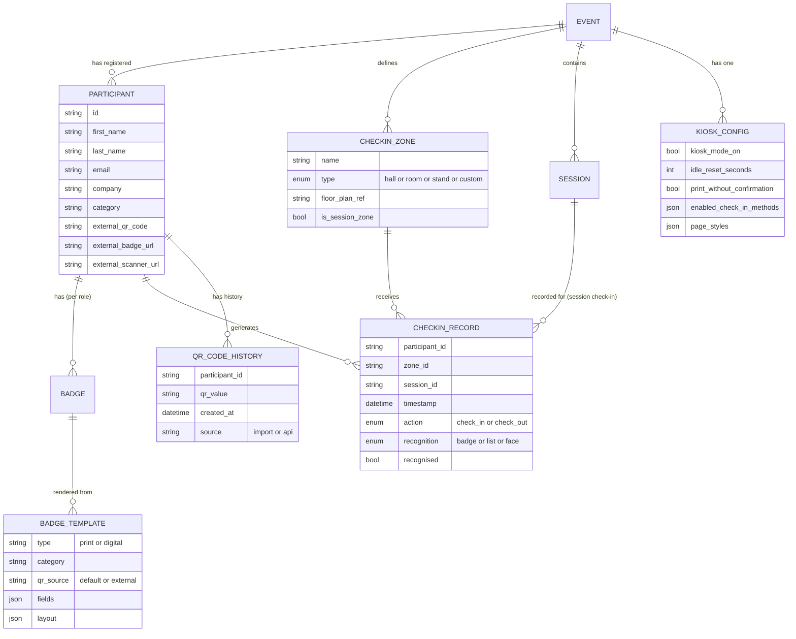
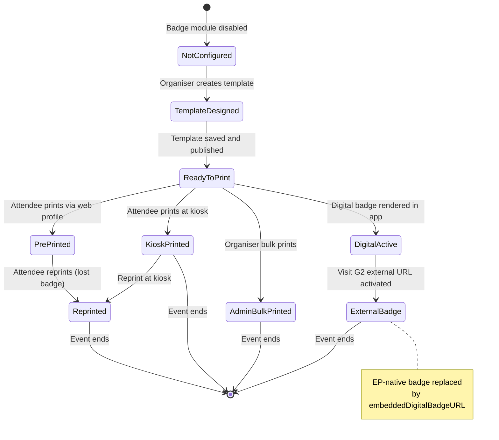
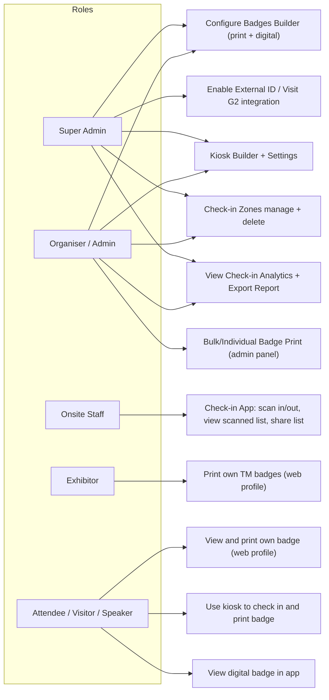

## 1. Product Overview

**Purpose.** Onsite & Kiosks is ExpoPlatform's physical-event operations suite. It covers every touchpoint between an attendee and the event floor: designing and printing branded badges, enabling self-service check-in and badge printing at kiosks, recording staff-operated entry and exit scans via a dedicated Check-in App, and surfacing attendance analytics to organisers in real time.

**Problem being solved.** Large-scale events (often 10,000–100,000+ attendees) cannot rely on manual or paper-based check-in. Queues at entry gates, lost confirmation emails, walk-in registrants who have no badge, staff armed with clipboards, and zero visibility into which zones are overcrowded are the defining problems. Onsite & Kiosks replaces each of those pain points with a connected digital pipeline that spans pre-event badge preparation through to post-event attendance exports.

**Business value.**
- Faster throughput at event entry — barcode/QR scanning takes under a second per attendee.
- Zero-queue self-service for pre-registered attendees via kiosk badge printing.
- Walk-in onsite registration directly on the kiosk, capturing data into the platform immediately.
- Real-time attendance heat maps and zone-level check-in/out charts visible to organisers mid-event.
- Closed-loop with the mobile app — the same QR code on a badge is used for networking lead capture, badge login, and attendance tracking, removing the need for separate hardware.
- External badge integrations (Visit G2 / GES) allow clients who use third-party badge providers to remain within a single operational workflow.

**Target users.** Event organisers (configure badges and kiosks pre-event); onsite staff / admins (operate the Check-in App on the day); attendees, exhibitors, speakers, and sponsors (receive, print, or display their badges); super admins (platform-level kiosk configuration).

**User personas.**
- *Event Organiser* — builds badge templates, configures kiosk pages, enables check-in zones, monitors analytics dashboards, exports check-in reports.
- *Onsite Staff / Zone Admin* — logs into the Check-in App, selects a zone, scans badges, reviews the scanned list, handles exceptions.
- *Attendee (Visitor / Speaker / Exhibitor)* — pre-prints their badge from a web profile or email link, or arrives at a kiosk and self-prints.
- *Walk-in Registrant* — registers on the kiosk for the first time and immediately prints a badge.
- *TAM / Support* — troubleshoots QR code mismatches, external ID configuration, and kiosk connectivity.

**Success metrics.** Average time per check-in scan; kiosk throughput (badges printed per hour); percentage of attendees pre-printing (reducing day-of queues); check-in-to-registration ratio; analytics page load time; export success rate; number of unrecognised badge scans per event.

---

## 2. Product Scope

### Included
- **Badges Builder** — physical print badge designer and digital badge designer, both with drag-and-drop fields, custom branding, QR/barcode integration (default or external), and live preview.
- **Custom Fields for Badges** — pulling registration form select-field answers onto badge layouts.
- **Badge Variables for Emails** — print badge link, QR code, barcode, and QR print variables in registration email templates.
- **Bulk and Individual Badge Printing** — admin-panel-initiated print for all participants or a filtered subset, with multi-role priority ordering.
- **Digital Badge** — app-based badge with optional branded colour ring around the QR code.
- **Pre-print Badge via Online Profile** — self-service badge download/print from the attendee web profile.
- **Download Badge to Print (CTRL+P / PDF save)** — save badge as PDF for later printing.
- **Kiosk Builder** — visual page editor for all kiosk screens (initial, check-in method selector, barcode, name/email, registration code, search results, success, error, registration), accessible under `Onsite > Kiosk > Kiosk Builder`.
- **Kiosk Mode** — self-service tablet/kiosk deployment at `https://your-front-url/onsite/index`; check-in method toggle and idle-reset timer.
- **Print Badge via Kiosk** — badge printing after locating profile via any check-in method.
- **Print Badge Without Confirmation** — automatic print triggered immediately on profile selection or new registration completion.
- **Onsite Registration Pipeline** — walk-in new registrant flow via kiosk, reusing the standard registration form with conditional logic support.
- **Conditional Logic in Kiosk Registration** — show/hide form fields based on co-located event or category selection.
- **Check-in Methods** — Bar/QR code, Name or Email, Registration Code (Facial Recognition noted as currently not usable).
- **Attendance Tracking using Check-in App** — dedicated generic app (available in app stores) for staff-operated zone scanning.
- **Check-in App Sign-in** — API URL + event selection + admin credential login; camera and scan-object selection.
- **Check-in Zones** — floor-plan-linked or custom zones; colour-coded cards with check-in count and session count.
- **Check-in App Scanning In/Out** — check-in and check-out mode, badge scan or name-list selection, scanned-list view with sort and share.
- **Session Check-in** — session-specific scan within a zone marked as Check-in on the floor plan.
- **Easy Entrance Session Check-In** — allows session check-in without prior schedule addition.
- **Check-in List Data Record** — backend table of all check-in/out events, filterable, paginated, exportable.
- **Check-in Analytics** — overview/registration/total check-ins/registration-vs-check-in/heatmap/top-zones charts with zone, role, category, and action-type filters.
- **Check-in Report** — consolidated single-tab export with unique-per-event and unique-per-day modes, customisable columns, co-located show support, and conditional custom fields.
- **Default or External ID** — QR/barcode source switch between ExpoPlatform-generated and third-party-uploaded codes; supported formats ITF, Code 128, Code 39, EAN-13.
- **Visit G2 / GES External Badge and Scanner** — pull external badge URL and scanner URL from Visit (n200) integration; display in app and web; sync scanned leads back to EP.
- **Login via Badge Scan** — optional app login flow by scanning a badge QR code.
- **Storing History of QR Codes** — audit trail of all QR code values per participant for troubleshooting.
- **External QR/Barcode Scan in Kiosk** — kiosk recognition of externally-issued QR and barcodes alongside EP-native codes.

### Excluded
- Facial Recognition check-in (flagged as not usable in current documentation; listed only for completeness).
- "Register via kiosk" legacy page (marked not usable).
- Service badges for exhibitors (covered in a separate Service Badges article outside this product scope).
- Online meeting reminder emails (separate Networking & Matchmaking product).
- Badge scanning for lead capture / networking (covered in the Networking & Matchmaking product; overlaps at the QR/barcode layer only).
- Mobile app builder UI settings for digital badge font (Mobile App Builder product).
- Billing and payment for onsite registration (Transactions & Purchasing product).

---

## 3. User Roles

| Role | Access in Onsite & Kiosks | Notes / Restrictions |
| --- | --- | --- |
| **Super Admin** | Full configuration: Badges Builder, Kiosk Builder, all check-in settings, analytics, exports; external integration settings | Can enable Visit G2, configure External ID, set kiosk mode on/off |
| **Admin (Organiser)** | Configure badges and kiosk pages; view check-in analytics; export reports; manage check-in zones; enable Easy Entrance | Cannot change platform-level integration tokens |
| **Onsite Staff (Zone Admin)** | Log in to Check-in App; select zone; scan badges in/out; view scanned list; share scanned list | Read-write on scan records for their event; cannot edit badge templates |
| **Exhibitor** | Pre-print own team-member badges from admin panel; view own digital badge in app | Cannot configure badge templates; badge only for TM role category |
| **Speaker** | View and print own badge from profile (web); view digital badge in app | Badge printing subject to Module Management toggle |
| **Visitor / Attendee** | View and print own badge from profile (web) or kiosk; use digital badge in app; self-register on kiosk | Kiosk access is unauthenticated (self-service); app badge requires login |
| **Sponsor** | Same as Visitor for badge access | Sponsor role printed at Visitor priority in multi-role logic |
| **Team Member** | Badge printing via exhibitor admin (exhibitor prints for TM) | Badges only for participant and TM categories — not exhibitor entity itself |

> [!INFO] Badges (digital and printed) exist only for **participants and team members**. Exhibitor company entities do not have badges; the External QR field is therefore absent from the exhibitor import template.

---

## 4. Feature Inventory

#### 4.1 Print Badge Configuration (Badges Builder — Physical)

**Description.** A drag-and-drop visual editor for designing physical printed badges, accessed at `Admin Panel → Registration Settings → Badges → Badges for printing`.

**Why it exists.** Event organisers need fully branded, role-specific physical badges that can carry the attendee's photo, QR code, name, company, and any custom registration data, all formatted consistently for large-volume printing.

**User value.** Organisers control every visual element — font, colour, margins, rotation — and preview the result before deployment. No external design tool is needed.

**Functional logic.** Two field types populate the badge: **System Fields** (Photo, Full Name and Title, Company, Country, City, Category/Role, Date of Birth, Post Code, Website, Telephone) and **Custom Fields** (select-type registration form answers). Additional badge-specific features include Icons, Lanyard Hole, and Hide Border. Each field supports independent colour, font size, font family, bold/italic/underline, rotation, left/right margin, and alignment (left, centre, right). Fields are positioned by drag and drop. QR codes and barcodes can be placed, resized by percentage, and sourced as Default (system-generated) or External (uploaded via import or API).

**Preconditions.** Badge module enabled in Module Management for the relevant participant type.

**Trigger conditions.** Organiser navigates to `Badges for printing` tab and creates or edits a badge template for a category.

**Processing logic.** Changes are reflected on the live preview. On save, the template governs all subsequent print jobs for that category. Supported barcode formats: ITF, Code 128, Code 39, EAN-13.

**Outputs.** Saved badge template; PDF/print output at print time; barcode image rendered on the badge.

**Dependencies.** Registration form (custom fields); participant import / API (external QR/barcode data); print driver/browser print dialog.

**Configurations.** Badge dimensions (width, height); background image/colour; field count; QR/barcode source (default vs external); show/hide lanyard hole; show/hide border.

**Validation rules.** Only "select"-type registration fields are available as custom badge fields (text/HTML5/file-upload fields excluded). External barcode data must conform to the chosen format spec.

**Permissions.** Organiser/Admin and above.

**Error handling.** Preview renders empty field placeholders if participant data is missing. External barcode with wrong format → badge renders without that code element.

**Edge cases.** Multi-role participant: bulk print uses priority order (Moderator → Speaker → Exhibitor → Visitor). Invisible-on-frontend category: "Do not hide in badges" checkbox allows the category name to appear on the badge even when hidden in the directory.

---

#### 4.2 Digital Badge Configuration (Badges Builder — Digital)

**Description.** A badge designer for the in-app digital badge, managed at `Admin Panel → Registration Settings → Badges → Digital badges`.

**Why it exists.** Attendees need a badge they can display on their phone — for networking QR scanning, badge-scan login, and access control — without printing.

**User value.** The digital badge is always with the attendee and cannot be forgotten or lost. The QR code is centrally placed and large for easy scanning.

**Functional logic.** Mirrors the print badge builder in field types (system + custom) and QR/barcode support (ITF, Code 128, Code 39, EAN-13; default or external). Key differences: no printing/preview-print option; no physical resize (badge fits the mobile screen); photo is round; no lanyard hole or border. A **Color Ring** can be enabled around the QR code as a bold branded outline — visually aids scanning in busy environments; does not affect scan speed or accuracy. Field colour is managed here; font family is managed in the Mobile App Builder.

**Preconditions.** Same as print badge — module enabled for category.

**Outputs.** Digital badge rendered in the app under the "My Badge" section; QR code scannable by the Check-in App and by other attendees for lead capture.

**Dependencies.** Mobile App Builder (font settings); same participant data and external QR infrastructure as print badge.

**Configurations.** Color Ring on/off (event-level); QR/barcode source; field selection and colour; badge background.

**Edge cases.** If only Digital Badge is set to External QR and Print Badge is not, the badge will be inconsistent across channels. Both must be configured consistently for external QR deployments.

---

#### 4.3 Custom Fields for Badges

**Description.** Pulls "select" (dropdown or multi-choice) answers from the registration form directly onto the badge layout, for both print and digital badges.

**Why it exists.** Events often need to display registration-specific data (industry, interest, company size) on the badge for networking and access differentiation.

**User value.** No manual data entry; answers flow automatically from registration to badge.

**Functional logic.** Organiser clicks "Add Field" in the badge builder and selects any available select-type custom field. The badge displays the participant's selected answer(s), not the question label. Multiple selections are joined with commas. File upload and HTML5 fields are excluded.

**Processing logic.** At print/render time, the platform resolves the participant's stored registration answer for the field and renders it on the badge.

**Permissions.** Organiser/Admin.

**Edge cases.** If the participant has not answered the field, the badge renders the field placeholder empty. Fields created after badge template design must be manually added to the template.

---

#### 4.4 Badge Variables for Emails

**Description.** Email template variables that embed badge assets directly in registration confirmation and other transactional emails.

**Why it exists.** For large events (20,000+ registrations), requiring attendees to log in, navigate to their profile, and download their badge creates friction and support volume. Embedding a direct badge link or QR image in the confirmation email eliminates that friction.

**User value.** Attendees receive their badge assets immediately on registration confirmation and can pre-print without logging in.

**Functional logic.** Four variables are available for use in any registration email template: **Print Badge Link** (direct URL to badge print page), **Badge Barcode** (rendered barcode image), **Badge QR Code** (rendered QR image), and **Badge QR Print Option** (QR formatted for easy badge printing). These variables must be manually added to the relevant email template by the organiser. A "Visitor Switch Category" template also supports these variables (EP-11106). Hosted Buyer Accept and Buyer Accept email templates also support badge barcode and QR code variables (EP-8170, EP-15823).

**Dependencies.** Email template engine; badge builder (template must exist for the category); registration flow.

**Validation rules.** Variable renders only if a badge template is configured for the participant's category. If no template exists, the variable renders as empty.

**Permissions.** Organiser/Admin (template configuration).

**Edge cases.** If the badge template is updated after an email has been sent, the printed badge may differ from what was shown in the email if the link pointed to a snapshot. Multiple categories: the variable resolves to the highest-priority role's badge.

---

#### 4.5 Bulk and Individual Badge Printing (Admin Panel)

**Description.** Print badges for participants directly from the admin panel, either individually via the burger menu or in bulk for all or filtered participants.

**Why it exists.** Organiser staff may need to pre-print all badges before the event opens to eliminate kiosk queues, or print a replacement badge for a specific attendee.

**User value.** Single-click bulk print for any filtered subset; avoids manual one-by-one handling at scale.

**Functional logic.** **Individual**: `Admin Panel → Management → Participants → [burger menu] → Print Badge`. If multiple roles, a role selector screen appears. **Bulk**: `Bulk Badges Print` button on Participants list. Confirmation dialog shows count. Filters applied to the participant list are respected — bulk print applies only to the filtered result set. **Priority order for multi-role**: Moderator (1) → Speaker (2) → Exhibitor / Team Member (3) → Visitor (4). Each participant receives exactly one badge in bulk mode.

**Preconditions.** Badge template configured for the participant's role/category; `Badges` module enabled.

**Outputs.** Browser print dialog (for individual); bulk print job sent to print queue.

**Error handling.** If no badge template is configured for a participant's category, badge renders blank fields. Accidental bulk print can only be prevented by the confirmation dialog.

**Edge cases.** Moderator+Speaker+Visitor → Moderator badge printed. If only Visitor template exists, Visitor badge is used regardless of other roles.

---

#### 4.6 Pre-print Badge via Online Profile / Download Badge to Print

**Description.** Attendees print their own badge from `Profile → Profile Info → Print Badge` on the event web frontend.

**Why it exists.** Allows attendees to arrive with their badge already printed, bypassing the kiosk queue entirely.

**User value.** Convenience and autonomy; especially useful for high-registration events.

**Functional logic.** A "Print Badge" button appears on the profile page when the Badges module is enabled for the participant type. Multi-role attendees see a dropdown to select the badge type. Exhibitors can print badges for their team members (exhibitor role only). Pressing `CTRL+P` in the print window saves the badge as a PDF for later printing.

**Preconditions.** `Badges` module enabled in Module Management for the relevant participant type (Participants, Team Members, Buyers, Exhibitors). Badge template configured.

**Trigger conditions.** Attendee navigates to profile and clicks Print Badge.

**Outputs.** Browser print dialog or PDF file.

**Permissions.** Authenticated attendee (their own badge); Exhibitor (for their team members' badges).

**Edge cases.** If Badges module is disabled in Module Management, the Print Badge tab and button are hidden from the frontend.

---

#### 4.7 Default or External ID (QR Codes and Barcodes)

**Description.** Controls whether the QR code and barcode on a badge use ExpoPlatform-generated identifiers (Default) or externally-supplied codes from a third-party registration vendor (External).

**Why it exists.** Many large events use specialist badge providers (e.g., GES, Visit) who pre-print physical badges with their own barcodes. ExpoPlatform must be able to recognise those codes at check-in without requiring re-registration.

**User value.** Seamless check-in for attendees whose badges were printed by a third party; eliminates the need to manage two parallel systems.

**Functional logic.** **Default**: platform auto-generates a unique code per participant. **External**: organiser uploads the external code via participant import (CSV) or API. The code must be a QR string (text value), not a URL. Once uploaded, the organiser activates "External" in both the Digital Badge and the Printed Badge configuration for the relevant categories. The platform stores a history of all QR codes tied to a participant (EP-10400) for troubleshooting (disappearing leads, unrecognised scans, external scanner failures). External QR/Barcodes are also recognised by the Kiosk scanning module (EP-15575).

**Supported barcode formats.** ITF (numeric only), Code 128 (alphanumeric, high density), Code 39 (alphanumeric, widely used), EAN-13 (13-digit retail standard).

**Preconditions.** For External: external QR strings obtained from the badge provider and uploaded to participant profiles.

**Validation rules.** External value must be a text string matching the chosen barcode format spec. Badges exist only for participants and team members, not exhibitor entities.

**Error handling.** Unrecognised external code at kiosk → kiosk returns "not found"; scan still recorded as unrecognised in the scan history (EP-21095).

**Edge cases.** If only one of Digital or Print badge is set to External, the badge is inconsistent. If the external code changes (e.g., vendor re-issues), the history table preserves the old values for audit.

---

#### 4.8 Kiosk Builder

**Description.** A visual page editor for all screens displayed on the self-service check-in kiosk, managed at `Onsite > Kiosk > Kiosk Builder` in the admin panel.

**Why it exists.** Organisers need a branded, event-specific kiosk experience without custom development. Every on-screen text element, colour, font, and background must match event branding.

**User value.** Full control over the kiosk UI without coding; consistent branding across all touchpoints.

**Functional logic.** Editable elements on each screen are marked with a pencil icon on hover. Clicking reveals styling options. Each screen manages: back arrow (hide/show, text, font, colour, border, margin); event title (colour, font, size); page description (content, colour, font); page background (image, video, colour, position, size). Additional screen-specific elements are documented per screen (see below). Kiosk mode is toggled on/off via the "Kiosk mode" toggle on the Kiosk Builder page. Kiosk is accessible via web at `https://your-front-url/onsite/index` for testing. A **Settings** panel controls which check-in methods are enabled and the idle-reset timer (seconds before the first screen reappears).

**Kiosk screens.**
- **Initial Page**: First screen; "I've already registered" and "New Registration" buttons; Event Logo, Event Name, Page Date customisation.
- **Check-In Method Selector**: Presents active check-in method icons and text (Barcode/QR, Name or Email, Registration Code); icons and text descriptions individually customisable.
- **Barcode/QR Code page**: Scanner input field; background and icon customisable.
- **Name or Email page**: Search field with text colour, background colour, border radius.
- **Registration Code page**: Code entry field; full styling of search field and icon.
- **Search Results page**: List of matched participants with name and category; pagination Left/Right buttons; participant category displayed (updated per EP-14045 for better search with >5 matches).
- **Success page**: Shown on profile selection; user avatar (border radius, frame), welcome text, user name/position/company, "Print your badge" button; all individually hideable and styled.
- **Error page**: Shown when no results found; "Code not found" text, "Try again" button, "Choose another way to check-in" button.
- **Registration page**: Walk-in new-registration form; Previous/Next/Choose-another-way buttons.

**Preconditions.** Kiosk mode enabled; at least one check-in method enabled in Settings; badge template configured.

**Outputs.** Styled kiosk screens rendered on the kiosk device; print command sent to connected printer on success.

**Dependencies.** Badge Builder (print template); Registration form (walk-in pipeline); printer hardware/driver.

**Configurations.** Idle-reset timer; check-in method toggles; "Print badge without confirmation" toggle; conditional logic on registration form (EP-14036).

**Permissions.** Organiser/Admin configures; kiosk runs unauthenticated (public).

**Error handling.** Search returning no results → Error page. Printer offline → badge prints to queue (device-dependent).

**Edge cases.** Multi-role profile found by kiosk → priority order (Moderator > Speaker > Exhibitor TM > Visitor) determines which badge prints. Walk-in registrant: if predefined fields appear on additional pages of the standard registration pipeline, those pages are disabled on the kiosk version (the fields remain accessible on the first page).

---

#### 4.9 Print Badge Without Confirmation

**Description.** An optional kiosk setting that triggers badge printing automatically without requiring the attendee to press a "Print your badge" button.

**Why it exists.** For very high-volume events, any extra tap adds friction and slows throughput.

**User value.** Maximum speed — attendee locates their profile and the badge prints immediately.

**Functional logic.** Enabled in `Admin Panel → Onsite → Kiosk → Settings`. Two scenarios: (1) **New registrant** — badge prints automatically at the end of the registration pipeline. (2) **Returning registrant** — badge prints automatically as soon as the attendee selects their profile from search results. Multi-role priority order applies: Moderator → Speaker → Exhibitor TM → Visitor.

**Preconditions.** Kiosk mode on; badge template configured; printer connected.

**Error handling.** If the setting is off and the attendee did not get a badge, the organiser should check the "Print badge without confirmation" toggle.

---

#### 4.10 Onsite Registration Pipeline (Walk-in via Kiosk)

**Description.** A new-registrant registration form embedded in the kiosk flow, allowing unregistered attendees to sign up and immediately print a badge.

**Why it exists.** Onsite walk-in registrations are common at large exhibitions. Capturing them into the platform immediately avoids paper-based workarounds and ensures the attendee is in the database for lead capture and analytics.

**User value.** Walk-in attendees are fully registered and badged in one kiosk session.

**Functional logic.** The kiosk registration form mirrors the standard registration form fields and sections. Fields marked as conditional retain their conditionality. Walk-in registrations can be scoped to co-located events via conditional logic (EP-14036): e.g., selecting one of four co-located events shows only that event's interest/product categories. Pages in the standard form that use predefined fields are disabled on the kiosk version if those fields appear elsewhere, but the fields remain on the initial page.

**Preconditions.** Registration module enabled; kiosk mode on; at least one participant category with an open registration form.

**Outputs.** New participant record in the platform; badge printed (or print confirmation shown).

**Dependencies.** Registration form builder; conditional logic engine; badge builder.

**Edge cases.** Kiosk registration may have fewer fields than the standard form (intentional — kiosk form is streamlined). Custom fields beyond "select" type may not be available on the kiosk form.

---

#### 4.11 Attendance Tracking using Check-in App

**Description.** A dedicated generic mobile app (available on iOS App Store and Google Play) that onsite staff use to record participant entry and exit at designated zones by scanning badges or searching by name/email.

**Why it exists.** The main event app is event-customised and attendee-facing. A separate, generic, staff-only Check-in App provides a lean, purpose-built tool for high-volume scanning without cluttering the attendee experience.

**User value.** One app works across all events (no per-event build needed); event data remains segregated by login; staff get zone-specific attendance counts in real time.

**Functional logic.** After download, staff enter the **API URL** (from the browser address bar when logged into EP as admin — trailing slash must be removed). They select their event from a list, log in with admin credentials, then select: (1) **Location/Zone** (from Check-in zones list); (2) **Camera** (back recommended); (3) **Scan object**: Faces (requires 3rd-party facial recognition; PIN required), **Badges** (most common; manual barcode entry also available), **From list** (name/email search). Staff toggle between **Check-in** and **Check-out** mode. Each scan creates a timestamped record. Multiple check-ins at the same location are recorded separately; check-out requires explicit mode switch. The **Scanned List** button shows all check-ins across all zones for the event, sortable by name or scan time, shareable. Check-in data flows to the backend Check-in List and Check-in Analytics.

**Preconditions.** Admin credentials; API URL; check-in zones configured; app updated to latest version.

**Outputs.** Scan records (ID, name, date/time, status IN/OUT, zone); Scanned List in-app; Check-in List export; Check-in Analytics charts.

**Dependencies.** Check-in zones (floor plan or custom); badge templates (QR/barcode); participant database.

**Error handling.** Badge not found in local DB → app checks internet connectivity; if online, queries server; if offline, records unrecognised scan. Error message differentiates "not found" from "no internet" (EP-8616).

**Edge cases.** Participant checked in multiple times → each scan recorded separately (no deduplication at scan time; deduplication is a report-level concept). Session check-in requires the hall to be a Check-in zone on the floor plan.

---

#### 4.12 Check-in Zones

**Description.** Named geographic areas within the event that serve as scan locations for the Check-in App, configurable at `Onsite → Check In → Check-in Zones`.

**Why it exists.** Different zones (main hall, breakout rooms, exhibitor areas, conference sessions) have different attendance requirements. Zone-level tracking enables per-area counts and analytics.

**User value.** Organisers get granular attendance data by zone rather than just event-level totals.

**Functional logic.** Zones are displayed as colour-coded cards. Display order is fixed: conference halls → conference rooms → check-in zones in halls → check-in zones at stands → custom zones. Each card shows zone name, check-in count, and active session count. Two creation paths: **Floor plan zones** (select from existing floorplan areas) and **Custom zones** (created manually, not linked to the floorplan). Zones can be edited (name), deleted, or searched. Filtering by zone type is available. Changes to check-in zones are reflected on the floor plan and all related pages.

**Preconditions.** Floor plan module enabled (for floor-plan zones); otherwise custom zones are always available.

**Configurations.** Zone name; zone type; linked floor plan area (for floor-plan zones).

**Error handling.** Cannot add floor plan zone if floor plan is empty or feature disabled → use custom zone. Accidentally deleted zone → contact system administrator to restore.

**Edge cases.** Session check-in requires the session hall to be a Check-in zone; if not marked, the "Session" button does not appear in the app.

---

#### 4.13 Session Check-in and Easy Entrance

**Description.** Within a Check-in zone that is also a session hall, staff can select a specific session and scan participants into it, separately from the general zone check-in.

**Why it exists.** Conference sessions need precise attendance records for CPD/CLE credits, exhibitor-sponsor interaction tracking, and capacity management.

**User value.** One zone can track both general entry and individual session attendance simultaneously.

**Functional logic.** When a zone is a Check-in zone on the floor plan, the app shows three mode buttons: Check-in, Check-out, Session. Selecting Session reveals a session dropdown. Standard check-in flow proceeds after session selection. **Regular sessions**: participant must have the session in their schedule unless **Easy Entrance** is enabled. **Speed Networking sessions**: check-in only available within the start/end times configured in the admin panel. **Easy Entrance** is enabled at `Management → Sessions → Config`; off by default. When enabled, participants can be checked into a session regardless of schedule. Check-in data recorded in analytics and report regardless of Easy Entrance state.

**Preconditions.** Hall marked as Check-in zone on floor plan; session assigned to that hall.

**Outputs.** Session-specific scan record; appears in scanned list with session check-in icon; included in Check-in Analytics and Report.

**Edge cases.** Speed Networking: if check-in time window has passed, the session does not appear in the dropdown. Easy Entrance enabled → "session not in schedule" validation bypassed.

---

#### 4.14 Check-in List Data Record

**Description.** A backend table showing all check-in and check-out events for the event, accessible at `Onsite → Check In → Check In List`.

**Why it exists.** Organisers need to verify individual participant attendance, resolve disputes, and identify scanning anomalies.

**User value.** Instant lookup of any participant's check-in history across all days and zones, with export capability.

**Functional logic.** Columns: Name (photo, name, position, company); per-day date columns showing IN/OUT actions chronologically (first and last shown by default; additional actions expandable; cell scrollable). First column (Name) is pinned during horizontal scroll. Pagination defaults to 96 entries per page with adjustable page size. **Filters**: same filters as the Participants page (role, category, etc.) plus a Check-in Zones filter. **Search**: by name, surname, or company name. **Export**: click Export → loading indicator → Download link appears with timestamp. Export moved to SQS for reliability and speed (EP-1106).

**Outputs.** On-screen table; exported CSV/XLS with check-in data.

**Permissions.** Organiser/Admin.

**Edge cases.** Missing data → verify filters; incorrect pagination → adjust entries per page.

---

#### 4.15 Check-in Analytics

**Description.** A dashboard of visualisations for event check-in and attendance data, providing real-time insights during and after the event.

**Why it exists.** Organisers and event operations teams need to see at a glance how many people checked in, when, at which zones, and what percentage of registrants actually attended.

**User value.** Data-driven decisions on gate staffing, zone capacity, and session scheduling.

**Functional logic.** Four chart areas:
- **Registration Analytics** (pie chart): total registrations split by pre-event and post-event (event start defined by `Date (from)` in `admin/general/edit`); hover reveals count.
- **Total Check-ins/Outs** (bar chart): daily or hourly view; only active time periods shown; empty hours rendered as zero in tooltips; filters for role, category, zone, action type (all/in/out); daily/hourly toggle; specific-day selector; Y-axis dynamically scales to maximum; bar width consistent with horizontal scroll for many bars.
- **Registration vs Check-in** (pie chart): registered participants split by "checked in at least once" vs "did not check in"; all roles included.
- **Heatmap of Check-ins** (zone heatmap): 10-colour gradient from light (0%) to dark (100%) proportional to the maximum check-in value; hover tooltip shows total check-ins, check-outs, and combined per zone; zone name shown in full on hover; same filters as Total Check-ins. Top Zones list ranks up to top 5 by check-in count, loadable in increments of 5.

**Filters.** Users and Zones (multi-select, includes "Select all"); User Role; Category; Zone; Action type; Date/day range.

**Time zone.** All times adjusted to the event's configured time zone.

**User registration.** Includes both internal (EP) and external registrations in totals.

**Permissions.** Organiser/Admin.

---

#### 4.16 Check-in Report (Export)

**Description.** A consolidated, customisable CSV/XLS export of all check-in events, available at `Data → Import/Export → Check-in List`.

**Why it exists.** Post-event attendance data is required for compliance, ROI reporting, exhibitor contracts, and CPD certificates.

**User value.** One-click export with configurable columns and two de-duplication modes; includes co-located event data.

**Functional logic.** Two report versions selectable via a dropdown: **Unique Check-In per Event** (default) — first check-in for the event duration marked "Yes" in Unique column, all subsequent "No"; restricted to event dates/times. **Unique Check-ins per Day** — each day's first check-in marked "Initial check-in"; subsequent same-day check-ins marked "Duplicated check-in"; covers all days including those outside the event's defined dates. A column selector allows choosing which fields appear. **Column categories**: System Fields (Participant ID mandatory, Mr/Mrs, First Name, Last Name, Email, Company, Country, State/Region, City, Address, Post Code, Nationality, Job Title, Interest categories, Activity categories, Tel., Language Preference); Other Columns (Category, Registration date, Creation date, Scanned code); Check-in Information (Zone, Check-in date/time, Event name, Unique check-in status); Custom Fields (all select-type, excluding file uploads and HTML5). Co-located show check-ins are included — a participant from a co-located event appears with their event name. External/random barcodes displayed in Scanned Code column. Conditional fields (shown based on registration logic) are included.

**Outputs.** Downloadable CSV/XLS file; timestamp on download link.

**Permissions.** Organiser/Admin.

**Edge cases.** Multiple roles → comma-separated in Category column. Participant checked in on days outside the event's defined dates → only appears in "per day" version. Co-located participant → check-in recorded under their event name.

---

#### 4.17 Visit G2 / GES External Badge and Scanner Integration

**Description.** Pulls the attendee's external digital badge URL and lead-capture scanner URL from the Visit (n200) vendor integration, stores them in the EP database, and surfaces them in the mobile app and web profile.

**Why it exists.** Major exhibitions (e.g., Pharmapack) use GES/Visit as their official badge provider. Attendees and exhibitors expect to use the official badge, not a secondary EP badge. EP must display the official badge and scanner seamlessly.

**User value.** Attendees see their official event badge in the EP app. Exhibitors access their official lead-capture scanner from within the EP app without switching applications.

**Functional logic.** For accounts imported from the Visit (n200) integration: each account has a parameter containing a unique `embeddedDigitalBadgeURL`. EP pulls this URL from Visit via API, stores it in the EP database, and pushes it to the frontend and mobile app for display (EP-14602). Similarly, each exhibitor account has a unique external scanner URL (a PWA for scanner + scanned leads list) that EP stores and surfaces in-app (EP-14603). A **Sync scanned leads** setting in `Event Setup → General Settings → Visit integration settings` enables EP to pull scanned leads from the Visit vendor and merge them with EP platform data for display on frontend and in exports (EP-14604).

**Preconditions.** Visit (n200) integration enabled; accounts imported from Visit vendor; `embeddedDigitalBadgeURL` property present in vendor response.

**Processing logic.** EP API fetches unique URLs from Visit → stores in participant record → mobile app and web render the external badge URL instead of EP-native digital badge for Visit-sourced accounts.

**Configurations.** "Sync scanned leads" toggle in Visit integration settings.

**Failure handling.** If Visit API is unavailable → EP retains last-fetched URL from database.

**Security.** Badge URL is unique per attendee; not guessable. Scanner URL is account-specific.

**Edge cases.** Attendee not sourced from Visit → EP-native badge shown. Scanned leads sync: if Visit API format changes, merge logic may need updating.

---

#### 4.18 Login via Badge Scan

**Description.** An optional mobile app login flow that allows users to log into the event app by scanning their badge QR code instead of entering email/password.

**Why it exists.** At large events, re-logging in at the venue is friction. Attendees often have their badge in hand — scanning it is faster than typing credentials.

**User value.** One-tap login at the venue; reduces support requests for forgotten passwords at the event.

**Functional logic.** Enabled in `Admin Panel → Event Setup → General → Settings`: toggle "Badge Scan Login for App" (off by default); select allowed categories (default: All). In App Builder, organiser configures button text and colour (same pattern as Login/Register buttons). On the app login screen, an additional button appears. Tap → badge scanner opens → scan own QR code → logged in and taken to main app. Deep-link support: QR codes contain a deep link so that scanning from external camera apps (not inside the event app) opens the app (if installed) and proceeds with login (EP-1233).

**Preconditions.** Feature enabled in admin settings; user has the event app installed; badge has a QR code.

**Outputs.** Authenticated app session.

**Permissions.** Organiser enables; Attendees of allowed categories use.

**Error handling.** Scanned badge not found in event DB → "not found" error displayed; if offline → "no internet connection" error (EP-8616 error logic differentiation).

---

## 5. User Stories Mapping

| Story ID | Title | Summary | Acceptance criteria (as documented) | Related feature | Status |
| --- | --- | --- | --- | --- | --- |
| EP-250 | My Interactions in Mobile App | Split "Scanned Badges" into "I scanned" / "Scanned me" subtabs in the mobile app; controlled by admin Networking toggle | Two subtabs present; "I scanned" mirrors old behaviour; toggle in Admin Panel | 4.11 Check-in App / Badge Scanning | COMPLETE |
| EP-266 | Ability to use custom field for the badges | Add additional select-type fields from participant profile to the badge builder field list | Custom fields appear in badge builder; renders participant's selected answer on badge | 4.3 Custom Fields for Badges | COMPLETE |
| EP-1106 | Check-in List export rework | Move Check-in List export to SQS for speed and stability | Export quicker and stable; delivered via SQS queue | 4.14 Check-in List Data Record | COMPLETE |
| EP-1230 | Digital Badge | Split Badges tab into "Badges for printing" and "Digital Badges" subtabs; digital badge without print options; QR central and large; photo round | Two subtabs; digital badge renders in app; QR prominent | 4.2 Digital Badge Configuration | COMPLETE |
| EP-1231 | Mobile App Badge Scanning Improvements | On-screen instruction text during scan; overlay success message after scan; navigate to contact profile after scan | Instructions visible; success overlay with name; profile opens after 2s | 4.18 Login via Badge Scan | COMPLETE |
| EP-1233 | EMEA: Deep links for Badge Scan | QR codes contain deep link; scanning outside app opens app if installed and proceeds to scan flow | Deep link in QR; app opens on scan from camera; scan flow proceeds | 4.18 Login via Badge Scan | COMPLETE |
| EP-2245 | Onsite meeting reminder email | Reminder email 15 min before confirmed onsite meeting to both parties with names, time, location | Email fires 15 min before; correct template; both parties receive | 11. Notifications | COMPLETE |
| EP-8170 | Print badge link variable in Hosted Buyer Accept Email | Direct print badge URL variable in Hosted Buyer Accept email so 20,000+ registrants skip activation | Variable available in Hosted Buyer Accept template; renders valid URL | 4.4 Badge Variables for Emails | COMPLETE |
| EP-8616 | Error logic change after badge scanning | Differentiate "account not found" from "no internet" error in the Check-in App | Two distinct error messages; offline check occurs before server request | 4.11 Check-in App | COMPLETE |
| EP-8788 | Lead capture page — person/company name clickable | After scanning a badge, name and company link to personal/company profile | Tapping name opens personal profile; tapping company opens company profile | 4.11 Check-in App | COMPLETE |
| EP-8850 | Add Participant Category to badge scan report | Add "Category" field to Exhibitor Scanned Contacts and Visitor Scanned Contacts exports | Category column present in both export reports | 4.16 Check-in Report | COMPLETE |
| EP-9799 | Badges fixes and improvements (Epic) | Suite of badge builder improvements | See child stories EP-9800 to EP-9822 | 4.1 Print Badge Configuration | COMPLETE |
| EP-9800 | Fields rotation 180 degrees in Badge builder | Add 180-degree rotation option for all badge fields | Rotation control present; preview and print reflect rotation | 4.1 Print Badge Configuration | COMPLETE |
| EP-9801 | Fields aligning in Badge builder | Add left/centre/right alignment option for all badge fields | Alignment control present; default Centre; preview and print reflect alignment | 4.1 Print Badge Configuration | COMPLETE |
| EP-9802 | Fields duplication in Badge builder | Add ability to duplicate badge fields; duplicates share data but have independent display settings | Duplicate button present; duplicates independently controllable; multiple QR/barcodes supported | 4.1 Print Badge Configuration | COMPLETE |
| EP-9812 | Fields Margin Left and Right in Badge builder | Add left and right margin settings to all badge fields | Left/right margin controls present; preview and print reflect margins | 4.1 Print Badge Configuration | COMPLETE |
| EP-9822 | QR code and Barcode resize in Badge builder | Add % size control for QR/barcode fields; default 100% | Size % control present; preview and print reflect size | 4.1 Print Badge Configuration | COMPLETE |
| EP-10400 | Storing History of QR Codes | Store audit history of all QR codes per participant as they are updated via API | History table populated per participant; old values preserved | 4.7 Default or External ID | COMPLETE |
| EP-11106 | Add Badges Variable in Visitor Switch Category Template | Add print badge URL, QR Code, Barcode variables to the Visitor Switch Category email template | Variables available in template; render correctly for switched-category participants | 4.4 Badge Variables for Emails | COMPLETE |
| EP-11165 | Include session interactions in exhibitor sponsor dashboard | Add "Booked sessions" and "Attended Session" (includes offline session check-in) columns to exhibitor sponsor Interactions table | Two new columns appear; offline check-in attendance counted | 4.13 Session Check-in | COMPLETE |
| EP-11176 | Option to exclude badges from category invisibility | Add "Do not hide in badges" checkbox when "Invisible on frontend" is on for a category | Checkbox available; when checked, category name shows on badge even if hidden in directory | 4.1 Print Badge Configuration | COMPLETE |
| EP-14036 | Conditional logic in Kiosk Builder Registration pipeline | Add conditional logic to kiosk registration form fields based on category/event selection | Conditional fields show/hide correctly on kiosk; co-located event use case tested | 4.10 Onsite Registration Pipeline | COMPLETE |
| EP-14043 | Custom Check-in reports exportable | New check-in custom report with unique scans per day, new profiles per day, co-located show type | Report available under Data Import/Export; unique scan and new profile columns present | 4.16 Check-in Report | COMPLETE |
| EP-14045 | Search Improvements for Kiosk — Onsite Solutions | Increase kiosk search results beyond 5; improve search with many matching names | More than 5 results returned; search performance improved | 4.8 Kiosk Builder (Search Results page) | COMPLETE |
| EP-14277 | Visit G2 Implementation — Epic | External badge and scanner page integration with Visit/GES | See child stories EP-14602, EP-14603, EP-14604 | 4.17 Visit G2 Integration | COMPLETE |
| EP-14602 | Visit G2 external badge | Pull `embeddedDigitalBadgeURL` from Visit; store in EP; display in app and web | External badge URL stored; shown in app for Visit-sourced accounts | 4.17 Visit G2 Integration | COMPLETE |
| EP-14603 | Visit G2 external scanner | Pull external scanner URL from Visit; store in EP; surface in app | Scanner URL stored; in-app button opens external scanner PWA | 4.17 Visit G2 Integration | COMPLETE |
| EP-14604 | Visit G2 pull external leads to EP | Pull scanned leads from Visit vendor; merge with EP data; show on platform | Sync setting available; leads pulled and merged on enable | 4.17 Visit G2 Integration | COMPLETE |
| EP-14669 | Scan Badges / Scanned Me — Epic | Display scanned/scanned-me lists after scan | Display automation delivered; scanning mechanism not yet automated in tests | 4.11 Check-in App | In Progress |
| EP-15159 | DWTC All Meetings Tracking | Autocomplete regular meetings when both parties scan each other at meeting time | Meetings marked complete on mutual badge scan at meeting time; Autocomplete setting available | 4.11 Check-in App | COMPLETE |
| EP-15213 | Opensource scanner for non-Google Play devices | Integrate Zxing open-source barcode scanner for Huawei and non-GMS Android devices | Zxing scanner works on non-GMS Android; scans badges correctly | 4.11 Check-in App | COMPLETE |
| EP-15575 | External QR/Barcodes scan in Kiosk | Kiosk to recognise external QR and barcodes (not just EP-native) | Kiosk scans external codes if enabled in badge config and participant has external code | 4.7 Default or External ID | COMPLETE |
| EP-15823 | Badge Barcode and QR Code variable in Buyer Accept email | Add Badge Barcode and Badge QR Code variables to Buyer Accept email template | Variables available in Buyer Accept template; render correctly | 4.4 Badge Variables for Emails | COMPLETE |
| EP-19419 | Login via badge scan | In-app badge scanner login flow; configurable per category; button text/colour in App Builder | Feature toggle works; allowed categories respected; deep-link QR flow operational | 4.18 Login via Badge Scan | COMPLETE |
| EP-20384 | 2 check-in reports — unique per event and per day | Selector to choose between "Unique Check-In per Event" and "Unique Check-ins per Day" report versions | Selector present; both report versions generate correctly | 4.16 Check-in Report | COMPLETE |
| EP-21095 | User Data in Scanned List and Exports — Unrecognized Badge Scans | Store all recognised and unrecognised scans; synchronise across devices; handle third-party vendor badges | Unrecognised scans stored; synced across devices; do not vanish on logout | 4.11 Check-in App | COMPLETE |

---

## 6. End-to-End Workflows

### User journey — attendee arrival to badge at a large event

### System workflow — check-in scan and record creation

### Happy path
Attendee pre-registered; badge template configured; kiosk printer online. Attendee scans their badge QR at the kiosk → profile found instantly → badge prints in under 3 seconds → attendee proceeds.

### Alternate paths
- **Pre-printed badge**: Attendee arrives with printed badge; staff scans with Check-in App → check-in recorded; no kiosk involved.
- **Name/Email check-in at kiosk**: Attendee without badge code types name → search returns results → selects profile → badge prints.
- **Walk-in registration**: Attendee not registered → selects "New Registration" on kiosk → completes form → badge prints immediately (if "Print without confirmation" on).
- **Session check-in**: Staff opens Check-in App → selects zone (must be a Check-in zone on floor plan) → selects Session mode → picks session from dropdown → scans attendee badge → session attendance recorded.
- **External badge (Visit G2)**: Attendee sourced from Visit vendor → app displays `embeddedDigitalBadgeURL` instead of EP badge → exhibitor uses external scanner PWA link from EP app.

### Exception paths
- **Printer offline at kiosk**: Scan succeeds and check-in is recorded; badge job goes to printer queue; attendee must wait or seek staff assistance.
- **Badge QR not recognised by kiosk**: External QR not enabled in badge config → kiosk shows Error page → staff directs attendee to registration desk.
- **App offline during scan**: Error message distinguishes "account not found" from "no internet connection" → staff records scan manually for later reconciliation.

### Recovery paths
- **Duplicate scan**: Each scan creates a separate record; uniqueness is handled at the report level (Unique per Event / Unique per Day). No action needed at scan time.
- **Wrong zone selected**: Organiser can delete incorrect scan records from the Check-in List; zone can be corrected by re-scanning in the correct zone.
- **External QR not syncing**: Check QR history table for participant; verify Visit integration sync setting; re-import participant with correct external code.

---

## 7. Business Rules Engine

| # | Rule | Condition | Exception | Conflict resolution |
| --- | --- | --- | --- | --- |
| BR-1 | Badges exist only for participants and team members | Always | Not for exhibitor entities | Exhibitor import template does not include external QR field |
| BR-2 | Multi-role bulk print uses priority: Moderator > Speaker > Exhibitor TM > Visitor | Bulk or kiosk print when participant has multiple roles | If only one role template exists, that template is used | Priority order is fixed and not configurable |
| BR-3 | Badge module must be enabled in Module Management for the badge Print/Profile button to appear | Per participant type (Visitor, TM, Buyer, Exhibitor) | Super Admin can always access via admin panel | Module Management toggle takes precedence |
| BR-4 | Kiosk "Print badge without confirmation" triggers auto-print on profile selection | When setting is ON in Kiosk Settings | Only when printer is online | If printer offline, job queues; no on-screen confirmation of print |
| BR-5 | External QR must be activated on both Digital and Print badge configs for consistency | When external QR is used | Only one can be set but creates inconsistency | Organiser must configure both; no auto-sync between the two |
| BR-6 | Check-in Zones display order is fixed: conference halls > conference rooms > check-in zones in halls > stands > custom | Always | Not configurable | Cannot be overridden |
| BR-7 | Session check-in requires the hall to be a Check-in zone on the floor plan | Always | Easy Entrance bypasses schedule requirement but not zone requirement | Hall must still be a Check-in zone; Easy Entrance only bypasses schedule |
| BR-8 | Regular session check-in requires session to be in the participant's schedule | Unless Easy Entrance is enabled | Easy Entrance (off by default) overrides schedule requirement | Easy Entrance is event-level; cannot be per-session |
| BR-9 | Check-in records are immutable at scan time; deduplication occurs at report level | Each scan creates a new record | Report selector (Unique per Event / per Day) applies deduplication logic | Raw scan log always contains all events |
| BR-10 | "Invisible on frontend" category is hidden on badge unless "Do not hide in badges" is checked | When category has Invisible on frontend ON | "Do not hide in badges" checkbox (only appears when Invisible on frontend is ON) | Checkbox overrides the badge-hiding effect only |
| BR-11 | Kiosk search returns participant category alongside name | Always (updated behaviour per search improvement) | — | Category is displayed in search results list |
| BR-12 | Walk-in kiosk registration pages with predefined fields on additional standard form pages are disabled on kiosk | When those pages exist in standard form | Predefined fields remain available on the kiosk's first page | Kiosk always has fewer or equal pages vs standard form |
| BR-13 | Trailing slash must be removed from API URL when signing into the Check-in App | Always | Incorrect URL with slash → login fails | Documented; staff must verify |
| BR-14 | Visit G2 external badge and scanner URLs are only shown for accounts imported from the Visit vendor | Always | Non-Visit accounts see EP-native badge/scanner | Source flag on participant record governs rendering |

---

## 8. Data Model

### Core entities, relationships, and lifecycle

**Inputs.** Participant registration data; external QR codes (via import/API); badge template designs; zone configuration; session timetable; scan events from Check-in App or kiosk.

**Outputs.** Printed badge (PDF/print); digital badge (app render); check-in records; analytics charts; check-in report exports; external badge/scanner URLs (Visit G2).

**Object lifecycle.**
- `PARTICIPANT`: Registered → Active → (optionally) Category-switched.
- `BADGE_TEMPLATE`: Draft → Published (used at print time).
- `CHECKIN_RECORD`: Created on scan → immutable; deduplication at report level only.
- `QR_CODE_HISTORY`: Append-only; new record on each QR value update.

### State diagram — badge lifecycle

---

## 9. Permissions Matrix

### Permission flow

### Role × capability table

| Capability | Super Admin | Organiser / Admin | Onsite Staff | Exhibitor | Visitor / Speaker / Attendee |
| --- | --- | --- | --- | --- | --- |
| Configure print badge template | ✅ | ✅ | ❌ | ❌ | ❌ |
| Configure digital badge template | ✅ | ✅ | ❌ | ❌ | ❌ |
| Enable external QR / Visit G2 | ✅ | ❌ | ❌ | ❌ | ❌ |
| Bulk print badges (admin panel) | ✅ | ✅ | ❌ | ❌ | ❌ |
| Individual print badge (admin panel) | ✅ | ✅ | ❌ | ❌ | ❌ |
| Print own badge (web profile) | ✅ | ✅ | ✅ | ✅ (own + TM) | ✅ (own only) |
| View and use digital badge (app) | ✅ | ✅ | ✅ | ✅ | ✅ |
| Configure Kiosk Builder | ✅ | ✅ | ❌ | ❌ | ❌ |
| Use kiosk to self-check in and print | ✅ | ✅ | ✅ | ✅ | ✅ |
| Log in to Check-in App + scan badges | ✅ | ✅ | ✅ | ❌ | ❌ |
| Manage check-in zones | ✅ | ✅ | ❌ | ❌ | ❌ |
| View Check-in Analytics | ✅ | ✅ | ❌ | ❌ | ❌ |
| Export Check-in Report | ✅ | ✅ | ❌ | ❌ | ❌ |
| Enable Easy Entrance for sessions | ✅ | ✅ | ❌ | ❌ | ❌ |
| Enable Badge Scan Login (app) | ✅ | ✅ | ❌ | ❌ | ❌ |

---

## 10. Integrations

| Integration | Purpose | Trigger | Data exchanged | Failure handling | Retry | Security |
| --- | --- | --- | --- | --- | --- | --- |
| **Badge printers (hardware)** | Physical badge output from kiosk or admin panel bulk print | Print command issued via browser print dialog or kiosk success page | PDF/rendered badge image sent to printer driver | Printer offline → job queues in OS print queue | Manual re-trigger after printer comes online | Local network; no EP-side authentication |
| **Visit G2 / GES (n200) vendor API** | Pull `embeddedDigitalBadgeURL` and external scanner URL per attendee; pull scanned leads | Participant import from Visit integration; "Sync scanned leads" toggle on | Participant unique badge URL, scanner URL (in); scanned lead records (in) | Last-fetched URL retained in DB if Visit API unavailable | Sync re-runs on next scheduled pull | Unique URL per attendee; API key authentication |
| **External QR/Barcode data (participant import / API)** | Supply third-party barcode values for badges | CSV import or API call with external_qr field | QR string per participant | Invalid format → badge renders without external code | Re-import with corrected data | Org-level import credentials; format validation |
| **ExpoPlatform Registration system** | Provide participant profile data, categories, custom field answers for badge templates and kiosk registration | Badge render, kiosk search, report export | Participant fields, categories, custom answers, registration date | Missing data → badge field empty; report column empty | No automatic retry; organiser re-imports if data missing | Internal service; same platform auth |
| **Mobile App (attendee-facing)** | Display digital badge; enable badge-scan login; show Visit G2 badge/scanner; badge scanning for networking | App launch; profile view; scan flow | Digital badge render data; QR/barcode values; external badge URL | App falls back to cached badge if API unreachable | App retry on reconnect | Authenticated app session; JWT |
| **Check-in App (staff-facing)** | Record zone check-in and check-out events | Staff scan in app | Participant QR/barcode → check-in record written to server; local DB for offline | Offline: unrecognised scan stored locally; syncs when reconnected | Automatic sync on reconnect | Admin login credentials; event-specific |
| **Floor Plan module** | Provide zone definitions for Check-in Zones | Zone creation (floor-plan zone type) | Hall/room area identifiers; linked as check-in zone | Floor plan empty or disabled → only custom zones available | N/A | Internal module; same admin session |
| **SQS (export queue)** | Reliable async delivery of Check-in List export | Export button clicked on Check-in List page | Export job queued; file delivered to download link | Queue failure → no download link appears; retry by clicking Export again | Manual retry via Export button | Internal; IAM-authenticated |

---

## 11. Notifications

| Notification | Recipient | Trigger | Timing | Channel | Template variables | Notes |
| --- | --- | --- | --- | --- | --- | --- |
| **Badge variables in registration confirmation email** | Registrant (Visitor, Speaker, Buyer, Team Member) | Successful registration | Immediately on registration | Email | Print Badge Link, Badge Barcode, Badge QR Code, Badge QR Print Option | Organiser must manually add variables to email template; does not send by default |
| **Badge variable in Visitor Switch Category email** | Participant whose category was switched | Category switch event | Immediately on switch | Email | Print Badge Link, Badge QR Code, Badge Barcode | EP-11106; variables must be added by organiser |
| **Badge variable in Hosted Buyer Accept email** | Hosted Buyer on acceptance | Buyer approval | Immediately on approval | Email | Print Badge Link, Badge Barcode, Badge QR Code | EP-8170; avoids login friction for 20,000+ registrants |
| **Badge variable in Buyer Accept email** | Buyer | Buyer acceptance | Immediately on acceptance | Email | Badge Barcode, Badge QR Code | EP-15823 |
| **Onsite meeting reminder email** | Both meeting participants | 15 minutes before confirmed onsite meeting | 15 minutes pre-meeting | Email | Participant names, meeting time, meeting location | EP-2245; separate template from online meeting reminder |
| **Kiosk "Event is disabled" message** | Kiosk visitor | Kiosk accessed while event frontend is disabled | On kiosk page load | Kiosk screen | — | Admin panel–driven; not an email |
| **Check-in App error notification** | Onsite staff using Check-in App | Badge not found or no internet | Immediately on failed scan | In-app message | Error type (not found vs offline) | EP-8616; on-device only |
| **Badge scan login success / failure** | Attendee scanning badge to log in | Badge scan in login flow | Immediately on scan | In-app screen | — | EP-19419; on-device only |

> [!INFO] There is no automatic email notification when a badge is ready or printed. Badge availability is communicated to attendees by including the relevant badge variables in transactional emails that the organiser designs and schedules.

---

## 12. Reporting & Analytics

### Check-in Analytics (live dashboard)

| Metric | Inputs | Calculation | Filters | Export |
| --- | --- | --- | --- | --- |
| Pre/Post-event registrations (pie chart) | Participant registration timestamps; event `Date (from)` | Count of registrations before vs on/after event start date | User role, category | No direct export from this chart |
| Total Check-ins/Outs (bar chart) | Check-in records with timestamps | Count of IN and OUT actions per hour or per day; Y-axis = max count | Role, category, zone, action type (all/in/out), day selector | No direct export from this chart |
| Registration vs Check-in (pie chart) | Registrant count; distinct participant IDs with at least one check-in record | Count of participants with ≥1 check-in vs count with 0 check-ins | All roles included | No direct export from this chart |
| Heatmap of Check-ins by zone | Check-in records with zone and timestamp | Per-zone check-in density as % of max zone; 10-colour gradient | Zone, role, category, action type, day | No direct export from this chart |
| Top Zones (ranked bar) | Check-in records grouped by zone | Rank zones by total check-ins; top 5 shown; load 5 more increments | Same as heatmap | No direct export from this chart |

### Check-in List (backend table + export)

| Feature | Inputs | Filters | Export columns | Notes |
| --- | --- | --- | --- | --- |
| On-screen table | All check-in/out records | Participant filters (same as Participants page) + Check-in Zones filter; name/company search | — | 96 entries per page default; name column pinned |
| Export — Unique per Event | All check-in records within event date/time range | Column selector | Participant ID (mandatory), system fields, other columns, check-in info (zone, date/time, event, unique flag), custom fields | First check-in = "Yes"; subsequent = "No" in Unique column |
| Export — Unique per Day | All check-in records (all days) | Column selector | Same as above plus per-day unique flag | First check-in per day = "Initial check-in"; subsequent = "Duplicated check-in" |

> [!INFO] The Check-in Report includes co-located event data (participant check-ins from co-located shows appear with their event name in the Event Name column) and supports random non-EP barcode and QR formats in the Scanned Code column.

> [!WARN] Custom fields of type file upload and HTML5 are excluded from the Check-in Report export even if they appear in the registration form.

---

## 13. Configuration Guide

| Setting | Location in Admin Panel | Effect | Who can change |
| --- | --- | --- | --- |
| Badge module on/off per participant type | `Event Setup → Module Management → Participants / TM / Buyers / Exhibitors` | Hides/shows badge tab and print button on frontend | Organiser / Admin |
| Print Badge template | `Registration Settings → Badges → Badges for printing` | Defines layout and fields for physical badge | Organiser / Admin |
| Digital Badge template | `Registration Settings → Badges → Digital badges` | Defines layout and fields for in-app badge | Organiser / Admin |
| QR/Barcode source (default vs external) per category | Inside badge template for each category | Controls whether EP or third-party code is shown | Organiser / Admin |
| Color Ring on digital badge QR | `Registration Settings → Badges → Digital badges` | Adds branded ring around QR; visual only | Organiser / Admin |
| "Do not hide in badges" checkbox | `Registration Settings → Visitor → Participant Categories` (per category, when Invisible on frontend is ON) | Allows category name to show on badge despite frontend invisibility | Organiser / Admin |
| Badge variables in emails | Email template editor (registration, switch category, buyer accept, hosted buyer accept) | Embeds print link / barcode / QR in transactional emails | Organiser / Admin |
| Kiosk mode toggle | `Onsite → Kiosk → Kiosk Builder` | Activates/deactivates the kiosk at `…/onsite/index` | Organiser / Admin |
| Check-in methods (enabled/disabled) | `Onsite → Kiosk → Settings` | Controls which methods (Barcode/QR, Name/Email, Registration Code) appear on kiosk | Organiser / Admin |
| Print badge without confirmation | `Onsite → Kiosk → Settings` | Triggers automatic print on profile selection or post-registration | Organiser / Admin |
| Idle-reset timer | `Onsite → Kiosk → Settings` | Seconds before kiosk returns to initial screen | Organiser / Admin |
| Conditional logic on kiosk registration form | Kiosk Builder → Registration Pipeline | Show/hide fields based on participant selection (e.g., co-located event) | Organiser / Admin |
| Check-in Zones | `Onsite → Check In → Check-in Zones` | Defines named areas for the Check-in App and analytics | Organiser / Admin |
| Easy Entrance (session check-in without schedule) | `Management → Sessions → Config` | Allows session check-in without schedule addition; off by default | Organiser / Admin |
| Badge Scan Login for App | `Event Setup → General → Settings → Badge Scan Login` | Enables badge scan as login method in mobile app; categories configurable | Organiser / Admin |
| Visit G2 integration settings | `Event Setup → General Settings → Visit integration settings` | Enable sync of scanned leads from Visit vendor | Super Admin |
| External badge activation (Visit G2) | Visit integration settings; also Badge Builder (external QR source for relevant categories) | Controls display of Visit badge URL vs EP badge | Super Admin |
| Check-in App API URL | Check-in App sign-in screen (staff device) | Points app to the correct event API; must not have trailing slash | Onsite Staff |

---

## 14. Edge Cases

### User edge cases
- **Attendee has multiple roles**: Bulk print and kiosk print use priority order (Moderator > Speaker > Exhibitor TM > Visitor). Individual print via profile shows a role selector. If only one role has a badge template, that template is used regardless of other roles.
- **Attendee scans badge of deleted account**: Scan recorded as unrecognised; EP-8616 error distinguishes "not found" from "no internet". EP-21095 ensures unrecognised scans are stored and synced.
- **Attendee uses same badge at multiple kiosks**: Each scan creates a separate record; no deduplication at scan time.
- **Walk-in attendee has the same name as an existing registrant**: Kiosk search returns multiple matches; category is now displayed alongside name (post EP-14045 improvement) to help differentiation. Attendee must select the correct record.

### Data edge cases
- **External QR code in wrong format**: Badge renders without the barcode element; no error to the attendee at print time; flagged only if scanner cannot read the code at check-in.
- **External QR code updated via API after badge was printed**: QR history table (EP-10400) retains all historical values; the printed badge still carries the old code, which may no longer be valid if the vendor invalidated it.
- **Participant category changed after badge template was designed**: Badge template is category-specific; if the participant's new category has no template, their badge renders empty fields or fails to print.
- **Co-located event participant checked in**: Check-in record stored under their event; appears in Check-in Report with their event name in the Event Name column.

### Workflow edge cases
- **Kiosk in "Print badge without confirmation" mode when printer is offline**: Print job queued silently; attendee may not realise no badge was produced. No on-screen error is documented; staff should monitor printer.
- **Organiser resets kiosk idle timer to 0**: Screen would immediately reset; this is a misconfiguration; set a sensible value (e.g., 30 seconds).
- **Badge template updated mid-event**: Any print after the update uses the new template. Pre-printed badges retain the old design. No re-print notification is sent to attendees.
- **Session check-in via Check-in App for a hall not marked as Check-in zone on floor plan**: The "Session" mode button does not appear; staff must mark the hall as a Check-in zone or create a custom zone and restart the session.

### Integration edge cases
- **Visit G2 API unavailable at event time**: EP retains the last-fetched badge and scanner URLs; no live sync; manual intervention required if URLs have changed.
- **SQS export queue failure**: Download link does not appear; staff must retry by clicking Export again. No timeout notification is shown.
- **External scanner (Visit G2) data not syncing scanned leads**: Verify "Sync scanned leads" toggle is enabled in Visit integration settings; check Visit API response format has not changed.
- **Zxing barcode scanner on non-GMS Android fails**: Verify app build includes Zxing dependency (EP-15213); update app on device.

### Permission edge cases
- **Staff with Organiser role attempts to enable Visit G2 integration**: Super Admin-only setting; Organiser cannot access the Visit integration toggle.
- **Exhibitor attempts to print a badge for a visitor**: Exhibitors can only print badges for their own team members (exhibitor role). Visitor badge printing is not available to exhibitors.

### Concurrency edge cases
- **Two staff simultaneously scan the same attendee at different kiosks or app instances**: Both scans are recorded as separate check-in events. The Check-in Report deduplicated modes handle this at export time.
- **Two admins simultaneously editing the same badge template**: Last save wins; no conflict detection or locking is documented. Coordinate badge template changes outside live event hours.

### Event-lifecycle edge cases
- **Kiosk is active after the event closes**: Kiosk remains accessible until kiosk mode is manually toggled off. Organisers should disable kiosk mode post-event to prevent further use.
- **Participant imported from Visit after the event started**: External badge URL can be pulled and stored retroactively; participant is visible in the EP system from import date.

---

## 15. FAQs

**What is the difference between the print badge and the digital badge?**
The print badge is a physical paper/card badge designed for printing, configured under `Registration Settings → Badges → Badges for printing`. The digital badge is displayed in the mobile app, configured under `Registration Settings → Badges → Digital badges`. Both can display QR/barcode data from the same source (default EP or external), but they have separate templates and must be configured independently. If you use external QR codes, you must activate "External" on both templates.

**Badges exist only for participants and team members — not exhibitors?**
Correct. Exhibitor company entities do not have badges. Only participants and team members have badges. The External QR Code field is therefore only present in the participant import template, not the exhibitor import template.

**How do I get attendees to pre-print their badges before the event?**
Add the `Print Badge Link` variable to your registration confirmation email template (`Registration Settings → Emails → [relevant template]`). Attendees click the link in their confirmation email and print without needing to log in again. For hosted buyers and buyers, use the specific Buyer Accept / Hosted Buyer Accept templates that also support this variable.

**The kiosk is showing a "not found" error for attendees who are definitely registered.**
Check: (1) Has the attendee been imported into the platform? (2) If using external QR codes, is the external code uploaded and does the badge template for their category have "External" enabled? (3) Are the check-in methods enabled in Kiosk Settings matching the method the attendee is trying to use? (4) Is the kiosk connected to the internet? (5) Try searching by name instead of code.

**How do I configure the kiosk so that a walk-in attendee can register and immediately get a badge?**
Enable "Kiosk mode" in Kiosk Builder. Enable the Registration page in Kiosk Builder. Enable "Print badge without confirmation" in Kiosk Settings. Ensure a badge template is configured for the relevant participant category. Walk-in users will see a "New Registration" option on the initial kiosk page; after completing the form, the badge prints automatically.

**Why does the Check-in App show "not found" even though the attendee is registered?**
The app first checks its local database. If the attendee is not in the local DB, it checks internet connectivity. If online, it queries the server. If the server also returns not found, the QR code or barcode on the badge may not match any record — this can occur when external QR data is uploaded but not activated in the badge configuration, or when the QR code value does not match the stored value. Check the QR Code History for the participant to identify the last known valid value.

**How does the Check-in Report handle co-located events?**
The Check-in Report includes participants from co-located events in the same export. Each check-in row includes an Event Name column so you can distinguish which co-located event the participant belongs to. Filter or sort by Event Name column in your spreadsheet application to separate the data.

**What does "Easy Entrance" do for session check-in?**
By default, the Check-in App's Session mode only allows check-in for participants who have added the session to their schedule. "Easy Entrance" (enabled at `Management → Sessions → Config`) removes this restriction — anyone can be checked into a session regardless of their schedule. This is useful for walk-up sessions where advance booking is not enforced. Check-in data is still captured in analytics and the report.

**What is the Visit G2 / GES integration?**
For events that use GES Visit as their official badge and lead-capture provider, ExpoPlatform can pull the attendee's official digital badge URL and exhibitor scanner URL from the Visit vendor API, store them in EP, and display them in the mobile app and web profile. This means attendees see their official event badge in the EP app, and exhibitors use their official lead scanner, without needing to switch to a separate application. The "Sync scanned leads" setting also pulls scan data from Visit back into EP.

**How do I diagnose a QR code that an external scanner cannot read?**
Navigate to the participant's profile in the admin panel and check the QR Code History. This shows all QR values that have ever been stored for this participant, along with the date and source (import or API). Compare the value in the history with what the external scanner expects. If they differ, re-upload the correct value via participant import.

**The "Print Badge" button is not showing on the attendee's profile.**
Verify that the Badges module is enabled in `Admin Panel → Event Setup → Module Management` for the relevant participant type (Participants, Team Members, Buyers, or Exhibitors). If the module is disabled, the badge tab and print button are hidden from the frontend.
