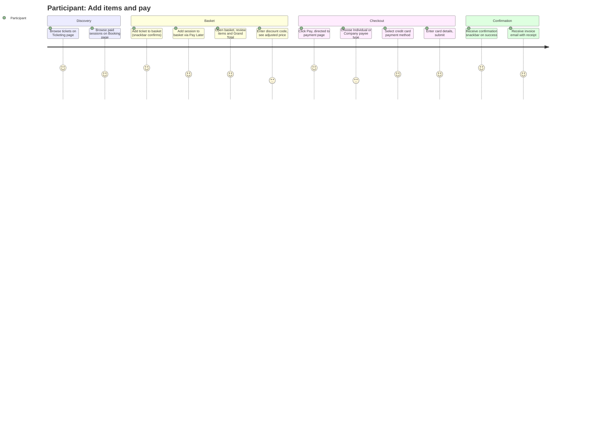
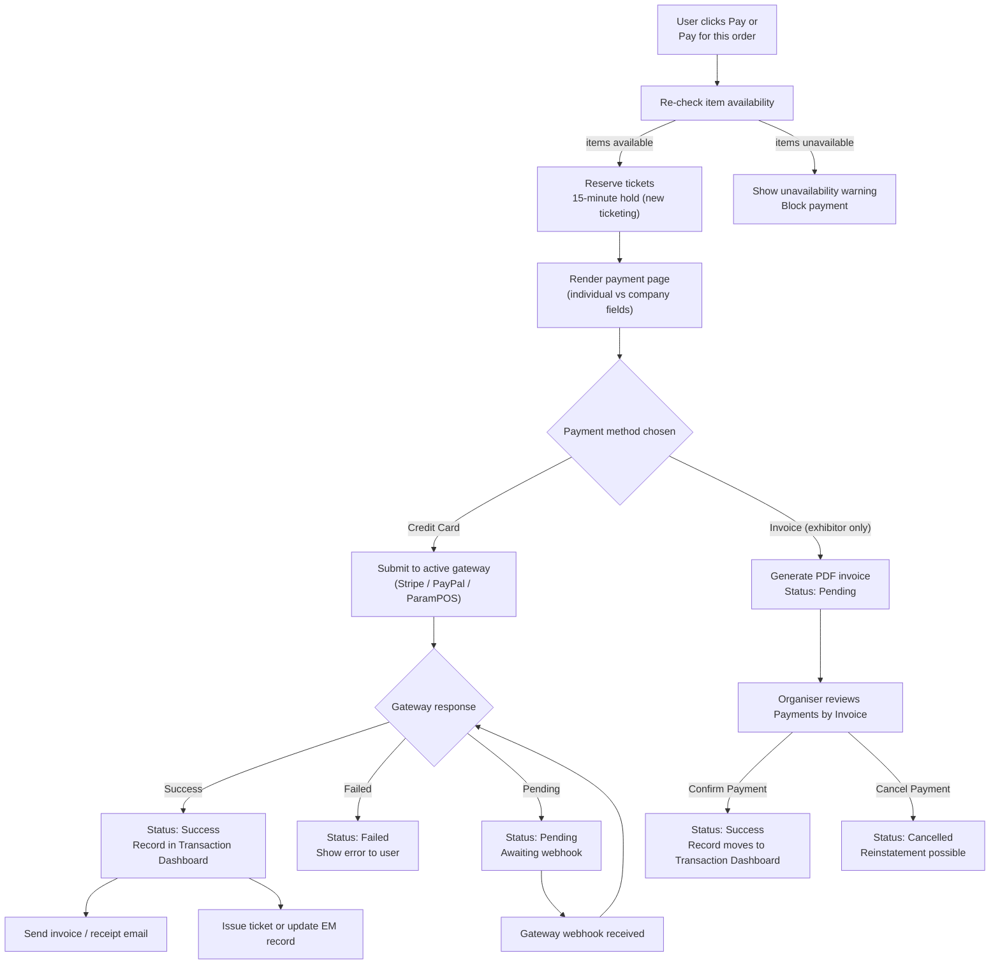
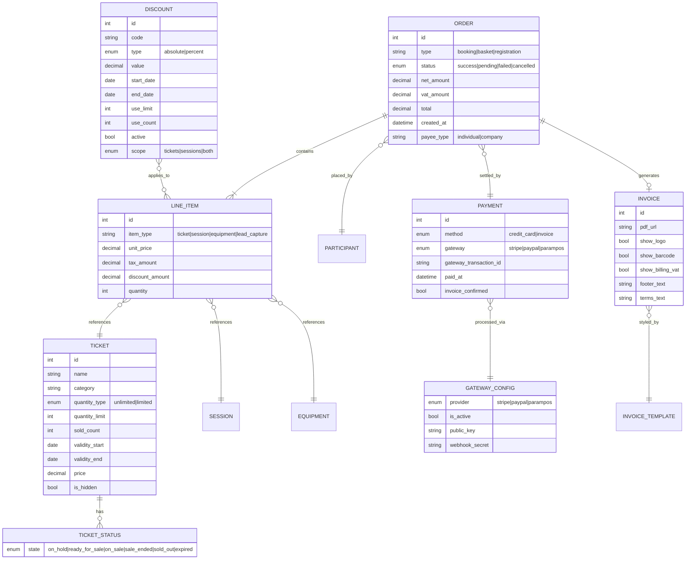
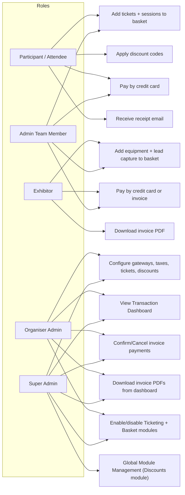

## 1. Product Overview

**Purpose.** The Transactions and Purchasing module is ExpoPlatform's end-to-end commerce engine. It gives event organisers the infrastructure to sell tickets, collect exhibitor manual payments, apply discounts, process card and invoice payments through third-party gateways, generate VAT-compliant invoices, and report on every financial transaction that occurs across an event.

**Problem being solved.** Event commerce is complex: visitors want to buy tickets and session seats, exhibitors need to pay for stand equipment and lead-capture services, organisers must issue VAT invoices to EU companies, apply early-bird or bulk-purchase discounts, and reconcile all payments in one dashboard. Without a unified purchasing layer, money flows through ad-hoc spreadsheets, offline bank transfers, and disconnected tools — with no audit trail and no automated receipts.

**Business value.**
- All purchasable items (tickets, sessions, equipment, lead capture) flow through one basket, one payment page, and one transaction record.
- Organiser revenue lands directly in their own payment gateway account — ExpoPlatform acts as the platform, not the merchant of record.
- EU-compliant VAT engine calculates tax correctly for same-country, cross-border EU, and non-EU payer combinations automatically.
- Three certified gateway integrations (Stripe, PayPal, ParamPOS) let organisers connect whichever provider they have a contract with.
- Discount codes and multi-buy promotions drive registration conversion; a ticket-upgrade path maximises per-attendee revenue.
- Invoicing and the Transaction Dashboard give finance teams an auditable, PDF-downloadable paper trail without manual work.

**Target users.** Organiser admins configure and operate the module. Participants (visitors/attendees) purchase tickets and paid sessions. Exhibitors purchase equipment and lead-capture services through their manual basket. Admin team members can act on behalf of either persona. ExpoPlatform staff (TAMs) assist with setup but do not process transactions.

**User personas.**
- *Organiser admin* — configures payment gateways, taxes, ticket types, discounts, invoice templates, and monitors the Transaction Dashboard. Confirms or cancels exhibitor invoice payments.
- *Participant / Attendee* — selects and pays for tickets and sessions via the participant basket, applies discount codes, receives a receipt email.
- *Exhibitor* — adds equipment and lead-capture to their manual basket, pays by credit card or invoice download, sees their orders in the Exhibitor Manual.
- *Admin team member* — operates a unified basket on behalf of both participant and exhibitor personas; discounts apply only to participant items.

**Success metrics.** Payment success rate (successful / total attempts); average basket-to-checkout conversion time; invoice confirmation lag (days from exhibitor download to organiser confirmation); discount code redemption rate; VAT calculation accuracy (support escalations about tax errors); Transaction Dashboard completeness (no missing invoice records).

## 2. Product Scope

### Included
- **Shopping basket** for participants (tickets, sessions) and exhibitors (equipment, lead capture), including the unified admin team-member basket.
- **Ticket management**: ticket creation and configuration, multiple pricing models (fixed, dynamic, free), category restrictions, validity dates, location/check-in zones, hide/show and clone actions, old and new ticketing experience (feature-flagged).
- **Ticket purchasing and upgrades**: add-to-basket from registration or profile, upgrade to higher-value category, automatic discount on category switch, restriction on lower-value downgrades.
- **Basket payment page**: individual and company payee types, VAT number capture, payment method selection (card or invoice download).
- **Payment gateway integrations**: Stripe (card + webhooks), PayPal Manager (card), ParamPOS (Virtual/Physical/Mobile POS + ParamTIK).
- **Taxes and VAT**: default country-based tax, custom taxes per item type, EU VAT rules with VRN validation, Disable VAT rules mode.
- **Invoicing**: customisable invoice layout (logo, barcode, billing details, footer, terms), PDF download.
- **Receipts / invoice email**: organiser-configurable email template sent on successful payment.
- **Discount codes**: percentage or absolute, per-category, per-session-type, time-limited, usage-capped, importable/exportable.
- **Multi-buy discounts**: session-only volume discounts, applied before code discounts, per-order application limit.
- **Transaction Dashboard**: all payment records (success / pending / failed) with PDF invoice, regeneration, and net/VAT/total breakdown.
- **Payments by Invoice (Exhibitors)**: organiser confirms or cancels pending invoice payments; confirmed records move to Transaction Dashboard.
- **General Payment Settings**: currency, merchant name, billing company details, payee type default, zero-price invoice, disable invoice option, send-payee-email.
- **Module management controls**: Basket module on/off per participant and exhibitor; Discounts module enable gate; New Ticketing feature flag.

### Excluded
- Refunds processed through the platform (not supported — organiser is responsible for manual refunds).
- Partial payments (not supported).
- Payments directly from organiser to individual vendors (all payments go to the organiser's gateway account).
- Participant invoice payments (invoice download is available only for exhibitors, not participants).
- Exhibitor discount codes (discounts apply only to participant items; exhibitors have no code-based discounts).
- Mobile app basket (covered separately in Mobile App documentation).
- RFP-specific currency settings (those live in admin/rfp/settings).
- Post-approval charging for private/public-registration events (organiser must refund rejected users manually).

## 3. User Roles

| Role | Purchase capabilities | Basket type | Discounts | Invoice access | Admin access |
| --- | --- | --- | --- | --- | --- |
| **Organiser (Admin)** | Configures all purchasing settings; cannot purchase as a buyer | N/A | Manages discount codes and multi-buy rules | Creates invoice template; confirms/cancels exhibitor invoices; downloads PDFs from Transaction Dashboard | Full access to admin/payments, admin/registration/pricing, Transaction Dashboard, Payments by Invoice |
| **Participant / Attendee** | Tickets, paid sessions (accompanying person via registration) | Participant basket | Discount codes (sessions + tickets); multi-buy (sessions only) | Receives receipt email; no PDF download | No admin access |
| **Exhibitor** | Equipment, lead-capture services via Exhibitor Manual | Exhibitor basket | No discount codes; exhibitor discounts possible only if organiser enables EM discount scope | Invoice download (PDF) for offline payment | Access to own Exhibitor Manual; sees basket history in EM |
| **Sponsor** | Same as Exhibitor for EM items if applicable | Exhibitor basket (if EM enabled) | No | Invoice download | EM scope only |
| **Speaker** | Paid session booking if sessions are paid | Participant basket | Discount codes if applicable | Receipt email | No admin access |
| **Admin Team Member** | Can add both participant and exhibitor items to participant basket | Unified basket | Discounts apply to participant items only | N/A | Logs appear in admin/exhibitormanual/submissions for exhibitor items |
| **Super Admin / Admin** | All organiser capabilities plus platform-wide configuration | N/A | Can enable/disable discount module globally | Full | Module Management, Global settings |

> [!INFO] Partial payments and refunds are not available through the platform. Exhibitors are the only user type who can initiate an invoice-based (offline) payment. Participants must pay by credit card.

## 4. Feature Inventory

#### 4.1 Shopping Basket — Core Functionality
**Description.** A persistent, slide-in basket panel accessible from a header icon across the platform, where users accumulate purchasable items before proceeding to checkout.
**Why it exists.** Mirrors familiar e-commerce basket UX; allows users to add multiple item types in one session and pay in a single transaction rather than item by item.
**User value.** Reduces friction — items from different sections (tickets, sessions, equipment) accumulate in one place; users can review, modify, and pay at their convenience.
**Functional logic.** Basket icon in the header shows a counter of total items. Clicking opens the panel (max 90% screen height; full-screen on ≤767px). Empty state shows placeholder text. Items group into sections (e.g., Tickets, Sessions, Equipment). Each section can be expanded (full detail) or collapsed (shows subtotal, taxes, discounts). Bin button removes individual items. Grand Total = Subtotal + Taxes − Discount. Two payment triggers: **Pay** (all items, basket-wide) and **Pay for this order** (single section).
**Preconditions.** Basket module enabled in Module Management for the user type (participant or exhibitor).
**Trigger conditions.** User adds an item; user opens basket manually; user clicks Pay or Pay for this order.
**Processing logic.** On each open and before payment, the system checks item availability. Unavailable items shown at 60% transparency with red icon; changed items shown with grey icon. Warning line "Some changes have occurred…" appears if any issues found. If all items in a section are unavailable, "Payment for this order is unavailable" replaces the pay button with "Remove order."
**Outputs.** User directed to payment page on Pay / Pay for this order; basket state persisted across sessions.
**Dependencies.** Module Management (basket on/off); item availability checks (tickets, sessions, equipment, lead capture modules).
**Configurations.** Basket module toggle per user type; Basket icon visibility tied to module state.
**Validation rules.** Cannot pay for unavailable items. Bulk payment enforced — cannot pay for individual items without removing others. Items re-checked at payment trigger.
**Permissions.** Participants and exhibitors see their respective basket types. Admin team members see unified basket.
**Error handling.** Unavailable items shown with icon; warning line appears; "Payment for this order is unavailable" prevents accidental payment.
**Edge cases.** Item price changes after item added (grey icon, warning); item sold out after added (red icon, 60% opacity); basket module turned off mid-session (basket icon hidden); concurrent device sessions sharing basket state.

#### 4.2 Exhibitor Basket Specifics
**Description.** The exhibitor basket surfaces only items from the Exhibitor Manual (equipment, lead capture) with deadline handling and custom tax support.
**Why it exists.** Exhibitor purchasing follows different rules — items have order deadlines, lead capture has per-team-member or per-exhibitor pricing, and taxes may differ from participant defaults.
**Functional logic.** Equipment: shows quantity added and remaining. Lead capture: two modes — Per Exhibitor (all team members) and Per Team Member (specific). "Enable for all (free)" in EM settings removes lead capture from basket. Deadlines: approaching deadline → visual indicator. Passed deadline with "Allow edit manual pages after deadline" disabled → payment blocked; "Remove order" appears. Error message (updated May 2026): "The order deadline for this section is [Date]. Please finalize your order by then."
**Configurations.** "Allow edit manual pages after deadline" in admin/exhibitormanual/settings.
**Edge cases.** Lead capture items added to basket become unavailable if "Enable for all (free)" activated after basket addition; deadline passes while exhibitor has items in basket.

#### 4.3 Participant Basket Specifics
**Description.** The participant basket holds tickets and sessions, applies discount codes, and offers immediate or deferred payment.
**Functional logic.** When a ticket is booked on the Booking page, basket popup auto-shows the new ticket. User can Pay immediately or Pay later (closes popup, returns to Booking). Grand Total = Subtotal + Taxes − Discount. Discount code entered under "Total price" section. Multi-buy discount applied first; code discount applies to the already-discounted price. Only one code active at a time — new code replaces the previous. Discount persists across basket open/close cycles.
**Discount feedback messages.** "Discount successfully applied!" / "Invalid code. Please check the code and try again!" / "Is not valid for the added items" / "Discount code has expired."
**Availability checks for tickets.** Ticketing enabled; category visible and not deleted; ticket not expired; ticket not deleted.
**Availability checks for sessions.** Session limit not reached; session not deleted; Session module on; session date not expired.
**Edge cases.** "Add to Basket" deep-link on session page allows direct basket addition from any browser; session limit changes between add and pay.

#### 4.4 Unified Admin Team Member Basket
**Description.** Admin team members can combine participant items (tickets, sessions) and exhibitor items (equipment, lead capture) in a single participant basket view.
**Why it exists.** Admins acting on behalf of exhibitors who are also participants (or vice versa) need one checkout flow.
**Functional logic.** Both item types display and function as in their native baskets. Grand total includes all items. Discounts apply only to participant items — exhibitor items not discounted. Taxes calculated for all items. Counter reflects all items. Exhibitor items purchased via this path are logged in admin/exhibitormanual/submissions.
**Configurations.** No separate toggle — derived from admin team member role.

#### 4.5 Basket Payment Page
**Description.** The checkout form where users provide billing information and select a payment method before finalising the transaction.
**Why it exists.** Captures the data needed to generate a compliant invoice, routes the payment to the correct gateway, and gives users a summary before committing.
**Functional logic.** Elements depend on payee type (Individual or Company). Common fields: Invoice to (required), Email for notification (optional). Company adds: Company Name, Company Address, Country of Residence, Company City, Zip/Postal Code, VAT Number (optional), Payment reference (optional). Payment Method block: **Invoice** (exhibitors only — generates PDF, payment confirmed manually by organiser) or **Pay with Credit Card** (all users). ParamPOS adds Cardholder name field for credit card. Summary block: Merchant name, Price, Tax, Discount (participants only), Selected payment method (exhibitors only), Grand Total.
**Preconditions.** User has items in basket; at least one payment method enabled.
**Processing logic.** On clicking Pay/Pay for this order, system re-checks item availability (including ticket reservation — 15-minute hold on new ticketing path, EP-37784). If items available, payment form rendered.
**Outputs.** Payment initiated to gateway OR invoice PDF downloaded.
**Configurations.** "Set default payee type as Company" in admin/payments/general. "Disable invoice payment" forces credit-card-only mode.
**Validation rules.** Required fields enforced (red frame + warning for invalid card fields on ParamPOS). VAT number validated for EU companies only.
**Error handling.** Invalid credit card details — field framed in red, warning shown. Missing gateway config — critical risk of money deducted without status record.
**Edge cases.** Invoice payment disabled but Invoicing tab still visible in admin; exhibitor selects Invoice with no active gateway configured.

#### 4.6 Ticketing — Settings and Administration
**Description.** The admin-side control panel for enabling ticket sales, configuring ticket behaviour, and managing the ticket lifecycle.
**Why it exists.** Organisers need fine-grained control over when tickets are visible, who can buy them, and how the ticketing section appears during registration.
**Functional logic.** Ticketing toggle (default OFF) in admin/registration/pricing. Creating tickets does not automatically enable ticketing — organiser must manually enable. Cannot enable ticketing with zero tickets. Notification when disabled: "Ticketing is disabled. Please enable it to allow attendees to purchase tickets." Settings pop-up (available even when disabled): Hide on Summary, Allow to Change Category (requires Category field on registration form). Ticketing Page Description (custom text, no rich text, multi-language). Lock behaviour when sold: Edit/Delete removed from three-dot menu; replaced by View (read-only). **New Ticketing toggle** in Module Management (Backend): default OFF; settings stored separately — toggling does not delete either version's data.
**Configurations.** Ticketing toggle; Hide on Summary; Allow to Change Category; New Ticketing feature flag (per-event or global).
**Validation rules.** Cannot enable ticketing without at least one ticket. Sold ticket cannot be edited or deleted — "Not allowed to apply changes for already sold tickets."
**Error handling.** Attempt to save changes to sold ticket → error message shown. Attempt to delete sold ticket → error message shown.

#### 4.7 Ticket Setup (Create / Edit / Clone)
**Description.** The popup form used by organisers to create, edit, or clone individual ticket types.
**Functional logic.** Name (required, max 50 chars), Description (optional, max 400 chars). Category: Available for All (default) or Specific Category (if Category field on registration form; deleting category reverts ticket to Available for All). Location: multi-zone check-in; All Locations cannot combine with specific zones. Quantity: Unlimited or Limited (min 1). Validity: Specific Dates (multi-select, event timezone, mandatory) or Non-specific Dates (days-of-attendance model, min 1, max event duration). Header background: gradient (brand colors, random angle, reset button) or custom image (aspect ratio 2.6, 434×167px). Preview for background.
**Validation rules.** Name required; quantity minimum 1 if limited; Specific Dates requires at least one date; category selector disabled if Category field absent from registration form.
**Edge cases.** Cloned ticket named "Copy of [original]"; re-cloning yields "Copy of Copy of [original]". Changing event timezone retroactively changes validity dates for existing tickets.

#### 4.8 Ticket Statuses and Lifecycle
**Description.** Six states govern the purchasability and visibility of a ticket throughout its lifecycle.
**Functional logic.**
- **On Hold** — ticketing is disabled globally; tickets not visible to participants except purchased ones.
- **Ready for Sale** — before the sales start date; visible but not purchasable.
- **On Sale** — within the active sale window; purchasable.
- **Sale Ended** — after the sales end date; no longer purchasable.
- **Sold Out** — quantity exhausted.
- **Expired** — after event end or expiration date.
**Dependencies.** Ticketing toggle (On Hold); sale start/end dates configured per ticket; quantity fields.

#### 4.9 Ticket Purchasing (Participant Experience)
**Description.** The end-user flow for selecting and paying for tickets from the Registration page or Attendee Profile.
**Functional logic.** Tickets displayed on Tickets Page with name, price, description, terms. Add Ticket → confirmation snackbar → item in basket. Apply discount code in checkout. Proceed to Payment → gateway redirect → on success: snackbar "Ticket successfully added for purchase!" + automated confirmation email.
**Preconditions.** Ticketing enabled; at least one ticket in On Sale status visible to the participant's category.
**Trigger conditions.** Participant navigates to Registration page or Ticketing tab in profile.
**Outputs.** Ticket reserved and paid; confirmation email sent; ticket record created.

#### 4.10 Ticket Upgrades
**Description.** Allows participants to purchase additional tickets in the same category or switch to a higher-value category with automatic credit for the replaced tickets.
**Why it exists.** Maximises revenue and gives participants flexibility to upgrade their access without losing the value of previously purchased tickets.
**Functional logic.** Same-category additional ticket: merges with existing tickets, category unchanged. Different-category ticket (if Allow to Change Category enabled): warning shown; old tickets replaced; system automatically deducts value of old tickets as a discount on new ones. Restriction: if new ticket total is lower than replaced ticket total, system blocks payment and displays message at payment initiation step — cannot downgrade.
**Validation rules.** Downgrade blocked: new ticket total must be ≥ replaced ticket total. Discount equals total value of all replaced tickets.
**Edge cases.** Category change setting disabled → cross-category purchase not available. Price of new tickets equals old tickets → allowed (zero additional charge after discount).

#### 4.11 Payment Gateway Integrations
**Description.** Three supported payment service providers: **Stripe**, **PayPal Manager**, and **ParamPOS** — configured at admin/payments/integration.
**Why it exists.** Different organisers have contracted with different gateways in different regions; the platform must accommodate any of them without forcing a single provider.
**Functional logic.** Only one gateway can be active at a time. All fields must be completed — a missing secret key can cause money to be deducted from the payer's account while no payment status is recorded in the system. Stripe: Test + Live public keys, secret keys, and webhook secret keys. PayPal: Test + Live Client IDs and secret keys; key validation differs between test (presence only) and live (active key check) modes. ParamPOS: GUID, Client code, Client Username, Client Password; ExpoPlatform holds the SSL certificate; test credentials available for sandbox testing. ParamPOS adds a Cardholder name field on the payment page.
**Configurations.** admin/payments/integration; test mode vs live mode.
**Validation rules.** All fields required; missing secret key is a critical misconfiguration.
**Error handling.** Incomplete integration → payment errors; incorrect gateway status in system despite money deducted from user.
**Security.** Secret keys must never be exposed in client-side code; rotate regularly; use restricted API keys for Stripe.

#### 4.12 General Payment Settings
**Description.** The global configuration for currency, merchant identity, billing company details, and payment behaviour defaults.
**Functional logic.** Currency: all currencies supported (platform-wide; RFP can have separate currency). Merchant name: shown on payment page summary. Billing Company Details: name, address, phone, email (toggleable on invoices). Set default payee type as Company: pre-selects Company on payment page. Send invoice with 0 price: toggles generation of zero-value invoices. Disable invoice payment: forces credit-card-only mode for exhibitors, hides invoice option on front end. Send to payee email after registration: triggers invoice email on successful payment.
**Configurations.** admin/payments/general.
**Validation rules.** Currency change is global (except RFP). Total Payments in admin/visitors includes deleted participants' payments.

#### 4.13 Taxes Configuration
**Description.** Two-tier tax setup: the Taxes page (`admin/payments/taxes`) for default and custom rates, and per-section overrides in the Exhibitor Manual for equipment and lead capture.
**Why it exists.** Events operate across jurisdictions with different tax rates; EU B2B transactions have reverse-charge rules; some item types (tickets, sessions) may carry different rates from general event items.
**Functional logic.** Taxes page: Tax name (appears across baskets, payment pages, registration summary, sessions, and all admin reports), Billing Company Country (auto-sets default EU VAT rate), Default Tax %, Billing Company VAT. EM taxes take precedence over Taxes page values. Custom taxes: separate rates for Tickets, Sessions, Equipment, and Lead Capture. Absolute tax value (not percentage) displayed in basket and on payment pages.
**Tax display locations.** Front end: exhibitor/participant basket, payment pages, registration summary Tickets tab. Admin: Transaction Dashboard (VAT Amount column), Payments by Invoice, admin/events/byBooking, Payments report in admin/data, invoice PDF.
**Configurations.** admin/payments/taxes; EM equipment and lead-capture sections.

#### 4.14 VAT Rules Engine
**Description.** Automated EU VAT compliance logic that adjusts the tax charged based on the billing company country and paying company country/VAT registration.
**Why it exists.** EU reverse-charge rules mean a VAT-registered business in country B buying from a company in country A should not pay VAT — the platform must calculate this automatically to avoid over-charging.
**Functional logic.** VAT rules active by default when user pays as company. Individuals always pay the configured tax — no exceptions. EU VRN validation available; non-EU companies not validated. Key rules (Disable VAT rules OFF): EU billing + EU paying with VRN entered → no tax (reverse charge); EU billing + EU same country → tax calculated; Non-EU billing + EU paying → tax should be zero; EU billing + non-EU paying → no tax. Disable VAT rules mode: all companies pay the configured custom tax regardless of EU/non-EU status.
**Configurations.** "Disable VAT rules" toggle in admin/payments/taxes; Billing Company Country; Billing Company VAT.
**Validation rules.** VRN validated only for EU companies. VRN field on payment page available for both exhibitors and participants when paying as company.
**Edge cases.** Non-EU billing + same non-EU paying country with custom tax: should apply custom tax (known rule requiring fix). EU billing company with no VAT number entered + EU paying company with VRN: should result in zero tax (known rule requiring fix).

#### 4.15 Invoicing (Invoice Layout)
**Description.** The organiser-configurable template that determines what appears on the PDF invoice generated for every payment.
**Functional logic.** Located at Event Setup > Payments > Invoicing tab. Toggle elements: Show Logo (with Left/Center/Right alignment; PNG or JPEG, Clear Logo button), Show Barcode, Show Event Title, Show Billing Company Name/Address/Email/Phone, Show Billing Company VAT. Text editors: Footer Text, Terms and Payment advice. Invoicing tab remains visible even when Disable invoice payment is active.
**Configurations.** Event Setup > Payments > Invoicing.
**Validation rules.** Logo formats: PNG and JPEG only. Invoicing tab cannot be hidden by disabling invoice payment.

#### 4.16 Receipts (Invoice Email Template)
**Description.** The organiser-configured email template sent to payees after successful payment.
**Why it exists.** Payees need a confirmation of their transaction; organisers need a branded, customisable document rather than a generic system email.
**Functional logic.** Uses the platform email builder (blocks, content, style). Subject, From, Reply-to, Copy-to fields. Option to copy template from another event in the same environment. "Send invoice email" toggle: if OFF, no emails sent regardless of payment type. "Send Payee Email" in General settings: sends invoice email on successful payment after registration.
**Configurations.** Event Setup > Payments > Receipts; "Send invoice email" toggle; "Send Payee Email" in General settings.

#### 4.17 Transaction Dashboard
**Description.** The admin transaction ledger at `admin/payments/transactions`, providing a paginated, searchable record of every payment attempt.
**Why it exists.** Organisers need a single source of truth for all financial activity — successful payments, pending card attempts, failed transactions — with invoice access and reconciliation data.
**Functional logic.** Columns: ID (environment-level; IDs non-sequential due to abandoned registration starts — not transactionally unique), Account ID, Account Name, Status (success / pending / failed), Type (booking / basket / registration), Net Amount (before tax and participant discounts), VAT Amount, Total, Date, Invoice (PDF download or "Invoice not generated yet"), Regenerate Invoice. Pagination controlled by Items per page field. No post-approval charging — organiser must manually refund rejected registrants.
**Outputs.** Invoice PDF download; regenerated invoice.
**Edge cases.** IDs appear out of order due to abandoned registration starts; "Invoice not generated yet" can appear temporarily after payment; organiser is sole responsible party for refunds.

#### 4.18 Payments by Invoice (Exhibitors)
**Description.** A separate admin view of all invoice-based payments generated by exhibitors, with manual confirm/cancel controls for the organiser.
**Why it exists.** Exhibitors can download an invoice and pay offline (bank transfer); the organiser needs to mark those payments as confirmed once funds clear.
**Functional logic.** Table columns mirror Transaction Dashboard (ID, Account ID/Name, Status, Type [always "basket"], Net Amount, VAT Amount, Total, Date, Invoice PDF). Action column: Cancel Payment (pending status only; if cancelled, Confirm Payment appears allowing reinstatement). Confirm Payment (success or cancelled status). Confirmed payment moves record to Transaction Dashboard. "Disable invoice payment" setting: tab persists but no new invoices generated. Invoice info also visible in admin/exhibitormanual/submissions.
**Preconditions.** Exhibitor selects Invoice on payment page and downloads PDF.
**Processing logic.** Organiser reviews pending invoices → confirms on receipt of payment (or cancels if abandoned).
**Edge cases.** Disable invoice payment activated mid-event — existing invoices in pending state are not automatically cancelled; organiser must manually resolve.

#### 4.19 Discount Codes
**Description.** Organiser-created promo codes that participants enter in the basket to reduce the price of tickets and/or sessions.
**Why it exists.** Drive early registration, reward loyalty, enable event-specific promotions without manual price adjustments.
**Functional logic.** Setup at Registration settings > Discounts (Discounts module must be enabled in Module Management first; "Discount codes" setting in Visitor Additional Settings must be toggled on). One code per basket at a time — entering a new code replaces the current one. Each code usable only once per user. Code type: Absolute (fixed reduction) or Percent (percentage off). Scope: Apply to Categories, Use for Sessions (All / Custom Sessions / Tracks / Types / Tags), Use for Tickets. Date validity (event timezone; end date = midnight before that date). Active toggle. Use Limitation (collective cap across all users). Export to Excel; import from example-file CSV. If discount applies to both sessions and tickets: applied to combined total of those sections. If discount is for specific track: applied cumulatively to that track's sessions (e.g., two $100 sessions + 10% = $180 total). Exhibitor Manual scope: organiser can optionally enable discount codes for specified exhibitor categories (whole EM or Equipment Rental only).
**Validation rules.** End date entry of "8 May" means code expires midnight 7 May. Discount code applied only to participant items when admin team member uses unified basket.
**Error handling.** Invalid code → "Invalid code. Please check the code and try again!" / partial invalid → "Is not valid for the added items" / expired → "Discount code has expired."

#### 4.20 Multi-buy Discounts
**Description.** Volume-based discounts that automatically apply when a participant adds more than a specified number of sessions to their basket.
**Why it exists.** Incentivise participants to book multiple sessions, increasing session revenue and event engagement simultaneously.
**Functional logic.** Sessions only (not tickets). Available in participant profile basket — not during registration. Applied before any discount code. Only one multi-buy discount per category and session — duplicate attempt shows "Multi-buy discount for target category and sessions already exists." Type: Absolute or Percent. Apply Starting From: minimum number of eligible items in basket before discount activates. Limit for the Order: how many additional items the discount applies to in one order. Use Limitation: collective cap. Active toggle. Shows list of participants who have used the discount.
**Validation rules.** Cannot create duplicate multi-buy for same category + session combination.
**Edge cases.** Multi-buy + code discount stacking: multi-buy applied first, code adjusts the already-discounted price.

## 5. User Stories Mapping

| Story ID | Title | Summary | Acceptance (key criteria) | Related feature | Status |
| --- | --- | --- | --- | --- | --- |
| EP-923 | (New UI) My Basket for the participant | New UI basket design and behaviour for participants | Basket renders new UI design (Figma spec); items add/remove correctly; Pay and Pay later both work; grand total calculation correct | 4.1, 4.3 Shopping Basket — Participant | COMPLETE |
| EP-1073 | (New UI) Exhibitor Manuals. Basket and Payment | New UI for exhibitor manual basket and payment flow | Exhibitor basket renders new design; equipment and lead capture items display correctly; payment methods work | 4.2 Exhibitor Basket; 4.5 Payment Page | COMPLETE |
| EP-1181 | Enable setting to turn off and on Invoice payments | Admin setting to disable invoice payment option globally | When disabled, invoice payment option hidden from payment page front end; admin toggle at /api/v1/exhibition works | 4.5 Basket Payment Page; 4.12 General Payment Settings | COMPLETE |
| EP-1761 | PAID Sessions in New UI | Streamline paid session booking in New UI | Clicking on paid session on session page adds directly to basket; user not required to navigate to Booking page first | 4.3 Participant Basket; 4.9 Ticket Purchasing | COMPLETE |
| EP-26539 | Setting up payment integrations for the new front | PayPal and ParamPOS working on new UI basket | PayPal and ParamPOS payment integrations function correctly with new basket UI; no incompatibility with existing basket logic | 4.11 Payment Gateway Integrations | COMPLETE |
| EP-27695 | Include module "Basket" for all participants and exhibitors | Basket module on/off controls basket icon visibility for both user types | Turning off Basket module hides basket icon on front end; turning on shows it; applies to both participant and exhibitor | 4.1 Shopping Basket — Core; Module Management | COMPLETE |
| EP-37664 | (Part 2) Introducing new tickets to the basket | New ticket objects displayed and purchasable in basket | New ticket type renders in basket as purchasable item; ticket details shown correctly; payment flow completes for new tickets | 4.3 Participant Basket; 4.9 Ticket Purchasing | COMPLETE |
| EP-37784 | (Part 2) Reservation of tickets on the payment page | 15-minute ticket reservation on payment page initiation | Clicking Pay or Pay for this order reserves tickets for 15 minutes; reservation settings (availability, visibility) do not affect reserved tickets during reservation window | 4.5 Basket Payment Page; 4.9 Ticket Purchasing | COMPLETE |
| EP-1201 | The exported brand list shows brands in random order | Alphabetical ordering of exported brand list | Exported list sorted alphabetically | Reporting / Data Export (adjacent) | COMPLETE |
| EP-15587 | Add additional filter param for meetings export endpoint | Incremental update filters for meetings API | /api/v2/meetings/export supports account_id, time_from, time_to, order_by; filters by modified date | API / Meetings (adjacent) | COMPLETE |

> [!INFO] Stories EP-1090 (Messenger improvement), EP-1876 (Informa Fashion App Update), EP-9803 (Badge builder), EP-49752 (Qdrant Pilot), and EP-15587 were included in the stories.json but are not directly in scope for Transactions and Purchasing. They are listed in the full stories.json for completeness but mapped to their primary product areas.

## 6. End-to-End Workflows

### Basket-to-payment user journey — participant

### Payment processing — system workflow

### Happy path
Participant selects ticket → adds to basket → applies discount code → clicks Pay → redirected to payment page → fills individual/company details → selects credit card → card processed by active gateway (Stripe/PayPal/ParamPOS) → gateway returns success → Transaction Dashboard records success → invoice/receipt email sent → ticket confirmed in participant profile.

### Alternate paths
- **Exhibitor pays by invoice:** selects Invoice on payment page → downloads PDF → pays via bank transfer → organiser confirms payment in Payments by Invoice → record moves to Transaction Dashboard → exhibitor items confirmed in EM.
- **Pay Later:** participant adds items to basket, closes basket, returns later, completes payment in next session — basket persists.
- **Cross-category ticket upgrade:** participant with existing ticket adds ticket from different category → warning shown → old ticket value auto-deducted as discount → checkout proceeds.

### Exception paths
- **Card declined:** gateway returns failed status → user shown error → basket retained → user can retry or choose different payment method.
- **Item unavailable at checkout:** availability re-check fails → warning shown → user must remove unavailable items before paying.
- **Discount code invalid:** error message shown → user prompted to check code; basket price unchanged.
- **Downgrade blocked:** new ticket total lower than replaced ticket value → system blocks payment initiation with explanatory message.

### Recovery paths
- **Failed payment:** user retries with correct card details; basket retained.
- **Abandoned basket:** items remain; session expires naturally; on next basket open, availability re-checked.
- **Invoice cancelled by organiser:** exhibitor can be notified and re-download invoice; organiser can restore payment with Confirm Payment.
- **Ticket reservation expired (15 min):** user must initiate payment again; tickets released back to available pool.

## 7. Business Rules Engine

| # | Rule | Condition | Exception / Priority | Conflict resolution |
| --- | --- | --- | --- | --- |
| BR-1 | Only one payment gateway can be active at a time | At admin/payments/integration | None | Last-saved gateway takes precedence |
| BR-2 | All gateway fields must be filled completely | On gateway save | Missing secret key → error transactions | Admin warned; incomplete configs must not go live |
| BR-3 | Grand Total = Subtotal + Taxes − Discount | For all baskets | Discount applies to participant items only in unified basket | Tax absolute value, not percentage, shown in basket |
| BR-4 | Multi-buy discount applied before discount code | When both present | Only one multi-buy per category+session | Multi-buy first; code adjusts already-discounted price |
| BR-5 | Only one discount code active at a time | Participant basket | New code replaces previous | Last entered code wins |
| BR-6 | Each discount code usable only once per user | Per-user enforcement | Use Limitation sets collective cap | Per-user one-time rule is a hard constraint |
| BR-7 | Invoice payment available only to exhibitors, not participants | On payment page render | Disable invoice payment setting forces card-only for all | If disabled, Invoice option hidden for exhibitors too |
| BR-8 | Ticket cannot be edited or deleted once sold (counter > 0) | On edit/delete attempt | — | Error: "Not allowed to apply changes for already sold tickets." |
| BR-9 | Ticketing cannot be enabled with zero tickets created | On enable toggle | — | Toggle disabled; organiser must create at least one ticket |
| BR-10 | EU reverse-charge: EU billing + EU paying with VRN → zero tax | When Disable VAT rules is OFF | Disable VAT rules ON → custom tax applies to all | VAT rules table determines outcome |
| BR-11 | Individuals always pay the configured tax, no exceptions | Payee type = individual | — | VRN entry irrelevant for individuals |
| BR-12 | Ticket upgrade to lower-value category is blocked | New total < replaced ticket total | Equal value allowed | System blocks at payment initiation; message shown to user |
| BR-13 | Basket module off → basket icon hidden on front end | Module Management toggle | — | Module on/off is immediate for icon visibility |
| BR-14 | No partial payments; no platform-side refunds | All transaction types | Organiser responsible for manual refunds | Not a configurable option |
| BR-15 | Exhibitor deadline passed + "Allow edit after deadline" disabled → payment blocked | Exhibitor basket section | Setting "Allow edit" ON → payment remains available after deadline | "Remove order" replaces "Pay for this order" |
| BR-16 | Tickets reserved for 15 minutes on payment page initiation (new ticketing) | New Ticketing toggle ON | Reservation window is fixed; not configurable | If payment not completed within 15 min, reservation released |

## 8. Data Model

### Entity-relationship diagram

**Inputs.** Item selections (ticket IDs, session IDs, equipment IDs); payee billing details; payment method choice; gateway credentials; discount code; tax configuration; invoice template settings.
**Outputs.** Order record; Line items; Payment record (with gateway transaction ID); Invoice PDF; Receipt email; Updated ticket sold count; Updated discount use count.
**Objects.** Order (the transaction container), LineItem (each purchasable unit), Ticket (configuration), Payment (gateway interaction), Invoice (document), Discount (code or multi-buy rule), GatewayConfig (active provider settings).
**Relationships.** One Order → many LineItems → each references a Ticket, Session, or Equipment item. Order settled by one Payment. Payment processed via one active GatewayConfig. Discount applies to LineItems matching scope. Invoice generated per Order, styled by InvoiceTemplate.

### Payment state machine

```mermaid
stateDiagram-v2
  [*] --> Initiated : user clicks Pay
  Initiated --> Pending : submitted to gateway or invoice downloaded
  Pending --> Success : gateway webhook confirms OR organiser confirms invoice
  Pending --> Failed : gateway returns failure
  Pending --> Cancelled : organiser cancels invoice payment
  Cancelled --> Pending : organiser reinstates via Confirm Payment
  Failed --> Initiated : user retries
  Success --> [*]
  note right of Pending : credit card - awaiting webhook\ninvoice - awaiting organiser confirmation
  note right of Cancelled : invoice path only;\nreinstatement possible
```

## 9. Permissions Matrix

| Capability | Participant | Exhibitor | Admin Team Member | Organiser Admin | Super Admin |
| --- | --- | --- | --- | --- | --- |
| Add tickets to basket | ✅ | ❌ | ✅ (participant items) | ❌ | ❌ |
| Add equipment to basket | ❌ | ✅ | ✅ (exhibitor items) | ❌ | ❌ |
| Apply discount codes | ✅ | ❌ | ✅ (participant items only) | ❌ | ❌ |
| Pay by credit card | ✅ | ✅ | ✅ | ❌ | ❌ |
| Pay by invoice (download PDF) | ❌ | ✅ | ❌ | ❌ | ❌ |
| Receive receipt email | ✅ | ✅ | N/A | N/A | N/A |
| View own order history | ✅ (Ordered Items) | ✅ (EM Submissions) | N/A | N/A | N/A |
| Configure payment gateways | ❌ | ❌ | ❌ | ✅ | ✅ |
| Configure taxes/VAT | ❌ | ❌ | ❌ | ✅ | ✅ |
| Create/manage ticket types | ❌ | ❌ | ❌ | ✅ | ✅ |
| Create/manage discount codes | ❌ | ❌ | ❌ | ✅ | ✅ |
| View Transaction Dashboard | ❌ | ❌ | ❌ | ✅ | ✅ |
| Confirm/cancel invoice payments | ❌ | ❌ | ❌ | ✅ | ✅ |
| Enable/disable Ticketing module | ❌ | ❌ | ❌ | ✅ | ✅ |
| Enable/disable Discounts module | ❌ | ❌ | ❌ | ❌ | ✅ (Global MM) |

## 10. Integrations

| Integration | Purpose | Trigger | Data exchanged | Failure handling | Retry | Security |
| --- | --- | --- | --- | --- | --- | --- |
| **Stripe** | Credit/debit card processing | User submits card on payment page | Card details (tokenised) out; transaction status + ID in; webhook delivers final status | Failed status shown to user; admin reviews Transaction Dashboard | User retries payment | Test/Live key pair; webhook signing secret; keys must be rotated regularly; never expose in client-side code |
| **PayPal Manager** | Credit/debit card processing | User submits card on payment page | Client ID + secret key out (auth); payment status + ID in | Failed status; admin reviews Transaction Dashboard; live mode validates key is active | User retries | Test Client ID (sandbox) + Live Client ID; secret key confidential; mode-specific key validation |
| **ParamPOS** | Virtual POS, Physical POS, Mobile POS, ParamTIK link payments | User submits card (with Cardholder name) on payment page | GUID + Client code + Username + Password out (auth); transaction status in | Failed status; error transaction risk if secret key missing — money deducted but no status recorded | User retries after fix | SSL certificate held by ExpoPlatform; test credentials for sandbox; all fields mandatory |
| **EU VAT validation service** | Validate EU company VAT Registration Numbers | User enters VAT number on payment page | VRN out; valid/invalid response in | Non-EU VRNs not validated; invalid VRN shown error | User corrects VRN | No payment data — validation only |
| **Invoice email (SMTP)** | Send receipt / invoice email to payee | Successful payment OR "Send Payee Email" setting active on registration | Email template + payment data out; delivery status in | Email not sent if "Send invoice email" toggle is OFF | No automatic retry — organiser must resend manually | Standard SMTP; From/Reply-to configurable by organiser |
| **Registration module** | Ticket purchase during registration flow | Participant at Registration page selects ticket | Ticket selection + payment confirmation in/out | Ticketing disabled → ticket section hidden | N/A | Authenticated registration session |
| **Exhibitor Manual (EM)** | Equipment and lead-capture item sourcing for basket | Exhibitor adds EM item to basket | Item details, pricing, tax, quantity out; basket confirmation in | EM tax overrides Taxes page; deadline logic from EM settings | N/A | Authenticated exhibitor session |
| **Data Export / Analytics (admin/data)** | Payments report | Admin navigates to admin/data Payments report | Transaction records with Net/VAT/Total/Discount; export to Excel/CSV | N/A | N/A | Admin authentication |

## 11. Notifications

| Notification | Trigger | Recipient | Channel | Timing | Key content |
| --- | --- | --- | --- | --- | --- |
| **Order confirmation / receipt email** | Successful payment (credit card gateway returns success) | Payee (email address entered on payment page) | Email (via platform email builder template) | Immediately after gateway confirms success | Merchant name, items purchased, net amount, VAT amount, grand total, invoice PDF attachment (if enabled) |
| **Invoice download (exhibitor)** | Exhibitor selects Invoice on payment page | Exhibitor (PDF available immediately) | In-app download | On demand | Billing details, items, amounts, VAT, terms, footer text, barcode, logo (per invoice template config) |
| **Send Payee Email on registration** | Successful payment completed during registration | Registrant | Email | Immediately after successful registration payment | Same as order confirmation email content |
| **Basket warning — item changed** | Basket opened or payment attempted; item has changed | User | In-basket warning banner | First open after change | "Some changes have occurred to the items in your basket. Please check it carefully." |
| **Basket warning — item unavailable** | Basket opened or payment attempted; item unavailable | User | In-basket warning banner (persistent until removed) | Every basket open while unavailable items remain | Grey icon (changed), red icon (unavailable); "Item is not available." / "Item has some changes." |
| **Discount code feedback** | Discount code entered in basket | Participant | In-basket inline message | On code submission | Applied / Invalid / Not valid for items / Expired |
| **Ticket status notifications** | Admin enables ticketing | Admin | In-admin snackbar | On toggle action | "Ticketing successfully enabled!" |
| **Payment failure (front end)** | Gateway returns failed status | User | In-page error | Immediately after gateway response | Credit card field framed red; warning shown |
| **Exhibitor deadline approaching** | Deadline timer active in exhibitor basket section | Exhibitor | In-basket visual indicator | As deadline approaches | Deadline date displayed in basket section header |
| **Exhibitor deadline passed** | Deadline passed and "Allow edit after deadline" disabled | Exhibitor | In-basket message | On basket open after deadline | "The order deadline for this section is [Date]. Please finalize your order by then." |

> [!WARN] The "Send invoice email" toggle in Event Setup > Payments > Receipts must be ON for any receipt emails to be sent. If it is OFF, no emails are dispatched regardless of payment outcome.

## 12. Reporting and Analytics

### Transaction Dashboard (`admin/payments/transactions`)

| Attribute | Detail |
| --- | --- |
| **Inputs** | All payment attempts (card and invoice) across registration, booking, and basket payment types |
| **Metrics** | Transaction ID, Account ID, Account Name, Status (success/pending/failed), Type (booking/basket/registration), Net Amount, VAT Amount, Total, Date |
| **Calculations** | Net Amount = Total − VAT Amount. Grand Total on payment page = Subtotal + Taxes − Discount |
| **Filters** | Pagination (items per page); implicit filtering by event scope |
| **Export / Download** | Invoice PDF download per record; Invoice regeneration |

### Payments by Invoice (`admin/payments/invoices`)

| Attribute | Detail |
| --- | --- |
| **Inputs** | Exhibitor invoice-download events |
| **Metrics** | Same columns as Transaction Dashboard plus Action column (Cancel/Confirm) |
| **Status values** | Pending, Success, Failed, Cancelled |
| **Calculations** | Same net/VAT/total as Transaction Dashboard |
| **Export** | Invoice PDF per record |

### Payments report (`admin/data` — Payments section)

| Attribute | Detail |
| --- | --- |
| **Inputs** | All confirmed transactions across the event |
| **Metrics** | VAT Amount column; Net Amount column; Total column; Tax column in report |
| **Calculations** | Aggregated totals per event; individual transaction lines |
| **Filters** | Event-scoped |
| **Export** | Excel/CSV export of full payments dataset |

### Discount codes export (`Registration settings > Discounts`)

| Attribute | Detail |
| --- | --- |
| **Inputs** | All discount codes created for the event |
| **Metrics** | Code, Description, Value, Expiration Date, Capacity (use limit), Redemption count |
| **Export** | Excel format download; import from example-file CSV |

> [!INFO] The Total Payments block in `admin/visitors` shows the sum of all amounts paid by participants. This total persists even if a participant is deleted — deleted participant payments are still included.

## 13. Configuration Guide

| Setting | Location (admin path) | Effect | Who configures |
| --- | --- | --- | --- |
| **Currency** | admin/payments/general | Sets platform-wide currency (except RFP) | Organiser admin |
| **Merchant name** | admin/payments/general | Displayed on payment page summary | Organiser admin |
| **Billing Company Details** | admin/payments/general | Name, address, phone, email used on invoices | Organiser admin |
| **Default payee type = Company** | admin/payments/general | Pre-selects Company on payment page | Organiser admin |
| **Send invoice with 0 price** | admin/payments/general | Generates/sends zero-value invoices | Organiser admin |
| **Disable invoice payment** | admin/payments/general | Hides invoice option; forces card-only mode | Organiser admin |
| **Send Payee Email on registration** | admin/payments/general | Sends invoice email after successful registration payment | Organiser admin |
| **Active payment gateway** | admin/payments/integration | Enables Stripe, PayPal, or ParamPOS (one at a time); all credential fields must be filled | Organiser admin |
| **Tax name** | admin/payments/taxes | Custom label shown in basket, payment pages, and all admin reports | Organiser admin |
| **Billing Company Country** | admin/payments/taxes | Auto-sets EU VAT default rate for that country | Organiser admin |
| **Default Tax %** | admin/payments/taxes | Tax rate applied to most items | Organiser admin |
| **Disable VAT rules** | admin/payments/taxes | Applies custom tax to all companies regardless of EU status | Organiser admin |
| **Billing Company VAT** | admin/payments/taxes | Organiser VAT number used in reverse-charge calculation | Organiser admin |
| **Custom Tax for Tickets / Sessions** | admin/payments/taxes | Separate tax rate for ticket and session items | Organiser admin |
| **Invoice layout (logo, barcode, etc.)** | admin/payments/invoicing | Controls what appears on PDF invoices | Organiser admin |
| **Invoice email template** | admin/payments/receipts | Email sent to payees; toggle "Send invoice email" | Organiser admin |
| **Ticketing toggle** | admin/registration/pricing | Enables/disables ticket sales on front end and app | Organiser admin |
| **New Ticketing toggle** | admin → Module Management → Backend | Switches between old and new ticketing experience (data preserved separately) | Organiser admin / Super Admin |
| **Hide on Summary** | Ticketing settings pop-up | Hides ticketing section from registration summary page | Organiser admin |
| **Allow to Change Category** | Ticketing settings pop-up | Permits category-switch ticket upgrades (requires Category field on form) | Organiser admin |
| **Discount codes enable** | Admin > Registration Settings > Visitor > Additional Settings | Shows/hides discount code field during registration and basket | Organiser admin |
| **Discounts module** | Module Management > Backend > Registration settings | Master gate for all discounts functionality | Super Admin |
| **Basket module** | Module Management (per user type) | Shows/hides basket icon on front end for participants and exhibitors | Organiser admin / Super Admin |
| **"Allow edit manual pages after deadline"** | admin/exhibitormanual/settings | Controls whether exhibitors can still pay after EM section deadline | Organiser admin |

## 14. Edge Cases

**User edge cases.**
- Participant enters a discount code with a trailing space — code fails with "Invalid code" even if the code itself is correct; user must re-enter without spaces.
- Participant simultaneously has a multi-buy discount and a code discount — multi-buy applies first; code then applies to the reduced price. If the code is later removed from any section, it is removed from the entire basket.
- Exhibitor adds lead-capture to basket; organiser then enables "Enable for all (free)" for lead capture — the basket item becomes unavailable immediately; exhibitor must remove it manually.
- Admin team member operating a unified basket — discounts apply only to the participant items; exhibitor items are logged under the exhibitor in admin/exhibitormanual/submissions, which may be unexpected.

**Data edge cases.**
- Transaction IDs are non-sequential because the system reserves an ID when a user begins registration; abandoned registrations leave gaps in the ID sequence. IDs are environment-level, not event-level.
- Deleted participant payments remain in the Total Payments count in admin/visitors; orphaned records are never removed.
- Ticket sold count increments at basket-payment-page initiation (reservation), not at final payment confirmation — sold count may temporarily exceed final paid count if reservation expires.
- Changing the event timezone retroactively changes validity start/end dates for all existing tickets that use specific dates.

**Workflow edge cases.**
- **Double payment risk:** a user clicks Pay, the gateway page loads, the user navigates back and clicks Pay again on the original basket. The 15-minute reservation (new ticketing) prevents duplicate ticket allocation but does not prevent two gateway charges — payment page should only be reachable once per basket state.
- **Abandoned basket with reserved tickets:** reservation expires after 15 minutes; tickets return to available pool. If event is nearly sold out, this could briefly show 0 tickets available while reservations are active.
- **Expired basket items before payment:** user adds ticket with a sale end date of today, leaves basket open overnight; next morning, ticket shows as expired (red icon) and cannot be purchased.
- **Invoice disabled mid-event:** organisers activating "Disable invoice payment" while exhibitors have pending invoices do not automatically cancel those invoices; Payments by Invoice still shows pending records that must be manually resolved.
- **Currency mismatch:** currency is set once at admin/payments/general and applies to all transactions; if a gateway account is configured in a different currency, payments may fail or currency conversion may occur outside the platform.
- **New Ticketing toggle switched mid-event:** settings are stored separately; tickets sold under old ticketing and new ticketing maintain separate counters. Switching back does not reveal the other version's sold tickets in the same view.

**Integration edge cases.**
- **Missing gateway secret key:** money deducted from user's account but no payment status recorded in ExpoPlatform. This is a critical misconfiguration that cannot be recovered without manual reconciliation.
- **PayPal live mode with invalid secret key:** system checks key validity only in live mode, not test mode — test deployments will not surface this error until going live.
- **Webhook non-delivery (Stripe):** payment stays in Pending status indefinitely; organiser must manually check Stripe Dashboard and regenerate the invoice if necessary.
- **ParamPOS test credentials used in production:** test credentials (Client Code 10738, Username "Test", Password "Test") will cause all live transactions to fail or route to the test environment.

**Permission edge cases.**
- Organiser with "Disable invoice payment" active can still access the Invoicing tab in admin/payments/invoicing and configure the invoice template — the tab is not hidden.
- Admin team member purchasing exhibitor items through the participant basket: those items appear in admin/exhibitormanual/submissions under the exhibitor, not in the participant's "Ordered Items" — could confuse audits.

**Concurrency edge cases.**
- Two participants attempt to buy the last available ticket simultaneously — availability re-check at payment-page load prevents oversell; the second user receives an unavailability notification.
- Organiser edits a ticket (before any sales) while a participant is adding it to basket — basket item retains old details until availability re-check; next basket open reflects updated details.
- Organiser changes tax rate while participants have items in baskets — tax displayed in basket updates on next basket open; does not change mid-session.

**Event-lifecycle edge cases.**
- Organiser disables the Ticketing toggle after tickets have been sold — sold tickets are retained by participants; the ticket section is hidden from frontend for new purchases. Tickets with sold counter > 0 cannot be edited or deleted.
- Organiser deletes an exhibitor manual section that has basket items in a pending state — those basket items become unavailable (red icon) and must be removed before payment is possible.

## 15. FAQs

**How many payment gateways can be active at the same time?**
Only one. Stripe, PayPal, and ParamPOS cannot be active simultaneously. Configure one gateway completely — all credential fields are mandatory — then set it as the active integration. Switching gateways mid-event is possible but not recommended during live payment periods.

**Can participants pay by invoice?**
No. Invoice-based (offline) payment is available only for exhibitors. Participants must pay by credit card. This is a platform constraint, not a configuration option.

**What happens if I enable "Disable invoice payment"?**
The invoice payment option is hidden from the payment page for all exhibitors. The Invoicing tab in admin/payments/invoicing remains available so the organiser can still configure the invoice template. Existing pending invoices in Payments by Invoice are not automatically cancelled.

**How do I ensure VAT is calculated correctly for my event?**
Set the Billing Company Country in admin/payments/taxes — the system will auto-populate the correct EU VAT rate. Enter your Billing Company VAT number. If you are running a non-EU event or want to apply a flat custom rate to all buyers regardless of location, enable "Disable VAT rules" and enter your custom tax percentage. Individuals always pay the configured rate without exception.

**Why are there gaps in my Transaction Dashboard ID numbers?**
IDs are assigned at the moment a user begins the registration process, not at payment completion. Abandoned registrations reserve an ID that is never finalised, creating non-sequential gaps. IDs are also environment-level, not event-level, so they count across all events in the same client environment.

**Can I refund a payment through the platform?**
No. The platform does not support refunds. Organisers are responsible for issuing refunds through their payment gateway directly. For rejected registrants on private/public registration events, the organiser must manually refund via Stripe, PayPal, or ParamPOS dashboard.

**Why is my discount code not working?**
Check: (1) the Discounts module is enabled in Module Management; (2) "Discount codes" is toggled on in Admin > Registration Settings > Visitor > Additional Settings; (3) the code is Active; (4) the code has not reached its Use Limitation; (5) the code's scope (sessions/tickets/categories) matches the items in the basket; (6) the code has not expired — end date of "8 May" means the code expires at midnight on 7 May; (7) the user has not already used this code (each code is single-use per user).

**What is the difference between the old and new Ticketing experience?**
The New Ticketing experience is a redesigned UI accessible via the "New Ticketing" feature flag in Module Management. It is OFF by default. Tickets and settings are stored separately for each version — toggling between them does not delete either side's data. The new ticketing path also introduces a 15-minute ticket reservation when the user initiates the payment page. Use the flag to pilot the new experience on one event before rolling it out globally.

**How does the ticket upgrade work when a participant wants to switch category?**
If "Allow to Change Category" is enabled in Ticketing settings, the participant sees a warning that their current ticket will be replaced. The system automatically applies a discount equal to the full value of the tickets being replaced. The participant only pays the difference. If the new ticket total is lower than the replaced tickets' total value, the system blocks the purchase — downgrades are not permitted.

**My invoice PDF shows "Invoice not generated yet" in the Transaction Dashboard. What should I do?**
Click the "Regenerate invoice" button next to that transaction record. If the issue persists, verify that the Invoicing template is configured at admin/payments/invoicing. Invoice generation is a background process and may lag slightly after payment confirmation.
