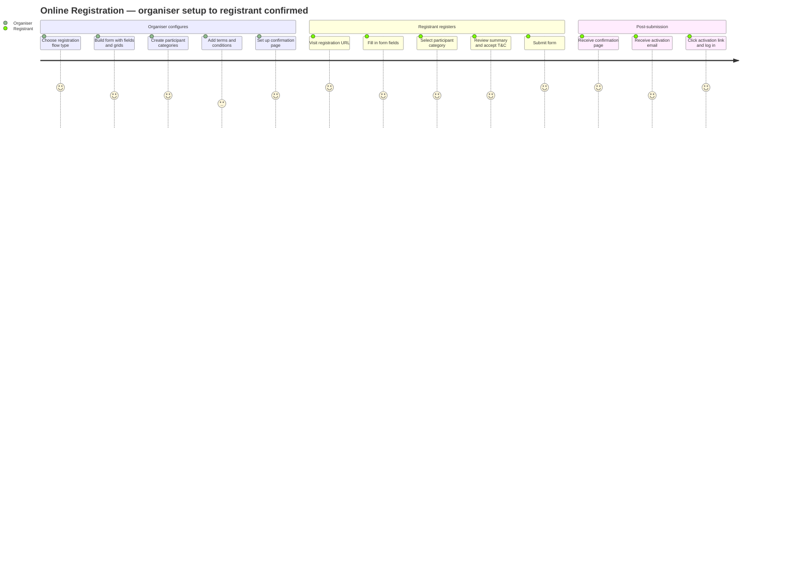
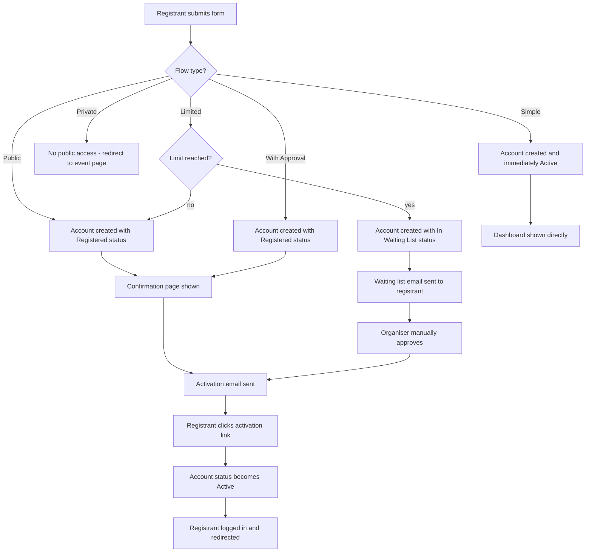
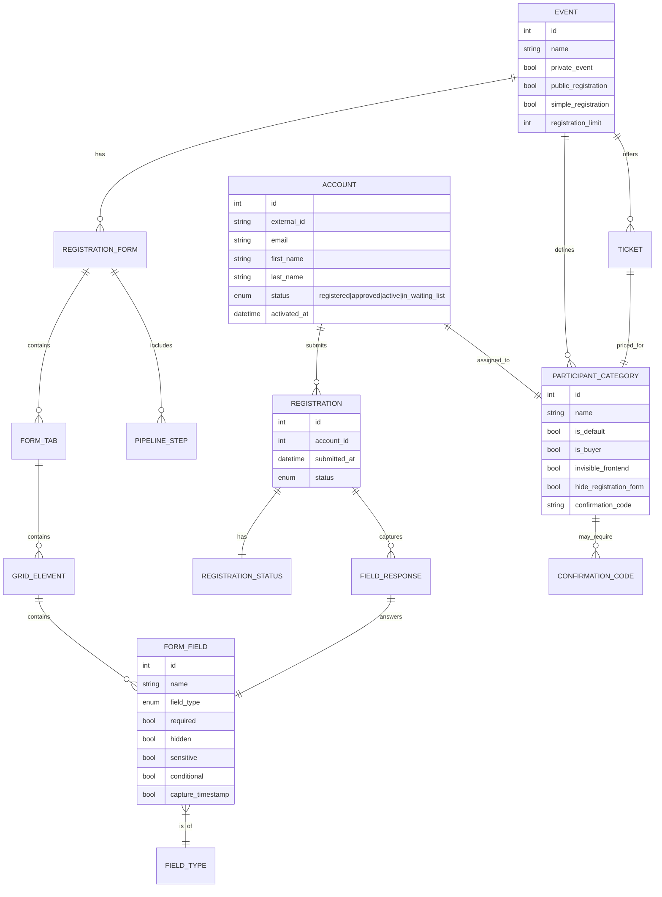
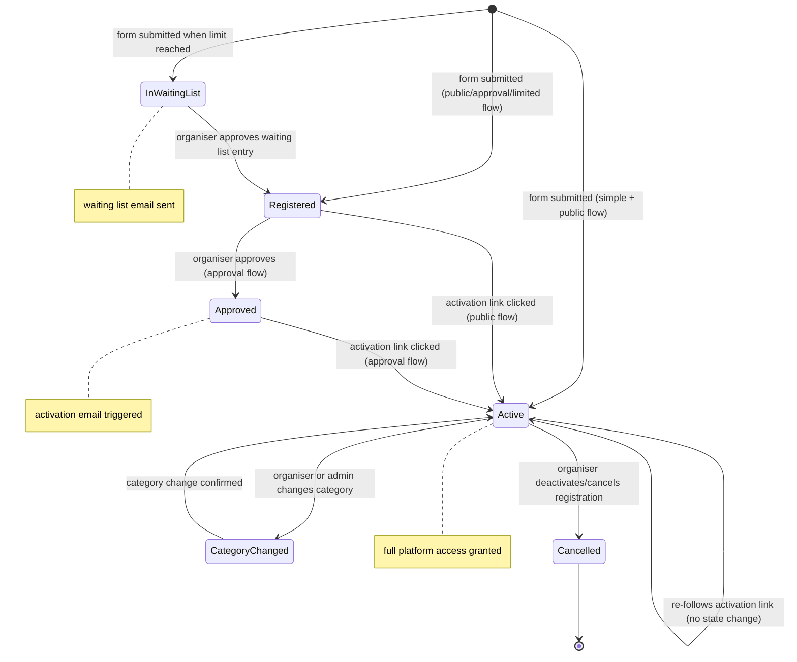
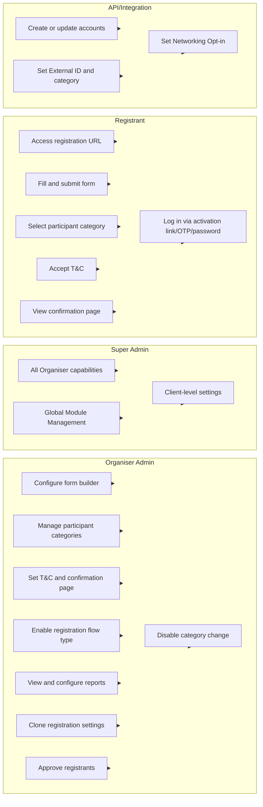

## 1. Product Overview

**Purpose.** Online Registration is ExpoPlatform's end-to-end participant onboarding engine. It provides organisers with a fully configurable registration pipeline — from form layout and field types through conditional logic, participant categorisation, terms & conditions enforcement, and confirmation page personalisation — and delivers that pipeline to attendees as a polished, multi-step registration journey accessible at `eventURL/index/registration`.

**Problem being solved.** Event organisers need to collect highly varied attendee data, gate access by participant type, manage capacity, and satisfy compliance requirements (GDPR consent timestamps, terms acknowledgement) — all without developer effort for each event. Without a configurable registration system they must rely on third-party form tools that are disconnected from the event platform, creating data silos, manual import work, and a fragmented attendee experience.

**Business value.**
- Reduces time-to-launch for new events by allowing full registration pipelines to be cloned from previous events.
- Increases conversion through a streamlined, branded end-user registration page with conditional questioning that reduces irrelevant fields for each registrant.
- Ensures data quality via required-field enforcement, format validation, and GDPR-compliant consent timestamp capture (EP-26281).
- Enables revenue capture through native ticketing, pricing schedules, and discount codes without external tools.
- Gives organisers real-time visibility through automated daily and individual registration reports.

**Target users.** Event organisers and their admin staff who configure and operate events; attendees (visitors/buyers) who register for events; ExpoPlatform implementation teams who assist with setup.

**User personas.**
- *Event Organiser (Admin)* — builds registration forms, creates participant categories, sets T&C, configures the confirmation page, monitors reports, approves registrants in approval flows, manages capacity limits.
- *Registrant (Visitor/Buyer)* — visits the public registration URL, fills in the form, selects a category, reviews summary, accepts T&C, submits, receives confirmation/activation email.
- *API/Integration Engineer* — pushes participant records via API, sets account status, maps external fields to ExpoPlatform standard fields before go-live.
- *Super Admin / ExpoPlatform TAM* — assists with global settings, resets limits, resolves data issues.

**Success metrics.** Registration completion rate; time from event creation to live registration form; number of manual data corrections post-event; daily registration volume trend (visible via day report); activation rate (accounts following activation link); support tickets related to login or form errors.

## 2. Product Scope

### Included
- Five registration flow types: Public Events, Registration with Approval, Simple Registration, Private Event, Limited Registration.
- Drag-and-drop form builder with Grid layouts (1-, 2-, 3-column), Information Frame WYSIWYG blocks, tabbed sections (Contact Details + custom tabs).
- Full library of standard form fields and custom field types (Text/Area, Select, Checkbox Group, Radio Group, Checkbox, File Upload, Date).
- Common field properties: required, hidden, disabled, not editable, sensitive (GDPR), show in visitor card, show in leads export, help text, placeholder, personal assistant email CC, GDPR consent timestamp capture.
- Conditional logic: grid visibility driven by participant category or multi-select field answers.
- Participant Categories: create, clone, reorder, confirmation codes, visibility controls, buyer role, team member defaults, meeting/chat limits, autoconfirm, hide features (matchmaking, attendee list).
- Terms & Conditions: WYSIWYG editor, mandatory acknowledgement checkbox.
- Registration Confirmation Page: WYSIWYG + JS scripts + variables + custom page override; separate Visitor and Buyer variants.
- End-user registration page: pipeline bar, summary page, payment integration (PayPal/Stripe/Parampos), category selection.
- Account and login system: activation link, OTP, system-generated password; account roles; first-login redirection; force password change; force photo upload.
- Organiser reports: day report, individual report, daily buyer report, buyer individual report.
- Clone registration settings: clones Contact Details, Personal Information, Custom Sections, Kiosk Onsite settings.
- Clone participant/exhibitor categories.
- Disable participant category change (hard-lock setting).
- Registration Pipeline Best Practices guidance.

### Excluded
- Exhibitor registration configuration (separate product area, though some shared settings exist).
- Ticketing and invoicing billing back-end (covered under Transactions & Purchasing product).
- Onsite / kiosk registration (covered under Onsite & Kiosk product, though Clone Registration Settings clones kiosk config).
- Mobile app build pipeline (Client Manager product).
- Matchmaking and meeting scheduling logic (Networking product).
- Email campaign management (User Engagement product).
- Analytics dashboards beyond registration counts (Organiser Analytics product).

## 3. User Roles

| Role | Access in Online Registration | Notes / restrictions |
| --- | --- | --- |
| **Super Admin** | Full access to all registration settings across all events | Can set global module management; can unlock any setting |
| **Organiser / Admin** | Full configuration: form builder, categories, T&C, confirmation page, reports, clone, limits, approval flows | Cannot change Client-level language; cannot delete category irreversibly without awareness — no undo |
| **Exhibitor** | Can register for private events; creates team members (if enabled); does not access organiser settings | Team members inherit exhibitor's category |
| **Visitor / Buyer** | Fills in the public registration form; selects category; accepts T&C; receives activation/confirmation emails | Cannot access admin panel; Buyer role assigned via "Is Buyer" category toggle |
| **Speaker / Moderator** | Standard registered account; roles assigned separately (Speakers list, Moderators list) | Not assigned during registration form flow |
| **Team Member** | Visitor who is also an exhibitor's team member; category inherited from exhibitor; added via team member pop-up if "Use for Team Member Creation" field is enabled | Does not self-register via the public form |
| **API / Integration user** | Creates or updates accounts via `/api/v2/account/set`; can set External ID, category, networking opt-in, and explicit ACTIVE status | Must set `status = ACTIVE` explicitly if password login should work without activation link |

> [!INFO] Account status is what gates password usability, not the account creation method. Frontend self-registrations and default API-created accounts both start with `registered` status — the password is unusable until the activation link is followed or status is explicitly set to ACTIVE via API.

## 4. Feature Inventory

#### 4.1 Registration Flow Types

**Description.** Five mutually configurable flow modes that determine who can access the registration form and what happens after submission. Controlled primarily via toggles at `Event Setup > General > General Info` (`/admin/general/edit`).

**Why it exists.** Different events have fundamentally different access policies: a trade show wants open public registration; a hosted-buyer programme requires organiser vetting; a private association meeting is invitation-only.

**User value.** Organisers pick the model that matches their event's access policy without any custom development.

**Functional logic.**
- *Public Events Registration* — the registration page is publicly accessible; any visitor can register without vetting; user becomes active immediately on simple registration (see 4.2). Form is fully configurable with predefined and custom fields, conditional logic, tickets, and discount codes.
- *Registration with Approval* — "Private Event (by invitation only)" ON + "With public access to registration" ON. Registrant submits form → `Registered` status; organiser clicks **Approve** → `Approved` status → activation email fires → registrant follows link → `Active`. Participants receive no activation email until organisers approve.
- *Simple Registration* — "Simple registration" toggle at `/admin/registration/settings`. Skips the summary page; user lands on their dashboard immediately; an optional "After registration script" JS field fires post-submit. On public events the user becomes active immediately.
- *Private Event (invitation only)* — "Private Event (by invitation only)" ON, public registration toggle OFF. Registration page is inaccessible to the public (redirected to main event page). Organisers add participants via import or API; activate via "Visitor private registration" email containing activation link or registration form link. Exhibitor registration still works.
- *Limited Registration* — "Limit registrations" toggle at `/admin/registration/settings`; "Number of limit" field appears. When limit reached, subsequent registrants receive "Visitor waiting list" email and get `In waiting list` status. Organiser approves manually; approved user is removed from waiting list and receives activation email. Email template "visitor waiting list" appears once limit is saved.

**Preconditions.** Event must exist; relevant toggles in General Info saved; for Limited Registration the limit number must be entered and saved.

**Processing logic.** Toggle state at `/admin/general/edit` and `/admin/registration/settings` controls which flow logic fires when a visitor hits the registration URL.

**Outputs.** Registrant record with appropriate status; trigger for activation/confirmation/waiting-list emails.

**Dependencies.** Email system (activation, waiting list); Participant Categories (for status transitions); payment system for ticket flows.

**Configurations.** All flow toggles at `/admin/general/edit` (event type) and `/admin/registration/settings` (limit, simple mode).

**Permissions.** Organiser/Admin sets flow toggles. Super Admin can override.

**Error handling.** Attempt to access a private event registration URL → redirect to event main page. Limit reached → waiting list email, not an error page.

**Edge cases.** Simple registration + Public event → account active immediately (no activation email needed). Registration with Approval + Simple Registration: both can be active — user skips summary but still waits for approval. Limit set to 0 or left blank after enabling → undefined behaviour; always enter a valid positive integer.

#### 4.2 Form Builder

**Description.** A drag-and-drop visual editor for building the registration form layout, accessed at `Registration Settings > Visitor > Contact Details / Custom Sections`.

**Why it exists.** Organiser needs to arrange fields in logical visual groupings without writing HTML.

**User value.** No-code form layout with fine-grained control over what each participant category sees.

**Functional logic.** The editor's left sidebar provides standard fields and custom fields. The work zone uses layout containers (Grid 1, 2, 3 columns; Information Frame) into which fields are dragged. Each Grid element has its own settings pop-up: Show label, Label text, Visible to (participant categories; or, if a conditional MCQ field exists, also its options). The parent Grid's "Visible to" setting overrides child Grid settings.

**Preconditions.** At least one custom field must be created before it can be dragged into the form. Standard fields exist by default.

**Trigger conditions.** Organiser opens the form builder and drags elements into the work zone.

**Processing logic.** Standard fields may each appear only once per form. Custom fields may appear multiple times. Fields can be dragged within one tab. Editing via pencil icon; deletion via cross icon. Tabs: Contact Details (default, renameable); additional tabs via "+" icon. Tab-level toggles: Hide on Summary, Hide on Registration, Hide on Edit Profile, Enable (show/hide tab).

**Outputs.** Configured form JSON persisted per event; rendered on the end-user registration page.

**Dependencies.** Participant Categories (for "Visible to"); conditional logic (for MCQ-driven visibility).

**Configurations.** Tab name, tab visibility toggles, Grid label, Grid "Visible to" categories/MCQ options.

**Validation rules.** Standard field used more than once in the same form → blocked. Parent Grid "Visible to" takes priority over child Grid "Visible to".

**Permissions.** Organiser/Admin only.

**Error handling.** Deleting a tab with a Delete section button is instant — no undo. Deleting a field loses data — export before deletion.

**Edge cases.** Information Frame is a WYSIWYG block, not a data-capture field; it cannot be made required. "Old functionality" Dropdown on Grid settings should not be used (deprecated). Grid "Visible to" with no category checked = visible to all.

#### 4.3 Standard Form Fields

**Description.** Predefined data-collection fields that map directly to ExpoPlatform account properties.

**Why it exists.** First Name, Last Name, Email are the minimum required for any account. Other standard fields (Country, City, Company Name, Job Title, etc.) feed matchmaking, reporting, and profile display.

**User value.** Organisers do not need to recreate common fields; renaming is allowed but the fields must still collect their intended data to avoid matchmaking/reporting breakage.

**Functional logic.** Fields are listed in the standard fields sidebar. Key fields: Email (mandatory for any registration), First Name, Last Name. Notable fields: Language Preference (changes all platform notification emails to chosen language); Networking Opt-in (controls user interaction visibility; can be a toggle or select; supports inversion via `/admin/registration/settings`); Category (selects participant category during registration; not shown in user profile); Social Links (Facebook, LinkedIn, X, YouTube, Instagram); Billing information (VAT Country + Number); Register with (social sign-in — currently disabled). City/State require Country to be selected first.

**Outputs.** Values stored on the Account entity, displayed in profile, searchable in reports/exports.

**Dependencies.** `/admin/general/settings` for Title options; Category system for Category field.

**Configurations.** Titles options at `/admin/general/settings`; Networking Opt-in inversion toggle at `/admin/registration/settings`.

**Permissions.** Organiser configures; Registrant fills in.

**Edge cases.** About Me field supports plain text only (no rich text). Register with social media field appears during registration only (not in user profile edit). Organisation Name differs from Company Name in that it does not display on user cards.

#### 4.4 Custom Form Fields

**Description.** Organiser-created fields for collecting event-specific data beyond the standard field set.

**Why it exists.** Every event collects unique questions (dietary preferences, session choices, specific qualifications) that the standard field set cannot cover.

**User value.** Unlimited custom questions in any format; each can be used multiple times across different form tabs.

**Functional logic.** Four field types:
- *Text Field / Area* — single-line or multi-line text; Phone Field mode adds country code + mask; HTML5 Type setting (text, email, colour, time, number, year, website) applies browser-native validation; Max Length restricts character count; Default Value and Placeholder supported; Name field is unique identifier for integration.
- *Multiple Choice (Select, Checkbox Group, Radio Group)* — Select supports single or multiple selection (Allow Multiple Selections toggle); Checkbox Group and Radio Group are always multi/single choice respectively; all three support Conditional mode (options feed Visible to logic of Grids); Use as filter surfaces field as a delegates filter; Use for Speed Networking sends options to speed networking conditions step; items have name + value + preselect; Add label adds non-selectable group headers; Add OTHER adds a free-text "Other" option (with Required and Placeholder sub-settings).
- *Checkbox* — single boolean; Toggle mode displays as on/off switch instead of checkbox; supports Conditional for grid visibility; all standard property checkboxes apply.
- *File Upload* — file attachment; uploaded file viewable/downloadable from Matchmaking Information block if Show in Visitor Card is checked; size limit set globally at `/admin/general/settings`.
- *Date field* — date picker; standard properties apply.

**Preconditions.** Custom fields are created in the field library before being dragged into the form builder.

**Processing logic.** Custom fields can be reused across tabs. Each has a Name (unique identifier used in HTML attributes and integration references).

**Outputs.** Stored answers per registrant; accessible in exports, leads reports, matchmaking.

**Dependencies.** GDPR module for Sensitive field clearing; leads export module for Show in leads report; speed networking module for Use for Speed Networking.

**Configurations.** All field-level checkboxes (see 4.5) apply to every custom field type.

**Edge cases.** Deleting a custom field from the form destroys historical answers for that field — irreversible. Max Length does not enforce a minimum; use validation logic or required + conditional to handle minimums.

#### 4.5 Common Field Properties

**Description.** A standard set of behaviour-control checkboxes available on each form field (both standard and custom).

**Why it exists.** Organisers need to control visibility, editability, GDPR sensitivity, reporting inclusion, and integration behaviour per field without duplicating fields.

**User value.** Granular, per-field control without code.

**Functional logic.** Each checkbox has a specific effect:

| Property | Behaviour |
| --- | --- |
| Required | Adds `*` indicator; combined with "Enable required fields" global toggle forces completion |
| Hidden | Adds HTML `hidden` attribute to the field on the frontend; field remains visible in the admin panel |
| Disabled | Adds HTML `disabled` attribute on the frontend; field remains editable in the admin panel |
| Not Editable | Sets read-only mode on the frontend registration form and Edit Profile; field editable in admin |
| Sensitive | Field data clearable via "Delete All Sensitive Data" at `/admin/data/gdpr` |
| Show in Visitor Card | Field label + value displayed in the Matchmaking Information block on visitor profile |
| Show in Leads Report | Field data included as a named column in the leads export file |
| Use for Team Member Creation | Field appears in the Team Member add/edit pop-up on exhibitor profile frontend |
| Help Text | Tooltip shown near the field label on the frontend |
| Placeholder | Ghost text in empty input field |
| Personal Assistant Email | All emails sent to participant are CC'd to the address entered in this field |
| Use for Speed Networking | Field options passed to speed networking session conditions step |
| Include in Downloaded Schedule | Field data included in the schedule download export |
| Capture Input Timestamp | Records the exact timestamp when data is entered (GDPR consent tracking; EP-26281) |

**Permissions.** Organiser/Admin sets field properties. Super Admin can see all.

**Edge cases.** Hidden and Disabled both hide the field on the frontend but by different mechanisms; a hidden field still submits its default/pre-filled value; a disabled field submits nothing. Not Editable means a registrant cannot change a pre-populated value (useful for API-imported data).

#### 4.6 Global Field Settings

**Description.** Event-wide switches that affect all fields of a given type across the entire registration form.

**Why it exists.** Some enforcement policies (required fields, profile completeness) need to apply uniformly rather than being set per field.

**Functional logic.** **Enable Required Fields** toggle at `/admin/registration/settings` (under Visitor and Exhibitor Additional Settings separately). When ON, any registrant who is logged in but has empty required fields is forcibly redirected to the profile edit page; empty required fields are highlighted until filled. Without this toggle, the Required property on individual fields only shows the `*` indicator but does not block progression.

**Outputs.** Profile completeness gate; highlighted required fields on edit page.

**Dependencies.** Per-field Required checkbox; login/session system.

**Edge cases.** This toggle applies only after login, not during initial registration (the registration form itself enforces Required during submission). Setting this ON for existing events will immediately redirect users with incomplete profiles upon next login.

#### 4.7 Conditional Logic

**Description.** Controls which Grid layout blocks (and therefore their contained fields) are visible to a specific registrant, based on their participant category or their answers to multi-select questions.

**Why it exists.** Different participant types or different answers warrant different follow-up questions. Presenting every question to everyone creates friction and confuses registrants.

**User value.** Dynamic, personalised registration form that shows only relevant questions.

**Functional logic.** Two trigger types:
- *Category-based visibility* — in the Grid element's settings pop-up, select one or more participant categories under "Visible to". The Grid (and its contents) only renders for registrants in those categories. Leaving "Visible to" empty = visible to everyone.
- *MCQ-based visibility* — on a multi-select field (Select, Checkbox Group, Radio Group, Checkbox with Conditional checked), tick the **Conditional** checkbox. This field's answer options then appear in the "Visible to" block of all sibling Grid elements (i.e., Grids in the same form that do not directly contain the conditional field). The organiser selects which answer options must be chosen for each Grid to become visible. At least one matching option must be selected by the registrant; if none match, the Grid stays hidden.

**Preconditions.** Conditional MCQ must be in a Grid that is not the same Grid containing the dependent fields. Parent Grid "Visible to" overrides child Grid settings.

**Trigger conditions.** Registrant selects a category or answers a conditional MCQ during the registration form flow.

**Outputs.** Grid elements appear or remain hidden client-side based on current selections.

**Dependencies.** Form Builder (Grid layout); Participant Categories.

**Validation rules.** MCQ field must be set as Conditional before its options appear in other Grid "Visible to" blocks.

**Error handling.** Grid not showing despite correct option selected → check "Conditional" is checked on the MCQ field; check that at least one option is selected; check for conflicting parent Grid "Visible to" settings.

**Edge cases.** A parent Grid with "Visible to" set to Category A completely hides all child Grids for registrants not in Category A, regardless of MCQ selections. Conflicting conditions (parent hides, child would show) — parent always wins.

#### 4.8 Participant Categories

**Description.** Configurable groupings for participants with tailored permissions, visibility, role assignments, and behavioural settings.

**Why it exists.** Events often serve heterogeneous participant types (delegates, VIPs, press, hosted buyers, speakers) each needing different access, visibility, and limits.

**User value.** Organisers define once per event; the system automatically routes participants to the correct feature set based on their category assignment.

**Functional logic.** Managed at `/admin/registration/categories`. **Default Category** is pinned to the top, auto-assigned to any participant without an explicit category, renameable, cannot be reordered. Additional categories can be created, reordered (drag-and-drop), cloned, or deleted (instant, irreversible — no confirmation).

Key settings per category:
- *Confirmation Code* — registrant must enter this code to select the category on the registration form.
- *Visibility — Registration Form* — hide the category from being selectable on the registration form.
- *Visibility — Frontend Invisible* — hides the category everywhere on the frontend except badges (unless "Do not hide in badges" is checked); direct link attempts show "Access Denied".
- *Notify visitor when switching to this category* — triggers an email using the template at `/admin/emails/index/visitor_switch_category`.
- *Is Buyer* — participants in this category gain the Buyer role.
- *Default Team Member Category* — new team members created by organisers/exhibitors are assigned this category.
- *Gear icon settings* — meeting limits, chat limits, Meetings Autoconfirm (hides "Pending" filter for that category), Meetings Minimal Requirements (required confirmed meeting count), Table Meetings on/off, Custom Meeting Rating Form.
- *Hide Features* — Matchmaking menu item; Attendee List (delegates list and `/newfront/participants` tab).
- *Icons* — upload category icon displayed on participant cards (web only, not mobile app).

**Clone category** (EP-23224, 1834713089): copies name, visibility/access permissions, linked registration form, confirmation codes, email templates, and default behaviour flags. Organiser must rename the clone and verify pricing/ticket/form linkage.

**Disable category change** (1829273628): "Disable category change" toggle at Registration > Settings hard-locks the participant category field across all participant profiles in the admin panel — no admin can change categories while this is ON. Useful for import-based workflows where the source system owns category data.

**Processing logic.** Category assigned via: registration form Category field, import, API (`/api/v2/account/set`), or admin manual edit (subject to "Disable category change" setting). When category changes, a warning pop-up appears in the admin panel.

**Outputs.** Account `category_id`; triggers emails; gates features; controls form field visibility.

**Dependencies.** Form Builder (Conditional visibility); Registration Reports; Matchmaking limits; Ticketing (category-based pricing).

**Error handling.** Accidental deletion of a category is irreversible from the UI — requires a development task to restore. Autoconfirm ON for a category hides the "Pending" filter but does not retroactively confirm already-pending meetings.

**Edge cases.** Team members always inherit the exhibitor's category, regardless of category settings on the registration form. Icons do not display in the mobile app. "Disable category change" blocks ALL admin edits, including manual admin fixes — toggle off temporarily to make corrections.

#### 4.9 Terms & Conditions

**Description.** A configurable legal acknowledgement step presented to registrants at the summary step of the registration form.

**Why it exists.** Legal compliance requires evidence that registrants have read and accepted event terms before their registration is finalised.

**User value.** Organisers can write event-specific T&C content once; registrants cannot bypass the acknowledgement checkbox if it is enabled.

**Functional logic.** T&C content is authored at `Registration Settings → Visitors → Terms` (`/admin/registration/terms`) using a full WYSIWYG editor. To display the T&C link on the registration summary step, the "Terms and Conditions" toggle must be set ON at `/admin/registration/settings`. The displayed text on the registration page is separately customised in the "Terms and Conditions text" box. "Terms and conditions checkbox (I agree, required)" adds a mandatory checkbox — registrant cannot submit without checking it.

**Preconditions.** Content must be authored in the T&C editor before enabling the toggle.

**Trigger conditions.** Toggle ON and registrant reaches the summary step.

**Outputs.** Checkbox acknowledgement recorded; registration cannot be finalised without it when enabled.

**Dependencies.** Registration summary step in the pipeline.

**Configurations.** Toggle at `/admin/registration/settings`; content at `/admin/registration/terms`; checkbox option alongside the toggle.

**Error handling.** T&C link not visible → confirm toggle is ON and content field is not empty. Checkbox not appearing → ensure the "Terms and conditions checkbox" option is ON. Formatting issues → re-apply WYSIWYG styling and save.

#### 4.10 Registration Confirmation Page

**Description.** The page shown to a registrant immediately after completing registration, fully customisable by the organiser.

**Why it exists.** The confirmation page is both a UX signal (registration was successful) and a marketing/tracking opportunity (custom messaging, UTM tracking, badge links, pixel scripts).

**User value.** Registrants receive clear confirmation of success. Organisers can display event-specific instructions, badge links, and track source attribution via UTM codes.

**Functional logic.** Configured at `Registration settings > Visitor > Confirmation page`. Separate configurations exist for Visitors and Buyers (different variable sets). Four fields:
1. *Page name* — title shown on the confirmation page.
2. *Main information frame* — WYSIWYG HTML editor with variables: registrant data fields, print badge link (EP-10489), participant category type variable (EP-14498), badge bar/QR code (EP-22505).
3. *Additional scripts* — accepts JS in `<script>` tags; runs on page load. Also has a variables set. If no script is detected, content is displayed as plain text. Supports UTM code variable (EP-20762) for source tracking.
4. *Use existing custom page as confirmation page* — when enabled, the organiser selects a custom page built at `Event Setup > Build website` which replaces the standard confirmation page.

**Outputs.** Rendered confirmation page visible to registrant post-submit.

**Dependencies.** Event Setup > Build website (if using custom page override); badge module (for badge link variable); ticketing (for buyer variables); Google Analytics (for UTM tracking).

**Configurations.** Visitor and Buyer confirmation pages are configured independently. Variables available differ: Buyers have ticket and order variables; Visitors have a smaller set.

**Error handling.** Content not visible → ensure font formatting and content styling are saved. Custom page not showing in dropdown → create the page under Event Setup > Build website first.

**Edge cases.** Plain text entered in the Scripts field with no `<script>` tags will be displayed as visible text on the page. UTM codes from the original registration URL are forwarded to the confirmation page (EP-20762) enabling end-to-end attribution.

#### 4.11 End-user Registration Page

**Description.** The public-facing registration flow that participants interact with, accessible at `eventURL/index/registration`.

**Why it exists.** This is the primary channel through which attendees join an event.

**Functional logic.** The page is built from the organiser-configured form. It consists of steps defined in the **Pipeline Bar** in the form builder admin: steps can be dragged, disabled, deleted; new steps added via the `+` icon. Standard steps: Contact Details form, Summary page (shows all entered data including ticket type/price), Confirmation page. The Summary page can have any section hidden using the "Hide on Summary" tab toggle. Payments appear on the Summary step if ticketing is configured; supported payment systems: PayPal, Stripe, Parampos — configured at `/admin/payments/integration`; only one active at a time. Category selection happens via the "Category" form field in Contact Details.

**Outputs.** Submitted registration record; account created/updated; payment initiated if ticketed; confirmation page shown; activation/confirmation email triggered.

**Dependencies.** Payment systems; email system; Participant Categories; Confirmation Page; T&C.

**Configurations.** Pipeline Bar step order; section visibility toggles; payment system configuration.

**Edge cases.** If a category is hidden on the registration form (via Participant Categories > Registration Form visibility), it will not appear in the Category dropdown.

#### 4.12 Account and Login

**Description.** The account identity, roles, and login mechanisms used by registrants and all platform participants.

**Why it exists.** Participants need persistent identities linked to their event registration, profile data, and interactions. Multiple login methods accommodate different event and integration scenarios.

**Functional logic.**
- *Account ID* — globally unique across all events and clients; auto-assigned on save. Cannot be duplicated.
- *Account External ID* — for integration data transmission; set via `/api/v2/account/set`.
- *Roles* — Visitor (basic), Speaker (assigned to Speakers list), Moderator (assigned to Moderators list), Team Member (also a Visitor who is an exhibitor team member), Buyer (category with "Is Buyer" toggle), Guest (unlogged). One account can hold multiple roles.
- *Login — Activation Link* — sent with every activation/approval email; follows the link to log in instantly; works every time followed.
- *Login — OTP* — enabled at `/admin/general/settings`; entry point accepts only email; system sends OTP to that email; valid for 120 minutes. Also supports WhatsApp/SMS delivery (EP-26859).
- *Login — System-generated password* — sent alongside the activation link. **Only works after account is activated.** Self-registered accounts start with `registered` status; password unusable until activation link followed. API-created accounts with explicit `ACTIVE` status set during creation work with password directly.
- *First Login Redirection* — configurable at `/admin/registration/settings`; separate settings for Team Members (includes Exhibitor Manual option) and Visitors.
- *Force password change on first login* — toggle at `Registration → Visitor → Additional settings`; mandatory password change pop-up on first login (also triggered by activation link); cannot be closed without changing password.
- *Force upload photo (Visitor and Buyer)* — separate toggles; mandatory photo upload pop-up; cannot be closed without upload; once uploaded, photo cannot be deleted.
- *Account activation timestamp* — added to exports (EP-26794) — column recording when the activation link was clicked.

**Error handling.** Inactive user attempting login → correct error message displayed (EP-14583 web, EP-15585 app). API integrations that want password login to work on creation must set `status = ACTIVE` — this is the root cause of most "can't log in with sent password" support tickets.

**Edge cases.** OTP valid for 120 minutes; expired OTP requires a new request. Activation link works every time it is followed — it is not single-use. Force password change pop-up is also triggered by following an activation link.

#### 4.13 Clone Registration Settings

**Description.** Copies an existing event's registration configuration into the current event to avoid rebuilding from scratch.

**Why it exists.** Organisers running recurring events (annual conferences, regional editions) maintain consistent form structures; rebuilding from scratch every year is error-prone.

**User value.** Hours of form-building work saved per recurring event.

**Functional logic.** Available at `/registration/settings/Visitor/Additional Settings`. Dropdown lists all events in the current client environment (not just active ones). Select one event, click "Copy", confirm warning pop-up. **Cannot be undone.** Cloned sections:
- Contact Details (`/admin/registration/details`)
- Personal Information (`/admin/registration/information` — no longer auto-generated for new events)
- Custom Sections (`/admin/registration/customSection/XXXX`)
- Kiosk Onsite Registration (`/admin/registration/onsite`)
All standard and custom fields are copied. One event selectable at a time.

**Preconditions.** Source event must exist in the same environment.

**Outputs.** Current event's registration form replaced with the source event's form configuration.

**Error handling.** Once confirmed, there is no system-level undo. If rollback is needed, it requires a development task.

**Edge cases.** Cloning replaces the current event's form — any work already done on the current event's form will be overwritten. Custom fields created in the source event exist in the field library and are also cloned.

#### 4.14 Organiser Registration Reports

**Description.** Automated email-based reports that keep event organisers informed of registration activity in real time and daily.

**Why it exists.** Organisers managing large events cannot monitor the admin panel continuously; they need push-based summaries delivered to their inbox.

**User value.** Daily summary and per-registration alerts without manual export; supports team tracking via configurable recipient lists.

**Functional logic.** Four report types, all toggled at `/admin/registration/settings` and delivered by email:

| Report | Toggle | Schedule | Template path | Content variables |
| --- | --- | --- | --- | --- |
| Day registration report | Send Day Report email (4:30 pm) | Daily at 4:30 pm event time | `/admin/emails/index/day_report` | Day (date), Visitors (name, surname, company, job title, email), Total (count) |
| Individual registration report | Send Individual registration report | Immediately after each new visitor submits | `/admin/emails/index/ind_report` | Day, Time, Visitor (first, last, company, job title, email) |
| Daily buyer registration report | Send Daily Buyer Registration Report (4:30 pm) | Daily at 4:30 pm event time | `/admin/hostedbuyers/emails/buyer_day_report` | Day, Buyers (name, surname, company, job title, email), Total |
| Buyer individual registration report | Send Buyer Individual registration report | Immediately after each new buyer submits | `/admin/hostedbuyers/emails/buyer_ind_report` | Day, Time, Email, First name, Last name, Title |

Report recipients are entered in the **"To" field** in the template builder, separated by commas. Buyer registrations also trigger the Individual registration report when that toggle is enabled.

**Outputs.** Automated emails delivered at configured schedule to configured recipients.

**Dependencies.** Email delivery system; Registration event.

**Configurations.** Each report has its own toggle; recipient list set in the email template "To" field.

**Edge cases.** If the organiser fails to add recipients in the "To" field of the email template, no emails are delivered even if the toggle is ON. Buyer registrations trigger both the buyer individual report and the general individual registration report when the latter is enabled.

## 5. User Stories Mapping

| Story ID | Title | Summary | Acceptance criteria | Related feature | Status |
| --- | --- | --- | --- | --- | --- |
| EP-916 | Participant Registration on New UI | New UI + microservice re-platform for participant registration | New registration UI live; service migrated; BE 30% complete as of Mar 2025 | 4.1 Registration Flows / 4.11 End-user Page | In Progress |
| EP-1065 | (New Analytics UI) Registrations | Registrations analytics in new admin UI | New analytics UI shows registration data per Figma spec | 4.14 Reports | COMPLETE |
| EP-1122 | Critical Informa task — Visit integration | Multithreading approach for Visit integration sync | Sync throughput benchmarked; min/max/avg creation times validated with CPHI/Pharmapack data | 4.12 Account and login / integrations | COMPLETE |
| EP-10489 | Adding More Variables in Visitor Confirmation Page | Add Print Badge link variable to confirmation page | Print Badge link variable available on confirmation page; resolves Turkish email domain issue | 4.10 Confirmation Page | COMPLETE |
| EP-14498 | Participant Category Type as variable in confirmation page | Category type variable in confirmation page scripts | `participant_category_type` variable available in confirmation page scripts field | 4.10 Confirmation Page | COMPLETE |
| EP-14583 | Correct naming of errors for inactive users (Web) | Fix incorrect error message for unactivated accounts on web | Descriptive error shown when user without activated account tries password login | 4.12 Account and Login | COMPLETE |
| EP-14938 | Participant default category | Create Default Category assigned to uncategorised participants | Default category item at `/admin/registration/categories`; auto-assigned when no category selected | 4.8 Participant Categories | COMPLETE |
| EP-15585 | Correct naming of errors for inactive users (App) | Fix inactive user error message on mobile app | Same descriptive error shown on app as on web | 4.12 Account and Login | COMPLETE |
| EP-20762 | UTM codes on the Confirmation Pages | Forward UTM codes from registration URL to confirmation page | UTM parameters visible on confirmation page; trackable via Google Analytics | 4.10 Confirmation Page | COMPLETE |
| EP-22505 | Badge BAR and QRcode variable for Campaigns | Add badge bar/QR code variable to marketing campaigns | Badge bar and QR code variables available in campaign and confirmation page email templates | 4.10 Confirmation Page | COMPLETE |
| EP-23224 | Ability to clone participant and exhibitor categories | Clone category functionality | Clone button in Actions column; cloned category inherits all settings; organiser prompted to rename | 4.8 Participant Categories | COMPLETE |
| EP-24220 | Add Networking Opt IN/OUT to /api/v2/account/set | Expose Networking Opt-in via account API endpoint | Networking parameter available in `/api/v2/account/set` | 4.3 Standard Fields / 4.12 Account | COMPLETE |
| EP-26281 | Record timestamp for a specific field in the registration form | GDPR consent timestamp capture per field | "Capture Input Timestamp" checkbox available on all registration form fields; timestamp stored when field is filled | 4.5 Common Field Properties | COMPLETE |
| EP-26628 | (Part 1) Tickets list in Admin panel | Tickets list UI in admin panel new UI | Tickets list visible at admin panel; columns per Figma spec | 4.11 End-user Page / Ticketing | COMPLETE |
| EP-26629 | (Part 1) Tickets creation/edit in Admin panel | Ticket create/edit pop-up UI | Edit ticket / New ticket / Clone ticket pop-up headers correct; creation and editing functional | 4.11 End-user Page / Ticketing | COMPLETE |
| EP-26630 | (Part 1) Ticketing settings in Admin panel | Ticketing settings page in new UI | Toggle Ticketing on/off functional; default OFF; creation possible only when ON | 4.11 End-user Page / Ticketing | COMPLETE |
| EP-26632 | (Part 2) Tickets in Participant profile | Display ticket information on participant profile | Ticket tab visible for participants (not exhibitors, not buyers); hidden per Ticketing enabled state | 4.11 End-user Page / Ticketing | COMPLETE |
| EP-26633 | (Part 2) Tickets upgrade | Allow category/ticket upgrade for participants | Upgrade flow functional when "Allow to change category" setting is enabled | 4.8 Participant Categories / Ticketing | COMPLETE |
| EP-26634 | (Part 2) Category indication in Participant profile | Category label visible on Dashboard and Ticketing pages | Category name shown consistently on both pages; visible for all categories including Default | 4.8 Participant Categories | COMPLETE |
| EP-26636 | Ordered items tab | Orders page — ordered items tab | Ordered items tab functional per Lucidchart decomposition | 4.11 End-user Page / Ticketing | COMPLETE |
| EP-26637 | Invoices tab | Orders page — invoices tab | Invoices tab functional per Lucidchart decomposition | 4.11 End-user Page / Ticketing | COMPLETE |
| EP-26794 | Add timestamp of account activation in exports | Activation timestamp column in participant export | Export file includes column with datetime when activation link was clicked | 4.12 Account and Login | COMPLETE |
| EP-26859 | OTP login workflow with WhatsApp/SMS | OTP login via WhatsApp or SMS in addition to email | OTP can be delivered via WhatsApp/SMS when configured; toggle in Event Setup > General | 4.12 Account and Login | COMPLETE |
| EP-26895 | (Part 1) Setting few time ranges with different pricing | Dynamic pricing time ranges for tickets | Price Type = Fixed or Dynamic; Fixed = constant price; Dynamic = time-range-based price bands | 4.11 End-user Page / Ticketing | COMPLETE |
| EP-26919 | 3 Grids and fields layout | New 3-column grid layout for registration form | 3-column grid layout available in form builder on new UI | 4.2 Form Builder | In Progress |
| EP-26920 | 3 Condition logic | Conditional logic for new UI registration form | Conditional logic functional on new UI registration form | 4.7 Conditional Logic | In Progress |
| EP-27290 | Invite Visitors — Statistics | Statistics for invited visitors flow | Statistics visible per Lucidchart flow decomposition | 4.14 Reports | COMPLETE |
| EP-37154 | Addition to Visibility by country for tickets in Old UI | Improve country+category combination handling | Instead of error message, show only valid category options for the chosen country combination | 4.8 Participant Categories / Ticketing | COMPLETE |

## 6. End-to-End Workflows

### Organiser setup and registrant journey

### System workflow — registration submission processing

### Happy path
Organiser configures a Public Events registration form with a custom layout, two participant categories, T&C enabled, and a confirmation page with variables. Registrant visits `eventURL/index/registration`, fills in First Name, Last Name, Email, and other configured fields, selects a category, reviews Summary page, accepts T&C, submits. Confirmation page displays with custom message and badge link variable. Activation email arrives; registrant clicks activation link; account becomes Active; registrant is logged in and lands on their dashboard.

### Alternate paths
- *Registration with Approval* — registrant submits form, lands on confirmation page with "pending approval" message, but receives no activation email until the organiser manually approves them in the admin panel.
- *Simple Registration* — summary page is skipped; registrant goes directly to their dashboard after submission; on public events the account is immediately active.
- *Limited Registration at capacity* — registrant submits form, lands on confirmation page, receives the waiting list email; the organiser later approves them from the admin panel.
- *Private Event* — registrant receives an invitation email with a registration form link; fills in the form; organiser activates manually or via "With public access to registration" sub-flow.
- *Category change post-registration* — registrant (or admin) changes category on the participant profile; warning pop-up appears; if "Disable category change" is ON, the field is read-only.

### Exception paths
- Registrant reaches the limit → waiting list flow.
- Registrant enters incorrect confirmation code for a gated category → category not selectable.
- Required fields not filled on submission → form blocks progression and highlights empty fields.
- T&C checkbox not checked → submission blocked.
- Payment fails on ticketed registration → registrant shown payment error; registration not finalised.
- Account already exists with same email → duplicate check triggered; user directed to login.

### Recovery paths
- Waiting list registrant → organiser approves → activation email sent → standard activation flow resumes.
- Incorrect confirmation code → registrant re-enters correct code or contacts organiser.
- Lost activation email → organiser regenerates activation link from admin panel and resends.
- Inactive account cannot log in → user follows activation link (which still works); or organiser sets status to Active via admin.
- Cloned registration settings overwriting current form → no system undo; development task required to restore.

## 7. Business Rules Engine

| # | Rule | Condition | Exception / Priority | Conflict resolution |
| --- | --- | --- | --- | --- |
| BR-1 | First Name, Last Name, and Email fields are mandatory in every registration form | Always | No exceptions | Registration cannot be submitted without these three fields |
| BR-2 | Standard fields may each appear only once per form | Form builder drag | Custom fields may appear multiple times | Second instance of a standard field blocked by the builder |
| BR-3 | Account password is unusable until account is activated | Self-registered and default API-created accounts | API-created with explicit `status=ACTIVE` bypass activation requirement | Activation link is the de-facto first login method for most accounts |
| BR-4 | Required fields are only enforced on submission (and on subsequent login if "Enable Required Fields" is ON) | Required checkbox + global toggle | Without the global toggle, Required only shows `*` indicator | Global toggle overrides per-field Required UI-only behaviour |
| BR-5 | Parent Grid "Visible to" overrides child Grid "Visible to" | Conditional logic | None | Parent setting has absolute priority |
| BR-6 | At least one MCQ option must match for a conditional Grid to appear | MCQ-driven conditional visibility | Grid remains hidden if zero matching options are selected | No partial match threshold |
| BR-7 | Participant category deletion is instant and irreversible | Delete action in admin | No confirmation pop-up | Development task required to restore deleted category |
| BR-8 | Clone registration settings cannot be undone | Clone action confirmed | No system-level undo | Development task required to restore overwritten form |
| BR-9 | Only one payment system can be active at a time | Payment system configuration | None | Last activated system becomes the active one; others deactivated |
| BR-10 | When "Disable category change" is ON, no admin can edit participant category | Setting toggled ON | Toggle OFF to restore edit ability | Setting is event-wide; no per-admin exceptions |
| BR-11 | Buyer registrations trigger both the Buyer individual report and the general Individual registration report | Both toggles ON | If only one toggle ON, only that report fires | Both can fire concurrently |
| BR-12 | OTP is valid for 120 minutes from generation | OTP generated and sent | Expired OTP requires new request | New OTP request supersedes old |
| BR-13 | Waiting list approval by organiser triggers activation email | Organiser approves waiting-list registrant | None | Activation email is the single trigger; no automatic approval |
| BR-14 | Ticket expiry deadline is exclusive of the set date | Deadline reached at midnight on set date | None | Ticket unavailable from midnight on deadline day, not end of that day |

## 8. Data Model

### Entity relationships

### Inputs / Outputs / Data objects

**Inputs.** Registrant form submissions (field responses, category selection, T&C acceptance, ticket selection, payment). Organiser configuration (form layout, field settings, category settings, T&C content, confirmation page content, report toggles). API payloads (`/api/v2/account/set`).

**Outputs.** Account records with activation status and timestamps; field response records per registration; registration status transitions; automated emails (activation, confirmation, waiting list, day reports, individual reports); confirmation page renders; leads exports.

**Lifecycle states.** Registrant progresses through the following account statuses:

### Registrant state diagram

## 9. Permissions Matrix

### Permission flow

### Role × Capability table

| Capability | Super Admin | Organiser/Admin | Exhibitor | Visitor/Buyer | API user |
| --- | --- | --- | --- | --- | --- |
| Configure form builder (fields, grids, tabs) | ✅ | ✅ | ❌ | ❌ | ❌ |
| Create / edit participant categories | ✅ | ✅ | ❌ | ❌ | ❌ |
| Delete participant category (instant) | ✅ | ✅ | ❌ | ❌ | ❌ |
| Enable registration flow type toggles | ✅ | ✅ | ❌ | ❌ | ❌ |
| Set Terms & Conditions content | ✅ | ✅ | ❌ | ❌ | ❌ |
| Configure confirmation page | ✅ | ✅ | ❌ | ❌ | ❌ |
| Approve registrants (approval flow) | ✅ | ✅ | ❌ | ❌ | ❌ |
| Clone registration settings | ✅ | ✅ | ❌ | ❌ | ❌ |
| Clone participant/exhibitor categories | ✅ | ✅ | ❌ | ❌ | ❌ |
| Enable "Disable category change" toggle | ✅ | ✅ | ❌ | ❌ | ❌ |
| Configure registration reports | ✅ | ✅ | ❌ | ❌ | ❌ |
| View registration reports (email) | ✅ | ✅ | ❌ | ❌ | ❌ |
| Access registration URL (public event) | ✅ | ✅ | ✅ | ✅ | via API |
| Fill in and submit registration form | ❌ | ❌ | ✅ | ✅ | via API |
| Select participant category at registration | ❌ | ❌ | ❌ | ✅ | via API |
| Create/update accounts via API | ✅ | ✅ | ❌ | ❌ | ✅ |
| Set account status to ACTIVE via API | ✅ | ✅ | ❌ | ❌ | ✅ |
| Edit own profile (frontend) | ❌ | ❌ | ✅ | ✅ | ❌ |
| Edit any participant profile (admin) | ✅ | ✅ | ❌ | ❌ | via API |

## 10. Integrations

| Integration | Purpose | Trigger | Data exchanged | Failure handling | Retry | Security |
| --- | --- | --- | --- | --- | --- | --- |
| **PayPal** | Process ticket payments | Registrant selects paid ticket and submits | Payment request out; confirmation/failure back | Payment error shown; registration not finalised | Registrant retries payment | OAuth; configured at `/admin/payments/integration` |
| **Stripe** | Process ticket payments | As above | As above | As above | As above | Stripe API keys; one system active at a time |
| **Parampos** | Process ticket payments | As above | As above | As above | As above | Parampos credentials; one system active at a time |
| **Visit (Informa integration)** | Sync registrant data with Visit external registration system | Registration submit / import | Account records with field data; EP-1122 multithreading approach | Sync failures logged; retry via multithreaded queue | Automatic retry; configurable intervals | API key authentication (EP-1122) |
| **Google Analytics** | Track registration source and conversion | Registration page load; confirmation page load | UTM parameters; page-view events | Client-side only; GA outage does not block registration | N/A (client-side) | Read-only tracking; no PII sent to GA |
| **CRM / SSO (generic API)** | Pre-populate or update participant records | API call to `/api/v2/account/set` | Account fields (name, email, category, External ID, networking opt-in, status) | HTTP error codes returned; integration must handle 4xx/5xx | Integration's responsibility | API key authentication |
| **Email delivery system** | Send activation, waiting-list, confirmation, report emails | Registration submit, approval, daily schedule | Email content with template variables | Bounced emails logged; no automatic resend for activation (organiser must resend manually) | Not automatic; organiser-triggered resend | Platform email service; DKIM/SPF |
| **ExpoPlatform Badge module** | Display print badge link and QR/bar code on confirmation page | Confirmation page render | Badge link URL, QR code variable values | Variable renders empty if badge not yet generated | N/A | Internal module; same session |

## 11. Notifications

### Triggered emails

| Notification | Trigger | Recipient | Template path | Key variables | Timing |
| --- | --- | --- | --- | --- | --- |
| Activation email (public flow) | Account submitted on public event | Registrant | Registration email templates > Visitor activation | Activation link, First/Last name | Immediately on submission |
| Activation email (approval flow) | Organiser approves registrant | Registrant | Registration email templates > Visitor activation | Activation link, First/Last name | Immediately on approval click |
| Visitor waiting list email | Registration submitted when limit reached | Registrant | `visitor_waiting_list` template | Event name, registrant details | Immediately on reaching limit |
| Visitor private registration email | Organiser invites to private event | Registrant | Private event invitation template | Registration form link or activation link | Manual send by organiser |
| Category switch notification | Organiser/admin changes participant's category | Registrant | `/admin/emails/index/visitor_switch_category` | New category name | Immediately on category change save |
| Day registration report | Daily schedule (4:30 pm event time) | Organiser team (configured "To") | `/admin/emails/index/day_report` | Day, Visitors list, Total | Daily at 4:30 pm |
| Individual registration report | New visitor submits form | Organiser team (configured "To") | `/admin/emails/index/ind_report` | Day, Time, Visitor details | Immediately on each new submission |
| Daily buyer registration report | Daily schedule (4:30 pm event time) | Organiser team (configured "To") | `/admin/hostedbuyers/emails/buyer_day_report` | Day, Buyers list, Total | Daily at 4:30 pm |
| Buyer individual registration report | New buyer submits form | Organiser team (configured "To") | `/admin/hostedbuyers/emails/buyer_ind_report` | Day, Time, buyer details | Immediately on each buyer submission |
| OTP code | Registrant requests OTP login | Registrant (email/WhatsApp/SMS) | OTP email template with `otp-code` variable | OTP code | Immediately on OTP request; valid 120 min |

> [!INFO] SMS and push notification channels are not natively used in the Online Registration flow. WhatsApp/SMS OTP delivery is available as an alternative to email OTP (EP-26859) when configured. The Personal Assistant Email field on any form field causes all emails to the participant to be CC'd to that address.

## 12. Reporting & Analytics

### Day Registration Report

| Attribute | Detail |
| --- | --- |
| Inputs | Event's registration data for the current day |
| Metrics | Total new registrants for the day; list of registrant name/company/job/email |
| Calculation | Count of accounts with registration date = today (event timezone) |
| Filters | None (covers all visitors including buyers for that day) |
| Schedule | Daily at 4:30 pm event time |
| Export | Email only; no admin panel download |

### Individual Registration Report

| Attribute | Detail |
| --- | --- |
| Inputs | Single new visitor registration submission |
| Metrics | Registrant details: date, time, first name, last name, company, job title, email |
| Calculation | Triggered per-record on each new submission |
| Filters | None |
| Schedule | Real-time — fires immediately after each visitor submits |
| Export | Email only |

### Daily Buyer Registration Report

| Attribute | Detail |
| --- | --- |
| Inputs | Event's buyer registration data for the current day |
| Metrics | Total new buyers for the day; list of buyer name/company/job/email |
| Calculation | Count of buyer accounts with registration date = today |
| Filters | Buyers only (accounts in "Is Buyer" category) |
| Schedule | Daily at 4:30 pm event time |
| Export | Email only |

### Buyer Individual Registration Report

| Attribute | Detail |
| --- | --- |
| Inputs | Single new buyer registration submission |
| Metrics | Registration date, time, email, first name, last name, title (Mr/Ms) |
| Calculation | Per-record trigger on each buyer submission |
| Filters | Buyers only |
| Schedule | Real-time — fires immediately after each buyer submits |
| Export | Email only |

### Registration analytics (admin panel — EP-1065)

| Attribute | Detail |
| --- | --- |
| Inputs | All registration records for the event |
| Metrics | Registration count over time; breakdown by participant category |
| Filters | Date range; category |
| Export | Admin panel view; data exportable via standard participant export |

> [!INFO] Registration data is also accessible via the Visitor Custom Report export (Data > Export) which outputs all field responses. The export includes an account activation timestamp column (EP-26794). Leads exports per field are controlled by the "Show in Leads Report" field property.

## 13. Configuration Guide

| Setting | Location | Effect | Who can set |
| --- | --- | --- | --- |
| Registration flow type (Private, Public, Simple, With Approval) | Event Setup > General > General Info (`/admin/general/edit`) | Determines the registration access model and post-submission flow | Organiser/Admin |
| Limit registrations + Number of limit | `/admin/registration/settings` | Caps total registrants; activates waiting list flow | Organiser/Admin |
| Simple registration toggle | `/admin/registration/settings` > Additional Settings | Skips summary page; activates "After registration script" field | Organiser/Admin |
| Terms and Conditions toggle + text | `/admin/registration/settings` + `/admin/registration/terms` | Displays T&C link and/or mandatory checkbox on summary step | Organiser/Admin |
| Enable required fields (Visitor / Exhibitor) | `/admin/registration/settings` Additional Settings | Forces profile edit redirect when required fields are empty post-login | Organiser/Admin |
| Force password change on first login | Registration > Visitor > Additional settings | Mandatory password change on first login / activation link follow | Organiser/Admin |
| Force upload photo (Visitor / Buyer) | Registration > Visitor > Additional settings | Mandatory photo upload pop-up; photo cannot be deleted once uploaded | Organiser/Admin |
| Participant category settings (visibility, code, buyer, team member default) | `/admin/registration/categories` | Controls who can select a category; gates features per category | Organiser/Admin |
| Disable category change | Registration > Settings | Hard-locks participant category field in admin panel | Organiser/Admin |
| OTP login mode | `/admin/general/settings` | Switches login to email-only OTP flow (120-min validity) | Organiser/Admin |
| First login redirection (Visitor / Team Member) | `/admin/registration/settings` | Controls where users land after first login | Organiser/Admin |
| Confirmation page content (Visitor / Buyer) | Registration settings > Visitor > Confirmation page | Sets content, scripts, variables shown after registration | Organiser/Admin |
| Registration report toggles + recipients | `/admin/registration/settings`; email template "To" fields | Activates automated report emails; sets recipients | Organiser/Admin |
| Clone registration settings (source event) | `/registration/settings/Visitor/Additional Settings` | Overwrites current form with source event's form; irreversible | Organiser/Admin |
| Payment system connection | `/admin/payments/integration` | Activates payment processing for ticketed registrations | Organiser/Admin |
| File upload field size limit | `/admin/general/settings` | Sets maximum file size for file upload form fields | Organiser/Admin |
| Networking opt-in inversion | `/admin/registration/settings` | Inverts the default opt-in/opt-out logic for the networking field | Organiser/Admin |
| Title options | `/admin/general/settings`, section Titles | Configures options available in the Mr./Mrs. standard field | Organiser/Admin |

## 14. Edge Cases

### User edge cases
- Registrant with a Turkish email address using non-ASCII characters (e.g., `GMAİL`) causing email delivery failure — mitigated by EP-10489 (print badge link on confirmation page reduces reliance on email as the only post-registration touchpoint).
- Registrant uses the activation link after account is already active — no state change; user simply logs in again (link is not invalidated after first use).
- Registrant registers with an email that already exists in the system — duplicate detection should redirect the user to login rather than creating a second account.
- Registrant selects a category protected by a confirmation code but does not know the code — category is not selectable; registrant must contact organiser for the code.

### Data edge cases
- Organiser deletes a form field after registrants have submitted answers — historical answers for that field are permanently lost; no recovery from the UI.
- Clone registration settings overwrites the current event's form — irreversible from the system; only a development task can restore the previous state.
- API-created account without explicit `ACTIVE` status — system-generated password is issued but will not work for login until activation link is followed; root cause of common support escalations.
- `Capture Input Timestamp` field property — timestamp is recorded per field input, not per overall form submission; if a user clears and re-enters a value, the latest timestamp is recorded.

### Workflow edge cases
- Simple Registration + Registration with Approval active simultaneously — user skips summary page, but account still requires organiser approval before activation email fires.
- Limited Registration limit reduced to a number lower than the current number of active registrants — existing registrations are not affected; only new submissions trigger the waiting list.
- Organiser clones participant category and forgets to re-link a new registration form — cloned category uses the source category's linked form, which may be the wrong form for the new category.
- "Hide on Summary" toggle on a tab — the tab's data is still collected and stored; it is only hidden from the summary review step, not from the confirmation page or exports.

### Integration edge cases
- Visit integration sync lag — EP-1122 implemented multithreading to reduce sync delay, but if the Visit API is unavailable, records queue until connectivity is restored.
- Payment gateway timeout during ticketed registration — payment is not completed but the form was submitted; record may exist in `Registered` status without a paid ticket; organiser must manually verify payment status.
- API-set External ID collision — if two accounts in the same event are assigned the same External ID via API, uniqueness is not enforced by default; downstream integrations may exhibit unpredictable behaviour.

### Permission edge cases
- "Disable category change" toggle is ON and the organiser needs to correct a wrongly imported category — must toggle OFF, make the correction, then toggle back ON; there is no per-record override.
- Registration report "To" field is empty in the email template — toggle is ON but no emails are delivered; reports appear to be broken.
- Custom page set as confirmation page override but the custom page was subsequently deleted from Event Setup > Build website — confirmation page falls back or renders an error; the custom page must be recreated.

### Concurrency edge cases
- Two registrants submit simultaneously when one slot remains under Limited Registration — both may receive a success message momentarily, but the second submission should be placed on the waiting list; race conditions at exactly the limit boundary should be tested before go-live.
- Two admins edit participant categories simultaneously — last save wins; no conflict detection or locking.
- Two admins clone registration settings for the same event at the same time — second clone overwrites the first; outcome is non-deterministic if race-condition timing differs.

### Event-lifecycle edge cases
- Organiser toggles "Disable category change" ON mid-event after an import — immediately blocks all subsequent category edits in the admin panel for all participants, including manual corrections by other admins.
- Registrant follows an activation link after their account has been cancelled by the organiser — behaviour depends on whether the account was hard-deleted or soft-deactivated; always verify account status before resending activation links.
- Form field with `Capture Input Timestamp` added to an existing live event — existing registrants' historical entries for that field will not have timestamps; only new submissions (and profile edits) will record the timestamp going forward.

## 15. FAQs

**What are the five registration flow types and when should I use each?**
Public Events — anyone can register without vetting; use for open conferences and trade shows. Registration with Approval — public can register but must be approved before being activated; use for curated or hosted-buyer programmes. Simple Registration — skips the summary page and activates the account immediately on submission; use for frictionless self-service events. Private Event — no public registration; participants are invited individually via email with an activation link; use for closed association events. Limited Registration — caps total registrants; overflow goes to a waiting list for manual approval; use when venue or session capacity is fixed.

**Why can't a registrant log in with the password that was sent to them?**
The system-generated password only works after the account has been activated by clicking the activation link in the email. Until the activation link is followed, password login will fail. If the account was created via API with `status = ACTIVE` set explicitly, the password works immediately. This distinction is the root cause of most "can't log in" support escalations.

**How does conditional logic work on the registration form?**
Conditional logic controls the visibility of Grid layout blocks based on either the registrant's participant category or their answers to a multi-select field. To use MCQ-based conditional logic: (1) add a Select, Checkbox Group, Radio Group, or Checkbox field to a Grid; (2) open the field settings and tick "Conditional"; (3) on sibling Grid elements (not the one containing the conditional field), the MCQ's answer options now appear under "Visible to" — select which answers make each Grid visible.

**Can I copy the registration form from a previous event?**
Yes. Go to `/registration/settings/Visitor/Additional Settings`, select the source event from the dropdown, click "Copy", and confirm. This clones Contact Details, Custom Sections, and Kiosk Onsite settings. It cannot be undone — any work on the current event's form will be overwritten. Confirm field mapping with any third-party integrations before cloning.

**How do I prevent admins from changing participant categories after an import?**
Enable the "Disable category change" toggle at Registration > Settings. This hard-locks the category field on every participant profile in the admin panel. Toggle it off temporarily when a correction is genuinely needed, then back on.

**Why is the day registration report not being received?**
Two things must be correct: (1) the "Send Day Report email" toggle must be ON at `/admin/registration/settings`; (2) recipient email addresses must be entered in the "To" field in the email template at `/admin/emails/index/day_report`, separated by commas.

**How do I limit registration to a specific number of attendees?**
Enable the "Limit registrations" toggle at `/admin/registration/settings` and enter the maximum number. When the limit is reached, subsequent registrants are automatically placed on the waiting list and receive a waiting list email. The "visitor waiting list" email template becomes available once the limit is saved.

**Can I add a mandatory Terms & Conditions checkbox to my registration form?**
Yes. At `/admin/registration/settings`, enable the "Terms and Conditions" toggle, then also enable "Terms and conditions checkbox (I agree, required)". The registrant will be shown the T&C link at the summary step and cannot complete registration without checking the mandatory checkbox.

**What variables can I use on the registration confirmation page?**
Visitor confirmation pages support registrant data variables (name, email, custom field values), UTM codes (for Google Analytics attribution), and the print badge link. Buyer confirmation pages also include ticket and order variables. The Additional scripts field supports a separate set of variables and accepts JavaScript for custom tracking or redirect logic.

**Why did cloning a participant category overwrite my form settings?**
Cloning a category copies the source category's linked registration form. If you want the cloned category to use its own form, create or duplicate a form, then re-link it to the cloned category from the category settings.

**What happens if I delete a form field that registrants have already answered?**
All historical answers for that field are permanently deleted and cannot be recovered from the admin panel. Always export participant data (Data > Export) before removing any field from a live or post-event form.
