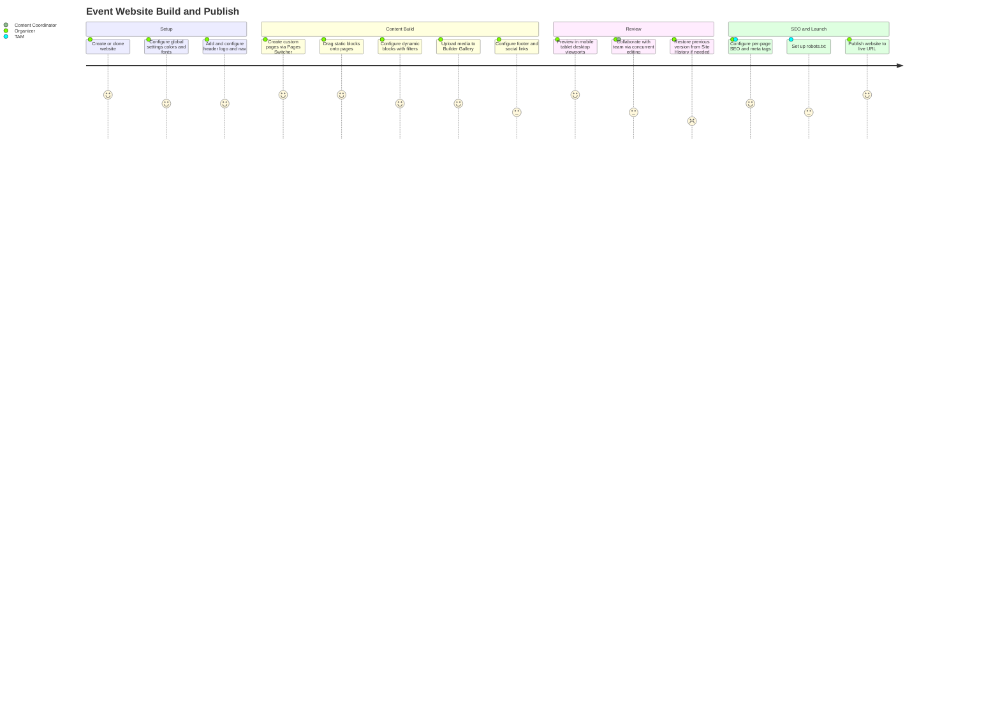
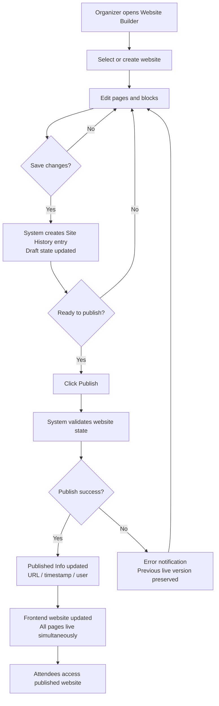
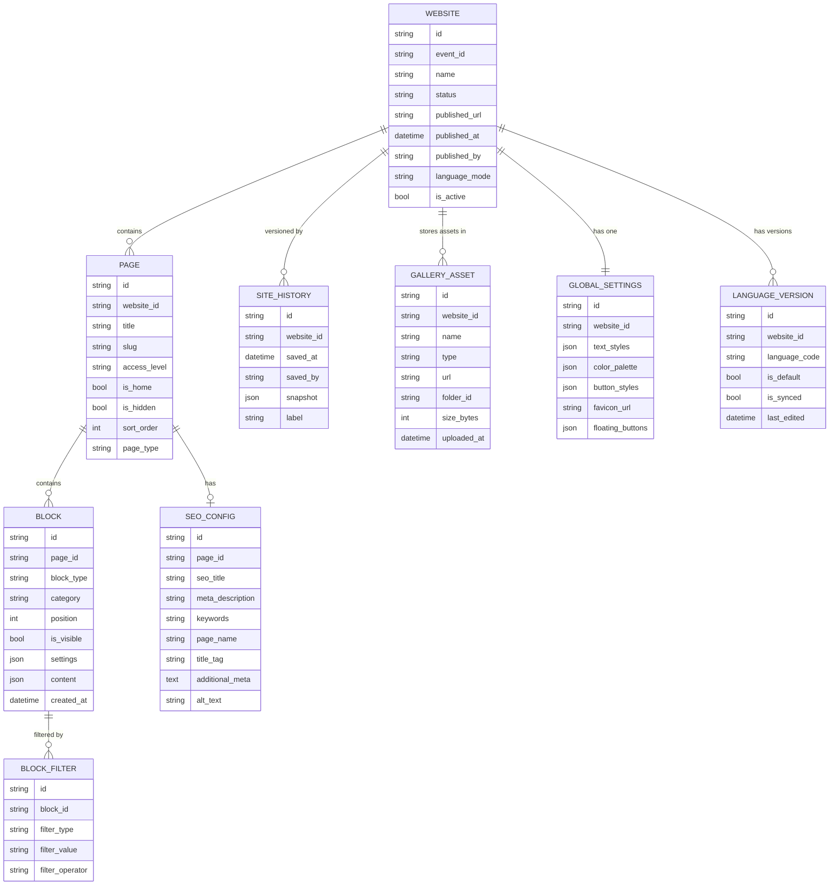
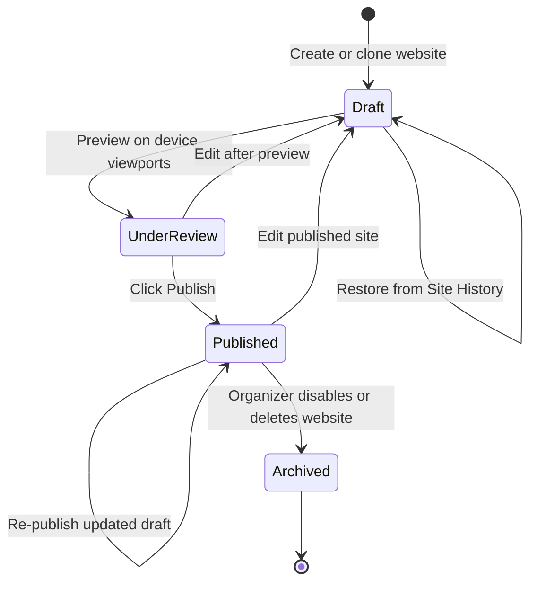
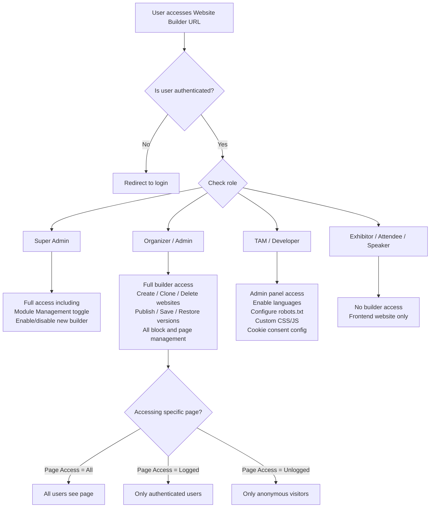

## 1. Product Overview

**Purpose.** Event Website is ExpoPlatform's visual website builder that enables event organisers to create, manage, and publish full-featured, branded event websites without requiring developer skills. It provides a drag-and-drop block-based editor, a rich library of static and dynamic content blocks, global design settings, multi-page management, SEO tooling, and collaborative version control — all accessible directly from the admin panel under Event Setup > Website Builder.

**Problem being solved.** Event websites must be live, on-brand, and content-rich weeks before the event opens, yet organisers rarely have in-house web development resources. Legacy builders required custom HTML for every layout change, produced inconsistent designs across pages, and offered no way to dynamically surface exhibitor, session, speaker, or sponsor data from the platform backend. Event Website solves this by providing a unified no-code editor where content blocks pull live platform data automatically, design tokens (colours, fonts, buttons) propagate globally across every page, and the full site can be published in one click.

**Business value.**
- Reduces time-to-launch for new event websites from weeks of developer effort to hours of organiser self-service.
- Dynamic system blocks keep exhibitor, session, speaker, and sponsor listings current without manual re-editing — critical when hundreds of records change daily in the run-up to an event.
- SEO tooling (per-page meta, robots.txt, GA4 integration, Next.js SSR migration) drives organic traffic to the event, reducing paid acquisition cost.
- Multi-language support unlocks global audiences from a single platform instance.
- Version history and collaborative editing reduce the risk of accidental content loss during high-pressure pre-event build sprints.
- Custom CSS/JS and Developer Mode blocks give technical teams an escape hatch without abandoning the platform.

**Target users.** Event organisers and marketing teams who build and maintain the public-facing event website. Technical Account Managers (TAMs) who configure advanced features and language settings. Developers who extend layouts with Custom CSS/JS.

**User personas.**
- *Event Marketing Manager* — builds the homepage and custom landing pages, manages the media gallery, configures the header/footer, and publishes updates. Primary day-to-day user of the builder.
- *Content Coordinator* — manages specific page sections (news, speakers, sessions), refreshes block content, and previews changes before publication.
- *Technical Account Manager (TAM)* — enables multi-language, configures robots.txt, resolves CSS/JS issues, supports custom grid layouts, and manages cookie consent tool compatibility.
- *Developer / IT* — injects Custom CSS/JS, creates custom HTML blocks, uses Developer Mode (anchor/data-styleid), configures GA4.
- *Event Attendee / Exhibitor / Sponsor* — end consumer of the published website; no builder access.

**Success metrics.** Time from event creation to first website publish; number of pages with complete SEO metadata; organic search traffic to event website; website content freshness (dynamic block accuracy); organiser self-service ratio (website built without TAM involvement); mobile preview adoption rate before publish.

---

## 2. Product Scope

### Included
- **Website lifecycle management**: create, rename, clone, delete, publish, and save websites with full-screen editing mode.
- **Multi-page architecture**: custom pages, system (preset) pages, page ordering, home page designation, sitemap generation, page access control (All / Logged / Unlogged).
- **Header and Navbar**: single-line / double-line styles, logo with shape options, navigation links with sublinks, system buttons (sign-in, search, language selector, custom CTAs), per-layer colour customisation.
- **Footer**: logo, text, links/sublinks, social media buttons, colour customisation, column management, Dev anchor/data-styleid.
- **Static content blocks**: 2/3/4 Cards Row, Cards Carousel, Cards with Counters, Cards with Icons, Carousel, Countdown, Download App, FAQ, Heading+Text+Image+Button, Image Gallery, Intro Block, Testimonials, Text List, Text+Video+Button, Buttons Block.
- **System (dynamic) blocks**: Brands, Exhibitors, News, Products, Sessions, Speakers, Sponsors — each with multiple visual variants, slider/static/pagination modes, sorting, and category/tag filtering.
- **Custom Forms**: embedded / pop-up / sidebar display; configurable triggers; CAPTCHA; field customisation; media support.
- **Builder Gallery**: image/video/file management with folders, crop/edit, search, sort, pagination.
- **Global Settings**: Text Styles, Colours, Button Styles, Favicon, Floating Social Buttons, SEO per page, Multi-language sync/desync.
- **Custom Grids**: flexible multi-column row/column layouts for advanced page design.
- **Block-level settings**: general (visibility/spacing/background), typography, carousel, link, button, icon, video, developer mode (anchor/data-styleid), Custom CSS & JS.
- **Block Item Filtering**: per-block content filters using categories, tags, and entity-specific attributes with AND/OR logic.
- **SEO tooling**: per-page SEO Title, Meta Description, Keywords, Page Name, Title Tag, Additional Meta Tags; robots.txt editor; image alt-text; Next.js SSR migration for all system pages.
- **Multi-language**: synced and desynced modes; up to 15 favourite blocks; browser-language auto-detection; content translation across all entity types.
- **Site History**: version list, restore, delete; collaborative user attribution.
- **Website Preview**: Mobile / Tablet / Desktop viewports.
- **Collaboration**: multiple concurrent editors visible in top menu; changes tracked in Site History.
- **GDPR compliance**: YouTube Privacy-Enhanced Mode; third-party cookie consent tool configuration guidance; GDPR cookie classification for `token`, `fingerprint`, `PHPSESSID`.
- **AI-Assisted Website Builder (Phase I)**: in progress (EP-52646).

### Excluded
- Backend event data management (exhibitor profiles, session creation, speaker records — managed in their respective modules).
- Mobile app interface and navigation (separate App Builder module).
- Registration form logic and payment flows (covered by Transactions & Purchasing).
- Email template builder (separate Email Notifications module).
- Custom domain configuration / DNS management (infrastructure/IT scope).
- Paid GA4 or third-party analytics integration configuration beyond embedding a tracking snippet.
- CMS features such as blog authoring workflows or content approval pipelines.

---

## 3. User Roles

| Role | Access in Event Website | Notes / Restrictions |
| --- | --- | --- |
| **Organizer (Admin)** | Full access to Website Builder, all pages, settings, publish, site history, SEO, gallery | Primary builder role; can create/clone/delete websites; manage all pages and blocks |
| **Super Admin** | Full access including enabling/disabling the New Website Builder toggle in Module Management | Can toggle "New Website Builder (Beta)" on/off globally or per event |
| **Technical Account Manager (TAM)** | Full admin panel access; assists in enabling languages, custom configurations | Typically assists with multi-language setup, robots.txt, cookie consent, custom CSS/JS |
| **Developer (Technical User)** | Admin panel access to Custom CSS/JS, Developer Mode blocks, Custom HTML | Uses anchor/data-styleid, injects GA4 snippet, resolves layout issues |
| **Exhibitor** | No builder access | Exhibitor profile data surfaces via dynamic blocks; exhibitors cannot edit the website |
| **Sponsor** | No builder access | Sponsor content surfaces via Sponsors dynamic block; read-only on published frontend |
| **Attendee / Participant** | No builder access | Consumes the published website; access to specific pages governed by Page Access settings |
| **Speaker** | No builder access | Speaker profiles surface via Speakers dynamic block; no edit rights |

> [!INFO] The "New Website Builder (Beta)" toggle in Admin panel > Module Management > Backend > Event Setup controls which website builder version is active. Super Admins can switch between the new and legacy builder. The new builder is on by default; the legacy builder remains available for backward compatibility.

> [!INFO] Page Access per page: All (public), Logged (authenticated users only), Unlogged (anonymous visitors only). This is set in Global Settings > Page Access and allows personalised content flows (e.g., registration CTA visible only to logged-out visitors).

---

## 4. Feature Inventory

#### Create and Clone Website

**Description.** Organisers create a new website from scratch or clone an existing one to reuse its structure. **Why it exists.** Most events reuse the same design year-on-year; cloning eliminates redundant rebuild effort. **User value.** A new event website can be ready in minutes by cloning a previous edition and updating content. **Functional logic.** Create: enter name (internal only, not visible to end users) > opens blank editor. Clone/Duplicate: copies all pages and blocks except Custom CSS/JS. New name required. **Preconditions.** Organiser authenticated; Website Builder module enabled. **Trigger.** User clicks Create Website or Duplicate on the website selector screen. **Processing.** System creates a new website record; all blocks and page structure copied (clone only); CSS/JS modules excluded from clone. **Outputs.** New website entry in selector; editor opens. **Dependencies.** Event must exist in admin panel. **Configurations.** Website name (internal). **Validation.** Name must be non-empty. **Permissions.** Organizer and above. **Error handling.** If duplication fails, user is notified; no partial copy is created. **Edge cases.** Cloning an event also clones its website, excluding custom CSS/JS.

#### Publish and Save Website

**Description.** Save stores changes as a draft; Publish makes them live on the frontend. **Why it exists.** Organisers need to stage and review changes before exposing them to attendees. **User value.** Separation of draft and live states prevents half-finished work from reaching the public. **Functional logic.** Save: stores current state in backend as a new Site History entry. Publish: pushes the current saved state to the event's public URL; affects all pages simultaneously. Autosave: available (changes auto-saved periodically). **Preconditions.** At least one website exists. **Trigger.** User clicks Save or Publish in the top toolbar. **Processing.** Save creates a versioned snapshot. Publish makes that snapshot the live canonical version; Published Info updated (URL, timestamp, user). **Outputs.** Live website updated; Published Info panel updated. **Dependencies.** Event URL / domain configuration. **Permissions.** Organizer and above. **Error handling.** If publish fails, the previously published version remains live. **Edge cases.** Changes saved but not published are invisible to end users. Clicking Publish without clicking Save first publishes the last saved state.

#### Site History and Version Control

**Description.** Maintains a chronological list of all saved website versions with user attribution. **Why it exists.** Collaborative editing by multiple team members creates risk of accidental overwrites; version history provides a safety net. **User value.** Any previous version can be previewed and restored in seconds; accidental deletions or bad edits are reversible. **Functional logic.** Each Save action creates a new history entry with timestamp, username, and change summary. Restore: creates a new entry (does not overwrite history) allowing the restore itself to be undone. Delete: irreversible; removes the version record permanently. **Preconditions.** At least one save has occurred. **Trigger.** User clicks Site History icon in the top toolbar. **Processing.** Sidebar lists all saved versions. User selects a version to preview or restore. **Outputs.** Restored website state as new draft; new history entry created. **Dependencies.** Site Save operation; user authentication (for attribution). **Configurations.** None (automatic). **Permissions.** Organizer and above. **Error handling.** If restore fails, the current draft is preserved. **Edge cases.** Desyncing the multilingual site then restoring a synced version via Site History re-syncs all language versions (overwrites individual language edits).

#### Website Preview

**Description.** Three-viewport preview mode: Mobile (320-480px), Tablet (768px), Desktop (1024px+). **Why it exists.** Event audiences use diverse devices; layouts must be validated before publish. **User value.** Catch layout issues on mobile before they reach attendees. **Functional logic.** Toggle in top toolbar switches the editor canvas to the selected viewport width. Preview is live (reflects current unsaved state). **Preconditions.** Website is open in editor. **Trigger.** User clicks Mobile, Tablet, or Desktop preview button. **Outputs.** Canvas re-renders at target viewport. **Edge cases.** Preview reflects unsaved changes; published site may differ if Save/Publish not performed after preview.

#### Multi-Page Management

**Description.** Organisers manage an ordered list of custom pages and preset system pages. **Why it exists.** Event websites require multiple distinct pages (home, exhibitors, agenda, speakers, news, contact). **User value.** Full control over site structure, page visibility, and navigation. **Functional logic.** Pages Switcher sidebar: add custom page, enable/disable preset system pages (Agenda, Exhibitors, Speakers, News, etc.), hide/show individual pages, edit each page's settings (SEO, access, rename). Any page can be set as the Home Page. Sitemap XML can be downloaded. Page Access per page: All / Logged / Unlogged. **Preconditions.** Website created. **Trigger.** User opens Pages Switcher sidebar. **Outputs.** Updated site structure; sitemap.xml updated. **Permissions.** Organizer and above. **Validation.** Home Page must exist; cannot delete the only page.

#### Header and Navbar

**Description.** Customisable site-wide header with logo, navigation links, system buttons, and colour scheme. **Why it exists.** Every page shares the same header; centralised control ensures brand consistency. **User value.** No-code navigation management — add, remove, reorder, and nest menu items without HTML. **Functional logic.** Style: Single-line (all nav + system items in one row) or Double-line (nav links below branding row). Logo: auto-pulled from Event Setup; can be overridden; shapes circle/square/rectangle. Title/Subtitle (event date/name): auto-pulled, editable. Links: display name, link target (URL/page/sitemap/anchor/file), target window, role (none/sign-in required/sign-in button), layout (text/text+icon/icon). Sublinks: drag any link under another to nest. Colours: per-layer bg, text, hover, active, submenu, search field. Buttons: sign-in toggle, 3 custom CTAs, search toggle, language selector toggle. Dev: anchor, data-* attributes for CSS targeting. **Dependencies.** Event Setup logo; event date/name fields. **Permissions.** Organizer and above.

#### Footer

**Description.** Site-wide footer with logo, body text, navigation links, social media icons, and custom styling. **Why it exists.** Footer provides consistent secondary navigation and contact information across all pages. **User value.** Single configuration point for copyright, social links, and additional navigation. **Functional logic.** Auto-included on new website creation. Disable/Enable toggle. Settings: Logo (upload or toggle off), Content (text block + phone/location/copyright text), Links with sublinks (pre-configured defaults editable/deletable), Colors (background/link text/divider), Buttons (Facebook/Twitter/LinkedIn/Instagram/YouTube). Dev: Anchor (scroll-target ID), Data-styleid (custom CSS hook). Footer CSS features (EP-37518, EP-37526, EP-37947): text position setting, column deletion, column alignment control. **Permissions.** Organizer and above. **Edge cases.** Custom CSS/JS not cloned when duplicating a website or cloning an event.

#### Static Content Blocks

**Description.** Pre-designed, manually-populated blocks for building custom page layouts. **Why it exists.** Organisers need a rich palette of layout patterns (cards, carousels, countdowns, FAQs, galleries) without writing HTML. **User value.** Professional page design without design expertise. **Functional logic.** Blocks are added via drag-and-drop or "Add this block" from the Add Block panel. Block types: 2/3/4 Cards Row; Cards Carousel; Cards with Counters (animated numeric counters); Cards with Icons; Carousel (generic); Countdown (end date/time configurable); Download App (iOS/Android links); FAQ (collapsible, >8 items supported per EP-25939); Heading+Text+Image+Button (combined rich block); Image Gallery (grid/masonry/carousel); Intro Block; Testimonials; Text List; Text+Video+Button; Buttons Block (CTAs only). Each block has General Block Settings (visibility, spacing, background, text width, rich text editor) and block-specific settings. **Configurations.** Block content (text/images/links/videos); carousel timing; counter targets; FAQ questions/answers. **Permissions.** Organizer and above.

#### System (Dynamic) Content Blocks

**Description.** Data-driven blocks that automatically display and update content from the platform backend: Brands, Exhibitors, News, Products, Sessions, Speakers, Sponsors. **Why it exists.** Manual maintenance of exhibitor and session listings is impractical at scale; dynamic blocks eliminate re-entry. **User value.** Exhibitor lists, session schedules, and speaker rosters on the website stay accurate without manual updates. **Functional logic.** Each content type offers multiple visual variants (e.g., Exhibitors: 5 variants; Speakers: 3; Sessions: 4; Products/News/Sponsors/Brands: 3-5 each). Display mode: Slider (auto if many cards) or Static (Load More / Pagination / Fixed count). Sorting: Regular (alphabetical), Inverted (reverse alpha), Random. Filtering: by category, product category, tags, specific entity search. Block-specific filtering: Sessions also support track, type, featured flag, start date. Only active/published entities shown (e.g., only Active speakers, not Invited). **Dependencies.** Backend data for each entity type (Exhibitor management, Session management, etc.). **Configurations.** Variant selection; display mode; card count; sort order; filter criteria. **Validation.** Block not displayed if filters yield no results or user lacks permission. **Edge cases.** If no backend data exists for the content type, placeholder cards shown in preview.

#### Block Item Filtering

**Description.** Per-block filtering controls what subset of dynamic content is shown in a specific block instance. **Why it exists.** A single page may show Featured Speakers in one block and All Speakers in another; filtering enables this differentiation. **User value.** Targeted content presentation without creating separate pages. **Functional logic.** Supported for all 7 dynamic content types. Filter attributes: Tags, Categories, Dates, entity-specific fields. Multiple values within one filter type apply OR logic; combining two different filter types applies AND logic. **Trigger.** User opens block Settings > Filtering tab. **Validation.** If filter criteria match zero records, block is not displayed on the published site.

#### Custom Forms

**Description.** Embeddable forms on any website page with configurable fields, display modes, and triggers. **Why it exists.** Lead capture, feedback collection, and pre-event registration interest forms need to live on the event website without external form tools. **User value.** Contact forms, feedback forms, and interest capture without leaving the platform. **Functional logic.** Display types: embedded block, pop-up, sidebar. Pop-up triggers: time delay (seconds), button click, scroll percentage. Fields: First Name, Last Name, Email, Company, Job Title, Phone, and custom fields; add/remove/reorder. Styling: colours, fonts, button style (inherits or overrides global). CAPTCHA: built-in spam prevention. Media: include images/videos in the form. Button linking: any button on the site can trigger a form pop-up. Success notification shown after submission (custom notification text not yet supported). Device targeting: show on desktop, mobile, or both. **Permissions.** Organizer and above for configuration. All users (per Page Access) can submit.

#### Builder Gallery

**Description.** Centralised media library for all website assets: images, videos, and files. **Why it exists.** All block image/video assets need a single organised repository; no file duplication across blocks. **User value.** Upload once, use everywhere; includes crop/edit tools eliminating external image editing. **Functional logic.** Three tabs: Images, Videos, Files. Search: global by filename characters, activated by Enter/search icon. Folders: creatable in Images + Files tabs (not Videos). Sort: by creation date, modified date, or name. View: list or gallery layout. Items per page: 4, 8, or 16. Actions on images: crop+edit (crop/rotate/zoom; creates new file, preserves original), preview, move, copy, copy URL, download, delete. Actions on videos: preview (opens player popup), copy URL, download, delete. Actions on files: preview, move, copy, copy URL, download, delete. Upload: via file explorer or drag-and-drop. **Permissions.** Organizer and above.

#### Global Settings

**Description.** Site-wide design tokens and configuration that apply across every page: Text Styles, Colours, Buttons, Favicon, Floating Social Buttons, SEO (per page), Multi-language, Page Access. **Why it exists.** Consistent branding requires a single source of truth for fonts, colours, and button styles. **User value.** Change the brand colour once and it propagates to every block across every page instantly. **Functional logic.** Text Styles: font name/weight for h1/h2/subtitle1/body1/body2/button labels; custom fonts via CDN URL or uploaded TTF/OTF/WOFF/WOFF2. Colours: Primary, Secondary, Brand 1, Brand 2; Text, Status, Favorites, Border/Background, Sponsor bar (web and app). Buttons: Primary/Secondary/Link; background/text/border/shadow for Default and Hover states; size/corner radius/padding. Floating Buttons: per-platform social links (Facebook/Twitter/Instagram/LinkedIn/YouTube) displayed as floating overlay. Page Access: per-page visibility selector. Multi-language: sync/desync control. Send Feedback: smiley rating + text suggestion submission. **Access.** Event Setup > Website Builder > Settings (gear icon).

#### Custom Grids

**Description.** Flexible layout engine enabling multi-column, multi-row grid layouts for pages beyond the default single-column block stack. **Why it exists.** Brand guidelines often require two- or three-column layouts, side-by-side blocks, and mixed-width sections not achievable with standard stacked blocks. **User value.** Design freedom matching any brand layout specification without custom development. **Functional logic.** Organisers define rows with configurable column counts. Content blocks are placed into grid cells. Default element placement optimised for clean out-of-the-box layouts. Column count display is clear and consistent. Improved base structure reduces layout glitches when adding/resizing blocks (EP-47645). **Permissions.** Organizer and above.

#### SEO Management

**Description.** Per-page SEO configuration and site-level controls to improve search engine visibility. **Why it exists.** Event websites compete for organic search traffic; without structured SEO data, pages are poorly indexed. **User value.** Higher organic rankings drive more attendee, exhibitor, and sponsor registrations without paid advertising. **Functional logic.** Per-page fields (in Global Settings > SEO and per-page edit): SEO Title (<60 chars recommended), Meta Description (150-160 chars), Keywords, Page Name (affects URL slug), Title Tag, Additional Meta Tags. Robots.txt: Admin panel > Event Setup > General Settings > Robot.txt file section (freetext textarea above meta tags). Image alt-text: set per image in the gallery or block settings. H1 tags: written for all pages (EP-15215). System pages SEO: controls added for all system (preset) pages (EP-105). Category/filter pages: metadata support for exhibitor/product category pages (EP-279). Next.js v14 SSR migration: Brand, Community, Events, News, News single, Marketing content, Exhibitor, Participant, Group, Session single pages migrated for SEO-friendly server-side rendering. **Access.** Global Settings > SEO; or Pages Switcher > Edit page > SEO Setup. **Dependencies.** Google Search Console for indexation monitoring; GA4 snippet (injected via Custom JS block or admin setting).

#### Multi-Language Website

**Description.** Create and manage website content in multiple languages from a single builder instance. **Why it exists.** International events serve attendees who prefer their native language; a single-language website alienates non-English speakers. **User value.** Organisers can deliver fully localised websites without duplicating the entire site structure. **Functional logic.** Enable: TAM enables required language in event settings. Language Switcher in top toolbar selects the active language version. Sync mode (default): edits to any block propagate to all language versions automatically; only translatable text fields differ. Desync: Global Settings > Multi-language > Unsync > Confirm; each block becomes independent per language; banner indicator shown. Reset/Resync: overwrites all language versions with the main language (English), restoring synchronisation; also achievable via Site History restore. Favourite Blocks: up to 15; saved in exact state (content+styling); available across all language versions. Content types supporting multi-language: product categories, exhibitor/product descriptions and names, person bios, speaker/moderator bios, news articles, session titles and descriptions, website block text, menu items, registration form fields and response options. Browser language detection: website opens in the user's browser language when multi-language is enabled (EP-23702). **Preconditions.** Language enabled by TAM in event configuration. **Permissions.** Organizer and above.

#### Block Developer Mode and Custom CSS/JS

**Description.** Advanced developer tools: Custom HTML block, Text Editor block, per-block Dev settings (anchor/data-styleid), and site-wide Custom CSS/JS injection. **Why it exists.** Some layout and functionality requirements exceed what standard blocks provide; developer escape hatches avoid the need for fully custom builds. **User value.** Technical teams can extend the website with custom code without abandoning the platform's publish/version control system. **Functional logic.** Custom HTML block: enter raw HTML; define anchor ID and data-styleid for CSS targeting; pop-up modal option with header/close/overlay colour config, display triggers (time delay/scroll %/click count/inactivity), auto-close settings, device targeting, multilanguage support. Text Editor block: rich text with alignment/padding/margin. Per-block Dev settings: Anchor (scroll-to-block ID for nav links), Data-styleid (CSS selector hook). Custom CSS/JS (site-wide): Add Block > Custom CSS and JS; apply globally or to specific pages/sections; not carried over when duplicating/cloning. **Dependencies.** Understanding of HTML/CSS/JS. **Permissions.** Organizer/Developer role; no platform-level sandboxing of injected code. **Edge cases.** Malformed CSS can hide other elements; Custom CSS/JS excluded from website clone and event clone.

#### Third-Party Cookie Consent Compliance

**Description.** Configuration guidance for integrating third-party cookie consent banners (CookieBot, CookieYes, OneTrust, etc.) without breaking ExpoPlatform functionality. **Why it exists.** Cookie consent tools that misclassify platform cookies break authentication and real-time features. **User value.** Organisers can comply with GDPR cookie law without degrading attendee experience. **Functional logic.** ExpoPlatform cookies that must be classified as Necessary/Strictly Necessary: `token` (auth — without it all authenticated requests fail), `fingerprint` (WebSocket sessions — without it real-time notifications and statistics fail), `PHPSESSID` (session management). Symptoms of misconfiguration: unexpected logouts, reCAPTCHA expiry, notifications stopping, "user not identified" errors. Fix: customer configures their consent tool to move these three cookies to the Necessary category. **Dependencies.** Third-party consent tool (not an ExpoPlatform product). **Permissions.** Organizer / IT administrator.

#### Display Filters Management

**Description.** Configures how search/filter panels are displayed on system pages (Exhibitors, Sessions, Speakers, etc.). **Why it exists.** Organisers need to customise filter labels per language and control which filters are visible to which user segments. **User value.** Clean, localised filter UI reduces bounce rate on key discovery pages. **Functional logic.** Access: Event Setup > Display Filters. Options: drag to reorder, rename labels per language, toggle visibility, restrict to specific categories. Available for: Delegates, Speakers, Buyers, Exhibitors, Pavilions, Products, Brands, Sessions/On-Demand, Groups, News. Filter logic: OR within a filter type, AND between filter types. Meeting Availability filter (web only): hides users who have reached their confirmed meeting limits. Search-within-filter toggle: shown for filters with ≥10 items (web only). **Dependencies.** Categories and tags configured in event setup.

---

## 5. User Stories Mapping

| Story ID | Title | Summary | Acceptance Criteria | Related Feature | Status |
| --- | --- | --- | --- | --- | --- |
| EP-5031 | New Website Builder | Core new builder implementation | Design matches Figma prototype; builder accessible from admin panel | Core Builder Platform | In Progress |
| EP-8495 | Main menu of the Website builder | Top toolbar with all primary builder controls | All menu buttons functional left-to-right; Add Block/Page Manager/Preview/Gallery/History/Settings/Save/Publish present | Basic Page Management | COMPLETE |
| EP-8758 | Main menu - Add block | Add Block button in toolbar | Clicking opens sidebar with all block categories | Static/Dynamic Blocks | COMPLETE |
| EP-8831 | Main menu - Gallery button | Gallery access from toolbar | Gallery screen appears with file search, tabs, upload, folder creation, sort, layout toggle | Builder Gallery | COMPLETE |
| EP-9002 | Main menu - Global settings | Settings button in toolbar | Settings screen shows Text Styles, Colors, Buttons, Favicon, SEO tabs | Global Settings | COMPLETE |
| EP-12606 | Blocks - Content | Static content block library | All 16 static block types available; drag-and-drop functional; each block configurable | Static Content Blocks | COMPLETE |
| EP-12608 | Header and Footer | Header and footer components | Logo upload/configure; nav menu with add/remove/reorder/sublinks; footer with logo/links/social/colors | Header / Footer | COMPLETE |
| EP-15215 | Write H1 for all pages | H1 tags on all website pages | Every system page has a properly structured H1 tag | SEO Management | COMPLETE |
| EP-15856 | Documentation | Builder documentation | Documentation written and published | Documentation | In Progress |
| EP-18758 | Frontend refactor | Tech debt frontend refactor | Codebase refactored without regressions | Core Builder Platform | COMPLETE |
| EP-18894 | Setting to enable/disable new Website builder | Module management toggle for new builder | Toggle visible in Admin > Module Management > Backend > Event Setup; default on | Global Settings / Admin | COMPLETE |
| EP-18895 | Two Website builders on the Platform | Legacy and new builder toggle | Toggle in Event Setup > General Settings; off = legacy; on = new builder | Core Builder Platform | COMPLETE |
| EP-18901 | Part 2 - Multilanguage | Multi-language sync/desync | Blocks synced by default; desync option in settings; banner indicator shown; reset restores sync | Multi-Language | COMPLETE |
| EP-20669 | IMEX - SAML User directed to homepage | SAML post-auth redirect to intended page | After SAML auth, user is directed to the originally requested URL, not homepage | Core Builder / Auth | COMPLETE |
| EP-20868 | Custom content block | Custom content blocks for new builder | Custom content blocks available in block library | Static Content Blocks | COMPLETE |
| EP-21629 | Exhibitors block | Exhibitors dynamic block | 5 exhibitor block variants available; each configurable with sorting/filtering/display mode | System Blocks - Exhibitors | COMPLETE |
| EP-21630 | Products block | Products dynamic block | 5 product block variants with sorting/filtering/slider/pagination | System Blocks - Products | COMPLETE |
| EP-21631 | News block | News dynamic block | 3 news block variants; slider or static; filtering by category/tags | System Blocks - News | COMPLETE |
| EP-21632 | Speakers block | Speakers dynamic block | 3 speaker block variants; sorting (Random/Alpha/Inverted); slider/static; active-only display | System Blocks - Speakers | COMPLETE |
| EP-21888 | Adding Banners as OLD website | Banner blocks in new builder | Banner blocks available in new website builder matching legacy builder capability | Static Content Blocks | COMPLETE |
| EP-21927 | Brands block | Brands dynamic block | Brands block with slider/static, sorting, category filter | System Blocks - Brands | COMPLETE |
| EP-21984 | Twitter logo and text update | X/Twitter rebranding across platform | Twitter icons and text updated to X branding in footer social buttons and admin panel | Footer | COMPLETE |
| EP-22333 | Sponsors block | Sponsors dynamic block | 5 sponsor block variants; sorting/filtering/slider/static | System Blocks - Sponsors | COMPLETE |
| EP-22334 | Session block | Sessions dynamic block | 4 session block variants; filter by track/type/tags/featured/date; slider/static | System Blocks - Sessions | COMPLETE |
| EP-22484 | Part 2 - Team work | Collaborative editing | Multiple concurrent editors visible in top menu; changes tracked in Site History | Collaboration / Site History | COMPLETE |
| EP-23051 | Improve Text Editor in New Website Builder | Rich text editor in builder | Typography module available in all text-containing blocks with full formatting options | Block Typography | COMPLETE |
| EP-23166 | Chatbot based on LLM in Admin Panel | AI chatbot for admins | Chatbot interface in admin panel answering documentation questions | Admin AI Assist | COMPLETE |
| EP-23702 | Changing Website Language Based on Browser | Browser-language detection | Website opens in user's browser language when multi-language enabled | Multi-Language | COMPLETE |
| EP-23990 | Title and Subtitle block | Title/Subtitle element block | Title and Subtitle block available in Elements section of block library | Static Elements | COMPLETE |
| EP-24017 | My Basket for the exhibitor | Exhibitor basket/payment page | Basket page accessible and functional for exhibitors | Basket/Payment (cross-product) | COMPLETE |
| EP-24028 | Content Blocks: Image Asset Dimensions | Dimension display in image blocks | Image blocks display required dimensions so marketing teams can prepare correctly sized assets | Static Content Blocks | COMPLETE |
| EP-24373 | New web builder - Custom Forms | Custom form blocks | Custom Form block in new builder; embedded/popup/sidebar; field customisation; CAPTCHA | Custom Forms | COMPLETE |
| EP-25939 | Ability to add more than 8 FAQs | FAQ block unlimited items | FAQ block supports more than 8 questions without UI breakage | Static Blocks - FAQ | COMPLETE |
| EP-27309 | Tiered Menu Navigation for App Browser | App browser tiered menu | App browser renders navigation items in tiered hierarchy (main > sub) rather than flat list | Header/Navbar | COMPLETE |
| EP-36256 | Alt Text for Images | Image alt text for SEO and accessibility | Alt text field available per image in gallery and block settings; stored and rendered in HTML | SEO - Alt Text | COMPLETE |
| EP-36267 | Header Menu Customization Options | Advanced header menu customisation | Additional header menu style/layout/customisation options available per Figma prototype | Header and Navbar | In Progress |
| EP-36507 | SEO: Text & iframe & button blocks | SSR for text/iframe/button blocks | Text, iframe, and button blocks render content in server response for SEO crawlability | SEO - System Blocks | COMPLETE |
| EP-36508 | SEO: Banners block | SSR for banner blocks | Banner blocks render in server response; verified via crawler check | SEO - System Blocks | COMPLETE |
| EP-36683 | SEO: Dynamic / Brands | SSR for Brands dynamic block | All 4 Brands block variants render in server response | SEO - System Blocks | COMPLETE |
| EP-36684 | SEO: Dynamic / Custom Form | SSR for Custom Form block | All 5 Custom Form block variants render correctly in server response | SEO - Custom Forms | COMPLETE |
| EP-36685 | SEO: Dynamic / Exhibitor | SSR for Exhibitor dynamic block | All 5 Exhibitor block variants render in server response | SEO - System Blocks | COMPLETE |
| EP-36687 | SEO: Dynamic / News | SSR for News dynamic block | All 5 News block variants render in server response | SEO - System Blocks | COMPLETE |
| EP-36689 | SEO: Dynamic / Products | SSR for Products dynamic block | All 5 Products block variants render in server response | SEO - System Blocks | COMPLETE |
| EP-36691 | SEO: Dynamic / Sessions | SSR for Sessions dynamic block | All 4 Sessions block variants render in server response | SEO - System Blocks | COMPLETE |
| EP-36692 | SEO: Dynamic / Speakers | SSR for Speakers dynamic block | All 3 Speakers block variants render in server response | SEO - System Blocks | COMPLETE |
| EP-36693 | SEO: Dynamic / Sponsors | SSR for Sponsors dynamic block | All 5 Sponsors block variants render in server response | SEO - System Blocks | COMPLETE |
| EP-36694 | SEO: Dev / Custom HTML | SSR for Custom HTML block | Custom HTML block content appears in server response | SEO - Developer Mode | COMPLETE |
| EP-36695 | SEO: Dev / Text editor | SSR for Text Editor block | Text Editor block content appears in server response | SEO - Developer Mode | COMPLETE |
| EP-37488 | Brand page - /brand/[id] | Next.js v14 migration: brand page | Brand page migrated to Next.js v14; breadcrumbs/links/exhibitor cards/related content preserved | SEO - Page Migration | COMPLETE |
| EP-37489 | Community page - /community | Next.js v14 migration: community page | Community page migrated; news/groups/members/banners/products retained | SEO - Page Migration | COMPLETE |
| EP-37490 | Events page - /events | Next.js v14 migration: events page | Events page migrated; breadcrumbs; community event setting respected | SEO - Page Migration | COMPLETE |
| EP-37518 | Footer: Text position setting | New "Text position" setting for footer | Text position configurable in footer settings per Figma design | Footer | COMPLETE |
| EP-37526 | Footer: Delete column | Ability to delete a footer column | Delete button available per footer column per Figma design | Footer | COMPLETE |
| EP-37530 | Changes to footer based on CSS tasks | Footer CSS-tasks-as-features epic | Footer improvements implemented as proper configurable features | Footer | COMPLETE |
| EP-37569 | News page - /news | Next.js v14 migration: news listing page | News page migrated; breadcrumbs/banners/filters/news list preserved | SEO - Page Migration | COMPLETE |
| EP-37570 | News single page - /news/[id] | Next.js v14 migration: news detail page | News detail migrated; breadcrumb/banner/news content/recommendations retained | SEO - Page Migration | COMPLETE |
| EP-37947 | Footer: Column alignment | Footer column alignment control | Column alignment configurable per Figma design | Footer | COMPLETE |
| EP-38048 | Marketing content page - /content/[id] | Next.js v14 migration: content page | Marketing content page migrated to Next.js v14 | SEO - Page Migration | COMPLETE |
| EP-38049 | Exhibitor page - /exhibitor/[id] | Next.js v14 migration: exhibitor profile | Exhibitor single page migrated; all existing content preserved | SEO - Page Migration | COMPLETE |
| EP-38050 | Participant single page - /participant/[id] | Next.js v14 migration: participant profile | Participant page migrated | SEO - Page Migration | COMPLETE |
| EP-38051 | Group single page - /groups/[id] | Next.js v14 migration: group page | Group detail page migrated | SEO - Page Migration | COMPLETE |
| EP-38052 | Session single page - /sessions/[id] | Next.js v14 migration: session detail | Session single page migrated | SEO - Page Migration | COMPLETE |
| EP-40342 | Header Title and Subtitle improvements | Mobile header visibility improvements | Header title/subtitle visible and correctly sized on mobile; does not clip | Header and Navbar | COMPLETE |
| EP-47645 | Website builder - Custom grids | Custom Grids layout feature | Organiser can create multi-column grid layouts; blocks placed in configurable cells | Custom Grids | COMPLETE |
| EP-52646 | AI-Assisted Website Builder Phase I | AI-assisted website generation | AI tools assist in website structure/content generation (Phase I scope) | AI Features | In Progress |
| EP-104 | SEO: robots.txt editor | Robots.txt editing UI | robots.txt editor accessible in Admin > Event Setup > General Settings; freetext save | SEO - Robots.txt | COMPLETE |
| EP-105 | SEO controls for standard pages | Per-page SEO for all system pages | All system pages have editable SEO Title/Description/Keywords in builder settings | SEO Management | COMPLETE |
| EP-279 | Category pages with metadata | SEO metadata for category/filter pages | Category pages (exhibitor/product) support custom copy and meta fields | SEO - Category Pages | COMPLETE |

---

## 6. End-to-End Workflows

### Website Build and Publish Journey

### System Workflow — Website Publish Flow

### Happy Path
Organiser creates a new website, configures global colours and fonts, adds a header with logo and navigation links, builds a homepage with static blocks (Intro Block, Cards Carousel, Countdown) and dynamic blocks (Exhibitors, Speakers, Sessions), uploads images to the Gallery, previews on mobile/tablet/desktop, configures SEO per page, and clicks Publish. The site goes live immediately and dynamic blocks auto-update as exhibitors and speakers are added in the backend.

### Alternate Path
Organiser needs to update an existing site mid-event. They open the website builder, find the relevant block, edit the content, Save the draft, preview it, then Publish. The previously live version remains visible to attendees until Publish is clicked. If a team member made conflicting changes, the organiser checks Site History to identify the last good version and restores it.

### Exception Path
Organiser accidentally deletes a page. Because the delete is confirmed via a modal, the action is intentional but Site History retains all previous saves. The organiser opens Site History, selects the version before the deletion, clicks Restore, and the page content is recovered as a new draft, which they then Save and Publish.

### Recovery Path
A third-party cookie consent banner breaks user authentication after deployment. The TAM identifies that the `token` and `fingerprint` cookies are classified as non-Necessary. They log into the customer's cookie consent tool (e.g., CookieYes), move these cookies to the Strictly Necessary category, and the authentication issues resolve without any changes to the website builder itself.

---

## 7. Business Rules Engine

| Rule | Condition | Exception / Priority | Conflict Resolution |
| --- | --- | --- | --- |
| Publish applies to all pages simultaneously | Clicking Publish updates every page of the selected website | No selective page publish; all-or-nothing | Stage changes page by page before a final publish |
| Save creates a Site History entry | Every manual Save creates a versioned snapshot | Autosave also creates entries; history may grow quickly | Delete old history entries manually to keep the list manageable |
| Restore creates a new history entry | Restoring a version does not overwrite history | The restoration itself is reversible via another restore | Always preview before restoring to confirm the correct version |
| Custom CSS/JS excluded from cloning | Cloning a website or an event does not copy Custom CSS/JS modules | Intentional to prevent CSS from a prior event breaking a new one | Manually re-apply required CSS/JS to the cloned website |
| Dynamic blocks show only active entities | Exhibitor, Speaker, Sponsor blocks render only Active records | Invited or inactive records are never shown | Update entity status to Active in the relevant module to include them |
| Filter OR within type, AND between types | Multiple tags selected = OR result; tags + category = AND result | Prevents unintended content suppression | Review filter combinations when a block shows fewer items than expected |
| Desync overwrites all language versions on Reset | Clicking Reset in Multi-language overwrites all languages with the main language | Irreversible without restoring from Site History | Backup (screenshot or export) non-English content before resetting |
| Page Access Unlogged hides page from authenticated users | Pages set to "Unlogged" are not visible after sign-in | Useful for registration CTAs targeting anonymous visitors only | Ensure a suitable post-login landing page exists |
| Cookie consent tool must classify platform cookies as Necessary | If `token`/`fingerprint`/`PHPSESSID` are non-Necessary, real-time and auth features break | Third-party consent tool is outside ExpoPlatform control | Provide customer with specific cookie names and required classification |
| YouTube embeds must use Privacy-Enhanced Mode for GDPR | Standard YouTube embed URL sets tracking cookies pre-consent | Use `youtube-nocookie.com` domain via Privacy-Enhanced Mode checkbox | Use the youtube-nocookie.com embed code at all times for embedded videos |
| Website name is internal only | The name entered on creation is not displayed to website visitors | Used for versioning and multi-website management | Name should be descriptive for the organiser (e.g., "EN 2025 Main Site") |
| Block not visible if filters return zero results | A dynamic block with filters that match no backend records is hidden on the published site | Expected behaviour — not a bug | Verify filter configuration and backend data before publishing |

---

## 8. Data Model

**Inputs.** Page content (text, images, videos, HTML), media uploads (Gallery), global design tokens (colours, fonts, button styles), SEO fields, filter configuration, language content.

**Outputs.** Published website HTML/CSS/JS rendered via Next.js SSR; sitemap XML; robots.txt; SEO meta tags in `<head>`; dynamic content fetched from backend APIs at render time.

**Data objects.** Website (top-level container); Page (individual URL route); Block (content unit on a page); SiteHistory (version snapshots); GalleryAsset (media files); SEOConfig (per-page search metadata); GlobalSettings (design tokens); LanguageVersion (multilingual variants); BlockFilter (dynamic content filtering rules).

**Lifecycle states.** Website: Draft → Published. Page: Active (visible) → Hidden. Block: Visible → Hidden. SiteHistory: Saved → Restored (creates new entry) → Deleted (irreversible).

### Page/Site Publishing Lifecycle

---

## 9. Permissions Matrix

### Permission Flow

### Role × Capability Table

| Capability | Super Admin | Organizer | TAM / Developer | Exhibitor | Attendee | Speaker |
| --- | --- | --- | --- | --- | --- | --- |
| Enable/disable New Website Builder module | Yes | No | No | No | No | No |
| Create / clone / delete website | Yes | Yes | Yes (via admin) | No | No | No |
| Edit pages and blocks | Yes | Yes | Yes | No | No | No |
| Publish website | Yes | Yes | Yes | No | No | No |
| Restore Site History | Yes | Yes | Yes | No | No | No |
| Configure Global Settings | Yes | Yes | Yes | No | No | No |
| Upload to Builder Gallery | Yes | Yes | Yes | No | No | No |
| Configure SEO per page | Yes | Yes | Yes | No | No | No |
| Edit robots.txt | Yes | Yes (via admin panel) | Yes | No | No | No |
| Inject Custom CSS/JS | Yes | Yes | Yes | No | No | No |
| Enable multi-language | Yes | No (needs TAM) | Yes | No | No | No |
| View published website | Yes | Yes | Yes | Yes | Yes | Yes |
| Submit custom forms | Yes | Yes | Yes | Yes | Yes | Yes |
| Access Logged-only pages | Yes | Yes | Yes | Yes (if registered) | Yes (if registered) | Yes (if registered) |
| Access Unlogged-only pages | No (logged in) | No (logged in) | No (logged in) | No (if logged in) | Yes (if not logged in) | No (if logged in) |

---

## 10. Integrations

| Integration | Purpose | Trigger | Data Exchanged | Failure Handling | Retry | Security |
| --- | --- | --- | --- | --- | --- | --- |
| **Backend Entity APIs (Exhibitors, Sessions, Speakers, Sponsors, Products, Brands, News)** | Power dynamic (system) blocks with live platform data | Block render on page load or publish | Entity records (name, description, logo, category, status, tags) | Block renders empty or shows placeholders | Auto-retry on render; platform caches data | Internal API; auth via platform session |
| **Google Analytics 4 (GA4)** | Website traffic analytics and conversion tracking | GA4 snippet injected via Custom JS block or admin setting | Page views, event data, user sessions | If snippet fails to load, no tracking data collected; website still functions | None (client-side script) | Customer-owned GA4 property; snippet injected by organiser |
| **YouTube (video embeds)** | Video content in blocks | Organiser embeds YouTube video URL | Video player iframe; YouTube sets cookies | If YouTube unavailable, blank video area shown | None | Use Privacy-Enhanced Mode (youtube-nocookie.com) for GDPR compliance |
| **Third-party Cookie Consent Tools (CookieBot / CookieYes / OneTrust)** | GDPR cookie consent management | Page load; consent banner shown to visitors | Cookie consent decisions; cookie classification | Misconfiguration causes auth failures and broken real-time features | None (customer-managed tool) | `token`, `fingerprint`, `PHPSESSID` must be classified as Necessary |
| **CDN (Font delivery)** | Custom font serving via CDN URL | Font loaded when text style applied | Font files (TTF/OTF/WOFF/WOFF2) | Fonts fail to load; fallback system font used | Browser retry on font fetch failure | Customer-provided CDN URL; no ExpoPlatform auth required |
| **SAML / SSO (for gated pages)** | Single Sign-On redirect handling for authenticated page access | User accesses a Logged-only page | SAML auth token; user identity | Post-auth redirect must target original intended URL (EP-20669) | None; SAML provider handles retry | SAML standard; auth token stored as Necessary cookie |
| **Sitemap XML generator** | SEO: submit sitemap to search engines | Organiser clicks Download Sitemap in Pages Switcher | XML sitemap with all page URLs | If generation fails, previous sitemap remains downloadable | On-demand regeneration | Public document; no auth |

---

## 11. Notifications

> [!INFO] The Event Website builder is an admin-side tool; it does not generate outbound notifications to attendees or exhibitors directly. The primary notification mechanism is the publishing event itself — the website going live is the trigger for attendees to access event content.

| Notification | Channel | Trigger | Recipient | Timing | Notes |
| --- | --- | --- | --- | --- | --- |
| Custom Form submission confirmation | In-app (website frontend) | User submits a Custom Form block | Form submitter | Immediate on submission | Standard success notification; custom notification text not yet supported |
| Site published (Published Info update) | Admin panel UI | Organizer clicks Publish | Admin panel (displays URL, timestamp, publisher name) | Immediate | No email sent; purely informational in UI |
| Restore confirmation | Admin panel UI modal | User clicks Restore on a Site History entry | Organizer performing restore | Before action (confirmation modal) | Prevents accidental restore |
| Delete website confirmation | Admin panel UI modal | User clicks Delete Website | Organizer | Before action (confirmation modal) | Action is irreversible; no undo |
| Delete Site History version | Admin panel UI modal | User clicks Delete on a history version | Organizer | Before action | Irreversible |
| Cookie consent misconfiguration symptoms | Browser behaviour (not a platform notification) | Consent tool strips auth cookies | End user (attendee/exhibitor) | On page load / session expiry | Manifests as unexpected logout, reCAPTCHA expiry, broken notifications |

---

## 12. Reporting and Analytics

> [!INFO] The Event Website module does not have a dedicated analytics dashboard within the builder. Website traffic analytics are configured by injecting a GA4 snippet via Custom JS. The platform's Organiser Analytics module covers event-level engagement but not website-specific page-view metrics.

| Report / Metric | Source | Inputs | Metrics / Calculations | Filters | Export |
| --- | --- | --- | --- | --- | --- |
| **Website traffic (GA4)** | Google Analytics 4 (customer-owned) | GA4 snippet injected in Custom JS; event URL | Page views, sessions, bounce rate, device breakdown, traffic sources | Date range, page, device, geography | GA4 dashboard / Data Export via GA4 |
| **Published Info** | Admin panel Published Info widget | Website publish events | Last published URL, timestamp, publishing user | N/A (single event context) | N/A (display only) |
| **Site History list** | Admin panel Site History sidebar | All Save/Publish actions on the website | List of versions with timestamp and user | N/A | N/A (restore/delete actions only) |
| **Sitemap XML** | Pages Switcher | All active pages in the website | XML sitemap with canonical page URLs | Active pages only | Download as XML file |
| **Custom Form submissions** | Platform backend (form module) | Form field responses per submission | Submission count, field values per entry | By form, by date | Available via Data Export in admin panel (platform-wide export) |
| **Dynamic block content freshness** | Backend entity APIs | Active exhibitor/session/speaker/sponsor records | Count of active entities displayed vs total registered | By entity type, by category | N/A (live display only; no builder report) |

---

## 13. Configuration Guide

| Setting | Location | Effect | Who Can Set | Notes |
| --- | --- | --- | --- | --- |
| Enable New Website Builder (Beta) | Admin Panel > Module Management > Backend > Event Setup | Switches between legacy and new builder for the event | Super Admin | Default: on; legacy builder available as fallback |
| Website Name | Create Website modal / Rename icon | Internal label for the website version; not shown to end users | Organizer | Use descriptive names (e.g., "EN 2025 Main Site") |
| Text Styles (fonts) | Global Settings > Text Styles | Applies chosen font to h1/h2/subtitle1/body1/body2/button across all pages | Organizer | Upload custom fonts (TTF/OTF/WOFF/WOFF2) or link via CDN |
| Colours | Global Settings > Colors | Sets Primary, Secondary, Brand 1/2, text, status, borders, sponsor bar colours site-wide | Organizer | Live preview available; changes propagate to all blocks immediately |
| Button Styles | Global Settings > Buttons | Defines Primary/Secondary/Link button appearance (size/radius/padding/colour for default+hover) | Organizer | Affects all CTA buttons across every block |
| Floating Social Buttons | Global Settings > Floating Buttons | Shows persistent floating social icons (FB/X/LinkedIn/Instagram/YouTube) on all pages | Organizer | Attach URL per social platform; toggle on/off |
| Page Access | Global Settings > Page Access | Controls who can view each page: All / Logged / Unlogged | Organizer | Use Unlogged for registration CTAs; Logged for post-registration content |
| SEO per page | Global Settings > SEO or Pages Switcher > Edit > SEO Setup | Sets SEO Title, Meta Description, Keywords, Page Name, Title Tag, Additional Meta Tags per page | Organizer / TAM | Title <60 chars; description 150-160 chars |
| Robots.txt | Admin Panel > Event Setup > General Settings > Robot.txt file | Controls search engine crawl permissions for the event domain | Organizer / TAM | Plain text; save applies globally to the event domain |
| Multi-language Sync/Desync | Global Settings > Multi-language | Synced (default): edits apply to all language versions. Desynced: independent per language | Organizer (enable); TAM (add language) | Reset overwrites all languages with main language — irreversible without Site History |
| Block Visibility | Block > three-dot menu > Deactivate / General Block Settings > Visibility Toggle | Hides block from live site without deleting it | Organizer | Useful for staged rollouts or temporary content removal |
| Block Carousel Settings | Block Settings > Carousel | Slides per view, total slides, arrows, pagination, autoplay timing | Organizer | Autoplay set in seconds; arrows/pagination colour configurable |
| Block Filtering | Block Settings > Filtering | Restricts dynamic block content by category, tag, date, or entity search | Organizer | OR within type; AND between types |
| Custom CSS / JS | Add Block > Custom CSS and JS | Injects global or page-specific CSS/JS; used for GA4, custom animations, layout overrides | Organizer / Developer | Not copied on website clone or event clone; document for future re-application |
| Custom HTML Block | Add Block > Dev > Custom HTML | Embeds raw HTML with anchor/data-styleid; pop-up config with triggers and device targeting | Developer | HTML is not sandboxed; test in staging first |
| Cookie Consent Tool | Third-party tool (CookieBot/CookieYes/OneTrust/etc.) | Must classify `token`, `fingerprint`, `PHPSESSID` as Necessary | Organizer / IT | Platform cannot enforce this; customer must configure their consent tool |
| YouTube GDPR | YouTube embed settings (Privacy-Enhanced Mode checkbox) | Switches iframe src to youtube-nocookie.com domain | Organizer / Content Coordinator | Must be done at time of video embed; cannot be changed after via the builder |
| Header Style | Header Settings > Style | Single-line or Double-line header layout | Organizer | Double-line gives more vertical space for navigation links |
| Language Selector in Header | Header Settings > Buttons > Language Selector | Shows language picker to website visitors | Organizer | Only visible if multi-language is enabled |
| Favicon | Global Settings > Favicon | Sets the browser tab icon for the website | Organizer | Recommended: 32x32px or 64x64px PNG/ICO |

---

## 14. Edge Cases

### User Edge Cases
- **Multiple concurrent editors**: Two organisers editing the same block simultaneously — last Save wins; the other editor's changes are overwritten. Site History allows recovery. Concurrent users are visible in the top menu bar as an awareness indicator.
- **Organiser accidentally publishes incomplete site**: No rollback of publish exists directly; use Site History to restore a previous good save, then re-publish.
- **Visitor on a Logged-only page opens the URL directly while logged out**: Redirect to login occurs; after authentication, SAML redirect must target the original URL (EP-20669 fix). Without the fix, user is taken to homepage.
- **Favourite Blocks limit reached**: Up to 15 favourite blocks per website. Attempting to add a 16th silently fails or shows a limit warning; organiser must remove an existing favourite first.

### Data Edge Cases
- **Dynamic block with no backend data**: If no sessions have been created, Sessions block shows placeholder cards in preview but nothing on the live published site. Organisers should create at least one entity before publishing.
- **Filter criteria match zero entities**: Block is hidden entirely on the published site. No error message is shown to visitors; the block simply disappears. Organiser must adjust filter settings.
- **Image uploaded in unsupported format or exceeding size limit**: Upload fails; blank space in the block. Use supported formats (JPG/PNG/GIF/MP4) within platform size limits.
- **Alt-text not set for images**: Pages still publish and render; SEO and accessibility impact only. GA4 crawlers and screen readers will use the filename instead.

### Workflow Edge Cases
- **Publish without Save**: Clicking Publish publishes the last saved state, not the current in-memory edits. Always Save before Publish to ensure latest changes are deployed.
- **Desync then Reset**: Reset Multi-language wipes all non-main-language edits and re-syncs. This is irreversible from the UI; Site History restore is the only recovery path if the pre-reset state was not backed up.
- **Clone/duplicate website**: Custom CSS/JS is not cloned. If the source website relied heavily on custom CSS, the cloned website will lose all styling overrides. Document all custom CSS before cloning.
- **Set a custom page as Home Page then delete it**: If the current Home Page is deleted, the system may fall back to a system page or render an empty homepage. Always designate a new Home Page before deleting the current one.

### Integration Edge Cases
- **GA4 snippet in Custom JS — not copied on clone**: After cloning a website, the GA4 snippet must be re-injected manually. Failure to do so results in no traffic data for the new website.
- **YouTube embed without Privacy-Enhanced Mode**: Standard youtube.com embed URLs set Google tracking cookies before consent is obtained, violating GDPR for EU visitors. Always use youtube-nocookie.com.
- **Cookie consent tool update breaks auth**: If the cookie consent tool vendor updates its default classifications, previously working configurations may silently reclassify `token` or `fingerprint` as non-Necessary, reintroducing auth issues. Review consent tool classifications after any vendor updates.

### Permission Edge Cases
- **Page Access = Unlogged used for registration page**: After a visitor logs in and registers, they can no longer access the registration page (correct behaviour). Ensure post-login navigation routes are clearly set.
- **Block hidden via Visibility Toggle but still counts as a block**: Hidden blocks still occupy a slot in the page structure and contribute to page load if not also removed from DOM via Dev settings. For permanent removal, delete the block.

### Concurrency Edge Cases
- **Autosave vs manual Save race**: If autosave triggers milliseconds after a manual Save, two near-identical Site History entries are created. This is benign but increases history volume; prune old entries periodically.
- **Restore while another editor is actively editing**: The restore overwrites the current draft with the restored snapshot. If another editor is mid-edit, their unsaved changes are lost after the restore completes. Coordinate restores across teams.

### Event-Lifecycle Edge Cases
- **Website published before exhibitors are imported**: Dynamic blocks will show no content (or placeholders). Schedule the exhibitor import before the public website launch, or set the Page Access for exhibitor-heavy pages to "Logged" until data is populated.
- **Multi-language enabled after website is built**: Enabling a second language after substantial content is already in the main language triggers sync mode — all blocks are immediately cloned into the new language version in the main language. Translators then need to update only the text fields per block without rebuilding structure.

---

## 15. FAQs

**Q: Can I use a custom page as the homepage of the website?**
Yes. In the Pages Switcher sidebar, click the three-dot menu on any custom page and select "Make Home Page". The custom page will be served at the root URL of your website.

**Q: Do I need to Save before I Publish?**
Yes. Clicking Publish deploys the last saved state. If you have unsaved changes in the editor and click Publish without first clicking Save, those in-memory changes will not go live. Always Save first, then Publish.

**Q: What happens to the live website while I am editing?**
Nothing changes on the live website until you click Publish. All edits exist as a draft. The published version continues to serve visitors while you work.

**Q: Can multiple people edit the website at the same time?**
Yes. Concurrent editors are indicated in the top menu bar. However, the last person to save overwrites any concurrent unsaved changes from other editors. Coordinate edits within your team and use Site History to recover overwritten work.

**Q: Why are my dynamic block changes not showing on the live site?**
Ensure you have Saved and then Published after making the changes. If the issue persists, check that the relevant entity (exhibitor/speaker/session) is in Active status in its respective admin module. Also confirm the block's filter settings are not excluding the new content.

**Q: Can I add custom JavaScript and CSS to the website?**
Yes. Use Add Block > Custom CSS and JS in the block panel. You can also use Developer Mode (Add Block > Dev) for page-section-specific custom HTML with anchor and data-styleid hooks. Note: Custom CSS/JS is not copied when cloning a website or an event — re-apply manually after cloning.

**Q: How do I make my website available in multiple languages?**
Contact your Technical Account Manager (TAM) to enable additional languages for your event. Once enabled, the Language Switcher in the builder lets you select the target language and create/edit content for that version. By default, all blocks are synchronised across language versions; you can desync for independent per-language content.

**Q: Why are users getting logged out when they use our website?**
This is most commonly caused by a third-party cookie consent tool (CookieBot, CookieYes, OneTrust, etc.) classifying the ExpoPlatform `token` and/or `fingerprint` cookies as non-Necessary. When visitors decline non-Necessary cookies, these are deleted, ending their session. Fix: configure your cookie consent tool to classify `token`, `fingerprint`, and `PHPSESSID` as Strictly Necessary/Essential.

**Q: How do I embed a YouTube video in a GDPR-compliant way?**
When embedding from YouTube, check the "Enable privacy-enhanced mode" checkbox before copying the embed code. This replaces the `youtube.com` domain with `youtube-nocookie.com` in the iframe, preventing Google from setting tracking cookies before the visitor has given consent.

**Q: Can I recover a page I accidentally deleted?**
Direct page deletion is irreversible in the current session. However, Site History stores all previous Save snapshots. Open Site History, find the last save before the deletion, click Preview to confirm it is the correct version, then click Restore. The restored version becomes a new draft which you can Save and Publish.

**Q: How do I improve my event website's search engine ranking?**
Configure SEO fields for every page: SEO Title (<60 characters), Meta Description (150-160 characters), and Page Name (clean URL slug). Add alt-text to all images in the Builder Gallery. Edit your robots.txt in Admin Panel > Event Setup > General Settings. Consider also registering your sitemap (downloaded from Pages Switcher) with Google Search Console.

**Q: The website does not display correctly on mobile. What should I check?**
Use the Mobile preview mode in the builder (the smartphone icon in the top toolbar) before publishing. Ensure image assets are using responsive dimensions (avoid fixed-pixel widths in text). If using Custom CSS, verify that fixed-width containers are not overriding the responsive layout. Check that the Header is set to collapse navigation properly on small screens.

**Q: Can I reuse a block design across multiple pages or events?**
Yes, via Favourite Blocks. Click the three-dot menu on any configured block and select "Add to Favourites". Name the block and save. Favourite Blocks are accessible in the Add Block panel and can be added to any page in any language version of the current website. A maximum of 15 favourite blocks are supported per website. Note: Favourite Blocks do not carry over to a different event's website.

**Q: How do I configure the website to show different content to logged-in vs logged-out visitors?**
Use Page Access settings in Global Settings > Page Access. Set individual pages to "Logged" (visible only after sign-in) or "Unlogged" (visible only to anonymous visitors). For example, set your registration CTA page to "Unlogged" so it is hidden from already-registered attendees.
