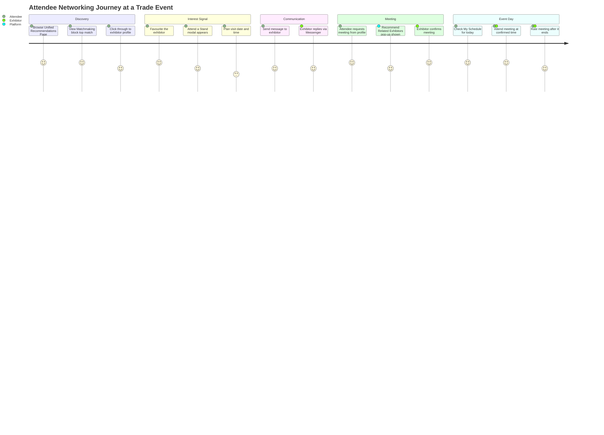
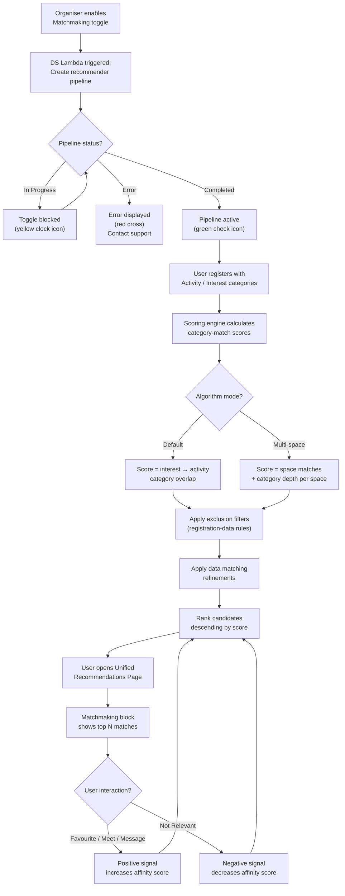
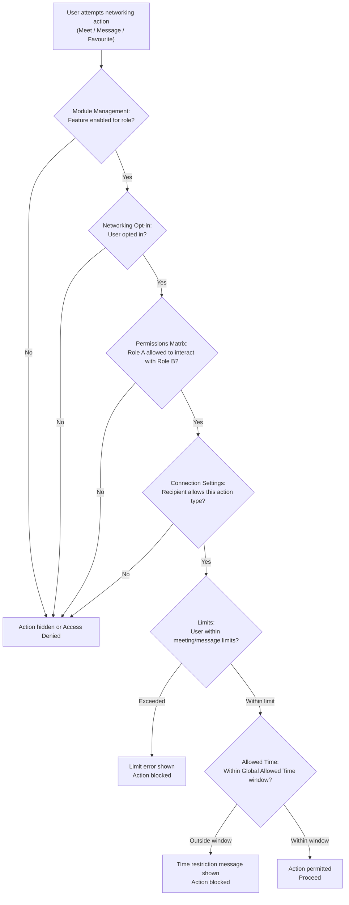

## 1. Product Overview

**Purpose.** Networking & Interactions is ExpoPlatform's core relationship-formation layer. It encompasses every mechanism by which participants discover one another, signal intent, communicate, schedule time together, and track their engagement — from the AI-driven matchmaking engine that scores and ranks recommendations, through real-time messaging and group chat, to the personal schedule that aggregates every commitment in a single calendar view.

**Problem being solved.** At a large trade event, the gap between "who you need to meet" and "who you actually meet" is enormous. Without intelligent discovery and frictionless interaction tools, attendees default to chance encounters; exhibitors waste booth time; and organisers have no measurable proof that their event created business value. Networking & Interactions closes this gap by surfacing the right people and content at the right moment, then making it trivially easy to act on that signal.

**Business value.**
- Matchmaking-driven recommendations increase the likelihood of commercially valuable meetings, directly improving exhibitor ROI.
- Favourites and Messaging lower the barrier to relationship formation between any participant types.
- My Schedule gives every user a single place to see their day, reducing no-shows and improving session attendance.
- Speed Networking compresses large volumes of introductions into a controlled, timed format — unlocking value from events that do not run a full Meeting Program.
- The organiser control layer (permission matrix, limits, exclusion filters, allowed times) lets each event be precisely tuned without custom code.
- The User Favourites Dashboard and matchmaking analytics give organisers measurable evidence of networking ROI they can share with exhibitors.

**Target users.** All participant types — Attendees/Visitors, Buyers, Exhibitors, Team Members, Speakers — as the primary consumers of networking features. Event Organisers and Admins as the configuration and oversight layer. Super Admins for global module management.

**User personas.**
- *Trade Show Visitor* — browses recommendations to find exhibitors that match their buying interests; uses Favourites as a shortlist; sends messages to shortlisted exhibitors; checks My Schedule each morning.
- *Exhibitor / Team Member* — receives meeting requests via inbox; manages which team members are available; uses group chat to coordinate internally; monitors the Attend a Stand list to see who plans to visit their booth.
- *Hosted Buyer* — relies on curated matchmaking to fill their pre-arranged meeting programme; uses Speed Networking to add opportunistic meetings.
- *Event Organiser* — configures matchmaking algorithm type and filters; sets global allowed meeting times; monitors the Favourites Dashboard to identify warm leads not yet converted to meetings; adjusts exclusion filters mid-event.
- *Super Admin / Platform Admin* — enables or disables networking modules per event; manages global product category trees used by all events.

**Success metrics.** Recommendation-to-meeting conversion rate; percentage of attendees with at least one confirmed meeting; number of messages exchanged per attendee; Favourites-to-meeting conversion tracked via the User Favourites Dashboard; Speed Networking session fill rate (checked-in participants vs. registered); matchmaking pipeline completion rate (green status within acceptable SLA).

> [!INFO] As of May 2026, Speed Networking, Meeting Program, Concierge Meetings, Round Tables, and Exhibitor Events are grouped under a new top-level **Meeting Formats** section in the admin panel. Self-managed meeting scheduling remains under Networking & Matchmaking → Meetings. The present document covers the matchmaking engine, recommendations, favourites, messaging, schedule, notifications, and organiser controls. Self-requested and specialised meeting formats are documented in the separate **Meetings & Matchmaking** product — see cross-references in §2 and §4.

---

## 2. Product Scope

### Included

- **Matchmaking engine** — Default Matchmaking algorithm (interest ↔ activity category scoring), Multi-space Matchmaking (space-weighted scoring), pipeline management, positive/negative interaction learning.
- **Product Categories** — global and local category trees, filters, max limits, multilingual support; the foundational data layer for all matchmaking.
- **Exclusion Filters** — registration-data-based exclusion rules between any two participant groups.
- **Data Matching** — additional refinement layer on top of category matching.
- **Unified Recommendations Page** — single frontend page combining people matches (matchmaking block) and object recommendations (exhibitors, products, sessions, news, groups, speakers, events).
- **Recommend Related Exhibitors** — post-meeting-request pop-up and schedule-page block; driven by Online RecSys pipeline.
- **Propagate Likes for Exhibitor Teams** — API-level like pooling across team members for improved exhibitor recommendation scores.
- **Favourites** — star-icon save action across all entity types; Favourite Action page; User Favourites Dashboard in admin.
- **Attend a Stand** — opt-in visit intention feature linked to Favourites.
- **Messaging** — 1-1 personal chat, group chat (user-created and organiser-created), conversation status filters, online indicator, message filters.
- **My Schedule** — personal calendar view covering meetings, sessions, and blocked time; date picker, switch view, download, team member selector, filters, external calendar sync.
- **Speed Networking** — organiser setup, participant check-in, automatic matchmaking pairing, proposal/relevance marking, meeting generation, public display, manual adjustment, frontend module, timeline, table view, notifications.
- **Networking Notifications** — in-app and mobile push for sessions, meetings, favourites, messages; meeting email notifications and reminders.
- **Organiser Networking Controls** — Basic matchmaking settings, Global Allowed Time, permissions matrix (which categories interact), meeting limits, message limits, sub/event module management (appointments, messages, favourites toggles), exhibitor connection settings, networking opt-in, privacy settings.
- **Networking Opt-in / Privacy Settings** — per-user controls over discoverability and reception of requests.

### Excluded

- **Self-managed meeting request flow** (visitor/exhibitor scheduling their own 1-1 meetings) — documented in Meetings & Matchmaking product.
- **Meeting Program** (structured 1:1 programme with timeslots, catalogues, voting, hosted buyers) — documented in Meetings & Matchmaking product; cross-reference EP-39145, EP-40448.
- **Concierge Meetings** (organiser-curated zone/table meetings) — Meetings & Matchmaking product.
- **Round Tables** — Meetings & Matchmaking product.
- **Exhibitor Events** — separate product.
- **Session management** (creating, scheduling sessions) — Sessions & Speakers product. My Schedule displays sessions but does not create them.
- **Email campaign builder** (email nurturing campaigns) — Marketing product; recommended exhibitor/product/session variables in emails are referenced here but built in Marketing.
- **Check-in / Badge scanning** — Onsite & Kiosk product; scanned contacts appear in the Favourites export but the scanning mechanism is out of scope here.
- **Payment and registration flows** — Transactions & Purchasing product.

---

## 3. User Roles

| Role | Networking capabilities | Key restrictions |
| --- | --- | --- |
| **Visitor / Participant** | View recommendations; favourite any entity; send/receive messages; request and confirm meetings (self-managed); add sessions and meetings to My Schedule; join Speed Networking; opt in/out of networking; set privacy | Cannot create group chats with non-favourited users; subject to meeting and message limits set by organiser |
| **Buyer (Hosted / General)** | Same as Visitor plus access to Meeting Program (see Meetings & Matchmaking product) | Hosted Buyers only visible to Sponsored Team Members in Meeting Program; General Buyers must consume Sponsored meeting allowance first |
| **Exhibitor (Company account)** | View recommendations; favourite entities; initiate messages (if toggle ON); manage team member connection settings; view Attend a Stand list; create/manage group chats including team members; access Exhibitor controls panel | Cannot initiate messages if "Allow exhibitors to initiate conversations" is OFF; if "Only Mutual Connection Interaction" is ON, both sides must have favourited first |
| **Team Member** | Same networking capabilities as Visitor within the exhibitor context; receive/send meetings if connection settings permit; view team schedule; participate in group chats | Meeting/message reception can be disabled by the exhibitor or organiser; cannot override exhibitor-set connection restrictions |
| **Speaker** | Same as Participant for networking; speaker profile visible in recommendations | Hiding Favourite button for Participants also hides it for Speakers (shared toggle in Module Management) |
| **Organiser (Event Admin)** | Full configuration access: enable/disable matchmaking, set algorithm type, configure categories, exclusion filters, allowed times, limits, module management, exhibitor controls; view User Favourites Dashboard; create group chats; schedule meetings on behalf of users from Favourites Dashboard | Organiser cannot personally participate in networking as a regular user within the same event context |
| **Super Admin** | Global module management: enable/disable networking modules across all events; manage global category database; access all organiser controls across all events | Changes to global categories affect all events using that category set |
| **Platform Admin (Data Science)** | Enable/disable Online RecSys pipeline; configure Propagate Likes parameter via API | No self-service toggle for RecSys in the organiser admin panel |

> [!INFO] The Networking opt-in setting and Privacy Settings allow individual participants and exhibitors to remove themselves from matchmaking and control who can initiate contact with them. These are user-level controls that sit beneath the organiser-level module management settings.

---

## 4. Feature Inventory

### 4.1 Matchmaking Engine — Default Matchmaking

**Description.** The Default Matchmaking algorithm scores and ranks potential connections between platform users by comparing interest categories against activity categories.

**Why it exists.** At large events with hundreds or thousands of attendees, manual discovery is impractical. The algorithm surfaces the highest-value connections automatically.

**User value.** Users see a ranked list of the people and companies most likely to be relevant to them, without needing to browse the entire marketplace.

**Functional logic.** Each user's interest categories are compared to other users' activity categories. A score is calculated based on the number of overlapping categories. The algorithm also incorporates behavioural signals: positive interactions (clicking a profile, Favouriting, requesting a meeting, messaging) increase affinity scores; negative interactions (ignoring in matches, clicking "Not Relevant") decrease them. The system learns over time from behaviour.

**Preconditions.** Enable Matchmaking toggle ON in admin; interest and activity category fields included in registration forms; matchmaking pipeline in "Completed" status (green check icon).

**Trigger conditions.** Pipeline runs automatically when the Enable Matchmaking toggle is turned ON. Scores update in near-real-time as interactions occur.

**Processing logic.** For a baseline user with N interest categories, each candidate's activity categories are compared. Score ≈ (matching category count / baseline interest count) × 100%. Behaviour modifiers (positive/negative interactions) are layered on top of the category score. Results are sorted by final score descending.

**Outputs.** Ranked list of recommended users and entities, surfaced on the Unified Recommendations Page (matchmaking block) and in the separate full-page view at `/newfront/profile/bm`.

**Dependencies.** Product categories (activity and interest); matchmaking pipeline (DS lambda); user registration data.

**Configurations.** Enable Matchmaking toggle; Enable Broader Networking Connections (allows connections beyond designated groups); About Me section mandatory completion per user type.

**Validation rules.** Pipeline must reach "Completed" status before recommendations are generated. Pipeline errors block further toggle changes until resolved.

**Permissions.** Organiser configures; all authenticated users benefit from recommendations.

**Error handling.** Pipeline Error status (red cross) displayed; admin instructed to contact support; no further toggle changes allowed until resolved.

**Edge cases.** If a user has no categories set, they receive no category-score-based matches but may still appear in other users' results. Turning OFF matchmaking triggers a DS lambda call to shut down resources (cost optimisation).

---

### 4.2 Matchmaking Engine — Multi-Space Matchmaking

**Description.** An alternative algorithm mode that adds a "spaces" layer to matching, grouping categories into named filters (spaces) and scoring both space-level match and category-level match within each space.

**Why it exists.** Some events (e.g., wine trade shows) have structured category hierarchies where matching within a dimension (grape variety, country, price range) is more meaningful than raw category overlap.

**User value.** More precise matches for events with structured multi-dimensional category trees.

**Functional logic.** Spaces are groups of categories defined as category filters. Matching considers two dimensions: (1) number of matching spaces, (2) completeness of category matches within those spaces. Ranking: User with 3 spaces and 7 category matches > User with 3 spaces and 3 category matches > User with 2 spaces.

**Preconditions.** Enable Multi-Space Matchmaking toggle ON (Admin Panel → Networking → Matchmaking). Category filters (spaces) defined in the category tree.

**Processing logic.** For each candidate user, calculate matching spaces count and per-space category overlap. Aggregate into a combined score. Sort descending.

**Configurations.** Enable via Multi-Space toggle; define spaces via category filters in the categories setup.

**Edge cases.** If no spaces are configured, multi-space behaves similarly to default. Users with 0/N space matches score zero (same as no categories in default mode).

---

### 4.3 Product Categories

**Description.** The hierarchical taxonomy that underpins all matchmaking and recommendations. Categories are classified as Activity Categories (what an entity does or is) or Interest Categories (what a user seeks).

**Why it exists.** Without a structured taxonomy, the matchmaking algorithm has nothing to compare. Categories are the raw data of the matching engine.

**User value.** Users select categories at registration; the platform uses them to find and rank relevant connections. Categories also power search filters on marketplace pages.

**Functional logic.** Global categories are defined at the platform level (Database → Categories). Local categories are the event-specific subset selected from the global tree. Categories are hierarchical (parent → child, multiple levels). Selectable parent category toggle: when ON, selecting a child auto-selects its parent. Bulk selection: selecting a parent auto-selects all children. The organiser defines category filters (spaces) as groups of categories for search page filtering.

**Preconditions.** Global categories must exist. Organiser must select local categories for the event. Activity/Interest Category fields must be added to registration pipelines.

**Configurations.** Max number of categories per exhibitor (profile, product, brand) and per visitor; selectable parent category toggle; My Filters; Import/Export via Excel template; multilingual (per-language translation via dropdown); drag-and-drop ordering for local categories (mirrors frontend order).

**Validation rules.** Category limits enforced at registration and profile update. Only global categories can be deleted (from Database → Categories); this is the only deletion location.

**Error handling.** If a registration section using a category filter is made inactive, the filter selector defaults to the Contact Details tab. Filters referencing hidden sections still function against the default tab.

---

### 4.4 Matchmaking Exclusion Filters

**Description.** Rule-based filters that prevent specific segments of users from being matched with each other, based on their answers to registration questions.

**Why it exists.** Some events have business rules that prohibit certain connections — domestic vs. international buyers, competitors in the same market, or participants from specific regions.

**User value.** Organiser confidence that the matchmaking output respects business constraints. Users do not see excluded matches, keeping recommendations clean.

**Functional logic.** Admin defines a filter: choose a "filter for" group + registration question answer + "apply filter to" group + registration question answer. Users meeting the "filter for" condition are never matched with users meeting the "apply filter to" condition. Applicable between: visitors-visitors, visitors-exhibitors, exhibitors-exhibitors.

**Preconditions.** Matchmaking enabled. Registration questions with defined answer options exist.

**Configurations.** Admin path: Networking & Matchmaking > Filters > Add New Filter. Filter name (internal reference only), group A, registration step A, answer values A, group B, registration step B, answer values B.

**Validation rules.** If the registration section used in a filter is hidden, the filter's selector defaults to Contact Details tab. Filters remain active even if registration is turned off.

**Edge cases.** Filters are bidirectional by default for the defined pair. Creating a filter does not affect already-existing confirmed meetings.

---

### 4.5 Data Matching

**Description.** An additional matching refinement layer that supplements product-category-based matching with structured registration data fields to further qualify or exclude matches.

**Why it exists.** Product categories alone may not capture all matching criteria relevant to an event. Data Matching allows structured field values (e.g., company size, geographic focus) to influence match scoring.

> [!WARN] The Confluence page for Data Matching (ID 1028489251) returned a different page in the API response. Detail in this section is reconstructed from context in the Matchmaking and Recommendations overview page. Verify against the actual admin panel at Networking & Matchmaking > Data Matching before publishing.

**Functional logic.** Works alongside category matching and exclusion filters to refine the result set. Configured at Networking & Matchmaking > Data Matching.

---

### 4.6 Unified Recommendations Page

**Description.** The single frontend page where users see all their personalised recommendations — people (matchmaking block), exhibitors, products, sessions, round tables, groups, news, events, and speakers — in one ranked, configurable view.

**Why it exists.** Prior to December 2024, separate Matchmaking and Recommendations pages fragmented the discovery experience. Unification reduces cognitive load and surfaces more value in fewer clicks.

**User value.** One destination to see every actionable recommendation; "Show all" buttons per section link to the relevant marketplace page with "Recommended for you" pre-applied.

**Functional logic.** Admin configures blocks (Networking & Matchmaking → Recommendations at `/admin/appointments/recommendation`). Each block has: Include toggle, block title (multilingual), Category multiselect (which user types see the block). Block order adjustable via drag-and-drop. The Matchmaking block links to the full matchmaking view at `/newfront/profile/bm`; Favourite or Not Relevant from that view advances the card queue.

**Preconditions.** Meetings module must be enabled in Module Management (dependency for Recommendations access). Individual blocks enabled via their Include toggles.

**Configurations.** Block order; block titles (per language); per-block category audience; Include toggles for each content type and sub-type (e.g., Sessions vs. Round Tables within the sessions block).

**Validation rules.** If Meetings module is disabled, Recommendations page returns Access Denied. All Include toggles default to the state of the corresponding old-page toggle; new blocks default OFF.

**Error handling.** Access Denied if Meetings module off — guide: enable Meetings under Module Management → Backend → Networking & Matchmaking.

**Edge cases.** Blocks with no matching data render empty (hidden gracefully). Permission matrix and networking opt-in status affect which profiles appear in the matchmaking block.

---

### 4.7 Recommend Related Exhibitors

**Description.** After a user initiates a meeting request, a pop-up displays up to 20 exhibitors similar to the one they just requested a meeting with. A "Recommended Exhibitors" block also appears on the user's schedule page.

**Why it exists.** A user who just booked a meeting is in a high-intent state. Surfacing related exhibitors at that moment maximises the chance of additional meeting conversions.

**User value.** Users discover exhibitors they might have missed during browsing, at the moment most likely to produce action.

**Functional logic.** Driven by the Online RecSys (real-time recommender system), not the standard category-based pipeline. Toggle "Recommend Related Exhibitors" at `/admin/appointments/recommendation` must be ON. The "Where to return user after meeting request" setting can be set to redirect to the Schedule page. Block and pop-up are not shown if "Allow Exhibitor to Exhibitor matchmaking" is OFF.

**Dependencies.** Online RecSys active (contact Data Science team to confirm pipeline is running).

**Configurations.** Enable toggle in admin; "Where to return user after meeting request" setting.

---

### 4.8 Propagate Likes for Exhibitor Teams

**Description.** An API-level parameter that pools all "like" signals from every team member under an exhibitor account into a single shared pool for recommendation scoring.

**Why it exists.** Exhibitors with multiple team members, some of whom are inactive, were being penalised in recommendation ranking because inactive members had zero likes, diluting the overall score.

**Functional logic.** Default (OFF): likes attributed per individual team member only. With propagation ON: all likes by any team member are pooled and shared, improving the exhibitor's aggregate recommendation score.

**Configurations.** API parameter only — no admin panel toggle. Requires coordination with API Manager to enable.

---

### 4.9 Favourites

**Description.** A bookmark-style save action (star icon) that allows users to save any entity (people, exhibitors, products, sessions, etc.) to their personal Favourites list for easy reference.

**Why it exists.** Users encounter more interesting profiles and content than they can act on immediately. Favourites creates a persistent shortlist that survives page navigation and session reload.

**User value.** Builds a personal pipeline of interesting connections; group chat requires favourited contacts; Attend a Stand is triggered by favouriting an exhibitor.

**Functional logic.** Clicking the star icon on any card adds the entity to the user's Favourites list. The icon state changes visually (before/after). Unfavouriting removes from the frontend list but retains the record in the User Favourites Dashboard. Favouriting a person triggers a notification to that person (if they are an exhibitor or scanned a badge).

**Dependencies.** Favourites module enabled in Module Management per role. Group chat creation requires favourited contacts.

**Outputs.** Favourites list in user profile; Favourites export via admin Data Import/Export (includes booth numbers, Admin column for filter-link attribution).

**Configurations.** Module Management per-role toggles (Exhibitors, Participants, Buyers, Team Members); hiding Participants also hides for Speakers.

**Edge cases.** Hiding the favourite button for a role also hides it for users of that role who are Speakers. Favourites export is async via SQS for stability (EP-1115). iOS booth number display was fixed (EP-1202).

---

### 4.10 Attend a Stand

**Description.** An opt-in feature where users record their intention to visit an exhibitor's physical stand, with a specific date and time, without creating a formal meeting.

**Why it exists.** Walk-up stand visits are difficult to plan for; exhibitors have no advance visibility into who will arrive. Attend a Stand gives exhibitors a predictive list and allows visitors to manage their floor-walking plan.

**Functional logic.** Triggered when a user favourites an exhibitor: a "Plan Visit" modal appears asking for date (event dates only, up to 10 future) and time (08:00-20:00 in 30-minute intervals). User can skip. Unfavouriting does NOT remove an existing planned visit. Re-favouriting re-opens the modal for edit. Visitor profile has an Attend a Stand tab (chronological list, edit/delete actions). Exhibitor profile has a read-only Attend a Stand tab. Also accessible from My Schedule / Team Schedule.

**Preconditions.** Module Management global toggle ON AND per-category toggle ON for the user's participant category.

**Error handling.** If either toggle is OFF, the feature is invisible; no modal appears even on favourite action.

**Edge cases.** Stand configuration (none/one/multiple stands) does not affect the feature. Mobile app access via webview.

---

### 4.11 Messaging

**Description.** Real-time text messaging between any two platform users (1-1 chat) and group conversations (group chat), both from the frontend and as organiser-created groups from the admin panel.

**Why it exists.** Meetings require both sides to commit time in advance. Messaging enables lighter-touch contact — to qualify interest, share information, or coordinate — without scheduling overhead.

**User value.** Instant async communication between any participant types; group chats allow multi-party discussions.

**Functional logic.**
- **1-1 Chat:** Visitors can always initiate with other visitors or exhibitors. Exhibitors can initiate only if "Allow exhibitors to initiate conversations" toggle is ON. Pop-up (from profile icon) and Messenger Widget (full inbox view) access modes. Online Indicator (green dot) shows live presence.
- **Group Chat (user-created):** Individual user creates a group from their favourited contacts. Only favourited users can be added (except exhibitors adding their own team members).
- **Group Chat (admin-created):** Networking & Matchmaking → Messaging → Group Chat → Create group chat → add name → search email → add participants → manage roles (admin/moderator) → create.
- **Automatic Group Chat for Exhibitors:** Toggle in Messaging Settings; if ON, an automatic group chat is created for each exhibitor including all their team members.
- **Conversation Status Filters (EP-20716):** Selector 1 — "Who initiated a chat": All / Initiated by me / Received. Selector 2 — "Personal chats by meeting": All / No meetings / Confirmed meeting / Incoming meeting / Pending meeting / Canceled meeting. Note: if autoconfirm is ON, Incoming and Pending options are hidden.

**Email templates.** New Message; Added to Chat; Removed from Chat; Disband Chat; Round table Confirmation.

**Configurations.** "Allow exhibitors to initiate conversations" toggle; "Automatic group chats for exhibitors with team members" toggle; message limits (per organiser configuration).

**Validation rules.** Only favourited users can be added to group chats (except exhibitor → own team members). Message limits enforced globally per organiser configuration.

**Error handling.** Messages module disabled → no Messages page, "Access denied" on direct link, all message buttons removed from cards/pages.

**Edge cases.** Individual message notifications do not fire per message — only once when the chat is first created. Message filter "Incoming/Pending meeting" options hidden if autoconfirm is ON.

---

### 4.12 My Schedule

**Description.** A personal calendar view aggregating all of the user's meetings, session bookings, blocked time, and other scheduled activities in a time-grid layout.

**Why it exists.** Users at events have multiple concurrent commitments across different platforms and need a single source of truth for their day.

**User value.** At-a-glance daily plan; eliminates double-booking; provides quick access to meeting details, session links, and blocked time management.

**Functional logic.** Default grid: 08:00–21:00. Dynamic adjustment: grid extends earlier if a meeting/session starts before 08:00; extends later if it ends after 21:00. Sub-features: Date Picker (multi-day events, improved logic EP-21730 — navigate all event days without "Additional dates" workaround), Switch View (list or grid), Interact with Cards (open meeting/session details, actions), Add Blocked Time (reserve time slots to prevent meeting requests, EP-677216474), Download Schedule (XLS export with additional fields EP-23548; includes state/county, company details), Team Member Selector (exhibitors only — view and manage schedule for individual team members), Filters (EP-708706342 — filter schedule by activity type), External Calendar Sync (Google Calendar, Outlook/iCal via .ics).

**Configurations.** "Do not show local time" toggle in admin (EP-23518, EP-24305): when ON, users see event timezone only, suppressing local time display. Default: OFF. Display inactive speakers on frontend toggle (EP-736067591). Show Company Name and Job Title on user cards (EP-23519, EP-24992).

**Edge cases.** Direct invite links now check availability before adding to schedule (EP-23542); users no longer able to overwrite existing activities via direct link. Schedule page includes "Recommended Exhibitors" block when Recommend Related Exhibitors is enabled.

---

### 4.13 Speed Networking

**Description.** A structured, time-boxed, rapid one-on-one meeting format where the matchmaking algorithm pairs checked-in participants into a pre-defined sequence of short meetings, without requiring a mobile app.

**Why it exists.** Not all events can run a full Meeting Program. Speed Networking delivers high-volume, algorithm-curated introductions in a compressed time window for live events.

**User value.** Participants meet multiple relevant contacts in a single session without manual scheduling. Organisers get a measurable networking output with minimal participant setup.

**Functional logic.**
- **Organiser Setup (EP-26344):** Configure location, time frame, total session duration, meeting count per person, break time between meetings.
- **Check-in (EP-26345):** Participants check in at entrance (general event check-in) AND separately check in to Speed Networking specifically.
- **Match Proposals (EP-26354):** During the check-in window, participants receive proposed matches in real time via the frontend module. They mark each proposed match as Relevant or Not Relevant.
- **Matchmaking & Meeting Generation (EP-26346):** After check-in closes, the MM algorithm pairs checked-in participants based on categories + relevance/non-relevance signals. Algorithm constraint: no same-company matches.
- **Manual Adjustment (EP-26351):** Organiser can review and manually adjust pairings before finalising.
- **Meeting Notifications (EP-26347):** Email on check-in (with frontend link); email on meeting finalisation (with meeting list); post-session email (summary of users met).
- **Frontend Module (EP-26352):** Participant accesses via email link; views current phase + countdown to next milestone, proposed matches during check-in, meeting list when generated, individual meeting details, post-session rating.
- **Dynamic Timeline (EP-26368):** Organiser view showing current phase, progress, and time to next step.
- **Public Display (EP-26349):** Simple web page displaying scheduled meetings on a large screen (airport board style), updated in real-time with names, surnames, and current/next meeting locations.
- **Table View (EP-26419):** Additional tab showing meetings grouped by table/location.

**Configurations.** Location, time frame, meeting count per person, break times; email templates for check-in and finalisation notifications.

**Edge cases.** Participants who check in late may receive fewer matches. Relevance/non-relevance signals from the proposal phase feed the matching algorithm before generation.

---

### 4.14 Networking Notifications

**Description.** In-app (web and mobile push) notifications confirming user actions and providing reminders across sessions, meetings, favourites, and messages.

**Why it exists.** Real-time confirmation and timely reminders drive engagement and prevent no-shows.

**Notification matrix.**

| Trigger | Recipient | Web notification | Mobile App notification |
| --- | --- | --- | --- |
| Session added to schedule | User | Session added to schedule | Session added to schedule |
| Session removed from schedule | User | Session removed from schedule | Session removed from schedule |
| Session starts in 10 minutes | User | "[Session name]" starts in 10 minutes | Reminder: Session starts in 10 minutes |
| Meeting request (online) | Receiver | Has requested a meeting at … regarding … between … and … | Same |
| Meeting confirmed | Initiator | Meeting confirmed | Meeting confirmed |
| Meeting reschedule request | Other party | Would like to reschedule/edit | Same |
| Meeting cancelled | Other party | Meeting was canceled. Reason: … | Same |
| Online meeting 10-min reminder | Both | Your online meeting room … is now available | Same |
| Online meeting started | Both | Your online meeting with … has started. Join Room | Same |
| Offline meeting 10-min reminder | Both | Reminder! Meeting with your participation at … regarding … starts in 10 minutes | Same |
| Rate your meeting | Both (after end) | Please rate your meeting | Same |
| Favourite (by exhibitor or badge scan) | Favourited user | [Name] has favourited your profile | Same |
| Message received | Receiver | Has sent you a message | Same |
| Exhibitor profile favourited | Exhibitor | [Name] has favourited your exhibitor profile | Same |
| Product favourited | Exhibitor | [Name] has favorited your product | Same |

**Items with no notification:** Favouriting a session in the mobile app; individual chat messages (notification fires once on chat creation only); offline meeting started.

---

### 4.15 Organiser Matchmaking Controls

**Description.** The full set of admin-panel settings that shape how networking operates for a given event.

**Sub-features.**

**Basic Matchmaking Settings.** Enable Matchmaking master toggle; pipeline status monitoring (In Progress / Error / Completed); About Me mandatory completion per user type; Enable Broader Networking Connections.

**Global Allowed Time.** Defines windows during which meeting scheduling is available. Admin path: Networking & Matchmaking → Meetings → Offline/Online Time Settings. Per-day multi-block support (e.g., 08:00–10:20 + 14:00–16:00 + 18:00–21:40). Apply to: specific day / current month / whole event. Time slot granularity set separately in Meetings → Settings tab.

**Permissions Matrix.** Defines which participant categories can interact with which other categories (meet, message, favourite). Located at Networking Controls → Permissions Matrix.

**Meeting Limits.** Maximum meeting counts per user/role. Located at Networking Controls → Meeting Limits.

**Message Limits.** Maximum message counts per user/role. Located at Networking Controls → Message Limits.

**Sub/Event Module Management.** Toggles for Appointments, Messages, My Favourites (per role), Open Access / Sign-in only. Located: Events Setup → Module Management → Frontend section.

**Exhibitor Controls.** Allow Exhibitors to Manage Reception of Meeting Requests and Messages (enables "Connections Settings" tab on exhibitor frontend); Allow Exhibitors to Manage Connection Settings of Team Members; Only Mutual Connection Interaction; Hide Exhibitors without Team Members; Disable Meetings and Messages without Team Members; Hide Exhibitor Matchmaking Information for Unauthenticated Users.

**Networking Opt-in.** Allows users to opt in/out of being surfaced in matchmaking and receiving networking requests.

**Privacy Settings.** Per-user controls over profile visibility and discoverability.

---

## 5. User Stories Mapping

| Story ID | Title | Summary | Acceptance criteria highlights | Related feature | Status |
| --- | --- | --- | --- | --- | --- |
| EP-5826 | Speed Networking (Epic) | Implement simplified Speed Networking for live events | Check-in, matchmaking pairing, notifications, frontend module | Speed Networking | COMPLETE |
| EP-26344 | Speed Networking — Organizer Setup (MVP) | Organiser configures session conditions | Location, time frame, meeting count, break times configurable | Speed Networking | COMPLETE |
| EP-26345 | Speed Networking — Participant Check-in (MVP) | Participant checks in at venue and at Speed Networking specifically | Separate check-in/check-out; Speed Networking-specific check-in option | Speed Networking | COMPLETE |
| EP-26346 | Speed Networking — Matchmaking and Meeting Organisation (MVP) | System pairs participants using MM algorithm | No same-company matches; incorporates relevant/not-relevant feedback | Speed Networking | COMPLETE |
| EP-26347 | Speed Networking — Meeting Notifications (MVP) | Email notifications on check-in and meeting finalization | On check-in: email with link; on finalisation: meeting list email; post-session: summary email | Speed Networking | COMPLETE |
| EP-26349 | Speed Networking — Public Meeting Display (MVP) | Airport board screen showing meetings in real-time | Simple web page; real-time updates; names, surnames, location | Speed Networking | COMPLETE |
| EP-26351 | Speed Networking — Manual Adjustment (MVP) | Organiser can manually adjust pairings before finalising | Edit mode for adjusting pairs; save before generation | Speed Networking | COMPLETE |
| EP-26352 | Speed Networking — Frontend Module (MVP) | Participant UI via email link | Shows phase/countdown, proposed matches, meeting list, meeting details, post-session rating | Speed Networking | COMPLETE |
| EP-26354 | Speed Networking — Matchmaking Proposal (MVP) | Send users proposed matches; users mark relevant/not relevant | Real-time match proposals during check-in window; system records responses for algorithm | Speed Networking | COMPLETE |
| EP-26368 | Speed Networking — Dynamic Timeline (MVP) | Organiser timeline view of session progress | Timeline corresponds to configured steps; dynamic progress; countdown to next step | Speed Networking | COMPLETE |
| EP-26419 | Speed Networking — Table View (MVP) | Tab showing generated meetings by table | Tab displays meetings grouped by table/location | Speed Networking | COMPLETE |
| EP-24854 | Combining Personalized Matchmaking and Recommendations (Epic) | Unify matchmaking and recommendations into single experience | Seamless unified page for matches + recommendations | Unified Recommendations Page | COMPLETE |
| EP-27246 | Unified Recommendations Page | Remove separate matchmaking toggles; implement unified page | Remove old Matchmaking toggles for Participants/Buyers/TMs; new unified page with all blocks | Unified Recommendations Page | COMPLETE |
| EP-1115 | Favourites export rework | Move Favourites export to SQS for stability | Quicker and more stable export via SQS | Favourites | COMPLETE |
| EP-1202 | Favourite List — Booth Numbers on iOS | Booth numbers not showing in iOS favourite list | iOS shows booth numbers in Favourites list same as Android | Favourites | COMPLETE |
| EP-13046 | Able to add team members to group chat | Exhibitor admin can add team members to group chat | Team member selector available in group chat creation | Messaging | COMPLETE |
| EP-20716 | New filters for Messenger | Add conversation status filters to Messenger | Who initiated (All/By me/Received); Personal chats by meeting status | Messaging | COMPLETE |
| EP-21405 | Schedule list view | Add list view option to schedule page | List view toggle on schedule page | My Schedule | COMPLETE |
| EP-21730 | Improve logic of date selector on Schedule page | Navigate all event days without "Additional dates" workaround | All available event days browsable; no Additional dates friction | My Schedule | COMPLETE |
| EP-23518 | No local time option (Web) | Toggle to suppress local time on schedule view | "Do not show local time" toggle in admin; when ON, only event timezone shown | My Schedule | COMPLETE |
| EP-24305 | No local time option (App) | Same as EP-23518 for mobile app | Same behaviour in mobile app | My Schedule | COMPLETE |
| EP-23519 | Enhancing User Card with Company Name and Job Title (Web) | Show company name and job title on all user cards | Consistent display on all user cards (web) | My Schedule / Matchmaking | COMPLETE |
| EP-24992 | Enhancing User Card with Company Name and Job Title (App) | Same as EP-23519 for app | Consistent display on all user cards (app) | My Schedule / Matchmaking | COMPLETE |
| EP-23542 | Direct links checking | Check availability before adding activity via direct invite link | System checks availability on direct invite link; no overwrite of existing activity | My Schedule | COMPLETE |
| EP-23548 | Additional fields for Download Schedule in XLS | Add state/county and other fields to schedule XLS export | State/county of exhibitor included in schedule download | My Schedule | COMPLETE |
| EP-24925 | Viewing Daily Schedule on Meeting Creation Page | Show daily schedule pop-up on meeting request page | Schedule pop-up accessible from meeting request page to check availability | My Schedule / Meetings | COMPLETE |
| EP-27719 | My/Team Schedule drawer in meeting request page | Schedule button and drawer on meeting request page | Schedule drawer opens inline from meeting request page | My Schedule / Meetings | COMPLETE |
| EP-27225 | Matchmaking Sorting on all marketplace and delegates pages | Apply MM sort order to marketplace listing pages | MM-based sort available on Exhibitors, Products, Pavilions, Delegates, Speakers, Buyers pages | Matchmaking | COMPLETE |
| EP-13587 | Capture data for recommendation evaluations | Capture interaction data for recommendation quality measurement | Data captured per DS spec; stored for model evaluation | Matchmaking / RecSys | COMPLETE |
| EP-14458 | Recommended exhibitors variable redesign | Redesign recommended exhibitors variable in email builder | New block adapted to all mail clients including Outlook | Recommendations / Email | COMPLETE |
| EP-14844 | Recommended Products variable redesign | Upgrade Recommended Products email variable | Upgraded variable works correctly in email builder | Recommendations / Email | COMPLETE |
| EP-14845 | Recommended Sessions variable redesign | Upgrade Recommended Sessions email variable | Upgraded variable works correctly | Recommendations / Email | COMPLETE |
| EP-14846 | Recommended News variable redesign | Upgrade Recommended News email variable | Upgraded variable works correctly | Recommendations / Email | COMPLETE |
| EP-12037 | Chat header fixed on web | Minimise chats to small tabs on web | Chat can be minimised to tab; user can check content while chatting | Messaging | COMPLETE |
| EP-12279 | Mobile App — Replace Matchmaking Information Wording | Rename "Matchmaking information" to "Profile Information" on mobile | Label changed on public profiles in mobile app | Matchmaking | COMPLETE |
| EP-1107 | Chat-bot for New UI | Rework chat-bot widget as single script for old and new UI | Widget works on both old and new UI as separate component | Messaging | COMPLETE |
| EP-8201 | Settings to show/hide elements in Scan lists in app | Show/hide exhibitor logo and category/role in scan lists | Two toggles in admin (off by default); apply to both scanned badges and Scanned Me lists | Networking Controls | QA Tested |
| EP-20661 | Campaigns refresh (2nd iteration) | Refresh networking campaigns UI | Redesigned campaigns interface per Figma spec | Messaging / Campaigns | COMPLETE |
| EP-46020 | Recreate category-based Recommendation Service (Epic) | Rebuild RS using LLM embeddings and vector distances | Near-real-time changes (up to 2s for user changes, up to 10s for category tree changes); strict matching; blocking selected categories; SOA | Matchmaking Engine | In Progress |
| EP-46140 | Improve Speed Networking Service (Epic) | Service-level improvements to Speed Networking | Details TBD | Speed Networking | In Progress |
| EP-50226 | Data Science configuration (Epic) | Configure DS services (Recommender, Speed Networking, Round Table, ClickHouse, DS Postgres) | Operational configuration complete | Matchmaking / Speed Networking | COMPLETE |
| EP-39145 | Hyve Meeting Program (Epic) | Meeting program for Hyve events | Full meeting program with timeslots, catalogue, voting | Meetings & Matchmaking (cross-ref) | COMPLETE |
| EP-40448 | MP — FE Meeting Timeslot Blocking | Timeslot blocking for meeting program participants | Buyers available for all 16 timeslots; Sponsored TMs encouraged; logic enforced | Meetings & Matchmaking (cross-ref) | COMPLETE |

---

## 6. End-to-End Workflows

### 6.1 User Journey — Attendee Discovering and Connecting with an Exhibitor

### 6.2 System Workflow — Matchmaking Pipeline and Recommendation Delivery

### 6.3 Happy Path — Speed Networking Session

1. Organiser creates Speed Networking session: location, duration, meetings per person, break times.
2. Participants arrive at venue; staff checks them in to the event and then to Speed Networking specifically.
3. Check-in window opens: participants receive proposed match cards in the frontend module via email link; mark each as Relevant or Not Relevant.
4. Check-in window closes: MM algorithm generates meeting pairs (no same-company; incorporates relevance signals).
5. Organiser reviews generated pairings in admin; optionally makes manual adjustments.
6. Meeting list finalised; participants receive email with their meeting schedule.
7. Sessions run: participants rotate through meetings at assigned tables per timer/bell.
8. Public display board (airport-style) updates in real time showing current and next meetings.
9. After session ends: participants receive summary email with details of everyone they met.
10. Participants rate the session via the frontend module.

### 6.4 Alternate Paths

- **User has no categories set:** Receives no category-score-based matches. May still appear as results for others if those others have interest categories matching the user's activity categories. Admin should ensure registration pipeline includes category fields.
- **Matchmaking pipeline errors:** Toggle blocked; organiser contacts support. Existing displayed recommendations continue showing stale data until pipeline recovers.
- **Exhibitor disables team member connections mid-event:** Existing confirmed meetings and active chats are not cancelled; new meeting requests and messages are blocked for the restricted team members.
- **User clicks direct invite link:** System checks availability first; if slot already occupied, user is notified rather than overwriting (EP-23542).

### 6.5 Exception Paths

- **Pipeline never reaches Completed:** Organiser cannot use matchmaking. No recommendations shown. Must contact Data Science team.
- **Recommend Related Exhibitors shows no results:** Online RecSys pipeline may be inactive. Data Science team must confirm pipeline is running.
- **Speed Networking: no participants check in:** Algorithm has no pool to pair. Session generates zero meetings; public display remains empty.
- **Message limits exhausted:** User's "Start a chat" button becomes disabled. They can still receive messages until the recipient's limit is also reached.

### 6.6 Recovery Paths

- **Restore errored matchmaking pipeline:** Contact support; do not retry toggle repeatedly. Once fixed, pipeline will return to Completed status and recommendations regenerate.
- **User accidentally marked "Not Relevant":** Score impact is gradual; the user can favourite or request a meeting with the marked contact to reverse the signal. There is no direct "undo Not Relevant" UI.
- **Incorrect exclusion filter created:** Edit or delete the filter at Networking & Matchmaking > Filters. Changes take effect on next recommendation query; existing meetings are unaffected.

---

## 7. Business Rules Engine

| Rule | Condition | Exception / Priority | Conflict resolution |
| --- | --- | --- | --- |
| Matchmaking requires Meetings module | Recommendations page returns Access Denied if Meetings module is disabled in Module Management | No exception | Enable Meetings under Module Management → Backend → Networking & Matchmaking |
| Matchmaking toggle blocks during pipeline processing | When Enable Matchmaking is toggled, the toggle is locked until pipeline status reaches Completed or Error | Error state also blocks further changes | Contact support to resolve Error; no self-recovery |
| Autoconfirm overrides category-level autoconfirm | General autoconfirm setting at /admin/appointments takes precedence over per-category autoconfirm | No exception | General setting is the master; per-category only applies when general is OFF |
| Exclusion filters are bidirectional | A filter between Group A (condition X) and Group B (condition Y) prevents A from appearing in B's recommendations AND B from appearing in A's | No exception | Cannot create a one-directional exclusion filter via this mechanism |
| Exhibitor Connections Settings mutually exclusive | "Allow exhibitors to manage connection settings of TMs" and "Allow team members to manage reception" cannot both be ON | "Allow exhibitors to manage TM connection settings" takes precedence; the TM setting is disabled with tooltip when exhibitor setting is ON | Organiser must choose which delegation model to use |
| Disabling connections does not cancel existing meetings | Switching OFF connections for a TM or exhibitor does not cancel confirmed meetings or delete existing chats | | Admin must manually cancel affected meetings if cancellation is desired |
| Favourites removal does not remove Attend a Stand | Unfavouriting an exhibitor does not delete the planned visit recorded via Attend a Stand | | User must explicitly delete the visit from the Attend a Stand tab |
| Group chat requires favourited contacts | Only favourited users can be added to a user-created group chat | Exhibitors can add their own team members regardless of favourite status | Admin-created group chats bypass this restriction |
| Recommendations not shown to exhibitors for exhibitor matching | "Recommended Exhibitors" block and pop-up not shown if "Allow Exhibitor to Exhibitor matchmaking" is OFF | | Enable the exhibitor-exhibitor matchmaking toggle to show these recommendations to exhibitor users |
| Speed Networking same-company exclusion | Algorithm never pairs two participants from the same company | No override in the automatic algorithm; manual adjustment by organiser post-generation is the only workaround | Use manual adjustment feature |
| Local time suppression | "Do not show local time" toggle when ON suppresses local time across all schedule views | Default OFF | Event timezone is always shown regardless of this setting |
| Propagation requires API access | Like propagation for exhibitor teams cannot be enabled via admin panel | Must be requested via API Manager | No self-service alternative |

---

## 8. Data Model

### 8.1 Entity-Relationship Diagram

```mermaid
erDiagram
    USER {
        int id
        string email
        string role
        bool networking_opt_in
        bool allow_meetings
        bool allow_messages
    }
    PARTICIPANT_CATEGORY {
        int id
        string name
        bool matchmaking_mandatory
        bool autoconfirm
        bool attend_stand_enabled
    }
    PRODUCT_CATEGORY {
        int id
        string name
        int parent_id
        bool is_global
        string language
    }
    USER_CATEGORY_TAG {
        int user_id
        int category_id
        string type
    }
    MATCHMAKING_SCORE {
        int baseline_user_id
        int candidate_user_id
        float score
        datetime last_updated
    }
    FAVOURITE_ACTION {
        int id
        int from_user_id
        int to_entity_id
        string to_entity_type
        datetime created_at
        bool is_active
        string admin_ref
    }
    ATTEND_STAND {
        int id
        int visitor_user_id
        int exhibitor_id
        date visit_date
        time visit_time
        datetime created_at
    }
    CONVERSATION {
        int id
        string type
        datetime created_at
    }
    MESSAGE {
        int id
        int conversation_id
        int sender_id
        text body
        datetime sent_at
    }
    CONVERSATION_PARTICIPANT {
        int conversation_id
        int user_id
        string role
    }
    SCHEDULE_ITEM {
        int id
        int user_id
        string item_type
        int item_ref_id
        datetime start_time
        datetime end_time
        bool is_blocked
    }
    EXCLUSION_FILTER {
        int id
        string name
        string group_a
        string reg_field_a
        string answer_a
        string group_b
        string reg_field_b
        string answer_b
    }
    SPEED_NETWORKING_SESSION {
        int id
        string location
        datetime start_time
        datetime end_time
        int meetings_per_person
        int break_minutes
    }
    SPEED_NETWORKING_MEETING {
        int id
        int session_id
        int user_a_id
        int user_b_id
        int table_id
        datetime slot_start
    }

    USER ||--o{ USER_CATEGORY_TAG : "tagged with"
    PRODUCT_CATEGORY ||--o{ USER_CATEGORY_TAG : "applied to"
    PRODUCT_CATEGORY ||--o{ PRODUCT_CATEGORY : "parent of"
    USER ||--o{ MATCHMAKING_SCORE : "baseline"
    USER ||--o{ MATCHMAKING_SCORE : "candidate"
    USER ||--o{ FAVOURITE_ACTION : "creates"
    USER ||--o{ ATTEND_STAND : "plans"
    USER ||--o{ CONVERSATION_PARTICIPANT : "participates in"
    CONVERSATION ||--o{ CONVERSATION_PARTICIPANT : "has"
    CONVERSATION ||--o{ MESSAGE : "contains"
    USER ||--o{ SCHEDULE_ITEM : "owns"
    SPEED_NETWORKING_SESSION ||--o{ SPEED_NETWORKING_MEETING : "generates"
    USER ||--o{ SPEED_NETWORKING_MEETING : "assigned to"
    USER ||--o{ USER : "matched via MATCHMAKING_SCORE"
```

### 8.2 Key Data Objects

**USER_CATEGORY_TAG.type** — `"activity"` or `"interest"`. This field determines which side of the matching equation the tag is on.

**MATCHMAKING_SCORE** — recalculated by the DS pipeline on category changes (up to 10 seconds for category tree changes, up to 2 seconds for user category changes, per EP-46020 requirements). Score range 0–100%.

**FAVOURITE_ACTION.admin_ref** — set when the favourite action originates from a "Copy link to applied filters" URL shared by an admin; used to populate the Admin column in the User Favourites Dashboard.

**SCHEDULE_ITEM.item_type** — `"meeting"`, `"session"`, `"blocked_time"`, `"attend_stand"`.

### 8.3 Lifecycle States — Recommendation/Favourite Connection State

```mermaid
stateDiagram-v2
    [*] --> Unseen : User has not yet encountered this profile
    Unseen --> Viewed : User clicks on profile card
    Viewed --> Relevant : User clicks Favourite or Meet or Message
    Viewed --> NotRelevant : User clicks Not Relevant
    Relevant --> Favourited : User clicks star icon
    Favourited --> Unfavourited : User removes favourite
    Unfavourited --> Favourited : User re-favourites
    Relevant --> MeetingPending : User sends meeting request
    MeetingPending --> MeetingConfirmed : Other party confirms
    MeetingPending --> MeetingCancelled : Either party cancels
    MeetingConfirmed --> MeetingRated : Both parties rate after session
    MeetingConfirmed --> MeetingCancelled : Either party cancels
    MeetingCancelled --> [*]
    MeetingRated --> [*]
    NotRelevant --> Viewed : Score updated; profile may resurface at lower rank
```

---

## 9. Permissions Matrix

### 9.1 Role × Capability Table

| Capability | Visitor / Participant | Buyer | Exhibitor (Company) | Team Member | Speaker | Organiser / Admin | Super Admin |
| --- | --- | --- | --- | --- | --- | --- | --- |
| View matchmaking recommendations | Yes | Yes | Yes (if E↔E enabled) | Yes (if E↔E enabled) | Yes | No (config only) | Yes |
| Mark Not Relevant | Yes | Yes | Yes | Yes | Yes | No | No |
| Favourite any entity | Yes (if module ON) | Yes | Yes | Yes | Yes | Yes | Yes |
| Send 1-1 message (initiate) | Yes | Yes | Config toggle | Config toggle | Yes | Yes | Yes |
| Receive messages | Yes | Yes | Yes | Config toggle | Yes | Yes | Yes |
| Create group chat | Yes (favourited only) | Yes | Yes (+ own TMs) | Yes | Yes | Yes | Yes |
| Book self-managed meeting (request) | Yes | Yes | Config | Config | Yes | Via Dashboard | Yes |
| Confirm / reschedule meeting | Yes | Yes | Yes | Config | Yes | Yes | Yes |
| Cancel meeting | Yes | Yes | Yes | Yes | Yes | Yes | Yes |
| View My Schedule | Yes | Yes | Yes (Team Schedule) | Yes | Yes | Yes | Yes |
| Download Schedule (XLS) | Yes | Yes | Yes | Yes | Yes | Yes | Yes |
| Add Blocked Time | Yes | Yes | Yes | Yes | Yes | Yes | Yes |
| Attend a Stand (plan visit) | Yes (if module + category ON) | Config | No | No | No | No | No |
| View Attend a Stand (exhibitor) | No | No | Yes (read-only) | No | No | Yes | Yes |
| Speed Networking check-in | Yes | Yes | Config | Config | Yes | Can manage | Yes |
| Configure matchmaking settings | No | No | No | No | No | Yes | Yes |
| View User Favourites Dashboard | No | No | No | No | No | Yes | Yes |
| Enable/disable networking modules | No | No | No | No | No | Yes (own event) | Yes (all events) |
| Manage exclusion filters | No | No | No | No | No | Yes | Yes |
| Propagate Likes (exhibitor) | No | No | Via API Manager | No | No | No | Yes (via API) |

### 9.2 Permission Flow

---

## 10. Integrations

| Integration | Purpose | Trigger | Data exchanged | Failure handling | Retry | Security |
| --- | --- | --- | --- | --- | --- | --- |
| **DS Lambda / RecSys Pipeline** | Execute matchmaking scoring and recommendation generation | Enable Matchmaking toggle ON/OFF | Category data, user interaction signals, scores | Pipeline Error status displayed; no further toggle changes; contact support | Manual: organiser contacts support to re-trigger | Internal platform; no external authentication required |
| **Online RecSys (Recommend Related Exhibitors)** | Real-time exhibitor recommendations post meeting-request | User confirms meeting request | User interaction history, exhibitor categories, similarity scores | Block/pop-up silently hidden if RecSys inactive | Contact Data Science team | Internal service; requires Data Science team to confirm running |
| **External Calendar (Google Calendar / Outlook / iCal)** | Export user schedule as .ics for external calendar sync | User clicks "Sync to Calendar" on Schedule page | Meeting and session details (title, time, location, link) as .ics events | Export fails gracefully; user can retry | Manual re-export | Generates standard .ics file; no OAuth to external calendar in base configuration |
| **SQS (Async Export Pipeline)** | Stable large-volume data export for Favourites and other reports | Export triggered by admin from Data Import/Export | Favourites data, booth numbers, admin attribution | Queue-based; export completes asynchronously even for large datasets | Automatic via SQS queue | Internal AWS SQS; standard platform security |
| **Email Sender (Meeting & Networking Notifications)** | Deliver meeting request, confirmation, reminder, rating, and Speed Networking emails | Meeting actions, schedule events, timer-based reminders | Meeting details, participant details, links, template variables | Failed delivery logged; admin can check email server status; resend manually from management dashboard | Configured per template; daily digest for ratings at 14:30 GMT | Standard platform email infrastructure; SPF/DKIM per event domain |
| **Mobile App Push Notifications** | In-app push for session/meeting/favourite/message events | Same triggers as web notifications | Notification text and deep link | Push silently dropped if device offline; no retry for individual messages | N/A (fire-and-forget) | Standard mobile push (APNs/FCM) |
| **API (Participant Import / Export)** | Bulk import of connection settings, category tags; export of favourites, meetings | Admin Data Import/Export; API calls | allow_meetings, allow_messages fields; category IDs; favourite records | Import errors surfaced in admin UI | Manual re-import | Platform API authentication (API key / OAuth per event) |
| **Platform API v2 — Propagate Likes** | Enable like propagation across exhibitor team members | API call by API Manager | API parameter: propagate_likes boolean per exhibitor | Not configurable via admin panel; errors visible in API response | Retry via API Manager | API key authentication |

---

## 11. Notifications

### 11.1 In-App and Push Notifications

> [!INFO] In-app notifications appear as banners in the web UI and push notifications appear on the mobile device. Both fire from the same trigger; the distinction is delivery channel.

| Event | Channel | Timing | Recipients |
| --- | --- | --- | --- |
| Session added to schedule | Web + App | Immediate | Actor (confirmation) |
| Session removed from schedule | Web + App | Immediate | Actor (confirmation) |
| Session starts in 10 minutes | Web + App | 10 min before start | All users who added the session |
| Incoming meeting request (online) | Web + App | Immediate | Receiver |
| Meeting confirmed | Web + App | Immediate | Initiator |
| Meeting reschedule request | Web + App | Immediate | Non-rescheduling party |
| Meeting cancelled | Web + App | Immediate | Non-cancelling party |
| Online meeting starts in 10 minutes | Web + App | 10 min before | Both parties |
| Online meeting started | Web + App | At start time | Both parties (if not joined) |
| Offline meeting starts in 10 minutes | Web + App | 10 min before | Both parties |
| Meeting rating request | Web + App | After meeting end | Both parties |
| Profile favourited | Web + App | Immediate | Favourited user |
| New message received | Web + App | On chat creation (first message only) | Receiver |

**No notifications fire for:** Individual messages in ongoing conversations; favouriting a session in the mobile app; offline meeting started.

### 11.2 Email Notifications

| Template | Trigger | Recipient | Key variables |
| --- | --- | --- | --- |
| Incoming Meeting | New meeting request | Receiver | Receiver Name, Meeting Subject, Message, Date/Time (event timezone), Location, Appointment URL, Initiator Details |
| Accepted (receiver) | Receiver confirms meeting | Initiator + additional participants | Receiver Name, Appointment details |
| Reschedule (receiver) | Initiator reschedules | Receiver | New date/time, subject |
| Cancelled (receiver) | Initiator cancels | Receiver | Cancellation reason |
| Online Meeting Reminder | 10 min before confirmed online meeting | Both parties | Meeting room URL |
| Online Meeting Started | Meeting started; other party not joined | Non-joined party | Join Room link |
| Meeting Expired | Meeting request expires (if Auto Expire toggle ON) | Both parties | Meeting details |
| Meeting Cancelled by Admin | Organiser cancels meeting | Both parties | admin_name, admin_email |
| Reassign Team Member | TM reassigned in meeting | Assigned, unassigned, unchanged users on all sides | Reassignment details |
| Meeting Ratings (daily) | Daily at 14:30 GMT | Users with unrated confirmed meetings | List of meetings to rate, rate links |
| Meeting Ratings (after event) | Event end date | All users with unrated confirmed meetings | CTA to rating page (if > 5 meetings) |
| New Message | New chat initiated | Receiver | Sender name, message preview |
| Added to Chat | Participant added to group chat | Added participant | Group chat name, link |
| Removed from Chat | Participant removed from group chat | Removed participant | Group chat name |
| Disband Chat | Group chat deleted | All participants | Group chat name |
| Speed Networking — Check-in | Participant checks in to Speed Networking | Checked-in participant | Frontend module link |
| Speed Networking — Meeting Finalized | Meetings generated and finalised | All checked-in participants | Meeting schedule link |
| Speed Networking — Post-Session | Session ends | All participants | Summary of users met |

### 11.3 Custom Reminders

Organisers can configure additional meeting reminder emails at Networking & Matchmaking → Meetings → Reminders. Timing, template, and delivery channels (Email, SMS, WhatsApp, Web/App notification) are configurable per reminder rule.

Required Confirmed Meeting Reminders: organisers can send reminders to users who have not yet reached a required number of confirmed meetings (frequency, start date, and template configurable). A final email fires when the required count is reached.

---

## 12. Reporting & Analytics

| Report / View | Inputs | Metrics | Filters / Groupings | Export options |
| --- | --- | --- | --- | --- |
| **User Favourites Dashboard** (admin) | Favourite actions across all user types | Favourited By, Favourited User, Time & Date, Meeting Status (Confirmed/Unconfirmed/Canceled/No meetings), Notes, Admin attribution | Search by username, company, email; date range; meeting status | Favourites export (XLS) via Data Import/Export; includes Admin column; async via SQS |
| **Favourites Analytics** (Organiser Analytics — General Dashboard) | Total favourite count | Total Favourites tile | Event selector | No direct export from dashboard tile |
| **Messages Analytics** (Organiser Analytics) | Total conversation initiations | Total Conversations tile | Event selector | Messages export via Data Import/Export |
| **Meetings Analytics** (Organiser Analytics) | Meeting records | Confirmed / Pending / Cancelled totals | Event selector | Meetings export (XLS) via Data Import/Export; meetings export API `/api/v2/meetings/export` with last-modified date filter |
| **Speed Networking Session Report** | Checked-in participants, generated meetings, meeting completion, post-session ratings | Check-in rate, matches generated, meetings per participant, rating scores | Per session | Not directly exposed — data available via admin panel and post-session email |
| **Matchmaking Sorting** (marketplace pages) | MM scores per user-entity pair | Relative match rank | Exhibitors, Products, Pavilions, Delegates, Speakers, Buyers pages | N/A — display ordering only |
| **Recommendation Data Capture** (EP-13587) | User click events, interactions with recommendations | Click-through rates, favourite/meeting conversion from recommendation | Per user, per session | Data stored in DS database; accessed by Data Science team |

> [!WARN] The Speed Networking session report and recommendation evaluation data are not directly accessible to organiser admins via the standard admin panel. Data Science team access is required for detailed recommendation model performance metrics.

---

## 13. Configuration Guide

| Setting | Effect | Default | Who can set | Admin path |
| --- | --- | --- | --- | --- |
| Enable Matchmaking | Activates matchmaking pipeline and recommendations engine | OFF | Organiser / Super Admin | Networking & Matchmaking → Matchmaking |
| Enable Multi-Space Matchmaking | Switches algorithm to space-weighted scoring mode | OFF | Organiser / Super Admin | Networking & Matchmaking → Matchmaking |
| Enable Broader Networking Connections | Allows users to connect beyond their designated participant groups | OFF | Organiser / Super Admin | Networking & Matchmaking → Matchmaking → Basic Settings |
| About Me mandatory (per user type) | Forces completion of About Me field before profile access | OFF | Organiser / Super Admin | Networking & Matchmaking → Matchmaking → Basic Settings |
| Recommend Related Exhibitors | Shows related exhibitor pop-up and schedule block post-meeting-request | OFF | Organiser | /admin/appointments/recommendation |
| Where to return after meeting request | Redirect destination after meeting request submitted | Default | Organiser | /admin/appointments/recommendation |
| Global Allowed Time (offline) | Time windows when offline meeting scheduling is available | Not set | Organiser | /admin/appointments/offlineTimeSettings |
| Global Allowed Time (online) | Time windows when online meeting scheduling is available | Not set | Organiser | /admin/appointments/onlineTimeSettings |
| Meetings autoconfirm | All Pending/Incoming meetings auto-confirm; Pending/Incoming statuses hidden | OFF | Organiser | /admin/appointments |
| Meetings autoconfirm (per category) | Auto-confirm only for meetings initiated by this category | OFF | Organiser | Registration → Categories → Category settings |
| Allow exhibitors to initiate conversations | Exhibitors can start 1-1 chats without waiting for visitor | OFF | Organiser | Networking & Matchmaking → Messaging → Settings |
| Automatic group chats for exhibitors with TMs | Auto-creates group chat per exhibitor including all team members | OFF | Organiser | Networking & Matchmaking → Messaging → Settings |
| Allow exhibitors to manage TM reception | Exhibitor "Connections Settings" tab appears on frontend | OFF | Organiser | Admin → Registration → Exhibitor Registrations → Additional Settings |
| Allow TMs to manage reception | Individual TM can control own meeting/message reception | OFF | Organiser | Admin → Registration → Exhibitor Registrations → Additional Settings |
| Appointments module (frontend) | Show/hide meetings features and buttons for all roles | ON | Organiser / Super Admin | Events Setup → Module Management → Frontend |
| Messages module (frontend) | Show/hide messaging features and buttons for all roles | ON | Organiser / Super Admin | Events Setup → Module Management → Frontend |
| My Favourites (per role) | Show/hide favourite feature per role | ON per role | Organiser / Super Admin | Events Setup → Module Management → Frontend |
| Open access / Sign-in only | Unauthenticated access to profile pages | Open access | Organiser / Super Admin | Events Setup → Module Management → Frontend |
| Attend a Stand (global toggle) | Enables Attend a Stand feature platform-wide for the event | OFF | Organiser / Super Admin | Events Setup → Module Management |
| Attend a Stand (per category) | Enables Attend a Stand for specific participant category | OFF | Organiser | Registration → Categories → Category settings |
| Do not show local time | Suppresses local timezone display on schedule; shows only event timezone | OFF | Organiser | /admin/appointments |
| Selectable parent category | Selecting child category auto-selects parent | OFF | Organiser / Super Admin | Networking & Matchmaking → Categories |
| Max categories (visitor/exhibitor/product) | Limits number of categories selectable during registration/profile | Platform default | Organiser | Networking & Matchmaking → Categories → Max Number |
| Exclusion filters | Prevent specific user segments from matching | None | Organiser | Networking & Matchmaking → Filters |
| Meeting limits | Max meetings per user per role | Unlimited | Organiser | Networking Controls → Meeting Limits |
| Message limits | Max messages per user per role | Unlimited | Organiser | Networking Controls → Message Limits |
| Permissions matrix | Which role-pairs can use meet, message, favourite | All enabled | Organiser | Networking Controls → Permissions Matrix |
| Propagate Likes (exhibitor teams) | Pools likes across all TMs for exhibitor recommendation scoring | OFF | API Manager | API parameter — not admin panel |
| Show Exhibitor Logo in Scan lists | Show exhibitor logo in scanned badge lists in app | OFF | Organiser | Admin → Event Setup → Networking & Matchmaking → Contact Sharing |
| Show category/role in Scan lists | Show category/role in scanned badge lists in app | OFF | Organiser | Admin → Event Setup → Networking & Matchmaking → Contact Sharing |

---

## 14. Edge Cases

### 14.1 User Edge Cases

- **User with no categories set:** Receives no category-score matches. Still visible to others who match their categories (if any exist on their profile). Organiser should ensure registration form includes category fields and prompt completion.
- **User opts out of networking mid-event:** Profile removed from match results immediately. Existing confirmed meetings and chats are unaffected. User can opt back in.
- **Inactive team member with zero likes:** Without like propagation, reduces exhibitor's overall recommendation score. With propagation enabled (API), the active team members' likes compensate.
- **User with "no meetings" connection setting receives a pending request:** Tooltip shown: "You can't confirm this meeting due to your connection settings." The request remains visible but cannot be confirmed. Admin or exhibitor parent must re-enable meeting reception for resolution.

### 14.2 Data Edge Cases

- **Category deleted from global database:** Affects all events using that category. Users previously tagged with the deleted category no longer have it; matchmaking scores recalculate. Deletion only possible from Database → Categories; cannot be done at event level.
- **Registration section with category filter hidden:** Filter selector defaults to Contact Details tab. If answers in that tab don't match the original filter logic, the filter may no longer behave as intended. Organiser must review filters after making registration sections inactive.
- **Favourites Dashboard shows unfavourite actions:** Unfavourite is recorded in the Notes column; the row is not deleted. Admins see the full history of favourite/unfavourite cycles.
- **Attend a Stand with no stands configured for exhibitor:** Visit intention is still recorded. Stand column shows empty. Feature works regardless of stand configuration.

### 14.3 Workflow Edge Cases

- **Speed Networking: participant checks in after proposals sent:** Late check-in participants may not receive proposals already distributed. They are added to the pool for the algorithm but with fewer relevance signals.
- **Speed Networking: only one participant checks in:** Algorithm has insufficient pool to generate any pairs. Session produces zero meetings.
- **Meeting autoconfirm turned ON after existing pending meetings:** Existing pending meetings are NOT auto-converted. The Pending status is only hidden after all existing pending meetings are manually accepted or cancelled.
- **User reschedules a confirmed meeting:** Status reverts to Pending (initiator) / Incoming (receiver). Both parties must re-confirm. If autoconfirm is ON for the rescheduling party only, the original autoconfirm rules apply.
- **Direct invite link with availability conflict (EP-23542):** System checks availability first; user is notified of the conflict rather than the new activity silently overwriting an existing one.

### 14.4 Integration Edge Cases

- **Online RecSys pipeline inactive:** Recommend Related Exhibitors pop-up and schedule block silently hidden. No error shown to end user. Organiser must proactively confirm RecSys status with Data Science team before event.
- **SQS export queue backlogged:** Favourites export (and other async exports) may be delayed. Admin UI shows queued state. Export will complete; no data loss. No manual retry required.
- **External calendar sync for events spanning multiple timezones:** Calendar .ics export uses event timezone. Users in different local timezones receive correct absolute time. The "Do not show local time" toggle only affects the frontend schedule display, not the .ics file.

### 14.5 Permission Edge Cases

- **Organiser hides Favourite button for Participants:** Speakers also lose the button (shared toggle). If Speakers need favouriting capability, this cannot be re-enabled without also enabling it for all Participants.
- **Only Mutual Connection Interaction enabled:** Both sides must have favourited each other before any meeting request or message can be sent. If one side unfavourites, existing confirmed meetings are not cancelled but new interaction attempts are blocked.
- **Exhibitor-level connection settings conflict with TM-level settings:** "Allow exhibitors to manage TM connection settings" takes priority; the TM self-management toggle is automatically disabled with an explanatory tooltip. Cannot have both active simultaneously.

### 14.6 Concurrency Edge Cases

- **Two users simultaneously request a meeting at the same timeslot:** Meeting scheduling enforces slot availability; the first confirmed request wins. The second requester sees a "timeslot no longer available" message.
- **Speed Networking: organiser adjusts pairings while algorithm is still running:** Manual adjustment is only available after the algorithm has completed generation. The admin UI blocks access to manual adjustment until generation is finalised.
- **Message limit reached by both parties simultaneously:** Each party's limit is tracked independently. One party reaching their limit does not affect the other's ability to send messages.

### 14.7 Event-Lifecycle Edge Cases

- **Cloning an event:** Enable Matchmaking toggle is reset to OFF on the cloned event; matchmaking pipeline must be re-created. Category tree is copied; Local categories must be re-verified. Exclusion filters are copied; review for relevance to new event.
- **Event ends with unrated meetings:** If "After the Event Ends" rating option is ON, a consolidated email is sent to all users with unrated confirmed meetings. If > 5 unrated meetings, email contains a CTA to the frontend rating page.
- **Turning off Messages module after active conversations:** All message buttons and pages become inaccessible. Existing message data is retained server-side. Re-enabling the module restores access.

---

## 15. FAQs

**Q: Why are my recommendations page returning "Access Denied"?**
The Meetings module must be enabled in Module Management → Backend → Networking & Matchmaking, even though Recommendations and Meetings are not functionally related. Enable the Meetings toggle to restore access.

**Q: The matchmaking toggle is stuck and cannot be changed — what do I do?**
The toggle is locked while the pipeline is In Progress (yellow clock icon). Wait for the pipeline to reach Completed (green check) or Error (red cross) status. If Error, contact the support team; do not attempt to retry the toggle repeatedly.

**Q: Why are "Recommend Related Exhibitors" not appearing after a meeting request?**
Two reasons: (1) The "Recommend Related Exhibitors" toggle at `/admin/appointments/recommendation` is OFF — enable it. (2) The Online RecSys pipeline is not running — contact the Data Science team to confirm it is active.

**Q: Can I prevent certain companies from being matched with each other?**
Yes. Use Exclusion Filters at Networking & Matchmaking → Filters. Create a filter based on a registration question that distinguishes the two groups (e.g., a "Company type" question). This prevents them from appearing in each other's recommendations.

**Q: A team member says they cannot confirm meeting requests — why?**
Their connection settings have "meetings" disabled. Check Admin → Registration → Exhibitor Registrations → Additional Settings. If "Allow exhibitors to manage TM connection settings" is ON, the exhibitor admin must re-enable meetings for that team member via their frontend Connections Settings tab.

**Q: Why does the Favourites list on iOS not show booth numbers?**
This was fixed in EP-1202. Ensure the event is running a platform version that includes this fix. Contact support if booth numbers are still missing on a specific iOS build.

**Q: Can a user undo "Not Relevant" in the matchmaking block?**
There is no direct "undo Not Relevant" button. The signal's effect on the score is gradual. The user can counteract it by Favouriting or requesting a meeting with the same contact, which sends a strong positive signal to the algorithm.

**Q: How do I set up Speed Networking?**
Admin path: Meeting Formats → Speed Networking. Configure: location, session duration, meetings per person, break time. The Speed Networking section was moved to Meeting Formats in May 2026 (previously under Networking & Matchmaking → Meetings). For full setup, see the Meetings & Matchmaking product documentation.

**Q: Why do Speed Networking participants from the same company never get paired?**
The matchmaking algorithm has a hard constraint preventing same-company pairings. This cannot be overridden in the automatic algorithm. If specific same-company meetings are required, use the Manual Adjustment feature before finalising.

**Q: How does Like Propagation for exhibitor teams work, and how do I enable it?**
Like propagation pools the favourite/interest signals from all team members under an exhibitor into a single shared pool for recommendation scoring. It is not configurable in the admin panel — contact your API Manager to enable the `propagate_likes` parameter for the exhibitor's account.

**Q: Can I hide the matchmaking block for certain user types but keep other recommendation blocks visible?**
Yes. In the Unified Recommendations Page admin settings (`/admin/appointments/recommendation`), each block has a Category multiselect. Set the Matchmaking block's category audience to only the user types who should see it, and leave it empty (visible to all) for the other blocks, or set different category audiences per block.

**Q: Why are my exclusion filters not working after I hid a registration section?**
When a registration section is hidden (made inactive), any filter referencing a field within that section defaults its selector to the Contact Details tab. The filter answer values may no longer match real user data. Review and update the filter to reference a field in an active registration section.

**Q: The Attend a Stand modal stopped appearing when users favourite exhibitors — why?**
Two conditions must be met: the global Attend a Stand toggle in Module Management must be ON, AND the specific participant category's "Enable Attend a Stand" toggle must also be ON. Check both settings in Event Setup → Module Management and Registration → Categories.
