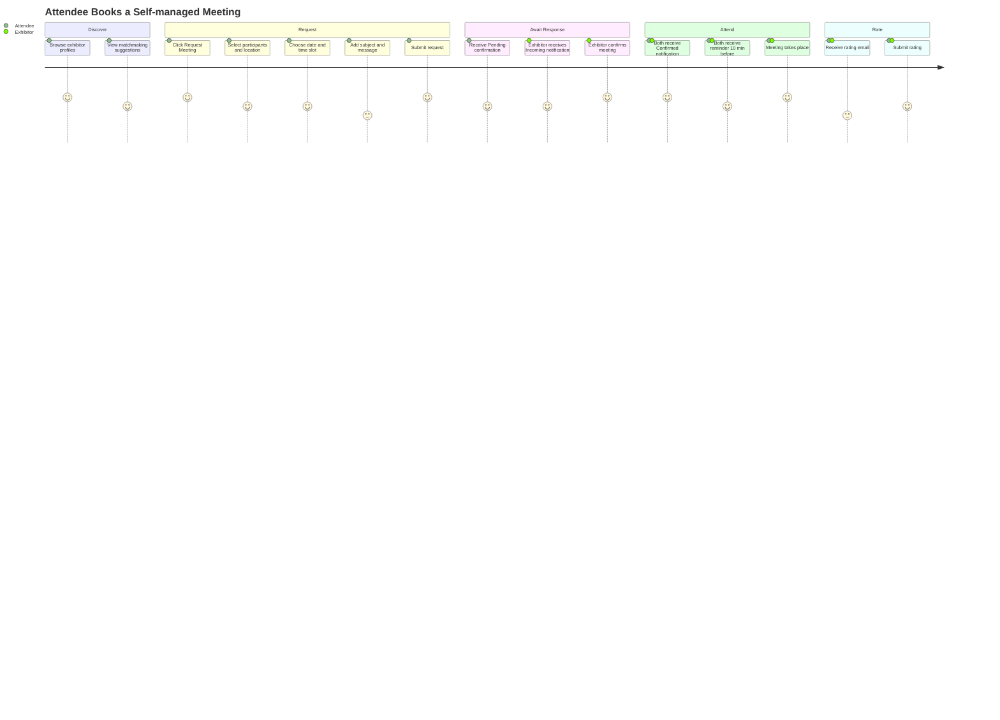
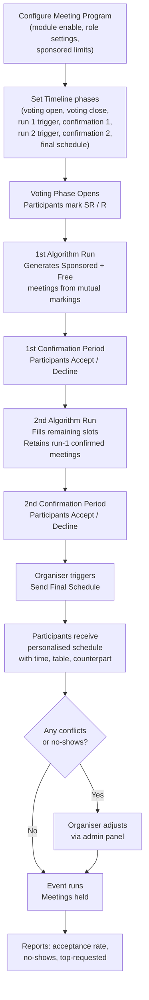
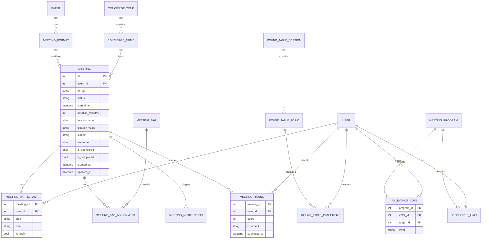
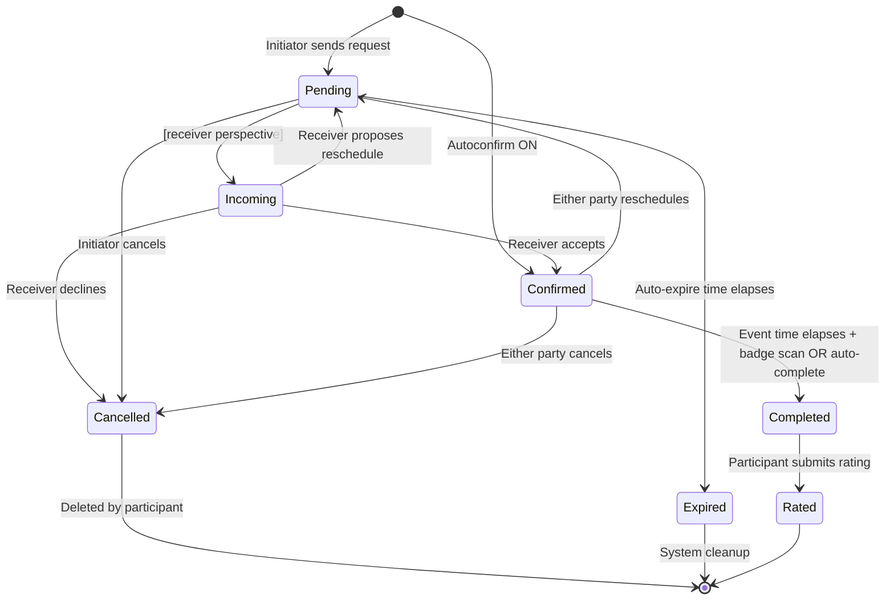
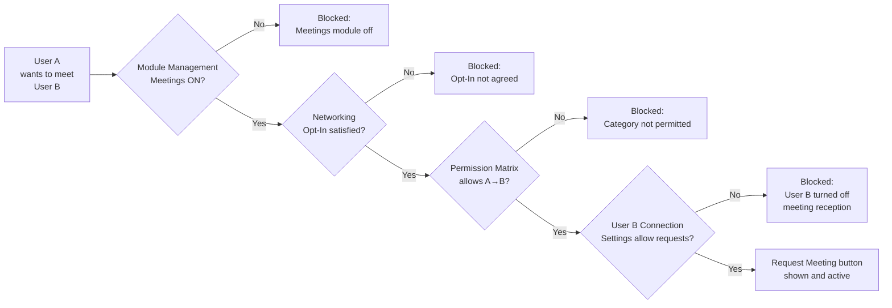

## 1. Product Overview

**Purpose.** Meetings & Matchmaking is ExpoPlatform's end-to-end networking engine. It converts participant interest signals into concrete, scheduled 1:1 and group interactions — covering everything from a self-initiated meeting request between two exhibitors, through an organiser-curated Concierge session at a VIP table, to an algorithm-driven Meeting Program that schedules hundreds of bilateral appointments across a multi-day event.

**Problem being solved.** Unstructured networking at events is inefficient: attendees waste time locating the right people, exhibitors fail to capitalise on buyer interest, and organisers cannot demonstrate measurable ROI. Meetings & Matchmaking solves this by providing structured pathways — participant-initiated or organiser-led — that match intent to availability and turn interest into confirmed diary entries.

**Business value.**
- Exhibitors and sponsors receive a measurable, reportable layer of engagement (meeting counts, acceptance rates, no-show data) they can present to their management.
- Organisers can differentiate their events by offering premium meeting formats (Concierge, Meeting Program) as paid upsell packages.
- The matchmaking algorithm reduces manual effort and bias in pairing, especially for large-scale buyer-seller programmes.
- Meeting exports, API endpoints, and the real-time dashboard allow organisers to manage the event floor actively and intervene on no-shows in real time.
- The AI Meeting Transcription Tool (MTT, EP-47872 — In Progress) will extend value beyond the event by capturing meeting content for follow-up.

**Target users.** Event organisers and their operations teams (configure and manage all formats); exhibitors and team members (initiate and manage their own meetings via the Meeting Wizard); attendees / buyers / participants (request, accept, and attend meetings across all formats).

**User personas.**
- *Event Organiser* — designs the meeting programme, configures formats and allowed times, monitors the real-time dashboard, resolves conflicts, exports reports.
- *Exhibitor Account Manager* — uses the Meeting Wizard to pre-schedule VIP meetings; manages team member reassignment; tracks incoming pipeline via the team meeting dashboard.
- *Attendee / Buyer* — browses the matchmaking catalogue, sends meeting requests, accepts or reschedules, attends meetings and submits ratings.
- *Concierge / Onsite Staff* — operates the check-in kiosk for Speed Networking walk-ins; manages real-time table assignments during Concierge sessions.
- *Platform Super Admin* — enables or disables meeting format modules per event; configures global limits and permission matrices.

**Success metrics.** Meeting acceptance rate (confirmed / requested); no-show rate (held / confirmed); meetings-per-participant average; time from request to confirmation; percentage of participants with at least one confirmed meeting; organiser NPS on the meeting programme experience.

## 2. Product Scope

### Included

- **Self-managed Meetings** — participant-initiated 1:1 meetings; request, confirm, reschedule, cancel, reassign.
- **Concierge Meetings** — organiser-curated pre-arranged meetings at fixed zones and tables; Meeting Wizard; real-time dashboard; onsite check-in.
- **Speed Networking** — timeboxed multi-round sessions; Walk-in (Check-in) and Pre-matched (Opt-in) modes; AI-generated match proposals; organiser schedule review and adjustment.
- **Meeting Program** — algorithm-driven pre-event 1:1 scheduling across the full event duration; voting/relevance phase; two-run generation; Sponsored and Free meeting tiers; timeline management; participant-facing catalogue, requests, and schedule.
- **Round Tables** — expert-led themed group discussions; topic interest application; placement algorithm; Final Schedule; admin report with per-session and per-topic breakdowns.
- **Exhibitor Events** — exhibitor-created sessions requiring organiser approval; distinct from regular sessions in creation, approval, and scheduling behaviour; moved to Meeting Formats section May 2026.
- **Cross-cutting features** — Meeting Statuses (Pending / Incoming / Confirmed / Cancelled and terminal states); Meeting Tags; Standard Meeting Notifications and Custom Meeting Reminders; Meeting Ratings; Allowed Meeting Times; Meeting location settings (online, stand, other); Meeting duration settings; auto-confirm; auto-expire; block time slots for pending meetings; auto-complete via badge scan; connection settings; permissions matrix.
- **Reporting** — meetings export (CSV/XLS), Seated Meetings export, Round Tables report, Meeting Program reports, real-time meetings dashboard, Organiser Analytics meetings tab, public API endpoints (`/api/v2/meetings/export`).
- **May 2026 admin reorganisation** — Speed Networking, Meeting Program, Concierge Meetings, Round Tables, and Exhibitor Events grouped under a new top-level **Meeting Formats** section in the admin panel.

### Excluded

- Session / agenda management for regular content sessions (covered by Sessions product).
- Badge scanning infrastructure and kiosk hardware (covered by Onsite & Kiosk).
- Payment processing for paid meeting packages (covered by Transactions & Purchasing).
- AI Meeting Transcription Tool (MTT) — EP-47872 is In Progress and not yet delivered to production.
- Third-party video conferencing platforms (Zoom, Teams) beyond the embed/link generation that the online meeting feature provides.
- CRM integration with external systems (out of scope for this product; handled by API/Integration layer).

## 3. User Roles

| Role | Meeting capabilities | Notes / Restrictions |
| --- | --- | --- |
| **Organizer (Admin)** | Full access to all meeting formats, settings, wizard, dashboard, reports; can create, edit, confirm, cancel, reassign any meeting | Accesses self-managed settings under Networking & Matchmaking → Meetings; structured formats under Meeting Formats |
| **Super Admin** | Same as Organizer plus Module Management (enable/disable each format per event); global permission matrix configuration | Can toggle Meetings Auto-confirm, Auto Expire, Block Slots globally |
| **Exhibitor** | Can request, confirm, reschedule, cancel self-managed meetings; use Meeting Wizard (Concierge); view team meeting dashboard; reassign team members (if enabled) | Exhibitor Events created from exhibitor profile frontend, subject to organiser approval |
| **Team Member** | Can request, confirm, reschedule, cancel self-managed meetings; appears in Meeting Wizard as assignable participant | Connection settings controllable by exhibitor if "Allow exhibitors to manage connection settings of TMs" is ON |
| **Attendee / Visitor / Buyer** | Can request, confirm, reschedule, cancel self-managed meetings; participates in Speed Networking and Meeting Program; rates completed meetings | Hosted Buyers limited to Sponsored meetings only in Meeting Program |
| **Speaker** | Participates in meetings as any other user; speaker schedule is not affected by Exhibitor Events by default | — |
| **Guest (unauthenticated)** | Cannot initiate meetings; if any category disallows meeting requests, guests are also blocked | Governed by Permission Matrix |

> [!INFO] The Permission Matrix at Admin Panel >> Event Setup > Networking and Matchmaking > Manage Permissions controls which participant categories can initiate meetings with which other categories. A user with multiple categories is allowed to interact if at least one of their categories permits it. Connection Settings can further restrict an individual user beyond what the Permission Matrix allows, but cannot grant permissions the Matrix has blocked.

## 4. Feature Inventory

### 4.1 Self-managed Meetings

#### Description
Participant-initiated 1:1 meetings booked directly between two users through the standard meeting request flow. One user sends a request; the other accepts, declines, or proposes a reschedule. No organiser-driven schedule or matching algorithm is involved.

#### Why it exists
The majority of valuable event connections arise spontaneously from attendees browsing profiles, visiting stands, or acting on platform recommendations. Self-managed Meetings gives every participant a direct, friction-free path to formalise those connections into scheduled time.

#### User value
Puts scheduling control in the hands of participants; confirmed meetings appear in both parties' personal schedule and trigger calendar invites (ICS), ensuring the meeting survives beyond the platform.

#### Functional logic
- Initiator opens a user's profile, product page, or matchmaking card and clicks "Request Meeting."
- New request flow (enabled per event at `/admin/appointments` → "Use new flow for regular meeting request") dynamically updates available time slots as selections are made; dates with no valid slots are hidden.
- Fields: participants (with "Any Available Team Member" option for exhibitor side), subject, message, location (stand, online, other), tags, media files, products, duration.
- Duration field always shows all options; changing duration resets selected time slots but not selected users or location.
- Old request flow remains available for events where the new flow is not enabled.

#### Preconditions
Meeting module enabled in Module Management; both parties have Active status (or "Allow meeting requests for inactive users" is ON); Permission Matrix allows the interaction; Connection Settings for the receiver are ON; Networking Opt-In rules satisfied.

#### Trigger conditions
Initiator clicks "Request Meeting" from any surface where the button is exposed (profile, product page, matchmaking card, interaction widget).

#### Processing logic
Request creates a meeting record with status Pending (initiator) / Incoming (receiver). If "Meetings auto-confirm" is ON, the meeting is immediately Confirmed. If the "Block time slots for pending meetings" toggle is ON, the selected slot is blocked for both parties while the request is unresolved.

#### Outputs
Meeting record with assigned status; email/push notifications to both parties; slot appears in "Diary activity" column if blocking is enabled.

#### Dependencies
Module Management (Meetings on); Permission Matrix; Connection Settings; Networking Opt-In; meeting scheduling settings (duration, time step, allowed times, location toggles).

#### Configurations
New vs old request flow; file attachment enable/disable; max file size; allowed meeting durations (default 30min, max 1hr); time step (10/15/30min); pause after meeting; allowed online location; stand location settings; meeting tags.

#### Validation rules
"Max meeting length" must not be shorter than "Meetings length default." Duration does not gate other fields. "Any Available Team Member" cannot be selected simultaneously with a specific team member.

#### Permissions
Any participant type allowed by the Permission Matrix and Connection Settings. Organizer can create meetings on behalf of participants via the admin panel.

#### Error handling
If the selected slot becomes unavailable after selection (concurrent booking), the system marks the option as "Unavailable" and the user must select another. File upload failures display specific guidance on size limit and supported formats.

#### Edge cases
If an inactive user turns off connection settings before a pending request is resolved, the existing pending request can still be replied to. Past meetings cannot be cancelled or rescheduled. Cancellation of a meeting where Side 1 has multiple participants requires all of Side 1 to cancel before the general meeting status becomes Cancelled; individual cancellations show as Cancelled only for those who cancelled.

---

### 4.2 Meeting Confirmation, Cancellation and Rescheduling

#### Description
The lifecycle management operations that move a meeting from its initial request state through to resolution — confirmation, rejection, rescheduling, or cancellation.

#### Why it exists
Meetings are bilateral commitments. The platform must provide clear, actionable controls for both parties at every stage and maintain a reliable status history for reporting.

#### Functional logic
**Confirmation:** Any participant on the receiver side can confirm; once one confirms, the meeting becomes Confirmed for all participants of both sides. Additional participants' confirmation has no effect on the overall meeting status. Autoconfirm skips this step.

**Cancellation:** Any participant from any side can cancel; a cancellation reason is required. Past meetings cannot be cancelled. Cancelled meetings are removed from "My Schedule" but remain in "My Meetings" until deleted via the Delete button. When Side 1 has multiple participants, meeting status becomes Cancelled for all only when all of Side 1 have cancelled.

**Rescheduling:** "Disallow meeting reschedule" global toggle at `/admin/appointments`. Main participant from either side can reschedule; additional participants cannot. Past meetings cannot be rescheduled. Rescheduling a Confirmed meeting returns it to Pending/Incoming unless autoconfirm is ON.

#### Configurations
Disallow meeting reschedule toggle; autoconfirm toggle (global or per participant category).

#### Permissions
Confirmation: receiver-side participants only. Cancellation: any participant, any side. Rescheduling: main participant only (additional participants excluded).

#### Edge cases
If a Confirmed meeting is rescheduled, all related blocking and calendar entries reset. Category-level autoconfirm applies only to the meeting initiator from that category; rescheduled meetings where the initiator is not in an autoconfirm category revert to Incoming for the counterpart.

---

### 4.3 Concierge Meetings

#### Description
A premium meeting format where the organiser pre-arranges bilateral meetings at designated physical zones and tables. Previously called "Table Meetings." Moved to Meeting Formats section in May 2026.

#### Why it exists
VIP buyer-seller programmes, hosted buyer events, and curated B2B matchmaking require the organiser — not the participants — to control who meets whom, when, and where. Concierge Meetings provides the infrastructure for this model.

#### User value
Exhibitors and VIP attendees receive a curated meeting schedule without the overhead of outreach. Organisers can charge premium rates for guaranteed meetings and demonstrate structured ROI.

#### Functional logic
**Zones:** Physical areas at the venue. Each zone has capacity (number of tables), time slots, duration, and location details displayed in notifications.

**Tables:** Named or numbered tables within zones, each linked to specific time slots.

**Meeting Wizard:** Step-by-step tool guiding organisers through zone/table selection, time slot creation, participant import (manual or CSV), and schedule preview. CSV rows require valid user ID, time slot, and table ID.

**Online Concierge:** Same wizard process without physical zones; platform auto-generates virtual meeting room links; sends links and calendar invites automatically.

**Real-time Dashboard:** Live view of which meetings are happening, which tables are free/occupied, check-in status, and admin override tools for on-the-fly rescheduling.

**Admin Assignment:** Zone-level admin roles restrict visibility and management scope for large teams managing multiple zones.

#### Preconditions
Concierge Meetings module enabled; zones and tables configured before participants are assigned.

#### Configurations
Zone name, number of tables, time slot duration, scheduling range; "Other location" toggle for offline; Online Meeting toggle for virtual; notification channels per event.

#### Permissions
Organiser / Admin: full setup and management. Exhibitors: can use Meeting Wizard to assign participants (if granted). Zone admins: restricted to their assigned zone(s).

#### Error handling
CSV upload fails silently or partially if any row has missing/mismatched fields — check user ID, time slot, and table ID. Deleting a zone/table/time slot automatically unassigns all meetings linked to that entity.

#### Edge cases
Two meetings assigned to the same table at the same time can occur via manual assignment outside the Wizard — check Dashboard before finalising. A participant not showing in assigned meetings may indicate the Wizard assignment was not published or a zone/table link was broken.

---

### 4.4 Speed Networking

#### Description
Timeboxed multi-round networking sessions where participants rotate between short 1:1 meetings. Two modes: Walk-in (Check-in) and Pre-matched (Opt-in).

#### Why it exists
Large events with hundreds of participants cannot practically use 1:1 self-scheduling for all networking. Speed Networking enables structured, high-throughput interaction in a bounded time window.

#### Functional logic
**Walk-in mode:** A session at a fixed time is promoted to participants; interested participants physically arrive, scan their badge, and are added to the participant pool. The platform pairs them in rounds.

**Opt-in mode:** Organiser sets up registration in advance with an interest/preference form. Registered users become the session pool. The platform generates an AI-matched proposal list; participants mark others as Relevant or Not Relevant. Algorithm analyses data and auto-pairs best matches. Organiser reviews and adjusts the generated schedule. Participants receive their schedules.

**Sub-features (Opt-in):** Pre-registration conditions; pre-registered list; meeting limits per participant; schedule view of generated meetings; table view of generated meetings; manual adjustment; dynamic timeline; email notifications; meeting creation logic; matchmaking proposals; configuring sponsors; team schedule; profile detail pop-ups.

#### Configurations
Session type (walk-in or opt-in); registration form fields; meeting limits; dynamic timeline phases; sponsor configuration; email templates.

#### Permissions
Organiser: creates and manages sessions. Participants: register (opt-in) or attend (walk-in).

#### Edge cases
Walk-in participants who arrive late may be placed in a reduced round pool. Opt-in participants who do not complete the preference form may receive lower-quality matches or be excluded from generation.

---

### 4.5 Meeting Program

#### Description
An algorithm-driven module that produces a complete personalised meeting schedule for every participant across the full duration of an event. Participants vote on who they want to meet; two generation runs produce an optimised schedule of Sponsored and Free 1:1 meetings.

#### Why it exists
Events with structured buyer-seller programmes need a scalable, fair, and commercially governed way to generate hundreds or thousands of bilateral meetings with minimal manual effort.

#### Functional logic
**Timeline phases:** Voting (participants mark others SR/Relevant), 1st Algorithm Run, 1st Confirmation Period, 2nd Algorithm Run, 2nd Confirmation Period, Final Schedule published. Organiser controls timing of each phase.

**Relevance signals:** Super Relevant (SR) signals stronger interest than Relevant (R). Participants do not see what level others have marked them at.

**Generation tiers (both runs apply same logic):**
- Tier 1: mutual SR–SR pairs.
- Tier 2: Requester SR, Recipient R.
- Tier 3: Requester R, Recipient SR.
- Tier 4: mutual R–R pairs.
Only mutually marked pairs are eligible. Matchmaking scores do not influence generation. One pair per company (by company name) across all representatives.

**Sponsored vs Free meetings:**
- Hosted Buyers: Sponsored meetings only; only visible to Sponsored Team Members.
- General Buyers: Sponsored allocation filled first, then Free.
- Sponsored Team Members: share exhibitor's Sponsored allocation; Free meetings allowed once allocation exhausted.
- Free Team Members: Free meetings only; not visible to Hosted Buyers or General Buyers.

**May 2026 change:** 1st run now generates both Sponsored and Free meetings (previously Sponsored only in run 1).

**Sponsored Meeting Limit:** Organiser sets per type or per individual. Header shows live counter (e.g. "3/10"). Prioritisation removed once limit reached. Only accepted/held meetings count; pending excluded; cancellations restore count. Organiser can adjust limits at any time; existing confirmed meetings not affected.

**Confirmation Flow:** Recipient must click Accept explicitly (no implicit confirmation). Decline has a confirmation dialog to prevent accidental declines. Notifications on each transition. Concurrent accepts on last slot resolved server-side (first wins).

#### Outputs
Personalised schedule per participant; Meeting Program reports (acceptance rates, no-show tracking, top-requested participants); admin reports (schedule view, tables view, confirmation list).

#### Configurations
Timeline dates/times per phase; role settings (Hosted Buyer, General Buyer, Sponsored TM, Free TM); Sponsored meeting limits; meeting time slots; table assignments; email notification templates.

#### Permissions
Organiser: full configuration and generation management. Participants: vote, request, confirm, decline within the programme rules. Exhibitors: assign Sponsored/Free status to team members (must be done before first generation run).

#### Edge cases
Status cannot be changed for a team member after the first generation run. Lowering a Sponsored limit below current count does not cancel existing meetings. Raising a limit reinstates prioritisation immediately. Catalogue visible only after the Timeline phase that opens it is reached.

---

### 4.6 Round Tables

#### Description
Expert-led themed group discussions where participants apply to join a topic of interest and are placed at a physical or virtual table with an expert facilitator.

#### Why it exists
Not all valuable networking is 1:1. Round Tables enables structured knowledge exchange at a group level, which works well for technical, sector-specific, or thought-leadership content.

#### Functional logic
Organiser creates Round Tables sessions with topics and table limits. Participants browse topics and apply to attend. The placement algorithm assigns participants to tables, respecting table capacity. Admin can add participants after the Final Schedule if configured to allow this. The Round Tables Report provides session-level and topic-level analytics.

**Tables Limit per session:** Configures the maximum number of tables per Round Tables session. **Table numbers across topics:** Controls whether table numbers are contiguous across all topics or reset per topic.

**Round Tables Report fields:** Session totals (applications, placed, unassigned, max tables); topic breakdown (applications, placed, tables used, avg occupancy); per-participant detail (name, category, applied topic, assigned topic and table, Placed/Unassigned). Exported as .xlsx.

#### Configurations
Max tables per session; table numbering approach; allow/disallow post-Final-Schedule additions; topic definitions.

#### Permissions
Organiser: full setup. Participants: apply to topics.

---

### 4.7 Exhibitor Events

#### Description
Events created by exhibitors from their profile frontend, distinct from regular sessions created by organisers. Subject to organiser approval before publication.

#### Why it exists
Exhibitors need a self-service mechanism to host their own product demonstrations, workshops, or networking events within the larger event structure, without requiring organiser resource to create them.

#### Functional logic
Exhibitors create events from their profile. Events are submitted to the organiser approval queue. Approved events are published and visible to attendees. Exhibitors can edit their events before approval; organisers cannot edit exhibitor events (only regular sessions are editable by organisers). Exhibitor events do not affect speaker/moderator schedules by default. Tracks, Types, Tags, and Sponsors are shared with regular sessions.

**Admin location (May 2026):** Meeting Formats >> Exhibitor Events. Three tabs: Management (list/create/edit; Speakers & Moderators; Config), Filters (Subject Tags, Tracks, Types), Email templates (organiser notifications, exhibitor notifications).

#### Configurations
Enable exhibitor event creation at exhibitor category level or individual exhibitor level; global settings; restriction settings; approval workflow.

#### Permissions
Exhibitors: create and edit events (before approval). Organisers: approve, reject, and list events. Shared taxonomy (Tracks/Types/Tags) configured by organisers only.

---

### 4.8 Meeting Statuses

#### Description
The lifecycle states a meeting record can occupy, each carrying distinct UI display, calendar-blocking behaviour, and action availability.

#### Why it exists
Participants need unambiguous visual feedback on the state of every meeting. Organisers need status data for reporting, dashboard monitoring, and SLA tracking.

#### Functional logic

| Status | Perspective | Calendar blocking | Available actions |
| --- | --- | --- | --- |
| **Pending** | Initiator side | No | Reschedule, Cancel |
| **Incoming** | Receiver side | No | Confirm, Reschedule, Cancel |
| **Confirmed** | Both sides | Yes | Reschedule (→ Pending/Incoming), Cancel |
| **Cancelled** | Both sides | No | Delete (removes from list) |
| **Completed** | Both sides (post-event) | No | Rate (if ratings enabled) |
| **Expired** | Both sides | No | None (treated as Cancelled in reporting) |

Pending and Incoming statuses are skipped when "Meetings auto-confirm" is enabled. Cancelled meetings appear only in "My Meetings," not "My Schedule." Expired meetings result from the Meetings Auto Expire toggle being ON and the configured expiry time elapsing.

#### Configurations
Meetings auto-confirm (global at `/admin/appointments` or per participant category); Meetings Auto Expire (toggle + expiry time); block time slots for pending meetings.

---

### 4.9 Meeting Tags

#### Description
Organiser-defined labels that can be attached to meetings at the point of request, used for classification, filtering, and reporting.

#### Why it exists
Events with multiple meeting purposes (product demo, partnership discussion, technical review) need a way to classify meetings without creating separate meeting types.

#### Functional logic
Toggle "Use Meeting tags" at `/admin/appointments`. Manage Meeting Tags pop-up: tag name, Use for (Table meetings / Regular meetings / Both), Show at (Backend only / Backend and frontend). Default for new tags: Table meetings, Backend only.

Frontend: multi-select dropdown added to meeting request flow when enabled. Field is required. Options filtered by tag attributes. If all tags are "Backend only" or all are "Table meetings" (for a regular meeting), the field is not shown. Selected tags displayed on the meeting card for all participants.

#### Configurations
Individual tags: name, Use for, Show at. Feature toggle per event.

#### Permissions
Organiser: creates and manages tags. Participants: select from available tags during request (required field when shown).

---

### 4.10 Meeting Ratings

#### Description
A post-meeting feedback mechanism allowing participants to rate completed meetings, with organiser-configurable delivery modes.

#### Why it exists
Meeting quality data is essential for demonstrating ROI to exhibitors, sponsors, and buyers, and for improving the matching algorithm over time.

#### Functional logic
Three delivery modes (all default OFF):
- **After each confirmed meeting ends:** Immediate rating email per meeting.
- **Daily at a configured time:** Single consolidated email covering all unrated confirmed meetings from that day and all previous days.
- **After the event ends:** Single email covering all confirmed meetings during the event; if >5 meetings, redirects to frontend rating page.

WhatsApp and SMS channels available (WhatsApp requires a TAM Jira task). Universal Deeplinks (ON by default): clicking ratings link opens app if enabled, otherwise web browser.

Ratings email sent daily at 14:30 GMT for the standard reminder template.

#### Configurations
Per-mode toggles; daily send time; category restriction for daily mode; Universal Deeplinks toggle; email templates per mode.

#### Permissions
Organiser: configures all rating settings. Participants: submit ratings on their completed meetings.

---

### 4.11 Standard Meeting Notifications and Custom Reminders

#### Description
System-generated email, push, in-app, SMS, and WhatsApp communications triggered by meeting lifecycle events, plus organiser-configurable reminder schedules.

#### Why it exists
Missed meetings are the primary source of negative feedback at networking events. Proactive, timely notifications reduce no-show rates and ensure participants arrive informed.

#### Functional logic
**Standard triggers (participant-initiated):** Incoming Meeting Request (receiver), Confirmed Meeting (initiator), Cancelled Meeting (non-cancelling parties), Meeting Reschedule (non-rescheduling party), Meeting Reassign (all sides — assigned, unassigned, unchanged), Confirmed Another Meeting at Requested Time (initiator).

**Standard triggers (organiser-initiated):** Meeting Appointed, Confirmed, Rescheduled, Cancelled by organiser (includes `admin_name` and `admin_email` variables).

**Key email templates:**

| Template | Trigger |
| --- | --- |
| Incoming Meeting | New meeting request sent to receiver |
| Reschedule (receiver) | Initiator proposes reschedule |
| Cancelled (receiver) | Initiator cancels meeting |
| Online Meeting Reminder | 10 minutes before online meeting start |
| Online Meeting Started | Meeting started but participant has not joined |
| Meeting Expired | Pending/Incoming request expired (requires Auto Expire ON) |
| Meeting Cancelled by Admin | Exhibitor admin cancels a meeting |
| Reassign Team Member | Team member reassigned (all parties notified) |

**Custom reminders:** Automatic (relative timing, e.g. 10min before); Scheduled (specific date/time); Required Confirmed Meeting reminders (frequency, start date, template; also fires when required limit reached). Channels: Email, SMS, WhatsApp, Web/App notification.

Required email variables: Receiver Name, Meeting Subject, Meeting Message, Meeting Date and Time (event timezone), Meeting Location, Appointment URL, Initiator Details.

> [!WARN] Several meeting email templates visible at `/admin/appointments/emails` are deprecated and no longer sent automatically. They must be manually disabled per event to avoid confusion. Review with your Technical Account Manager.

#### Configurations
Template enable/disable per event; variable inclusion; reminder timing and channel; required confirmed meeting threshold; multi-language template versions.

---

### 4.12 Meeting Location Settings

#### Description
Controls which physical and virtual location options are available when scheduling a self-managed meeting.

#### Functional logic
- **Show exhibitor stand location:** Displays the exhibitor's registered stand/hall number as a location option.
- **Allow other location:** Participant can type a custom location string. Organiser can pre-populate location suggestions; if none are defined, participant must enter manually (EP-14891).
- **Disable actual stand location:** Removes the real stand number from the location selector while retaining the stand-based option.
- **Allow online location:** Adds "Online Meeting" to the Location field; click "Online Time Settings" to define allowed hours.

All four settings are independent toggles at Networking & Matchmaking > Meetings > Settings.

---

### 4.13 Meeting Duration and Scheduling Settings

#### Description
Global parameters governing meeting slot structure for self-managed meetings.

#### Functional logic
- **Max meeting length** (default 1hr): Maximum bookable duration; must be ≥ Meetings length default.
- **Meetings length default** (default 30min): Pre-populated duration in request form.
- **Meeting time step** (10/15/30min; default 15min): Granularity of the time slot grid shown in the calendar picker.
- **Pause after meeting** (configurable minutes): Buffer added after each meeting slot; the full slot (meeting + pause) is shown as the meeting length.
- **10-minute option** (EP-1780): Adds 10min as a selectable duration.

---

### 4.14 Meeting Auto-confirm, Auto-expire and Block Slots

#### Description
Automation controls that reduce manual overhead and prevent scheduling conflicts.

#### Functional logic
**Auto-confirm (global):** Toggle at `/admin/appointments`. All new meetings skip Pending/Incoming and are immediately Confirmed. Pending limits not applied. Confirmation limits counted for receiver. Supersedes category-level autoconfirm.

**Auto-confirm (category-level):** Toggle in participant category settings. Only meetings initiated by users in that category are auto-confirmed. Existing pending meetings are not retroactively confirmed; the Pending status is hidden only after all prior pending meetings are resolved.

**Meetings Auto Expire:** Organiser sets a duration. When a Pending or Incoming meeting reaches that duration without action, it is Cancelled automatically. "Meeting Expired" email template fires (if enabled).

**Block time slots for pending meetings:** Toggle at `/admin/appointments` (default OFF). When ON, pending/incoming meetings block those slots for new requests. Shown in "Diary activity" column.

**Auto-complete outside meeting time:** Badge-scan of counterpart marks a Confirmed meeting as Completed regardless of scan timing. Applies to table and regular meetings. "Meeting completion" column added to Meetings export and APIv2.

**Allow meeting requests for inactive users:** When ON, "Request a meeting" button is hidden on inactive user cards.

---

### 4.15 Connection Settings and Permissions Matrix

#### Description
Two layered controls governing whether a given user can receive meeting requests: the Permission Matrix at category level and Connection Settings at individual user level.

#### Functional logic
**Permission Matrix:** Admin Panel >> Event Setup > Networking and Matchmaking > Manage Permissions. Left column = initiator categories; top row = receiver categories. Toggle controls whether that combination can initiate meetings (and messages/profile views). Four requirements for a meeting request to be permitted: (1) Networking Opt-In rules satisfied, (2) Permission Matrix allows the category pair, (3) receiver's Connection Settings allow requests, (4) Meetings module ON in Module Management.

**Connection Settings:** "Allow users to request a meeting with you" toggle in profile settings (ON by default). Organiser admin toggles enable this per user type (exhibitors, TMs, visitors) at `/admin/registration/esettings` / `/admin/registration/settings`. If a user disables reception after a request is sent, the request can still be replied to. Exhibitors can manage TM connection settings if "Allow exhibitors to manage connection settings of TMs" is ON. Settings exposed in public API (`/api/v2/account/get` and `set`) as `Meetings Allowed` and `Chats Allowed`.

## 5. User Stories Mapping

| Story ID | Type | Title / Summary | Acceptance criteria (key points) | Related feature | Status |
| --- | --- | --- | --- | --- | --- |
| EP-252 | Epic | Meeting Wizard — arranging meetings in Admin panel | Admin can create, assign and schedule concierge meetings via wizard; wizard steps cover zone/table/participant/time | Concierge Meetings | COMPLETE |
| EP-1068 | Story | New Analytics UI — Meetings | Meetings dashboard in new analytics UI; acceptance/decline/cancel counts displayed | Reporting & Analytics | COMPLETE |
| EP-1074 | Story | New UI — Exhibitor Manuals / Team members page | Team members page updated to new UI; meeting-related columns visible | Exhibitor Events / TM management | COMPLETE |
| EP-1089 | Story | Meetings export rework | Updated export schema; all meeting fields included; pagination for large datasets | Reporting | COMPLETE |
| EP-1101 | Story | Seated Meetings export rework | Concierge / table meeting specific export fields | Concierge Meetings | COMPLETE |
| EP-1104 | Story | Allowed / blocked time settings with online / offline separation | Online and offline meetings can have independent allowed-time windows | Meeting location settings | COMPLETE |
| EP-1109 | Story | Hyperlinks for physical locations / Meeting Agenda | Physical location strings in meeting agenda render as clickable hyperlinks | Self-managed Meetings | COMPLETE |
| EP-1780 | Story | 10-minute option for meetings | 10min selectable as meeting duration | Duration settings | COMPLETE |
| EP-1816 | Story | Match and meet location | Location selection integrated into matchmaking flow | Matchmaking | COMPLETE |
| EP-1998 | Story | Add weekdays to the calendar while scheduling | Calendar picker shows day labels; weekday-aware slot display | Meeting request flow | COMPLETE |
| EP-2948 | Story | Table Meeting — defining permissions — frontend | Permission controls for table/concierge meetings exposed on frontend | Concierge Meetings | COMPLETE |
| EP-8000 | Story | Change placement of meeting availability settings | Settings moved to more intuitive admin panel location | Admin UX | COMPLETE |
| EP-8011 | Story | Exhibitor stand is default for regular meeting request | Stand location pre-selected as default location in request form | Location settings | COMPLETE |
| EP-8122 | Story | Meeting request — new grid | Redesigned time slot grid in meeting request flow | Meeting request flow | COMPLETE |
| EP-8199 | Story | Add tag field to the meeting request flow | Meeting Tags dropdown added to request form | Meeting Tags | COMPLETE |
| EP-8213 | Story | Block the time slot for pending meeting requests | Pending meetings block time slots when toggle ON | Block slots for pending | COMPLETE |
| EP-8857 | Story | Meeting automatically approved | Meeting auto-confirm toggle and logic | Auto-confirm | COMPLETE |
| EP-9317 | Story | APP — ability for user to turn ON/OFF meeting/message reception | Connection Settings toggle exposed on mobile app | Connection Settings | COMPLETE |
| EP-9396 | Story | Meeting request includes file attachment option | File attachment field in meeting request flow | Meeting request flow | COMPLETE |
| EP-9435 | Story | API endpoints to pull meeting data in entirety | `/api/v2/meetings/export` endpoint with full meeting fields | Public API | COMPLETE |
| EP-9438 | Story | Improve rescheduling logic for particular cases | Edge case fixes for rescheduling (multi-participant, TM reassign) | Meeting management | COMPLETE |
| EP-9972 | Story | Custom Meeting Wizard Report rework | Updated Concierge Meeting Wizard report schema | Concierge Meetings | COMPLETE |
| EP-10170 | Story | APP — Meeting request includes file attachment | File attachment on mobile meeting request | Meeting request flow | COMPLETE |
| EP-10598 | Story | Filter and pagination retention after booking meetings | Filters/pagination state retained after returning from meeting booking | Meeting request UI | COMPLETE |
| EP-10663 | Story | Auto confirmation of meetings — Participant Category Level | Category-level autoconfirm toggle | Auto-confirm | COMPLETE |
| EP-11194 | Story | WEB — Requesting Meeting Auto Select Users | Auto-selects suggested users in meeting request flow | Matchmaking / request flow | COMPLETE |
| EP-12023 | Story | Replacing halls and stand numbers via API | API parameters for hall/stand replacement in meeting data | Public API | COMPLETE |
| EP-12036 | Story | EMEA — Remove stand hall meeting option after in-person event | Stand location option hidden after event ends | Location settings | COMPLETE |
| EP-12377 | Story | Visual Representation — Blocked Times | Blocked time slots visually differentiated in schedule grid | Block slots | COMPLETE |
| EP-12571 | Story | Custom Meeting Template / DWTC | Custom email template for concierge meeting confirmation | Notifications | COMPLETE |
| EP-12585 | Story | Inactive status cancels all scheduled sessions and meetings | Setting user inactive auto-cancels confirmed meetings | Meeting lifecycle | COMPLETE |
| EP-12587 | Story | Switching to category that does not allow meetings triggers cancellation | Category change cancels existing meetings if new category prohibits them | Permission / lifecycle | COMPLETE |
| EP-14128 | Epic | Sprint Automation Frontend v2 | Meeting request flow automation improvements | Meeting request flow | COMPLETE |
| EP-14680 | Epic | Creating Meetings | Core meeting creation epic | Self-managed Meetings | In Progress |
| EP-14891 | Story | User must enter other location when none mentioned in admin panel | Fallback manual entry for "other location" when no options predefined | Location settings | COMPLETE |
| EP-15162 | Story | DWTC — Improvement in Manage Meeting Section | Admin panel meeting management UX improvements | Admin UX | COMPLETE |
| EP-16028 | Story | Meeting cards title | Title/subject display improvements on meeting cards | Meeting cards | COMPLETE |
| EP-19438 | Story | Session Ratings | Ratings system for completed meetings/sessions | Meeting Ratings | COMPLETE |
| EP-20713 | Story | Incoming meeting variable | `incoming_meeting` variable added to email templates | Notifications | COMPLETE |
| EP-20842 | Story | Rename Appointment Rate Meeting email template | Template renamed for clarity | Notifications | COMPLETE |
| EP-36721 | Story | Fake email label in Meeting Wizard | Warning label when fake/placeholder email detected in Wizard | Concierge Meetings | COMPLETE |
| EP-47872 | Epic | AI Meeting Transcription Tool — POC to production | MTT captures and summarises meeting content; transforms from POC to production | AI / Transcription | In Progress |
| EP-49369 | Epic | Meeting Formats — Admin Re-arrangement | May 2026 grouping of Speed Networking, Meeting Program, Concierge, Round Tables, Exhibitor Events under Meeting Formats | Admin navigation | COMPLETE |

## 6. End-to-End Workflows

### Attendee meeting request journey

### Meeting Program organiser setup workflow

### Happy path
Organiser configures Meeting Program, sets timeline dates, opens voting. Participants vote SR/Relevant. Run 1 fires and generates a full initial schedule. Most participants confirm during confirmation period 1. Run 2 fills gaps. Final Schedule sent. Participants attend. Rating emails sent daily at 14:30 GMT.

### Alternate path
A participant marks many people SR but has limited availability. The algorithm places them in tier-1 pairs first but some slots remain unfilled after run 2. Organiser manually creates meetings from the admin panel to fulfil their sponsored limit.

### Exception path
A participant switches to a category that does not allow meetings (EP-12587). All their confirmed meetings are automatically cancelled. Notifications sent to all counterparts. Organiser reviews dashboard for downstream schedule gaps.

### Recovery path
A confirmed meeting is cancelled 30 minutes before start. Both parties receive a Cancelled notification. Organiser checks the real-time dashboard, identifies the gap, and uses the Meeting Wizard (Concierge) or the admin meeting create tool to assign an alternative meeting. The re-scheduled meeting is pushed as a new Pending/Incoming request and, if autoconfirm is ON, immediately Confirmed.

## 7. Business Rules Engine

| Rule | Condition | Exception / Priority | Conflict resolution |
| --- | --- | --- | --- |
| Receiver must explicitly confirm | Meeting created with autoconfirm OFF | Autoconfirm ON skips this rule entirely | Autoconfirm is global and takes priority over category-level settings |
| Only mutually marked pairs are eligible for Meeting Program generation | Both sides must have marked each other SR or R | No exception — unilateral marks never generate meetings | Algorithm simply skips the pair |
| One pair per company across all representatives | Company X and Company Y can only produce one generated meeting pairing regardless of rep count | Manual meetings created by organiser are not subject to this rule | Check is by company name field |
| Hosted Buyers receive Sponsored meetings only | Hosted Buyer role assigned | Organiser can create Free meetings manually outside the algorithm | Manual override allowed |
| General Buyers consume Sponsored allocation before Free | General Buyer has remaining Sponsored slots | Organiser can manually book a Free meeting even if Sponsored slots remain | Manual organiser override allowed |
| Sponsored Team Members share the exhibitor's Sponsored allocation | Multiple Sponsored TMs from same exhibitor | Individual TM Free meetings are independent once Sponsored allocation exhausted | Total Sponsored across all TMs cannot exceed exhibitor limit |
| Max meeting length must be ≥ default meeting length | Max set at `/admin/appointments` | No exception | System validation error on save; admin must correct |
| Cancellation reason required | Any cancellation action | No exception | Cannot submit cancellation without a reason |
| Past meetings cannot be cancelled or rescheduled | Meeting start time has elapsed | No exception | Action buttons hidden; API returns error |
| Connection Settings OFF overrides Permission Matrix allow | Individual user disables meeting reception | User can still reply to existing requests received before the toggle was turned off | Connection Settings layer is the final gate |
| Inactive user deactivation cancels all confirmed meetings | User set to Inactive status | "Allow meeting requests for inactive users" toggle only hides the Request button; does not prevent cancellation on deactivation | EP-12585 |
| Category change to a non-meeting-allowed category cancels meetings | Participant category changed | No exception | All confirmed meetings cancelled automatically; counterparts notified |
| Meeting limit changes do not retroactively cancel confirmed meetings | Organiser lowers Sponsored limit below participant's current confirmed count | No exception | Future generation is affected; existing meetings are preserved |
| Block Slots for pending treats Incoming the same as Pending | Toggle ON; user has incoming request | Even if the incoming request is declined later, the slot remains blocked until resolution | Resolved on Accept, Decline, or Expiry |

## 8. Data Model

### Meeting Status lifecycle

**Data objects and lifecycle states:**
- `Pending` and `Incoming` are two views of the same meeting record, differentiated by the current user's role (initiator vs receiver). The meeting record itself is one object.
- `Completed` status is set either by the passage of the meeting end time when auto-complete is off, or by badge scanning when auto-complete is on.
- `Expired` is a terminal state reached without action; treated as Cancelled for reporting purposes.
- `Rated` is a sub-state of Completed; a completed meeting may or may not be rated.

## 9. Permissions Matrix

### Permission flow

### Role × Capability table

| Capability | Super Admin | Organizer | Exhibitor | Team Member | Attendee / Buyer | Guest |
| --- | --- | --- | --- | --- | --- | --- |
| Enable / disable meeting module | Yes | No | No | No | No | No |
| Configure all meeting format settings | Yes | Yes | No | No | No | No |
| Create meetings via Meeting Wizard | Yes | Yes | Yes (if granted) | No | No | No |
| Send self-managed meeting requests | Yes | Yes | Yes | Yes | Yes | No |
| Confirm / decline received requests | Yes | Yes | Yes | Yes | Yes | No |
| Cancel any meeting | Yes | Yes | Own only | Own only | Own only | No |
| Reassign team members in meetings | Yes | Yes | Yes (if enabled) | No | No | No |
| Configure Permission Matrix | Yes | Yes | No | No | No | No |
| Toggle Connection Settings | Yes | Yes | Yes (own + TMs if enabled) | Yes (own) | Yes (own) | No |
| View real-time dashboard | Yes | Yes | Yes (own team) | No | No | No |
| Export meeting reports | Yes | Yes | No | No | No | No |
| Submit meeting ratings | No | No | Yes | Yes | Yes | No |
| Approve Exhibitor Events | Yes | Yes | No | No | No | No |

## 10. Integrations

| Integration | Purpose | Trigger | Data exchanged | Failure handling | Retry | Security |
| --- | --- | --- | --- | --- | --- | --- |
| **Email / SMTP** | Deliver all meeting notification and reminder emails | Meeting status changes, scheduled reminder times, daily 14:30 GMT rating batch | Meeting details, participant names, date/time (event TZ), location, meeting URL | Delivery failure logged; admin advised to check spam folder or email server | None automatic; admin must re-trigger | Email sender credentials in platform config; templates per-event |
| **Push notifications** | Mobile app push for meeting events | Same triggers as email | Summary of meeting event with deep link | Silent failure if user has revoked push permissions | Not retried | Standard mobile push (APNs / FCM) |
| **SMS / WhatsApp** | Alternative channels for reminders and ratings | Organiser-configured triggers | Short text message with meeting details | Platform-level failure returned to organiser; WhatsApp requires TAM Jira task | Per-channel configuration | WhatsApp requires approved message template |
| **ICS / Calendar attachments** | Calendar invite attached to confirmation emails | Meeting confirmed | iCalendar event with subject, date, time, location, participants | If ICS generation fails, email still sends without attachment | None | Standard iCalendar format |
| **Public API v2** (`/api/v2/meetings/export`) | Programmatic export of full meeting dataset for third-party CRM / BI | On demand; `last_modified` date filter available (EP-40013) | All meeting fields including `meeting_completion`, hall/stand, participants | HTTP error codes; calling system must handle 4xx/5xx | Caller responsibility | API key authentication |
| **Badge scanning** | Mark Confirmed meetings as Completed | Onsite badge scan (one side scans other) | User IDs, scan timestamp | Scan outside meeting time window completes meeting regardless (if auto-complete ON) | None | Kiosk-level authentication |
| **Module Management** | Enable / disable each meeting format per event | Super Admin toggle | Format enable/disable state | Disabling a format hides its UI; does not cancel existing meetings | Immediate | Admin panel auth |
| **Statistics API v2** (`/api/v2/statistics/`) | Meetings analytics data for external BI | On demand | Meeting counts by status, acceptance rates, interaction data | HTTP error codes | Caller responsibility | API key authentication |

## 11. Notifications

| Template | Channel | Timing | Recipient | Trigger | Key variables |
| --- | --- | --- | --- | --- | --- |
| Incoming Meeting | Email, Push, In-app | Immediate | Receiver | New meeting request sent | Receiver Name, Initiator Details, Meeting Subject, Date/Time, Location |
| Confirmed Meeting (initiator) | Email, Push, In-app | Immediate | Initiator | Receiver confirms | Meeting Subject, Date/Time, Location, Appointment URL |
| Cancelled Meeting | Email, Push, In-app | Immediate | Non-cancelling parties | Any party cancels | Meeting Subject, Date/Time, cancelling party name |
| Meeting Reschedule | Email, Push, In-app | Immediate | Non-rescheduling party | Any party reschedules | New proposed Date/Time, Meeting Subject |
| Meeting Reassign | Email, Push, In-app | Immediate | All parties (assigned, unassigned, unchanged) | Team member reassigned | Exhibitor Name, Time, Meeting Name, New Member List |
| Confirmed Another at Requested Time | Email | Immediate | Initiator | Another meeting confirmed in same slot | Original requested time |
| Meeting Appointed by Organiser | Email, Push | Immediate | All participants | Organiser creates meeting via wizard | admin_name, admin_email, Date/Time, Location |
| Meeting Confirmed by Organiser | Email, Push | Immediate | All participants | Organiser confirms | admin_name, Date/Time |
| Meeting Rescheduled by Organiser | Email, Push | Immediate | All participants | Organiser reschedules | admin_name, New Date/Time |
| Meeting Cancelled by Admin | Email, Push | Immediate | All participants | Exhibitor admin cancels | Meeting Subject, Date/Time |
| Online Meeting Reminder | Email, Push | 10 min before | Confirmed participants | Scheduled | Appointment URL, Date/Time |
| Online Meeting Started | Email, Push | At meeting start | Participants not yet joined | Scheduled | Appointment URL |
| Meeting Expired | Email | Immediate | Both sides | Auto-expire time elapses | Meeting Subject, Date/Time |
| Meeting Rating (after each) | Email, SMS, WhatsApp | Immediately after meeting ends | Both participants | Meeting end time | Receiver Name, Appointment Rate link |
| Meeting Rating (daily digest) | Email, SMS, WhatsApp | Daily at configured time | Participants with unrated meetings | Scheduled daily | List of unrated meetings, rating links |
| Meeting Rating (after event) | Email, SMS, WhatsApp | After event end date | All participants with completed meetings | Event end | CTA link if >5 meetings |
| Required Confirmed Meeting Reminder | Email | Configured frequency | Participants below required threshold | Scheduled | Count of confirmed meetings, target |

> [!INFO] Several email templates visible at `/admin/appointments/emails` are deprecated and no longer sent automatically. Disable them manually per event to avoid confusion. ICS attachments are sent with confirmation emails when the ICS feature is enabled (EP-1833959464).

## 12. Reporting & Analytics

### Meetings Export

| Input | Metrics | Calculations | Filters | Export |
| --- | --- | --- | --- | --- |
| All confirmed/completed meetings for event | Meeting ID, participants (both sides), status, date/time, location, duration, subject, meeting_completion, tags | Status counts (confirmed, pending, cancelled); completion Y/N | Event; date range; meeting format; status | CSV via admin data export at `/admin/data` |

### Seated Meetings Export

| Input | Metrics | Calculations | Filters | Export |
| --- | --- | --- | --- | --- |
| All Concierge / table meetings | Table number, zone, participants, time slot, status | Zone utilisation; table occupancy rate | Event; zone; time range | CSV via admin data export |

### Organiser Analytics — Meetings Tab

| Input | Metrics | Calculations | Filters | Export |
| --- | --- | --- | --- | --- |
| All meeting events for selected event(s) | Confirmed / Pending / Cancelled totals; meeting requests over time; acceptance rate; top-requested exhibitors | Counts and percentages; time-series chart | Event selector; date range | Via General Dashboard supplier overview XLS; Meetings export separately |

### Meeting Program Reports

| Input | Metrics | Calculations | Filters | Export |
| --- | --- | --- | --- | --- |
| Meeting Program session data | Acceptance rate per participant; no-show rate; top-requested participants; sponsored vs free split | Count / % of accepted, declined, no-show per participant | Event; participant category; time range | Admin panel report download |

### Round Tables Report

| Input | Metrics | Calculations | Filters | Export |
| --- | --- | --- | --- | --- |
| Round Tables session applications and placements | Applications, placed, unassigned per session; applications, placed, tables used, avg occupancy per topic; participant-level placement detail | Placement rate = placed / applications; avg occupancy = placed / tables | Session; topic | XLSX from Round Tables session page |

### Real-time Meetings Dashboard

| Input | Metrics | Calculations | Filters | Export |
| --- | --- | --- | --- | --- |
| Live meeting events during event day | Meetings happening now; tables free/occupied; check-in status; no-shows | Live count refreshed in real time | Zone; time slot | Not exported; action panel for on-the-fly reassignment |

## 13. Configuration Guide

| Setting | Effect | Admin path | Who can set |
| --- | --- | --- | --- |
| Meeting module enable | Turns on/off all self-managed meeting functionality | Module Management | Super Admin |
| Meeting Formats enable per format | Enables/disables Speed Networking, Meeting Program, Concierge, Round Tables, Exhibitor Events independently | Module Management | Super Admin |
| Use new flow for regular meeting request | Activates dynamic meeting request UI | `/admin/appointments` | Organizer |
| Meetings auto-confirm (global) | All meetings immediately Confirmed; Pending/Incoming skipped | `/admin/appointments` | Organizer |
| Meeting auto-confirm (category) | Auto-confirm only for meetings initiated by a specific participant category | Participant category settings | Organizer |
| Meetings Auto Expire | Sets duration after which Pending/Incoming meetings are Cancelled | `/admin/appointments` | Organizer |
| Block time slots for pending meetings | Prevents double-booking while a request is pending | `/admin/appointments` | Organizer |
| Auto-complete outside meeting time | Badge scan completes meeting regardless of timing | `/admin/appointments` | Organizer |
| Allow meeting requests for inactive users | Hides Request Meeting button on inactive user cards | `/admin/appointments` | Organizer |
| Disallow meeting reschedule | Removes Reschedule option globally | `/admin/appointments` | Organizer |
| Max meeting length | Maximum selectable duration (default 1hr) | Networking & Matchmaking > Meetings > Settings | Organizer |
| Meetings length default | Pre-filled duration in request form (default 30min) | Networking & Matchmaking > Meetings > Settings | Organizer |
| Meeting time step | Grid granularity: 10/15/30min (default 15min) | Networking & Matchmaking > Meetings > Settings | Organizer |
| Pause after meeting | Buffer added after each slot (appears as part of slot duration) | Networking & Matchmaking > Meetings > Settings | Organizer |
| Allow online location | Adds Online option to Location field; configure allowed online hours | Networking & Matchmaking > Meetings > Settings | Organizer |
| Show exhibitor stand location | Displays registered stand/hall as location option | Networking & Matchmaking > Meetings > Settings | Organizer |
| Allow other location | Participant can enter custom location | Networking & Matchmaking > Meetings > Settings | Organizer |
| Disable actual stand location | Removes real stand number from selector | Networking & Matchmaking > Meetings > Settings | Organizer |
| Use Meeting tags | Enables tag selection during meeting request | `/admin/appointments` | Organizer |
| Enable file attachment in meeting request | Adds file upload step to meeting request | `/admin/appointments` | Organizer |
| Max upload file size | Caps file attachment size | `/admin/general/settings` | Organizer / Super Admin |
| Allow exhibitor to reassign TM from meeting card | Shows Reassign Members button on exhibitor meeting cards | `/admin/registration/esettings` | Organizer |
| Allow exhibitors to manage connection settings of TMs | Gives exhibitors control over TM meeting/chat reception toggles | `/admin/registration/esettings` | Organizer |
| Meeting ratings modes | After each meeting / daily / after event; channel selection | Networking & Matchmaking > Meetings > Meeting Rating | Organizer |
| Permission Matrix | Category-level interaction rules | Admin Panel > Event Setup > Networking and Matchmaking > Manage Permissions | Organizer |
| Concierge zone / table config | Defines physical zones, tables, time slots for Concierge meetings | Meeting Formats > Concierge Meetings > Zones/Tables | Organizer |
| Meeting Program timeline | Phase dates for voting, generation runs, confirmation periods, final schedule | Meeting Formats > Meeting Program > Timeline | Organizer |
| Sponsored meeting limits | Per-participant-type or per-individual limits for Meeting Program | Meeting Formats > Meeting Program > Settings | Organizer |
| Round Tables session config | Topics, table capacity, numbering, post-Final-Schedule additions | Meeting Formats > Round Tables | Organizer |

## 14. Edge Cases

### User edge cases
- **User turns off Connection Settings after receiving a request:** Existing request can still be replied to; new requests are blocked.
- **User has multiple participant categories:** If any of their categories is allowed by the Permission Matrix, they can interact with the target user.
- **Hosted Buyer placed in General Buyer category by mistake:** Algorithm generates Free meetings for them; sponsored prioritisation does not apply until category corrected before generation.

### Data edge cases
- **Duplicate company name:** One-pair-per-company rule in Meeting Program checks exact company name string; spelling variants are treated as different companies.
- **Zero confirmed meetings on first event day:** Rating daily digest fires with zero items if organiser has not restricted daily emails to categories with meetings; categories filter should be set.
- **More than 5 confirmed meetings at event end:** Rating email generates a CTA link to the frontend rating page rather than inline rating links.

### Workflow edge cases
- **CSV import for Concierge Meetings has blank fields:** Upload may fail silently or partially; each row requires valid user ID, time slot, and table ID.
- **Meeting Program — Final Schedule not visible to attendees:** Organiser must explicitly trigger "Send Final Schedule" from the admin panel; it is not sent automatically after the 2nd confirmation period.
- **Meeting request submitted while counterpart's slot is being confirmed by another user (concurrency):** Server resolves concurrently; first accepted request wins; other requestors receive a friendly conflict message and must choose a different slot.

### Integration edge cases
- **ICS not included in confirmation email:** ICS feature must be enabled separately; it does not activate automatically with the meeting module.
- **Online meeting link not generated:** Check that "Allow online location" toggle is ON and that online allowed times include the selected slot.

### Permission edge cases
- **Category is set to disallow meetings mid-event:** All confirmed meetings for users in that category are cancelled (EP-12587). Organiser should announce the change before applying it.
- **Exhibitor Events shared taxonomy change:** Tags, Tracks, and Types are shared with regular sessions; saving changes in Exhibitor Events tab will affect regular sessions too (save warning displayed).

### Concurrency edge cases
- **Two admins assign same participant to same Concierge table simultaneously:** No system-level lock; one assignment overwrites the other. Admins should use the Dashboard to verify before finalising.
- **Autoconfirm turned ON while a batch of Pending meetings exists:** Existing Pending meetings are not retroactively converted; the setting applies to newly created meetings only (category-level variant).

### Event-lifecycle edge cases
- **Setting a user Inactive:** All confirmed meetings are cancelled (EP-12585). The "Allow meeting requests for inactive users" toggle only hides the Request button; it does not prevent the cancellation cascade.
- **Event end date reached with unrated meetings:** Depending on rating mode configured, either a single digest email or per-meeting emails will be sent. If no rating mode is ON, no emails fire.
- **Meeting Program Sponsored limit lowered below participant's confirmed count:** Existing confirmed meetings are retained; prioritisation is removed going forward. Limit is informational — it does not block the participant from booking more meetings beyond the threshold.

## 15. FAQs

**Q: What is the difference between Pending and Incoming?**
They are two views of the same meeting request. The person who sent the request sees it as Pending; the person who received it sees it as Incoming. Both statuses indicate the meeting is awaiting the receiver's decision.

**Q: Why can I not reschedule a past meeting?**
Platform policy prevents modification of meetings whose start time has already elapsed. This preserves the integrity of the historical record.

**Q: How does autoconfirm interact with meeting limits?**
When global autoconfirm is ON, pending limits are not counted for either side. Only confirmation limits (counted on the receiver side) apply. When autoconfirm is OFF, pending limits count for the initiator side.

**Q: Why are some email templates at `/admin/appointments/emails` still showing but not firing?**
Several templates were deprecated and are no longer sent automatically. They remain visible in the template list and must be manually disabled per event to avoid confusion. Review with your Technical Account Manager.

**Q: Can an exhibitor change a team member's status from Sponsored to Free after the first Meeting Program generation run?**
No. Sponsored/Free status for team members in the Meeting Program must be set before the first generation run. Once run 1 has fired, status cannot be changed.

**Q: What happens if I lower the sponsored meeting limit for a participant in the Meeting Program after meetings have already been generated?**
Existing confirmed meetings are not cancelled. The limit change removes the participant's prioritisation in matching going forward and affects future algorithm work only.

**Q: Why is the Meeting Program Final Schedule not visible to participants after run 2 completes?**
The Final Schedule is not published automatically. Organisers must manually trigger "Send Final Schedule" from the Meeting Program admin panel after they are satisfied with the schedule.

**Q: How does the one-pair-per-company rule work in Meeting Program?**
If any representative of Company X has been paired with any representative of Company Y, no further pairings between those two companies are generated. The check uses the exact company name string — companies with slight name variations are treated as different companies.

**Q: Can I use Meeting Tags for both Concierge and regular meetings?**
Yes. When creating a tag, set "Use for" to "Both." Set "Show at" to "Backend and frontend" to expose the tag selector to participants during request. Tags set to "Backend only" are for admin classification only.

**Q: What is the difference between Walk-in and Opt-in Speed Networking?**
Walk-in (Check-in): participants physically arrive at the session room, scan their badge to join the pool, and are paired in real time. Opt-in (Pre-matched): participants register in advance via a form, mark their interests, and receive a generated schedule before the session takes place.

**Q: How do Exhibitor Events differ from regular sessions?**
Exhibitor Events are created by exhibitors from their profile frontend and require organiser approval. Regular sessions are created by organisers from the admin panel and do not require approval. Exhibitor Events do not affect speaker/moderator schedules by default, and organisers cannot edit them (only exhibitors can, before approval).

**Q: Where are Concierge Meetings, Speed Networking, Meeting Program, Round Tables, and Exhibitor Events in the admin panel after May 2026?**
All five structured formats are now grouped under a new top-level **Meeting Formats** section in the admin panel. Self-managed Meetings settings remain under Networking & Matchmaking → Meetings, unchanged.
