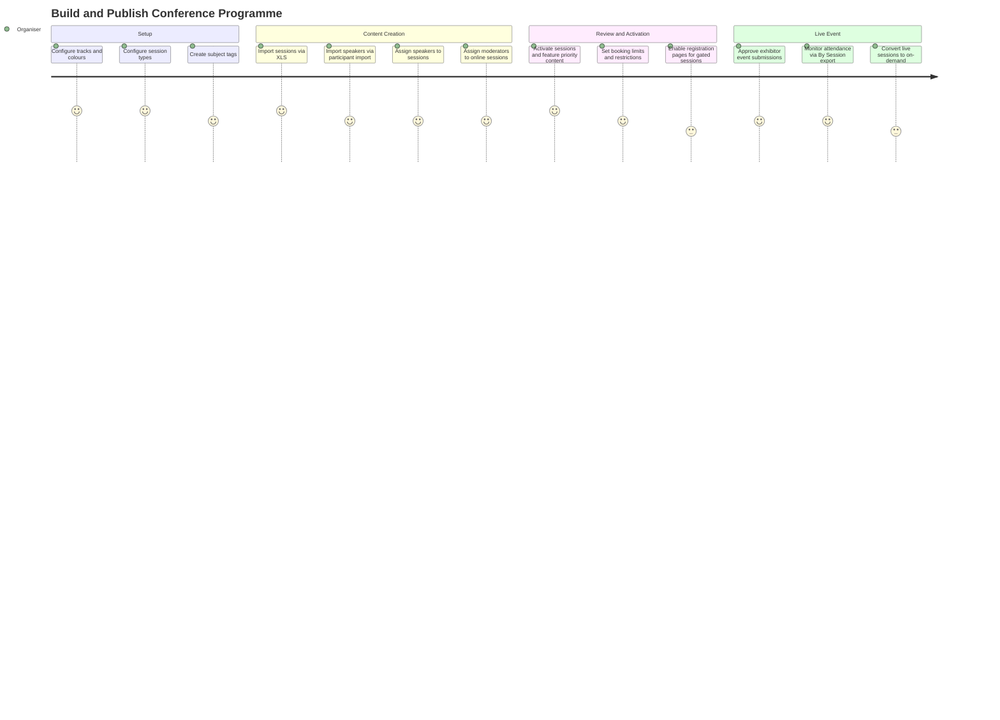
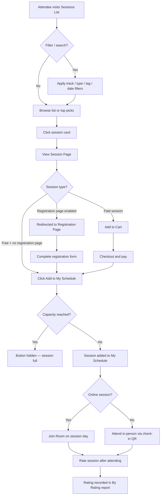
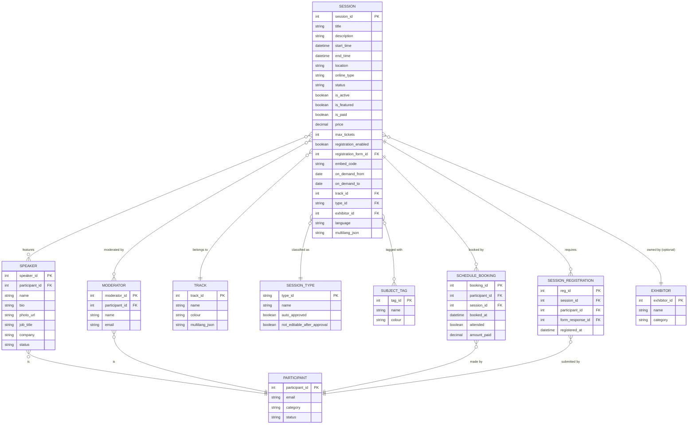
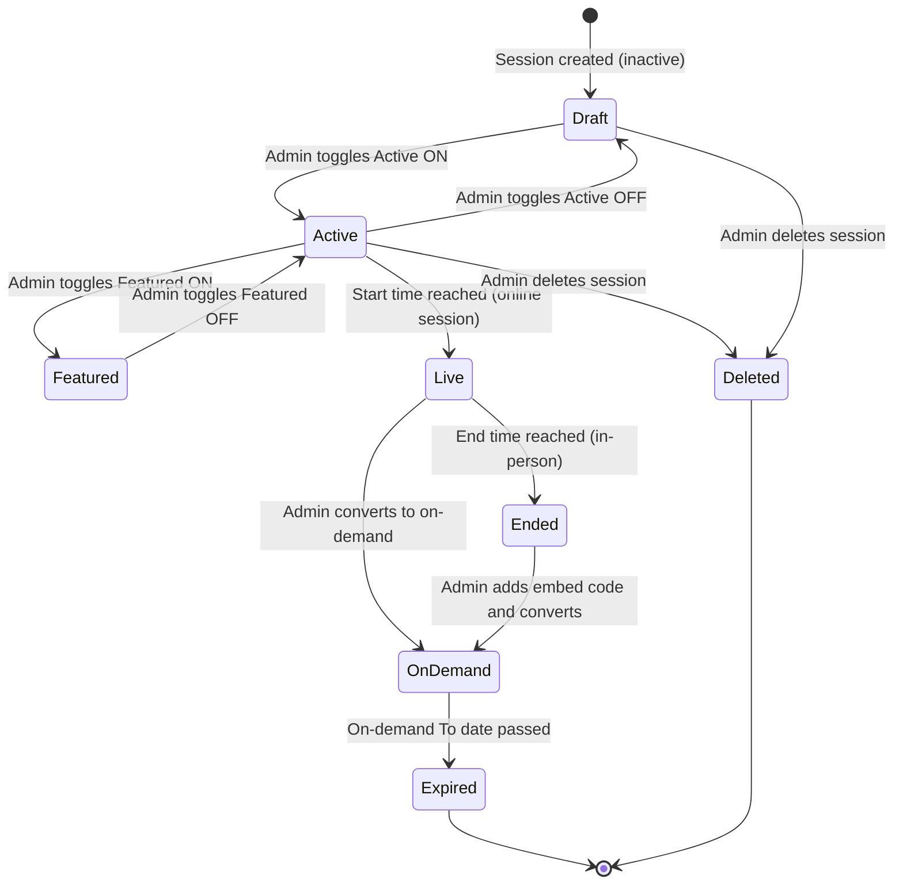
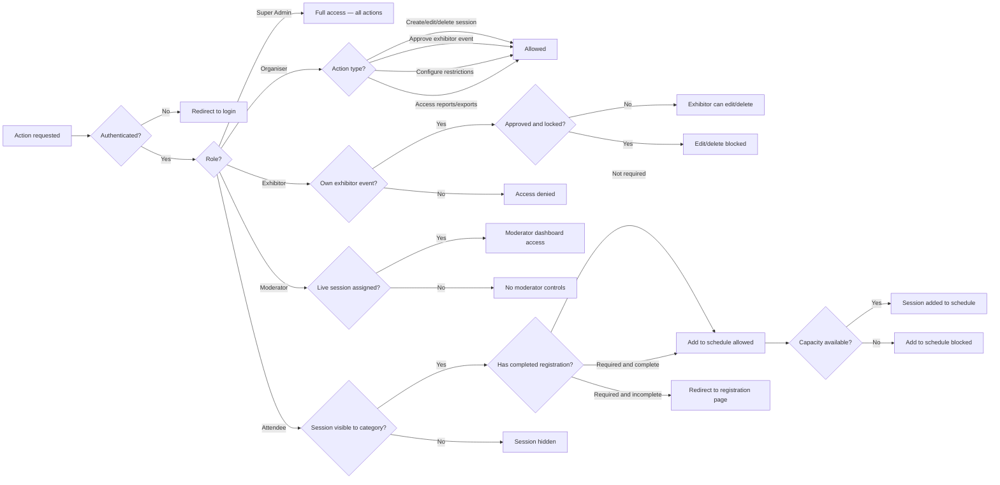

## 1. Product Overview

**Purpose.** Sessions & Speakers is ExpoPlatform's content programming module. It powers every aspect of an event's educational and conference agenda — from creating and organising sessions with speakers, moderators, tracks and tags, through to delivering live online and on-demand content, controlling attendee access via schedules and registration pages, and giving exhibitors the ability to run their own branded side-events alongside the main programme.

**Problem being solved.** Events combine a complex mix of scheduled content (keynotes, workshops, panels), speakers with public profiles, optional digital delivery (live streams, on-demand replays), exhibitor-created events and attendee-driven personal schedules. Without a unified module, organisers face fragmented spreadsheet management, no-show risk at capacity sessions, manual speaker coordination and disconnected exhibitor activities. Sessions & Speakers solves this by providing a single admin-controlled system that covers the full content lifecycle while surfacing an attendee-facing agenda that is filterable, bookmarkable and synchronisable with external calendars.

**Business value.**
- Reduces programme management overhead via bulk import, template-driven email automation and a Config page that applies settings globally across all sessions.
- Paid sessions and separate registration pages unlock additional revenue streams beyond the event ticket.
- On-demand sessions extend the content shelf-life beyond the live dates, increasing post-event engagement.
- Exhibitor events provide exhibitors with a self-service activation channel, differentiated from organiser sessions, with a configurable approval workflow.
- Personal schedule ("Add to Schedule") boosts attendee satisfaction and drives session attendance; exportable as PDF/XLS and syncable to Google/Outlook.
- Rich reporting (by booking, by session, by rating) gives organisers the data to evaluate content ROI and improve future programmes.

**Target users.** Event organisers and their programme teams who build and manage the conference agenda; exhibitors who create their own on-stand presentations; attendees who browse, bookmark and attend sessions; speakers and moderators who present and facilitate.

**User personas.**
- *Programme Manager / Event Organiser* — creates sessions, assigns speakers and moderators, configures tracks/types/tags, manages paid sessions and registration pages, reviews export reports.
- *Exhibitor* — submits exhibitor events from their frontend profile; awaits organiser approval; optionally assigns speakers/moderators to their events.
- *Attendee / Visitor / Buyer* — browses the sessions list, filters by track/type/tag, adds sessions to their personal schedule, attends live or on-demand sessions, rates sessions.
- *Speaker* — has a public profile page linked from sessions; in online sessions may be granted mic/camera rights by the moderator.
- *Moderator* — controls the live online session room (Q&A, polls, attendee management, green room); has a dedicated moderator dashboard.
- *Super Admin* — enables/disables the Sessions module in Module Management; can access and manage any event.

**Success metrics.** Sessions added to schedule per attendee; session attendance rate (booked vs attended via check-in); on-demand view count; exhibitor event submission and approval rates; paid session revenue; session rating scores; time to publish a full programme (import-to-active).

## 2. Product Scope

### Included

- Session content management: create, edit, activate, feature, delete sessions with full metadata (title, description, date, time, location, track, type, tags, language, logo, colours, sponsors, product categories, five custom filter fields, multilingual fields).
- Speaker management: speaker accounts (created individually or via participant import), speaker profiles (public pages with bio, photo, job title, company), speaker assignment to sessions.
- Moderator management: moderator accounts, assignment to sessions, moderator dashboard for live online sessions (Q&A, polls, attendee list, green room).
- Session types and tracks: configurable taxonomies, colour-coding, per-category access control for exhibitor events, usable as frontend filters.
- Subject tags: colour-coded, reorderable, usable as frontend filters on sessions and speaker profiles.
- Five additional standard session filter fields (Programme and four others) configurable in Admin Panel → Management → Sessions → Filters.
- Sessions List page (frontend): search by name/speaker/description, date picker, filter panel, recommendations/top-picks block, list/grid views, on-demand tab or integrated display.
- Session Page (frontend): full session detail, speakers/moderators/sponsors blocks, add-to-schedule / join-room / rate-session interactions, top picks.
- Speaker Page and Speakers List (frontend): public speaker profiles linked from sessions; moderators optionally shown in speaker list.
- Personal schedule ("Add to Schedule"): attendees bookmark sessions; bookings subject to configurable capacity limits and add-to-schedule limits.
- Paid sessions: per-session price and max ticket quantity; basket and payment flow; discount support; by-booking export.
- Session registration page: per-session toggle, custom form, registration-gated add-to-schedule.
- Online sessions (live streaming): three session types — Broadcast (webinar), Breakout Room (interactive, up to 250 participants), External (third-party embed/link); Hybrid support combining in-person and online.
- On-demand sessions: embed code (iframe), from/to availability window, separate or integrated tab on frontend.
- Exhibitor events: exhibitor-created sessions with organiser approval workflow; auto-approval by type; optional lock after approval; shown on sessions page via "Include Exhibitor Events in Sessions" setting; separate restriction and limit settings mirrored from sessions config.
- Session import (XLS bulk create/update including exhibitor events and multilingual fields) and speaker import (via participant import with Is Speaker = yes).
- Export reports: By Booking (paid session transactions), By Session (attendance/bookings), By Rating (participant feedback), full session setup export under Data → Import/Export → Export → Sessions.
- Session email notification templates: Session deleted, Session added to schedule, Session removed from schedule, Session changed to on-demand, Online session reminder.
- Session restrictions: booking limits, add-to-schedule limits, participant category-based visibility, type-based restrictions, track-based restrictions.
- External calendar sync: push bookmarked sessions to Google or Outlook calendar.
- Schedule page: personal schedule (My Schedule), team schedule (for exhibitor teams); list and calendar views; PDF and XLS download; "Send Agenda" for organisers; default view and default items configurable in General Settings.
- QR codes auto-generated for sessions (scannable on-site).
- Global search including sessions and speakers (stage 2, EP-13096).
- Session recommendations shown on community homepage module (EP-1084).
- Easy Entrance: QR/check-in bypass for walk-in session attendees (EP-40189).
- Ignore blocked time setting for adding speakers/moderators to exhibitor events (EP-18536).
- Hide "Ask Anonymously" toggle for Q&A (per-event setting, EP-19325).

### Excluded

- Meeting scheduling and the networking matchmaking engine (covered by Meetings & Networking).
- Payment gateway configuration and invoicing (covered by Transactions & Purchasing).
- Registration forms builder itself (covered by Forms under Marketing; Sessions references forms but does not own them).
- Round tables (covered as a separate sub-module; EP-39272 Hyve Round Tables is In Progress).
- Exhibitor product catalogue (Marketplace).
- News/blog content (separate module).
- Community groups (separate module).
- Push notifications (mobile push not documented in these Confluence pages — noted as a source gap).

## 3. User Roles

| Role | Capabilities in Sessions & Speakers | Restrictions |
| --- | --- | --- |
| **Super Admin** | Full access to all session config across all events; enable/disable Sessions module in Module Management | — |
| **Organiser (Admin)** | Create/edit/delete sessions; manage speakers, moderators, tracks, types, tags; configure restrictions, paid sessions, registration pages; approve/reject exhibitor events; access all reports and exports; send bulk agendas | Cannot act as an exhibitor (create exhibitor events on behalf of exhibitors — can import via bulk) |
| **Exhibitor** | Create, edit and submit exhibitor events from frontend profile; assign speakers/moderators to own events; view own event bookings | Cannot create regular sessions; cannot edit own exhibitor events after organiser approval if "Not editable after approval" type setting is on; cannot approve/reject |
| **Speaker** | Public profile page displayed; linked from session pages; in online sessions may have camera/mic granted by moderator | Cannot create or edit sessions; no admin panel access |
| **Moderator** | Access moderator dashboard during live online sessions; start/stop broadcast; manage Q&A, polls, attendee list; green room access | No session creation rights; no admin panel access beyond moderator dashboard |
| **Attendee / Visitor / Buyer** | Browse sessions list; filter/search; add sessions to personal schedule; join online sessions; watch on-demand sessions; rate sessions; view speaker profiles; sync schedule to external calendar | Cannot add sessions exceeding booking/schedule limits; cannot see sessions restricted to other participant categories; must complete registration page (if enabled) before adding to schedule |
| **Team Member (Exhibitor staff)** | Same as Attendee for schedule and session viewing; also appears in Team Schedule under exhibitor profile | No exhibitor event creation unless granted at category or individual level |

> [!INFO] The ability for exhibitors to create exhibitor events is not on by default. It must be granted by the organiser at the exhibitor category level or at the individual exhibitor level in the admin panel.

## 4. Feature Inventory

#### Basic Session Management

**Description.** The core admin workflow for creating and maintaining sessions. Accessed via Admin Panel → Management → Sessions.

**Why it exists.** Organisers need a single place to build and maintain the event programme — adding sessions with all relevant metadata, activating them for attendees, featuring priority content and managing the full session record over the event lifecycle.

**User value.** Programme managers can build a rich, structured agenda without requiring development effort; changes are reflected immediately on the frontend after saving.

**Functional logic.** Each session record stores: Title (multilingual), Description (multilingual), Date, Start and End Time, Location (predefined list or "Other" with optional URL), Track (one), Type (one), Tags (multiple), Language, Logo, Background, Text Colour, Sponsors (linked exhibitor profiles), Product Categories, five custom filter fields, Active/Inactive status, Featured status. Price and Max Ticket Quantity for paid sessions. Online settings (type: Broadcast/Breakout/External/On-Demand), Embed code, Green Room toggle, per-participant defaults (disable video, mic, Q&A, polls, chat, raise hand, participant count, user list, counter). Registration toggle + form + image. Booking/schedule limits. Visibility restriction. Session ID auto-assigned; can be used for import-based updates.

**Preconditions.** Tracks, types and tags must be configured before being assigned to a session. Speaker/moderator accounts must exist before assignment.

**Trigger conditions.** Admin clicks Add New Session, or edits an existing session record.

**Processing logic.** Sessions are saved in Draft/Inactive state until the Active toggle is turned on. Featured sessions appear in Top Picks on the frontend (Active + Featured required). Deleting a session triggers the "Session was deleted" notification email to all users who had it in their schedule.

**Outputs.** Session record saved; session visible on frontend sessions list (when active); email notifications sent as applicable.

**Dependencies.** Tracks, Types, Tags, Speakers, Moderators, Sponsors (exhibitor profiles), Forms (for registration page), Payments module (for paid sessions), Module Management (Sessions must be enabled).

**Configurations.** Admin Panel → Management → Sessions → Config (Sessions section) governs many global behaviours including show descriptions in list, show on-demand in all sessions list, allow other locations, tracks as filters, hide recommendations, ignore blocked time for speakers/moderators.

**Validation rules.** Title is mandatory. Date and Start Time are mandatory for scheduled sessions. For paid sessions, price must be a positive value; max ticket quantity must be a positive integer. "Other" location custom text field is required when "Other" selected as location for exhibitor events (EP-19915).

**Permissions.** Organiser role and above for admin panel management. Exhibitors manage their own exhibitor events from the frontend.

**Error handling.** If a session import row is missing a mandatory field, that row is skipped and the import report flags the error. If max tickets are reached, the Add to Schedule / Add to Cart button is hidden.

**Edge cases.** Changing a session date/time after speakers/moderators have been assigned may create a blocked-time conflict if "Ignore blocked time" is off — speakers/moderators become marked as unavailable (EP-18536). Deleting a track removes it from all sessions where it was applied.

---

#### Speaker Management

**Description.** Creation and maintenance of speaker accounts and public profiles, assignment of speakers to sessions.

**Why it exists.** Speakers are a primary draw for attendees at conference events. Their profiles must be publicly discoverable and linked directly from session pages.

**User value.** Attendees can explore speaker backgrounds and find sessions by their preferred speakers. Speakers are represented professionally with photo, bio, job title and company.

**Functional logic.** Speakers are created as participant accounts with "Is Speaker" = yes, either manually or via the participant import file. Admin Panel → Management → Sessions → Speakers lists all speaker accounts. Speaker profiles (frontend at /newfront/participants?page=speakers) display photo, bio, job title, company, and linked sessions. Speakers with INACTIVE account status can be configured to still appear on the frontend via the "Display Inactive Speakers on Frontend" setting (EP-10629). Multiple speakers can be assigned to a single session. During session import, speaker IDs (participant IDs) are entered in the Speakers column separated by commas; via API separated by double pipes.

**Preconditions.** Speaker must exist as a participant account or be created via import.

**Processing logic.** If a speaker is assigned to a session and the session is deleted, the "Session deleted" notification email is sent to that speaker. Speakers do not receive unique rights for on-demand sessions.

**Outputs.** Speaker profile page live on frontend; linked from assigned sessions; visible in Speakers List; filterable by tag.

**Permissions.** Organiser creates/manages speakers. Speakers themselves have no admin panel access; their profile is managed by admin or potentially self-managed via their participant account.

**Edge cases.** If a speaker's account is linked to an exhibitor event for which the time overlaps with another blocked item, and "Ignore blocked time for Speakers/Moderators" is off, the speaker will appear as unavailable for that slot (EP-18536). Speaker export is processed via SQS for stability on large datasets (EP-1118).

---

#### Moderator Management

**Description.** Creation and maintenance of moderator accounts, assignment to sessions, and access to the live moderator dashboard.

**Why it exists.** Online sessions require active facilitation — managing Q&A, polls, attendee behaviour and broadcast controls. A dedicated moderator role separates facilitation from presenting.

**User value.** Moderators can ensure session quality and engagement without organisers having to be present in every session room. Moderators get purpose-built tools unavailable to regular attendees.

**Functional logic.** Admin Panel → Management → Sessions → Moderators lists all moderators. New moderators added by email (links existing user account or creates new). Moderator dashboard (live sessions only) provides: start/stop broadcast, Q&A management (respond/mark answered/dismiss), poll management, attendee list (filter by raised hands or questions), green room private chat, analytics (viewer count, engagement, demographics), session files and presenter bios. Settings to disable Q&A, polls etc. per session. For breakout rooms, only the moderator can grant mic/camera/screen share access to participants. Moderators optionally shown in the Speakers List page via "Show Moderators in Speaker List" config setting. Speaker profile page shows both Sessions block and Exhibitor Events block for that moderator.

**Preconditions.** Moderator must be assigned to session before the session goes live.

**Outputs.** Moderator assigned to session; email notification sent to moderator; moderator dashboard accessible during live session.

**Error handling.** If no moderator is assigned to an online breakout session, participants can join but will have no one to grant mic/camera access.

---

#### Session Types

**Description.** A configurable taxonomy for classifying sessions by their format or content style (e.g. Workshop, Panel, Keynote, Presentation). Also used to define exhibitor event-specific settings.

**Why it exists.** Attendees use types to filter for the kind of content they want to attend. Organisers use types to apply different behaviour rules to subsets of sessions.

**Functional logic.** Admin Panel → Management → Sessions → Types. Each type has a name and optional configuration. Type settings apply exclusively to exhibitor events and control: whether the exhibitor event requires approval (Auto approved toggle), whether it is locked after approval (Not editable after approval toggle), whether organisers can set custom questions for exhibitors to answer at submission time (EP-26093). Types appear as filter options on the frontend sessions page. Organisers can reorder types via drag-and-drop (affects filter display order).

**Configurations.** Per type: Auto approved (default off); Not editable after approval (default off); Custom questions for exhibitor submission security review.

**Permissions.** Organiser and above.

---

#### Session Tracks

**Description.** Topic or theme groupings for sessions, displayed with colour-coding on session cards and usable as frontend filters.

**Why it exists.** Multi-track conferences need a visual and filterable way for attendees to follow a thread through the programme.

**Functional logic.** Admin Panel → Management → Sessions → Tracks. Each track has a Name (multilingual) and a Track Colour. Track settings control which exhibitor categories can access this track when creating exhibitor events. Tracks appear on session and event cards. Can be enabled/disabled for exhibitor events globally in Config. "Tracks as Part of Content Session Filters" Config toggle controls whether Track appears in the Sessions List filter panel. If a track is deleted, it is removed from all sessions/events where it was applied.

**Permissions.** Organiser and above.

---

#### Subject Tags

**Description.** Freeform, colour-coded labels attached to sessions allowing keyword-level filtering and discovery.

**Why it exists.** Tracks and types provide coarse categorisation; tags allow fine-grained topical labelling (e.g. "AI", "Sustainability", "Beginner-friendly") that supports attendee discovery.

**Functional logic.** Admin Panel → Management → Sessions → Subject Tags. Create, edit, delete tags; each has a name and a colour. Tags are attached to sessions in the session edit page (one or many). Attendees filter by tags on the Sessions List page and on Speaker Profile pages. Tags also included in session import/export.

**Permissions.** Organiser and above.

---

#### Sessions List (Frontend)

**Description.** The attendee-facing page listing all active sessions for the event, with rich filtering, search and browsing capability.

**Why it exists.** Attendees need to discover the right sessions quickly across a potentially large programme spanning multiple days, tracks and formats.

**Functional logic.** URL: `/newfront/sessions`. Key elements: Search by session name, speaker name, or description keyword. Date picker for multi-day events. Recommendations block (AI/activity-based; collapsible; can be hidden globally via Config). Top Picks block (Active + Featured sessions). Filters panel (Tracks, Type, Tags, Format, Product Categories, up to 5 custom filter fields). Session cards show title, time, speaker(s), moderators, sponsors, location and optionally description. Switch between list and grid view. On-demand sessions shown either in a separate tab (if "Show On-Demand Sessions in All Sessions List" is off) or integrated into the main list. Exhibitor events shown if "Include Exhibitor Events in Sessions" is enabled; a frontend filter allows attendees to toggle between All, Sessions Only, Exhibitor Events Only.

**Configurations managed in Sessions → Config:** Show Session Descriptions in Session List; Show On-Demand Sessions in All Sessions List; Allow Other Location & Manage Location List; Hyperlinking Custom Locations; Allow Address; Show Moderators in Speaker List; Tracks as Part of Content Session Filters; Hide Recommendations; Include Exhibitor Events in Sessions.

**Error handling.** If a session has reached its booking capacity, the Add to Schedule button is hidden or replaced with a "Full" state.

---

#### Session Page (Frontend)

**Description.** The detail page for an individual session, containing full session information and attendee interaction controls.

**Why it exists.** Attendees need comprehensive information about a session before deciding to attend, and need one-click access to join or book.

**Functional logic.** Key elements: Session Info block (logo, title, date, time, location, interaction buttons). Description. Speakers Block (photo, job title, company name, link to speaker profile). Moderators Block. Sponsors block (exhibitor logos and links; interaction buttons for exhibitors with profiles — request meeting, message, favourite; redirect to company site for non-profiled sponsors). Top Picks (related sessions based on theme/engagement). "Add to My Schedule" / "Add to Cart" (paid) / "Join Room" (online live) / "Rate Session" (post-session). Show Recommendations section expanded by default (EP-24107).

**Dependencies.** Speaker profiles, exhibitor/sponsor profiles, online session service, payment basket.

---

#### Personal Schedule ("Add to Schedule")

**Description.** The mechanism by which attendees bookmark sessions into their personal schedule (My Schedule page), subject to configurable limits.

**Why it exists.** Attendees at multi-session events need a personal planner to manage their time. Organisers need capacity control to avoid overcrowding.

**Functional logic.** Clicking "Add to My Schedule" (or completing session registration if required) adds the session to the user's My Schedule at /newfront/profile/schedule. The schedule displays bookmarked sessions, confirmed meetings and optional blocked time. Views: list or calendar (default configurable per event). Default items shown (All, Diary, Optional) configurable in General Settings → Schedule Settings (EP-20058). Schedule view by default (List or Calendar) configurable per event (EP-20489). PDF download (EP-20214) and XLS download (EP-20775) available from schedule page. "Send Agenda" button in admin panel allows organiser to send PDF/XLS agenda to individual participants or filtered lists (EP-40075). External calendar sync to Google or Outlook (EP via General Settings). QR code on session used for on-site check-in (Easy Entrance, EP-40189) — reduces entrance bottleneck for walk-in attendees.

**Booking limits.** Admin Panel → Management → Sessions → Config → Booking Limits: Max Bookings per User (across all sessions); per-session Max Ticket Quantity (for paid sessions). When limit reached, Add to Schedule button hidden.

**Add to Schedule limits.** Separate from booking limits; controls how many sessions a user can add to their schedule. Configured per event under Session Restrictions → Add to Schedule Limits.

**Error handling.** If user attempts to add a session beyond their schedule limit, the system blocks and displays an appropriate message. If a session registration page is enabled and the user hasn't completed registration, they are redirected to the registration page first.

---

#### Session Registration Page

**Description.** An optional per-session registration page that gates the "Add to Schedule" / "Join Room" action behind a custom form.

**Why it exists.** Some sessions — particularly webinars or workshops — require pre-registration for capacity management, attendee qualification or data collection.

**Functional logic.** Toggle "Enable Registration page" on the session edit page. When enabled, two additional fields appear: Form (select from Marketing → Forms) and an optional header image for the registration page. When attendees click Add to Schedule, they are redirected to the session registration page where they must complete the form. Upon successful form submission, the session is added to their schedule. Organiser can review form responses in the Forms section of the Marketing module. If event reaches capacity, Add to Schedule button is no longer shown regardless of registration status.

**Permissions.** Organiser enables per-session. Attendees complete the form.

**Edge cases.** If the selected form is later deleted, the registration page will lose its form — the session will still have registration enabled but the form content will be absent.

---

#### Paid Sessions

**Description.** Sessions that require attendees to purchase a ticket before they can be added to the schedule.

**Why it exists.** Organisers and exhibitors may charge for premium content, workshops or exclusive sessions, creating an additional revenue stream.

**Functional logic.** In session edit: Prices section — Session Price (ex-VAT) and Max Ticket Quantity. Prices including VAT display in the event's configured currency. When a user clicks Add to Schedule for a paid session, the session is added to their basket rather than directly to their schedule. User proceeds through the payment checkout where discounts (configured in Admin Panel → Registration Settings → Discounts) are applied. Payment processed via the Payments module (Admin Panel → Event Setup → Payments). When max tickets are reached, the Add to Schedule / Add to Cart button is hidden.

**Reports.** By Booking export (Admin Panel → Management → Sessions → Reports → By booking): individual transaction records with payment status, amount, discount, VAT, total, participant details.

**Dependencies.** Payments module; Discounts module; basket/checkout flow (EP-26932 Payment page upgrade for participants).

---

#### Online Sessions

**Description.** Sessions delivered live over the internet using ExpoPlatform's built-in video conferencing infrastructure, with three session sub-types: Broadcast, Breakout Room, and External.

**Why it exists.** Hybrid and online-only events require digital delivery of sessions. The platform must support both webinar-style (one-to-many) and interactive (many-to-many) session formats.

**Functional logic.** Three online session types:
- **Broadcast (Webinar):** One-to-many live stream. Presenter speaks; attendees watch and interact via Q&A, chat, polls. Moderator controls broadcast start/stop, Q&A moderation, attendee management.
- **Breakout Room:** Interactive video room, up to 250 participants. Three roles: Participant, Speaker, Moderator. Moderator controls mic/camera/screen-share access for all. Supports screen share with audio (select tab + "Share tab audio"). Customisable text colour and background.
- **External:** Embed code (iframe) from a third-party streaming provider (e.g. Workcast) or an external link. Workcast integration supports Header and Body Script fields.

Session-level per-participant defaults can disable: video, mic, raise hand, participant count, Q&A, polls, chat, counter, user list.

Green Room: private communication channel between moderator and presenters before/during broadcast.

Hybrid sessions combine in-room physical attendance with online broadcast (EP-1706 Hybrid Sessions).

**Preconditions.** Sessions module enabled; online session type configured; for breakout rooms, moderator assigned.

**Edge cases.** Online meeting links are not included in the external calendar sync entry — attendees must join from within the app/website.

---

#### On-Demand Sessions

**Description.** Sessions available for attendees to watch at any time within a defined availability window, via an embedded video player.

**Why it exists.** Not all content can be consumed live. On-demand extends reach beyond the event dates and captures attendees who could not attend the live session.

**Functional logic.** Create a session with type "On-Demand". Paste embed code (iframe only) for any video player. Optionally add a custom text on the welcome screen. Set From and To dates for the availability window. Make Active and save. Once the To date has passed, the session disappears from the frontend on-demand page. On-demand sessions can be shown in a separate tab on the Sessions List page (default), or integrated into the main sessions list if "Show On-Demand Sessions in All Sessions List" is enabled. When a live session ends and is converted to on-demand, the "Session Changed to On-Demand" notification email is sent to users who had the session in their schedule.

**Speakers/Moderators.** Speakers and moderators have no unique rights for on-demand sessions.

---

#### Exhibitor Events

**Description.** A parallel programme of events created by exhibitors from their frontend profile, subject to organiser approval, and optionally shown alongside regular sessions.

**Why it exists.** Exhibitors want to run their own brand activations, product demos and hosted sessions during the event. A governed self-service flow removes manual organiser effort while maintaining content quality control.

**Functional logic.** Ability to create exhibitor events is granted by organiser at the exhibitor category level or individual exhibitor level. Exhibitors create events from their frontend profile (not admin panel). Key differences vs regular sessions: created by exhibitor, requires organiser approval (unless Auto Approved type setting is on), not automatically in speaker/moderator schedule, only editable by exhibitor before approval (unless overridden). After submission, organiser approves or rejects in Admin Panel. If "Not editable after approval" type setting is on, exhibitor cannot edit or delete after approval. Exhibitor events can be included on the Sessions List page via "Include Exhibitor Events in Sessions" setting; a frontend filter allows All / Sessions Only / Exhibitor Events Only toggle (EP-26029). Tracks, Types, Tags and Sponsors are shared with regular sessions. Exhibitor events can have their own global limits (schedule limits, booking limits) mirrored from Sessions Config (EP-13539). Multilingual support for exhibitor events (EP-23529). Exhibitor event import: fill Exhibitor ID in session import file; if blank, treated as regular session. Exhibitor events imported via bulk import are always uploaded with Approved status. Autoapproval mechanism can be run as an algorithm batch (EP-46110) for complex slot allocation scenarios. Custom questions (security review) can be required from exhibitors at submission (EP-26093). Exhibitor staff "Not editable after approval" ensures content integrity post-approval (EP-15676). Sessions/exhibitor events reported offensively can be flagged.

**Edge cases.** Child exhibitor ID can be set during import to map event to child exhibitor. Contact Person (team member) can also be mapped via participant ID. If a speaker or moderator's blocked time conflicts with the exhibitor event slot, and "Ignore blocked time" is off, the speaker/moderator is shown as unavailable (EP-18536).

---

#### Session Import and Export

**Description.** Bulk data operations for importing sessions and speakers into the platform, and exporting session reports.

**Why it exists.** Large events have hundreds of sessions and speakers that cannot be created one-by-one. Import accelerates programme setup; exports provide operational and financial reporting.

**Import functional logic.** Admin Panel → Data → Import/Export → Import. Download example XLS template. Mandatory fields: Title, Track, Type, Language, Date. Optional: Description, Location, Tags, Product Categories, Logo, Background, Text Colour. Paid session fields: Session Price, Max Ticket Quantity. Multilingual: separate columns per language variant (Title eng, Title fr, etc.); mapped during upload via field mapping popup. Speakers/moderators added by participant ID in Speakers/Moderators columns (comma-separated for import; double pipes for API). Session ID must be populated for updates; blank = new session. Exhibitor ID must be populated for exhibitor events; blank = regular session. Five custom filter fields supported (EP-15375). "Other" location text field supported for exhibitor events (EP-19915). Columns containing yes/no for toggles; numeric values for IDs. Speaker import via Participants import with Is Speaker = yes.

**Export functional logic.** Three reports under Admin Panel → Management → Sessions → Reports:
- **By Booking:** Transaction-level data for paid sessions (Payment #, Date, Type, Status, Amount, Discount, VAT, Total, participant details, sessions purchased).
- **By Session:** Session-level attendance data (Sessions tab: Name, Track, Tag, Type, Date, Time, Booked, Attended, Session ID; All Registrants tab: per-person booking/attendance; individual session tabs; Attended list from check-in).
- **By Rating:** Session feedback data (per-session tabs with participant name, company, email, rate, comment).

A full session configuration export (Admin Panel → Data → Import/Export → Export → Sessions) produces an XLS with all session metadata including online settings, registration settings, limitations, content files, dates (creation, last edit), and five filter fields in JSON format. Sessions and speakers export reworked via SQS for stability on large datasets (EP-1124, EP-1118).

**Permissions.** Organiser role and above.

---

#### Session Notifications and Reminders

**Description.** Automated email notifications sent to users on schedule-related events, configurable via email template builder.

**Why it exists.** Keeping attendees, speakers and moderators informed about changes to their scheduled sessions reduces no-shows and prevents confusion.

**Functional logic.** Templates managed under Admin Panel → Management → Sessions → Templates. Five template types:
- **Session Added to Schedule:** sent when user adds session to their schedule.
- **Session Removed from Schedule:** sent when user removes session from their schedule.
- **Session Deleted:** sent to all users who had the session in their schedule when organiser deletes it (recipients include speakers and moderators).
- **Session Changed to On-Demand:** sent when a live session is converted to on-demand status.
- **Online Session Reminder:** sent before an online session starts.

Each template has: Subject, From Name, From Email, Reply-to. Standard variables available: Online Type, Speakers list, Moderators list, Sponsors list, Price, VAT, Total Price, Session Name, Description, Date, Time, Location, Language, Type, Track, Tags. Price variables do not include currency symbol — must be added manually. Disabling a template suppresses all sends for that trigger. If template body is not set up, no email is sent even if the Disable toggle is off.

Send Agenda: Organiser can send PDF/XLS agenda to individual participants or filtered lists via "Send Agenda" in participant profile or group level (EP-246, EP-40075). In-app: users can download schedule from their portal. Download Schedule in app triggers email with PDF attachment (and XLS if enabled) (EP-20214).

---

#### Session Restrictions

**Description.** A set of controls that limit how many sessions attendees can book or add to their schedule, and which sessions are visible or accessible to which participant categories.

**Why it exists.** Capacity management, fairness and content access control are critical for larger events. Paid capacity limits protect revenue; category restrictions protect premium content.

**Functional logic — Booking Limits.** Admin Panel → Management → Sessions → Config → Booking Limits. Sets the maximum number of paid session tickets a user can purchase.

**Functional logic — Add to Schedule Limits.** Admin Panel → Management → Sessions → Session Restrictions → Add to Schedule Limits. Sets the maximum number of sessions a user can add to their schedule globally, preventing schedule over-booking.

**Functional logic — Participant Category-based Restrictions (Visibility).** Per session: set Visibility to specific participant categories. Users not in the permitted categories cannot see the session on the frontend. Tooltip for Visibility can be customised (shown to users who don't meet the criteria).

**Functional logic — Type-based Restrictions.** Per session type: additional settings applicable only to exhibitor events (see Session Types feature).

**Functional logic — Track-based Restrictions.** Admin Panel → Management → Sessions → Config → Session Restrictions → Track-based. Restricts which exhibitor categories can select specific tracks when creating exhibitor events (configured per track in Track Settings).

> [!INFO] Booking limits and add-to-schedule limits are separate settings. Booking limits apply to paid ticket purchases; add-to-schedule limits apply to free session bookmarks.

## 5. User Stories Mapping

| Story ID | Type | Summary | Acceptance Criteria / Key Points | Related Feature | Status |
| --- | --- | --- | --- | --- | --- |
| EP-246 | Story | Send My Agenda | Participants download agenda; organiser sends PDF/ICS individually or to filtered sets; agenda includes meetings | Personal Schedule / Notifications | COMPLETE |
| EP-272 | Story | QR Codes for Sessions and On-Demand | Auto-generate QR codes for sessions; scannable on-site | Session Page / Easy Entrance | COMPLETE |
| EP-1084 | Story | Add sessions section to community homepage | Conference session module (upcoming + replay) on homepage | Sessions List / On-Demand | COMPLETE |
| EP-1118 | Story | Speakers export rework | Move speakers export to SQS for speed and stability | Speaker Management / Export | COMPLETE |
| EP-1124 | Story | Sessions export rework | Move sessions export to SQS for speed and stability | Session Import/Export | COMPLETE |
| EP-1125 | Story | Groups part 2 — Sessions tab | Sessions tab in community groups showing attached sessions | Sessions List | COMPLETE |
| EP-1130 | Story | Android Sessions redesign | Redesigned session cards and list page on Android | Sessions List (Mobile) | COMPLETE |
| EP-1706 | Story | Hybrid Sessions | Polls for desktop/mobile for moderator and participant in hybrid sessions | Online Sessions / Moderator | COMPLETE |
| EP-10629 | Story | Allow display of inactive speakers on frontend | New setting to show speakers regardless of Active/Inactive status | Speaker Management | COMPLETE |
| EP-11456 | Story | Integration with ASP events system | Pull Exhibitor, Sessions, Speaker data from ASP API | Session Import/Integration | COMPLETE |
| EP-11663 | Story | Changes from IMEX part 1 | Exhibitor events as separate Marketplace tab; global setting to turn off tracks for events; public API for adding exhibitor event to schedule | Exhibitor Events / Restrictions | COMPLETE |
| EP-12216 | Story | Add Session Id column to By Session report | Session ID column added to Favorited Session Report | By Session Export | COMPLETE |
| EP-12365 | Story | Additional standard filter fields for sessions | 5 new filter sub-tabs (Programme + 4 others) in Sessions Filters; backend only | Session Types/Filters/Import | COMPLETE |
| EP-12563 | Story | Make tracks part of content session filters | Checkbox in Config to show/hide tracks in filter area | Session Tracks / Sessions List | COMPLETE |
| EP-13096 | Story | Global search stage 2 | Search includes Sessions and On-Demand, Speakers | Sessions List / Speaker Profiles | COMPLETE |
| EP-13539 | Story | Changes from IMEX part 2.2 | Copy global limits settings from Sessions Config to Exhibitor Events | Exhibitor Events / Restrictions | COMPLETE |
| EP-14321 | Story | My Exhibitor Events page for Mobile | Mobile-only page showing schedule filtered by exhibitor events | Exhibitor Events / Schedule | COMPLETE |
| EP-14378 | Story | Show all sponsored sessions under exhibitor profile | Cosmetic fix: show all sponsored sessions with correct cursor | Session Page / Exhibitor Events | COMPLETE |
| EP-14481 | Epic | Sessions API v2 | Sessions REST API v2 | API / Integration | COMPLETE |
| EP-15375 | Story | Add 5 filters to session import | Five custom filter fields importable via XLS | Session Import | COMPLETE |
| EP-15676 | Story | Exhibitor Events not editable after approval | Per-type toggle: exhibitor cannot edit/delete after approval | Exhibitor Events / Types | COMPLETE |
| EP-18536 | Story | Speakers/moderators and blocked time | Setting to ignore blocked time when adding speakers/moderators to exhibitor events | Speaker/Moderator Management | COMPLETE |
| EP-19325 | Story | Hide Ask Anonymously on session Q&A | Per-event setting to disable anonymous Q&A | Online Sessions / Moderator | COMPLETE |
| EP-19915 | Story | Text field for Other location in session import and API | Custom location text field for exhibitor events in import and API | Session Import | COMPLETE |
| EP-20058 | Story | Define default items for Schedule | Radio setting: Show items by default — All / Diary / Optional | Personal Schedule | COMPLETE |
| EP-20214 | Story | Download Schedule in app | Download Schedule button in app → email with PDF attachment | Personal Schedule | COMPLETE |
| EP-20489 | Story | Add ability to choose default schedule view (WEB) | Radio setting: Schedule view by default — List / Calendar | Personal Schedule | COMPLETE |
| EP-20775 | Story | Download My Schedule in XLS format | Personal blocked time included in PDF and XLS agenda export | Personal Schedule | COMPLETE |
| EP-22560 | Story | Export My Agenda PDF file changes | Rename "Participants from 3rd party" to "Participants from other side" in PDF | Personal Schedule | COMPLETE |
| EP-23521 | Story | Autoapproval of Exhibitor Events | Per-type Auto Approved toggle; all events of that type auto-approved on submission | Exhibitor Events / Types | COMPLETE |
| EP-23529 | Story | Exhibitor Events multilanguage | Multilingual fields for exhibitor events matching sessions implementation | Exhibitor Events | COMPLETE |
| EP-23885 | Story | Regroup Config page of Sessions | Restructure /admin/events/config to separate Sessions from Exhibitor Events settings | Session Configuration | COMPLETE |
| EP-24107 | Story | Default state of Show Recommendations as Open | Recommendations section expanded by default on session overview | Sessions List | COMPLETE |
| EP-26029 | Story | Include exhibitor events in sessions | Checkbox in Config + frontend filter toggle (All / Sessions Only / Exhibitor Events Only) | Exhibitor Events / Sessions List | COMPLETE |
| EP-26093 | Story | Events security: organiser sets questions for exhibitor | Custom questions required at exhibitor event submission; answers in admin panel event details | Exhibitor Events / Types | COMPLETE |
| EP-26932 | Story | Payment page upgrade for participant | Upgraded basket/payment page for session ticket purchase | Paid Sessions | COMPLETE |
| EP-27396 | Story | Sessions integration with DWTC CRM | Pull/push sessions data with DWTC CRM API | Integration | COMPLETE |
| EP-27790 | Story | Search in lists | Search in speakers/moderators lists for large datasets | Speaker/Moderator Management | COMPLETE |
| EP-36095 | Story | Column for Attendee Names in Team Schedule Export | Add attendee names column to team schedule XLS export | Personal Schedule / Exhibitor Events | COMPLETE |
| EP-39272 | Epic | Hyve Round Tables improvements | Registration process, table generation, topic allocation, confirmation process | Round Tables (adjacent) | In Progress |
| EP-40075 | Story | Send Agenda improvement | Admin clarity on Send Agenda action; ability to specify team members as recipients | Notifications / Schedule | COMPLETE |
| EP-40189 | Story | Easy Entrance for Sessions | QR-based walk-in check-in for sessions to reduce entrance bottleneck | Personal Schedule / Check-in | COMPLETE |
| EP-46110 | Epic | New autoapproval mechanism for Exhibitor Events | Approval Algo Setup popup; run algorithm across selected exhibitor events | Exhibitor Events | COMPLETE |
| EP-49483 | Epic | Session Calendar View (mobile) | Toggle between list and calendar view in mobile app sessions | Sessions List (Mobile) | In Progress |

## 6. End-to-End Workflows

### Organiser — Build and Publish a Programme

### Attendee — Discover and Attend a Session

### Happy Path
Organiser imports sessions via XLS, configures tracks/types/tags, assigns speakers, activates sessions. Attendee browses, filters by track, clicks session, clicks "Add to My Schedule" (no restrictions, capacity available). Session appears in My Schedule. Attendee receives "Session Added to Schedule" email. On event day, attendee joins online session via "Join Room" button or scans QR on-site. Post-session, rates the session. Organiser downloads By Session export to review attendance.

### Alternate Path
Session has a registration page enabled. Attendee clicks "Add to Schedule" and is redirected to the registration form. Completes form, is redirected back and session is added to schedule. Organiser reviews form responses in Marketing → Forms.

### Exception Path
Session reaches max booking capacity. "Add to Schedule" button is hidden. Attendee cannot book. Organiser can increase max ticket quantity or add additional session.

### Recovery Path
Organiser deletes a session. All users who had the session in their schedule receive the "Session was deleted" notification email. If the content will be delivered online, organiser creates a new session and uses marketing email to notify affected users with the new session link.

## 7. Business Rules Engine

| Rule | Condition | Exception / Priority | Conflict Resolution |
| --- | --- | --- | --- |
| Exhibitor ID required for exhibitor event import | If Exhibitor ID blank in session import file | None — blank Exhibitor ID silently creates a regular session instead | Always populate Exhibitor ID for exhibitor events |
| Registration page gates Add to Schedule | If session has "Enable Registration page" toggled on | None — registration is mandatory before adding to schedule | User must complete the form |
| Max ticket quantity hides Add to Cart / Add to Schedule | When current bookings = Max Ticket Quantity for paid sessions | Organiser can increase the max quantity in admin panel | Increase capacity or create additional session slot |
| Add to Schedule limit enforced globally | When user's total schedule bookings = configured Add to Schedule Limit | Organiser can increase the global limit or exclude specific sessions | User must remove a session to add another |
| Category-based visibility restricts session discovery | Session has Visibility set to specific participant categories | Attendees not in the permitted category cannot see the session | Organiser adjusts permitted categories or moves attendee to correct category |
| Not editable after approval locks exhibitor event | Exhibitor event type has "Not editable after approval" enabled AND event status is Approved | Organiser can still edit via admin panel | Exhibitor must contact organiser for changes |
| Auto-approved type bypasses organiser approval | Exhibitor event submitted with a type configured as "Auto Approved" | None — event is published directly | Organiser can disable Auto Approved setting for that type if abuse occurs |
| Tracks deleted propagate immediately | Admin deletes a track | All sessions/events using the deleted track lose their track assignment | Plan track taxonomy before import; cannot be undone without re-assigning |
| On-demand session expires on To date | Today's date is past the configured To date for an on-demand session | None — session is no longer visible on frontend | Extend the To date if needed |
| Blocked time conflicts with speaker/moderator assignment | "Ignore blocked time for Speakers/Moderators" is off AND speaker/moderator has a conflicting blocked slot | If setting is on, conflict is ignored | Turn on "Ignore blocked time" or change session slot |
| Speaker/moderator blocked if removed after time change | Exhibitor event time changes after speaker/moderator already assigned, creating conflict | System marks speaker/moderator as unavailable | Organiser or exhibitor must resolve the conflict |
| Session registration gating overrides capacity check order | Session has both registration page and max capacity | User must register first; capacity check applies to registrants | Registration does not reserve capacity until form is submitted |

## 8. Data Model

**Inputs.** Session metadata from admin/import; participant registration data; payment events from Transactions module; form responses from Forms/Marketing; speaker/moderator assignments; exhibitor profile data.

**Outputs.** Frontend session pages, sessions list, speaker profiles; schedule bookings; email notifications; export reports (by booking, by session, by rating, full sessions XLS); QR codes; calendar sync entries.

**Lifecycle states for a Session:**

**Exhibitor Event specific states.** Draft → Submitted (by exhibitor) → Approved/Rejected (by organiser) → Published (Active). If Auto Approved type: Submitted → Approved automatically.

## 9. Permissions Matrix

| Role | Create Session | Edit Session | Delete Session | Approve Exhibitor Event | Add to Schedule | Access Reports | Configure Restrictions | Moderator Dashboard |
| --- | --- | --- | --- | --- | --- | --- | --- | --- |
| Super Admin | Yes | Yes | Yes | Yes | Yes | Yes | Yes | Yes |
| Organiser | Yes | Yes | Yes | Yes | Yes | Yes | Yes | No |
| Exhibitor | Own events only | Own events (pre-approval) | Own events (pre-approval) | No | Yes | No | No | No |
| Speaker | No | No | No | No | Yes | No | No | No |
| Moderator | No | No | No | No | Yes | No | No | Yes (assigned sessions) |
| Attendee / Visitor / Buyer | No | No | No | No | Yes (subject to limits/restrictions) | No | No | No |
| Team Member | No | No | No | No | Yes | No | No | No |

## 10. Integrations

| Integration | Purpose | Trigger | Data Exchanged | Failure Handling | Retry | Security |
| --- | --- | --- | --- | --- | --- | --- |
| ASP Events System (EP-11456) | Pull exhibitor, session and speaker data from external event management system | Scheduled or manual trigger | Exhibitor profiles, session records, speaker accounts via ASP public API | Errors logged; manual re-trigger available | Manual | API key authentication per ASP documentation |
| DWTC CRM (EP-27396) | Bidirectional session data sync with Dubai World Trade Centre CRM | CRM-triggered or scheduled | Session records mapped via field mapping sheet; participant IDs | Connection errors logged | Manual | API credentials per DWTC API documentation |
| Workcast (via embed) | Third-party live streaming for online sessions | Embed code inserted into session; attendee joins via session page | Embed code (Header + Body script fields); no direct API | Workcast player errors shown in embed area | N/A | Embed code security managed by Workcast |
| External Calendar (Google / Outlook) (EP-1038778369) | Push bookmarked sessions and confirmed meetings to user's personal calendar | User clicks "Sync to calendar" on My Schedule | Session title, date, time, location, description; attendee authorises OAuth | OAuth authorisation failure shown to user | User re-triggers sync | OAuth 2.0; user grants authorisation per sync |
| Payment / Basket Module | Process payment for paid sessions | User adds paid session to cart and checks out | Session ID, price, max tickets, discount codes, VAT; payment confirmation | Payment gateway errors shown at checkout; session not added if payment fails | User retries checkout | Payment module handles PCI compliance |
| Forms / Marketing Module | Collect registration responses for session registration pages | User submits registration form on session registration page | Form ID, form responses, participant ID, session ID | Form submission errors shown to user | User retries form | Standard platform form security |
| Check-in / Easy Entrance (EP-40189) | Scan QR code to check attendee into session at venue | QR scan event at session entrance | Session ID, participant ID, attendance record | Check-in app shows error; manual override available | Manual | QR token tied to participant ID |
| SQS Export Pipeline (EP-1118, EP-1124) | Async generation of large session and speaker export files | Organiser triggers export in admin panel | Export job submitted to SQS; XLS file generated and downloadable when ready | Job failure logged; organiser can re-trigger | Manual | Internal SQS queue; IAM role access |
| Sessions API v2 (EP-14481) | Programmatic access to session data for third-party integrations | API call from external system | Session records, speaker assignments, booking data via REST API | Standard HTTP error responses | Caller implements retry | API key or OAuth token |

## 11. Notifications

| Trigger | Template | Recipients | Timing | Channel | Configurable |
| --- | --- | --- | --- | --- | --- |
| User adds session to their schedule | Session Added to Schedule | User who added it | Immediate | Email | Yes — template editor; can be disabled |
| User removes session from their schedule | Session Removed from Schedule | User who removed it | Immediate | Email | Yes — template editor; can be disabled |
| Organiser deletes a session | Session Deleted | All users who had the session in their schedule (including speakers and moderators) | Immediate on deletion | Email | Yes — template editor; can be disabled |
| Live session converted to on-demand | Session Changed to On-Demand | All users who had the session in their schedule | Immediate on conversion | Email | Yes — template editor; can be disabled |
| Online session approaching start | Online Session Reminder | Users who have the session in their schedule | Configurable before session start | Email | Yes — template editor; can be disabled |
| Moderator assigned to a new session | (System notification) | Assigned moderator | Immediate on assignment | Email | System-managed |
| Organiser sends agenda | Send Agenda | Individual participant or filtered list | On-demand by organiser | Email (PDF/ICS attachment) | Yes — organiser-triggered |
| User downloads schedule in app | Download Schedule | Requesting user | On-demand | Email (PDF + optional XLS) | Yes — XLS toggle in settings |

> [!INFO] All email templates are managed under Admin Panel → Management → Sessions → Templates. Templates must be configured (body content set) before emails will be sent — having the Disable toggle set to off alone is not sufficient.

> [!WARN] Price-related variables in email templates (Price, VAT, Total Price) do not include a currency symbol. Organisers must include the currency symbol directly in the template body.

## 12. Reporting & Analytics

### By Booking Report

| Attribute | Detail |
| --- | --- |
| Location | Admin Panel → Management → Sessions → Reports → By Booking |
| Input | All paid session transactions for the event |
| Metrics | Payment number, date, type (e.g. Stripe), status (success/failed), amount, discount, VAT, total, participant details, sessions purchased |
| Calculations | Total = Amount − Discount + VAT |
| Filters | All transactions for the event; no further filter documented |
| Export | XLS download |

### By Session Report

| Attribute | Detail |
| --- | --- |
| Location | Admin Panel → Management → Sessions → Reports → By Session |
| Input | All sessions and their bookings/attendances for the event |
| Metrics | Session Name, Track, Tag, Type, Date, Time, Total Users Booked, Total Users Attended, Session ID; per-registrant details; attended list (check-in); per-session revenue (for paid) |
| Calculations | Attendance rate = Total Users Attended / Total Users Booked |
| Filters | All Sessions tab; All Registrants tab; individual session tabs |
| Export | XLS with multiple tabs (one per session + summary tabs) |

### By Rating Report

| Attribute | Detail |
| --- | --- |
| Location | Admin Panel → Management → Sessions → Reports → By Rating |
| Input | Session rating submissions from attendees |
| Metrics | Rating score (numeric), comment text, participant details per session |
| Calculations | Average rating derivable from raw data |
| Filters | One tab per session |
| Export | XLS with one tab per rated session |

### Full Sessions Setup Export

| Attribute | Detail |
| --- | --- |
| Location | Admin Panel → Data → Import/Export → Export → Sessions |
| Input | All session and exhibitor event records for the event |
| Metrics | Full session config: ID, name, type, exhibitor info, dates, times, description, track, type, tag, language, product categories, location, active/featured status, speaker IDs, moderator IDs, online settings, registration settings, limitations (schedule limit, price, max tickets, visibility), content files, exhibitor event status, creation and last edit dates, five filter fields in JSON format |
| Filters | All sessions and exhibitor events for the current event |
| Export | XLS |

> [!INFO] The session ID column in the By Session export was added following EMEA team request (EP-12216) to enable cross-system analysis.

## 13. Configuration Guide

| Setting | Effect | Location | Who Can Set |
| --- | --- | --- | --- |
| Show Session Descriptions in Session List | Session description text visible on session cards in the list view | Admin Panel → Management → Sessions → Config | Organiser |
| Show On-Demand Sessions in All Sessions List | On-demand sessions integrated into the main sessions list (off = separate tab) | Admin Panel → Management → Sessions → Config | Organiser |
| Allow Other Location | Enables a custom text "Other" location option on sessions and exhibitor events | Admin Panel → Management → Sessions → Config | Organiser |
| Hyperlinking Custom Locations | Custom location text becomes a hyperlink to a specified URL (e.g. Google Maps) | Admin Panel → Management → Sessions → Config | Organiser |
| Allow Address | Enables a detailed address field for physical session venues | Admin Panel → Management → Sessions → Config | Organiser |
| Show Moderators in Speaker List | Moderators appear on the Speakers page as well as the Delegates page | Admin Panel → Management → Sessions → Config | Organiser |
| Tracks as Part of Content Session Filters | Track filter visible in the Sessions List filter panel | Admin Panel → Management → Sessions → Config | Organiser |
| Hide Recommendations | Recommendations block on Sessions List page collapsed by default | Admin Panel → Management → Sessions → Config | Organiser |
| Include Exhibitor Events in Sessions | Exhibitor events shown on Sessions List page; frontend filter toggle enabled | Admin Panel → Management → Sessions → Config | Organiser |
| Booking Limits | Maximum number of paid session tickets per user | Admin Panel → Management → Sessions → Config | Organiser |
| Add to Schedule Limits | Maximum number of sessions an attendee can add to their schedule | Admin Panel → Management → Sessions → Session Restrictions | Organiser |
| Ignore Blocked Time for Speakers/Moderators | If on, speaker/moderator blocked-time conflicts are ignored when assigning to exhibitor events | Admin Panel → Management → Sessions → Config | Organiser |
| Display Inactive Speakers on Frontend | Speakers with INACTIVE account status still appear on the frontend speakers list | Admin Panel → Privacy Settings | Organiser |
| Auto Approved (per type) | All exhibitor events of this type are automatically approved on submission | Admin Panel → Management → Sessions → Types → Settings | Organiser |
| Not Editable After Approval (per type) | Exhibitor cannot edit or delete their event after organiser approval | Admin Panel → Management → Sessions → Types → Settings | Organiser |
| Schedule View by Default (WEB) | Default view on My Schedule and Team Schedule pages — List or Calendar | Admin Panel → General Settings → Schedule Settings | Organiser |
| Show Items by Default | Controls which items appear by default in schedule — All, Diary, or Optional | Admin Panel → General Settings → Schedule Settings | Organiser |
| External Calendar Sync | Enables "Sync to calendar" button on My Schedule page (Google / Outlook) | Admin Panel → General Settings | Organiser |
| Hide Ask Anonymously | Disables the "Ask Anonymously" option in session Q&A for all users on the event | Admin Panel → Management → Sessions → Config | Organiser |
| Track access per exhibitor category | Restricts which exhibitor categories can use a track in exhibitor event creation | Admin Panel → Management → Sessions → Tracks → Settings (per track) | Organiser |
| Custom Filter Fields (5) | Additional filterable attributes for sessions; managed in Sessions → Filters (5 sub-tabs) | Admin Panel → Management → Sessions → Filters | Organiser |

## 14. Edge Cases

### User Edge Cases

- **Attendee at capacity session.** Attendee tries to add a session to their schedule but it has reached max capacity. The Add to Schedule button is hidden. No error message is needed — the absence of the button is the signal. Organiser resolution: increase max ticket quantity or add an additional session slot.
- **Attendee exceeds add-to-schedule limit.** When a global schedule limit is configured, the system blocks the addition once the limit is reached. User must remove an existing booking.
- **Inactive speaker status.** By default, speakers with INACTIVE account status do not appear on the frontend. If the organiser needs inactive speakers to appear (e.g. for pre-event visibility while accounts are not yet fully activated), the "Display Inactive Speakers on Frontend" setting must be enabled (EP-10629).
- **Attendee submits registration form for a session that then reaches capacity.** Registration form submission does not reserve capacity; the capacity check applies at the point of schedule addition. If capacity is reached between form submission and the final Add to Schedule action, the attendee will be blocked.

### Data Edge Cases

- **Deleted track.** If a track is deleted, it is removed from all sessions and events that used it. Sessions will appear without a track. Cannot be undone without re-assigning a track to each affected session. Plan track taxonomy carefully before import.
- **Exhibitor ID blank in import.** Session treated as a regular session, not an exhibitor event, regardless of other field values. No warning is shown — silent fallback behaviour.
- **Multilingual session import mapping.** If language columns are not correctly mapped during the import field-mapping popup, non-English content will not populate. Organisers must validate the mapping step carefully.
- **Price variables without currency symbol.** Email templates with price variables (Price, VAT, Total Price) display raw numbers without a currency symbol. If organiser omits the currency from the template, attendees will see amounts without units.

### Workflow Edge Cases

- **Session converted to on-demand after users have booked.** All users who had the session in their schedule receive the "Session Changed to On-Demand" notification. The session remains in their schedule but the "Join Room" button is replaced with the on-demand player. Ensure the embed code is added before converting.
- **Exhibitor event approved then exhibitor wants changes.** If "Not Editable After Approval" is enabled for the type, the exhibitor is blocked from editing. Organiser must make the change in the admin panel on behalf of the exhibitor, or the exhibitor must contact the organiser.
- **Session registration form deleted.** If the form assigned to a session's registration page is deleted from the Forms module, the session will still have "Enable Registration page" toggled on but the form will be absent. Users will be redirected to an empty registration page. Organiser must re-assign a form or disable the registration toggle.
- **On-demand session past its To date.** Session disappears from the frontend on-demand page automatically. If the organiser needs to extend access, they must update the To date in the session edit page.

### Integration Edge Cases

- **Calendar sync not updated automatically.** External calendar sync is not live — it is a one-time push. New sessions added after the initial sync do not appear in the user's external calendar until they repeat the sync. Users must be reminded to re-sync if the programme changes.
- **ASP or DWTC integration failure.** If the external CRM/events system is unreachable during a scheduled sync, session data will not be pulled. The organiser must manually re-trigger the integration or import data via XLS.
- **Workcast embed load failure.** If the Workcast embed code is invalid or the Workcast service is down, the session room will show an empty/broken embed. Organisers should test the embed code before the session goes live.

### Permission Edge Cases

- **Exhibitor tries to edit approved event.** If "Not Editable After Approval" is on for the type, the edit and delete buttons are hidden on the exhibitor's frontend event card. The exhibitor must contact the organiser. If the type setting is off, the exhibitor retains edit/delete rights even after approval.
- **Moderator assigned to session with blocked time.** If the moderator's schedule has a conflicting item and "Ignore blocked time" is off, the moderator will appear as unavailable when assigning to an exhibitor event. The organiser or exhibitor must resolve the conflict before the assignment can be saved.

### Concurrency Edge Cases

- **Two attendees booking last available slot simultaneously.** Standard database-level transaction locking applies. One booking will succeed; the other will find capacity = 0 and the button will be hidden on next page load. The failed booking receives no explicit notification — the button disappearance is the signal.
- **Organiser and exhibitor editing the same exhibitor event simultaneously.** Last-write-wins behaviour applies. No collaborative editing lock is in place — changes made by the other party may be overwritten.

### Event Lifecycle Edge Cases

- **Programme published before sessions are active.** If sessions are imported but not yet set to Active, the Sessions List page will appear empty or sparse to attendees. Stage the Active toggle to coincide with the intended programme release date/time.
- **Session added to schedule before event opens.** Attendees can add sessions to their schedule before the event opens for attendance. This is expected behaviour and supports advance planning. The "Join Room" button does not appear until the session's start time.
- **Speaker or moderator removed after time change creates conflict.** When an exhibitor event's time is changed after a speaker/moderator was already assigned, if the new time conflicts with their blocked time and "Ignore blocked time" is off, they are marked as unavailable. The system surfaces a warning; the organiser or exhibitor must resolve by changing the slot or the speaker/moderator assignment.

## 15. FAQs

**Q: How do I allow exhibitors to create their own session events?**
A: In the admin panel, go to the exhibitor category settings or individual exhibitor profile and enable the ability to create exhibitor events. The exhibitor will then see an "Add Event" option in their frontend profile. Events they submit will require your approval unless you enable Auto Approved for that session type.

**Q: What is the difference between "Booking Limits" and "Add to Schedule Limits"?**
A: Booking Limits control how many paid session tickets a user can purchase. Add to Schedule Limits control the total number of sessions (free or paid) a user can add to their personal schedule. They are independent settings and both can be active simultaneously.

**Q: Can I show exhibitor events on the main sessions page?**
A: Yes. In Admin Panel → Management → Sessions → Config, enable "Include Exhibitor Events in Sessions". Once enabled, a frontend filter on the Sessions List page allows attendees to toggle between All, Sessions Only, and Exhibitor Events Only.

**Q: Why are speakers not showing on the frontend?**
A: Check that the speaker's participant account status is Active. By default, speakers with INACTIVE status are not shown. If you need inactive speakers to appear (e.g. for pre-event display), enable "Display Inactive Speakers on Frontend" in Admin Panel → Privacy Settings.

**Q: How does the session registration page work?**
A: On any session's edit page, toggle "Enable Registration page" on. Select a registration form (created in Marketing → Forms) and optionally upload a header image. When an attendee tries to Add to Schedule, they are redirected to the registration page first. They must complete and submit the form before the session is added to their schedule. You can review their responses in Marketing → Forms.

**Q: How do I set up a paid session?**
A: In the session edit page, find the Prices section. Enter the Session Price (excluding VAT) and Max Ticket Quantity. Ensure the Payments module is configured in Admin Panel → Event Setup → Payments. Attendees will be directed through the basket and checkout flow. Use the By Booking export to track revenue.

**Q: How do on-demand sessions work?**
A: Create a session with type On-Demand. Paste an iframe embed code from your video hosting provider. Set a From and To date for the availability window. Activate the session. Attendees can watch any time between the From and To dates. After the To date, the session is automatically hidden. If you convert a live session to on-demand after the event, a notification email is sent to all attendees who had it in their schedule.

**Q: Can attendees sync their schedule to their personal calendar?**
A: Yes, if you enable "External Calendar Sync" in General Settings. Attendees will see a "Sync to calendar" button on their My Schedule page. They can sync to Google or Outlook. Note that the sync is a one-time push — if sessions change or new ones are added, the attendee must click Sync again to update their external calendar.

**Q: How do I bulk-import sessions?**
A: Navigate to Admin Panel → Data → Import/Export → Import. Download the session import template. Fill in mandatory fields (Title, Track, Type, Language, Date) and any optional fields. To update existing sessions, include their Session ID. To create exhibitor events, include the Exhibitor ID. Upload the file. For multilingual sessions, add separate language columns and map them during the upload step.

**Q: Why did my exhibitor event import create regular sessions instead of exhibitor events?**
A: The Exhibitor ID column was left blank. Blank Exhibitor ID = regular session. Re-export the incorrectly created sessions, populate the Exhibitor ID column, and re-import. Sessions imported via bulk with an Exhibitor ID are always uploaded with Approved status.

**Q: How do I give a moderator access to the session's live room controls?**
A: Go to Admin Panel → Management → Sessions → Moderators. Add the moderator (by linking an existing user account or creating a new one). Then assign the moderator to the specific session(s) they will moderate. They will receive an email notification and will have access to the moderator dashboard when the session goes live.

**Q: Can I restrict who can see a session?**
A: Yes, using participant category-based restrictions. On the session edit page, set the Visibility field to the participant categories permitted to see the session. Users in other categories will not see the session on the frontend. You can also add a custom tooltip to explain the restriction to users who cannot access it.

**Q: What happens when I delete a session?**
A: All users who had the session in their schedule (including speakers and moderators) receive the "Session was deleted" notification email. The session is removed from their schedules immediately. Ensure the email template is configured before deleting sessions so attendees are properly notified.
