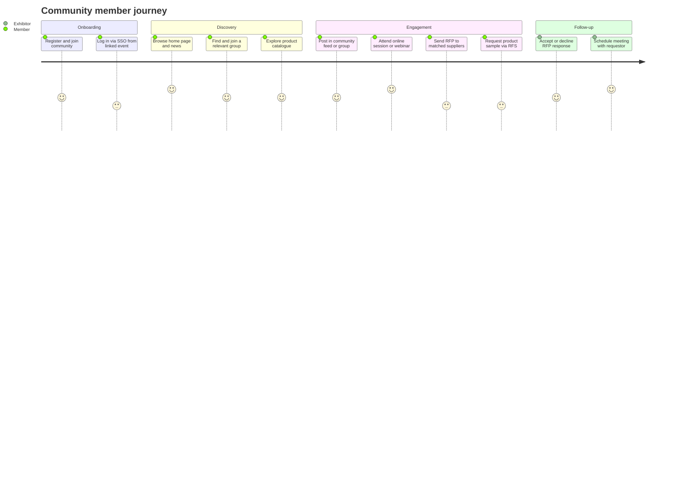
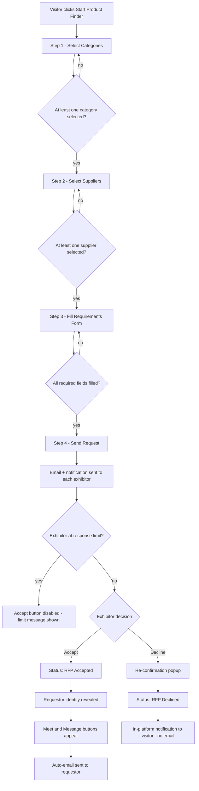
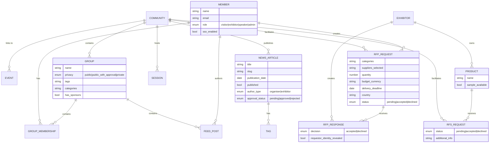
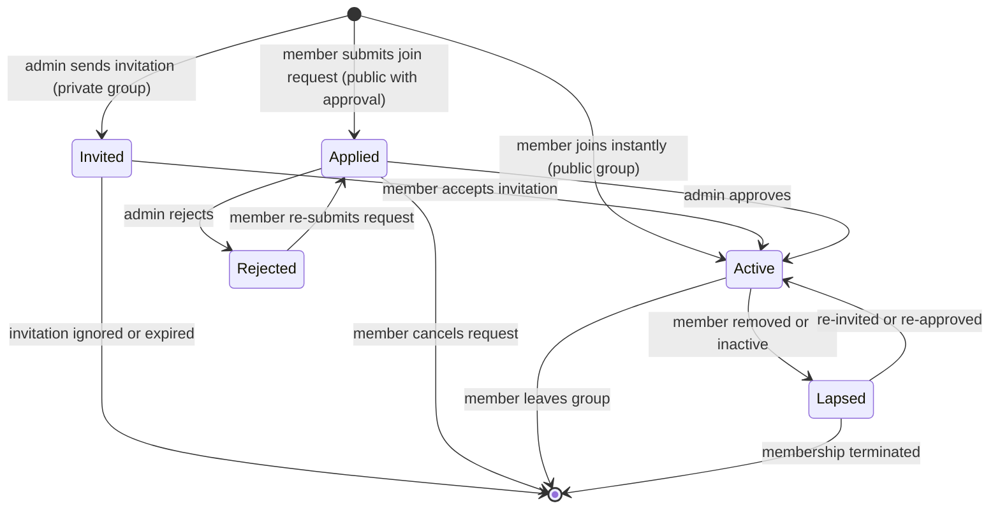
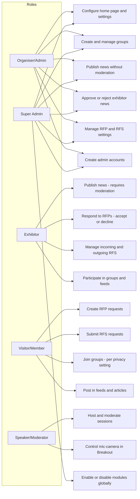

## 1. Product Overview

**Purpose.** Community is ExpoPlatform's year-round engagement product. Where an event is time-bounded — a fixed-window occurrence with a start date and an end date — a Community is a persistent, always-on environment that enables professional networking, collaboration, training, and education 365 days a year. It offers organisations the ability to maintain relationships with their membership between events, deepen industry connections, and build an ongoing professional ecosystem.

**Problem being solved.** Tradeshows and conferences generate intense bursts of activity but lose their audience the moment the doors close. Exhibitors, visitors, buyers, and members who connected during an event have no structured channel to continue that relationship. Communities solve this by providing a permanent branded home that links those people together, surfaces new content, hosts group discussions, facilitates commercial enquiries (RFP/RFS), and keeps the event audience engaged throughout the year.

**Business value.**
- Extends the commercial life of an event brand beyond its physical or virtual duration.
- Gives exhibitors a persistent channel to communicate with buyers and visitors.
- Enables organisers to monetise their audience year-round through news, group sponsorship, sessions, and product discovery.
- SSO across linked events reduces re-registration friction and increases return engagement.
- RFP and RFS features turn the community into an active commercial marketplace, not just a social network.

**Target users.** Event organisers who run recurring industry events and want to maintain an active professional community between editions; members of those communities (visitors/buyers, exhibitors, speakers) who want ongoing access to their industry network.

**User personas.**
- *Community Organiser/Admin* — configures the community, manages membership, publishes news, moderates content, operates the RFP/RFS settings, creates groups, and monitors engagement.
- *Exhibitor/Supplier* — maintains their profile year-round, publishes exhibitor news, responds to RFPs and RFS requests, participates in groups and sessions.
- *Visitor/Buyer/Member* — browses the community directory, sends RFPs, requests samples, joins groups, consumes news and sessions, and networks with peers.
- *Speaker/Moderator* — hosts or moderates online sessions and breakout discussions within the community.

**Success metrics.** Monthly active members; session attendance rates; RFP/RFS conversion rates (requests to accepted); news articles published; group membership growth; SSO utilisation across linked events; return visit rate between event editions.

## 2. Product Scope

### Included
- **Community Home Page** with a configurable template (banner, news, RFP/RFS promotions, member cards, groups, featured session, products, exhibitors, linked events).
- **General Settings** for the community home page (banner, theme colours, wayfinding, disclaimer).
- **Membership Management** including Community Event mode toggle, SSO (single sign-on) across linked events, and the "Events that belong to this Community" configuration.
- **Attaching Events** — linking one or more time-bounded events to the community so they appear as promotional cards at the bottom of the home page.
- **Micro-community Groups** — admin-created topic groups with public, public-with-approval, or private/invitation-only membership; tags, categories, sponsors.
- **Feeds** — member-published posts, articles, photos, and videos within the community and within groups; moderation queue; interactions (likes, comments); statistics and recommendations.
- **News** — organiser-authored and exhibitor-authored news articles with full publishing/moderation workflow; categorisation, tagging, SEO fields, sponsor banners.
- **Online Sessions and Webinars** — Breakout rooms, Livestream sessions, On-Demand sessions, External sessions, and Hybrid sessions (identical feature set to the event context).
- **RFP (Request for Proposal)** — visitor-initiated multi-step product-finder workflow sending commercial requests to matched exhibitors; organiser-configured limits, email templates, and dashboards.
- **RFS (Request for Sample)** — product-level sample request workflow; exhibitor manages incoming/outgoing requests; per-category and per-product enablement.
- **Networking features shared with events** — meetings (self-managed), messaging, favourites, matchmaking, schedule page — these function identically in a community context and are documented in their respective product docs; noted here for scope clarity.

### Excluded
- Time-bounded event setup, ticketing, registration forms, floorplans (covered by *Admin / Platform Core* and event-specific products).
- Onsite badge scanning, kiosk check-in (covered by *Onsite & Kiosk*).
- Payment processing and transactions (covered by *Transactions & Purchasing*).
- Mobile app build and management (covered by *Client Manager*).
- Third-party BI or analytics integrations beyond the platform's own data pipeline.
- Meeting formats specific to events (Speed Networking, Meeting Program, Concierge Meetings, Round Tables) — available via the meetings product but not community-exclusive.

## 3. User Roles

| Role | Access in Community | Notes / Restrictions |
| --- | --- | --- |
| **Organiser / Admin** | Full access: configure home page, manage membership, create groups, publish and moderate news, manage RFP/RFS settings, view all feeds, access admin panel community settings | Creates admin accounts for group creation; can set visibility and approval rules |
| **Exhibitor** | Profile management, publish exhibitor news (requires organiser enablement), respond to RFPs (accept/decline), manage incoming and outgoing RFS requests, join groups, participate in sessions and feeds | News creation requires "Allow exhibitor news" toggle; RFP response available only on community home page |
| **Visitor / Buyer / Member** | Browse member directory, initiate RFPs (visitors only), submit RFS requests, join groups, consume news and sessions, post in feeds, schedule meetings, favourite items | Only visitors can create RFP requests; exhibitors and visitors both submit RFS |
| **Speaker / Moderator** | Host or moderate online sessions (Breakout, Livestream); moderators control mic/camera/screen-share in Breakout rooms | No unique rights in On-Demand sessions; moderators added via admin panel or directly from session page |
| **Super Admin** | All organiser rights plus global module management, enabling/disabling community features at the platform level | Module Management toggle gates RFP, RFS, Feed, Sessions, Groups features |
| **Group Admin / Moderator** | Manage membership waiting list for public-with-approval groups; approve/reject join requests | Elevated rights within a specific group only |

> [!INFO] Groups can only be created by admin users via the frontend URL `/newfront/profile/groups?add=true`. Regular visitor or exhibitor accounts cannot create groups even if they are group admins.

## 4. Feature Inventory

#### Community Home Page Template

**Description.** The community home page is the landing experience for the persistent community environment, accessible at the community's root URL. **Why it exists.** Members need a recognisable, branded destination that orients them to the community's current activity rather than a blank dashboard. **User value.** Surfaces the most relevant content — news, groups, sessions, products, events, and members — in a single scrollable view, driving re-engagement on every visit. **Functional logic.** The home page is composed of ordered content blocks: (1) Banner (optional top-of-page image, can be disabled), (2) News section (one featured article + up to 4 smaller snippets), (3) Request for Sample promotion (if RFS enabled), (4) Request for Proposal promotion (if RFP enabled), (5) Member cards (randomly selected community members with photo, name, company, and a See All link), (6) Groups (up to 4 displayed), (7) Featured Session (a specific session can be surfaced by enabling its Featured Session toggle), (8) Products (randomly selected with See All link), (9) Exhibitors (randomly selected with See All link), (10) Events (promotional cards for linked events with Find Out More links). **Preconditions.** Community event mode enabled; home page toggle on in New UI Settings. **Trigger conditions.** Member navigates to community root URL. **Processing logic.** Each block only renders if its underlying feature/data is enabled and populated; blocks with no content are hidden. **Outputs.** Rendered home page. **Dependencies.** News, Sessions, Groups, RFP, RFS, Members, Products, Exhibitors, and linked Event modules. **Configurations.** Banner (enable/disable, image upload), theme colours, wayfinding toggle, "no active products" disclaimer; all in Admin Panel > Event Setup > New UI Settings. **Validation rules.** Featured Session toggle must be set per-session; blocks with no data are hidden gracefully. **Permissions.** All community members (authenticated or open access depending on Module Management). **Error handling.** Missing data → block hidden rather than error state. **Edge cases.** If RFP and RFS are both disabled, their promotional blocks do not render; randomly selected members/products/exhibitors change on each page load.

#### Community vs Event Distinction

**Description.** A Community is a persistent environment; an Event is time-bounded. **Why it exists.** The platform supports both modes and users need to understand the relationship. **Functional logic.** An event has a defined start and end date; a community has no end date. Multiple events can be attached to one community, appearing as promotional cards on the community home page. SSO links the authentication sessions across them. Platform-wide features (sessions, networking, matchmaking, news) function identically in both contexts — only the persistence model and the home-page template differ. **Configurations.** "Community Event" toggle in General Info (Admin Panel > Event Setup > General) marks an event as community-mode. Linked events are added via "Events that belong to this Community" field after enabling both the Community Event and Allow SSO Login toggles.

#### Membership Management and SSO

**Description.** Controls who can access the community and enables seamless cross-event authentication. **Why it exists.** Members should not need to re-authenticate every time they move between linked events. **User value.** Frictionless navigation across all events associated with the community. **Functional logic.** Admin enables "Community Event" mode and "Allow SSO Login" in General Info. Once both are enabled and events are linked: when a user authenticated in one event navigates to a linked event, the system detects their authenticated state and grants access immediately — provided a separate account exists on the destination event. **Preconditions.** Community Event toggle ON; Allow SSO Login toggle ON; events linked in the "Events that belong to this Community" dropdown; user account registered on each linked event. **Outputs.** Seamless session handoff between community and linked events. **Dependencies.** Event registration system; session/auth service. **Validation rules.** SSO only works if account exists on both sides; creating one account does not auto-provision across events. **Permissions.** Organiser configures; members benefit. **Error handling.** If account not found on destination event, user is prompted to log in. **Edge cases.** SSO requires account pre-existence on every linked event — this is a non-obvious precondition that organisers must communicate to members.

#### Micro-community Groups

**Description.** Topic or interest-based sub-communities within the main community, each with their own feed, member list, and privacy settings. **Why it exists.** Large communities need sub-spaces so members can find their specific peer group without noise from the full membership. **User value.** Members self-select into relevant groups; admins can create curated, moderated spaces for specific audience segments. **Functional logic.** Groups are created by admin accounts only at `/newfront/profile/groups?add=true`. Each group has a name, tags (free-form), categories (from product categories), a privacy setting, and optionally sponsors. The group home has a FEED tab and a MEMBERS tab. **Preconditions.** Admin account created in Admin Panel > Accounts; Feed module enabled in Module Management. **Trigger conditions.** Admin navigates to group creation URL. **Processing logic.** On creation: privacy mode, tags, and categories are set; invitations dispatched for private groups. Members join per privacy rules (see below). Feed content is posted/moderated per group settings. **Outputs.** Active group sub-community with feed and member management. **Dependencies.** Feed module; notification service; membership/auth service. **Configurations.** Tags, categories (filter by product categories), privacy setting, auto-approval rules, sponsors. **Validation rules.** Groups can be filtered by categories, tags, and visibility on the groups page (filters configured under Events Setup > Display Filters). **Permissions.** Creation: admin only. Membership: governed by privacy setting. **Error handling.** Non-admin attempting group creation → not permitted. **Edge cases.** A group admin can approve/reject members but cannot grant group-creation rights to members.

#### Group Privacy Modes

**Description.** Three configurable privacy levels govern who can join a group and how. **Functional logic.**
- *Public*: any member can join instantly; no approval required; button on group card changes from "Join group" to "Visit group" after joining.
- *Public with approval*: members request to join; button changes to "Cancel request" after submitting; request can be withdrawn; group admin sees a waiting list and approves or rejects each request; optional automatic approval can be enabled for specific user categories/roles (if no categories/roles are configured for auto-approval, no one is auto-approved).
- *Private / Invitations only*: only members with a personal invitation can join; admin sends invitations by role/category; non-invited members see no join button; invited members receive an in-platform notification. **Validation rules.** Auto-approval with no categories/roles selected → no automatic approvals; manual approval required for all. Once declined, the user can re-submit a request (public with approval). **Edge cases.** A private group is invisible to non-invited members in terms of join affordance but may still be visible in the group list depending on visibility settings.

#### Feeds — Publications and Content

**Description.** A social-media-style publication system for community-wide and group-specific content. Members post updates, articles, photos, and videos. **Why it exists.** Communities require an ongoing stream of member-generated content to stay active between events. **User value.** Members share knowledge, updates, and multimedia; others engage through likes, comments, and shares. **Functional logic.** Two content types: (1) Posts — popup with audience visibility selector, text body, and optional photo/video; (2) Articles — dedicated creation page with header image, title, and rich text description. Feed tabs in each group/community: All publications, My publications, Pending publications, Approved, Rejected. **Preconditions.** Feed module enabled in Module Management. **Processing logic.** Any group member can post. Content may be published immediately or enter a moderation queue depending on group settings. Feed content posted in a community syncs to a linked event if the user is registered on both and the event is linked to the community. **Outputs.** Published posts/articles visible to audience defined by visibility settings. **Dependencies.** Group membership; Module Management (Feed toggle); notification service. **Configurations.** Group-level content approval settings. **Validation rules.** Feed module must be enabled in Module Management. **Permissions.** Any community/group member can create; admins/moderators moderate. **Edge cases.** Cross-community/event sync only activates if user has accounts on both; no sync if event not linked.

#### News

**Description.** A news/blog section allowing organisers and exhibitors to publish articles to the community audience. **Why it exists.** Fresh editorial content drives return visits and keeps the community informed about industry developments and exhibitor activity. **User value.** Members discover relevant news; exhibitors gain a content marketing channel; organisers control editorial quality. **Functional logic.** Two authorship paths: (1) Organiser creates at Admin Panel > Marketing → News; no moderation required; publishes immediately when Published toggle is on. (2) Exhibitor creates in their account profile (requires "Allow exhibitor news" toggle in Registration Settings > Exhibitor > Additional Settings); article enters moderation queue; organiser approves or rejects from the same admin panel. **Fields available:** News Image/Header Image, Title, Author, URL slug (auto-generated, editable), Publication date, Short description (max 200 symbols), Tags, Matchmaking/Product categories, Visible to, Full description (WYSIWYG), Keywords and Description (SEO meta). **Preconditions.** For organiser: none beyond access. For exhibitor: "Allow exhibitor news" toggle on; optional news article limits configured per category or per individual exhibitor. **Processing logic.** Organiser articles are live when Published toggle is on. Exhibitor articles show as "pending" and appear on exhibitor profile + general news list only after approval. **Outputs.** Published articles at `/newfront/news/{slug}`; featured article + snippets on home page. **Dependencies.** Marketing module; categorisation/tags service; approval workflow. **Configurations.** Published toggle (organiser); Allow exhibitor news toggle; optional per-category/exhibitor limits on article count and body length; sponsor banners per news list page. **Validation rules.** URL slug auto-generated from title but can be manually changed; short description max 200 characters; unpublished articles hidden on frontend. **Permissions.** Organiser creates without moderation; exhibitors create with moderation. **Error handling.** Unpublished article → not visible on frontend (check Published toggle). Exhibitor article not appearing → confirm approved; check active profile; clear cache. **Edge cases.** Category visibility settings can restrict which badge types see specific articles; header image recommended dimensions: 285px height, full-width responsive (use 1920px+ wide image for best quality).

#### Online Sessions and Webinars

**Description.** Live, on-demand, and hybrid video sessions hosted within the community using the platform's built-in session engine. **Why it exists.** Year-round communities need to offer educational and networking sessions without requiring a full event context. **User value.** Members attend training, webinars, and industry discussions on their schedule; organisers programme content that drives ongoing engagement. **Functional logic.** Five session types available (identical to the event product):

| Type | Best for | Capacity | Participant rights | Embed |
| --- | --- | --- | --- | --- |
| Breakout Room | Interactive sessions with audience participation | 250 | Mic/camera if moderator grants | None needed |
| Livestream | Broadcast with Q&A/chat/polls | Unlimited | Sound only; no mic/camera | Vimeo iframe |
| On-Demand | Watch anytime within date range | Unlimited | No chat/Q&A | Vimeo iframe |
| External | Redirect to third-party (Zoom/YouTube etc.) | Unlimited | Per external platform | External URL |
| Hybrid | Physical + online participants in one session | Varies | Per Breakout rules | None needed |

**Preconditions.** Sessions module enabled; sessions created in Admin Panel > Management → Sessions. Breakout + Hybrid: Hybrid toggle enabled. **Processing logic.** On-Demand: visible until To date; disappears after. Featured Session: set Featured Session toggle per-session to surface it on the community home page. **Dependencies.** Session engine; video embed platform (Vimeo/external); moderator service. **Configurations.** Online type selection; disable mic/camera/Q&A/polls/chat/raise-hand toggles per session; text colour and background customisation (Breakout); From/To dates (On-Demand); Featured Session toggle. **Validation rules.** On-Demand sessions visible only within From/To date range; Speakers/Moderators have no unique rights in On-Demand. **Permissions.** Organiser configures; members attend. **Error handling.** Mac screen recording permission issues → documented troubleshooting steps for Chrome. Echo in breakout → use specific-tab screen share. **Edge cases.** Participant accessing from multiple devices → listed as "Undefined" in participant list; always use one device per session.

#### RFP — Request for Proposal

**Description.** A structured commercial enquiry workflow enabling visitors to send product-requirement proposals to matched exhibitors via a guided "Product Finder" flow. **Why it exists.** Visitors attending a community often have purchasing intent but no structured channel to initiate it. RFP connects that intent directly to the right suppliers. **User value.** Visitors articulate requirements once and notify multiple matched exhibitors simultaneously; exhibitors receive commercially qualified leads. **Functional logic.** Accessible via "Start Product Finder" button on the community home page (`/newfront/community`). Only available as part of the community home page — not as a standalone module. Four-screen creation flow: (1) Category Selection — choose product categories from the local categories list (`/admin/categorisation/general`); at least one required. (2) Supplier Selection — matched exhibitors pre-selected; user can deselect; at least one required. (3) Requirements Form — required fields: Quantity, Budget (in currency configured in admin RFP settings), Delivery deadline, Country; optional: additional information. (4) Submission — sends the request; selected exhibitors notified via email and in-platform notification. **Exhibitor response:** at Networking > My RFP; tabs: All RFP, Incoming, Accepted, Declined; sortable Newest/Oldest first. Requestor identity hidden until accepted. Accept: status → "RFP Accepted", requestor identity revealed, Meet + Message buttons appear, auto-email to requestor. Decline: re-confirmation required, no email to requestor, in-platform notification only. Decisions are final — once accepted or declined, the status cannot be reversed. **Preconditions.** Frontend-RFP and Backend-RFP Module Management toggles both enabled. **Trigger conditions.** Visitor clicks "Start Product Finder" on community page. **Dependencies.** Local categories; exhibitor/product catalogue; email template service; notification service. **Configurations.** RFP limits per exhibitor category (enabled via Frontend - RFP Limits toggle); limit notification message; email templates "RFP requested" and "RFP accepted" in Networking & Matchmaking > RFP. **Validation rules.** Only visitors can create RFP requests (not exhibitors). RFP only available on community website with community home page. **Permissions.** Visitors: create. Exhibitors: respond. **Error handling.** Exhibitor at response limit → "Accept RFP" button disabled; message displayed: "Response limit reached..." With limit ON: requestor info hidden in both notification and email. **Edge cases.** Platform does not generate commercial documents — follow-up is between users. RFP notifications not available on mobile app.

#### RFS — Request for Sample

**Description.** A product-level sample-request workflow allowing visitors and exhibitors to request physical samples of products from exhibitors. **Why it exists.** Trade communities with physical products (food, beverage, materials) need a way to facilitate sample requests that are linked to specific products and can be managed at scale. **User value.** Visitors identify products they want to try and submit a single-click request; exhibitors manage an organised incoming queue. **Functional logic.** Enabled globally via "Request for sample" toggle in Module Management (off by default). Then enabled per exhibitor category and/or per individual exhibitor. When enabled: "Sample available" toggle appears on each product's edit page; products with this toggle on display a "Sample" sash on their card and a "Request a sample" button on their detail page. Submission: visitor or exhibitor clicks "Request Sample" on a product page → optional additional info popup → submit. **Exhibitor management:** Networking > My Sample Requests; "Outcoming requests" tab (default) + "Incoming request" tab (appears when requests arrive). Exhibitor can Accept or Decline; after acceptance, can request meeting or send message to requestor. **Preconditions.** RFS toggle enabled in Module Management; per-category or per-exhibitor "Requests for samples" toggle enabled; exhibitor has marked at least one product "Sample available". **Dependencies.** Product catalogue; exhibitor category settings; email template service; notification service. **Configurations.** Email templates: Request received, Request sent, Request accepted, Request declined (Networking & Matchmaking > RFS > Email Templates). Required template variables: First Name, Last Name, Email, Product Name, Sample Event Name, Message. Settings tab: events table for delivery details (organiser manages which events samples are available at). Frontend filter: "Sample available at event X" on product catalog. **Validation rules.** "Request a sample" button only appears on products with "Sample available" enabled. **Permissions.** Both visitors and exhibitors can submit RFS; exhibitors manage incoming requests. **Error handling.** RFS button not visible → check RFS module toggle, per-category toggle, and product "Sample available" toggle in sequence. **Edge cases.** "Sample Request" button can be added to the community home page; clicking opens an event-selection popup for samples available at a specific event.

#### Micro-community Group Tags, Categories, and Sponsors

**Description.** Organisational metadata attached to groups for discoverability and commercial visibility. **Functional logic.** During group creation admins enter tags (free-form) and select categories (based on existing product categories). The groups page is filterable by categories, tags, and visibility. Filters are configurable under Events Setup > Display Filters. Sponsors can be associated with a group, giving exhibitors branded visibility within specific communities. **User value.** Members quickly find groups relevant to their interests; sponsors gain targeted exposure within their category community.

## 5. User Stories Mapping

> [!INFO] Only 5 in-scope Jira stories exist for Community. The product is primarily documented in Confluence (45 pages fetched). Stories are referenced below with their exact data; note that three of the five concern exhibitor account UI components that overlap Membership Management.

| Story ID | Title | Summary | Acceptance Criteria | Related Feature | Status |
| --- | --- | --- | --- | --- | --- |
| EP-56 | Manage permissions between delegate groups | Organiser can control VIEW permissions between delegate groups so specific attendee categories cannot see others in the directory | Organiser can restrict which delegate groups are visible to each other; Vinexposium use case: trade buyers see only producers and press | Group Visibility / Membership Management | COMPLETE |
| EP-14681 | Messages / group chats | Group chat and messaging capability; mobile test coverage documented | Group chat functional; mobile test coverage verified | Feeds / Messaging (community groups) | COMPLETE |
| EP-23967 | Exhibitor Account — Registration Info | Redesign of exhibitor account registration info page in admin panel; content language selector present | Registration Info page renders correctly with language selector; matches Figma design node-id 3928-16179 | Membership Management | COMPLETE |
| EP-23972 | Exhibitor Account — Floorplan page | Redesign of floorplan page in exhibitor account admin panel | Floorplan page renders correctly; matches Figma design node-id 3928-54204 | Membership Management | COMPLETE |
| EP-24329 | Create Exhibitor Profile Context | Apply preparatory work necessary to start development of exhibitor profile page | Exhibitor profile page context established; necessary prep complete | Membership Management / Online Registration | COMPLETE |

> [!WARN] The 5 in-scope stories are a thin Jira footprint for a product of this breadth. The full feature set (Home Page, Groups, Feeds, News, RFP, RFS, Online Sessions, SSO) is evidenced from the 30 Confluence pages fetched. No gap is inferred in the features themselves — only in Jira traceability.

## 6. End-to-End Workflows

### Member journey — year-round community engagement

### System workflow — RFP end-to-end

### Happy path — member joins group and posts content
Member logs in → browses Groups page → finds a relevant public group → clicks "Join group" → button changes to "Visit group" → opens group → clicks "Start a post" → selects audience visibility → enters text → submits → post appears in All publications feed immediately (public group, no moderation required).

### Alternate paths
- *Public with approval group*: member clicks "Request to join" → button shows "Cancel request" → admin reviews waiting list → approves → member notified → can now access group feed.
- *Private group*: member receives invitation notification → accepts → joins group → accesses feed.
- *SSO path*: member authenticated on linked event → clicks community link → system detects session → grants immediate access to community (if account exists).
- *Exhibitor news*: exhibitor creates article in profile → article enters moderation queue → organiser reviews and approves → article appears on exhibitor profile page and in community news list.

### Exception paths
- RFP submitted but no exhibitors pre-selected → "Next step" button remains disabled; at least one supplier must be checked.
- Exhibitor response limit reached → Accept button disabled; exhibitor sees limit message; organiser can extend limits in category settings.
- SSO fails → destination event does not recognise user account → user must log in manually; root cause: account not pre-created on destination event.
- Exhibitor news not appearing → check Published toggle (organiser articles) or Approved status (exhibitor articles); check cache.

### Recovery paths
- Declined RFP → cannot be reversed; visitor must submit a new RFP request.
- Group join request cancelled → member can re-submit a new request.
- On-Demand session past To date → session no longer visible; organiser extends To date to restore visibility.
- Feed post pending → group admin approves from Pending publications tab.

## 7. Business Rules Engine

| # | Rule | Condition | Exception / Priority | Conflict resolution |
| --- | --- | --- | --- | --- |
| BR-1 | Only visitors can create RFP requests | RFP creation initiated | Exhibitors cannot create RFPs | System enforces; no exhibitor UI for RFP creation |
| BR-2 | RFP is only available on the community home page | RFP module enabled | Not available as standalone module or on event pages | Module Management does not expose RFP outside community context |
| BR-3 | Groups can only be created by admin accounts | Group creation attempted | Regular visitor/exhibitor accounts cannot create groups | Frontend route `/newfront/profile/groups?add=true` requires admin session |
| BR-4 | SSO cross-event login requires account existence on destination event | SSO login attempted | Account must be pre-created separately on each event | If no account: fall back to manual login |
| BR-5 | Exhibitor accept/decline on RFP is final and irreversible | Decision submitted | No override available | Users informed in UI; follow-up arranged outside platform |
| BR-6 | RFS "Request a sample" button only appears on products with "Sample available" enabled | Product page rendered | Toggle must be set by exhibitor per product | Button absent if toggle not set; no error, just absent |
| BR-7 | Both Backend-RFP and Frontend-RFP Module Management toggles must be enabled for RFP to function | RFP feature attempted | Frontend-RFP Limits toggle is optional | Either toggle alone is insufficient |
| BR-8 | Exhibitor news articles require organiser approval before appearing on frontend | Exhibitor submits article | Organiser-authored articles require no moderation | Approval required; pending articles not visible to community |
| BR-9 | Auto-approval for public-with-approval groups requires explicit category/role configuration | Group created with auto-approval | If no categories/roles selected for auto-approval: no automatic approvals | Manual review applies as fallback |
| BR-10 | On-Demand sessions are only visible within their configured From/To date range | Session page rendered | After To date: session disappears from frontend | Organiser must extend To date to restore access |
| BR-11 | In Breakout sessions, participants cannot enable mic/camera without moderator permission | Session in progress | Moderator role required to grant access | Moderator is sole authority for Breakout room media controls |
| BR-12 | Feed module must be enabled in Module Management for groups and community feeds to function | Feed content rendered | Disabling Feed in MM hides all feed functionality | No feed without module toggle |

## 8. Data Model

### Core entities and relationships

**Inputs.** Member registrations; organiser and exhibitor content; RFP category selections and requirements; RFS product sample flags; session configurations; group membership actions; SSO authentication tokens.
**Outputs.** Rendered community home page; published news articles; active groups with feeds; accepted/declined RFP and RFS requests; session attendance; member directory.
**Data lifecycle.** Communities are persistent (no end date). RFP decisions are immutable once submitted. On-Demand sessions expire at their To date. Feed posts persist unless deleted by author or moderated out.

### Membership lifecycle state diagram

## 9. Permissions Matrix

| Capability | Super Admin | Organiser/Admin | Exhibitor | Visitor/Member | Speaker/Moderator |
| --- | --- | --- | --- | --- | --- |
| Configure community home page | ✅ | ✅ | ❌ | ❌ | ❌ |
| Enable/disable modules (RFP, RFS, Feed, Sessions) | ✅ | ❌ | ❌ | ❌ | ❌ |
| Create groups | ✅ | ✅ (admin acct) | ❌ | ❌ | ❌ |
| Approve/reject group members | ✅ | ✅ | ❌ (group admin only) | ❌ | ❌ |
| Publish news without moderation | ✅ | ✅ | ❌ | ❌ | ❌ |
| Publish exhibitor news (moderated) | ❌ | ❌ | ✅ | ❌ | ❌ |
| Approve exhibitor news | ✅ | ✅ | ❌ | ❌ | ❌ |
| Create RFP requests | ❌ | ❌ | ❌ | ✅ (visitors only) | ❌ |
| Respond to RFP (accept/decline) | ❌ | ❌ | ✅ | ❌ | ❌ |
| Submit RFS requests | ❌ | ❌ | ✅ | ✅ | ❌ |
| Manage incoming RFS | ❌ | ❌ | ✅ | ❌ | ❌ |
| Host/moderate sessions | ✅ | ✅ | ❌ | ❌ | ✅ |
| Control Breakout room mic/camera | ❌ | ❌ | ❌ | ❌ | ✅ (Moderator role) |
| Post in feeds | ✅ | ✅ | ✅ | ✅ | ✅ |
| Configure SSO and linked events | ✅ | ✅ | ❌ | ❌ | ❌ |

## 10. Integrations

| Integration | Purpose | Trigger | Data exchanged | Failure handling | Retry | Security |
| --- | --- | --- | --- | --- | --- | --- |
| **SSO — Linked Events** | Seamless cross-event authentication | Member navigates from community to linked event | Session token / authenticated state | Fall back to manual login if account not found | Not applicable — session state either exists or not | Token-based; requires pre-existing account on destination |
| **Vimeo (iframe embed)** | Host Livestream, On-Demand, and Simulive session video | Organiser pastes embed code; participant joins session | Embed iframe; video stream | Video not loading → check embed code format (iframe only); check platform availability | Participant refreshes session page | HTTPS iframe; participant must have browser permissions for embed |
| **External session links** | Redirect to third-party platforms (Zoom/YouTube/Vimeo) | Participant clicks session join | Unique URL handoff | Third-party availability; no EP-side retry | Participant re-navigates to session page | External URL; security governed by third-party platform |
| **RFP email templates** | Notify exhibitors of incoming RFP and visitors of accepted RFP | RFP submitted; RFP accepted | Email payload using configured template | Email not delivered → check template configured; check exhibitor email address | Organiser can re-trigger from template management | Email delivered via platform email service; no mobile push |
| **RFS email templates** | Notify all parties of sample request lifecycle events | RFS submitted; RFS accepted; RFS declined | Email payload using configured template; required variables: First Name, Last Name, Email, Product Name, Sample Event Name, Message | Email missing → confirm template set up; confirm required variables present | Organiser re-configures template | Standard email delivery |
| **Platform notification service** | In-app notifications for group invitations, RFP/RFS actions, news approval, SSO events | Various triggers as documented per feature | In-platform notification payloads | Notification delayed or missing → check Module Management toggles | System-level retry | Authenticated session; tied to user account |

## 11. Notifications

| Notification | Type | Trigger | Recipient | Timing | Notes |
| --- | --- | --- | --- | --- | --- |
| RFP received | Email + in-platform | Visitor submits RFP | Matched exhibitors | Immediate on submission | If RFP Limit ON: requestor identity hidden in notification and email |
| RFP accepted | Email + in-platform | Exhibitor accepts RFP | Requesting visitor | Immediate on acceptance | Auto-email sent; requestor identity revealed to exhibitor |
| RFP declined | In-platform only | Exhibitor declines RFP | Requesting visitor | Immediate on decision | No email sent on decline |
| RFS request received | Email + in-platform | Visitor/exhibitor submits RFS | Product-owning exhibitor | Immediate on submission | Template: "Request received"; required variables must be configured |
| RFS request sent | Email | Visitor/exhibitor submits RFS | Requestor | Immediate on submission | Template: "Request sent" |
| RFS accepted | Email + in-platform | Exhibitor accepts RFS | Requestor | Immediate on acceptance | Template: "Request accepted" |
| RFS declined | Email + in-platform | Exhibitor declines RFS | Requestor | Immediate on decline | Template: "Request declined" |
| Group invitation | In-platform | Admin sends private group invitation | Invited member | Immediate on send | Invited member receives notification about being invited |
| Group join approved | In-platform | Group admin approves waiting-list request | Requesting member | Immediate on approval | Public with approval groups |
| Exhibitor news approved | In-platform | Organiser approves exhibitor article | Exhibitor | Immediate on approval action | Article then visible on frontend |
| Session moderator assigned | Email | Admin/organiser assigns moderator to session | Moderator | Immediate on assignment | Standard moderator assignment notification |

> [!INFO] RFP notifications are web-only. They are not available on the mobile app.

## 12. Reporting & Analytics

> [!WARN] The Community product does not have a dedicated analytics module of its own. Community-level engagement data (member activity, session attendance, news views, RFP/RFS volumes) is accessible through **Organiser Analytics**, which supports a "Community events" view. Analytics pages default to **Monthly** granularity for community events. The items below describe what is available via that module in the community context.

| Report / Surface | Inputs | Key Metrics | Filters | Export |
| --- | --- | --- | --- | --- |
| **General Dashboard (community mode)** | Member registrations, active counts, sessions, news, groups | Registered members, active members, sessions count, news count, online now, favourites, conversations | Event selector (community event); date range | No direct export; underlying data via exports |
| **Registration Analytics** | Member registration data | Registrations over time by day/week/month; category breakdown; country breakdown; cumulative revenue | Date range; granularity | Via Visitors/Participants export reports |
| **Supplier Overview** | Exhibitor activity data | Per-exhibitor: profile views, favourites, products, content, chats, RFPs received/accepted/declined, meetings | Company name/category search | XLS export |
| **RFP Report** | RFP request and response data | Unique requests, total requests, avg per unique request, total RFP value, accepted/pending/declined counts | Via Marketplace Analytics dashboard | XLS (RFP Report export) |
| **News / Content engagement** | News article view data | Views per article; top articles in leaderboard | General Dashboard leaderboard | No dedicated news export |
| **Sessions Analytics** | Session booking and attendance data | Session attendance, on-demand views, speaker popularity | Online Sessions Analytics; On-Demand Sessions Analytics pages | Via Sessions export report |

## 13. Configuration Guide

| Setting | Location | Effect | Who can set |
| --- | --- | --- | --- |
| Community Event toggle | Admin Panel > Event Setup > General > General Info | Marks event as a community; enables community-mode features | Organiser/Admin |
| Allow SSO Login toggle | Admin Panel > Event Setup > General > General Info | Enables cross-event SSO for linked community events | Organiser/Admin |
| Events that belong to this Community | Admin Panel > General Info (field below SSO toggle) | Links specific events to the community; they appear on home page | Organiser/Admin |
| Community home page ON/OFF | Admin Panel > Event Setup > New UI Settings > Settings tab | Enables or disables the community home page template | Organiser/Admin |
| Banner enable/disable + image | Admin Panel > Event Setup > New UI Settings > Banner tab | Shows/hides hero banner; sets banner image | Organiser/Admin |
| Theme colours | Admin Panel > Event Setup > New UI Settings > Theme colors tab | Sets site-wide colour scheme | Organiser/Admin |
| Wayfinding toggle | Admin Panel > Event Setup > New UI Settings > Settings tab | Enables wayfinding navigation aids | Organiser/Admin |
| No-active-products disclaimer | Admin Panel > Event Setup > New UI Settings > Settings tab | Displays custom message when no products active | Organiser/Admin |
| Feed module toggle | Admin Panel > Event Setup > Module Management | Enables/disables Feed functionality across community and groups | Super Admin |
| Frontend-RFP toggle | Module Management | Enables Product Finder on frontend; My RFP pages for exhibitors and visitors | Super Admin |
| Frontend-RFP Limits toggle | Module Management | Enables per-category RFP response limits; hides/shows requestor info | Super Admin |
| Backend-RFP toggle | Module Management | Enables RFP menu and settings in admin panel | Super Admin |
| RFP limits per exhibitor category | Registration Settings > Exhibitor > Exhibitor Categories | Caps how many RFPs each exhibitor category can respond to | Organiser/Admin |
| RFP email templates | Networking & Matchmaking > RFP | Configures "RFP requested" and "RFP accepted" email content | Organiser/Admin |
| Request for Sample toggle (global) | Module Management | Enables RFS module (off by default) | Super Admin |
| RFS per-category toggle | Registration Settings > Exhibitor > Exhibitor Categories | Enables RFS for exhibitors of a specific category | Organiser/Admin |
| RFS per-exhibitor toggle | Management > Exhibitors > individual exhibitor > settings | Enables RFS for a specific exhibitor | Organiser/Admin |
| Sample available (per product) | Exhibitor profile > Product Catalog > Add/Edit Product | Marks a specific product as available for sample requests | Exhibitor |
| RFS email templates | Networking & Matchmaking > RFS > Email Templates tab | Configures request received/sent/accepted/declined email content | Organiser/Admin |
| RFS events/delivery table | Networking & Matchmaking > RFS > Settings tab | Defines events where samples are available for pickup | Organiser/Admin |
| Allow exhibitor news toggle | Registration Settings > Exhibitor > Additional Settings | Enables exhibitors to create news articles | Organiser/Admin |
| News limits per exhibitor category | Registration Settings > Exhibitor > Exhibitor Categories | Caps how many news articles an exhibitor category can publish | Organiser/Admin |
| Group privacy setting | Group creation page (frontend, admin account) | Sets public / public with approval / private membership mode | Admin (frontend) |
| Group auto-approval by category/role | Group creation page > Privacy Settings | Auto-approves join requests from specified categories/roles | Admin (frontend) |
| Featured Session toggle | Admin Panel > Management > Sessions > individual session settings | Surfaces that session on the community home page | Organiser/Admin |
| Session Breakout customisation | Session settings | Customises text colour and background of Breakout room | Organiser/Admin |

## 14. Edge Cases

**User edge cases.**
- An authenticated visitor arriving at the community via SSO from a linked event will be granted immediate access only if their account exists on the community. If it does not exist, they are redirected to login — this can surprise users who expect SSO to provision accounts automatically.
- Moderators listed as "Undefined" in a Breakout room participant list are a symptom of the same user logging in from multiple devices simultaneously; only one device at a time is supported.
- A group admin (non-organiser) can approve/reject members but cannot create new groups; these are different admin tiers.

**Data edge cases.**
- News article URL slug is auto-generated from the title but can be changed manually; if changed post-publication, previously shared links will break.
- News header image below 285px height or low resolution will appear blurry; recommended minimum is 1920px wide.
- RFP requests that have been accepted or declined are immutable — no correction path exists within the platform.
- RFS "Sample available" toggle operates independently on each product; enabling RFS at the category level does not automatically mark any products as available for samples.

**Workflow edge cases.**
- An exhibitor at their RFP response limit can still see incoming requests but cannot act on them; the Accept button is disabled. They must contact the organiser to have limits extended.
- Feed posts in a community linked to an event sync to that event only if the user has an account on both — no sync occurs if the user exists only on one side.
- An On-Demand session disappears automatically when its To date passes; there is no warning to the organiser and no grace period.
- A Featured Session that is deleted or deactivated will leave a blank block on the home page if the home page template has not been refreshed; check the Featured Session toggle after any session changes.

**Integration edge cases.**
- Vimeo iframes must be used for Livestream and On-Demand; other embed formats are not supported. A malformed embed code causes the session room to render blank.
- External session URLs that expire (e.g., single-use Zoom links) leave participants with no path into the session; use recurring meeting links or update the session URL before each instance.
- RFP notifications are not delivered to the mobile app; exhibitors relying solely on the mobile app may miss incoming RFP requests until they check the web interface.

**Permission edge cases.**
- A visitor account cannot create RFPs if the "Community Event" mode is disabled or the Frontend-RFP toggle is off — the "Start Product Finder" button will not appear on the home page.
- An exhibitor who has been individually toggled off for RFS (despite their category having it on) will not receive the "Request a sample" affordance on any of their products.

**Concurrency edge cases.**
- Two organisers editing group settings simultaneously may overwrite each other's changes; last-save wins.
- An exhibitor receiving many simultaneous RFP requests from the same batch could reach their daily/category limit mid-session; remaining requests become invisible to action until the limit is adjusted.

**Event-lifecycle edge cases.**
- When a linked event ends (its event dates pass), it remains as a promotional card on the community home page until it is delinked; organisers should clean up the "Events that belong to this Community" list after each event edition.
- Community events default to Monthly granularity in Organiser Analytics time charts, unlike regular events that adapt based on duration; this can make recent short-term activity appear diluted.

## 15. FAQs

**What is the difference between a Community and an Event on ExpoPlatform?** An Event is time-bounded with a defined start and end date. A Community has no end date — it is always on, and is designed for year-round engagement. Multiple events can be attached to a community, so the event amplifies the community audience and the community maintains that audience between editions.

**How does SSO work between linked events and the community?** When a user is authenticated in one event and navigates to the community or another linked event, the platform detects their authenticated state and grants access immediately — without requiring them to log in again. This only works if the user has a separate account on the destination event. SSO does not create accounts; each event registration must be completed independently.

**Can exhibitors create RFP requests?** No. Only visitors (buyer/participant roles) can initiate RFP requests. Exhibitors respond to RFPs submitted by visitors.

**Why is the "Start Product Finder" button not appearing on the community page?** Both the Frontend-RFP and Backend-RFP Module Management toggles must be enabled. Verify both are on in Admin Panel > Event Setup > Module Management. The button only appears on the community home page, not on standalone event pages.

**Can an accepted or declined RFP response be changed?** No. Once an exhibitor accepts or declines an RFP, the decision is final and irreversible. The exhibitor and visitor must arrange any corrections directly between themselves.

**How do I make a product available for sample requests?** Three steps are required: (1) enable the global "Request for sample" toggle in Module Management; (2) enable the "Requests for samples" toggle on the exhibitor category or individual exhibitor settings; (3) the exhibitor enables the "Sample available" toggle on the specific product in their profile's Product Catalog. All three must be on for the "Request a sample" button to appear on the product page.

**Who can create groups in the community?** Only admin accounts can create groups. Regular visitor or exhibitor accounts cannot. Admin accounts are created in Admin Panel > Accounts > Add User. The group creation URL is `/newfront/profile/groups?add=true` and requires an admin session.

**Why is a community member's post not appearing in the group feed?** If the group is configured to require content approval, posts enter a moderation queue. Check the "Pending publications" tab in the group feed. The group admin or organiser must approve the post for it to appear under "Approved" and become visible to other members.

**How do I surface a specific session on the community home page?** Open the session in Admin Panel > Management > Sessions, and enable the "Featured Session" toggle in that session's settings. The session will then appear in the Featured Session block on the community home page.

**What happens to an On-Demand session after its To date?** The session stops appearing on the frontend on-demand page automatically. No notification is sent to the organiser. To restore access, edit the session and extend the To date.

**Why are Breakout room participants listed as "Undefined"?** This occurs when a participant is logged in from more than one device simultaneously. Each participant should access the session from one device only.

**Can RFP notifications be received on the mobile app?** No. RFP notifications are web-only and are not delivered to the mobile app. Exhibitors who rely on mobile should be advised to check their web notifications and email regularly.
