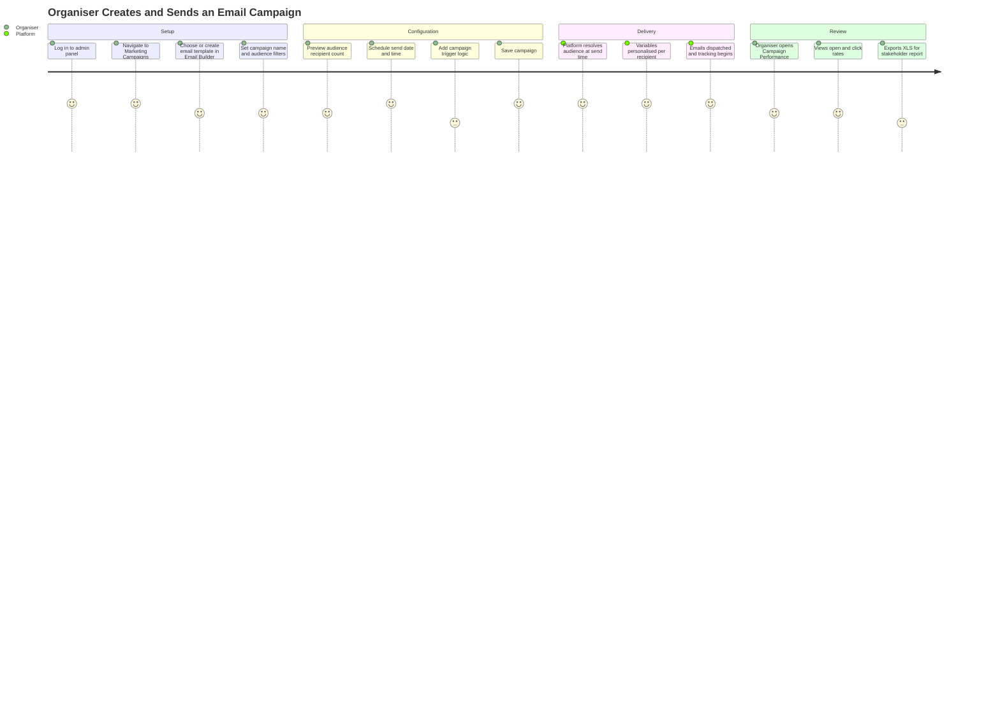
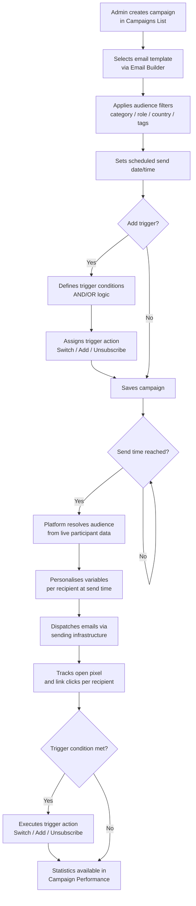
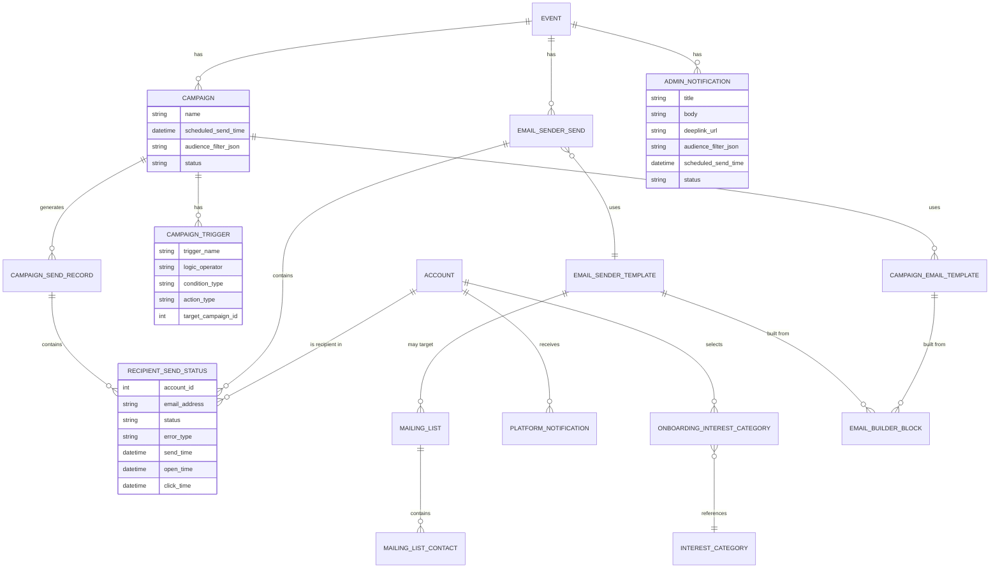
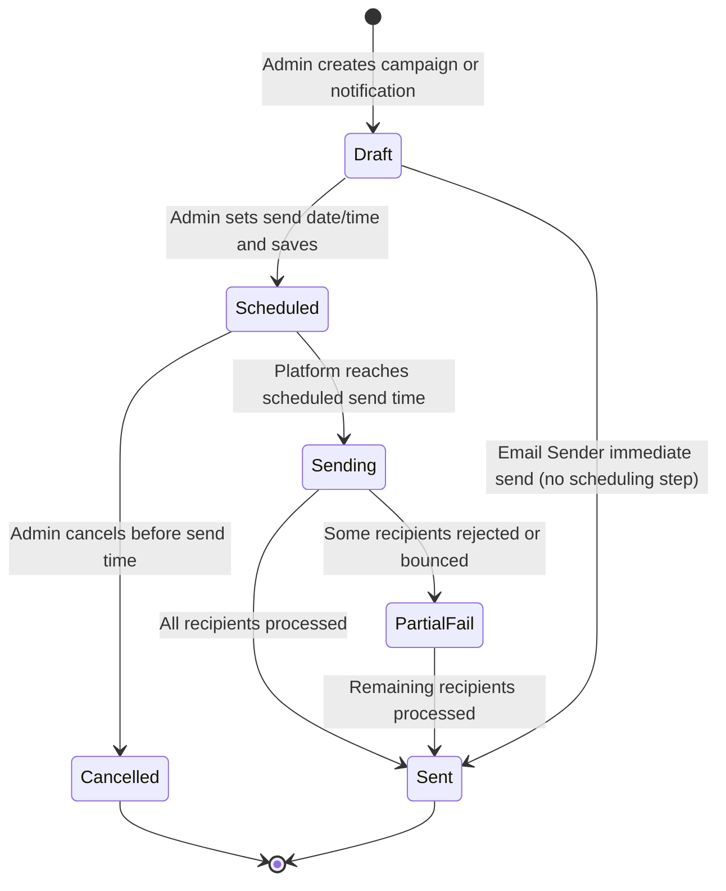
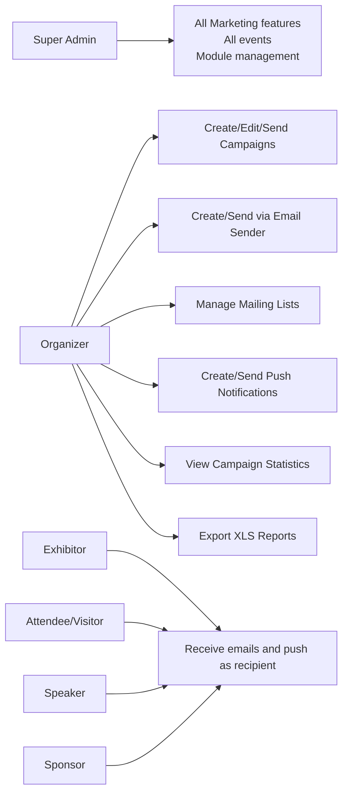

## 1. Product Overview

**Purpose.** User Engagement is ExpoPlatform's messaging engine — the suite of tools that lets event organisers communicate with attendees, exhibitors and other participants through email campaigns, push notifications, and automated in-platform alerts throughout the entire event lifecycle (pre-event, live, post-event).

**Problem being solved.** Event engagement does not happen automatically. Without proactive, targeted communications, attendees fail to complete profiles, exhibitors miss leads, and sessions go undiscovered. A proliferation of generic blast emails achieves little; what organisers need is a multi-channel messaging stack that can target specific audience segments, personalise content with AI-driven recommendations, schedule messages at optimal times, and measure whether recipients actually act. User Engagement provides exactly this.

**Business value.**
- Two complementary email tools (Campaigns and Email Sender) cover both automated/scheduled nurture flows and immediate ad-hoc sends from a single admin panel.
- A shared drag-and-drop Email Builder means templates created in one context are reusable across all email touch-points on the platform.
- Personalised content variables (Recommended Exhibitors, Sessions, Products, Incoming Meetings, Profile Views) drive measurable re-engagement by surfacing AI-matched content for every individual recipient.
- Scheduled Push Notifications with advanced audience filters reach mobile app users instantly, even without an email open.
- Standard Platform Notifications automate the transactional layer (meeting requests, session reminders, favourites), freeing organisers from manual outreach.
- Campaign trigger logic enables branching nurture sequences — users who click a recommendation join a different follow-up track automatically.

**Target users.** Event organisers and marketing managers who configure and send communications via the admin panel (`/admin/marketing/`). End recipients are attendees, exhibitors, sponsors and speakers.

**User personas.**
- *Event Marketing Manager* — owns the pre-event campaign calendar; builds nurture sequences for both exhibitors and participants; monitors open and click rates.
- *Event Operations Manager* — sends ad-hoc Email Sender blasts (e.g. last-minute schedule changes); manages mailing lists.
- *Exhibitor Success Manager* — uses campaign triggers and exhibitor-specific templates to drive exhibitor profile completion and lead scanning.
- *Attendee* — receives personalised emails, push notifications, and in-app bell notifications; does not directly access admin tools.
- *Platform Super Admin* — enables/disables the Marketing module per event; manages sender domain settings.

**Success metrics.** Email open rate; email click rate; push notification delivery and interaction rate; campaign-triggered user flow conversion (Switch trigger activations); profile activation rate from Activation Link variable; reduction in dormant user counts after nurture sequences.

## 2. Product Scope

### Included
- **Marketing Email Campaigns** — scheduled, trigger-based multi-email sequences with audience segmentation, advanced filters, open/click tracking, campaign triggers, and email variable support.
- **Email Sender** — immediate real-time email sends to registered participant segments or custom mailing lists; sent-email statistics; mailing list management.
- **Shared Email Builder** — drag-and-drop template editor used across Campaigns, Email Sender, registration emails, networking emails, and Hosted Buyers emails; rich text editor, image/block management, multi-language support, test send, and download.
- **Email Variables** — four groups: Standard Variables, Recommended Content, User Engagement Metrics, and Event Information; personalise every recipient's email body with AI-matched content.
- **Default Email Campaign Templates** — six pre-built templates available for events created after 8 November 2023, covering pre-event and live-event messaging phases.
- **Campaign Triggers** — conditional logic (AND/OR) to Switch, Add, or Unsubscribe recipients between campaigns based on email interaction events.
- **Campaign Performance & Statistics** — per-campaign send, open, and click tracking; exportable XLS report.
- **Scheduled Push Notifications** (Admin Notifications) — push messages to web and mobile app users, scheduled for a future date/time, with advanced audience filters (category, role, country, tags, app engagement).
- **Standard Platform Notifications** — automatic transactional push/web alerts for meetings, sessions, favourites, and messages; configurable timing for session reminders.
- **Visitor Onboarding Tool** — post-first-login interest category selector; push/in-platform notification 5 minutes after onboarding completion directing users to recommendations.
- **Deeplinks for Sessions and Exhibitor Events** — read-only deeplink URL fields on session/event forms for direct sharing in external communications.
- **Mailing Lists** — custom email lists created manually or imported via XLS, scoped to Email Sender.
- **Recommended Email Campaigns & Timing** — platform guidance library for exhibitor and participant campaign tracks across LAUNCH, NURTURE, READY, SPRINT, and LIVE phases.

### Excluded
- SMS / WhatsApp channels (not offered on the platform).
- Transactional registration system emails (Welcome, Password Reset — covered under Registration).
- Hosted Buyers-specific email notifications (covered by Hosted Buyers Management).
- Exhibitor Manual vendor email notifications (covered by Exhibitor Manual product).
- Third-party ESP (Mailchimp, HubSpot) integrations — platform uses its own sending infrastructure.
- In-app chat messaging between participants (covered by Networking & Matchmaking).

## 3. User Roles

| Role | Capabilities in User Engagement | Notes / Restrictions |
| --- | --- | --- |
| **Organizer (Admin)** | Create/edit/send Campaigns; send via Email Sender; manage mailing lists; create/send push notifications; view all statistics and exports | Full Marketing module access for their event; cannot modify platform-level sender domain |
| **Super Admin** | All organizer capabilities plus module enable/disable; manage custom sender domains | Can enable/disable Marketing module globally or per event via Module Management |
| **Exhibitor** | Receives emails and push notifications as a recipient; no admin panel access | Exhibitor Name, Role, Stand/Hall Number variables are personalised for exhibitor recipients |
| **Sponsor** | Receives emails and push notifications as a recipient; no admin panel access | Can be targeted by category in campaign audience filters |
| **Attendee / Visitor / Buyer** | Receives personalised emails and push notifications; can unsubscribe; selects interests during onboarding | Recommended Content variables are personalised per recipient's matchmaking profile |
| **Speaker** | Receives emails and push notifications as a recipient; no admin panel access | Recommended Speakers variable targets this group |
| **Team Member (Exhibitor staff)** | Receives emails and push notifications; no admin panel access | Exhibitor role variable resolves to Admin or Team Member |

> [!INFO] The Marketing module must be enabled in Module Management before Campaign, Email Sender, and Admin Notifications features appear in the admin panel.

## 4. Feature Inventory

#### Marketing Email Campaigns

**Description.** A scheduled, trigger-based email marketing tool found at `Marketing > Campaigns`. Organisers create campaigns containing one or more email sends, assign them an audience segment, set a send date/time, and optionally attach trigger logic to move recipients between campaigns based on their interactions.

**Why it exists.** Unlike Email Sender (which sends once immediately), Campaigns support the full lifecycle of event marketing — pre-event nurture, launch day activation, live-event re-engagement, and post-event follow-up — without requiring the organiser to be present at send time.

**User value.** Organisers can build an entire event communication plan in advance; recipients receive timely, relevant, personalised messages; advanced filters ensure only the right audience receives each message; trigger logic automates journey branching without manual intervention.

**Functional logic.** A campaign is created with a name, target audience (filtered by participant category, role, country, tags, registration status, activity categories, app engagement), a scheduled send date/time, and one or more email templates. At send time, the platform resolves the audience filter to a list of recipients and dispatches the emails. Open and click events are tracked per recipient. If a trigger is defined, the platform evaluates the trigger condition (opened, clicked, clicked specific element type) against each tracked interaction and executes the trigger action (Switch, Add, Unsubscribe) asynchronously.

**Preconditions.** Email template must exist (created via Email Builder); audience segment must be non-empty; Marketing Campaigns module enabled; event must have been created (for default templates, after 8 November 2023).

**Trigger conditions.** Campaign send time reached; recipient email opened; recipient clicked a link; recipient clicked matched card from Recommended Content variable; recipient clicked Activation Link, Speakers, Exhibitors, Visitors, or Sessions elements.

**Processing logic.** Platform batches the send per event; each recipient's email is personalised with variables resolved at send time (Recommended Content is computed from matchmaking algorithm at the moment of send). Delivery status, open pixel, and click tracking are recorded per recipient.

**Outputs.** Delivered emails per recipient; send/open/click statistics (shown in Campaign Performance modal and stats page); XLS export; trigger actions executed.

**Dependencies.** Email Builder; Matchmaking/AI engine (for Recommended Content variables); Event database (for Event Information variables); participant profile data (for Standard Variables).

**Configurations.** Audience segment filters (category, role, country, tags, status, interests, app engagement); send date/time (timezone follows event settings); trigger AND/OR logic with conditions and actions; email template and language.

**Validation rules.** Template must not be blank (system warning on save attempt); audience preview count shown before send; trigger must reference a variable that is present in the template.

**Permissions.** Organizer and Super Admin only.

**Error handling.** If an email address is invalid (empty, fake domain `@expoplatform.eu`, or MX issue), the error type is shown in the sent-email table (EP-14907). Unapproved accounts on private events are excluded automatically. Variable display issues (font-size 0) require template rebuild as described in the Email Templates troubleshooting guide.

**Edge cases.** If a recipient has unsubscribed from emails, they are excluded from the send. If the matchmaking algorithm returns no recommendations for a recipient (e.g. no interest categories set), the Recommended Content variable renders empty. If a campaign is triggered to Switch a user but the target campaign has already completed, the user is enrolled in the completed campaign state.

---

#### Email Sender

**Description.** A real-time email dispatch tool found at `Marketing > Email Sender`. Organisers select an email template, choose a target audience (registered user segments or a custom mailing list), and send immediately. No scheduling, no triggers.

**Why it exists.** Campaigns require advance planning. Email Sender covers urgent, one-time communications — last-minute agenda changes, welcome notes on opening day, badge-collection reminders — where the organiser needs immediate dispatch.

**User value.** Instant reach to any defined audience segment or custom uploaded list; suitable for transactional or operational communications; per-send statistics visible in Sent Emails tab.

**Functional logic.** Organiser selects a template (drafted via Email Builder in the Templates tab), chooses audience filter options (participant role/category and/or a mailing list), and clicks send. The send executes immediately with no scheduling option. Results appear in the Sent Emails tab.

**Preconditions.** Template must exist under `Marketing > Email Sender > Templates`; audience must be non-empty or a valid mailing list must exist.

**Trigger conditions.** Manual action by organiser (click Send).

**Outputs.** Delivered emails; per-campaign stats in Sent Emails: Total Sent, Sent%, Opened%, Clicks%; per-recipient status table (Sent, Opened, Click, Error); XLS export.

**Dependencies.** Email Builder; Mailing Lists; participant registration data.

**Configurations.** Target audience filter (role, category, mailing list); email template selection; from-name and reply-to (as set in template).

**Validation rules.** Template subject and from-name are mandatory in Email Builder. Emails created in multi-language are sent in the user's registered language preference; if no preference is set, default language is used.

**Permissions.** Organizer and Super Admin only.

**Error handling.** Fake email (`@expoplatform.eu`), empty email, or MX-issue accounts are flagged in the Error column of the Sent Emails table (EP-14907). Barcode/QR/Activation Link variables only resolve for accounts that exist in the platform; external mailing list contacts without a platform account receive emails without those variable values.

**Edge cases.** For private events, only approved accounts receive emails; unapproved accounts are silently skipped. If a custom mailing list contains duplicate email addresses, each appears as a separate row in statistics. Mailing lists can be re-used across multiple sends; deletions are permanent and not recoverable.

---

#### Shared Email Builder

**Description.** A drag-and-drop WYSIWYG template editor used wherever email templates exist across the platform: Campaigns, Email Sender, Registration emails, Networking & Matchmaking emails, Exhibitor Manual emails, and Hosted Buyers emails. Located within each feature's template section; the builder interface is identical regardless of context.

**Why it exists.** A single builder reduces training overhead, ensures visual consistency across all event emails, and allows admins who learn the builder in one area to immediately be productive in others.

**User value.** Non-technical admins can design professional, branded emails with images, buttons, and personalisation variables without writing HTML; the same design skills transfer across all email areas.

**Functional logic.** The builder is composed of: (1) General Info fields (template name, copy-from, subject, from-name, from-email prefix/domain, reply-to); (2) a Block canvas where blocks (text, image, mixed, divider, footer) are added via drag-and-drop; (3) per-block controls (drag, reorder up/down, copy, delete, image upload, button); (4) a rich text editor activated by clicking inside any text block; (5) a Content panel for block-level show/hide toggles and link settings; (6) a Style panel for background color, font, size, color; (7) a Top panel with Undo/Redo, Gallery (image library), Live Mobile Preview, Test Send, and Download.

**Preconditions.** User must be authenticated in admin panel; target feature's template section must be accessible.

**Outputs.** Saved email template; test email dispatched to specified address; downloadable HTML.

**Configurations.** Sender domain can be the platform's own (`expoplatform.com`) or a custom external domain configured at event level; multi-language templates require the event's multilanguage setting to be enabled; variables available differ by context (Campaigns variables vs. Email Sender variables vs. registration email variables).

**Validation rules.** Template name is mandatory. System shows an unsaved-changes warning if navigating away before saving. System shows an empty-template warning on save attempt. Browser navigation (back button, new tab) does not trigger the unsaved-changes popup — only in-builder navigation buttons do.

**Permissions.** Organizer and Super Admin. Variables available depend on the context (e.g. Recommended Content variables are only available in Campaigns).

**Error handling.** If a variable renders blank (e.g. font-size 0 caused by copied custom styles), the fix is to remove the variable, clear surrounding spacing, and re-insert. Display variable rendering issues in Outlook are a known limitation; troubleshooting via fresh blank template to isolate custom style conflicts.

---

#### Email Variables (Campaigns)

**Description.** Merge-tag tokens insertable into campaign email templates, resolved per recipient at send time. Organised into four groups: Standard Variables, Recommended Content, User Engagement Metrics, and Event Information.

**Why it exists.** Static emails cannot drive personalised engagement. Variables allow every recipient to receive content matched to their identity and behaviour: their own name and role, their personal recommended exhibitors and sessions, their incoming meeting count, and live event stats.

**User value.** Each recipient's email feels individually curated; Recommended Content drives click-through to the platform; Engagement Metrics (profile views, meetings, chats) surface social proof motivating activity.

**Functional logic.**
- **Standard Variables:** First Name, Last Name, Email, Platform Link, Login URL, Event Name, Exhibitor Name, Exhibitor Role, Activation Link, Print Badge Link, Badge Bar Code, Badge QR Code, Profile URL.
- **Recommended Content:** Recommended Exhibitors, Products, Sessions, News, Visitors, Speakers, Sponsors — each resolved from the matchmaking algorithm at send time. Number of cards per variable is configurable (gear icon in builder). Cards include direct links, meeting request, message, and favourite interaction buttons.
- **User Engagement Metrics:** Number of Views (profile views for that user), Number of Meetings (confirmed meetings for that user), Number of Chats, Incoming Meetings (count + link to My Meetings > Incoming tab), Incoming Messages (up to 4 recent chat previews with person/company name, date, and 2-line preview).
- **Event Information:** Number of Exhibitors (active only), Number of Products (active only), Number of Meeting Requests (all statuses). Data sourced from Analytics > General Dashboard.

**Preconditions.** For Recommended Content to populate, the recipient must have interest categories set in their profile; matchmaking must be enabled. For Badge variables, the recipient must have a badge assigned in the system.

**Configurations.** Number of Recommended Content cards: configurable via gear icon per variable; PROFILE_URL variable can be embedded as a link within any template element (EP-20862).

**Edge cases.** If a user has no interest categories, Recommended Content variables render empty. If a user's profile has no QR/bar code, badge variables render nothing. Activation Link shows "Account already active" if the account was previously activated via API or back-office.

---

#### Default Email Campaign Templates

**Description.** Six platform-provided pre-built campaign email templates available under `Marketing > Campaigns` for events created after 8 November 2023.

**Why it exists.** Reduces time-to-first-campaign for new event setups; provides a proven structure covering pre-event and live-event phases.

**User value.** Organisers can launch their first campaign in minutes by customising banner and footer on a ready-made template rather than building from scratch.

**Functional logic.** Templates are automatically provisioned on event creation. They can be previewed, cloned, and customised. When an event is cloned, templates and all language versions carry over to the new event.

**Available templates.**
- Pre-Event Template 1: Subject "Your Essential Event Kickstart Guide" — Login URL + Recommended Products.
- Pre-Event Template 2: Subject "Your Personalized Event Experience Awaits!" — Recommended Products + Sessions.
- Pre-Event Template 3: Subject "Get Ready for Your Upcoming Event Interactions" — Engagement Metrics.
- Pre-Event Template 4: Subject "Complete Your Registration and Get Your Electronic Badge Now!" — App Download Links.
- Pre-Event Template 5: Subject "Explore Your Personalized Event Experience and Recommendations" — Event Information + Recommended Products.
- Event Template 6: Subject "Welcome to Day 1 of an Exciting Week!" — Recommended News + Sessions.

**Configurations.** Each template has a default banner and footer that must be replaced with event branding. Multi-language versions can be added once multilanguage is enabled.

---

#### Campaign Triggers

**Description.** Conditional automation rules attached to a campaign that evaluate a recipient's email interaction and then perform one of three actions: Switch (move recipient to another campaign), Add (enrol in an additional campaign while staying in current), or Unsubscribe (remove from the campaign).

**Why it exists.** Enables journey branching without manual segmentation — recipients self-sort based on their behaviour, removing engaged users from re-engagement tracks and routing interested users to deeper content sequences.

**User value.** Organisers can build multi-track nurture flows (e.g. "if the attendee clicked on a recommended exhibitor, move them to an exhibitor-focused sequence") that operate autonomously across thousands of recipients.

**Functional logic.** Each trigger has a name, a logical operator (AND / OR for combining conditions), and one or more conditions. Conditions evaluate: `opened`; `clicked` (any link); `clicked matches` (any Recommended Content card); `clicked activation link`; `clicked speakers`; `clicked exhibitors`; `clicked visitors`; `clicked sessions`. The template must contain the variable corresponding to the condition (e.g. a Sessions variable must be present if the condition is `clicked sessions`). Once the condition is met, the action executes: Switch, Add, or Unsubscribe.

**Configurations.** AND/OR logic between conditions; target campaign for Switch and Add actions.

**Edge cases.** If the target campaign for a Switch is the same campaign, behaviour is undefined — avoid creating self-referential triggers. If the template does not contain the variable referenced by the trigger condition, the condition can never fire.

---

#### Campaign Performance

**Description.** Statistics view for Marketing Email Campaigns, accessed via the "Show statistics" button on the Campaigns List page.

**Why it exists.** Organisers need to evaluate whether a campaign achieved its engagement goals before deciding to proceed to the next send in a sequence.

**User value.** Single-view visibility into how many recipients received, opened, and clicked; per-recipient drill-down and XLS export for deeper analysis.

**Functional logic.** The summary modal shows campaign name, send date/time(s), Total Sent count, and Opened count. Clicking "Show more" opens the full stats page with: Total Sent and Opened totals; a per-send-date breakdown table with columns for Send Date, Recipient Name, Email, Status (Sent / Opened / Click); search bar; pagination; and XLS export.

**Outputs.** Statistics modal; full statistics page; XLS export of recipient-level status data.

---

#### Scheduled Push Notifications (Admin Notifications)

**Description.** Organiser-initiated push notifications sent to mobile app and web users, configurable with a specific send date/time and an advanced audience filter. Found at `Marketing > Admin Notifications`.

**Why it exists.** Email is not always read in time. Push notifications reach mobile app users immediately, making them ideal for time-sensitive announcements (session starting, booth location change, prize draw).

**User value.** Organisers reach a precisely targeted audience on their device with a short, high-visibility message at exactly the right moment; audience preview shows recipient count before sending.

**Functional logic.** Organiser creates a notification with a message title and body, an optional deep link or attached entity, a recipient filter (advanced filters: user category, role, country/region, registration status, tags, interest/activity categories, app engagement), and a scheduled send time. The audience preview updates in real time as filters are applied. At the scheduled time, the platform dispatches the push to all matching recipients. Scheduled notifications can be edited or cancelled before the send time.

**Preconditions.** Mobile app must be live (for app push delivery); recipients must have the app installed and notifications enabled (for mobile delivery). Web notifications are delivered regardless of app install status.

**Advanced filter criteria.** User category; role; country/region from profile; registration status (registered, confirmed, checked in); tags on participant profile; activity/interest categories; app engagement (logged in or not logged in to mobile app). Filters are AND-combined by default. If no participants match the current filter combination, the notification cannot be sent until criteria are relaxed (EP-13566, EP-40080).

**Outputs.** Push notification delivered to web (bell icon) and mobile app. No open/click analytics beyond delivery confirmation.

**Configurations.** Send immediately or schedule for future date/time; deep link attachment; audience filter combination.

**Edge cases.** If zero recipients match the filter, the send is blocked. Filter selections do not retroactively apply to notifications already sent. Recipients who have disabled push notifications on their device do not receive the mobile push but may still see a web notification.

---

#### Standard Platform Notifications

**Description.** Automatic system-generated push and web notifications delivered to visitors and exhibitors in response to specific platform events. Not configurable in content, but timing of session notifications is configurable.

**Why it exists.** Transactional notifications are essential for real-time event participation — without them, users miss meeting requests, session reminders, and social interactions.

**User value.** Participants stay informed without having to actively check the platform; meeting confirmations and session reminders reduce no-shows; favourite and message alerts drive engagement.

**Functional logic.** Notifications are generated by platform events in real time. Session reminder notifications are dispatched at a configurable interval before the session start time (configured at `Management > Sessions > Config` using "Notifications Before Session/Exhibitor Event Start (mins)"; multiple intervals supported, e.g. 30 mins and 5 mins, generating two separate notifications). Both web and mobile app notifications are affected by this setting.

**Visitor notification events.** Session added/removed from schedule; session starts in N minutes (web: "[Session] starts in X minutes!"; app: "Reminder: Session starts in X minutes"); exhibitor favourited visitor/scanned badge ("…has favourited your profile"); message from exhibitor; meeting request, confirmation, reschedule, cancellation, 10-minute reminder, and started events; offline meeting request, reschedule, cancellation, and 10-minute reminder; meeting rate request after meeting ends.

**Exhibitor notification events.** Visitor favourited/scanned badge; visitor favourited product; meeting request, confirmation, reschedule, cancellation, 10-minute reminder, and started events (online and offline); meeting rate request after meeting ends.

**No-notification cases.** Liking a session in the app generates no notification. Chat notifications fire only once (when the chat is first created) — not for each subsequent message. Offline meeting started has no notification.

**Configurations.** Session reminder timing: `Management > Sessions > Config > Notifications Before Session/Exhibitor Event Start (mins)`. Adjusting timing impacts both web and mobile app notifications simultaneously.

---

#### Visitor Onboarding Tool

**Description.** First-login interest category selection flow for individual visitor accounts. Configured at `Management System > Networking & Matchmaking > Onboard`. Onboarding is enabled per event in Module Management.

**Why it exists.** Personalised recommendations (and thus personalised email variables) only work if the user has declared their interests. Onboarding collects those interests at the earliest opportunity — first login.

**User value.** Visitors receive relevantly matched exhibitors, sessions, and products; the onboarding popup with multilingual support reduces friction; a push/in-platform notification 5 minutes after completion directs users to their recommendations page.

**Functional logic.** On first login, visitors see an interest category selection popup. The popup can be made mandatory or skippable (with re-appearance on subsequent logins if skipped, per admin settings). Submitted categories are added to the profile. A notification is sent 5 minutes after onboarding completion directing the user to the recommendations page. If no new matches are found, random items are displayed. Onboarding is exclusive to individual accounts; exhibitor accounts are not targeted.

**Configurations.** Enable/disable onboarding; category groups; multilingual text; mandatory vs. skippable; reappearance frequency if skipped; custom onboarding text and success messages.

---

#### Deeplinks for Sessions and Exhibitor Events

**Description.** Auto-generated deeplink URLs for individual sessions and exhibitor events, accessible as a read-only field on session/event edit forms and included in exports.

**Why it exists.** Organisers and exhibitors need shareable links to specific sessions for use in external communications (emails, social media, printed materials).

**User value.** Opens in the event mobile app (if installed) or in the browser; promotes targeted sessions directly in campaign emails; reduces navigation friction for focused audiences.

**Functional logic.** When deeplinks are enabled for the event, each session and exhibitor event record displays two URL values: the web URL and the app deeplink URL. If a recipient opens the app deeplink with the event app installed, it opens the session directly in-app. Without the app installed, the browser opens the session page.

---

#### Mailing Lists (Email Sender)

**Description.** Custom email lists created manually or uploaded via XLS, managed at `Marketing > Email Sender > Mailing Lists`. Lists are used as audience targets in Email Sender sends.

**Why it exists.** Organisers sometimes need to send emails to contacts who are not registered on the platform (e.g. prospects, partners, press) or to a precisely curated subset that does not match a system filter.

**User value.** Flexibility to reach any email address, not just platform participants; list reuse across multiple Email Sender sends; XLS upload for bulk import.

**Functional logic.** Lists are created via "Add New List". Contacts can be added manually (Name, Surname, Email required) or uploaded via XLS (same required columns; Description, Date of Subscribe, Time of Subscribe, Subscribed, and Valid columns are auto-generated). Lists show: Name, Creation Date, Contacts count, Email Address count. Filter options within a list: Only Valid (valid email addresses only) and Only Subscribed. Export to XLS is available per list. Contact-level management: individual contacts can be deleted; Save button commits all list edits.

**Configurations.** List name (renameable); contact-level description (internal only, not shown to recipients).

**Validation rules.** Name, Surname, and Email are required for each contact. Barcode/QR/Activation Link/Print Badge variables only resolve for contacts that have a platform account; external-only list contacts receive emails without those variable values.

**Edge cases.** Unapproved accounts on private events are excluded even if added to a mailing list. Invalid email addresses in the list are flagged in the Valid column and excluded from sends if "Only Valid" filter is applied.

---

## 5. User Stories Mapping

| Story ID | Title | Summary | Acceptance Criteria | Related Feature | Status |
| --- | --- | --- | --- | --- | --- |
| EP-1085 | Admin Notifications (Informa) | Redesign of admin push notification panel with new UI | New UI live in admin panel; push notifications sendable via redesigned interface | Scheduled Push Notifications | COMPLETE |
| EP-1113 | (New UI) Notifications | Bell-icon in-platform notification centre with new design | Notifications appear in bell icon; prototype designs implemented | Standard Platform Notifications | COMPLETE |
| EP-2037 | Disable email setting for all email templates | Ability to disable any email template individually | All existing and future email templates can be disabled; disabled by default | Email Builder / Templates | COMPLETE |
| EP-11098 | Passwordless login | One-time password login flow for front-end | OTP modal shown on login attempt; OTP delivered by email; user authenticated | Email Sender / Registration emails | COMPLETE |
| EP-11298 | Update design of Marketing Content page | "Open Profile" added to action dropdown on Marketing Content page | Action dropdown contains Open Profile option; designs from Figma implemented | Email Sender | COMPLETE |
| EP-11784 | Email nurturing (Epic) | Create email templates and Admin Panel redesign for marketing conversion sequences | Email nurture templates created; Admin Panel updated if needed | Marketing Campaigns / Email nurturing | COMPLETE |
| EP-12726 | Indication of Fake Email (DWTC) | Show visual flag on fake email accounts in Participants list and Meeting Wizard | Fake email (`@expoplatform.eu`) accounts visually flagged in admin panel | Email Error Indication | COMPLETE |
| EP-13566 | Segmentation of Push Notifications | Advanced filters for Admin Notifications audience selection | Push notifications can be filtered by category, role, country, tags, activity, app engagement; recipient count preview shown | Scheduled Push Notifications | COMPLETE |
| EP-14907 | Indication of email errors in admin panel | Extend email error indicators: empty email and MX issue added alongside fake email | Empty email and MX-issue accounts flagged in Participants list and Meeting Wizard | Email Error Indication | COMPLETE |
| EP-14942 | Resend Activation Email for Inactive users in App | Ability to resend activation email to inactive users from within the app | Activation email can be triggered for inactive accounts | Email Sender / Templates | COMPLETE |
| EP-15816 | Variables with pictures and value | Email nurturing variables with image thumbnails and personalised values | Variables render with images per Figma design; user-specific content shown per recipient | Email Variables / Recommended Content | COMPLETE |
| EP-15993 | Identifier setting for Visit integration | Setting to use email or external ID as identifier for Visit integration | Setting exists in General Settings under Visit integration; email/external ID selectable | Email Sender / Integrations | COMPLETE |
| EP-20555 | Campaigns refresh (1st iteration) | Full UI refresh of Campaigns section in admin panel | Campaigns UI matches Figma designs; prototype flow functional | Marketing Campaigns | COMPLETE |
| EP-20714 | Incoming messages variable | New Incoming Messages variable showing recent chat previews | Variable shows up to 4 recent chat previews; header, date, and 2-line text preview included | Email Variables — User Engagement Metrics | COMPLETE |
| EP-20862 | Variable for moving to profile | PROFILE_URL variable linking to user's profile dashboard | PROFILE_URL variable created; clickable in any template element; directs to /newfront/profile/dashboard | Email Variables — Standard | COMPLETE |
| EP-23413 | Additional tasks to Campaign redesign (2nd iteration) | Variable display redesign: merged-with-text variants and more visible card-style variants | Variables render correctly per updated Figma; text-merge and card variants implemented | Email Builder / Variables | COMPLETE |
| EP-40078 | Advanced Filters for Campaigns | Meeting program and Round Tables progress variables usable in Campaigns | Campaign audience can be filtered by meeting program / round table status; variables available | Marketing Campaigns / Advanced Filters | COMPLETE |
| EP-40080 | Advanced Filters for Admin Notifications | Meeting program and Round Tables variables in push notifications | Admin Notifications recipient filter includes meeting program and round table criteria | Scheduled Push Notifications | COMPLETE |
| EP-40081 | Variables for Email Campaigns | Meeting Program and Round Tables variables for Campaigns | Organizers can configure campaign variables for meeting/round-table progress; recipients see personalised status | Email Variables — Meeting Program | COMPLETE |

## 6. End-to-End Workflows

### Organiser Email Campaign Journey

### Campaign System Workflow

### Happy Path
Organiser creates a campaign with a pre-event template and audience filter "All Visitors". Schedule is set for 7 days before event open. At send time the platform resolves 1,400 visitor accounts, personalises each email with their recommended exhibitors and incoming meeting requests, dispatches all 1,400 emails, and records delivery, open, and click events. 35% open rate; 12% click rate. A trigger on "clicked exhibitors" routes 168 clickers into a "Exhibitor Engagement" follow-up campaign automatically.

### Alternate Path
Organiser is sending day-of via Email Sender (not Campaigns) because a keynote session location changed. Selects "All Visitors" in Email Sender, picks a pre-drafted "Important Update" template, and sends immediately. 1,400 emails dispatched within 2 minutes. Statistics appear in Sent Emails tab.

### Exception Path
Organiser schedules a push notification to attendees "in-app but not logged in last 7 days". The advanced filter returns zero recipients. The platform blocks the send and surfaces the zero-count warning. Organiser adjusts the inactivity window to 14 days; count becomes 245; send proceeds.

### Recovery Path
Organiser discovers a campaign template contained a variable with invisible text (font-size 0 from copied custom styles). The variable rendered blank for all 1,400 recipients. Organiser rebuilds the template in a new blank template, re-inserts the variable from scratch, clones the original campaign to the repaired template, and reschedules the send to the same audience segment.

## 7. Business Rules Engine

| Rule | Condition | Exception / Priority | Conflict Resolution |
| --- | --- | --- | --- |
| Unapproved private-event accounts excluded | Private event; account approval status = unapproved | None — hard exclusion | Account must be approved before it can receive any email |
| Unsubscribed users excluded from Campaign sends | Recipient has unsubscribed from campaign | None | Unsubscribe is permanent for that campaign; re-subscribe not available via admin panel |
| Recommended Content requires interest categories | Recipient has no interest categories set | Variable renders empty rather than failing | Organiser should prompt users to complete profiles via a separate activation email |
| Trigger condition must match template variable | Trigger condition references a click type (e.g. clicked sessions) | If template lacks the variable, condition can never fire — no error raised | Admin must ensure template contains the variable referenced in the trigger |
| Fake / empty / MX-issue emails flagged | Email domain = `@expoplatform.eu`; email field empty; MX record missing/invalid | Flag is informational; email is still attempted but likely to bounce | Admin should correct or exclude flagged accounts before sends |
| Session reminder timing applies to both web and app | Timing changed at Management > Sessions > Config | Multiple intervals allowed; each generates a separate notification | Both channels always updated simultaneously — no per-channel timing override |
| Push notification filter AND logic | Multiple filter criteria selected | If zero recipients match, send is blocked | Relax one or more criteria to increase recipient pool |
| Mailing list variables limited to platform accounts | External contact without platform account | Barcode / QR / Badge / Activation Link variables render empty | Only Standard Variables (Name, Surname, Email) resolve for external contacts |
| Template language falls back to default | Recipient has no registered language preference | If multilanguage template exists but no preference set, default language used | Ensure default language template is always fully completed |
| Campaign triggers are evaluated asynchronously | Trigger condition met after email delivery | Slight delay possible between interaction event and trigger execution | Not a guaranteed real-time action — acceptable latency; no retry on failure documented |

## 8. Data Model

### Campaign/Message Lifecycle State Diagram

### Key Data Objects

**Campaign.** Belongs to an Event. Contains: name, audience filter (JSON), scheduled send date/time, associated email templates, status (Draft / Scheduled / Sending / Sent), list of triggers.

**Campaign Trigger.** Belongs to a Campaign. Contains: trigger name, logic operator (AND/OR), one or more condition objects (type + value), action type (Switch/Add/Unsubscribe), target campaign ID.

**Recipient Send Status.** Per-account per-send record. Contains: account ID, email address, status (Sent/Opened/Click/Error), error type (empty email / fake email / MX issue / delivery failure), timestamps.

**Admin Notification.** Belongs to an Event. Contains: title, body, optional deeplink, audience filter (JSON), scheduled send time, status.

**Mailing List.** Belongs to an Event (Email Sender scoped). Contains: list name, array of contacts (Name, Surname, Email, Description, subscribed flag, valid flag).

**Platform Notification.** Per-account per-event record generated by system events. Contains: recipient account ID, notification text, delivery channel (web/app), read status, timestamp.

**Email Builder Template.** Belongs to a feature context (Campaign / Email Sender / Registration etc.). Contains: template name, subject, from name, from email, reply-to, array of content blocks (type, text/HTML, image URL, button link, style settings), language code.

## 9. Permissions Matrix

### Role × Capability Matrix

| Capability | Super Admin | Organizer | Exhibitor | Attendee | Speaker | Sponsor |
| --- | --- | --- | --- | --- | --- | --- |
| Create / edit campaign templates | Yes | Yes | No | No | No | No |
| Send Marketing Campaign | Yes | Yes | No | No | No | No |
| Send via Email Sender | Yes | Yes | No | No | No | No |
| Manage mailing lists | Yes | Yes | No | No | No | No |
| Create / send push notifications | Yes | Yes | No | No | No | No |
| View campaign statistics | Yes | Yes | No | No | No | No |
| Export statistics to XLS | Yes | Yes | No | No | No | No |
| Configure session notification timing | Yes | Yes | No | No | No | No |
| Enable / disable Marketing module | Yes | No | No | No | No | No |
| Configure sender domain | Yes | No | No | No | No | No |
| Configure onboarding categories | Yes | Yes | No | No | No | No |
| Receive emails as recipient | Yes | Yes | Yes | Yes | Yes | Yes |
| Receive push notifications | Yes | Yes | Yes | Yes | Yes | Yes |
| Unsubscribe from campaign | No | No | Yes | Yes | Yes | Yes |

## 10. Integrations

| Integration | Purpose | Trigger | Data Exchanged | Failure Handling | Retry | Security |
| --- | --- | --- | --- | --- | --- | --- |
| **Email Sending Infrastructure (internal)** | Dispatches all platform emails (Campaigns, Email Sender, transactional) | Campaign scheduled send time; Email Sender manual action; system event | Recipient email address, rendered HTML body, from/reply-to headers, tracking pixel, click tracking links | Delivery failures recorded per recipient in send status table with error type | No documented automatic retry; organiser must resend manually | Sending domain configured at event level; custom external domains supported |
| **Matchmaking / AI Recommendation Engine** | Resolves Recommended Content variables (Exhibitors, Products, Sessions, News, Visitors, Speakers) at email send time | Campaign email dispatch | Recipient account ID → ranked recommendation list of entity IDs and metadata | If engine returns empty (no interests set), variable renders blank — no send failure | Not applicable — blank output is the fallback | Internal service call; no external API |
| **Mobile App Push Infrastructure (Firebase / APNS)** | Delivers Admin Notification and standard push messages to iOS / Android devices | Scheduled send time (Admin Notifications); real-time system event (Standard Notifications) | Notification title, body, optional deeplink, device token | If device token invalid or app not installed, delivery silently fails; no retry documented | No documented retry | Device tokens managed by app SDK; deeplinks must be valid platform URLs |
| **Visit Integration (Kortrijkxpo)** | Identifier mapping for Visit badge scanning integration | Registration / profile sync | Account identifier: email or external ID (configurable via EP-15993) | Configuration error surfaced in General Settings; no automatic fallback | N/A | Identifier selection (email vs. external ID) configurable per event |
| **Analytics / General Dashboard** | Provides Event Information variable data (active exhibitor count, product count, meeting request count) | Variable resolved at email send time | Aggregate counts from Analytics module | If analytics data unavailable, variable may render stale count | N/A | Internal read from analytics data store |

## 11. Notifications

> [!INFO] User Engagement is itself the platform's notification engine. This section documents both the outbound channels it manages and the system-generated notifications it produces.

### Email Channels

| Notification Type | Tool | Timing | Recipients | Personalisation |
| --- | --- | --- | --- | --- |
| Scheduled marketing campaign email | Marketing Campaigns | Admin-configured date/time | Filtered participant segment (any role/category) | Full variable set: Standard, Recommended Content, Engagement Metrics, Event Information |
| Immediate ad-hoc email | Email Sender | On admin action (real-time) | Filtered segment or mailing list | Standard Variables + Email Sender variables (Name, Email, Badge, Activation Link, etc.) |
| Activation / welcome email (via Email Sender or Campaign) | Email Sender / Campaign | Manual or scheduled | Target segment | Activation Link, Platform Link, Login URL, Badge variables |
| Default pre-event campaign emails (Templates 1–6) | Marketing Campaigns | Admin-configured | All Visitors or filtered segment | Template-specific variables (see §4 Default Email Campaign Templates) |

### Push / In-Platform Notification Channels

| Notification Type | Channel | Timing | Recipients | Configurable? |
| --- | --- | --- | --- | --- |
| Admin Notification (scheduled push) | Web + Mobile App | Admin-scheduled | Advanced-filtered audience | Yes — timing, audience, message, deeplink |
| Session added to schedule | Web + App | Real-time | Visitor who added | No |
| Session removed from schedule | Web + App | Real-time | Visitor who removed | No |
| Session starts in N minutes | Web + App | N minutes before start | Visitors with session in schedule | Yes — N configurable per event in Sessions Config (multiple intervals) |
| Exhibitor/visitor favourited your profile | Web + App | Real-time | Profile owner | No |
| Exhibitor favourited your product | Web + App | Real-time | Exhibitor | No |
| Message received (chat created) | Web + App | Once on chat creation | Recipient | No |
| Online/offline meeting requested | Web + App | Real-time | Meeting target | No |
| Meeting confirmed | Web + App | Real-time | Requesting party | No |
| Meeting reschedule request | Web + App | Real-time | Other party | No |
| Meeting cancelled | Web + App | Real-time | Other party | No |
| Meeting 10-minute reminder | Web + App | 10 minutes before | Both parties | No |
| Online meeting started | Web + App | At meeting start | Both parties | No |
| Rate your meeting | Web + App | After meeting ends | Both parties | No |
| Onboarding complete — recommendations ready | Web + App | 5 minutes after onboarding | User who completed onboarding | No |

### What Does NOT Generate a Notification
- Liking a session in the mobile app.
- Each individual chat message after the initial chat creation.
- Offline meeting started.

## 12. Reporting & Analytics

### Campaign Performance Report

| Input | Metrics | Calculations | Filters | Export |
| --- | --- | --- | --- | --- |
| Selected campaign | Total Sent, Opened count, Opened %, Click count, Click % | Opened = unique open events / Total Sent × 100; Click = unique click events / Total Sent × 100 | Search by recipient name or email; pagination (items per page) | XLS (per-recipient: Name, Email, Status, Time) |

### Email Sender Sent Emails Report

| Input | Metrics | Calculations | Filters | Export |
| --- | --- | --- | --- | --- |
| Selected sent email | Total emails sent, Sent %, Opened %, Clicks % | Same ratio calculations as Campaign Performance | Filter by date; filter by template; sort by date or template (AND logic) | XLS (per-recipient: ID, Name, Email, Status, Error, Time) |

> [!INFO] No dedicated campaign reporting dashboard exists beyond these per-send statistics views. Aggregated email analytics across all campaigns are not natively consolidated — each campaign must be reviewed individually. For aggregate email activity, Organiser Analytics covers Email Notification Analytics and Email Tracking Analytics.

## 13. Configuration Guide

| Setting | Effect | Location | Who Can Set |
| --- | --- | --- | --- |
| Enable Marketing module | Shows/hides Campaigns and Email Sender in admin nav | Admin > General > Modules | Super Admin |
| Enable Admin Notifications module | Shows/hides Admin Notifications in admin nav | Admin > General > Modules | Super Admin |
| Enable Onboarding module | Shows/hides Onboard tab under Networking & Matchmaking | Admin > General > Modules | Super Admin |
| Custom sender domain | Changes the domain portion of the from-email address across all event emails | Event-level email settings | Super Admin |
| Sender from-name (per template) | Sets the display name shown in recipient's inbox | Email Builder > From Name field | Organizer |
| Reply-to address (per template) | Routes replies to a specified address | Email Builder > Reply To field | Organizer |
| Session notification timing | Controls how many minutes before session start a notification is sent; multiple values allowed | Management > Sessions > Config > Notifications Before Session/Exhibitor Event Start (mins) | Organizer |
| Campaign audience filter | Determines which participants receive a given campaign | Campaign creation / edit form | Organizer |
| Admin Notification advanced filters | Determines which participants receive a given push notification | Admin Notifications create/edit form | Organizer |
| Multilanguage templates | Enables creation of email template variants per language; recipients receive their preferred language | Event multilanguage setting enabled; language switcher in Email Builder | Organizer |
| Recommended Content card count | Controls how many recommendation cards appear in a given variable block | Gear icon on the variable in Email Builder | Organizer |
| Onboarding mandatory vs. skippable | Determines whether the interest category popup can be dismissed | Management > Networking & Matchmaking > Onboard settings | Organizer |
| Onboarding reappearance | Controls whether skipped onboarding reappears on next login | Onboarding settings | Organizer |
| Enable deeplinks for sessions | Activates the deeplink URL field on session and exhibitor event records | Event deeplinks setting | Organizer / Super Admin |
| Visit integration identifier | Selects whether email or external ID is used for Visit badge scanning integration | General Settings > Visit integration | Organizer / Super Admin |
| Disable individual email template | Prevents a specific system email template from being sent | Per-template toggle in email template list | Organizer |

## 14. Edge Cases

### User Edge Cases
- **Recipient has no interest categories set.** Recommended Content variables (Exhibitors, Products, Sessions, News) render empty in the email body. The email is still delivered. Organiser should send an activation/profile-completion email first.
- **Recipient has a fake email address (`@expoplatform.eu`).** Email is attempted but will fail delivery. Error is flagged in sent status. Admin should correct the email before next send (EP-12726).
- **Recipient has empty email field.** Excluded from send with "empty email" error flag (EP-14907).
- **Recipient has MX domain issue.** Attempted and flagged; delivery likely fails. Admin notified via error column (EP-14907).
- **External mailing list contact without platform account.** Receives email but Barcode, QR, Activation Link, and Print Badge variables are blank.

### Data Edge Cases
- **Recommended Content at send time shows stale data.** Variables are resolved at the moment of send, not at template creation. If event data changes significantly between template creation and send, recipients receive current data, not the data visible when the organiser designed the template. This is by design.
- **Variable rendering invisible due to custom styles.** Font-size 0 or white colour applied to a variable node causes blank display. Resolution: remove and re-insert the variable (EP-23413 addressed variable display consistency).
- **Large mailing list import via XLS.** Duplicate email rows each generate a separate send entry and appear as separate rows in statistics.
- **Clone event with existing templates.** All templates and language variants carry over intact. Admins must update banners, event-specific text, and from-email settings in the cloned event.

### Workflow Edge Cases
- **Campaign send time coincides with event registration surge.** Platform processes sends in batches; slight delay possible at high-concurrency periods. Statistics update asynchronously.
- **Trigger target campaign has already completed.** Switch action enrolls the user in the completed campaign at its terminal state; no new emails are generated.
- **Organiser deletes a campaign while it is in Sending state.** Not documented; treat as unsupported — avoid deleting active sends.
- **Admin Notification scheduled during a platform maintenance window.** If the platform is unavailable at the scheduled time, delivery outcome is not guaranteed.

### Integration Edge Cases
- **Matchmaking engine unavailable at send time.** Recommended Content variables render empty rather than causing send failure. Email is still dispatched.
- **Mobile push delivery when app not installed.** Push is silently dropped by APNS/Firebase; web bell notification is still delivered if the user is on a web session.
- **Visit integration identifier mismatch.** If "external ID" is selected but an account has no external ID assigned, the badge scan cannot be matched. Admin must ensure external IDs are populated before the event.

### Permission Edge Cases
- **Organizer tries to change sender domain.** This is a Super Admin-only setting; domain change options are not visible to standard organisers.
- **Organizer tries to access another event's campaigns.** Event selector in admin panel restricts to the authenticated organizer's events.

### Concurrency Edge Cases
- **Two admins edit the same template simultaneously.** Last-save wins; no conflict detection is documented.
- **Campaign triggers fire for the same user from two campaigns simultaneously.** Both actions are queued and executed; if both Switch to different campaigns, the resulting state depends on execution order (undocumented).

### Event Lifecycle Edge Cases
- **Email sent after event closure.** Platform does not enforce event end date as a send deadline; emails can technically be sent after the event has closed. Organiser should manage lifecycle discipline manually.
- **Onboarding popup on return visit after categories already selected.** The popup does not reappear if categories have previously been submitted, regardless of reappearance settings.

## 15. FAQs

**Q: What is the difference between Marketing Email Campaigns and Email Sender?**
A: Campaigns support scheduling, triggers, and audience segmentation for planned multi-email sequences. Email Sender sends immediately to a chosen audience or mailing list with no scheduling. Use Campaigns for pre-event nurture flows; use Email Sender for urgent, one-time communications.

**Q: Can I send to people who are not registered on the platform?**
A: Yes, using Email Sender with a custom Mailing List uploaded via XLS. However, personalisation variables such as Barcode, QR Code, Activation Link, and Print Badge Link only work for recipients who have a platform account. Standard variables (First Name, Last Name, Email) work for all list contacts.

**Q: Why are Recommended Exhibitors and Products blank in a recipient's email?**
A: Recommended Content variables are generated by the matchmaking algorithm based on the recipient's Interest categories. If the recipient has not selected interest categories in their profile, there are no recommendations to display. Encourage users to complete their profiles.

**Q: Can I schedule a push notification in advance?**
A: Yes. Admin Notifications (Marketing > Admin Notifications) support scheduling for a future date and time. Scheduled notifications can be edited or cancelled before they send.

**Q: A variable in my template is invisible — I can see the space but no text. What happened?**
A: This is caused by font-size 0 or white text colour applied to the variable, typically from custom styles copied from an external source. To fix: remove the variable and any surrounding blank spacing, then re-insert the variable from scratch via the Insert Variable button.

**Q: Can campaign email templates be created in multiple languages?**
A: Yes, once multilanguage is enabled for the event. Switch between languages using the language switcher in the Email Builder and create a template variant for each language. Recipients receive the email in their registered language preference; if no preference is set, the default language is used.

**Q: How do I see which recipients opened or clicked my campaign email?**
A: Navigate to Marketing > Campaigns, find the campaign, and click "Show statistics". The statistics page shows per-recipient send, open, and click status. The full table can be exported to XLS.

**Q: Do push notifications show open/click analytics?**
A: No. Admin Notifications (push) do not provide open/click tracking — only delivery is attempted. Email campaigns and Email Sender both provide open and click tracking.

**Q: What happens if I use a trigger condition for "clicked sessions" but my template does not include a Recommended Sessions variable?**
A: The condition can never be met because the variable is not present in the email. The trigger will never fire. Ensure the template contains the variable that corresponds to the trigger condition.

**Q: Can I copy campaign email templates to another event?**
A: Templates do not natively transfer between separate events via a direct copy tool. However, when an event is cloned, all campaign templates and their language variants are copied automatically to the new event.

**Q: How do I stop a campaign from sending to users who have already engaged?**
A: Use a campaign trigger with the Switch or Unsubscribe action. When a user opens the email or clicks a specific link, the trigger removes them from the current campaign (Unsubscribe) or moves them to a different follow-up campaign (Switch), ensuring they do not receive further sends from the original sequence.

**Q: Can I preview how an email looks on mobile before sending?**
A: Yes. The Email Builder top panel includes a "Show Live Preview" (mobile icon) button that toggles a live mobile preview of the template as you build it. You can also send a test email to yourself via the Test (paper plane) button.

**Q: Why did some recipients get an email in the wrong language?**
A: If a recipient has no language preference registered in their profile, the platform sends the email in the event's default language. Ensure the default language template is always fully completed, and encourage participants to set their language preference during registration.
