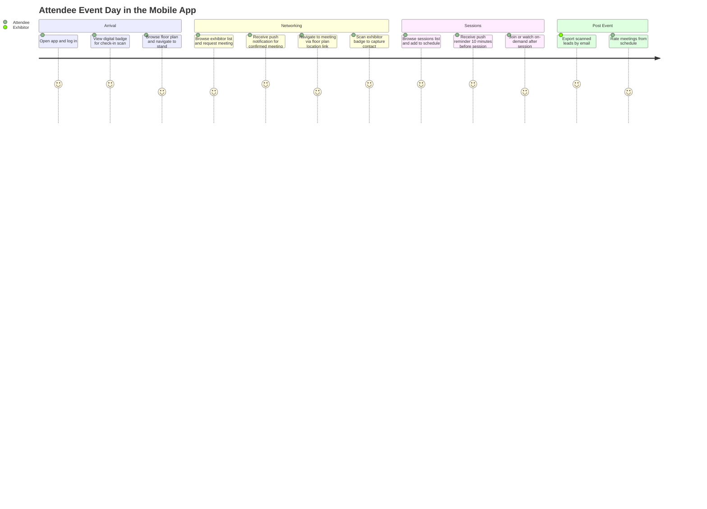
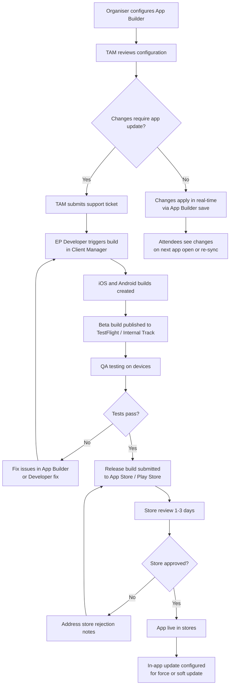
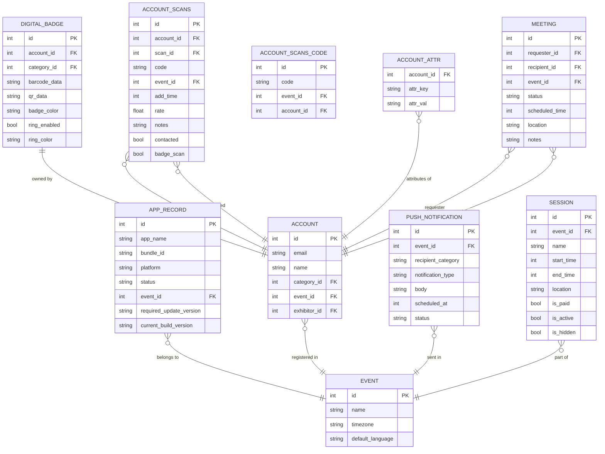
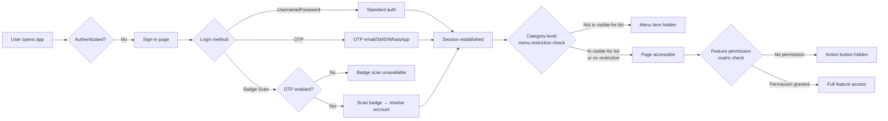

## 1. Product Overview

**Purpose.** The ExpoPlatform Mobile App is the onsite companion for every participant at an event — attendees, exhibitors, sponsors, and speakers — delivered as native iOS and Android applications that seamlessly mirror and extend the web platform's capabilities in the attendee's hand.

**Problem being solved.** Physical events are fast-moving environments where printed schedules go out of date, lead cards get lost, and participants miss meetings because they have no real-time view of their diary. The Mobile App eliminates all of these frictions: it provides live notifications, digital badge scanning for instant lead capture (including offline), a personal schedule, networking tools, and an interactive floor plan — all in one branded experience that organisers can configure without engineering effort.

**Business value.**
- Increased onsite engagement across all stakeholder groups — attendees, exhibitors, and sponsors.
- Enhanced exhibitor satisfaction through real-time lead retrieval with no post-event delay; leads are captured even without a network connection.
- Reduced printing and logistics cost — digital badges replace printed ones and double as scannable tokens for check-in and lead capture.
- Real-time event updates via push notifications keep participants on time and informed.
- Organisers control the entire app experience — branding, content, menus, restrictions, and feature flags — through the App Builder without requiring a new app release for most changes.
- A single Container App supports multiple events, amortising iOS/Android store overhead across a client's event portfolio.

**Target users.** All event participants: **Attendees / Visitors / Buyers** (schedule, networking, lead discovery), **Exhibitors and Team Members** (lead scanning, company profile, schedule), **Speakers** (session viewing, schedule), **Sponsors** (banner advertising, visibility), and **Organisers** (App Builder configuration and push notifications). ExpoPlatform TAMs and operators use the Client Manager and App Builder to build and publish the app.

**User personas.**
- *Attendee / Visitor* — browses exhibitors, sessions, and products; books meetings; scans badges; views digital schedule; receives push reminders.
- *Exhibitor / Team Member* — scans visitor badges for lead capture (online and offline); views company profile; manages team schedule; exports leads by email.
- *Organiser (Admin)* — configures the App Builder (branding, menus, content, features); triggers app builds via Client Manager; manages push notifications; monitors mobile analytics.
- *TAM / Platform Operator* — uses Client Manager to create builds, track build status, manage app versions, and submit to app stores.
- *Speaker* — views session cards, accesses personal schedule, checks location/floor plan.

**Success metrics.** Mobile app login rate per event; badge scans per exhibitor per day; meeting confirmation rate via app; push notification open rate; lead export volume; app store rating; number of events requiring unplanned rebuild (should trend to zero).

## 2. Product Scope

### Included
- Native **iOS and Android** apps, branded per organiser event.
- **Container App** architecture supporting multiple events within one app binary.
- **App Builder** — full no-code configuration of appearance, menus, content, features, and settings.
- **App Build Pipeline** — create-build, version tracking, beta/release publishing (operated via Client Manager; cross-referenced in Client Manager documentation).
- **In-App Updates** — configuration of force-update and soft-update policies.
- **Authentication**: standard username/password login, OTP (email, SMS, WhatsApp), badge scan login, registration, forgot password, custom Web View login.
- **Digital Badge** — per-category configurable badge with QR/barcode, animated anti-screenshot ring, external code support.
- **Badge Scanning and Lead Capture** — QR and barcode scanning online and offline; My Scans list; Scanned Me list; lead export by email and web download; custom lead questions.
- **Networking**: meeting request, confirm, reschedule, block time, meeting ratings, matchmaking, AI recommendations, app messenger, favourites, connections.
- **My Schedule** — personal diary with date picker, filters, calendar sync (Outlook/Google), PDF/XLS download.
- **Sessions in App** — sessions list with search, filter, date picker, on-demand tab; session detail page; paid session basket.
- **Exhibitor and Product Catalogue** — exhibitor list/page, product list/page, brand list/page, parent-child display.
- **Attendee / Buyer Lists and Profiles.**
- **Floor Plans** — native EP floor plan, ExpoFP integration (GPS, Get Directions, stand/hall mapping), InVisual integration (GPS for Android EP-40070), external linking.
- **Push Notifications** — meeting, session, and custom notifications; configurable timing; notification centre in app.
- **App Settings / My Account** — my profile, edit profile, my badge, company profile, basket, delete account, data re-sync button.
- **Multilanguage Webview** — webview pages open in the user's active app language (EP-23090).
- **Onboarding Experience** — interest category selection pop-up on first login (EP-36617, EP-40162).
- **Content Settings for Exhibitor Events** — App Builder control of whether, where, and how exhibitor events appear in the app.
- **App Menu** — configurable side menu and bottom navigation, category-level restrictions, color settings.
- **Custom Pages and Documents** in app.
- **Sponsor "Featured Exhibitors" block** in app (EP-27558).

### Excluded
- Web platform features that are explicitly not available on mobile: daily/total chat limits enforcement (web only), sponsor pop-up on exhibitor profile, Interaction Dashboard, Community Groups, Event News Page, Feeds, Parent-Child frontend management.
- App store account management and developer certificate provisioning (developer responsibility; TAM coordinates via Jira).
- Third-party analytics beyond the platform's own mobile analytics pipeline.
- Billing and invoicing for paid sessions (handled by Transactions & Purchasing product).
- Physical badge printing (handled by Onsite & Kiosk product).

## 3. User Roles

| Role | App Capabilities | Restrictions |
| --- | --- | --- |
| **Attendee / Visitor** | Browse exhibitors/products/sessions; book meetings; receive/send messages; scan badges (if enabled); view digital badge; personalised schedule; recommendations; favourites | Cannot access lead capture unless scanning is enabled by category; cannot see organiser admin functions |
| **Buyer** | Same as Visitor; may see hosted-buyer benefits block | Buyer category permissions controlled by organiser |
| **Exhibitor (company profile)** | Lead scanning and lead capture; company profile management; team schedule view; export leads; edit profile; basket | Lead capture must be enabled in Exhibitor Global Settings; Daily/Total meeting limits from web do not carry to app |
| **Team Member (exhibitor staff)** | Badge scanning and lead capture; personal schedule; messaging; favourites | Category-level menu restrictions apply; does not see menu items restricted to parent exhibitor category |
| **Speaker / Moderator** | View session cards where they are listed; personal schedule; networking (if opted in) | Session visibility restrictions are bypassed for own sessions |
| **Sponsor** | Branded banner display in exhibitor/session lists; featured exhibitor block | Cannot access organiser admin or lead capture unless also registered as exhibitor |
| **Organizer (Admin)** | Full App Builder access; push notification management; app build management; scanning settings; OTP/badge login config | Does not log into the attendee-facing app with admin privileges |
| **Super Admin / TAM** | App Builder + Client Manager build pipeline + Global Module Management | Most destructive controls (delete app from store) require Jira task and developer action |

> [!INFO] Category-level menu restrictions in the App Builder (App Builder > Features > Visible for) apply independently of the web permission matrix. A team member will not see a menu item that is visible only to the parent exhibitor category, even if the web permission matrix grants them that access. The "Settings" page is always visible regardless of restrictions.

## 4. Feature Inventory

#### App Builder and App Build Pipeline

**Description.** The App Builder is the no-code configuration console within the admin panel (`Apps` section) that controls every aspect of a mobile app's appearance, menus, content, and features. The build pipeline (operated from Client Manager) triggers iOS and Android build jobs and tracks versions.
**Why it exists.** Organisers must be able to brand, configure, and update their app without engineering effort, while TAMs need a single-pane view to trigger and track builds.
**User value.** Rapid time-to-app for new events; real-time branding updates without rebuild for most changes.
**Functional logic.** App Builder is accessed from the admin panel left nav or Apps icon. Configuration tabs include: General (splash, logo), Settings (colors, fonts, login screen buttons), Features (menu items, category restrictions, OTP/badge scan toggles), Content (page-level content settings). Changes that require a rebuild must be submitted via TAM support ticket; most content and color changes are real-time.
**Preconditions.** Client environment exists in Client Manager; at least one app record created.
**Processing logic.** Build triggered via Client Manager > client > Apps > Create Build (Android/iOS). Build status tracked in Client Manager. Beta build → QA → Release.
**Outputs.** Published iOS App Store and/or Google Play listing; in-app updates for subsequent changes.
**Dependencies.** Client Manager build pipeline; Apple Developer / Google Play credentials held by EP developers.
**Configurations.** App name, subtitle, bundle ID, icon, screenshots, descriptions, keywords, categories — all require a rebuild. Colors, fonts, content, menu items do not.
**Validation rules.** Required Update Version in app builder must match App Store build version; mismatch causes force-update loop (see §14 Edge Cases).
**Permissions.** Organiser edits App Builder; TAM/Super Admin triggers builds.
**Error handling.** Build failure → TAM notified; rollback to previous version.
**Edge cases.** Splash, Background, and Logo are three distinct assets — updating one does not update the others.

#### Splash Screen and Loading Screen

**Description.** The splash screen is the first visual users see on app launch; the loading screen (configurable separately) appears after sign-in while the event loads.
**Why it exists.** Brand identity, loading indicator, masks startup time.
**User value.** Professional branded first impression; custom event loading experience (EP-36).
**Functional logic.** Set in App Builder > General. Image (JPG/PNG) or Video (MP4, recommended ≤10MB). Recommended 2208×2208px square; safe area 998×998px. Show time configurable for images. Background color fills gaps. Event Loading Screen configured separately in App Builder > Features.
**Outputs.** Splash displayed for configured seconds; then app proceeds to sign-in or event.
**Configurations.** Splash type, file, display duration, background color, brightness/blur/quality settings.
**Validation rules.** Splash screen change requires a full app update. Must submit TAM support ticket.
**Error handling.** If uploaded file renders poorly, only fix is re-upload and app update.

#### General Color and Font Settings

**Description.** Per-event color palette (5 active slots) and font selection (including Gilroy — EP-27462) applied across all app screens.
**Why it exists.** Multi-event container apps need distinct visual identities per event; real-time branding without a rebuild.
**User value.** Brand-aligned attendee experience.
**Functional logic.** Set in App Builder > Settings. Five colors: Brand Color 1 (primary/header), Brand Color 2 (active tabs), On-Brand 1 (text on primary), Text Primary, Text Secondary. Login screen button colors: Login, Registration, Login via Scan. Changes apply instantly to live app — no rebuild required.
**Configurations.** Per-event color selector in multi-event apps. Sixth color slot (white) deprecated.
**Error handling.** Insufficient color contrast may cause readability issues — best practice review before publishing.

#### Authentication — Standard Login

**Description.** Username and password sign-in.
**Why it exists.** Default login mechanism for all participants.
**User value.** Secure, familiar credential-based access.
**Functional logic.** User enters email/username and password. Forgot Password flow sends reset email. Registration button visible unless disabled via Module Management. Custom Web View login option redirects to a configurable web page instead.
**Preconditions.** User is registered; event is active.
**Permissions.** All registered participant categories.
**Error handling.** Invalid credentials → error message. Registration disabled → button hidden.

#### Authentication — OTP Login

**Description.** One-time password sent by email (valid 10 minutes), SMS, or WhatsApp (valid 3 minutes) instead of a stored password.
**Why it exists.** Events with large visitor volumes benefit from passwordless entry — no forgotten passwords, no pre-event credential distribution.
**User value.** Frictionless entry; badge scan login enabled as downstream option.
**Functional logic.** Enabled at Admin Panel > General > Settings > OTP Authentication. User enters email → receives OTP → enters code. SMS and WhatsApp channels configurable; billed post-event per message. "Generate One Time Password" button resends; only most recent code valid. OTP email template configured at Registration Settings > Registration e-mails > OTP request.
**Configurations.** OTP validity duration (email: 10 min, SMS/WhatsApp: 3 min). SMS custom variables: NAME, LAST NAME, Visitor Email, Title, Login, Login URL, OTP Code.
**Error handling.** OTP may arrive in spam folder. OTP can be generated from admin panel for a specific participant (Management > Participant > OTP).

#### Authentication — Badge Scan Login

**Description.** User logs in by scanning their physical badge QR code rather than typing credentials.
**Why it exists.** Eliminates manual OTP entry at fast-paced onsite registration desks; provides an extra security layer via physical possession.
**User value.** Instant, frictionless app login at registration.
**Functional logic.** Requires OTP to be enabled first (prerequisite). Enabled at Admin Panel > General > Settings > Badge Scan Login for App. Category-based: organiser configures which categories can use this method (default: all). Button text configurable in App Builder > Features. Button color in App Builder > Settings. Camera permission required on first use. Both external and internal QR codes supported.
**Preconditions.** OTP Authentication must be enabled. Badge must be configured (barcode or QR) with valid data in the platform.
**Processing logic.** User taps "Scan Login" → app opens camera → scans badge → app resolves badge to account → user authenticated.
**Error handling.** If badge not found, check External QR field is not empty for the category. Shared categories must be tested before go-live.

#### Digital Badge

**Description.** An in-app digital representation of the participant's event badge, scannable by other attendees and the EP check-in app.
**Why it exists.** Eliminates need for printed badges; enables instant lead scanning and check-in gate scanning.
**User value.** Always-available badge in pocket; scannable for lead capture (EP-25790 Aditus custom badge page integration).
**Functional logic.** Configured at Registration Settings > Badges > Digital Badges. Per-category setup: Photo, Mr./Mrs., Full Name, Job Title, Company Name, Country, City, BarCode / QR Code (default or external), Category, custom fields via Add field button, background image. Barcode types: standard (barcode_new), external QR (external_qr), external barcode (external_barcode). Optional animated colored ring (toggle at `/admin/appbuilder/feature/2`) — animated ring around QR makes screenshot-based unauthorized scanning harder; ring color per category at `/admin/badges/digital`.
**Preconditions.** Digital badge configured for every category (copy between categories available).
**Configurations.** Background image: 378×658px (or 1592×2330 or 661×958). First/last name on one or two lines. Color choice. External code type must match the data imported.
**Edge cases.** Team members without their own category inherit exhibitor's badge. Speakers/Moderators have their own badge configuration.

#### Badge Scanning and Lead Capture

**Description.** Camera-based QR/barcode scanning to capture attendee leads, available online and offline.
**Why it exists.** Exhibitors at trade shows need instant, reliable lead retrieval — paper forms and external scanners are error-prone and delayed.
**User value.** Real-time leads with notes, star ratings, product interest; no lead loss from connectivity gaps; export in minutes by email.
**Functional logic.** Two modes: (1) Scanning (attendees/visitors — own leads); (2) Lead Capture (exhibitors and team members). Mobile app resolves barcode locally if synced; otherwise sends raw value to backend. Backend fast path (~10ms): direct account ID lookup. Slow path (~50-100ms): barcode lookup in account_attr (external_qr, external_barcode, barcode_new, external_code). `any_scans` config saves unknown barcodes to account_scans_code. `protected_scan_id_filter` forces barcode-only lookup (key must be absent, not set to false, to disable).
**Scanning Settings** (Admin Panel > Networking & Matchmaking > Contact Sharing): Enable Scanned Me List; Allow colocated event scans (users tagged "Another event"); Allow any codes; Show exhibitor logo in scan lists; Show category/role in scan lists; Show visitor email ONLY after badge scan.
**Offline behavior.** Scans saved locally until connection restored. Sync recommended before and after event to maximise fast-path performance.
**Outputs.** My Scans list; Scanned Me list; exportable XLS/email lead file (Name, Email, Company, Position, Address, Phone, Star Rating, Notes, Products, Client type, Scan time, Lead Owner).
**Error handling.** Unknown barcode + any_scans disabled → "Not found" message. Barcode collision (scan_id matches different account than barcode owner) is a known edge case — low probability with EAN-12 codes.

#### App Networking — Meetings

**Description.** Full meeting lifecycle in the app: request, confirm, reschedule, block time, cancel, rate.
**Why it exists.** Networking is a primary event value driver; mobile access means participants can manage meetings in real time onsite.
**User value.** Book, reschedule, and rate meetings without returning to a desktop.
**Functional logic.** Meeting request from exhibitor/attendee profile; confirm/decline; reschedule with reason; block time slots; 10-minute reminder push notification. Meeting ratings page post-meeting.
**Error handling.** Meeting and message limits set on web (daily/total) are enforced on mobile (EP-24046). Limit errors surfaced as user-facing messages.
**Edge cases.** Exhibitor meeting booking is possible on mobile even if no team members are assigned (web blocks this — known parity gap).

#### App Networking — Matchmaking and Recommendations

**Description.** AI-powered recommendation page and matchmaking page surfacing best-fit exhibitors, attendees, or sessions.
**Why it exists.** Events with hundreds of exhibitors and thousands of attendees require algorithmic guidance to find relevant connections.
**User value.** Personalised discovery that drives meetings and engagement.
**Functional logic.** Onboarding experience (EP-36617, EP-40162) collects interest categories on first login. Recommendations page and Matchmaking page display ranked results. Connection request from recommendation card.

#### App Networking — Messenger and Notifications Centre

**Description.** In-app direct messaging and a notification hub showing all event notifications.
**Functional logic.** Messenger: chat created by connection or meeting confirmation; notification sent once on creation (not per message). Notifications Centre: bell icon in bottom nav with unread count; three-dot menu to mark all read and search.

#### App Networking — Favourites and Connections

**Description.** Bookmark exhibitors, products, and attendees; view mutual connections.
**Functional logic.** Favourite action sends a push notification to the favourited party. Connections page shows accepted connections. Bi-directional sync with floor plan bookmarks (page 1855848449).

#### My Schedule

**Description.** Personal event diary combining confirmed meetings, session add-to-schedules, and exhibitor events.
**Why it exists.** Participants need a single view of their onsite day.
**User value.** Day-at-a-glance; calendar export for Outlook/Google.
**Functional logic.** Under "My Account" for attendees; "Team Schedule" under My Company (Exhibitor) for exhibitors. Activity type selector (Diary/Optional/All). Date picker — dots on dates with activity. Filters (naming and colors admin-managed). List or calendar view default configurable. Download schedule: PDF default; XLS if enabled at Networking & Matchmaking > Meetings. Calendar sync: Outlook/Google; optionally include attendees in calendar items (admin setting: External Calendar Sync > Include attendees sync).
**Interactive meeting location (EP-23543).** Meeting cards in schedule display a clickable location link to the floor plan.
**Configurations.** Default tab and tab naming at Admin Panel > General Settings > Schedule settings.

#### Sessions in App

**Description.** Browse, search, filter, and add event sessions to personal schedule from within the app.
**Why it exists.** Programme browsing and session scheduling are core attendee behaviours at conferences.
**User value.** Session discovery, schedule planning, paid session purchase.
**Functional logic.** Sessions List: search by title; filter by Types, Tags, Tracks. On-demand tab for recordings. Date picker — current date selected by default if available; else first future date. Banner ads rotate if multiple sponsors. Session detail: name, price (paid), status, date/time (local and event timezone), location, type, tags, speakers/moderators (respecting GDPR/networking opt-out). "Add to Schedule" or "Add to Basket" (paid). Session reminder push notification timing configurable (EP-36743) — multiple intervals, e.g. 30 min and 5 min before. Speaker/Moderator Profile Events Block (EP-40261) — exhibitor events associated with a speaker are shown on their profile.
**Visibility logic.** "Visible to" field restricts which categories can see a session. "Make visible all" allows viewing but restricts scheduling. Speakers/moderators always see sessions where they present. Active flag required; hidden flag excludes session from all views.
**Address / Other location (EP-24407).** When "Other location" is enabled in admin for sessions, an address field is available and displayed in app.
**Content Settings for Exhibitor Events (1834614787).** App Builder > Content Settings > Exhibitor Events: master toggle; display label; menu order; detail page elements; filter/sort defaults.

#### Push Notifications

**Description.** Real-time push alerts for meetings, sessions, messages, and custom admin broadcasts.
**Why it exists.** Without push, participants miss meeting requests and session reminders while the phone is idle.
**User value.** Zero missed meetings; timely session reminders; broadcast updates from organiser.
**Functional logic.** Session notifications: "Session starts in X minutes" — timing configurable at Management > Sessions > Config > Notifications Before Session/Exhibitor Event Start (mins) (multiple intervals supported; EP-36743). Meeting notifications: request, confirm, reschedule, cancel, 10-minute reminder (online and offline), meeting started (online only). Favourite notifications: when someone favourites your profile or scans your badge. Chat notification: sent once on chat creation only (not per subsequent message). Session add/remove to schedule notifications.
**Processing.** Both web and app notifications affected by the same session timing config. No notification for: liking a session in app; individual chat messages after first; offline meeting started.
**Outputs.** Push notification delivered to device; visible in Notifications Centre in app.

#### Floor Plan

**Description.** Interactive venue map with exhibitor stand search, Get Directions, and GPS location.
**Floor plan options.**
- **Native EP floor plan** — basic built-in map.
- **ExpoFP integration** — full-featured: stand number and exhibitor name search; Get Directions with travel time and distance; Map with Hall toggle for hall-qualified stand names; GPS location (iOS native; Android via WebView — EP-40070); IPS/GPS toggle for ExpoFP (EP-40363). Sessions searchable by location on floorplan. Note: custom location search is web-only, not available on mobile.
- **InVisual integration** — GPS Android implementation (EP-40070).
- **External linking** — links to third-party floor plan URL.
- **Bi-directional sync** — Favourites and floor plan bookmarks sync (page 1855848449).
**Configurations.** ExpoFP: Event Id and Event Name from ExpoFP admin; Map with Hall ON/OFF; floor plan data format (DWG for >250 booths, PDF/PNG/DXF/SVG for <250); lead time 2 weeks.

#### App Settings / My Account

**Description.** Personal account management screens including profile editing, badge, company profile, basket, and data management.
**Functional logic.** My Profile — view own profile; company name clickable to company profile (EP-8787). Edit Profile — update personal details. My Badge — view digital badge (see Digital Badge feature above). Company Profile — exhibitor company profile. Company Products. Hosted Buyer Benefits. Basket — paid session checkout. Delete My Account — GDPR-compliant self-service deletion.
**Data Re-sync Button.** Available on Settings page for all users. Fetches latest event data from server. Active only if ≥1 hour since last manual re-sync; grayed out with timer otherwise. On-screen confirmation on completion.

#### Multilanguage Webview

**Description.** Webview pages (e.g. registration, custom pages) open in the language currently active in the mobile app.
**Why it exists.** Previously all webview pages opened in English regardless of app language — poor experience for non-English events (EP-23090).
**Functional logic.** App sends current language code to backend; backend compares with languages enabled in Admin Panel > General Settings. If language is available on the event, webview opens in that language; else falls back to default.
**Story.** EP-23090 (COMPLETE). EP-20409 Arabic translation; EP-12277 US English (Favourites vs Favorites).

#### Onboarding Experience

**Description.** A pop-up on first login that invites participants to select interest categories for personalised recommendations.
**Why it exists.** Cold-start problem: without expressed interests, matchmaking and recommendations are generic.
**Functional logic.** Admin configures the onboarding at Admin Panel > General Settings > Onboarding: custom text, category groups, completion requirements, reappearance settings. App shows popup on first login (EP-40162). Mirrors existing web frontend onboarding behaviour. After selection, recommendations and matchmaking use the selected categories.
**Stories.** EP-36617 Onboarding Experience (Admin Panel, Web, App API) — COMPLETE. EP-40162 Onboarding Experience App Part — COMPLETE.

#### In-App Updates

**Description.** Mechanism to push app updates to users without requiring manual store download.
**Functional logic.** Configured in App Builder (Configuring and managing in-app updates). Force-update and soft-update policies. Required Update Version must be kept in sync with App Store build version; mismatch causes a force-update loop (known parity gap with web — see §14).

## 5. User Stories Mapping

| Story ID | Title | Summary | Acceptance Criteria | Related Feature | Status |
| --- | --- | --- | --- | --- | --- |
| EP-36 | D+ Loading Screen | Event loading screen configurable in App Builder features section | Loading screen visible after sign-in; configurable image per event | Loading Screen / Splash | COMPLETE |
| EP-1801 | iOS Mobile App Components | Core iOS app component build | iOS app compiles and passes QA | App Build Pipeline | In Progress |
| EP-1803 | Android Mobile App Components | Core Android app component build | Android app compiles and passes QA | App Build Pipeline | In Progress |
| EP-1808 | LBF App Release | Release app for London Book Fair 2022 | App released to stores with login screen changes | App Build Pipeline | COMPLETE |
| EP-8787 | Company name clickable in personal profile | Clicking company name on attendee profile navigates to company profile | Company name is a tappable link on team member profiles only | My Account / Attendee Profile | COMPLETE |
| EP-8982 | Scanned me download for web | XLS download of Scanned Me list available on web profile | Download Scanned Me button in profile menu; same format as app export | Badge Scanning / Lead Export | COMPLETE |
| EP-11754 | Parent-Child management on Frontend v.1 | Parent exhibitors can create and manage child exhibitors on frontend | Parent page available; add/search child workflow; access controls | App Content (web parity noted in §2 Excluded) | COMPLETE |
| EP-12277 | Mobile App — US English language support | App locale adapts to US English (e.g. "Favorites" vs "Favourites") | Device locale = en-US shows US spellings | Multilanguage / Localisation | COMPLETE |
| EP-13787 | Create builds in manager admin panel | TAMs can create fresh builds for published apps from manager admin panel | Build trigger available in manager admin; all EP clients supported | App Build Pipeline | COMPLETE |
| EP-20409 | Arabic translation for mobile app | Arabic language available in mobile app | App renders RTL Arabic correctly for configured event | Multilanguage Webview | COMPLETE |
| EP-22016 | Attendee List Changes — Widgetview | Attendee list widget shows 12 random cards; refreshes after 10-min cache | 12 cards displayed on first load; new set after 10 min cache expiry | App Content — Attendee List | COMPLETE |
| EP-23090 | Multilanguage webview pages for mobile app | Webview pages open in app's active language | App sends lang code; backend returns page in matching language if available | Multilanguage Webview | COMPLETE |
| EP-23543 | Interactive location on meeting cards | Meeting cards in Schedule show clickable location link to floor plan | Tapping location navigates to correct floor plan stand/room | My Schedule / Floor Plan | COMPLETE |
| EP-23669 | Check-in app improvement | New settings screen post-admin login with zone selector; check-in feedback screen | Zone selector displays all halls/stands/custom zones; check-in feedback shown | Badge Scanning / Check-in | COMPLETE |
| EP-23843 | Personalized Meeting Notes | Private notes per meeting visible only to note author | Note field on meeting card; saved privately; not visible to other party | Networking — Meetings | COMPLETE |
| EP-24046 | Error Mechanism — Meetings/Messages Limits | Web meeting/message limits enforced on mobile | Limit errors displayed on mobile the same as web | Networking — Meetings | COMPLETE |
| EP-24407 | Address for Other Location (APP) | Sessions and exhibitor events with "Other location" show address in app | Address field visible in session/exhibitor event detail when enabled in admin | Sessions in App | COMPLETE |
| EP-25790 | Custom Badge Page — Aditus Integration | Toggle to use Aditus-provided badge page instead of native badge | Toggle at /admin/general/settings; app shows Aditus custom badge using email as UID | Digital Badge | COMPLETE |
| EP-27462 | Font in the app | Gilroy font available as heading and text font in App Builder | Gilroy selectable in App Builder font settings; rendered in iOS and Android | Color and Font Settings | COMPLETE |
| EP-27558 | Rename sponsor block to "Featured Exhibitors" | Sponsor block in app renamed "Featured Exhibitors" | Block label shows "Featured Exhibitors" in app | App Menu / Sponsor Block | COMPLETE |
| EP-36617 | Onboarding Experience — Admin Panel and Web/App API | Admin configures onboarding; API supports app onboarding flow | Admin can define categories, groups, completion rules, reappearance | Onboarding Experience | COMPLETE |
| EP-36743 | Adjust session reminder push notification timing | Configurable reminder interval for session push notifications | Multiple intervals selectable at Management > Sessions > Config | Push Notifications | COMPLETE |
| EP-40070 | GPS Android Implementation — InVisual Floorplan | GPS location on Android WebView map matches iOS functionality | Android users can view real-time GPS position on WebView floor plan | Floor Plan — InVisual | COMPLETE |
| EP-40162 | Onboarding Experience — App Part | Interest category selection popup on first login in app | Popup shown on first login; categories selectable; used for recommendations | Onboarding Experience | COMPLETE |
| EP-40261 | Speaker/Moderator Profile — Events Block | Exhibitor events associated with a speaker shown on their profile | Events block visible on speaker profile in iOS and Android | Sessions in App / Speaker Profile | COMPLETE |
| EP-40363 | Toggle for IPS/GPS Config — ExpoFP | Dynamic IPS/GPS settings for ExpoFP positioning | Toggle in admin for IPS vs GPS; reduces support tasks | Floor Plan — ExpoFP | COMPLETE |

## 6. End-to-End Workflows

### Attendee Event Day Journey

### App Build and Publish System Workflow

### Happy Path
Organiser configures App Builder (branding, menus, content) → TAM triggers build via Client Manager → beta build passes QA → release submitted and approved → attendees download app → log in with OTP or badge scan → browse exhibitors/sessions → scan badges for leads → receive push notifications for meetings → export leads by email post-event.

### Alternate Path
Organiser makes a real-time change (menu item, color, content) → change saved in App Builder → visible to all users on next app open or after pressing Re-sync (≥1 hour cooldown). No rebuild required.

### Exception Path
Build fails in Client Manager → TAM investigates App Builder configuration (often a missing required field or invalid asset format) → fix and re-trigger build → if app store rejects, TAM addresses rejection note (often screenshot or metadata issue) and resubmits.

### Recovery Path
Force-update loop detected (Required Update Version mismatch with App Store build version) → TAM manually corrects Required Update Version in App Builder to match live build version → loop resolved without user action. If data appears stale for a user, Re-sync button on Settings page forces a fresh data pull.

## 7. Business Rules Engine

| Rule | Condition | Exception / Priority | Conflict Resolution |
| --- | --- | --- | --- |
| App update required for store-sensitive changes | Any change to: splash, logo, app name, subtitle, icon, screenshots, promotional/long description, keywords, categories, edition name, App store details | None — mandatory | TAM support ticket must be raised; change cannot go live without rebuild |
| Badge scan login requires OTP to be enabled | Admin enables Badge Scan Login for App | OTP must be turned on first | If OTP is disabled, badge scan login config is unavailable |
| OTP validity window | Email OTP: 10 min; SMS/WhatsApp OTP: 3 min | Only the most recently sent OTP is valid | Resending generates a new code; old code invalidated immediately |
| Re-sync button cooldown | Button active only if ≥1 hour since last manual re-sync | No exception | Button grayed out with countdown; automatic background sync is separate |
| Offline badge scanning | Scans saved locally when no connection | Sync required to push saved scans to server | Data persisted on device; no scan loss |
| Meeting limits enforced on mobile | Daily/Total meeting and message limits set on web platform | Limits apply equally on mobile (EP-24046) | Limit error message displayed; user cannot exceed configured cap |
| Category-level menu restriction differs from permission matrix | App Builder "Visible for" setting per menu item | Settings page always visible regardless of restriction | Category restriction takes precedence over general permission matrix for menu visibility |
| Exhibitor meeting booking parity gap | Mobile allows meeting booking on exhibitor profile even without team members | Web blocks booking when no team members assigned | Workaround: ensure all exhibitors have at least one team member before event opens |
| `protected_scan_id_filter` key behavior | Forces barcode-only lookup (bypasses account ID fast path) | Setting value to `false` does NOT disable it — key must be entirely absent | Remove key from JSON config to disable; setting `false` is ineffective due to `isset()` check |
| Digital badge per category required | Badge configuration must exist for every participant category | Team members without own category inherit exhibitor badge | Copy badge setup utility available between categories |
| Any code scans | When `any_scans` enabled, unknown barcodes saved to `account_scans_code` | When disabled, unknown barcode returns error code 2 | Organiser decides based on whether 3rd-party codes should be captured |
| Multilanguage webview fallback | App sends current language code; backend checks admin-panel language list | If language not available on event, default (English) served | Organiser must enable languages in Admin Panel > General Settings |

## 8. Data Model

### App Build / Publish State Diagram

```mermaid
stateDiagram-v2
    [*] --> Draft : App record created in App Builder
    Draft --> BuildQueued : TAM triggers create build
    BuildQueued --> BuildInProgress : Build job starts
    BuildInProgress --> BuildFailed : Compilation or config error
    BuildFailed --> Draft : Fix configuration
    BuildInProgress --> BetaPublished : Build succeeds; submitted to TestFlight / Internal Track
    BetaPublished --> QAReview : QA team installs beta
    QAReview --> BetaPublished : Issues found; new build triggered
    QAReview --> StoreSubmitted : QA passed; submitted to App Store / Play Store
    StoreSubmitted --> StoreRejected : Store review fails
    StoreRejected --> Draft : Address rejection; rebuild
    StoreSubmitted --> LiveInStore : Store review passed
    LiveInStore --> LiveInStore : Real-time changes via App Builder (no rebuild)
    LiveInStore --> BuildQueued : Store-sensitive change requires new build
    LiveInStore --> Deleted : App record deleted from App Builder
    Deleted --> [*]
    note right of Deleted : App remains in store;\n developer action needed\n to remove from store
```

### Lifecycle States

- **Draft** — app configured but never built.
- **BuildQueued / BuildInProgress** — build pipeline processing (iOS: Xcode + Fastlane; Android: Gradle).
- **BetaPublished** — available to internal testers; not public.
- **LiveInStore** — available to all users in App Store and/or Google Play.
- **Deleted** — App Builder record removed; live app in stores continues to function but can no longer be updated via App Builder.

## 9. Permissions Matrix

### Permission Flow

### Role × Capability Table

| Capability | Attendee / Visitor | Buyer | Exhibitor | Team Member | Speaker | Organizer (admin) | TAM / Super Admin |
| --- | --- | --- | --- | --- | --- | --- | --- |
| Browse exhibitors/products | Yes | Yes | Yes | Yes | Yes | Yes | Yes |
| Browse sessions | Yes | Yes | Yes | Yes | Yes | Yes | Yes |
| Add session to schedule | Yes | Yes | Yes | Yes | Yes | No | No |
| Badge scanning (visitor scan) | Yes (if enabled) | Yes (if enabled) | No | No | No | No | No |
| Lead capture scanning | No | No | Yes | Yes | No | No | No |
| View/scan digital badge | Yes | Yes | Yes | Yes | Yes | No | No |
| Request meeting | Yes | Yes | Yes | Yes | No | No | No |
| Export leads | No | No | Yes | Yes | No | No | No |
| Configure App Builder | No | No | No | No | No | Yes | Yes |
| Trigger app build | No | No | No | No | No | No | Yes |
| Send push notifications | No | No | No | No | No | Yes | Yes |
| Delete app record | No | No | No | No | No | No | Yes (Jira for store deletion) |
| View team schedule | No | No | Yes (company login) | Yes | No | No | No |

## 10. Integrations

| Integration | Purpose | Trigger | Data Exchanged | Failure Handling | Retry | Security |
| --- | --- | --- | --- | --- | --- | --- |
| **Apple App Store** | Distribute iOS app to attendees | TAM submits build | IPA binary, metadata, screenshots, version | Store rejection → TAM addresses notes and resubmits | Manual resubmission | Apple Developer certificate; App Store review |
| **Google Play Store** | Distribute Android app | TAM submits build | APK/AAB binary, metadata | Same as iOS | Manual resubmission | Google Play signing key |
| **ExpoFP Floor Plan** | Interactive venue map with stand and exhibitor overlay | Admin enables toggle at Event Setup > Settings | Event Id, Event Name, exhibitor-stand mapping (DWG/PDF/PNG/DXF/SVG export) | Stale map if sync overwritten during concurrent edit | Auto-sync after import | EP TAM provides export; ExpoFP admin credentials |
| **InVisual Floor Plan** | Alternative floor plan with GPS (Android — EP-40070) | Admin enables InVisual integration | GPS coordinates via WebView bridge | GPS unavailable → fallback to non-GPS map | N/A | Camera/location permission granted by user |
| **Aditus (Custom Badge)** | Vendor-supplied custom badge page for Aditus-registered events | Toggle at /admin/general/settings: Use Aditus Custom Page | User email as unique identifier sent to Aditus; custom badge HTML returned | If Aditus page unavailable, native badge shown (fallback not documented — see §14) | N/A | Aditus integration toggle; email identifier |
| **Outlook / Google Calendar** | Sync personal schedule to external calendar | User taps "Sync to Calendar" in My Schedule | iCal/ICS meeting and session events; optionally attendee emails | Calendar sync failure shown to user | User can retry | OAuth for Google; Exchange token for Outlook |
| **Push Notification Service** | Deliver push alerts to iOS/Android | Platform events (meeting request, session reminder, badge scan notification) | Notification payload: title, body, deep link | Failed delivery not retried (platform behavior); notification logged in Notifications Centre | None | APNS (iOS) / FCM (Android) tokens |
| **SMS / WhatsApp (OTP)** | Deliver OTP code via SMS or WhatsApp | User requests OTP login | Phone number, OTP code, optional custom variables | Delivery failure → user can retry from app | Manual user retry | Billed per message post-event; provider credentials managed by EP |

## 11. Notifications

### Push Notifications — Visitor / Attendee

| Event | Trigger | Channel | Timing | Recipient |
| --- | --- | --- | --- | --- |
| Session added to schedule | User adds session | Push + In-app | Immediate | Session organiser confirmation |
| Session removed from schedule | User removes session | Push + In-app | Immediate | User |
| Session starts soon | Session approaching | Push + In-app | Configurable (default 10 min before; multiple intervals supported — EP-36743) | Users with session in schedule |
| Meeting requested | Other party sends request | Push + In-app | Immediate | Recipient |
| Meeting confirmed | Other party confirms | Push + In-app | Immediate | Requester |
| Meeting reschedule requested | Other party requests reschedule | Push + In-app | Immediate | Other party |
| Meeting cancelled | Either party cancels | Push + In-app | Immediate | Other party |
| Meeting reminder (10 min) | Online meeting approaching | Push + In-app | 10 min before | Both parties |
| Online meeting started | Meeting room opened | Push + In-app | At meeting start | Both parties |
| Profile favourited / badge scanned | Other user favourites or scans | Push + In-app | Immediate | Profile owner |
| New message (chat created) | New chat initiated | Push + In-app | On chat creation only | Recipient |
| Rate your meeting | Meeting ended | Push + In-app | After meeting end time | Both parties |

> [!INFO] Push notifications for chat are sent once when the chat is created. No notification is sent for each individual message. No push notification is sent for offline meeting started. Liking a session in the app does not generate a notification.

### OTP and Auth Notifications

| Event | Channel | Timing | Notes |
| --- | --- | --- | --- |
| OTP code sent | Email / SMS / WhatsApp | On login request | Email valid 10 min; SMS/WhatsApp valid 3 min; only most recent code valid |

### Admin-Broadcast Notifications
Organisers can send custom broadcast push notifications to participant segments from the admin panel.

## 12. Reporting and Analytics

> [!INFO] Mobile App analytics are covered in depth in the Organiser Analytics product documentation. The table below summarises app-specific metrics available in the admin panel.

| Report / Dashboard | Inputs | Key Metrics | Filters | Export |
| --- | --- | --- | --- | --- |
| **Mobile App Analytics (App Data)** | App session data, device type, login events | Unique mobile app logins (iOS/Android); sessions per user; active users per day | Date range, event, platform (iOS/Android) | XLS via Data Import/Export > Unique Mobile App Logins |
| **Badge Scan Summary (Admin)** | account_scans, account_scans_code tables | Total scans per exhibitor; scan volume by day; leads exported count | Date range, exhibitor, category | Exhibitor Scanned Contacts report (XLS); Visitor Scanned Contacts report (XLS) |
| **Lead Export (per exhibitor/team member)** | account_scans joined to account | Name, Email, Company, Position, Address, Phone, Star Rating, Notes, Products, Client type, Scan time, Lead Owner | N/A (full personal export) | Email XLS from app; web download |
| **Notifications Analytics** | Push delivery logs | Push sent; delivery rate; open rate | Date range, notification type | Available in Email Notification Analytics dashboard |
| **Schedule Download usage** | Schedule download events | Count of PDF/XLS schedule downloads per event | Event, date | No dedicated export; visible in General Dashboard |

## 13. Configuration Guide

| Setting | Location | Effect | Who Can Set | Notes |
| --- | --- | --- | --- | --- |
| Splash screen (image or video) | App Builder > General | First screen displayed on app launch | Organiser / TAM | Requires app update to change |
| General colors (5 color slots) | App Builder > Settings | Primary, secondary, text colors across all screens | Organiser | Real-time; no rebuild needed |
| Login screen button colors | App Builder > Settings | Login, Registration, Login via Scan button colors | Organiser | Real-time |
| Font selection (incl. Gilroy) | App Builder > Font Settings | Heading and body text font throughout app | Organiser | Requires app update |
| Menu items (add/remove/reorder) | App Builder > Features | Controls navigation side menu and bottom bar | Organiser | No rebuild needed |
| Category-level menu restriction | App Builder > Features > Visible for | Hides/shows menu page per user category | Organiser | Differs from permission matrix |
| OTP Authentication | Admin Panel > General > Settings > OTP Authentication | Enables OTP login method; enables badge scan login prerequisite | Organiser | SMS/WhatsApp incur post-event billing |
| Badge Scan Login for App | Admin Panel > General > Settings > Badge Scan Login for App | Allows badge QR to authenticate login | Organiser | Requires OTP to be enabled first |
| Digital Badge fields and color | Admin Panel > Registration Settings > Badges > Digital Badges | Per-category badge layout, fields, code type | Organiser | One badge config per category required |
| Animated ring around QR | /admin/appbuilder/feature/2 toggle | Adds anti-screenshot animated ring to digital badge | Organiser | Ring color per category at /admin/badges/digital |
| Scanning Settings (lead capture) | Admin Panel > Networking & Matchmaking > Contact Sharing > Scanning Settings | Scanned Me list, colocated event scans, any code scans, category/role display, email-after-scan | Organiser | Changes during event affect live behavior |
| Session notification timing | Admin Panel > Management > Sessions > Config > Notifications Before Session Start (mins) | Sets how many minutes before a session push is sent; supports multiple intervals | Organiser | Affects both web and app notifications |
| Enable Exhibitor Events in app | App Builder > Content Settings > Exhibitor Events | Master toggle for exhibitor events on mobile | Organiser | Module Management must also have Exhibitor Events enabled |
| ExpoFP Integration | Admin Panel > Event Setup > Settings > ExpoFP | Enables ExpoFP floor plan; Map with Hall toggle | Organiser / TAM | Disable other floor plan integrations first |
| IPS/GPS Toggle (ExpoFP) | App Builder / General Settings | Switch between Indoor Positioning System and GPS for ExpoFP | Organiser | Reduces support tasks for venues with/without IPS hardware |
| Required Update Version | App Builder | Sets minimum app version that forces update | TAM | Must match App Store build version exactly to avoid force-update loop |
| Data Re-sync cooldown | Platform fixed | 1-hour minimum between manual re-syncs | N/A | Non-configurable; automatic background sync is separate |
| Onboarding experience | Admin Panel > General Settings > Onboarding | Custom text, category groups, completion requirements, reappearance | Organiser | Users see popup on first login |
| Multilanguage webview | Admin Panel > General Settings > Languages | Languages available on platform; app sends code; backend matches | Organiser | Languages must be enabled in general settings to be used in webview |
| Schedule export format | Admin Panel > Networking & Matchmaking > Meetings > Download My Schedule in xlsx | Switches schedule download from PDF (default) to XLS | Organiser | |
| Calendar sync | Admin Panel > General Settings > External Calendar Sync | Enables Outlook/Google calendar sync; optional attendees sync | Organiser | Include attendees sync enables additional user emails for meetings |
| Aditus custom badge page | Admin Panel > General Settings > Use Aditus Custom Page | Replaces native badge page with Aditus-supplied page | Organiser | Email address used as unique identifier |

## 14. Edge Cases

### User Edge Cases
- **Attendee with no app installed scans a QR badge** → event opens in mobile browser; user prompted to log in; redirected to scanned user's public profile. No native app features available until app is installed.
- **User with app installed scans QR badge from phone camera** → app opens, prompts login (if not logged in), navigates to Scan Badges page and proceeds with normal scan flow.
- **External QR badge scanned by user without app** → nothing happens (no web redirect for external QR codes).
- **Team member expects to see parent exhibitor's menu items** → category-level restrictions are independent of permission matrix; team member will not see items restricted to parent exhibitor category.
- **US English vs UK English locale** → "Favorites" displayed to en-US devices; "Favourites" to en-GB (EP-12277).

### Data Edge Cases
- **Barcode value collision** — barcode value of User B equals the account_id of User A. Backend fast-path resolves to User A (wrong person). Low probability with EAN-12 barcodes but not zero. No current mitigation.
- **`protected_scan_id_filter` set to `false` does not disable it** — `isset()` checks key existence, not value. Key must be entirely removed from JSON config to disable force-barcode-lookup behavior.
- **scan_id larger than 2,147,483,647 (PostgreSQL INTEGER max)** — backend skips account ID lookup and falls back to barcode lookup. Fixed by integer overflow guard at line 21090-21093 of ApiController.php.
- **Duplicate digital badge fields** — not supported; attempting to add a field already on the badge has no effect.

### Workflow Edge Cases
- **Force-update loop** — Required Update Version in App Builder set higher than the live App Store build version. App demands update; store has no newer version; loop. Resolution: TAM corrects Required Update Version to match current store build.
- **Changes made during active App Builder session** — if a floor plan file is imported while someone is editing the design tool, the save overwrites edits made after opening. ExpoFP tool is not synchronous.
- **Colocated event scans** — users from co-located events (same database) appear with "Another event" tag; networking features (meetings, messages) are unavailable for these scans even if "Allow colocated event scans" is ON.
- **Splash screen not a single asset** — Splash, Background, and Logo are three distinct assets. Updating one does not update the others; all three must be separately reviewed after any branding change.

### Integration Edge Cases
- **ExpoFP Map with Hall mismatch** — if Map with Hall is OFF but the venue uses hall-qualified stand names, stand lookup fails (exhibitor not found on floor plan). Enable Map with Hall toggle for venues like "Halle 3.0 G61".
- **Aditus custom badge page fallback** — if Aditus page is unavailable (network error or Aditus service down), behavior is not explicitly documented in current sources.

### Permission Edge Cases
- **OTP disabled after badge scan login is in use** — badge scan login becomes non-functional; users cannot log in via scan. Organiser must re-enable OTP or switch login method.
- **Category removed mid-event** — users in removed category lose category-restricted menu access immediately on next app open.

### Concurrency Edge Cases
- **Concurrent offline scans of same badge** — two exhibitors scan the same attendee badge while offline. Both scans queued locally. On sync, both records saved as separate scan entries. Duplicate scan display controlled by "Show repeated badge scans" setting (off by default).

### Event Lifecycle Edge Cases
- **Session dates not updated when event dates change** — if event dates are altered but session dates remain unchanged, original session dates still appear in the sessions list date picker. Sessions must be manually rescheduled.
- **App Builder deleted app still in store** — app continues to function from store but cannot be updated via App Builder. Requires developer Jira task to remove from store entirely.
- **Re-sync button not yet available** — user taps Re-sync within 1 hour of last manual sync. Button is grayed out with a message indicating when it will become available. Automatic background sync continues unaffected.

## 15. FAQs

**Q: Do I need to rebuild and resubmit the app to change colors or menu items?**
A: No. Colors (all five brand color slots and login button colors), menu items, custom page content, and custom page filters can all be changed in real time via the App Builder without a rebuild. Changes that do require a rebuild are: splash screen, app logo, app name, subtitle, app icon, screenshots, promotional/long description, keywords, categories, edition name, and App Store details. Submit a TAM support ticket for any change in that list.

**Q: Can badges be scanned without an internet connection?**
A: Yes. Scanning works both online and offline. When offline, scans are saved locally on the device until a network connection is re-established, at which point they sync automatically. No lead data is lost due to connectivity gaps.

**Q: How does badge scan login work, and what does it require?**
A: Badge scan login lets a user log in by pointing the camera at their physical event badge QR code instead of typing an OTP. Prerequisites: (1) OTP Authentication must be enabled at Admin Panel > General > Settings; (2) Badge Scan Login for App must then be enabled in the same section; (3) the scanning category must be included in the allowed categories list. Button text and color are configurable in App Builder. Both external and internal QR codes are supported.

**Q: Why is the OTP code going to the spam folder?**
A: Some email providers classify automated OTPs as spam. Advise users to check their spam/junk folder. OTP can also be generated manually from the admin panel (Management > Participant > OTP) as a fallback.

**Q: Can an exhibitor export their leads directly from the app?**
A: Yes, two methods are available. (1) In the app on the Scan Badges page, tap the export link at the top — this sends an email with an attached XLS spreadsheet of leads to the team member. (2) On the web under Profile Info, use the "Download Leads" button for an immediate download. Both methods include: Name, Email, Company, Position, Address, Phone, Star Rating, Notes, Products, Client type, and Time of scan. When downloaded from the company profile, leads include a "Lead Owner" column for all team members.

**Q: Why is a visitor's email not visible after I scanned their badge?**
A: The "Show Visitor email ONLY after badge scan" toggle is enabled, but the result depends on the "Show in Visitor profile" setting for the email field in Registration Settings > Visitor > Additional Setting. If "Show in Visitor profile" is re-enabled by the organiser at any point, standard profile visibility rules apply regardless of the badge-scan toggle.

**Q: How do I update the app if I am in a force-update loop?**
A: A force-update loop means the Required Update Version in the App Builder is set higher than the currently live build in the app store. Contact your TAM who will correct the Required Update Version to match the live build. No user action is needed once the version number is corrected.

**Q: How do I ensure webview pages open in the correct language for non-English users?**
A: Enable the relevant languages at Admin Panel > General Settings > Languages. The mobile app automatically sends the user's active language code to the backend; if that language is enabled for the event, the webview page loads in that language. If the language is not enabled, the default (English) is used. See EP-23090.

**Q: The session filter I configured in the admin panel is not appearing in the mobile app. Why?**
A: There are two filter configuration areas. Filters at Admin Panel > Event Setup > Display Filters > Sessions affect the app. Filters at Admin Panel > Management > Sessions > Filters are web-only and do not appear in the app.

**Q: Can two different events in the same container app have different color schemes?**
A: Yes. The General Color Settings include a per-event selector for multi-event apps. Each event maintains its own color palette. Color changes apply in real time — no rebuild required.

**Q: What is the animated ring on the digital badge?**
A: An optional animated colored ring around the badge QR code (toggle at `/admin/appbuilder/feature/2`). When enabled, the ring makes it significantly harder for someone to use a static screenshot of a badge for unauthorized entry or scanning, since the animation is absent from a screenshot. The ring color is configurable per attendee category at `/admin/badges/digital`.
