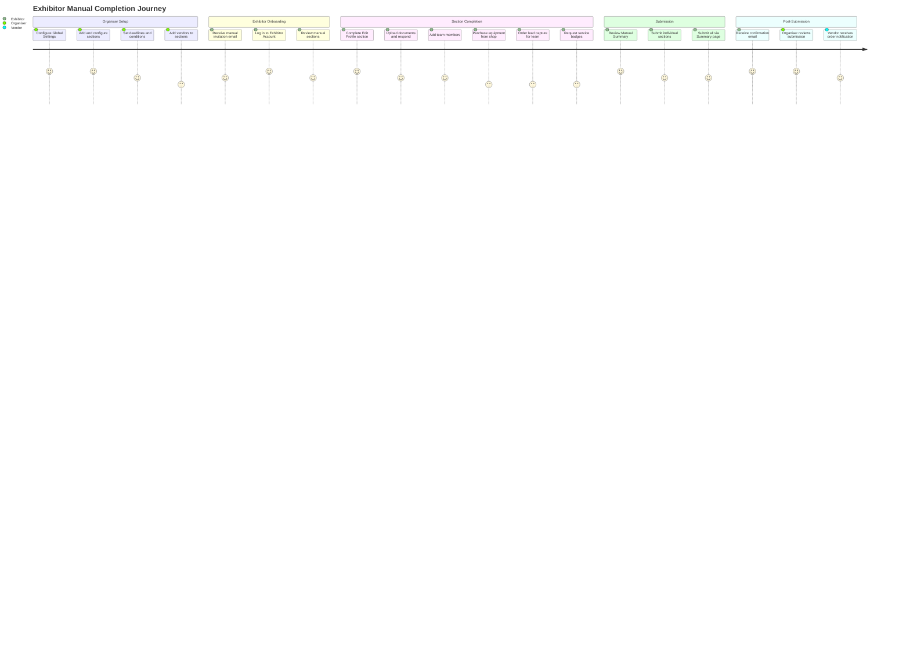
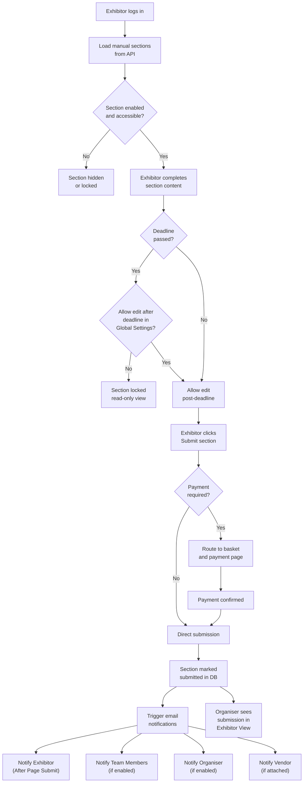
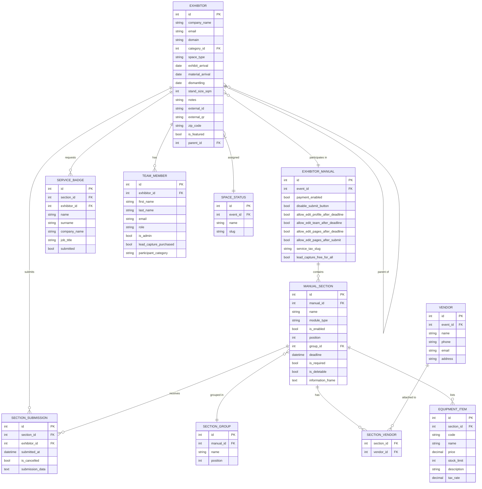
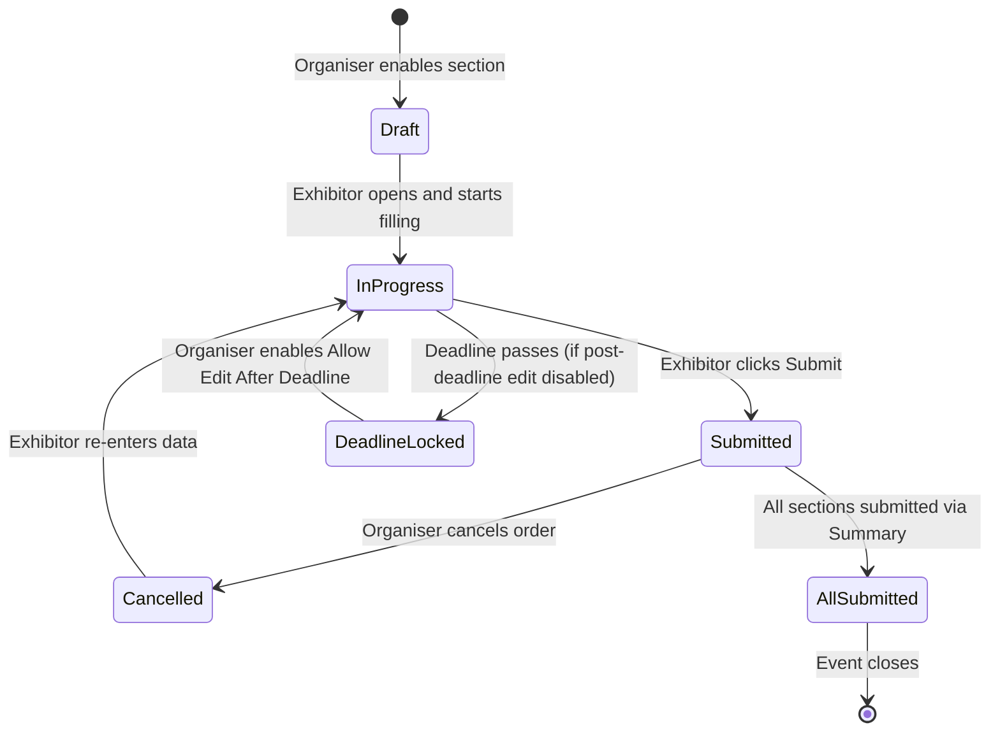
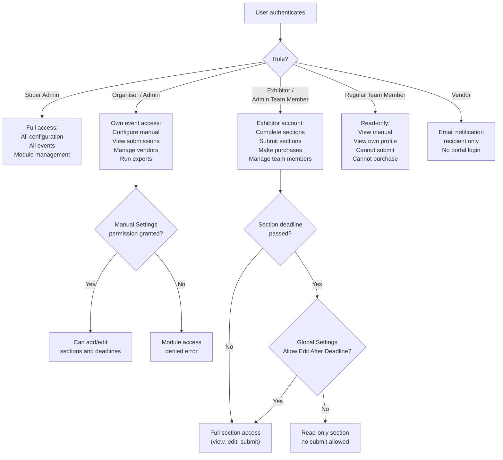

## 1. Product Overview

**Purpose.** The Exhibitor Portal — centred on the **Exhibitor Manual** — is ExpoPlatform's pre-event preparation and ordering engine for exhibitors. It gives exhibitors a structured, deadline-driven workspace where they complete every administrative task required before, during, and after a trade show: profile updates, document submission, equipment purchasing, badge ordering, lead-capture activation, and team management. For organisers it provides the administrative counterpart: a configurable section builder, vendor management, submission monitoring, and automated email notifications.

**Problem being solved.** Organising teams must collect dozens of pieces of information from hundreds of exhibitors — stand requirements, service personnel lists, equipment orders, company profiles — within strict deadlines and often across multiple languages. Without a centralised system this degenerates into email chaos, missed deadlines, and manual data reconciliation. The Exhibitor Portal replaces that fragmentation with a single, self-service, deadline-aware portal that is fully configurable per event and per exhibitor category.

**Business value.**
- Reduces organiser administrative overhead by centralising collection of all exhibitor pre-event data.
- Automated deadline warnings and submission notifications eliminate manual follow-up calls.
- Vendor attachment to sections enables in-portal equipment and service purchasing with payment integration.
- Multi-language support (translation tool on every section) removes language barriers for international exhibitors.
- Export pipeline (SQS-backed) delivers reliable, high-volume exhibitor data exports.
- New UI redesign (EP-1071 through EP-1079, EP-1105) delivers a modern exhibitor account experience across web and mobile.
- Parent-Child exhibitor relationships (EP-11116, EP-2144, EP-27619) support enterprise exhibitors managing multiple subsidiaries.
- Exhibitor Events feature (EP-8869, EP-8870, EP-11664, EP-13125) extends the portal into session scheduling for exhibitor-hosted activities.

**Target users.** Two primary audiences: **Exhibitors** who complete and submit their manual sections; **Event Organisers (admins)** who configure the manual, monitor submissions, and manage vendors. Team Members (exhibitor staff) view the manual and, if designated as admin team members, can submit and purchase.

**User personas.**
- *Exhibitor (Company Contact)* — logs into the exhibitor account, completes profile, uploads documents, orders equipment, adds service badge personnel, activates lead capture for team. Primary self-service user.
- *Admin Team Member* — an exhibitor's staff member with elevated rights; can submit sections and make purchases on behalf of the exhibiting company.
- *Regular Team Member* — can view the manual and be added to lead capture but cannot submit or purchase.
- *Event Organiser (Admin)* — configures all manual sections, sets deadlines, manages vendors, monitors submission progress, runs reports.
- *Vendor* — receives email notifications when an exhibitor submits a page to which the vendor is attached.

**Success metrics.** Exhibitor manual completion rate (% of exhibitors who submit all required sections before deadline); time from portal open to first exhibitor submission; reduction in organiser manual follow-up communications; equipment order volume processed via portal; export job success rate.

## 2. Product Scope

### Included
- **Exhibitor Manual** — configurable multi-section portal accessible via the exhibitor's frontend account.
- **Manual sections** — Documents, Service Badges, Table Form, Equipment (shop), Lead Capture, Team Members, Edit Profile, Manual Summary; unlimited custom sections.
- **Section management** — add, rename, clone, enable/disable, delete, reorder (drag-and-drop), group sections.
- **Global Settings** — submit button control, payment enablement, post-deadline edit rules, tax slug, lead capture free mode, email notification toggles, copy-settings between events.
- **Vendors** — add/manage vendor profiles, attach vendors to sections, automated vendor email notifications on section submission.
- **Exhibitor View for Organisers** — submission monitoring dashboard with filtering by submission status, exhibitor search, service badge reports, and export.
- **Email Notifications** — automated emails to exhibitors, team members, organisers, and vendors; fully templated with dynamic variables.
- **Firebird SSO** — single sign-on integration directing exhibitors to Firebird database from within the manual.
- **Space Types** — configurable space statuses (stand type, arrival/dismantling dates) assigned to exhibitors.
- **Translation** — per-section language tool supporting multi-language manual delivery.
- **Exhibitor Account (New UI)** — redesigned dashboard (EP-1105), products management (EP-1117), sponsorship management page (EP-1112), exhibitor events (EP-8869 series).
- **Parent-Child exhibitor relationships** — parents managing/creating child exhibitors on frontend.
- **API v2 for exhibitors** — programmatic create/update of exhibitor data (EP-14475, EP-261, EP-53492).
- **Exhibitor exports** — Exhibitor Manual export, Scanned Contacts export, Pending Exhibitors export, Login Data export (all SQS-backed for reliability).
- **Klipso, A2Z, Reach5, ASP integrations** — third-party system bridges for exhibitor data sync.

### Excluded
- Visitor/attendee registration and profiles (covered by Visitor Management product).
- Organiser Analytics dashboards — Supplier Overview is read-only analytics, not a portal feature.
- Payment gateway configuration (covered by Transactions and Purchasing product).
- App Builder and mobile app publishing pipeline.
- Raw email sender / Email Campaigns (covered by Marketing & Email product).
- Badge print design (done in Registration → Badges; the Service Badge section merely links to it).
- Floor plan editing (covered by Floor Plan product; EP-10209/EP-10210/EP-14266 are floor plan stories).

## 3. User Roles

| Role | Access in Exhibitor Portal | Key Restrictions |
| --- | --- | --- |
| **Super Admin** | Full access — configure global module management, enable/disable the Exhibitor Manual module per event | Module-level on/off; can access any client's exhibitor manual configuration |
| **Organizer (Admin)** | Full manual configuration: add/edit/delete sections, set deadlines, manage vendors, monitor submissions, run exports | Scoped to their own event(s); cannot access other clients |
| **Lead Admin Team Member** | Access to Manual Settings if given permission by lead admin; can submit sections and make purchases for exhibitor company | Receives "you don't have access to this module" if permissions not granted |
| **Exhibitor (Company Contact)** | View and complete all enabled manual sections; submit sections; manage team members and service badges | Cannot configure sections; bound by deadlines; edit rights governed by Global Settings post-deadline flags |
| **Admin Team Member** | Same as Exhibitor (Company Contact) within the manual — can submit sections and make purchases | Must be designated admin role on the exhibitor profile; regular team members cannot submit or purchase |
| **Regular Team Member** | View exhibitor manual sections only | Cannot submit or purchase; can be subject of Lead Capture purchase by exhibitor |
| **Vendor** | Receives email notifications only | No login to the platform; notified via email when exhibitor submits an attached page |
| **Attendee / Visitor / Speaker** | No access to Exhibitor Portal | These roles have no exhibitor manual context |

> [!INFO] The Module Team Members setting in `admin/general/modules` does NOT affect the Team Members section of the Exhibitor Manual. Team member allowance and limits are governed exclusively by Global Settings within the Exhibitor Manual.

## 4. Feature Inventory

#### Global Settings
**Description.** A single configuration page (`Admin → Exhibitor Manual → Global Settings`) governing manual-wide behaviour for an event. **Why it exists.** Different events have different rules — some require payment, some forbid post-deadline edits, some need custom tax names. Global Settings centralises these decisions. **User value.** Organiser sets once; the entire portal behaves consistently. **Functional logic.** Settings are: Disable Submit Button on Summary (hides submit on the Summary page); Enable Payment (turns on payment flow, requires `admin/payments/integration` credentials); Allow Edit Exhibitor Profile After Deadline; Allow Edit Exhibitor Team Members After Deadline (applies to manual Team Members section only — not to the team members tab in the burger menu); Service Tax Slug (admin-facing name; front end always shows "Tax"); Allow Edit Manual Page After Deadline; Allow Edit Manual Page After Submit; Space Statuses (links to Space Types configuration); Lead Capture — Enable for All Free (disables lead capture from new-UI basket when on). **Email notification toggles** for Exhibitor, Team Member, Organizer, and Vendor recipients. Submission Deadline Warning uses two sub-fields: Days before deadline and Frequency (days). If Frequency > Days before deadline, no emails send. If Frequency = 0, no emails send. **Copy Settings** allows duplicating the full Global Settings configuration from another event in the same environment. **Preconditions.** Organiser has admin access to Exhibitor Manual. **Dependencies.** Payment integration settings; Email Builder; Space Types; individual section settings. **Configurations.** All settings are per-event. **Validation rules.** Payment cannot be enabled without valid payment integration credentials. **Permissions.** Organizer and Super Admin. **Error handling.** If payment credentials are missing and Enable Payment is toggled, system blocks activation. **Edge cases.** Frequency = 0 silently suppresses deadline warning emails; Frequency > Days before deadline also suppresses — both are common misconfiguration traps.

#### Manual Settings and Section Setup
**Description.** Organiser tools for creating, configuring, and organising all sections of the exhibitor manual. **Why it exists.** Every event has a different set of exhibitor requirements; the section builder lets organisers assemble exactly the sections they need without coding. **User value.** Flexible, drag-and-drop configuration with per-section deadlines, conditions, and vendor assignments. **Functional logic.** Add New Section: click "Add new section" → popup with Section Name (required) and Section Module (optional, default: Documents). Available modules: Documents, Badges, Table, Booking, Equipment. Default sections (Profile Info, Team Members, Summary) are pre-created and cannot be deleted — only disabled. Drag-and-drop reorders all sections including groups. Add Sections Group: creates a collapsible group into which sections can be dragged. Rename Section: two paths — via section page field or manual sections Edit button. Renaming a section deletes all previously entered exhibitor data for that section. Clone Section: creates `{Name} (copy)` with a copy-settings confirmation popup. Enable/Disable: toggle hides section on front end without data loss. Delete Section: destroys all exhibitor data and removes from the manual export. Set Deadlines: saved via Ajax (no Save button needed). Set Conditions: access can be restricted by exhibitor category and/or Space Status; conditional logic based on field responses. Information Frame: rich-text input (CKEditor 4.8.0) available on all sections; supports template variables: `{exhibitor_name}`, `{sqm}`, `{dismantle_date}`, `{dismantle_time}`, `{space_status}`, `{space_type}`, `{exhibit_arrival_date}`, `{exhibit_arrival_time}`, `{stall_material_date}`, `{stall_material_time}`, `{stand_number}`, `{hall_number}`, `{exhibitor_category}`, `{firebird_sso}`. **Preconditions.** Organiser has Manual Settings access permission. **Validation rules.** Section Name is required when adding. Renaming destroys existing exhibitor data — no undo. Default sections cannot be deleted. **Permissions.** Organizer (with module access) and Super Admin. **Error handling.** "You don't have access to this module" if admin permissions not granted by lead admin. **Edge cases.** Section link navigation: before EP-15338, users always landed on the first unsubmitted section; after fix, deep-linking to a specific section works correctly. Translation not available on Summary section.

#### Documents Section
**Description.** A manual section type allowing organisers to distribute documents that exhibitors must review, complete, and return. **Why it exists.** Trade shows frequently require exhibitors to sign health and safety forms, stand agreements, or contractor declarations before the event. **User value.** Organiser uploads official documents once; exhibitors download, complete, and re-upload their responses all in one tracked interface. **Functional logic.** Backend: click "Add new document" → new inline row with Document Name, Deadline to respond, Response Required toggle, Upload doc field. Row cannot be saved without an uploaded document file. Most fields auto-save via Ajax. Translation tool changes only the Document Name column. Long names show full tooltip on hover. Submitted Documents column shows count of uploaded exhibitor responses. Frontend: two columns — Files to download and Forwarded files. Exhibitors download originals and upload completed responses. **Preconditions.** Section must be enabled by organiser. Document file must be uploaded before saving a row. **Outputs.** Tracked document submission count visible to organiser. **Dependencies.** File storage service; translation tool. **Validation rules.** At least one file must be uploaded per document row before save. Response Required toggle enforces mandatory response before section submission. **Permissions.** Organiser creates/manages; Exhibitor and admin team members respond. **Error handling.** Cannot save row without file upload — expected, shown as inline constraint. **Edge cases.** Document uploads do not support per-language variants (only Document Name is localised per language).

#### Service Badges Section
**Description.** A Badges-module section allowing exhibitors to register service personnel (hostesses, interpreters, technical staff) and print access badges for them. **Why it exists.** Service staff require show access without full platform registration; a lightweight badge workflow serves this need. **User value.** Exhibitors manage service personnel lists and print badges without creating platform accounts for each person. **Functional logic.** Backend setup: Add New Section → Section Module = Badges → name and enable. Set Badge Name (Print Version) to link to the badge design in Registration → Badges. Use `{sqm}` in the Information Frame to drive badge quantity allowances based on stand size. Frontend: exhibitor navigates to Service Badge List → enters Name, Surname, Company Name, Job Title → ADD → Submit. A notification shows badge allowance remaining. After submission, exhibitor prints from Profile Information → Badges → select person → print icon. **Key constraint.** Service badges do NOT include QR codes or lead retrieval data. Service badge holders do NOT have platform profiles. They are distinct from Team Members. **Preconditions.** Section enabled; Badge Name (Print Version) configured; sqm set for quantity limits. **Outputs.** Printable badge. **Dependencies.** Registration → Badges module for badge design; sqm/stand-size data. **Validation rules.** Quantity of service badges is limited by sqm (square metres of stand). All four fields (Name, Surname, Company Name, Job Title) must be provided. **Permissions.** Exhibitor and admin team member. **Error handling.** If service badge section not found: ensure section is enabled and module = Badges. If badge cannot be printed: verify all fields filled and badge assigned in the Badges section. **Edge cases.** If Badge Name (Print Version) field is left blank, the badge design link to Registration → Badges does not function.

#### Table Form Section
**Description.** A Table-module section that organizers populate with structured table data (columns and rows) to collect specific information from exhibitors. **Why it exists.** Some exhibitor data requirements are inherently tabular — staffing rosters, product lists, stand requirements — and a free-form table avoids the rigidity of fixed-field forms. **User value.** Organizer defines the exact columns needed; exhibitors fill in a structured grid. **Functional logic.** Organiser adds a new section with module = Table. The table schema (column definitions) is configured in the section. Exhibitors fill in rows on the front end and submit. Translation tool applies to section names and Information Frame content. **Preconditions.** Section enabled; table columns defined by organiser. **Permissions.** Organiser configures; Exhibitor and admin team member complete.

#### Equipment Section (Shop)
**Description.** An Equipment-module section that functions as an in-portal shop where exhibitors purchase or reserve equipment items for their stand. **Why it exists.** Exhibitors need to order furniture, AV equipment, and other stand items from the organiser or their vendors; embedding this in the manual avoids a separate procurement system. **User value.** One-stop equipment ordering with quantity management, pricing, and tax handling. **Functional logic.** Admin creates equipment cards with: Equipment Code, available colours, Equipment Name (54-char max), Width, Height, Depth, Diameter, Measurements, Price, Limit (stock quantity), Description. Tax configured in `admin/payments/taxes` or custom per-equipment. Frontend: filter by All/Available/Not available, search by name. Click "Add to Basket" → popup shows quantity (default 1) and remaining stock. Equipment in Basket tracks already-added items. Translation: equipment names synchronised between general page and profile page — changing language on either page shows the corresponding localised name. **Preconditions.** Payment enabled in Global Settings if items are paid. Equipment cards created by organiser. **Dependencies.** `admin/payments/taxes` for tax configuration; basket/payment module. **Validation rules.** Equipment Name max 54 characters. Stock quantity enforced by Limit field; system prevents over-ordering. **Permissions.** Organiser creates/edits; Exhibitor and admin team member purchase. **Error handling.** If stock not reflecting correctly: verify Limit field and refresh page. If translation names not syncing: verify translations saved on both general and profile pages. **Edge cases.** When "Add to Basket" is clicked, 1 item is pre-populated; Limit decrements by the selected quantity. If Limit = 0, item shown as "Not available".

#### Lead Capture Section
**Description.** A section that enables exhibitors to purchase lead scanning capability for their team members. **Why it exists.** Lead capture (QR scanning of visitor badges) is a paid add-on per team member or per exhibitor company; the Exhibitor Manual is where this purchase is made and managed. **User value.** Exhibitors select exactly which team members need scanning capability, pay accordingly, and see the result immediately. **Functional logic.** Admin Setup: Service Tax (from `admin/payments/taxes`, with custom override option); Price; Selector — Per Exhibitor or Per Team Member. Per Exhibitor: one price covers all team members. Per Team Member: price multiplied by number of selected members. If "Enable for All (Free)" is on in Global Settings, lead capture is granted free to all team members; adding lead capture to the new-UI basket is disabled in this mode. After purchase: team member's checkmark is auto-selected in admin panel. If purchased per exhibitor, all team members receive the checkmark. Frontend: if no team members exist, an "Add Team Member" button redirects to the Team Members section. **Preconditions.** Payment enabled in Global Settings (unless free mode). Team members added before per-member purchase. **Dependencies.** `admin/payments/taxes`; Team Members section; payment integration. **Validation rules.** Custom tax rate requires valid configuration in `admin/payments/taxes`. Per Team Member pricing requires at least one team member present. **Permissions.** Organiser configures price and mode; Exhibitor/admin team member purchases. **Error handling.** Cannot select team members if none added — redirect to Team Members section. **Edge cases.** Free mode (Enable for All) and paid mode can coexist — free mode grants capability without removing the payment option from the manual.

#### Manual Summary
**Description.** A default, non-deletable section that aggregates the submission status of all other sections in the manual. **Why it exists.** Exhibitors need a single place to review what they have and have not submitted, make last-minute corrections, and then formally submit the entire manual. **User value.** Single-page completion overview with direct navigation back to any section for edits. **Functional logic.** An Edit button per section redirects to that section; edits are only possible before the deadline. A "Submit All" button (when not hidden by Global Settings) formally submits the entire manual. Global Setting "Disable Submit button on the Summary Page" hides this button — used when organisers do not want a formal all-up submission step. Email notifications can be configured to notify organisers when a summary is submitted. **Preconditions.** Other sections must exist. Deadline must not have passed for edits. **Outputs.** Submission confirmation; organiser notification email. **Dependencies.** Global Settings (Disable Submit Button); Email Notifications (After All Manuals Submit). **Validation rules.** Edits blocked after section deadline. Submit button hidden if global setting enabled. **Permissions.** Exhibitor and admin team member view and submit; Organiser monitors. **Edge cases.** Summary section has no translation tool (it compiles from other sections' already-translated content).

#### Team Members Section
**Description.** A default, non-deletable section allowing exhibitors to add and manage their team members directly from the front end. **Why it exists.** Exhibitors need to register their on-stand sales staff who will interact with visitors; these people require platform profiles, QR codes, and lead retrieval capability. **User value.** Self-service team roster management with quota enforcement and optional deadline. **Functional logic.** Number of team members an exhibitor can add is set in Global Settings (can be based on sqm — stand size). Option to ignore team member limits. Any member added here is immediately visible in the Team Members tab of the exhibitor profile and in the exhibitor's admin panel page. Edit button on each card opens modification form. Information Frame displays customisable contextual information to the exhibitor. Deadline Date can be set to restrict when team member additions are allowed. Setting "Allow Edit Exhibitor Team Members After Deadline" in Global Settings governs post-deadline editing in the manual — but editing in the Team Members tab in the burger menu is NOT restricted by this. Note: Module Team Members in `admin/general/modules` does NOT affect this section. **Preconditions.** Global Settings team member limit configured. **Dependencies.** Exhibitor profile; Global Settings; burger menu team members tab. **Validation rules.** Limit enforced unless "Ignore Team Members Limit" is enabled. Deadline enforced per Global Settings flag. **Permissions.** Exhibitor and admin team member add/edit; Regular team members cannot. **Error handling.** If limit reached, front end shows limit message. If changes not visible: refresh profile page and admin panel. **Edge cases.** A regular team member added by the exhibitor can later be promoted to admin team member role on the exhibitor profile page.

#### Edit Profile Section
**Description.** A default, non-deletable section within the exhibitor manual that provides a guided interface for exhibitors to update their company profile data. **Why it exists.** Many exhibitors need a prompted workflow to ensure their event profile is complete; embedding it as a manual section puts it in the same deadline-driven context as all other tasks. **User value.** Profile completion with deadline enforcement; synchronises immediately to the live exhibitor profile. **Functional logic.** Fully synchronised with the Edit Profile tab on the exhibitor's page — any change in one place reflects in the other instantly. Cannot be deleted but can be turned off. Deadline set here applies only to the manual section; the standalone Edit Profile tab on the exhibitor page remains editable past this deadline. Language selector at the bottom lets exhibitors choose their preferred language for receiving emails. If Vendor Notifications are enabled in Global Settings, vendors receive an update email when the exhibitor submits this section. Both the toggle in Global Settings AND the email template must be active for vendor emails to send. **Preconditions.** Section enabled. **Dependencies.** Exhibitor profile data model; Vendor Notifications; email templates. **Validation rules.** Deadline only restricts within the manual context. **Permissions.** Exhibitor and admin team member; Organiser monitors. **Edge cases.** Deadline applied here does not restrict the exhibitor from editing their profile directly from the exhibitor account profile tab — a common organiser misunderstanding.

#### Vendors
**Description.** A management system for supplier profiles that can be attached to exhibitor manual sections and notified by email when exhibitors submit orders. **Why it exists.** Exhibitors purchase items via the manual from specific vendors (e.g., a furniture supplier, AV contractor); the vendor must receive a structured notification with the order details. **User value.** Organiser registers vendor contacts once; the system routes order notifications automatically. **Functional logic.** Adding/Deleting Vendor: `Exhibitor Manual → Vendors → Add Vendor` — enter name, phone, email, address, and select related pages. Attaching Related Pages: vendor can be attached via the Vendors management page (Related Pages selector) or via the individual section's Vendors tab. Vendor is always shown as selected on the front end — exhibitors cannot deselect a vendor from their section submission. Front-end visibility: vendor section only visible if a vendor is attached to a page. Vendor Module Activation: `Admin → General → Modules` — if disabled, the Vendors page disappears from admin panel but vendor selector remains in Exhibitor Manual section admin. Notification Template: `Exhibitor Manual → Email Templates → Vendor Notifications (Exhibitor page submit)`. Template variables: Deadline, Vendor Name, Exhibitor Name, Section Name, Order Content. For notifications to send: Global Settings → Vendor Notifications → Exhibitor Page Submit toggle must be ON AND the email template must be enabled. **Preconditions.** Vendor created and attached to a section. Toggle on in Global Settings. Email template enabled. **Dependencies.** Email Builder; Global Settings; section configuration. **Validation rules.** Email will not send if either the toggle or the template is disabled — both are required. **Error handling.** Vendor not visible in admin panel: check `Admin → General → Modules`. Vendor section not on front end: ensure vendor is attached to a page. Vendor not receiving emails: check toggle + template status. **Edge cases.** The vendor name appears on the exhibitor's page in `admin/exhibitors/list` once an order is made.

#### Exhibitor View for Organisers
**Description.** An admin-side dashboard listing all exhibitors with their manual submission status, space type data, and reporting controls. **Why it exists.** Organisers need a real-time view of who has and has not completed their manual so they can follow up and plan logistics. **User value.** Instant visibility into submission completeness across all exhibitors; one-click report download. **Functional logic.** Access: `Exhibitor Manual → Exhibitors`. Columns: Logo, Company Name, Manual Submit (date when all sections submitted), Space type, Exhibit Arrival, Material Arrival, Dismantling, Stand Size. Searching: free-text search by exhibitor name. Filtering: toggle ON = show exhibitors who submitted selected section(s); toggle OFF = show who did NOT submit. Multi-select sections = exhibitors who submitted/did not submit ALL selected. Exhibitor Counter: updates dynamically. Print Service Badge List: prints ordered service badges. Download: exports Excel of exhibitors who ordered service badges. Reviewing Data: organiser can access individual exhibitor detail to see both submitted and unsubmitted data; data visibility governed by Manual Settings configuration. Managing Submissions: Cancel Order (cancels submitted data); Show Not Submitted Sections toggle. **Preconditions.** Exhibitors registered for the event. Sections configured. **Outputs.** Submission status view; Excel export. **Dependencies.** Manual section configuration; Print/Export service. **Permissions.** Organizer and Super Admin. **Error handling.** Exhibitor not in search: check spelling and active filters. Data not visible: confirm exhibitor has submitted; check Manual Settings. **Edge cases.** Multi-section filter requires ALL selected sections to be (un)submitted to match — partial submissions do not satisfy the filter.

#### Email Notifications
**Description.** Automated email system that sends contextual notifications to exhibitors, team members, organisers, and vendors based on manual activity. **Why it exists.** Manual submission is time-critical; automated notifications replace manual follow-ups and ensure all stakeholders receive timely, accurate information. **User value.** Exhibitors receive acknowledgements; organisers receive real-time submission alerts; vendors receive order content immediately. **Functional logic.** Enabling: respective toggles in Global Settings must be on; AND the email must be enabled in `Admin → Exhibitor manual → Templates`. Both conditions required. Exhibitor notifications: After Page Submission (variables: Deadline, Vendor Name, Exhibitor Name, Section Name, Order Content); After All Manual Submission (Exhibitor Name); After Profile Submission (Exhibitor Name, Exhibitor Profile Info); After Team Members Submission (Exhibitor Name, Team Members Info); After Profile Submission (Contact Person); Submission Deadline Warning (Deadline, Exhibitor Name, Section Name). Team Member notifications: After Exhibitor Page Submission; After Exhibitor Manual Submission; After Exhibitor Profile Submission; After Exhibitor Team Members Submission; Submission Deadline Warning. Each includes: Deadline, Vendor Name, Exhibitor Name, Section Name. Organizer notifications: Exhibitor Page Submission; Exhibitor Profile Submission; Exhibitor Team Members Submission; Exhibitor Manual Submission (includes Summary Page Content). Vendor notifications: sent when exhibitor submits the page to which vendor is attached; variables: Deadline, Vendor Name, Exhibitor Name, Section Name, Order Content. **Preconditions.** Both Global Settings toggle AND email template must be enabled. **Dependencies.** Email Builder (`admin/exhibitormanual/templates`); Global Settings. **Validation rules.** Toggle on + template disabled = no email sent. Template enabled + toggle off = no email sent. **Permissions.** Organiser configures; system sends. **Error handling.** If emails not sending: (1) check Global Settings toggle; (2) verify template enabled in Templates; (3) confirm email builder configuration. **Edge cases.** Submission Deadline Warning with Frequency = 0 or Frequency > Days before deadline silently sends nothing — common misconfiguration; EP-1121 extended deadline notifications to team members (previously exhibitor only).

#### Firebird SSO
**Description.** A single sign-on integration that directs exhibitors from within the exhibitor manual to the external Firebird database system. **Why it exists.** Some organiser ecosystems use Firebird as a legacy database for stand contracts, orders, or registrations; SSO allows seamless jump from the EP manual into Firebird without re-authentication. **User value.** Exhibitors do not need separate Firebird credentials; one click transitions them authenticated. **Functional logic.** Configuration fields: Enable Firebird SSO (toggle activating the feature on front end); Firebird SSO ID (application identifier within the SSO provider); Firebird SSO Client Secret Key (confidential, must not be exposed in client-side code); Firebird SSO URL (authentication request endpoint, also called Login URL); Firebird Return URL (post-authentication redirect, also called Callback URL); Button Text (label for the button appearing in the Information Frame); Debug Open (test mode). The button appears in the Information Frame block when the `{firebird_sso}` variable is used and SSO is enabled. **Preconditions.** Firebird SSO credentials obtained from SSO provider. `{firebird_sso}` variable placed in the relevant section's Information Frame. **Outputs.** Authenticated redirect to Firebird database. **Dependencies.** External Firebird SSO provider; Information Frame variable support. **Validation rules.** Client Secret Key must be kept confidential. **Permissions.** Organiser configures; Exhibitor uses. **Error handling.** Use Debug Open to test SSO in non-production mode before activating for exhibitors. **Edge cases.** If button does not appear: confirm `{firebird_sso}` variable is present in the Information Frame and Enable Firebird SSO toggle is on.

#### Space Types
**Description.** A configuration system for defining and assigning stand space types to exhibitors, along with associated logistic dates. **Why it exists.** Exhibitors occupy different types of space (shell scheme, space only, island, corner); the organiser needs to track this for logistics, badge allowances, and manual section conditions. **User value.** Organiser defines the full taxonomy of stand types once; exhibitors see their assigned type; sections can be conditional on space type. **Functional logic.** Defining Space Types: `Admin → Exhibitor Manual → Global Settings → Space Statuses`. Assigning to Exhibitors: `Admin → Exhibitor Manual → Exhibitors`. Associated logistic settings per exhibitor: Exhibitor Arrival (date/time); Material Arrival (date/time for stand materials); Dismantling (date/time); Stand Size (number of people at stand). These values are available as variables in Information Frames (`{space_type}`, `{exhibit_arrival_date}`, etc.). **Preconditions.** Space Statuses defined in Global Settings before assigning. **Dependencies.** Global Settings; Manual section conditions; Information Frame variables. **Validation rules.** `{space_type}` variable currently has no translation support. **Permissions.** Organiser configures and assigns; Exhibitor views via Information Frame variables. **Error handling.** Space type not visible or wrongly assigned: check Settings configuration, confirm assignment in Submissions, verify required date fields completed.

#### Translation of Exhibitor Manual
**Description.** A per-section language tool enabling organisers to provide multi-language versions of section names, Information Frame content, and document names. **Why it exists.** International trade shows attract exhibitors who prefer to work in their native language; translation support removes linguistic barriers. **User value.** Exhibitors can switch the manual language and see section names and instructions in their preferred language. **Functional logic.** A translation tool appears on every section except Summary. On the Documents section, changing language only changes the Document Name column — other columns remain in the base language. Document uploads are not per-language. On the Equipment section, equipment names synchronise between the general page and the profile page; selecting a language on either page reflects the localised name. On the Team Members section, the translation tool covers only the Information Frame text; team member names are translated in `admin/visitors?a=a`. The translation tool on the general manual sections page creates translations for section names collectively rather than per-section. Variables `{exhibitor_name}`, `{exhibitor_category}` etc. are translated using their source records (e.g., exhibitor_category translation comes from `admin/categorisation/general`). NOTE: `{space_type}` has no translation support. **Preconditions.** Translation added in the tool before the exhibitor switches language. **Dependencies.** Language configuration; CKEditor (Information Frame); exhibitor profile and category records. **Validation rules.** Changing a section name after adding translations does not automatically retranslate; translators must re-enter. **Permissions.** Organiser adds translations; Exhibitor selects language on front end. **Edge cases.** Summary section has no translation tool — it compiles the results from other already-translated sections.

#### Exhibitor Account — New UI (Dashboard, Products, Events, Sponsorship)
**Description.** The redesigned exhibitor-facing account portal, delivered across EP-1071 to EP-1079 and related stories, providing a modern dashboard, product management, sponsorship management, and exhibitor-hosted events scheduling. **Why it exists.** The legacy exhibitor UI was fragmented and did not align with current UX standards; the New UI consolidation (EP-1105, EP-41226) makes the exhibitor portal the single coherent entry point for all exhibitor self-service. **User value.** Unified portal experience: one login, one navigation, access to manual, products, events, meetings, lead data, and sponsorship in a modern interface. **Functional logic.** Exhibitor Dashboard (EP-1105): primary home page post-login with key metrics and navigation. Products (EP-1117): list and editing of exhibitor products with configurable character limits for descriptions (EP-10842). Sponsorship Management (EP-1112): basic sponsorship configuration page. Exhibitor Events (EP-8869 series): organisers toggle events on/off per exhibitor; exhibitors create events with tracks, capacities, speaker management; mobile API support (EP-21137); public widget list (EP-14310); IMEX additions (EP-11664, EP-13125) including global limits, status removal after event ends, and track availability controls. Marketing Content: gated downloads (EP-1329); public pages (EP-9610); per-level limits (EP-11932); load indication (EP-12718); character limit for news (EP-10301, EP-16131). **Preconditions.** Exhibitor registered and account enabled. Module enabled by organiser. **Dependencies.** Exhibitor profile data; Product management service; News service (EP-50740); Microservices (EP-53023, EP-53492). **Permissions.** Exhibitor for their own content; Organiser configures feature availability.

#### Parent-Child Exhibitor Relationships
**Description.** A feature allowing a parent exhibitor to create, assign, and manage child exhibitor companies directly from the front end. **Why it exists.** Large enterprise exhibitors (e.g., agencies managing multiple brand clients) need to manage several exhibitor profiles under one login without separate admin access for each. **User value.** Single login managing an entire portfolio of exhibiting companies; admin team members of the parent can edit any child profile. **Functional logic.** EP-11116 — Parents adding/creating children on frontend: parent exhibitor creates child company profiles via their own account. EP-2144 — Admin team members of parent can edit any child exhibitor profile. EP-27619 — Exhibitor assignment: one person can manage multiple companies across multiple accounts. **Preconditions.** Parent-child relationship configured at admin level. **Dependencies.** Exhibitor profile system; team member roles. **Permissions.** Admin team members of parent exhibitor; Organiser establishes relationship.

## 5. User Stories Mapping

| Story ID | Type | Status | Epic / Area | Summary | Key Acceptance Criteria | Related Feature |
| --- | --- | --- | --- | --- | --- | --- |
| EP-42 | Story | COMPLETE | Account | Pull team members from N200 | Team members synced to exhibitor profile via external_id | Team Members Section |
| EP-63 | Story | COMPLETE | Account | Show exhibitor_category ID in admin panel | Category IDs visible in Registration Settings → Exhibitor | Exhibitor Profile |
| EP-239 | Story | COMPLETE | Exports | Add External_QR column in visitors and team members export | external_qr field present in export file | Exports |
| EP-258 | Story | COMPLETE | Integrations | EP integration with A2Z APIs (Informa MRO) | Exhibitor list, stand data pulled via A2Z APIs | A2Z Integration |
| EP-261 | Story | COMPLETE | API v2 | Modifications in `/api/v2/exhibitor/set` | API accepts new params for creating/updating exhibitors | API v2 |
| EP-1071 | Story | COMPLETE | New UI | Exhibitor Manuals — main menu and additional data | Manual main menu rendered; additional data loaded per page | Section Setup |
| EP-1072 | Story | COMPLETE | New UI | Exhibitor Manuals — Equipment page | Equipment page redesigned per Figma spec | Equipment Section |
| EP-1075 | Story | COMPLETE | New UI | Exhibitor Manuals — Documents page | Documents page redesigned per Figma spec | Documents Section |
| EP-1077 | Story | COMPLETE | New UI | Exhibitor Manuals — Profile info page | Profile info page redesigned per Figma spec | Edit Profile Section |
| EP-1078 | Story | COMPLETE | New UI | Exhibitor Manuals — Table page | Table section page redesigned per Figma spec | Table Form Section |
| EP-1079 | Story | COMPLETE | New UI | Exhibitor Manuals — Summary page | Summary page redesigned per Figma spec | Manual Summary |
| EP-1086 | Story | COMPLETE | Exports | Exhibitors Scanned Contacts export rework | Export moved to SQS; quicker and more stable | Exports |
| EP-1088 | Story | COMPLETE | Exports | Pending Exhibitors export rework | Export moved to SQS | Exports |
| EP-1094 | Story | COMPLETE | Exports | Exhibitor Manual export rework | Export moved to SQS | Exports |
| EP-1102 | Story | COMPLETE | Exports | Visitors/Exhibitors login data export rework | Export moved to SQS | Exports |
| EP-1105 | Story | COMPLETE | New UI | Exhibitor Dashboard | New dashboard page per Figma spec | Exhibitor Account — New UI |
| EP-1112 | Story | COMPLETE | New UI | Exhibitor Sponsorship Management Page (basic) | Sponsorship management page available in new UI | Exhibitor Account — New UI |
| EP-1114 | Story | COMPLETE | Mobile | Mobile App — Notification page | Notification page in app; configurable in app builder | Mobile / Notifications |
| EP-1117 | Story | COMPLETE | New UI | Exhibitor Products (list and editing) | Product list and edit pages in new UI | Exhibitor Account — New UI |
| EP-1121 | Story | COMPLETE | Notifications | Team members email notification about manuals | Deadline warning and submission emails sent to team members | Email Notifications |
| EP-1131 | Story | COMPLETE | Account | Regular team member autologination into Exhibitor profile | Regular team members can log into exhibitor profile on frontend | Team Members Section |
| EP-1329 | Story | COMPLETE | Marketing | Whitepaper — Marketing content gated | Gated downloads tracked; Interactions tab updated | Exhibitor Account — New UI |
| EP-2017 | Story | COMPLETE | Configuration | Organiser configures exhibitor block to show specific exhibitors | Exhibitor block in platform module configurable per event | Global Settings / Exhibitor View |
| EP-2104 | Story | COMPLETE | Configuration | RFP limit responses based on exhibitor level | RFP acceptance count limited by exhibitor category | Exhibitor Profile |
| EP-2144 | Story | COMPLETE | Parent-Child | Admin team members of parent edit child exhibitor profiles | Parent admin team members can edit any child profile | Parent-Child Relationships |
| EP-2306 | Story | COMPLETE | Search | Category-based multipliers for search results | Search result ranking weighted by exhibitor category | Exhibitor Profile |
| EP-2431 | Story | COMPLETE | Configuration | Active product limit for exhibitor categories | Product limits configurable per category (global + personal) | Exhibitor Account — New UI |
| EP-2700 | Story | COMPLETE | Imports | Ability to import custom fields for exhibitor profile | Custom fields importable via Excel/import pipeline | Exhibitor Profile |
| EP-2799 | Story | COMPLETE | UI | Old floorplan redesign | Exhibitor pop-up redesigned in floorplan per Figma | Exhibitor View |
| EP-2832 | Story | COMPLETE | Notifications | Insert `team_member_role` variable in email templates | Variable available in exhibitor and team member email templates | Email Notifications |
| EP-7674 | Epic | COMPLETE | Imports | Exhibitor Manual Import Enhancements (global) | Import issues fixed; reliable import for Exhibitor Manual data | Section Setup |
| EP-8012 | Story | COMPLETE | Account | Job title visible when choosing Exhibitor team member | Job title shown in team member selection dropdown | Team Members Section |
| EP-8049 | Story | COMPLETE | Exports | Export QR Codes in PDF format (EMEA) | Mass export of QR codes for companies/products/individuals | Exports |
| EP-8247 | Story | COMPLETE | Configuration | Set default value for Exhibitor category limits input fields | Default value of 5 pre-populated in category limit fields | Global Settings |
| EP-8363 | Story | COMPLETE | Configuration | Do not allow team member (per category) | Option to disable team member addition per exhibitor category | Team Members Section |
| EP-8364 | Story | COMPLETE | Configuration | Do not allow news (per category) | Option to disallow news for whole exhibitor category | Exhibitor Account — New UI |
| EP-8869 | Story | COMPLETE | Exhibitor Events | New UI Exhibitor Events — main parts 1–3 | Organiser toggle; exhibitor creates events; track management | Exhibitor Events |
| EP-8870 | Story | COMPLETE | Exhibitor Events | New UI Exhibitor Events — additional part 4 | Track "Available to" multi-selector; additional settings | Exhibitor Events |
| EP-8951 | Story | COMPLETE | Notifications | NA System Email — Marketing content download at Exhibitor Level | Email configurable for marketing content download per exhibitor level | Email Notifications |
| EP-9415 | Story | COMPLETE | Forms | EMEA — Add state/region and city field in custom select | State/region/city selectable in custom field for exhibitor/visitor | Exhibitor Profile |
| EP-9610 | Story | COMPLETE | Marketing | Public pages for Marketing Content | Individual marketing content shareable via public URL | Exhibitor Account — New UI |
| EP-9616 | Story | COMPLETE | Analytics | New Analytics — Supplier overview fixes | Supplier overview shows correct exhibitor data | Exhibitor View for Organisers |
| EP-9618 | Story | COMPLETE | Analytics | New Analytics — Registration fixes | Registration analytics shows exhibitors added over time | Exhibitor View for Organisers |
| EP-10209 | Story | COMPLETE | Floorplan | Floorplan Admin Panel — Exhibitor name and Stand label | Exhibitor name and stand label visible; Hide Stand mode added | Exhibitor View |
| EP-10210 | Story | COMPLETE | Floorplan | Floorplan Admin panel — DXF files | DXF import for interactive stand shapes in floorplan | Exhibitor View |
| EP-10301 | Story | COMPLETE | Configuration | Allow selection of number of characters for news description | Max character count for news description configurable | Exhibitor Account — New UI |
| EP-10344 | Story | COMPLETE | UI | Wayfinding improvement v.1 | Route steps shown; search improvements in wayfinding | Exhibitor View |
| EP-10842 | Story | COMPLETE | Configuration | Product description character limit | Character limit for product descriptions configurable | Exhibitor Account — New UI |
| EP-11116 | Epic | COMPLETE | Parent-Child | Parent-Child — Parents adding/creating children on frontend | Parents can create child exhibitors from their frontend profile | Parent-Child Relationships |
| EP-11287 | Story | COMPLETE | Configuration | Allow admin to set default number of sponsored products | Default max sponsored products input field in sponsor settings | Exhibitor Account — New UI |
| EP-11309 | Story | COMPLETE | Floorplan | Floorplan Admin panel — stand search | Stand search re-added to new UI floorplan admin panel | Exhibitor View |
| EP-11592 | Story | COMPLETE | Exports | Add notes from exhibitor profile in Excel export | Notes field included in exhibitor Excel export | Exports |
| EP-11664 | Story | COMPLETE | Exhibitor Events | Exhibitor Events — IMEX additions part 2.1 | Global event limits; speaker/moderator config; max attendees | Exhibitor Events |
| EP-11711 | Story | COMPLETE | Imports | Verify uniqueness of stands/halls during import | Duplicate stand/hall numbers detected and flagged on import | Section Setup |
| EP-11932 | Story | COMPLETE | Configuration | Marketing content limit at individual level | Organiser sets per-company marketing content limit | Exhibitor Account — New UI |
| EP-12564 | Story | COMPLETE | Configuration | Featured exhibitors configurable at category level | Featured exhibitor toggle available per exhibitor category | Exhibitor Profile |
| EP-12584 | Story | COMPLETE | Configuration | Sponsor pop-up — category level config | Pop-up message configurable per exhibitor category | Exhibitor Profile |
| EP-12718 | Story | COMPLETE | UX | Load indication for Marketing Content | Loading indicator shown during large file uploads | Exhibitor Account — New UI |
| EP-12814 | Story | COMPLETE | Account | Assigning Visitor/Exhibitor to Admin team | Mechanism to assign user to Admin team with additional field | Team Members Section |
| EP-13125 | Story | COMPLETE | Exhibitor Events | Exhibitor Events — IMEX additions part 3 | Status removed from exhibitor card after event ends; display changes | Exhibitor Events |
| EP-13284 | Story | COMPLETE | UI | Zip Code field on Exhibitor and Product card | Zip code field shown on exhibitor and product cards | Exhibitor Profile |
| EP-13852 | Story | COMPLETE | UI | Text Editor for exhibitor profile | Rich text editor with photo/link support in new UI | Exhibitor Account — New UI |
| EP-13872 | Story | COMPLETE | Exports | Additional column in Visitors/Exhibitors login export | Extra column added to login report | Exports |
| EP-13907 | Story | COMPLETE | Search | Move Sponsors to separate section in Global Search | Sponsors appear on same page as exhibitors per design | Exhibitor View |
| EP-13980 | Epic | In Progress | Exhibitor Experience | Exhibitor profile — experience polishing | Test coverage improvement; UX refinements | Exhibitor Account — New UI |
| EP-14266 | Story | COMPLETE | UI | Redirection to ExpoFP Floorplan | Marketplace links redirect to ExpoFP floorplan on web and app | Exhibitor View |
| EP-14310 | Story | COMPLETE | Exhibitor Events | Exhibitor Events public list in apps via widget | All exhibitor events shown in app via widget | Exhibitor Events |
| EP-14473 | Story | COMPLETE | Integrations | Integration with Klipso | Exhibitor data pushed from Klipso to EP via native API | Klipso Integration |
| EP-14475 | Epic | COMPLETE | API v2 | Exhibitors API v2 | Full API v2 suite for exhibitor CRUD | API v2 |
| EP-14666 | Epic | In Progress | Exhibitor Experience | Exhibitor profile mobile test coverage | Mobile test coverage for exhibitor profile | Exhibitor Account — New UI |
| EP-14937 | Story | COMPLETE | Configuration | Exhibitor default category | Default category auto-assigned to exhibitors without category | Exhibitor Profile |
| EP-15338 | Story | COMPLETE | Navigation | Exhibitor Manual section deep-link navigation | Direct section links navigate to correct section (not first unsubmitted) | Section Setup |
| EP-15824 | Story | COMPLETE | Configuration | Setting to auto-assign participant category to team members | Backend setting provides team members participant category automatically | Team Members Section |
| EP-16131 | Story | COMPLETE | UI | Text Editor — Exhibitor News | Rich text editor for news in new UI | Exhibitor Account — New UI |
| EP-20177 | Story | COMPLETE | API v2 | Accept URL for images[] field in `/api/v2/product/set` | Product image field accepts URL (not just file upload) | API v2 |
| EP-20254 | Story | COMPLETE | UX | Autocomplete improvement for exhibitors without team members | Autocomplete works correctly when exhibitor has no team members | Team Members Section |
| EP-20410 | Story | COMPLETE | Translation | Translation tool for Exhibitor Manual | Translation tool implemented across manual sections | Translation |
| EP-20612 | Story | COMPLETE | UI | Replace widget for timepicking | Clock widget replaced in Exhibitor Events and other time fields | Exhibitor Events |
| EP-20781 | Story | COMPLETE | UI | Custom listing additional features | Long exhibitor names truncated with full-name preview; listing improvements | Exhibitor View |
| EP-21137 | Story | COMPLETE | Mobile | Exhibitor Events mobile API improvement | Mobile API for Exhibitor Events (iOS and Android) improved | Exhibitor Events |
| EP-23328 | Story | COMPLETE | Payments | Reservation of items on payment page | Items reserved during payment; basket reservation logic | Equipment Section |
| EP-23914 | Story | COMPLETE | Integrations | Klipso Integration — addition of two parameters | `cp_email` and `username` added to Klipso native API | Klipso Integration |
| EP-23915 | Story | COMPLETE | Configuration | RNG — Change deadlines or remove tasks when expired/toggled off | Tasks with expired deadlines can be removed or toggled off | Section Setup |
| EP-24104 | Story | COMPLETE | Integrations | Klipso Integration — Custom Questions | Custom questions pushed via Klipso integration | Klipso Integration |
| EP-25280 | Story | COMPLETE | API v2 | Time filter for `/api/v2/statistics/accountsInteractions` | Time filter parameter added to statistics endpoints | API v2 |
| EP-25344 | Story | COMPLETE | Integrations | ASP Integration — Sessions/Filtering/Speakers Enhancements | ASP integration enriched with sessions, filters, speakers data | ASP Integration |
| EP-26694 | Epic | COMPLETE | Testing | Rewrite all API tests to Playwright | All API tests migrated to Playwright | API v2 |
| EP-27619 | Story | COMPLETE | Parent-Child | Parent/Child — Exhibitor Assignment | One person can manage multiple exhibitor accounts | Parent-Child Relationships |
| EP-36021 | Story | COMPLETE | API v2 | API V1 Synchronize data migration to API V2 | Exhibitor data sync endpoint migrated from v1 to v2 | API v2 |
| EP-36147 | Story | COMPLETE | SSO | Reach5 SSO | Reach5 SSO integration for exhibitor authentication | Firebird SSO / SSO |
| EP-37381 | Story | COMPLETE | Integrations | A2Z Enhancements | Additional A2Z integration parameters for exhibitor data | A2Z Integration |
| EP-41226 | Epic | COMPLETE | Tech Debt | Manual refactoring (FE) | Frontend manual codebase refactored | Section Setup |
| EP-50740 | Epic | COMPLETE | News | News MVP (Service) | News microservice MVP covering exhibitor-facing functionality | Exhibitor Account — New UI |
| EP-53023 | Epic | In Progress | Architecture | Microservices ADRs review and Architecture Adaptation | Microservices patterns reviewed per team; ADRs updated | API v2 |
| EP-53492 | Epic | In Progress | Architecture | Implement Exhibitor CRUD | Exhibitor CRUD refactored to new microservice pattern | API v2 |

## 6. End-to-End Workflows

### Exhibitor Manual Completion Journey

### System Workflow — Exhibitor Manual Section Submission

### Happy Path
Organiser configures manual with sections, deadlines, and vendors. Exhibitor logs in, receives a clean section list, completes each section in order, reviews the Summary page, and clicks Submit All. Every notification fires correctly. Organiser sees the Manual Submit date recorded against the exhibitor in the Exhibitors list.

### Alternate Path
Exhibitor cannot complete Equipment section (stock exhausted on a required item). Exhibitor notes the missing item, submits remaining sections, and submits the manual without the equipment purchase. Organiser manually follows up via the Exhibitor View — shows equipment section as submitted with partial basket.

### Exception Path
Exhibitor attempts to submit after the section deadline with "Allow Edit Manual Page After Deadline" off. Section is read-only; a deadline-passed message is shown. Exhibitor contacts organiser who temporarily enables the post-deadline edit setting, allowing resubmission, then disables it again.

### Recovery Path
Vendor notification email is not being received. Recovery: (1) confirm Global Settings → Vendor Notifications → Exhibitor Page Submit is on; (2) confirm email template in `Admin → Exhibitor manual → Templates` is enabled; (3) verify vendor is attached to the section; (4) check email service health. Once both toggle and template are confirmed active, re-trigger by having the exhibitor cancel and resubmit the section.

## 7. Business Rules Engine

| Rule | Condition | Exception / Priority | Conflict Resolution |
| --- | --- | --- | --- |
| Default sections cannot be deleted | Profile Info, Team Members, Summary are permanent | Can be disabled (hidden) but not removed | Organiser must disable rather than delete |
| Renaming a section deletes exhibitor data | Admin renames an existing section | No exceptions — irreversible | System shows confirmation warning; backup data before renaming |
| Both toggle AND template required for email send | Global Settings toggle on AND template enabled in Admin → Exhibitor manual → Templates | If either is off, no email is sent regardless of the other | Check both locations when troubleshooting missing emails |
| Post-deadline section editing governed by Global Settings | Each section has its own deadline; Global Settings flags override per-section deadline locking | Three separate flags: Profile, Team Members, Manual Pages | Profile deadline in manual does NOT restrict the standalone Edit Profile tab on exhibitor page |
| Vendor is auto-selected on frontend | Once vendor attached to a section, exhibitor cannot deselect | No override | Vendor attachment is an organiser configuration decision |
| Lead capture free mode disables basket | "Enable for All (Free)" disables lead capture items in new-UI basket | Paid lead capture still visible if free mode is on | Enable/disable free mode at Global Settings level only |
| Team member limits sourced from Global Settings only | `admin/general/modules` Team Members module does NOT affect the manual Team Members section | Ignore Team Members Limit flag bypasses quota | Limit enforcement = Global Settings only |
| Summary section has no translation tool | Summary compiles results from other sections | Other sections must be translated individually | Translation is inherited from per-section translations |
| Submission Deadline Warning emails require valid frequency | Days before deadline > 0 AND Frequency > 0 AND Frequency ≤ Days before deadline | Frequency = 0 or Frequency > Days before deadline → no emails sent | Validate both fields on save; log a warning if no emails will send |
| Section rename destroys exhibitor data | Any rename action | No grace period or undo | Organiser warned in UI; advised to export data first |
| Parent admin team member can edit child profiles | Admin team member of a parent exhibitor has edit rights on all child exhibitors | Regular team member of parent cannot edit children | Role-based access; child access requires parent admin team member role |
| Service badge holders have no platform profile | Service badges use the Badges module | Team Members DO have profiles; service badge holders do NOT | Never add service staff via Team Members if they should not have a profile |

## 8. Data Model

### Key Data Objects

**EXHIBITOR** — the core exhibitor company record. Related to its category (category_id), space type (SPACE_STATUS), and parent company (parent_id for Parent-Child).

**EXHIBITOR_MANUAL** — one manual record per event; stores all Global Settings flags.

**MANUAL_SECTION** — each section of the manual; references the parent manual and optionally a group. Module type determines the section's behaviour (Documents, Badges, Table, Equipment, Booking).

**SECTION_SUBMISSION** — the record of an exhibitor's submission for a specific section; includes timestamp, cancellation flag, and submission data blob.

**TEAM_MEMBER** — exhibitor staff members with role (admin/regular) and lead capture flag.

### Entity Lifecycle States (Section Submission)

## 9. Permissions Matrix

### Permission Flow

### Role × Capability Table

| Capability | Super Admin | Organiser | Admin Team Member | Regular Team Member | Exhibitor |
| --- | --- | --- | --- | --- | --- |
| Configure Global Settings | Yes | Yes | No | No | No |
| Add/Edit/Delete manual sections | Yes | Yes | No | No | No |
| View exhibitor submissions dashboard | Yes | Yes | No | No | No |
| Export exhibitor manual data | Yes | Yes | No | No | No |
| Manage vendors | Yes | Yes | No | No | No |
| View manual sections | Yes | Yes | Yes | Yes | Yes |
| Submit manual sections | Yes | Yes | Yes (admin TM) | No | Yes |
| Make purchases (equipment/lead capture) | Yes | Yes | Yes (admin TM) | No | Yes |
| Add/edit team members | Yes | Yes | Yes | No | Yes |
| Request service badges | Yes | Yes | Yes | No | Yes |
| Edit exhibitor profile (in manual) | Yes | Yes | Yes | No | Yes |
| Edit exhibitor profile (profile tab — no deadline) | Yes | Yes | Yes | No | Yes |
| Edit child exhibitor profiles (parent admin TM) | Yes | Yes | Yes (if parent admin TM) | No | No |
| Receive email notifications | Yes (as organiser) | Yes | Yes | Yes | Yes |
| Cancel exhibitor order | Yes | Yes | No | No | No |
| Enable/disable Firebird SSO | Yes | Yes | No | No | No |

## 10. Integrations

| Integration | Purpose | Trigger | Data Exchanged | Failure Handling | Retry | Security |
| --- | --- | --- | --- | --- | --- | --- |
| **A2Z APIs** (EP-258, EP-37381) | Pull exhibitor list, stand data, and enhancements from A2Z for events like Informa MRO | Scheduled or manual sync | Exhibitor list, stand details, custom fields | Sync failure logged; manual re-trigger | Manual retry by admin | API key authentication |
| **Klipso Integration** (EP-14473, EP-23914, EP-24104) | Bidirectional exhibitor data sync between Klipso and EP; supports custom questions, `cp_email`, `username` fields | Event-driven via Klipso native API | Exhibitor records, custom questions, participant emails | Error logged; Klipso retries per its own schedule | Klipso-side retry | Native API credentials |
| **Reach5 SSO** (EP-36147) | SSO authentication for exhibitors via Reach5 provider | Exhibitor clicks SSO login button | Authorization code, redirect URL | Auth failure returns to login page | Re-initiate auth flow | OAuth 2.0 authorization code flow |
| **Firebird SSO** | Direct exhibitors from Exhibitor Manual to Firebird database with authentication | Exhibitor clicks Firebird SSO button in Information Frame | SSO ID, client secret, redirect URL | Failed auth shows error; Debug Open mode for testing | Manual re-click | Client Secret Key (server-side only) |
| **ASP Integration** (EP-25344) | Sessions, filtering, and speaker data sync from ASP system | Configured schedule or event | Session records, speaker data, filter parameters | Sync errors logged | Configurable retry | ASP API credentials |
| **ExpoFP Floorplan** (EP-14266) | Redirect from marketplace pages to ExpoFP interactive floorplan | User clicks stand/exhibitor link | Exhibitor ID, stand reference | Redirect fallback to EP floorplan | N/A (client-side redirect) | URL-based; no auth required |
| **API v2 — Exhibitor CRUD** (EP-14475, EP-261, EP-53492) | Programmatic create/update of exhibitor profiles by third-party vendors (e.g., Xporience) | Third-party system calls `/api/v2/exhibitor/set` | Exhibitor fields, custom fields, image URLs | HTTP error returned; caller responsible for retry | Caller-managed | API key / OAuth token |
| **Email Service** | Delivery of all automated manual notification emails | Section submission, deadline warning, all-manual submission | Email content with dynamic variables | Toggle + template validation before send; bounce handling by email provider | Not auto-retried; organiser must re-trigger manually | SMTP with platform credentials |
| **Payment Integration** (via `admin/payments/integration`) | Process equipment and lead capture payments from exhibitor basket | Exhibitor confirms basket and pays | Payment amount, order details, tax | Payment gateway error shown to exhibitor; order not placed | Exhibitor manually retries | PCI-compliant payment gateway |

## 11. Notifications

| Trigger | Type | Recipients | Timing | Key Variables | Notes |
| --- | --- | --- | --- | --- | --- |
| Exhibitor submits a manual section | Email | Exhibitor | Immediate on submission | Deadline, Vendor Name, Exhibitor Name, Section Name, Order Content | Toggle: "After Page Submit" (Exhibitor) in Global Settings |
| Exhibitor submits all sections (Summary submit) | Email | Exhibitor | Immediate on submission | Exhibitor Name | Toggle: "After All Manuals Submit" (Exhibitor) |
| Exhibitor submits Edit Profile section | Email | Exhibitor | Immediate | Exhibitor Name, Exhibitor Profile Info | Toggle: "After Profile Submit" (Exhibitor) |
| Exhibitor submits Team Members section | Email | Exhibitor | Immediate | Exhibitor Name, Exhibitor Team Members Info | Toggle: "After Team Members Submit" (Exhibitor) |
| Exhibitor submits Edit Profile (contact person variant) | Email | Exhibitor (contact person) | Immediate | Exhibitor Name, Exhibitor Profile Info | Separate template for contact person |
| Section deadline approaching | Email | Exhibitor | Configurable: N days before, every F days | Deadline, Exhibitor Name, Section Name | Frequency must be ≤ Days before deadline; both > 0 to send |
| Exhibitor submits a manual section | Email | Team Members | Immediate | Deadline, Vendor Name, Exhibitor Name, Section Name | Delivered by EP-1121; toggle: "After Page Submit" (Team Member) |
| All sections submitted | Email | Team Members | Immediate | Deadline, Vendor Name, Exhibitor Name, Section Name | Toggle: "After All Manuals Submit" (Team Member) |
| Profile submitted | Email | Team Members | Immediate | Deadline, Vendor Name, Exhibitor Name, Section Name | Toggle: "After Profile Submit" (Team Member) |
| Team members section submitted | Email | Team Members | Immediate | Deadline, Vendor Name, Exhibitor Name, Section Name | Toggle: "After Team Members Submit" (Team Member) |
| Section deadline approaching | Email | Team Members | Configurable: N days before, every F days | Deadline, Vendor Name, Exhibitor Name, Section Name | Same frequency rules as exhibitor deadline warning |
| Exhibitor submits a page | Email | Organiser | Immediate | Deadline, Vendor Name, Exhibitor Name, Section Name, Order Content | Toggle: "Exhibitor Page Submit" (Organiser) |
| Exhibitor submits Edit Profile | Email | Organiser | Immediate | Exhibitor Name, Exhibitor Profile Info | Toggle: "After Exhibitor Profile Submit" |
| Exhibitor submits Team Members | Email | Organiser | Immediate | Exhibitor Name, Exhibitor Team Members Info | Toggle: "After Exhibitor Team Members Submit" |
| Exhibitor submits all sections (Summary) | Email | Organiser | Immediate | Deadline, Exhibitor Name, Section Name, **Summary Page Content** | Toggle: "After Exhibitor All Manual Submit"; includes full summary |
| Exhibitor submits a page with attached vendor | Email | Vendor | Immediate on section submission | Deadline, Vendor Name, Exhibitor Name, Section Name, Order Content | Vendor must be attached to section; BOTH global toggle AND template must be enabled |
| Marketing content downloaded | Email | Exhibitor (level-based) | Immediate (NA region, EP-8951) | Exhibitor Name, content reference | System email configurable per exhibitor level |

> [!WARN] No SMS or in-app push notifications are available for the Exhibitor Manual specifically. The mobile app Notification page (EP-1114) covers general platform notifications. All Exhibitor Manual notifications are email only.

> [!INFO] Template customisation is done in `Admin → Exhibitor Manual → Templates`. The `team_member_role` variable (EP-2832) is available across exhibitor and team member email templates.

## 12. Reporting and Analytics

| Report | Inputs | Metrics / Data | Filters | Export Options |
| --- | --- | --- | --- | --- |
| **Exhibitor Manual Submission View** (`Admin → Exhibitor Manual → Exhibitors`) | Event, section filter, submission status toggle | Company name, manual submit date, space type, exhibit/material arrival, dismantling, stand size | Search by name; filter by section submission status (submitted/not submitted); multi-section filter | Print Service Badge List (print); Download Excel (service badge orders) |
| **Exhibitor Manual Export** (EP-1094, SQS-backed) | Event | All exhibitor manual submissions per section | None at export time | Excel (.xls) via async SQS pipeline |
| **Exhibitors Scanned Contacts Export** (EP-1086, SQS-backed) | Event | Contacts scanned by exhibitor team members | None at export time | Excel (.xls) via SQS |
| **Pending Exhibitors Export** (EP-1088, SQS-backed) | Event | Exhibitors with incomplete registration / pending state | None at export time | Excel (.xls) via SQS |
| **Visitors/Exhibitors Login Data Export** (EP-1102, EP-13872) | Event | Login timestamps, user identifiers, additional column (EP-13872) | None at export time | Excel (.xls) via SQS |
| **QR Codes PDF Export** (EP-8049, EMEA) | Event, category/type selection | QR codes for companies, products, or individuals | Company / participant / product selection | PDF (mass export) |
| **Exhibitor Notes Export** (EP-11592) | Event | Notes field from exhibitor profile back-office records | None at export time | Excel (.xls) |
| **Supplier Overview** (EP-9616, within Organiser Analytics) | Event | All exhibitors present with interactions, meetings, and activity data | Exhibitor category, date range | View in dashboard; export governed by Organiser Analytics product |
| **Exhibitor Interactions / Daily Interactions** | Event, date range | Per-exhibitor interaction counts | Date range, exhibitor | Excel (.xls) |
| **API Statistics v2** (EP-25280) | Event, time filter | Account interactions via `/api/v2/statistics/accountsInteractions` | Time range filter | API JSON response |

> [!INFO] All SQS-backed exports (EP-1086, EP-1088, EP-1094, EP-1102) run asynchronously to avoid timeout on large datasets. The admin downloads the file once the job completes.

## 13. Configuration Guide

| Setting | Location | Effect | Who Can Set |
| --- | --- | --- | --- |
| Disable Submit Button on Summary | Global Settings | Hides the Submit All button on the Summary page; exhibitors cannot formally submit the full manual | Organiser, Super Admin |
| Enable Payment | Global Settings | Activates basket and payment flow for equipment and lead capture purchases | Organiser (requires payment credentials in `admin/payments/integration`) |
| Allow Edit Exhibitor Profile After Deadline | Global Settings | Permits exhibitors to edit their profile in the manual after its section deadline passes | Organiser, Super Admin |
| Allow Edit Exhibitor Team Members After Deadline | Global Settings | Permits team member edits in the manual section after deadline; does NOT restrict burger menu team members tab | Organiser, Super Admin |
| Service Tax Slug | Global Settings | Sets the tax label shown in admin panel; front end always displays "Tax" | Organiser, Super Admin |
| Allow Edit Manual Page After Deadline | Global Settings | Permits edits to any manual section after its deadline | Organiser, Super Admin |
| Allow Edit Manual Page After Submit | Global Settings | Permits edits to manual sections after they have been submitted | Organiser, Super Admin |
| Space Statuses | Global Settings → Space Statuses | Defines the vocabulary of space types assignable to exhibitors | Organiser, Super Admin |
| Lead Capture — Enable for All (Free) | Global Settings | Grants all team members free lead capture; disables lead capture from new-UI basket | Organiser, Super Admin |
| Email Notification Toggles (Exhibitor/TM/Organiser/Vendor) | Global Settings | Activates each category of automated email notifications | Organiser, Super Admin |
| Submission Deadline Warning — Days before deadline | Global Settings | How many days before the deadline the first warning email is sent | Organiser, Super Admin |
| Submission Deadline Warning — Frequency (days) | Global Settings | Interval in days between repeated warning emails | Organiser, Super Admin |
| Copy Settings | Global Settings | Copies all Global Settings from a previously configured event | Organiser, Super Admin |
| Add New Section / Module Type | Manual Settings | Creates a new manual section of type Documents, Badges, Table, Booking, or Equipment | Organiser, Super Admin |
| Section Enable/Disable Toggle | Manual Settings per section | Shows or hides a section on the front end without deleting data | Organiser, Super Admin |
| Section Deadline | Manual Settings per section | Sets the cutoff date/time for that section; auto-saved via Ajax | Organiser, Super Admin |
| Section Required flag | Manual Settings per section | Makes the section mandatory for manual submission | Organiser, Super Admin |
| Section Conditions (category, space status) | Manual Settings per section | Restricts access to the section by exhibitor category or space type | Organiser, Super Admin |
| Information Frame content | Manual Settings per section | Rich-text contextual content shown to exhibitor; supports template variables | Organiser, Super Admin |
| Badge Name (Print Version) | Service Badges section | Links service badge section to the badge design in Registration → Badges | Organiser, Super Admin |
| Equipment Price / Stock Limit / Tax | Equipment section per item | Configures pricing, availability, and tax for each equipment item | Organiser, Super Admin |
| Lead Capture Price / Selector (Per Exhibitor / Per Team Member) | Lead Capture section | Sets pricing model and amount for lead capture purchases | Organiser, Super Admin |
| Vendor name, phone, email, address | Vendors | Creates a vendor profile for notification and order routing | Organiser, Super Admin |
| Vendor Related Pages | Vendors | Attaches vendor to specific manual sections | Organiser, Super Admin |
| Enable Firebird SSO | Firebird SSO settings | Activates the Firebird SSO button in the exhibitor manual | Organiser, Super Admin |
| Firebird SSO ID / Client Secret / SSO URL / Return URL | Firebird SSO settings | Configures the SSO connection to the Firebird provider | Organiser, Super Admin |
| Team Member Allowance / Ignore Limit | Global Settings | Sets maximum team members per exhibitor; ignore flag bypasses limit | Organiser, Super Admin |
| Translation per section | Section translation tool | Adds language-specific text for section names and Information Frame content | Organiser, Super Admin |

## 14. Edge Cases

### User Edge Cases
- A regular team member tries to submit a section: the submit button is not shown; only admin team members and exhibitors can submit.
- An exhibitor logs in but has no team members and tries to purchase per-team-member lead capture: the "Add Team Member" redirect button is shown; they must add at least one team member first.
- A parent exhibitor's admin team member tries to edit a child exhibitor profile: this works as designed (EP-2144); regular team members of the parent cannot.
- An exhibitor switches the manual language and finds no translation for a section: the section reverts to the base language if no translation has been added for that section.

### Data Edge Cases
- An organiser renames a section: all previously submitted exhibitor data for that section is permanently deleted. There is no undo.
- Deleting a section removes it from the Exhibitor Manual report in `admin/exhibitor manual/submissions`. Submissions data is irrecoverable.
- `{space_type}` variable is used in an Information Frame but the organiser has not assigned a space type to the exhibitor: the variable renders as blank.
- `{space_type}` has no translation support: it always renders in the base language regardless of exhibitor language selection.

### Workflow Edge Cases
- Deadline Warning Frequency = 0 or Frequency > Days before deadline: no warning emails are sent at all. The system does not alert the organiser — this is a silent misconfiguration.
- "Disable Submit button on the Summary Page" is on: exhibitors complete all sections but cannot formally submit the whole manual. The organiser must monitor individual section submissions instead.
- Exhibitor submits Edit Profile section before the deadline, then tries to edit the profile directly from the exhibitor account profile tab after the deadline: editing the profile tab is NOT restricted by the manual section deadline — only the manual section itself is locked.
- A section is deep-linked and the exhibitor navigates to it directly: before EP-15338 fix, users were always redirected to the first unsubmitted section. Post-fix, deep links navigate correctly.

### Integration Edge Cases
- Firebird SSO Client Secret Key is inadvertently exposed in client-side code: immediate security risk. Key must be server-side only; regenerate immediately if exposed.
- A2Z API returns exhibitors with duplicate stand numbers during import: EP-11711 added uniqueness validation — duplicates are flagged and import fails with an error listing conflicts.
- Klipso `cp_email` or `username` field missing in the payload: EP-23914 added these; if missing from Klipso payload, the corresponding EP fields remain blank without error.
- Payment integration credentials are missing when "Enable Payment" is toggled on: the system blocks activation with an error — credentials must be entered in `admin/payments/integration` first.

### Permission Edge Cases
- An admin user does not have Manual Settings access: they receive "you don't have access to this module". The lead admin must grant the permission explicitly — it is not default.
- The Vendor module is disabled in `Admin → General → Modules`: the Vendors management page disappears from the admin panel, but the vendor selector within individual manual sections remains visible and functional — an apparent inconsistency to be aware of.
- An organiser enables "Allow Edit Manual Page After Deadline" but leaves "Allow Edit Manual Page After Submit" off: exhibitors can edit after deadline, but once they submit they cannot re-edit, even within the deadline.

### Concurrency Edge Cases
- Two admin team members of the same exhibitor simultaneously submit the same section: the last submission wins; the earlier one may be overwritten without a conflict warning.
- Equipment stock limit is 1 and two exhibitors click "Add to Basket" simultaneously: reservation logic (EP-23328) reserves the item during the payment flow to prevent overselling. If payment fails, the reservation releases.
- An organiser changes a section deadline while an exhibitor is actively filling out the section: the new deadline takes effect immediately; the exhibitor's page does not refresh dynamically — they may not see the change until page reload.

### Event-Lifecycle Edge Cases
- A section with exhibitor data is toggled off by the organiser: data is preserved but the section is invisible to exhibitors. Toggling it back on restores the view.
- Event closes / manual expiry: exhibitor events status badges are removed from the exhibitor card once the event ends (EP-13125 — IMEX enhancement).
- Copy Settings from a prior-year event: copies Global Settings values but not individual section configurations or vendor attachments. Sections must be reconfigured manually.
- RNG client deadline change: EP-23915 allows organisers to change deadlines or remove tasks when they expire or when sections are toggled off — addressing the specific RNG use case where expired tasks were confusing exhibitors.

## 15. FAQs

**Q: Can I collect payments for equipment rentals using the exhibitor manual?**
Yes. Enable Payment under Global Settings. Payments are processed via the payment integration configured for the event in `admin/payments/integration`.

**Q: Can I allocate team members based on exhibitor booth space (sqm)?**
Yes. In Global Settings, configure the team member limit using the sqm-based allocation setting. Exhibitors can then add team members according to their stand size.

**Q: My exhibitors' team members cannot use lead capture onsite. Why?**
Ensure the "Lead Capture — Enable for All (Free)" option is enabled in Global Settings, or verify that team members have had lead capture purchased for them in the Lead Capture section.

**Q: Can I copy the Exhibitor Manual global settings from last year's show?**
Yes. In Global Settings, use Copy Settings → select the relevant prior event. This copies all Global Settings toggles. Section configurations and vendor attachments must be rebuilt separately.

**Q: An exhibitor submitted their profile section before the deadline, but now says they cannot edit their company profile after the deadline. Is this expected?**
There are two separate edit surfaces. The Edit Profile section within the Exhibitor Manual is deadline-governed. The Edit Profile tab on the exhibitor's account page is NOT governed by the manual section deadline and remains editable regardless. Clarify which surface the exhibitor is using.

**Q: Can I control which exhibitors see a section in the Exhibitor Manual based on exhibitor category?**
Yes. Go to the section → Conditions → select the exhibitor category. Only exhibitors in that category will see and be able to submit the section.

**Q: Can I allocate vendors to a particular section in the Exhibitor Manual?**
Yes. Click on the section → Vendors → select the vendor and save. Alternatively, manage vendor-to-page assignments from the Vendors management page.

**Q: I want exhibitors to return a completed version of a document I have provided. How do I configure this?**
Add a Documents section, upload your template document, and toggle on "Response Required" for that document row. Exhibitors will see the document to download and a field to upload their completed response.

**Q: Can I charge exhibitors per team member for lead capture?**
Yes. In the Lead Capture section, set the pricing selector to "Per Team Member" and enter the price per person. Exhibitors pay individually for each team member they select.

**Q: Service badge emails are not being received by vendors. How do I fix this?**
Check both: (1) Global Settings → Vendor Notifications → "Exhibitor Page Submit" toggle is ON; and (2) the email template in `Admin → Exhibitor manual → Templates` is enabled. Both must be active for emails to send.

**Q: Why are my Submission Deadline Warning emails not being sent?**
Check the Days before deadline and Frequency values in Global Settings. If Frequency = 0 or Frequency > Days before deadline, no emails will be sent. Ensure Days before deadline > 0 and Frequency is a positive number less than or equal to Days before deadline.

**Q: Can a parent exhibitor manage their subsidiary (child) exhibitor profiles?**
Yes. Admin team members of a parent exhibitor can edit the profiles of all child exhibitors linked to that parent (EP-2144, EP-11116). Regular team members of the parent do not have this access.

**Q: Can the Exhibitor Manual be used in multiple languages?**
Yes. Each section (except Summary) has a translation tool. Organiser adds translations for section names and Information Frame text. Exhibitors select their preferred language on the front end. Note: the `{space_type}` variable does not support translation.

**Q: What is the difference between a Service Badge and a Team Member?**
A Team Member is a registered platform user with a QR code, profile, and lead retrieval capability — they are the exhibitor's salespeople who interact with visitors. A Service Badge is a lightweight entry credential for onsite service staff (stand builders, hostesses) who do NOT get a platform profile, QR code, or lead retrieval capability.

**Q: I am an Admin but cannot access Manual Settings and see "you don't have access to this module".**
Contact your lead admin. Manual Settings access must be explicitly granted to admin accounts — it is not enabled by default for all admin users.
