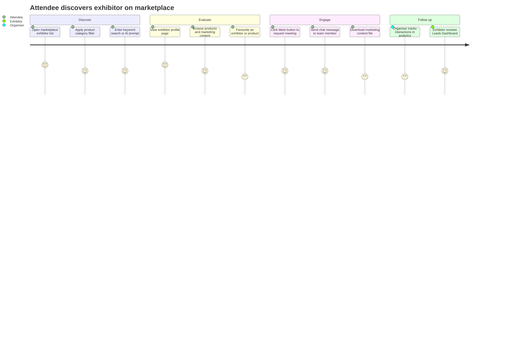
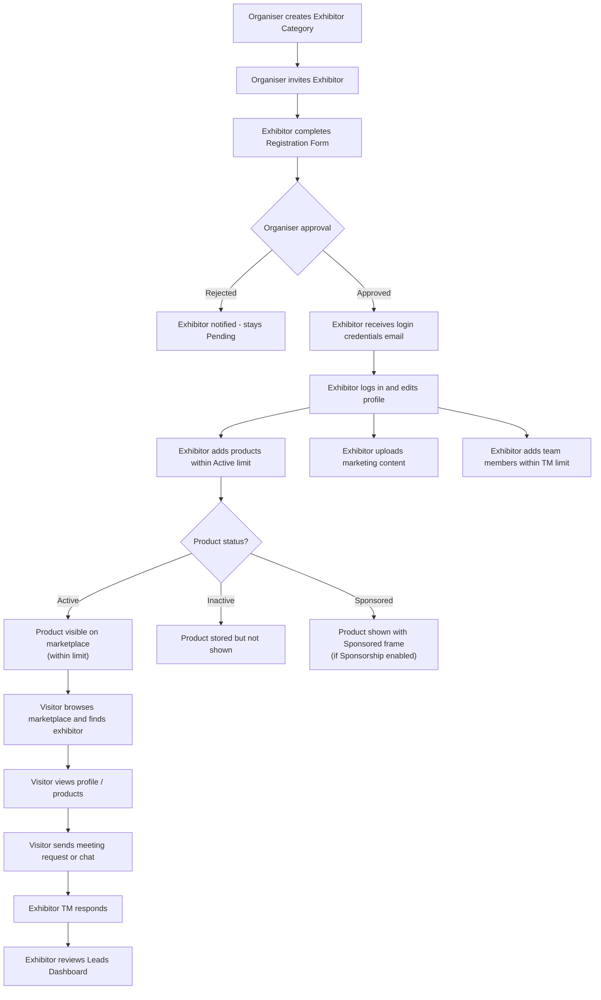
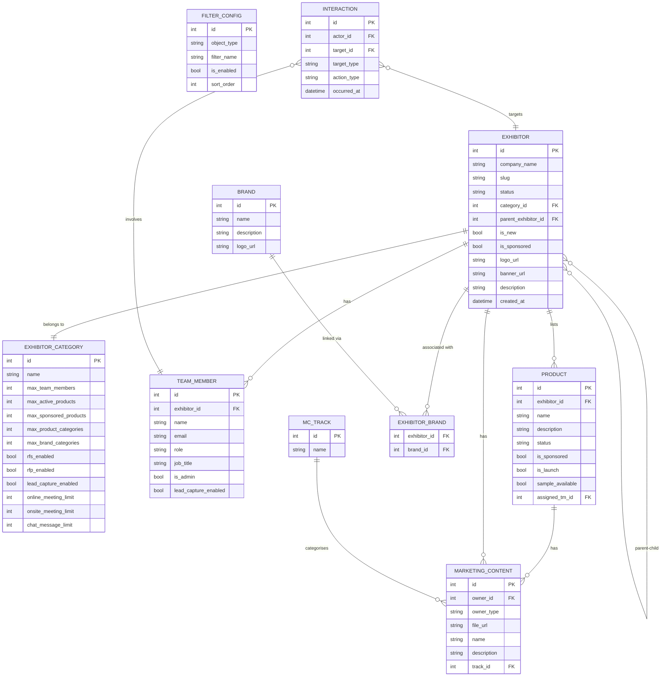
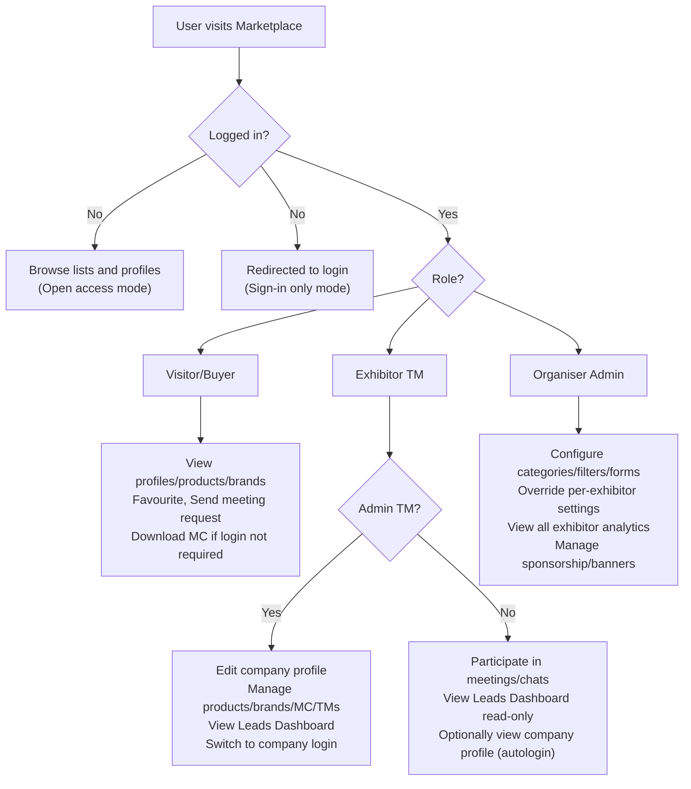

## 1. Product Overview

**Purpose.** The Exhibitor Marketplace is the public-facing discovery layer of every ExpoPlatform event. It is where attendees, buyers, and visitors explore every exhibitor, product, brand, news item, and event that has been made available for the event, and initiate networking interactions with them.

**Problem being solved.** Large trade events involve hundreds or thousands of exhibiting companies, each with distinct products, brands, and marketing materials. Without a structured, searchable, filterable directory, attendees struggle to identify relevant suppliers and exhibitors cannot demonstrate the breadth of their offering. Simultaneously, organisers need fine-grained control over what each tier of exhibitor is permitted to publish, and sponsors need visibility mechanisms that differentiate their presence.

**Business value.**
- Converts passive browsing into qualified leads, meetings, and chat connections.
- Gives organisers a commercial lever: tiered exhibitor categories with configurable entitlements (active product limits, sponsorship slots, meeting caps) drive upsell.
- Sponsored exhibitors and products create a monetisable advertising surface on the marketplace itself.
- AI-powered and ElasticSearch options improve match quality and reduce wasted discovery time.
- Exportable directory (PDF, news export) extends the event's reach beyond the live platform.

**Target users.**
- **Attendees / Buyers / Visitors** — browse and filter exhibitors, products, brands; favourite items; initiate meetings and chats.
- **Exhibitors** — manage their company profile, products, brands, news, team members, and marketing materials within the permissions granted by the organiser.
- **Event Organisers** — configure exhibitor categories, set entitlement limits, define filters, manage sponsorship, view per-exhibitor analytics.
- **Sponsors** — purchase enhanced visibility (banner ads, sponsored-exhibitor blocks, sponsor pop-ups) and track interactions via the Leads Dashboard.

**User personas.**
- *Procurement buyer* — attends a pharma trade event, uses product-category filters and ElasticSearch to find certified-product suppliers, sends three meeting requests per morning.
- *Exhibitor marketing manager* — uploads product catalogue (20 items), marks 5 as active, sets a sponsored product for extra visibility, monitors the Leads Dashboard daily.
- *Event organiser* — creates Gold/Silver/Bronze exhibitor categories with different active-product limits and team-member caps; enables AI search; configures custom filters from registration form fields.
- *Sponsor* — buys a top-banner slot on the exhibitor list and a sponsored-exhibitor position; reviews banner click statistics and pop-up interactions in the Leads Dashboard.

**Success metrics.** Profile-view-to-interaction conversion rate; number of meeting requests initiated from marketplace pages; favourite actions per exhibitor; exhibitor profile-completeness score; AI/ElasticSearch query volume; PDF directory downloads; sponsor banner click-through rate.

---

## 2. Product Scope

### Included
- Public **Exhibitor List** (web and app) with card, list, short-list, and custom-table views.
- **Exhibitor Profile** page — banner, logo, description, video, categories, team members, products, brands, news, marketing content, speaking sessions, floor plan link.
- **Product List** and **Product Profile** pages — image slider, categories, WYSIWYG description, video, marketing content, sample request (RFS), matchmaking info.
- **Brand List** and **Brand Profile** pages — logo, description, categories, social links, associated exhibitors.
- **News** pages — exhibitor-authored news items visible in the marketplace (news export for organisers).
- **Marketing Content** — uploadable files per exhibitor and per product, with track-based filtering; optional public page; login-required download permission.
- **Search & Filters** — keyword search (regular or ElasticSearch), AI-powered natural language search (web only, optional), predefined system filters, custom filters from registration form fields, shareable filter links.
- **Pagination** — default pagination or endless scroll; configurable items-per-page (12 or 24 default).
- **Sponsor visibility** — sponsored-exhibitor blocks on exhibitor list, banner ad placements (top and left sidebar), sponsor pop-ups, sponsored products with distinct frame.
- **Parent-Child exhibitor** relationships — public indication, filter, organisers can hide child indication.
- **Exhibitor categories and permissions** — category-level entitlements (product limits, TM limits, sponsorship, RFP/RFS, meeting caps, chat limits, lead capture, custom lead questions).
- **Per-exhibitor settings** — individual overrides beyond category defaults (custom restrictions).
- **Exhibitor registration form** — multi-tab customisable form; custom fields; "Use as filter" and "Show in exhibitor card" flags.
- **Exhibitor Product Form** — custom fields for products; launch label; required image/description/MC.
- **Matchmaking sorting** on marketplace.
- **PDF directory download** (rebuilds every 30 minutes).
- **Leads Dashboard** — exhibitor-facing interaction tracking (profile views, favourites, meetings, chats, badge scans, content downloads).
- **Exhibitor Profile Analytics** (organiser admin view) — leads widget, meetings charts, products widget, chats widget, event activity, popular content.
- Cross-references: **Exhibitor Portal** (data entry), **Sponsorship** module (banner/video management), **Curated Meeting** module (meeting availability filter).

### Excluded
- Exhibitor Manual (vendor ordering, separate product).
- Onsite badge printing and kiosk check-in (separate product).
- Payment processing for exhibitor packages (Transactions & Purchasing product).
- Delegate / attendee directory (Visitor & Engagement product, though cross-linked).
- Session / programme agenda (Sessions product, though sessions appear on exhibitor profiles).
- Mobile app build pipeline (Client Manager product).

---

## 3. User Roles

| Role | Marketplace access | Key permissions / restrictions |
| --- | --- | --- |
| **Visitor / Attendee** | Browse exhibitor, product, brand, news lists and profiles; search and filter; favourite; initiate meeting/chat via interaction buttons | Cannot edit any content; must be logged in to download MC or send a meeting request (if login required) |
| **Buyer** | Same as Visitor; additional meeting-quota filters visible on marketplace | Meeting availability filter shows only exhibitors with quota remaining |
| **Exhibitor (company login)** | Edit own company profile, products, brands, marketing content, news; view Leads Dashboard | Capabilities bounded by organiser-granted category entitlements; cannot interact with own exhibitor card (no meeting/chat button on own card) |
| **Exhibitor Team Member (Admin)** | Switch into exhibitor account without re-login; edit profile, products, brands, team members | Same entitlements as company login |
| **Exhibitor Team Member (Regular)** | Participate in meetings, chats, sessions; optionally autologin to exhibitor profile (read-only edit if autologin enabled) | Cannot edit exhibitor profile or products unless autologin-with-edit is permitted |
| **Sponsor** | Sponsored exhibitor blocks appear on exhibitor list; can upload banners and sponsor pop-up; sponsor Leads Dashboard tabs | Banners/video managed via Sponsorship page in admin; banner placement requires Sponsorship entitlement |
| **Event Organiser (Admin)** | Full admin panel — configure categories, filters, module management, per-exhibitor settings; view all analytics | Cannot change Global Module Management (SuperAdmin only) |
| **SuperAdmin** | Global Module Management; enable/disable Marketplace modules platform-wide | Affects all events in client environment |

---

## 4. Feature Inventory

#### Exhibitor List Page

**Description.** The main browsable directory of all active exhibitors, accessible at `/newfront/marketplace/exhibitors`.
**Why it exists.** Attendees need a single, filterable view of every company exhibiting; organisers and sponsors need a monetisable surface.
**User value.** Fast, multi-mode discovery (card/list/short-list/custom-table) with interaction buttons directly on cards.
**Functional logic.** Loaded with default alphabetical sort unless Matchmaking sorting is enabled (sorts by match-percentage descending per logged-in user). Sponsored exhibitors appear in a separate named block at the top (block name configurable up to 60 characters at `/admin/sponsors/settings`).
**Preconditions.** At least one active exhibitor exists; Marketplace module enabled.
**Trigger conditions.** User navigates to the marketplace URL; filter/search interaction refreshes the list.
**Processing logic.** Pagination default (12 items; configurable to 24); or endless scroll if enabled. Interaction buttons hidden on the viewer's own card; Meet button hidden if no team members are available for meetings.
**Outputs.** Exhibitor cards in chosen view; sponsored block; banner slots.
**Dependencies.** Display Filters config (`/admin/displayFilters/list/exhibitors`); ElasticSearch or AI search config; Matchmaking algorithm; Sponsorship module.
**Configurations.** Default view (card/list/short-list), custom listing toggle, items-per-page, matchmaking sort toggle, PDF download date range, "New" ribbon eligibility.
**Validation rules.** PDF directory file rebuilds every 30 minutes; may be incomplete if download window opens immediately after a rebuild starts.
**Permissions.** Viewable by any user (logged-in or not, subject to Module Management access mode); interaction buttons require login.
**Error handling.** If ElasticSearch is unavailable, regular search continues. AI search timeout shows an error message.
**Edge cases.** Meeting availability filter only visible on web, not app; Head Office/Child filter web-only; custom-table view cannot be combined with other default views.

#### Exhibitor Profile Page (Web)

**Description.** The full public profile of an exhibitor company.
**Why it exists.** Gives each exhibitor a rich, branded digital stand reachable by direct URL or from the list.
**User value.** All exhibitor information in one place — brand, products, team, sessions, content.
**Functional logic.** Blocks rendered: banner + logo, about description, categories (used for matchmaking), contact info, video (YouTube/Vimeo embed), products, team members, marketing content, brands, sessions (speaking and sponsored, show/hide more), floor plan link (if stand assigned), news.
**Preconditions.** Exhibitor registered and approved; profile data populated.
**Trigger conditions.** User clicks exhibitor card from list, direct URL, or link.
**Processing logic.** Fields visible on profile depend on "Show in exhibitor card" flag per field in Registration Settings. Videos: exhibitor can upload YouTube/Vimeo embeds. "Viewed" mark applied on returning visit.
**Outputs.** Public profile page; Copy public profile link (with optional spreadsheet of company + TM links for admin TMs).
**Dependencies.** Registration Settings form builder; Module Management (products, brands, news enabled); Floor plan module.
**Configurations.** Banner (1200×400px recommended), logo (500×500px recommended), default logo fallback. Organiser can set default logo at `/admin/registration/esettings`.
**Validation rules.** Logo placeholder generated from first letter if no logo and no default logo set. Videos must be YouTube or Vimeo URLs.
**Permissions.** Public view (subject to access mode). Edit accessible only to exhibitor or organiser admin.
**Error handling.** Missing required fields shown as empty; default logo placeholder prevents blank logo state.
**Edge cases.** Logo placeholder color assigned randomly and persists; banner background color derives from logo placeholder even after logo image uploaded.

#### Product List and Product Profile Pages

**Description.** Directory and detail page for all active products listed by exhibitors.
**Why it exists.** Buyers want to find specific products across all exhibitors without visiting each profile.
**User value.** Filter by product category, hall, country; see Sample/Launch ribbons; interact directly with the responsible team member.
**Functional logic.** Product list supports all views. Product profile: image slider, product name, exhibitor info, categories, WYSIWYG description, video (one per product), marketing content (separate from exhibitor-level MC), product sample block (RFS), matchmaking info from "Show in product card" fields, More from Exhibitor section.
**Preconditions.** Product created and set to Active by exhibitor (or organiser); product limit not exceeded.
**Trigger conditions.** User navigates to `/newfront/marketplace/products` or clicks product card.
**Processing logic.** Product can be marked Active, Inactive, or Sponsored. Sponsored products display a distinct visual frame. Interaction buttons on product card initiate meeting/chat with assigned team member if one is set.
**Outputs.** Product cards, product profile page.
**Dependencies.** Exhibitor product form config; RFS module; Sponsorship (sponsored products).
**Configurations.** Required image, required description, required MC, launch label — all toggleable per event at Registration Settings > Exhibitors > Product Form.
**Validation rules.** When "Forbid adding active products" toggle is on, exhibitors blocked from activating products once their Active limit is reached (EP-10479). When limit reached but "Allow to create when limit reached" is on, products can be added as inactive. Sample overrides Launch ribbon if both enabled.
**Permissions.** View: anyone. Add/edit products: exhibitor (within entitlement). Organiser can manage via admin.
**Error handling.** Product deactivation clears Product TM, Sample event, Sponsorship fields (EP-26427 API behavior mirrored on frontend).
**Edge cases.** One video per product only. Product MC files do not appear on the exhibitor profile — they are separate. Products from another event are lost if child exhibitor is reassigned cross-event.

#### Brand List and Brand Profile Pages

**Description.** Directory and detail page for brands associated with one or more exhibitors.
**Why it exists.** Multi-brand exhibitors want to showcase their brand portfolio independently; buyers may search by brand name rather than exhibitor.
**User value.** Discover brands across all exhibitors; see associated exhibitors and their products.
**Functional logic.** Brand added by exhibitor in frontend profile (Profile Info > Brands > Add Brand) or via API. Brand card: logo, name, favorite, viewed mark. Brand profile: About block, product categories, social links, associated exhibitors block (each with interaction buttons, products, logo, categories).
**Preconditions.** Brands module enabled in Module Management (backend + frontend); Brands page added in web builder.
**Trigger conditions.** User navigates to brands list or clicks brand card.
**Processing logic.** Category limit for brands set per exhibitor individually in admin panel (Settings tab > Referencing > Categories for Brands). Filters: Hall, Exhibitor Categories, Product categories, Countries, Tags.
**Outputs.** Brand cards in card/list/short-list views; brand profile.
**Dependencies.** Module Management; web builder; Exhibitor Portal data entry.
**Configurations.** Max categories per brand (per exhibitor in admin panel, Referencing block).
**Permissions.** View: anyone. Create/edit: exhibitor or via API. Category limit override: organiser.
**Error handling.** Social media icons do not render if no social links entered; troubleshooting: verify links, hard refresh, incognito mode.
**Edge cases.** Brand categories can be limited per individual exhibitor, not only by category.

#### Search and Filters

**Description.** Keyword search and faceted filter controls surfaced on all marketplace list pages.
**Why it exists.** Without search and filter, large exhibitor directories are unusable.
**User value.** Visitors rapidly narrow thousands of exhibitors to a relevant shortlist.
**Functional logic.** Regular search: keyword match across enabled fields (not weighted). ElasticSearch: field priority multipliers configured at `/admin/appointments/search` — higher-value fields rank matches more strongly (e.g., Category multiplier 3 > Description multiplier 2 > Name multiplier 0). AI Search (optional, web only): natural language prompt, up to 500 results, mutually exclusive with ElasticSearch, English only, results for sponsors and exhibitors shown simultaneously.
**Preconditions.** ElasticSearch or AI search must be enabled by organiser. Filters must be configured at `/admin/displayFilters/list/exhibitors`.
**Trigger conditions.** User types in search box (Enter key), selects a filter, or inputs an AI prompt.
**Processing logic.** System predefined filters: New, Hall, Exhibitor categories, Product categories, Countries, Tags, Head Office/Child (web), Meeting availability (web). Custom filters: any registration form field with predefined options and "Use as filter" checked. Filter category pages can have custom banners (EP-9572, custom URL slug banners). Shareable filter link includes ID of user who generated it (Favorites Dashboard attribution, EP-12576).
**Outputs.** Filtered/sorted exhibitor, product, or brand list.
**Dependencies.** Display Filters admin config; ElasticSearch service; AI search service (Networking & Matchmaking > Search AI tab).
**Configurations.** AI widget prompt text (max 100 chars), up to 3 suggested prompts, "Use endless scrolling" toggle.
**Validation rules.** AI search does not support simultaneous ElasticSearch. AI only active for Exhibitors tab; all other tabs disabled while AI widget open.
**Error handling.** Timeout and internal error messages shown for AI search failures. Page refresh during AI processing stops search; previous query text preserved but not re-sent.
**Edge cases.** Search bar option for category pop-up (EP-36732). Meeting availability filter: shows exhibitors who have not exhausted their meeting quota cap (EP-23255). Filter categories can have custom URL slugs with custom banners (EP-9572).

#### Exhibitor Categories and Permissions

**Description.** The organiser's entitlement framework: category definitions that govern every exhibitor's capabilities on the marketplace.
**Why it exists.** Different sponsorship tiers (Gold, Silver, Bronze etc.) have different platform rights — this is the commercial lever.
**User value.** Organisers can sell differentiated packages; exhibitors know exactly what they are entitled to.
**Functional logic.** Configured at Registration Settings > Exhibitor > Exhibitor settings (category pop-up). Per category settings include: max team members, active product limit, inactive product creation, sponsored products (limit), categories for products/brands (max number), meeting limits (online/onsite, requests/confirmations), chat message limits, lead capture toggle, custom lead questions, RFP/RFS access, restricted access, showroom, marketing content, parent-child, exhibitor events.
**Preconditions.** Categories created before exhibitors are registered.
**Trigger conditions.** Exhibitor assigned to a category (at registration or by organiser change). Individual override: organiser clicks "Set custom" on an exhibitor's Settings page.
**Processing logic.** Category restrictions are the default. Organiser can override individual exhibitors via the Settings page (Custom restrictions). Changing an exhibitor's category does NOT reset custom settings already applied. "Reset All to Category" button available to re-align.
**Outputs.** Per-exhibitor capability set; enforced throughout the marketplace.
**Dependencies.** Registration Settings; Global Module Management (must have relevant modules enabled globally before category-level toggles are meaningful).
**Configurations.** All listed per-category fields. Sponsor category and Sponsored products limit are Custom-only settings (not available in category pop-up, only on individual exhibitor Settings page).
**Permissions.** Set by Organiser or SuperAdmin.
**Edge cases.** Online/offline meeting limits always inherit from Category (cannot be Custom overridden at exhibitor level). RFP/RFS always category-controlled with no custom override.

#### Exhibitor Registration Form

**Description.** The customisable form that captures exhibitor company data used throughout the profile.
**Why it exists.** Every event has different data requirements; a flexible form avoids hardcoding.
**User value.** Organisers collect the exact data they need; exhibitors see a branded, event-specific registration experience.
**Functional logic.** Set up at Registration Settings > Exhibitor. One default "Company Details" tab plus unlimited custom tabs. No conditional logic on page 1. No payments. Duplicate email creates a new account (no pre-population). Organiser approval required (Pending Activation → approve → Exhibitor Password email).
**Preconditions.** Event exists; Registration Settings configured before exhibitors invited.
**Trigger conditions.** Exhibitor accesses registration URL or organiser uploads/imports exhibitor data.
**Outputs.** Exhibitor profile data record; "Use as filter" fields create marketplace filters; "Show in exhibitor card" fields populate Matchmaking info block; "Use for teammember creation" fields appear in TM creation form.
**Error handling.** Duplicate email → new account created without data pre-fill; organiser must approve manually.
**Edge cases.** Activity Categories field used for matchmaking; Interest Categories also used. Tab hidden on Registration, Edit Profile, or Summary independently. Predefined field cannot be used more than once.

#### Product Form

**Description.** Organiser-defined custom fields added to the product add/edit page and product profile.
**Why it exists.** Products vary enormously across industries; a fixed set of product fields would be insufficient.
**Functional logic.** Set up at Registration Settings > Exhibitors > Product Form. Field types: Text, Select, Text Area, Radio Group, Checkbox Group, Checkbox. "Show in product card" → Matchmaking info block on product page. "Use as filter" → appears as filter on product list page. Required product image, required description, required MC are separate toggles. Launch label toggle enables a "Launch" ribbon on product card (overridden by Sample ribbon if both active).
**Permissions.** Organiser configures; exhibitor fills in within their product add/edit form.

#### Parent-Child Exhibitor Relationships

**Description.** Allows one exhibitor to be the parent of one or more child exhibitors, representing group or regional exhibiting structures.
**Why it exists.** Global companies (e.g., Pfizer US and Pfizer India) may exhibit separately at regional editions but want to be linked. Distributors represent parent brands. (EP-927)
**User value.** Visitors can see that exhibitors are related; parents can manage child profiles.
**Functional logic.** Enable: Module Management > Frontend > Parent-Child. Child category assignment: without category, inherits from parent, or organiser-specified allowed categories. Add child: search by name/email (all events) or create new. Child receives login credentials email. Parent TMs can optionally access child profiles. "Do not indicate Child companies" toggle hides child indication on frontend while retaining parent indication.
**Outputs.** Parent mark on exhibitor cards; child list under parent profile; filter for Head Office/Child exhibitors on list page (web only).
**Configurations.** Custom labels for parent/child terminology (multilingual supported, EP-37234/EP-37278). "Control if Child companies indication is present" toggle (EP-37800/EP-37805).
**Edge cases.** Exhibitor already in another parent-child relationship → "Already involved" error. Adding exhibitor from another event → products and TMs lost; user warned. Regular TMs can autologin to child exhibitor profile with no edit rights if setting enabled.

#### Sponsorship and Sponsored Visibility

**Description.** Mechanisms by which sponsor exhibitors gain premium visibility on marketplace pages.
**Why it exists.** Sponsors pay for differentiated placement; organisers need a configurable advertising layer.
**Functional logic.** Sponsored exhibitors: appear in a dedicated named block on the exhibitor list (name configurable, max 60 chars). Sponsored products: displayed with distinct visual frame on product cards. Banner ad placements: top banners (1 or 2) and left sidebar banners (1, 2, or 3; square or rectangular shape) on list pages. Each banner has an on/off toggle. Banners can be set for: Search/Exhibitor TOP and Left, Delegates, Speaker, Sessions, News list, Floor plan TOP and Left, Article, Community, Group, Feed, Visitor/Exhibitor My Profile, App exhibitor list, App products catalogue, App speakers, App visitors/buyers, App sessions. Sponsor video for online room entrance (MP4/WebM). Sponsor pop-up interaction tracking in Leads Dashboard. Analytics from banners and video recorded; sync with `/admin/sponsors/list`.
**Preconditions.** Sponsorship page configured in admin; Sponsored products limit set in exhibitor Settings page (Custom restriction only).
**Dependencies.** Sponsorship module; Exhibitor Portal (profile data); Leads Dashboard.
**Error handling.** Mobile/tablet banner display issues addressed in EP-16209 (responsive banner improvement).

#### Marketing Content

**Description.** Downloadable and previewable files uploaded by exhibitors to their profile or individual products.
**Why it exists.** Exhibitors want to share brochures, spec sheets, and other assets with interested buyers.
**Functional logic.** Exhibitor-level MC appears on the exhibitor profile. Product-level MC appears on the product page only (not shared with exhibitor profile). Tracks: organiser-created at Registration Settings > Exhibitor > Marketing Content Tracks; used for filtering MC files. "Content public page" toggle: when on, MC items clickable without login (preview/download still require login). "Content preview and download requires login" toggle: when on, blocks unlogged access entirely.
**Outputs.** MC files displayed on profile/product page with name, description, track, thumbnail, preview and download buttons.
**Configurations.** Unlimited tracks; two independent toggles for public page and login-required download.
**Edge cases.** Product MC files are entirely separate from exhibitor MC and must be managed independently.

#### Exhibitor Leads Dashboard

**Description.** Exhibitor-facing dashboard showing who interacted with their profile and how.
**Why it exists.** Exhibitors need to identify and follow up with warm leads efficiently.
**Functional logic.** Tabs: Interactions (all company + TM interactions), QR Scans. For sponsors: additional tabs for Pop-Up Interactions, Banner Statistics, Exhibitor List Interactions, Product List Interactions. Metrics per person: profile views, product views, content views/downloads, profile/product favourites, scanned badges, confirmed meetings, chats. Tooltips on hover: dates and times of each action, ranked by frequency then recency.
**May 2026 update.** Meeting lead attribution changed: if exhibitor has TMs, TMs get the leads (not the exhibitor entity); if no TMs, exhibitor gets the lead. Retroactive recalculation applies to all existing records.
**Dependencies.** Lead Capture module; Contact Sharing settings; badge scanning.
**Edge cases.** First-action rule: only the first qualifying unique action per user generates a lead per contributor. Favouriting then unfavouring decrements the favourite count.

#### Exhibitor Profile Analytics (Organiser View)

**Description.** Analytics dashboard inside each exhibitor's admin profile, giving the organiser insight into that exhibitor's performance.
**Why it exists.** Organisers need to identify high- and low-performing exhibitors and demonstrate ROI to them.
**Functional logic.** Widgets: Leads (total/offline/online/avg), Profile Statistic (since date, potential matches, category, profile completeness), Incoming Meetings Source Pie Chart (sources: web pages, app sections, segmentable), Meeting Requests Line Chart (vs event avg, by day/week/month), Products Widget (active count/limit, favorites, views), Top Performers (TMs ranked by total interactions), Lead Capture Widget (conditional on LC enabled), Chats Widget (total, messages, initiated/received, graph), Event Activity Widget (activity/popularity score, conditional on Interaction Scores module), Popular Content Widget (news/events/downloads top 3, expandable).
**Data rules.** 2-year lookback. Empty months shown in range. Unfavourites decrement count. Only active exhibitors included in averages. Deleted objects remove associated stats.

---

## 5. User Stories Mapping

| Story ID | Title | Summary | Acceptance criteria | Related feature | Status |
| --- | --- | --- | --- | --- | --- |
| EP-55 | News Export | Organiser downloads news data as structured file | Export file contains all columns in order; most up-to-date data | News/Marketing Content | COMPLETE |
| EP-927 | Parent/Child relationship between Exhibitors | Three use-case types: global/event-specific profiles, co-exhibiting brands, distributor-product lines | Enable parent-child in Module Mgmt; child can be existing or new exhibitor; child receives login credentials; cross-event warning shown | Parent-Child Exhibitor | COMPLETE |
| EP-1066 | New Analytics UI — Marketplace | New analytics module global for all events; top menu event list | New analytics UI shows total numbers (products, brands, suppliers) over time; interactions over time | Exhibitor Profile Analytics | COMPLETE |
| EP-1149 | Pagination for listings on frontend | When endless scrolling OFF, pagination used | Pagination renders on Marketplace, People, News, Groups when setting is off | Exhibitor List / Product List pagination | COMPLETE |
| EP-9572 | Custom Banners for category pages | No way to customise banners per category URL slug | Custom banner can be set per category URL slug in admin; default banner overridden | Search & Filters / Categories | COMPLETE |
| EP-9619 | New Analytics — Marketplace fixes | Marketplace analytics widgets fixes | marketplace-total-numbers shows Products, Brands, Suppliers over time; Interactions widget counts unique conversations, meeting requests, confirmed meetings involving Suppliers | Exhibitor Profile Analytics | QA Tested |
| EP-10479 | Forbid exhibitors to add active products for those not allowed | Exhibitors can add inactive products unknowingly when limit reached | New setting: when "no active products" is ON, block product creation; default arriving on Active products by default | Product Form / Entitlements | COMPLETE |
| EP-11579 | Display 24 items on catalogue page by default | Only 12 items shown by default on marketplace | Setting at Exhibitor Settings > Default number of exhibitors to show: 12 or 24 | Exhibitor List pagination | COMPLETE |
| EP-12576 | User Favorites Dashboard | Copy link to applied filters with author ID | Link contains filter author ID; Favorites Dashboard shows source of favourite actions | Search & Filters / Leads | COMPLETE |
| EP-12725 | Option to have Custom Listing | New table view for marketplace | Custom listing toggle enables table view showing registration fields marked "show in custom list" | Exhibitor List views | COMPLETE |
| EP-15370 | Redirection links ExpoFP Floorplan | Clickable stands on frontend redirect to exhibitor profile | All clickable stand locations implement redirection logic | Exhibitor Profile / Floor plan | COMPLETE |
| EP-16209 | Sponsor Banner for Mobile and Tablet View improvement | Sponsor banner occupies full first view on mobile | Banner correctly sized/positioned on mobile and tablet | Sponsorship banners | COMPLETE |
| EP-22876 | Redesign of Exhibitor account in Admin panel | New multi-page structure for exhibitor admin account | Pages: Analytics, Registration Info, Security, Settings, Sponsorship, Team Members, Floor Plan; quick-access navigation menu | Exhibitor Profile (organiser admin) | COMPLETE |
| EP-22877 | Preparation for Redesign of Exhibitor account in Admin panel | Move from single-page to multi-page exhibitor profile in admin | First opened page = analytics; other pages reachable via quick access menu | Exhibitor Profile (organiser admin) | COMPLETE |
| EP-22966 | Search and filter for sponsor categories on sponsors page | No search/filter on sponsors page | Search bar and sponsor-category filter added to sponsors page | Sponsorship / Categories | COMPLETE |
| EP-23255 | Ability for buyers to filter exhibitors by meeting quota availability | No filter for exhibitors who still have meetings available | Meeting availability filter shows only exhibitors with quota not exhausted | Search & Filters | COMPLETE |
| EP-24228 | Order of product category on frontend for both web and app | Category order inconsistent | Category display order corrected on product/news/event category lists on web and app | Product Profile / Categories | COMPLETE |
| EP-26041 | Leader Dashboard | Refreshed Interactions / Leads Dashboard | Lead Dashboard improved with new metrics, tooltips, date/time tracking, tabs per role | Exhibitor Leads Dashboard | COMPLETE |
| EP-26427 | /api/v2/product/set — addition of status parameter | API cannot set product Active/Inactive | API endpoint extended; deactivation clears Product TM, Sample event, Sponsorship fields | Product management / API | COMPLETE |
| EP-27547 | Prompt Based Search using AI on Exhibitor List | No natural language search | AI search widget on exhibitor list; mutually exclusive with ElasticSearch; web only; English only | AI-powered Search | COMPLETE |
| EP-27888 | Networking Filters for Attendee and Exhibitor Lists | No existing-meeting filters | "Existing Meeting Initiator" and "Existing Meeting Status" filters added at `/admin/displayFilters`; default OFF | Search & Filters (networking) | COMPLETE |
| EP-27950 | Add Activation link variable in email sender | Activation link variable missing in Email Sender | Activation Link variable added under Marketing > Email Sender | Exhibitor Registration email | COMPLETE |
| EP-36732 | Search bar option for Categories | No search bar in category selector pop-up | Search bar added within category selection pop-up on marketplace | Search & Filters / Categories | COMPLETE |
| EP-37234 | Settings to define labels for Parent-Child (Web) | Hard-coded "Parent/Child" terminology | Input fields at `/admin/registration/esettings` for custom parent/child labels; multilingual support | Parent-Child Exhibitor | COMPLETE |
| EP-37278 | Settings to define labels for Parent-Child (App) | Hard-coded terminology on app | Same custom label settings apply to app | Parent-Child Exhibitor | COMPLETE |
| EP-37473 | Hide Meet Button for Exhibitors Without Available TMs (App) | Meet button shown even if no TMs available | System checks each TM's availability; hides Meet button if none available on app | Exhibitor List / Profile | COMPLETE |
| EP-37800 | Control if Child companies indication is present (Web) | Cannot hide child company indications | "Do not indicate Child companies" toggle; default OFF; hides child indications on web | Parent-Child Exhibitor | COMPLETE |
| EP-37805 | Control if Child companies indication is present (App) | Same gap on app | Same toggle applies to app | Parent-Child Exhibitor | COMPLETE |

---

## 6. End-to-End Workflows

### User journey — attendee discovering and engaging with an exhibitor

### System workflow — exhibitor listing publication

### Happy path
Organiser creates categories → invites exhibitors → exhibitor completes form → organiser approves → exhibitor enriches profile (logo, banner, products, MC, TMs) → profile visible on marketplace → attendee searches and filters → attendee views profile, requests meeting → TM confirms → lead captured in dashboard.

### Alternate path — AI search
Attendee types natural-language prompt ("certified organic ingredient suppliers from Germany") into AI widget → widget shows confirmation message → up to 500 matching exhibitors displayed → attendee refines with follow-up prompt → clicks exhibitor → profile viewed → meeting requested.

### Alternate path — sponsored visibility
Organiser enables Sponsorship for a Gold-category exhibitor → organiser assigns sponsor category and uploads banner → sponsor's exhibitor card appears in dedicated Sponsors block at top of exhibitor list → sponsor banner appears in top and left sidebar slots → attendee clicks banner → sponsor's profile viewed → interaction recorded in Leads Dashboard banner tab.

### Exception path — product limit reached
Exhibitor tries to add 6th active product when limit is 5 → if "Forbid adding active products" is ON: creation blocked, exhibitor sees limit warning → exhibitor contacts organiser to increase limit → organiser raises limit → exhibitor activates product. If "Allow to create when limit reached" is ON: product saved as Inactive → exhibitor activates when organiser raises limit.

### Recovery path — exhibitor account locked
Exhibitor team member removed → role reverts to Visitor → member remains in event but loses exhibitor access → organiser re-adds TM to exhibitor profile → meetings and chats from before removal are removed.

---

## 7. Business Rules Engine

| Rule | Condition | Exception / Priority | Conflict resolution |
| --- | --- | --- | --- |
| Active product limit enforced | Exhibitor tries to set a product Active when at their limit | If "Allow to create when limit reached" is ON: product can be created as Inactive | Organiser can raise limit or override per exhibitor via custom restriction |
| Meet button visibility | Meet button shown on exhibitor card only if at least one TM is available (permissions, opt-in, time slots, meeting limits all checked) | TMs of the exhibitor themselves never see the Meet button on their own company card | System re-evaluates TM availability dynamically |
| Product deactivation clears linked fields | When product set to Inactive via API or UI: Product TM, Sample event, Sponsorship fields cleared | Manual re-entry required if exhibitor reactivates | Irreversible until exhibitor re-fills fields |
| Sponsored products require Sponsorship entitlement | Exhibitor can only set products as Sponsored if their category or custom settings allow sponsored products | Sponsored products limit is a Custom-only setting (no category-level control) | Organiser sets custom sponsored products limit per exhibitor on Settings page |
| Sample ribbon overrides Launch ribbon | Both Launch and Sample enabled on a product | Sample ribbon takes display priority | No conflict; Launch ribbon simply hidden |
| Duplicate email in exhibitor registration | Exhibitor tries to register with existing email | New exhibitor account created without data pre-population | Organiser must manually merge or approve correct account |
| AI search excludes ElasticSearch | AI search and ElasticSearch cannot be active simultaneously | Only one search mode active at a time | Organiser chooses mode in admin; switching clears the other |
| Child exhibitor cross-event import | Parent adds existing exhibitor from a different event as a child | Exhibitor's products and TMs from previous event are deleted; user warned before confirmation | Warning shown; confirmation required to proceed |
| Parent/Child indication visibility | "Do not indicate Child companies" toggle ON | Parent indication remains; only child indication hidden | Setting applies globally across all marketplace views and app |
| Meeting lead attribution (May 2026) | Meeting appointed to Exhibitor entity | If Exhibitor has TMs: TMs get leads, Exhibitor entity does not. If no TMs: Exhibitor entity gets lead | First-action rule: only first qualifying unique action generates a lead per contributor |
| Matchmaking sorting | "Matchmaking sorting on Marketplace" toggle ON | Overrides default alphabetical sort | Per logged-in user (different sort results for different users); anonymous users see default sort |
| Content preview/download gating | "Content preview and download requires login" toggle ON | Unlogged users can see MC item names if "Content public page" is also ON, but cannot preview or download | Login required check runs before preview/download action |

---

## 8. Data Model

### Entity-relationship diagram

### Exhibitor listing visibility state diagram

```mermaid
stateDiagram-v2
  [*] --> PendingActivation : Exhibitor submits registration form
  PendingActivation --> Active : Organiser approves
  PendingActivation --> Rejected : Organiser rejects
  Active --> ProfileIncomplete : Logged in; no logo/description/products
  ProfileIncomplete --> Active : Profile details saved
  Active --> SponsoredExhibitor : Organiser enables sponsorship on category/custom settings
  SponsoredExhibitor --> Active : Sponsorship removed
  Active --> Inactive : Organiser deactivates exhibitor
  Inactive --> Active : Organiser reactivates
  Active --> Deleted : Organiser deletes exhibitor record
  Deleted --> [*]
  Rejected --> [*]

  state Active {
    [*] --> VisibleOnMarketplace
    VisibleOnMarketplace --> HiddenByFilter : Visitor applies filter that excludes exhibitor
    HiddenByFilter --> VisibleOnMarketplace : Filter removed or exhibitor matches
  }
```

**Lifecycle states — Products.**
- `Inactive` — created but not shown on marketplace; fields editable.
- `Active` — shown on marketplace (counts toward Active product limit).
- `Sponsored` — Active and displayed with distinct frame; requires Sponsorship entitlement.
- Deactivating clears: Product TM, Sample event, Sponsorship fields.

**Key data relationships.**
- Each Exhibitor belongs to exactly one Category; per-exhibitor Custom restrictions override category defaults.
- Products are owned by one Exhibitor; one optional assigned TM per product for directed interactions.
- Marketing Content owned by either an Exhibitor or a Product (distinguished by owner_type).
- Brands are shared entities; multiple Exhibitors can associate with the same Brand.
- Parent-child is a self-referencing relationship on Exhibitor (one parent, potentially many children).

---

## 9. Permissions Matrix

### Permission-flow diagram

### Role × Capability table

| Capability | Visitor | Buyer | Exhibitor TM Regular | Exhibitor TM Admin | Organiser Admin | SuperAdmin |
| --- | --- | --- | --- | --- | --- | --- |
| Browse exhibitor/product/brand/news lists | Yes | Yes | Yes | Yes | Yes | Yes |
| View exhibitor/product/brand profiles | Yes | Yes | Yes | Yes | Yes | Yes |
| Search and filter marketplace | Yes | Yes | Yes | Yes | Yes | Yes |
| Favourite exhibitor/product/brand | Login req. | Login req. | Yes | Yes | Yes | Yes |
| Send meeting request | Login req. | Login req. | Yes | Yes | Yes | Yes |
| Send chat message | Login req. | Login req. | Yes | Yes | Yes | Yes |
| Download marketing content | Depends on toggle | Depends | Yes | Yes | Yes | Yes |
| Edit exhibitor company profile | No | No | No (unless autologin+edit) | Yes | Yes (admin panel) | Yes |
| Add/edit products | No | No | No | Yes (within limits) | Yes | Yes |
| Add/edit brands | No | No | No | Yes (within limits) | Yes | Yes |
| Upload marketing content | No | No | No | Yes (within limits) | Yes | Yes |
| View Leads Dashboard | No | No | Yes (own) | Yes (own) | No (Analytics in admin) | Yes |
| View Exhibitor Profile Analytics (admin) | No | No | No | No | Yes | Yes |
| Configure exhibitor categories | No | No | No | No | Yes | Yes |
| Override individual exhibitor settings | No | No | No | No | Yes | Yes |
| Manage sponsorship/banners | No | No | No | No | Yes | Yes |
| Configure filters/search | No | No | No | No | Yes | Yes |
| Enable AI search / ElasticSearch | No | No | No | No | Yes | Yes |
| Enable Global Module Management | No | No | No | No | No | Yes |

---

## 10. Integrations

| Integration | Purpose | Trigger | Data exchanged | Failure handling | Retry | Security |
| --- | --- | --- | --- | --- | --- | --- |
| **Exhibitor Portal (Frontend)** | Exhibitors enter and manage all profile data on the frontend; this data populates the marketplace | Exhibitor saves profile, product, brand, MC, or TM data | Company info, products (status, images, description, categories), brands, MC files, TM records | Save failure shows error to exhibitor; partial save not committed | Exhibitor can retry save | Session auth; exhibitor can only edit own data |
| **Product API v2 (`/api/v2/product/set`)** | External systems (CRM, PIM) push product data including status | API call with product fields including `status` | Product name, description, status (Active/Inactive), categories | API returns error on invalid parameters | Client-side retry | API key / token auth |
| **Sponsorship Module** | Manages banner upload, sponsor assignments, sponsor pop-up configuration | Organiser uploads banner, enables sponsorship on exhibitor | Banner image URLs, placement slots, sponsor toggle state | Broken banner URL shows empty slot | Re-upload via admin | Organiser admin session |
| **ElasticSearch Service** | Provides weighted full-text search across exhibitor, product, brand data | User enters keyword in search box (ElasticSearch enabled) | Search query, field priority weights, indexed exhibitor/product/brand records | Falls back to regular search | Automatic per request | Internal network; admin-configured field weights |
| **AI Search Service** | Natural language query interpretation and exhibitor ranking | User submits AI prompt | Prompt text, indexed exhibitor data | Timeout and internal error messages shown to user; stop button available | User submits new prompt | Internal; English only; 500-result cap |
| **Floor Plan (ExpoFP)** | Links exhibitor stand on interactive floor plan to exhibitor profile | User clicks stand on floor plan | Exhibitor ID, stand location | Broken redirect falls through to marketplace list | EP-15370 logic applied | Standard HTTPS redirect |
| **Matchmaking Algorithm** | Sorts exhibitor list by relevance to logged-in user when matchmaking sort is enabled | Page load / filter change when matchmaking sort is ON | User profile data, exhibitor category and interest data | Fallback to alphabetical sort | Automatic | Auth session; per-user personalised |
| **Favorites Dashboard** | Tracks source of favourite actions when shareable filter link used | User clicks "Copy link to applied filters"; recipient adds a favourite | Filter state, user ID of link author, favourite action record | If user ID missing from URL, attribution not recorded | n/a | Session auth |
| **Registration Emails** | Sends transactional emails at key lifecycle points | Exhibitor pre-registration, approval, child exhibitor creation, password set, activation link | Exhibitor email address, login credentials, activation link, template variables | Failed sends logged; resendable from admin | Manual resend via admin | SMTP; template variables validated |

---

## 11. Notifications

| Event | Channel | Recipient | Timing | Template / Content |
| --- | --- | --- | --- | --- |
| Exhibitor pre-registration submitted | Email | Exhibitor contact email | Immediately on form submit | "Exhibitor Pre-Registration" template; confirms receipt, awaiting approval |
| Exhibitor account approved | Email | Exhibitor | Immediately on organiser approval | "Exhibitor Password" template; contains login credentials |
| Child exhibitor created | Email | Child exhibitor | Immediately on creation | Separate email template created under Registration Emails; contains login link and credentials |
| Activation link (email sender campaigns) | Email | Target exhibitor list | On campaign send | "Activation Link" variable available in Marketing > Email Sender (EP-27950) |
| Meeting request received | In-app / Email (if enabled) | Exhibitor TM assigned to meeting slot | On meeting request | Standard meeting notification (controlled by Networking settings) |
| Meeting confirmed | In-app / Email | Both parties | On confirmation | Standard meeting confirmation notification |

> [!INFO] The Exhibitor Marketplace does not have its own push notification or SMS layer. All notification delivery is handled by the platform's Email Builder and Notification settings, which are configured globally. The notifications listed above reflect the lifecycle events specific to exhibitor registration and marketplace activity. Full notification configuration detail is covered in the Email Builder and Marketing Campaigns documentation.

---

## 12. Reporting and Analytics

### Organiser — Marketplace Analytics (Global)

| Report | Inputs | Metrics | Calculations | Filters | Export |
| --- | --- | --- | --- | --- | --- |
| Marketplace total numbers | Date range, event | Total products, brands, suppliers (exhibitors + TMs) over time; interactions (unique conversations, meeting requests, confirmed meetings involving suppliers) | Count of active entities per day/week/month | Date range, metric type (entities vs interactions) | Via new analytics UI (EP-1066) |

### Organiser — Per-Exhibitor Analytics (Admin Panel)

| Widget | Inputs | Metrics | Calculations | Filters | Export |
| --- | --- | --- | --- | --- | --- |
| Leads widget | Exhibitor ID, event | Total leads, offline leads (badge scans), online leads (profile view, meeting, favourite), avg per exhibitor | Unique actions per source; avg = total leads / active exhibitor count | Source type | Download leads file |
| Profile Statistic | Exhibitor ID | Since-date, potential matches, category, profile completeness (logo, TMs, products, about, product categories) | Profile completeness mirrors frontend indicator | n/a | n/a |
| Incoming Meetings Source | Exhibitor ID, platform (web/app/all) | Meeting requests per source (Exhibitor List, Product List, Profile, Matchmaking, Campaign etc.) | Count per source; tooltip shows % of total | Platform (web/app/all) | n/a |
| Meeting Requests Line Chart | Exhibitor ID, time granularity | Total meeting requests over time vs event average | By day/week/month; comparison vs avg of all active exhibitors | Time granularity | n/a |
| Products Widget | Exhibitor ID | Active products count/limit, most-popular by favourites, views per product | Unique actions only; avg values per exhibitor | n/a | n/a |
| Top Performers | Exhibitor ID | TM ranking by sum of: meeting requests + badge scans + chats; max 4 shown | Sum per TM; per-exhibitor avg | n/a | n/a |
| Lead Capture Widget | Exhibitor ID (LC enabled) | Scan categories, ratings, types (New/Old/Contacted) | Dynamic range based on max scans in any category; avg per exhibitor | Scan type | n/a |
| Chats Widget | Exhibitor ID | Total chats, total messages, avg messages/chat, initiated, received, activity graph | Unique chat counts; initiated vs received breakdown | Time granularity (day/week/month) | n/a |
| Event Activity Widget | Exhibitor ID (Interaction Scores enabled) | Activity score, popularity score over time | Uses Interaction Scores module values | Time granularity | n/a |
| Popular Content Widget | Exhibitor ID | Top 3 news (by views), top 3 events (by bookings), top 3 downloads (by download count) | Ranked by count; Show more reveals 3 more at a time | Content type | n/a |

### Exhibitor — Leads Dashboard

| Tab | Inputs | Metrics | Calculations | Filters | Export |
| --- | --- | --- | --- | --- | --- |
| Interactions | Exhibitor/TM selection | Profile views, product views, content views/downloads, profile/product favourites, scanned badges, confirmed meetings, chats | Per person per action type; total row above board | Company vs individual TM | Download leads file |
| QR Scans | Exhibitor ID | Company scans (last 10), product scans, content scans | Chronological; priority by frequency then date | Scan type | n/a |
| News Export (EP-55) | Organiser, event | All news columns in order | Most up-to-date data at export time | n/a | File download |

---

## 13. Configuration Guide

| Setting | Effect | Location | Who can set |
| --- | --- | --- | --- |
| Default Number of Items to Show | Sets items per page on marketplace lists (12 or 24) | Event Setup > General > Settings | Organiser |
| Use Endless Scrolling | Switches from pagination to infinite scroll on lists | Event Setup > General > Settings > Search block | Organiser |
| Marketplace view by default | Sets default list view (card/list/short-list) for all marketplace pages | Registration Settings > Exhibitor > Additional Settings | Organiser |
| Custom listing | Enables custom table view showing fields marked "show in custom list" | Registration Settings > Exhibitor > Additional Settings | Organiser |
| Matchmaking sorting on Marketplace | Sorts exhibitor list by matchmaking score for each logged-in user | Registration Settings > Exhibitor > Additional Settings | Organiser |
| Content public page | Makes MC items clickable without login (preview/download still require login) | Registration Settings > Exhibitor > Additional Settings | Organiser |
| Content preview and download requires login | Blocks unlogged users from previewing or downloading MC files | Registration Settings > Exhibitor > Additional Settings | Organiser |
| Default exhibitor logo | Fallback logo image if exhibitor has not uploaded one (web only) | Registration Settings > Exhibitor > Additional Settings | Organiser |
| PDF exhibitor list download | Start/end dates for PDF download button availability; file rebuilds every 30 min | Registration Settings > Exhibitor > Additional Settings | Organiser |
| Allow to create products when limit reached | Lets exhibitors create Inactive products beyond their Active limit | Registration Settings > Exhibitor > Additional Settings | Organiser |
| Allow Only Exhibitor Activity Categories as Product Categories | Restricts product category selection to exhibitor's own activity categories | Registration Settings > Exhibitor > Additional Settings | Organiser |
| Hide change password tab for exhibitors | Hides password change UI from exhibitor frontend | Registration Settings > Exhibitor > Additional Settings | Organiser |
| Allow autologin for regular team members | Permits regular TMs to log in to exhibitor profile (view-only edit) | Registration Settings > Exhibitor > Additional Settings | Organiser |
| Allow TMs of Parent to access Child Exhibitors | Admin TMs of parent can log in to child profiles | Registration Settings > Exhibitor | Organiser |
| Do not indicate Child companies | Hides child company indication on frontend; retains parent indication | Registration Settings > Exhibitor > Additional Settings | Organiser |
| Parent-Child custom labels | Sets custom terminology for parent/child labels (multilingual) | Registration Settings > Exhibitor > Additional Settings | Organiser |
| Page will open after exhibitor login | Redirect destination post-login for exhibitors | Registration Settings > Exhibitor > Additional Settings | Organiser |
| Exhibitor category settings | Max TMs, active/inactive products, sponsorship, meeting limits, chat limits, RFP/RFS, lead capture etc. per tier | Registration Settings > Exhibitor > Exhibitor settings | Organiser |
| Display Filters — Exhibitors | Which system and custom filters appear on exhibitor list | Event Setup > Display Filters > Exhibitors tab | Organiser |
| Display Filters — Products | Filters on product list | Event Setup > Display Filters > Products tab | Organiser |
| ElasticSearch field priority weights | Relevance ranking of search fields (Name/Description/Category multipliers) | Networking & Matchmaking > Search | Organiser |
| AI Search — prompt text and suggestions | Text in AI widget input field (max 100 chars); up to 3 suggested prompts | Networking & Matchmaking > Search AI | Organiser |
| Sponsors block name on Exhibitor List | Custom label for the sponsored exhibitors block (max 60 chars) | Management > Sponsors > Settings tab | Organiser |
| Marketing Content Tracks | Track labels used for filtering MC files | Registration Settings > Exhibitor > Marketing Content Tracks | Organiser |
| Exhibitor category — per exhibitor custom settings | Override category restrictions for one exhibitor (product limits, sponsored products, etc.) | Management > Exhibitors > Exhibitor profile > Settings page | Organiser |
| Module Management — Brands | Enable/disable Brands feature | Admin Panel > Event Setup > Module Management | Organiser / SuperAdmin |
| Module Management — Parent-Child | Enable/disable Parent-Child feature | Admin Panel > Event Setup > Module Management | Organiser / SuperAdmin |
| Module Management — AI Search | Enable/disable AI search module | Admin Panel > Event Setup > Module Management | Organiser / SuperAdmin |
| Custom category banners (per URL slug) | Override default marketplace banner for each category page | Admin Panel > Registration Settings > Exhibitor > Exhibitor categories | Organiser |

---

## 14. Edge Cases

### User edge cases
- An exhibitor who is also a team member of their parent company cannot send a meeting request to that parent exhibitor (Meet button hidden for them on the parent's card).
- A regular team member removed from an exhibitor's profile reverts to Visitor role and loses all exhibitor-context chat and meeting access; their user account remains in the event.
- A visitor who generates a shareable filter link and shares it: when a recipient favourites an exhibitor through that link, the Favorites Dashboard records the original sharer as the attribution source.
- An unlogged user can see MC item titles on the public page (if "Content public page" is ON) but cannot preview or download if the login-required toggle is also ON.

### Data edge cases
- Adding an exhibitor from a different event as a child: all products and team members from the original event are deleted. User must confirm after warning.
- A single brand can be associated with multiple exhibitors. Deleting one exhibitor-brand association does not delete the brand entity itself.
- Logo placeholder color is assigned randomly on first render and persists permanently; it does not change even after the exhibitor uploads a real logo. The banner background color also persists from the placeholder color.
- Product Marketing Content files are entirely separate from Exhibitor Marketing Content; deleting one set does not affect the other.
- An exhibitor can have products stored beyond their Active limit if "Allow to create when limit reached" is ON; these remain Inactive until the organiser raises the limit.
- The AI search chat history is not persisted; a page refresh clears the prior conversation.

### Workflow edge cases
- When an organiser changes an exhibitor's category, existing Custom restriction overrides are not automatically reset. Organiser must explicitly click "Reset All to Category" to realign.
- An exhibitor submitting the registration form with a duplicate email creates a separate new account without data pre-population; the organiser sees two Pending Activation entries.
- Session sponsorships are configured inside individual sessions, NOT from the Sponsors section. This is a commonly missed step.
- If both Launch and Sample options are enabled for a product, the Sample ribbon always takes visual priority; the Launch ribbon is hidden but the data flag remains.

### Integration edge cases
- `/api/v2/product/set` call that sets a product to Inactive will immediately clear Product TM, Sample event, and Sponsorship fields. These cannot be recovered from the API call; the exhibitor must re-fill them.
- AI search returns a maximum of 500 results. A very broad prompt on an event with thousands of exhibitors will silently cap at 500.
- Shareable filter link copy action: if the user is not logged in when copying, the user ID is not embedded and Favorites attribution tracking is lost.

### Permission edge cases
- The "Sponsor category" and "Sponsored products limit" fields can only be set as Custom restrictions on an individual exhibitor profile — they do not appear in category-level settings.
- RFP and RFS settings are always controlled at category level with no custom override at individual exhibitor level.
- Online and Onsite meeting limits always show Category restriction source and cannot be switched to Custom at the individual exhibitor level.
- Parent-child and Allow-customize-room settings are Custom-only (no category-level control).
- When the "Do not indicate Child companies" toggle is ON, the parent indication still shows on the parent's card; only the child indicator is removed.

### Concurrency edge cases
- The PDF exhibitor directory rebuilds every 30 minutes. If the download window opens during a rebuild, the file may be incomplete. Users downloading immediately after a large exhibitor update should wait for the next rebuild cycle.
- Matchmaking sort results are personalised per user session; two users opening the exhibitor list simultaneously see different orderings. Alphabetical sort is the consistent fallback for anonymous users.
- If AI search is processing a prompt and the user refreshes the page, the search stops. On reload, the last typed text is shown but not re-submitted.

### Event-lifecycle edge cases
- Profile statistics (exhibitor since date) are set when the exhibitor is first created in the client environment. This date does not change across event editions; an exhibitor attending year 3 still shows their original year-1 creation date.
- When the event ends, the marketplace remains browsable (subject to frontend enabled/disabled setting). No automatic archiving of exhibitor profiles occurs.
- Deleted exhibitors: all associated statistics (chats, meetings, products, analytics data) are removed from graphs to prevent distortion. Lead counts in existing downloaded files are not retroactively amended for deletion.

---

## 15. FAQs

**Q: Can an exhibitor see who viewed their profile?**
A: Yes, via the Leads Dashboard (Interactions tab). They see profile view counts and meeting/chat interactions per person, with date/time tooltips.

**Q: How does the Meet button decide when to appear?**
A: The platform checks every team member of the exhibitor for availability: permissions, networking opt-in, time slot availability, meeting limits, exhibitor settings. If at least one TM is available, the Meet button shows. If none are available, the button is hidden. An exhibitor's own TMs never see the Meet button on their own company card.

**Q: How do we restrict an exhibitor to only list 3 active products?**
A: Set the Active products limit in the Exhibitor Category settings (Registration Settings > Exhibitor > Exhibitor settings > edit category). To override for one exhibitor individually, go to their Settings page in the admin panel and set a Custom restriction.

**Q: Can the same marketing content file appear on both the exhibitor profile and a product page?**
A: No. Exhibitor-level MC and product-level MC are completely separate. A file uploaded to a product does not appear on the exhibitor profile, and vice versa.

**Q: Why is the AI search option greyed out when ElasticSearch is enabled?**
A: AI search and ElasticSearch are mutually exclusive. Disable ElasticSearch in Networking & Matchmaking > Search before enabling AI search under the AI Search tab.

**Q: How do I make a custom filter appear on the exhibitor list from a registration field?**
A: In Registration Settings > Exhibitor, find the relevant field and enable the "Use as filter" checkbox. The filter then appears in Display Filters > Exhibitors and on the marketplace. Only fields with predefined options (Select, Radio Group, Checkbox Group, Checkbox) can be used as filters.

**Q: An exhibitor reports that their products are showing as inactive even though we increased their limit. Why?**
A: The products were created when the limit was already reached and "Allow to create when limit reached" was ON. They were saved as Inactive. The exhibitor must manually go to each product and set it to Active now that the limit has been raised.

**Q: Can the sponsored exhibitor block on the marketplace have a different name?**
A: Yes. Go to Management > Sponsors > Settings tab and set the "Name on the Exhibitors List Page" (max 60 characters).

**Q: Why do our exhibitors see child company indicators on some events but not others?**
A: The "Do not indicate Child companies" toggle at Registration Settings > Exhibitor > Additional Settings is event-level. Check whether the toggle state differs between events.

**Q: How often does the PDF exhibitor directory update?**
A: The file rebuilds every 30 minutes. It may be incomplete if a large batch of exhibitor changes was saved immediately before the download. Wait for the next 30-minute cycle for a complete file.

**Q: Can exhibitors add unlimited products to their profile even if their Active limit is 5?**
A: Only if the "Allow to create products when limit is reached" setting is ON. In that case, they can create additional products that are saved as Inactive. They cannot activate more than the allowed number until the organiser raises the Active products limit.

**Q: The exhibitor's logo is not showing — it shows a letter placeholder instead. How do we fix it?**
A: The placeholder is the default state when no logo is uploaded and no Default Exhibitor Logo is configured. Ask the exhibitor to upload their logo via Edit Profile > Profile Details. Alternatively, upload a default logo for all exhibitors at Registration Settings > Exhibitor > Additional Settings > Default exhibitor logo.

**Q: Does the Exhibitor Marketplace work differently for a standalone marketplace (non-event) vs an in-event marketplace?**
A: The core feature set is the same. Standalone marketplaces use the same exhibitor profile, product, and brand pages. Event-specific features (floor plan links, sessions, onsite badge scanning, timed meeting slots) are only active when the event is live. The parent-child relationship supports global company profiles spanning multiple event editions (per EP-927 use case).
