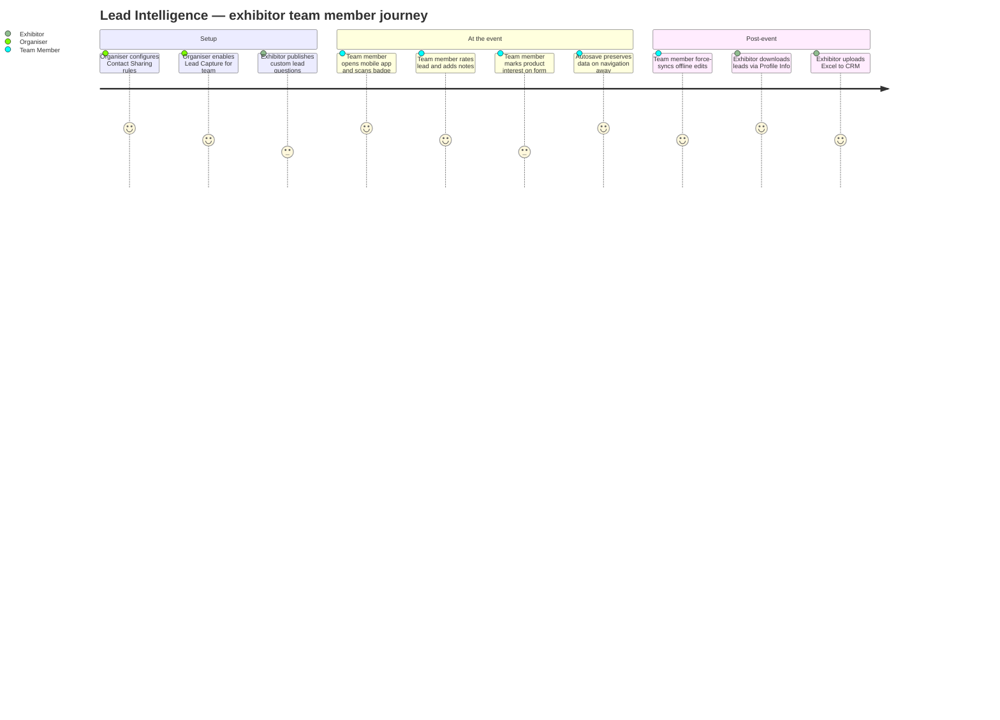
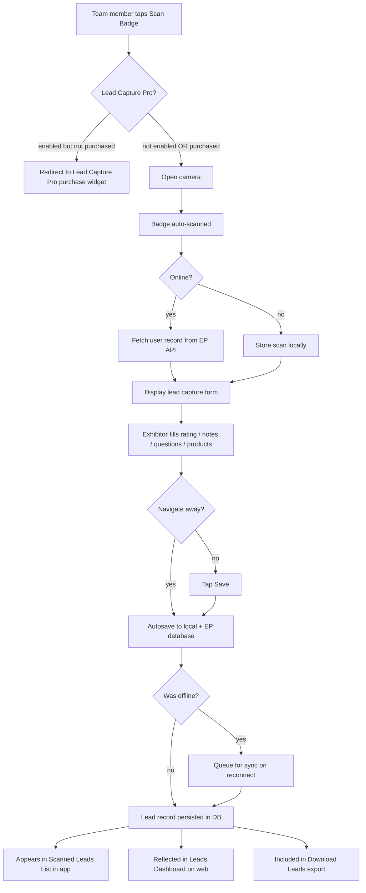
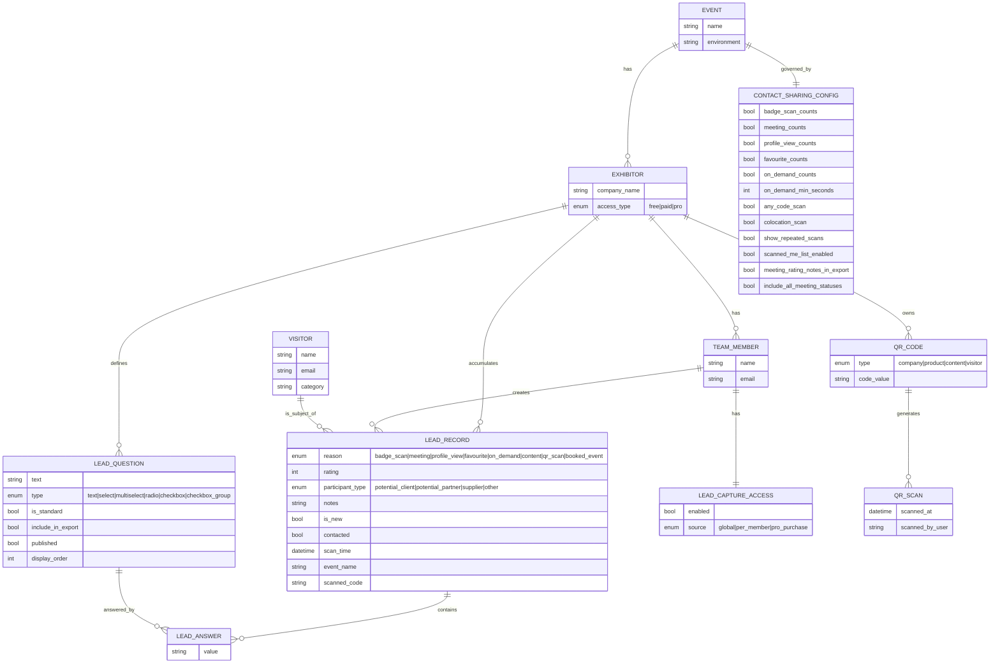
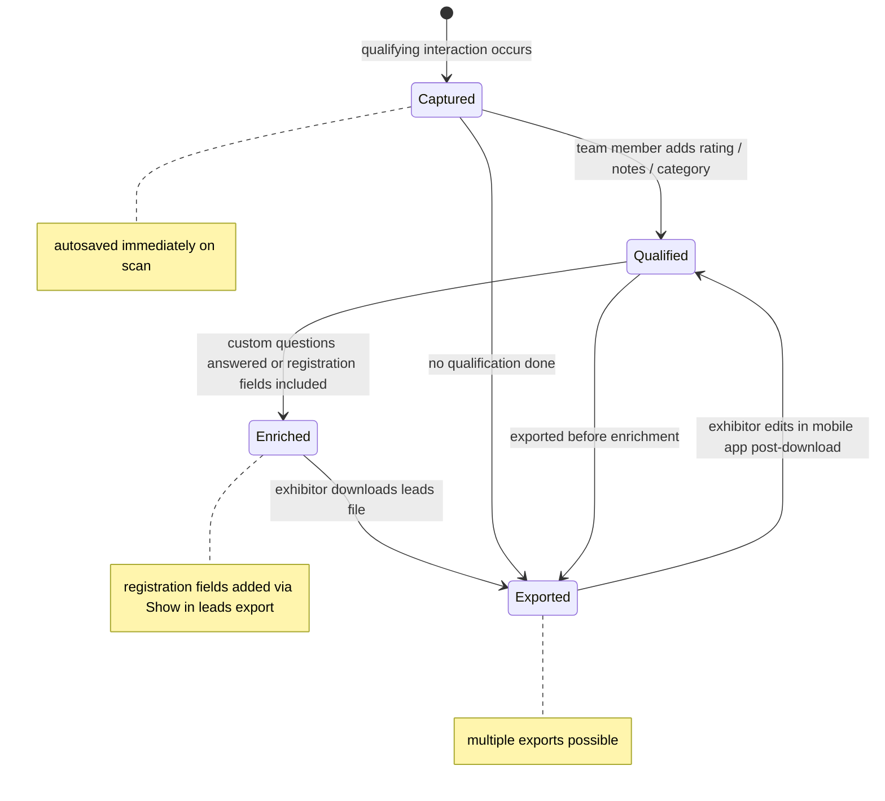
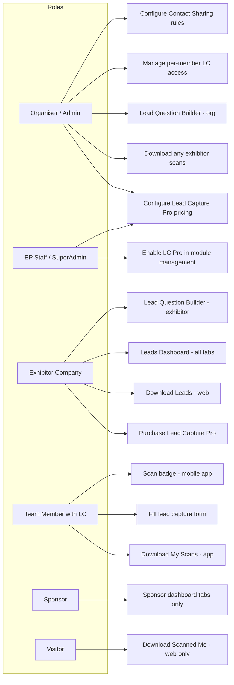

## 1. Product Overview

**Purpose.** Lead Intelligence is ExpoPlatform's end-to-end lead management layer for events. It governs what interactions count as leads, who may capture them, how leads are qualified at the point of scan, and how all lead data is exported and analysed after the event.

**Problem being solved.** Exhibitors attend events to generate sales-pipeline contacts. Without a structured system they lose leads to paper notes, fail to qualify them at the point of contact, and cannot report ROI to their management. Organisers, in turn, need to offer lead capture as a differentiating service — either free or as a paid add-on — while retaining full control over what data is shared and which exhibitors receive which capabilities.

**Business value.**
- Exhibitors capture, qualify, and export every meaningful visitor interaction from a single mobile app or web interface.
- Organisers monetise lead capture as a configurable free or paid feature, including the Lead Capture Pro paid self-service purchase flow.
- Event ROI is measurable: leads dashboard, scanned leads list, and downloadable Excel exports close the feedback loop between event activity and sales follow-up.
- Data integrity is protected by organiser-controlled privacy settings (hide private info per action type) and the autosave mechanism that prevents data loss in poor-connectivity environments.

**Target users.**
- *Organiser / admin* — configures lead capture rules, access, question builders, and exports.
- *Exhibitor company account* — reviews aggregated lead dashboard, manages questions, downloads lead file.
- *Exhibitor team member* — scans badges on the mobile app, fills lead capture forms, rates and qualifies leads.
- *Sponsor* — accesses sponsor-specific interaction tabs (banner stats, exhibitor/product list interactions, pop-up interactions).
- *Visitor / attendee* — generates leads by interacting with exhibitor profiles; can download their own Scanned Me list.
- *ExpoPlatform staff* — enables Lead Capture Pro, configures Stripe payments, sets up backend module management.

**User personas.**
- *Head of Exhibitor Relations* — sets Contact Sharing rules, decides free vs. paid, monitors purchase list.
- *Exhibitor Sales Rep (team member)* — scans 50–200 badges per day at a busy stand, rates each lead 1–5 stars, adds a one-line note, reviews the list offline on the flight home.
- *Exhibitor Marketing Manager* — designs custom lead questions, reviews dashboard post-event, downloads Excel for CRM upload.
- *Sponsor Marketing Director* — monitors banner click stats and pop-up engagement without needing the badge scan capability.
- *IT/Data Analyst* — validates export schema, cross-references custom registration fields in the leads file.

**Success metrics.**
- Lead capture adoption rate (% of exhibitors with lead capture enabled who actively scan).
- Leads captured per exhibitor per event.
- Export completion rate (exhibitors who download leads before 7 days post-event).
- Lead Capture Pro purchase conversion rate.
- Data loss incidents (target zero, addressed by autosave + offline sync).

## 2. Product Scope

### Included
- **Basic organiser configuration** — defining which interactions count as leads (meetings, profile views, favourites, on-demand sessions, QR scans, content downloads, booked events); private-data visibility rules; scanning behaviour settings.
- **Lead Capture Access Management** — free vs. paid lead capture; per-team-member access toggles; Exhibitor Manual (Per Exhibitor / Per Team Member) and Lead Capture Pro purchase flows.
- **Lead Question Builder (Organiser)** — creating, editing, and removing standard questions in the admin panel; enabling/disabling additional (custom) questions per exhibitor or per category.
- **Lead Question Builder (Exhibitors)** — enabling/disabling standard questions; creating, ordering, and publishing additional questions from the exhibitor profile.
- **Leads Dashboard** — web-based interaction overview for exhibitors and sponsors; tabs for interactions, sponsor pop-ups, banner stats, product list, QR scans.
- **Lead Scanning** — badge scanning via the mobile app; lead capture page (rating, category, questions, notes, products); autosave; offline resilience; co-located event scanning; allow-any-code scanning.
- **Non-badge QR Codes** — exhibitor company, product, and content QR codes; visitor personal QR codes; deep-link scanning (in-app and external scanner); access control on scan.
- **Leads Export** — exhibitor leads download (web and mobile app); Scanned Me download; organiser-triggered download; export file schema including custom lead question columns, registration pipeline custom fields, deduplication rules.
- **Lead Capture Pro** — paid self-service purchase flow for exhibitors via Stripe; base package + add-ons (custom questions, product QR codes); automatic mobile app scan button activation on purchase; automatic redirect for unpurchased exhibitors.

### Excluded
- Session check-in analytics (covered by Onsite & Check-in product).
- Meeting scheduling engine (covered by Meetings & Matchmaking product).
- Registration pipeline and badge printing (covered by Registration & Onsite product).
- Billing and invoicing outside Stripe-managed Lead Capture Pro transactions.
- Attendee-facing networking features not tied to lead capture (covered by Networking & Engagement product).
- Raw CRM integrations beyond the Excel export (custom integrations are per-client professional services work).

## 3. User Roles

| Role | Access in Lead Intelligence | Restrictions |
| --- | --- | --- |
| **Organiser / Admin** | Full configuration: Contact Sharing rules, access management, question builders, module management toggles, Lead Capture Pro pricing setup, download all exhibitor scans | Cannot purchase Lead Capture Pro as an exhibitor; manages pricing but does not pay |
| **ExpoPlatform Staff (SuperAdmin)** | Enable Lead Capture Pro in backend + global module management; configure Stripe payment details, taxes, invoicing | Restricted to backend module management; commercial agreements handled outside the platform |
| **Exhibitor (company account)** | Leads dashboard (all tabs), Lead Questions configuration, Download Leads, Scanned Me download, Lead Capture Pro purchase | Cannot view other exhibitors' leads; Lead Capture Pro purchase must be completed before scan access is granted |
| **Exhibitor Team Member** | Badge scanning via mobile app, lead capture form (rating/notes/questions), Scanned Leads list, Download My Scans (if Lead Capture enabled) | Access to lead capture controlled per-member by organiser or exhibitor; visitors/unenabled members cannot use advanced features |
| **Sponsor** | Sponsor-specific dashboard tabs: Pop-Up Interactions, Banner Statistics, Exhibitor List Interactions, Product List Interactions | Badge scanning not available to sponsors unless they are also registered as exhibitors |
| **Visitor / Attendee** | Download own Leads file (web only); Download Scanned Me (web only); personal QR code deep link; badge scan by visitor profile (basic save, no notes/rating) | Cannot download leads from mobile app; cannot rate or add notes when scanning; no access to exhibitor dashboard |
| **Speaker** | Same as visitor for lead interactions | No dedicated lead capture capability |
| **Super Admin (platform owner)** | All organiser + staff capabilities; global module management for client entitlements | Client-level controls via Client Manager product, not Lead Intelligence UI directly |

## 4. Feature Inventory

#### Basic Configuration for Organisers

**Description.** The Contact Sharing settings page (`Networking & Matchmaking → Contact Sharing`) is the master control panel for what counts as a lead and what data is shared.
**Why it exists.** Different events have different commercial models — some want leads from every profile view; others only from confirmed meetings. A granular toggle set gives organisers precise control.
**User value.** Organisers build a lead logic that matches their exhibitors' expectations, reducing post-event disputes about what appears in the leads file.
**Functional logic.** Each interaction type has an on/off toggle. Badge scans are always leads (no toggle required). Additional toggles control the meeting-status inclusion, on-demand watch-time threshold, and whether meeting rating notes are exported.
**Preconditions.** Organiser has admin panel access; event exists and is in a configurable state.
**Trigger conditions.** Organiser navigates to Networking & Matchmaking → Contact Sharing and changes toggles.
**Processing logic.** Settings are stored at event level and read by the lead generation engine each time a qualifying interaction occurs. Changes take effect for future lead events; historical leads are not retroactively re-evaluated.
**Outputs.** Lead records written per qualifying interaction; leads file export schema shaped by data-sharing toggles.
**What counts as a lead (toggleable).** Had a meeting; Favorited profile; Viewed profile; Favorited product; Favorited session; Watch On-demand/Online sponsored session; Downloaded/Previewed Content; Scanned QR Code (Visitor/Exhibitor/Product Content); Booked an exhibitor event.
**What counts as a lead (always on).** Badge scans — leads by default regardless of QR scan toggle state.
**Data sharing settings.** Hide Private Info for All Contacts; Hide private info per action type (meetings, favourited, viewed, on-demand, favourited product, favourited session, booked event); Include All Meeting Statuses (Pending, Confirmed, Incoming, Cancelled); On-Demand Lead Generation Time (seconds); Meeting Rating Notes toggle (off by default).
**Scanning settings.** Enable Scanned Me List; Show Exhibitor Logo in scan lists; Show Category/Role in scan lists; Allow co-located event scanning; Allow any code scan; Show repeated badge scans.
**Validation rules.** "Include All Meeting Statuses" is only visible when "Had a meeting" is on. If both are on, all meeting statuses count.
**Permissions.** Organiser/Admin only.
**Error handling.** None of the changes affect leads generated before the change. Enable "Show Repeated Badge Scans" to reconcile discrepancies in badge scan counts.
**Edge cases.** Visitor QR code is independent of badge QR code. Badge scans include co-located event scans regardless of the Visitor QR Code toggle. Private info can be hidden globally OR per action type but not both simultaneously in a layered way.

#### Lead Capture Access Management

**Description.** Controls which exhibitors and team members can use lead capture, and whether it is a free or paid feature.
**Why it exists.** Organisers may want to offer lead capture as a premium differentiator, restrict it to certain exhibitor tiers, or enable it universally for simpler events.
**Functional logic.** Two pathways: (1) Exhibitor Manual → Global Settings → Lead Capture → "Enable for all (free)" grants access to all exhibitors and team members immediately. (2) With the global toggle off, access is controlled per-team-member via Admin Panel → Exhibitor Profile → Team Members tab. The Exhibitor Manual also supports Per Exhibitor (one price, all members) and Per Team Member (price per selected member) purchase models.
**Preconditions.** Module Management must have Lead Capture enabled.
**Outputs.** Team members gain or lose access to the scan button and lead capture form in the mobile app.
**Permissions.** Organiser/Admin controls the global toggle and per-member toggles. Exhibitors can purchase through Lead Capture Pro or Exhibitor Manual flows.
**Edge cases.** If scanning is used without lead capture, the Download button is not available to exhibitors. Visitors scanning badges get a basic save but never have lead capture form access.

#### Lead Question Builder for Organiser

**Description.** Lets organisers create, edit, and remove standard questions that all exhibitors see on their lead capture forms, and enables or disables the additional-questions capability.
**Why it exists.** Standard qualification questions (budget, purchase timeline, decision-maker status) are valuable for every exhibitor; organisers save exhibitors setup effort by providing a common baseline.
**Functional logic.** Activate via Module Management → Exhibitor → Custom Lead Questions. Then navigate to Registration Settings → Exhibitors → Custom Lead Questions tab. Enable "Use Standard Questions for Lead Capture" to activate the form builder. Field types: text, radio, checkbox, date, select. Enable "Use Additional Questions for Lead Capture" to let exhibitors create their own. Category-level limits cap how many standard and additional questions an exhibitor can use.
**Processing logic.** Organiser changes propagate to all exhibitors using those standard questions after the next sync. Question edits update both the mobile app and the downloaded leads file. Deleted questions are removed from both.
**Outputs.** Questions appear on the lead capture form in the mobile app after a badge scan. Answers appear as columns in the leads export.
**Permissions.** Organiser/Admin. Permission for exhibitors to add custom questions is configurable per category or per individual exhibitor.
**Edge cases.** Question count limits are set at category level, not just globally; an exhibitor in a category with a limit of 3 cannot exceed 3 standard questions even if more are enabled globally.

#### Lead Question Builder for Exhibitors

**Description.** Exhibitors manage which standard questions they use and create their own additional questions.
**Why it exists.** Every exhibitor has different qualification criteria; giving them control over additional questions makes lead capture significantly more actionable.
**Functional logic.** Access via Admin Panel → Exhibitor Profile → Actions → Lead Questions, or Web → Profile Info → Lead Questions (requires MM toggle). Standard Questions section: toggle individual standard questions on/off; cannot edit content. Additional Questions section: click Add Question → enter text → select type (Text Field, Select, Multiselect, Radio Group, Checkbox, Checkbox Group) → add options → Save. Summary panel on right shows all active questions with drag-and-drop ordering. Must click Publish for changes to go live in the mobile app.
**Processing logic.** Newly added questions are labelled "New" until published. Edits to labels propagate to app and leads file. Removed questions are removed from both.
**Outputs.** Custom question answers appear as columns in the leads export file if "Include in lead export file" is enabled.
**Permissions.** Exhibitor (company or admin). Permission to add additional questions is granted by organiser.
**Edge cases.** Unpublished questions are invisible in the mobile app. Question order in the Summary panel controls the order in the lead capture form.

#### Leads Dashboard

**Description.** A web-based analytics dashboard giving exhibitors and sponsors a real-time view of all lead interactions.
**Why it exists.** Exhibitors need to see who interacted with them and in what way to prioritise follow-up without waiting for an end-of-event export.
**Functional logic.** Multiple tabs, each targeted at a specific audience and interaction type.
**Tabs.** (1) Interactions — available to exhibitors; shows interactions by company profile and team members; filterable by All/Company/individual team member. (2) Sponsors Pop-Up Interactions — sponsors only; tracks requested meeting, initiated conversation, favourited profile, closed pop-up from sponsor pop-up widget. (3) Banner Statistics — sponsors only; tracks banner clicks per placement (web pages and app sections). (4) Exhibitor List Interactions — sponsors only; tracks interactions from exhibitor/product list sponsor cards. (5) Product List Interactions — sponsors only. (6) QR Scans — exhibitors; company scans (last 10 chronological), product/content (prioritised by count then date).
**Table display rules.** No sorting by name. Horizontal scroll when columns exceed width. Profile picture placeholder if no image. Total interactions per column shown above the board. Tooltips on hover: date/time of each interaction; if one cell takes 2 rows, max 5 tooltip cells; 1 row = max 10 cells.
**Interactions/All metrics.** Profile Views (order by count then date), Products Views, Content Views, Content Downloads, Profile Favourited, Products Favourited, Scanned badges (chronological; same member scanned twice = 2 cells), Confirmed Meetings (date of confirmation; group meetings per participant), Chats (1-on-1 and group; sorted by initiation time).
**Interactions/Member metrics.** Checkmark for one-time events (Profile Favourited, Scanned Badges, Chats); numerical for multi-occurrence (Profile Views, Confirmed Meetings).
**Preconditions.** Lead Capture enabled; exhibitor/sponsor has interacted with visitors at the event.
**Permissions.** Exhibitors see all tabs except sponsor-specific ones. Sponsors see sponsor tabs plus QR Scans. Organiser sees everything via admin.
**Edge cases.** If a profile is favourited then unfavourited, the count decreases by 1. Pinned interactions header stays visible during scroll (EP-21795).

#### Lead Scanning (Badge Scanning via Mobile App)

**Description.** The core scanning flow: an exhibitor team member opens the app, taps Scan Badge, points the camera at an attendee's badge, and the lead is captured.
**Why it exists.** The mobile app with in-built scanner eliminates the need for third-party scanning hardware and ensures every lead is immediately persisted to the platform database.
**Functional logic.** After camera opens, badge auto-scans. The lead capture page opens: Rating (1–5 stars), Participant Type (Potential Client / Potential Partner / Supplier / Other), Questions (Client Type old/new, Contacted yes/no), Notes, Products list. All data autosaves on navigation away. If offline, data saved locally and synced on reconnect.
**Preconditions.** Lead Capture enabled for the team member (either globally or per-member). Camera permission granted.
**Trigger conditions.** Team member taps Scan Badge in the mobile app.
**Processing logic.** Badge QR decoded → user record fetched from EP database → contact info populated → lead screen displayed → exhibitor fills form → data written to lead record on Save or autosave. Lead editable after the initial scan.
**Outputs.** Lead record in the platform database. Scanned Badges list updated in the mobile app.
**Dependencies.** Mobile app scanner; EP backend API; lead capture permission; internet connection (deferred to local store if offline).
**Validation rules.** Badge must be from the same event (or from a co-located event if that setting is enabled). Team members without Lead Capture enabled cannot see the badge scan option.
**Permissions.** Exhibitor team members with Lead Capture enabled. Visitors can scan badges (basic save only, no rating/notes).
**Error handling.** Offline scan: "Unable to verify scan. Your application was offline during the scan." — data saved locally. Non-event badge: "User not found in event database." Lead Capture Pro enabled but not purchased: automatic redirect to purchase widget.
**Edge cases.** Autosave (EP: 1855782913) — form saves even on unintentional navigation. Force sync (EP-23400) — exhibitors can force-sync their scan list to reconcile offline notes edited without connectivity.

#### Co-located Scanning

**Description.** Allows scanning of badges from other events within the same ExpoPlatform backend environment.
**Why it exists.** Large event groups run multiple co-located shows; attendees often move between halls. Co-located scanning enables cross-show lead capture without separate apps or hardware.
**Functional logic.** Setting: Contact Sharing → "Allow users to scan badges from colocated events". App checks local DB first; if not found queries server. Returns basic info (name, job title, company, photo, location) for cross-event badge. Scan appears in list with "Other Event" ribbon.
**Outputs.** Lead record with Event Name column populated with originating event name. "Event Name" column added to Exhibitors and Visitors Scanned Reports.
**Permissions.** Organiser toggles; exhibitor team members use it automatically once enabled.
**Edge cases.** If co-located scanning is off, cross-event badge shows "not found" (or Allow Any Code Scan result if that feature is on).

#### Allow Any Code Scan

**Description.** Allows the mobile app to scan any QR or barcode, not just EP-registered badges.
**Why it exists.** Exhibitors attending multi-platform events may encounter attendees with non-EP badges; this feature prevents dead-end scans and preserves whatever data is available.
**Functional logic.** Setting: Contact Sharing → "Allow users to scan any codes". Recognized code → full account data. Unrecognized code → "Code successfully scanned" in scan list; popup shows raw code value.
**Outputs.** "Scanned Code" column in export reports and lead files. Unrecognized code: only code + timestamp in report; all other fields blank.
**Permissions.** Organiser toggles; all users scanning benefit automatically.

#### Non-Badge QR Codes (Company, Product, Content, Visitor)

**Description.** Platform-generated QR codes for exhibitor companies, products, marketing content, and visitor profiles. These are independent of badge QR codes.
**Why it exists.** Physical signage, product galleries, and content walls need QR codes that drive digital engagement. Scanning these is a separate lead-generation channel.
**Types.** Exhibitor Company QR — unique per company, links to company profile; visible in admin and frontend; exportable via Exhibitor Export; scans appear in Dashboard QR Scans tab and QR Scan report Exhibitors tab, NOT in Scanned Me. Exhibitor Product QR — unique per product, links to product page; in Product Export; in QR Scan report Product tab. Exhibitor Content QR — unique per content piece, prompts content download; in Content Export; in QR Scan report Content tab. Visitor Personal QR — unique per registrant, links to visitor profile; in Visitor Export.
**Functional logic.** Enable QR codes: Admin Panel → General → Settings → QR Codes (remember to click Save). For deep links in the mobile app, also configure Application Universal Links. External scanner: if app installed → opens in app; if not → opens on web. Access control: restricted pages prompt login; after login, permissions validated. Internal app scanner: immediate navigation to linked page.
**Processing logic.** Works correctly for future events only; past events are not synced.
**Permissions.** Organiser enables; exhibitors can download their own content QR codes from the Content tab; visitors access their personal QR from Profile → Settings.
**Edge cases.** If QR codes are disabled, the export button is hidden. Non-badge QR scans do NOT appear in the exhibitor's Scanned Me or Who Scanned Me.

#### Lead Capture Pro

**Description.** A paid self-service module that allows exhibitors to purchase lead capture, custom questions, and product QR codes directly from their exhibitor profile, with payments processed by ExpoPlatform via Stripe.
**Why it exists.** Moving the purchase out of the Exhibitor Manual creates a frictionless, exhibitor-initiated purchase path and gives ExpoPlatform direct revenue management from lead capture upsells.
**Functional logic.** Enable in backend module management (global + event level). A new Lead Capture Pro page appears under Event Setup for organiser/staff to configure: base package price, custom questions add-on price, product QR codes add-on price. Currency, billing details, taxes, and Stripe integration are configured in Payment Settings. Exhibitors purchase from their profile page or direct URL (`/newfront/lead-capture-pro`): add to basket → complete Stripe payment → access granted automatically. Upon purchase, scan button enabled in mobile app; profile info menu updated with custom questions and/or product QR code options. Automatic redirect: exhibitor tapping Scan Badge without a purchase is redirected to the purchase widget.
**Outputs.** Exhibitor gets scan access and any purchased add-ons. Stripe receipt auto-sent to purchaser. Invoice auto-generated (ExpoPlatform branding). Organiser sees purchase list in admin.
**Dependencies.** Stripe (enabled automatically when Lead Capture Pro is on). Backend + event-level module management.
**Permissions.** Staff configures; exhibitors purchase; organiser can manually toggle per-team-member access in Admin Panel → Exhibitor Profile → Team Members after purchase. Visitors/buyers/participants are never redirected to the purchase flow.
**Edge cases.** Other user roles (participants, buyers) always see the Scan Badges page without redirect. When Lead Capture Pro is globally disabled, no redirect logic applies. Individual team member access can be adjusted post-purchase via admin toggle.

#### Leads Export

**Description.** Exhibitors and visitors download their leads as an Excel (.xlsx) file; organisers can pull any exhibitor's scanned badges from the admin panel.
**Why it exists.** The in-platform dashboard is useful live, but CRM upload and sales-team distribution require a downloadable, structured file.
**Functional logic.** Enable: Module Management → Exhibitors → "Download Leads" toggle ON; also activate at exhibitor category or exhibitor profile level. Exhibitor web: Profile Info → Download Leads → Excel emailed to exhibitor (includes team member leads). Mobile app: Scans page → download button → emailed to exhibitor. If scanning without lead capture, download button is not available. Scanned Me download: every user (web), or team members/exhibitors (mobile app Scans page → Download My Scans). Organiser: Admin Panel → Exhibitor Profile → Actions → Download Scanned Badges.
**Export file schema (common columns).** Name, Surname, Email, Company, Position, Phone, Country, State/Region, City, Address, PostCode, Event name, Scanned Code, Rating, Products, Time, Reason, *Category, *Notes, *Is New, *Contacted, Meeting Rating Notes (if toggle on), Total Watched Time.
**Export file schema (exhibitor-only columns).** Exhibitor Event Date, Exhibitor Event Time (from), Exhibitor Event Time (to), Lead owner.
**Custom question columns.** Appear if "Include in lead export file" is enabled on the question. Unique per exhibitor.
**Registration custom field columns.** Appear if "Show in leads export" is checked on the registration field.
**Deduplication.** Only the first occurrence of a repeated action is counted. Exceptions: favourited sessions and booked events each get a row per occurrence (to record which session/event). As of May 2026: meeting appointments generate a single lead entry regardless of how many exhibitor team members are included — no duplicate leads from group meetings.
**Event cloning.** Interaction info stays in the original event; the cloned event starts fresh.
**Permissions.** Exhibitors download own leads. Visitors download own Scanned Me (web only). Organiser downloads any exhibitor's scanned badges. Team members download own scans if Lead Capture enabled.
**Edge cases.** *-starred columns (Category, Notes, Is New, Contacted) are editable only by Lead Capture-enabled team members but always present in the file. Last-edited values from the mobile app are used (EP-23400 force sync applies here). Scanned Me file data is sensitive to Contact Sharing settings.

## 5. User Stories Mapping

| Story ID | Title | Summary | Acceptance criteria | Related feature | Status |
| --- | --- | --- | --- | --- | --- |
| EP-1080 | Exhibitor Manuals Lead Capture page (New UI) | New UI for the exhibitor lead capture page on the frontend | Lead capture page renders in new UI; team members can rate/note leads; visitors get basic save only | Lead Scanning — Lead Capture Page | COMPLETE |
| EP-11114 | EMEA Custom Questions stage 2 — Additional questions | Extend additional questions to support select, multiselect, radio group, checkbox group, checkbox types | All 6 field types available in Additional Questions form builder; selections appear in leads file | Lead Question Builder for Exhibitors | COMPLETE |
| EP-13663 | Download leads at Category and Individual exhibitor level | Toggle download leads on/off per exhibitor category and per individual exhibitor | Download leads toggle visible at category level and individual profile; changes apply only to affected exhibitors, not all | Leads Export — access control | COMPLETE |
| EP-21795 | Pinning interactions header in Visitor and Exhibitor Dashboards | Keep interactions table header visible when scrolling through large lead lists | Table header stays pinned when pagination set to 50 items and user scrolls | Leads Dashboard | COMPLETE |
| EP-22713 | Download leads improvements | Move lead download initiation to reduce platform load; introduce async file generation | Download leads uses same async file-generation pattern as admin panel exports; distributes load | Leads Export | COMPLETE |
| EP-23400 | Force scanned list sync | Allow exhibitors to force-sync scans list with database after offline editing | Force sync option available on scans list; offline notes and edits reflected in leads file after sync | Lead Scanning — offline/autosave | COMPLETE |
| EP-23831 | Check-in Analytics refresh (Epic) | Refresh Check-in Analytics and Check-in Zones pages in admin panel | New analytics page with check-in/out bar charts; hourly segmentation; Check-in Zones tab redesigned | Reporting & Analytics (check-in) | COMPLETE |
| EP-23957 | Standard Report generation | Add Standard Report generation to /admin/data page | Standard Report option on /admin/data; generates DS-prepared file; available for download | Reporting & Analytics | COMPLETE |
| EP-24160 | Leads Export: Exhibitor Event Date/Time | Add date/time of exhibitor event occurrence to leads export | Exhibitor Event Date, Exhibitor Event Time (from), Exhibitor Event Time (to) columns present in exhibitor leads file | Leads Export schema | COMPLETE |
| EP-24161 | Inclusion of Meeting Rating Notes in Leads Export | Include meeting rating notes column in leads export when toggle is on | Meeting Rating Notes column appears in export when toggle on; absent when toggle off | Leads Export schema / Basic Config | COMPLETE |
| EP-24652 | Check-in Analytics refresh — Analytics page | New analytics page for check-ins and check-outs with scalable bar charts | Bar chart scales dynamically based on data volume; hourly segmentation logic matches EP-20705 | Reporting & Analytics | COMPLETE |
| EP-24653 | Check-in Analytics refresh — Check-in list page | Redesigned check-in list page | List page matches new UI Figma spec; pagination and filters functional | Reporting & Analytics | COMPLETE |
| EP-24654 | Check-in Analytics refresh — Check-in Zones page | Redesigned check-in zones page | Zones page matches new UI Figma spec; zone assignment and custom zone creation intact | Reporting & Analytics | COMPLETE |
| EP-38698 | Download leads and Scanned Me lists refactor (Epic) | Refactor of download leads and scanned me list architecture | Refactored implementation; improved performance and reliability | Leads Export — architecture | In Progress |
| EP-48016 | AI Search Service tools (Epic) | AI-powered search tooling for platform | AI search service integrated for tools context | Platform / search integration | COMPLETE |
| EP-50122 | Lead Capture Pro settings (Epic) | Lead Capture Pro settings pages and purchase flow | Lead Capture Pro settings configurable; purchase flow end-to-end; Stripe enabled automatically | Lead Capture Pro | In Progress |

## 6. End-to-End Workflows

### User journey — exhibitor team member capturing and exporting leads

### System workflow — badge scan to lead record

### Happy path
Organiser enables lead capture globally (free). Team member opens the mobile app during the event, taps Scan Badge, points camera at an attendee's badge, badge auto-scans. Lead Capture form displays with the exhibitor's published standard and custom questions. Team member assigns 4-star rating, selects "Potential Client", ticks a product interest, adds a one-line note, and navigates back — autosave fires. At end of event, exhibitor logs in to the web frontend, selects Profile Info → Download Leads, receives an Excel via email. File includes all team member scans, custom question answers, meeting entries (if meeting lead toggle is on), and timestamps.

### Alternate paths
- Organiser has Lead Capture Pro enabled: exhibitor purchases from profile → scan button unlocked → same flow from badge scan step.
- Team member is offline (on the show floor): scan is stored locally. After reconnecting, team member taps Force Sync (EP-23400) → offline notes and edits appear in the leads file.
- Non-badge QR code scanned: company/product/content QR → user navigated to profile/product/content page; scan logged in QR Scans tab on dashboard, not in Scanned Me.
- Co-located event badge: scan resolves across EP environment; appears with "Other Event" ribbon; Event Name column populated in export.
- Allow Any Code scan: unrecognised barcode → "Code successfully scanned" + code value only in export.

### Exception paths
- Lead Capture Pro enabled but exhibitor has not purchased: automatic redirect to purchase widget on tapping Scan Badge.
- Scan of badge from non-EP source with Allow Any Code off: scan fails with no record.
- Export attempted without "Download Leads" toggle on at category or profile level: download button absent.
- Scan after event ends on a cloned event: cloned event has no interactions; original event's leads remain in original only.

### Recovery paths
- Lost offline data: force sync (EP-23400) recovers notes edited during disconnection.
- Download leads button missing: organiser checks Module Management → Exhibitors → Download Leads toggle + exhibitor category/profile level toggle.
- Lead counts appear inflated (meeting duplicates): check "Show Repeated Badge Scans" toggle; as of May 2026 meeting deduplication fix applies.
- Custom question answers not in export: ensure "Include in lead export file" is checked on each question.

## 7. Business Rules Engine

| # | Rule | Condition | Exception / Priority | Conflict resolution |
| --- | --- | --- | --- | --- |
| BR-1 | Badge scans are always leads | Any badge scan by an enabled team member | No toggle required; unaffected by QR scan toggles | Badge scan data always in leads file even if all toggles off |
| BR-2 | Lead Capture Pro redirect | LC Pro enabled at event level + exhibitor company has not purchased | Applies only to exhibitors; participants/buyers never redirected | LC Pro off globally → no redirect; standard App Builder visibility rules apply |
| BR-3 | Private info hidden per rule hierarchy | "Hide private info for all" overrides per-action-type settings | Per-action settings are subordinate to global hide | Global hide = highest priority |
| BR-4 | "Include all meeting statuses" only visible when "Had a meeting" is on | If "Had a meeting" off, sub-toggle hidden and treated as off | — | Had a meeting = false forces all meeting leads excluded |
| BR-5 | On-demand view must meet minimum watch time | On-demand lead toggle on | Watch time in seconds set by organiser | If user exits before threshold, no lead generated |
| BR-6 | Only first qualifying interaction per action type is counted in the export | Deduplication rule | Exceptions: favourited sessions (per session) and booked events (per event) | Each exception gets its own row |
| BR-7 | Meeting appointments generate one lead entry regardless of team member count | As of May 2026 deduplication fix | — | Duplicate team-member additions no longer inflate lead count |
| BR-8 | Custom question column appears in export only if "Include in lead export file" is enabled | Per question toggle | — | Disabled = column absent; enabled = column present (empty if unanswered) |
| BR-9 | Category-level question limits cap standard + additional question counts | Organiser sets per-category limits | Individual exhibitor limit can be more restrictive than category | Most restrictive limit wins |
| BR-10 | Allow Any Code scan — unrecognised badge → only code + timestamp recorded | Allow Any Code toggle on | — | No other fields populated for unrecognised codes |
| BR-11 | Visitor download leads is web only | Visitors cannot download leads from mobile app | — | Team members/exhibitors can download from both web and mobile app |
| BR-12 | Cloned event starts with zero leads | Interaction data stays in original event on clone | — | Exhibitors in cloned event must generate new interactions |
| BR-13 | Non-badge QR scans do NOT appear in Scanned Me | Company/product/content QR scans visible on Dashboard QR Scans tab only | — | Scanned Me list is badge-scan only |
| BR-14 | Lead Capture Pro — base package grants all team members access | All team members receive access on purchase | Organiser can manually restrict per-team-member post-purchase | Admin toggle overrides package default |

## 8. Data Model

**Inputs.** Badge scan events, interaction events (meetings, views, favourites, on-demand), QR scan events, lead form submissions (rating, notes, category, questions), contact sharing configuration, lead question definitions.
**Outputs.** Lead records in the EP database; leads dashboard; leads export file (Excel .xlsx); Scanned Me file; QR Scan reports.
**Lifecycle states of a lead record.** `captured` → `qualified` (rating/notes/questions added) → `enriched` (registration pipeline custom fields populated) → `exported` (included in downloaded leads file).
**Lifecycle states of a lead question.** `draft` (added but not published) → `published` (visible in mobile app and dashboard) → `archived` (removed; absent from future scans and exports).

### Lead lifecycle state diagram

## 9. Permissions Matrix

| Capability | Organiser | EP Staff | Exhibitor | Team Member (LC on) | Sponsor | Visitor |
| --- | --- | --- | --- | --- | --- | --- |
| Configure Contact Sharing rules | ✅ | ❌ | ❌ | ❌ | ❌ | ❌ |
| Enable/disable per-member lead capture | ✅ | ❌ | ❌ | ❌ | ❌ | ❌ |
| Lead Question Builder (organiser) | ✅ | ❌ | ❌ | ❌ | ❌ | ❌ |
| Lead Question Builder (exhibitor) | ✅ (via admin) | ❌ | ✅ | ❌ | ❌ | ❌ |
| Lead Capture Pro settings and pricing | ✅ (via EP) | ✅ | ❌ | ❌ | ❌ | ❌ |
| Purchase Lead Capture Pro | ❌ | ❌ | ✅ | ❌ | ❌ | ❌ |
| Badge scanning via mobile app | ❌ | ❌ | ❌ | ✅ | ❌ | Basic only |
| Fill lead capture form (rating/notes) | ❌ | ❌ | ❌ | ✅ | ❌ | ❌ |
| View Leads Dashboard | ✅ | ❌ | ✅ (all exhibitor tabs) | ❌ | ✅ (sponsor tabs) | ❌ |
| Download Leads (web) | ✅ (admin action) | ❌ | ✅ | ❌ | ❌ | ❌ |
| Download My Scans (mobile app) | ❌ | ❌ | ✅ | ✅ | ❌ | ❌ |
| Download Scanned Me (web) | ✅ | ❌ | ✅ | ✅ | ✅ | ✅ |
| View QR Scans tab on dashboard | ❌ | ❌ | ✅ | ❌ | ❌ | ❌ |
| Export QR codes (admin) | ✅ | ✅ | ❌ | ❌ | ❌ | ❌ |

## 10. Integrations

| Integration | Purpose | Trigger | Data exchanged | Failure handling | Retry | Security |
| --- | --- | --- | --- | --- | --- | --- |
| **Mobile App (EP native iOS/Android)** | Badge scanning, lead form, scanned list, offline sync | Team member taps Scan Badge or opens Scans page | Badge QR → user record; lead form data → lead record; lead list sync | Offline: local storage; reconnect → auto-sync or force-sync | Auto on reconnect; manual force sync (EP-23400) | App session auth; camera permission required |
| **EP Backend API** | Resolve badge QR codes; persist lead records; serve dashboard data; serve leads file generation | Every badge scan; every form save; dashboard page load; download trigger | Badge code → user profile; lead record fields; dashboard metrics; export file | Offline: data queued locally | Immediate on reconnect | Authenticated session token |
| **Stripe** | Process Lead Capture Pro purchases by exhibitors | Exhibitor completes purchase on Lead Capture Pro page | Payment details (Stripe-tokenised); receipt email; invoice; purchase confirmation | Payment failure → exhibitor shown Stripe error; access not granted | Exhibitor retries payment | Stripe PCI compliance; Stripe token never stored by EP; HTTPS |
| **Email delivery** | Send leads export file and Scanned Me file to user | Download Leads / Download My Scans action | Excel (.xlsx) attachment | Delivery failure: user re-triggers download | Per download trigger | Email sent to authenticated user's registered email |
| **Data Import/Export (admin)** | Organiser bulk export: Exhibitors Scanned Report, Visitors Scanned Report, QR Scan reports | Organiser navigates to Data → Import/Export | Scanned badge records with Event Name, Scanned Code columns | Standard export error handling | Re-trigger export | Admin panel auth |
| **Registration pipeline** | Include custom registration fields in leads export | "Show in leads export" checkbox on registration field | Registration field values per lead | Field absent if toggle off | Not applicable | Controlled by organiser; same auth context |

> [!INFO] Lead Capture Pro Stripe integration is enabled automatically when Lead Capture Pro is turned on in module management. Manual Stripe configuration (currency, billing details, taxes) is required during initial setup by EP staff.

## 11. Notifications

| Notification | Channel | Trigger | Recipient | Timing | Notes |
| --- | --- | --- | --- | --- | --- |
| **Leads export file** | Email (.xlsx attachment) | Exhibitor or team member triggers Download Leads / Download My Scans | Exhibitor or team member (authenticated user) | On demand; file generated asynchronously (EP-22713) | Sent to registered email; includes all team member leads for exhibitor account |
| **Scanned Me export file** | Email (.xlsx attachment) | User triggers Download Scanned Me | Any user | On demand | Scanned Me tab in email if enabled in Admin Panel |
| **Stripe receipt** | Email | Exhibitor completes Lead Capture Pro purchase | Purchasing exhibitor | Immediately post-payment | Auto-sent by Stripe; copy to EP accounts/finance team |
| **Stripe invoice** | Email (attachment) | Auto-generated on successful Stripe payment | Purchasing exhibitor | On payment confirmation | EP branding; no organiser logo; receipt email template configurable by EP staff |
| **"Unable to verify scan" in-app error** | In-app message | Badge scanned while device offline | Team member scanning | Immediate | Data saved locally; resolves on reconnect |
| **"User not found in event database" in-app error** | In-app message | Badge from different event scanned with co-located scanning disabled | Team member scanning | Immediate | No data saved |
| **"Code successfully scanned" in-app message** | In-app message | Unrecognised QR/barcode scanned with Allow Any Code enabled | Team member scanning | Immediate | Code value stored; no user data |

> [!INFO] Lead Intelligence does not send proactive marketing or nudge notifications. All notifications are either triggered by user action (export) or are system-generated error/confirmation messages.

## 12. Reporting & Analytics

### Leads Dashboard

| Report | Inputs | Metrics | Calculations | Filters | Export |
| --- | --- | --- | --- | --- | --- |
| Interactions / All | Lead records, meeting records, chat records | Profile Views, Products Views, Content Views, Content Downloads, Profile Favourited, Products Favourited, Scanned Badges, Confirmed Meetings, Chats | Count per interaction type per lead; date/time of last action; chronological scan order | Show interactions: All / Company profile / individual team member | None (dashboard view only) |
| Interactions / Member | Same, scoped to one team member | Same metrics at individual member level | Checkmark for one-time events; numerical for multi-occurrence; last 10 chronological for profile views + scanned badges | Team member selector | None |
| Sponsors Pop-Up Interactions | Sponsor pop-up event records | Requested Meeting, Initiated Conversation, Favourited Profile, Closed pop-up | Count + chronological datetime per action | Sponsor selector | None |
| Banner Statistics | Banner click records | Clicks per banner placement; event-wide average | Click count; comparative against average | Auto-filtered to sponsor | None |
| Exhibitor/Product List Interactions | Sponsor card interaction records | Requested Meeting, Initiated Conversation, Favourited Profile, Profile Views | Count + time per action | Auto-filtered to sponsor | None |
| QR Scans | QR scan records | Company scans (last 10), product scans (by count then date), content scans | Volume by QR type; recency ranking | None | None (view only) |

### Download Leads Export

| Report | Inputs | Key columns | Filters | Export format |
| --- | --- | --- | --- | --- |
| Exhibitor Leads File | All qualifying interactions per event config | Name, Email, Company, Position, Reason, Rating, Category, Notes, Contacted, Products, Time, Event Name, Scanned Code, custom question columns, registration field columns | No in-platform filter; all team member leads included | .xlsx via email |
| Exhibitor Leads File (exhibitor-only) | Above + exhibitor event records | + Exhibitor Event Date/Time (from/to), Lead owner | — | .xlsx via email |
| Scanned Me File | Badge scan records where the user's own badge was scanned | Name, contact info per scanner (subject to Contact Sharing privacy settings) | Sensitivity controlled by Contact Sharing | .xlsx via email |
| Exhibitors Scanned Report (admin export) | All exhibitor badge scans | Scan data + Event Name, Scanned Code | By exhibitor or category | .xlsx via admin data export |
| Visitors Scanned Report (admin export) | All visitor badge scans | Scan data + Event Name, Scanned Code | By visitor category | .xlsx via admin data export |
| QR Scan Report (admin) | Non-badge QR scans | Code, scan time, scanner user, entity scanned (exhibitor/product/content/visitor) | Tabs: Exhibitors, Products, Content, Visitors | .xlsx via admin data export |
| Standard Report | DS-prepared aggregated event data | Per event agreement | Admin-triggered | Generated file via /admin/data (EP-23957) |

### Check-in Analytics (related, EP-23831 cluster)

| Report | Inputs | Metrics | Notes |
| --- | --- | --- | --- |
| Check-in Analytics page | Check-in records | Daily check-ins with hourly segmentation; bar charts with dynamic scaling | Refreshed in EP-24652 |
| Check-in List page | Check-in records | Per-attendee check-in list | Redesigned in EP-24653 |
| Check-in Zones page | Zone assignments and check-in events | Check-ins per zone; custom zone creation | Redesigned in EP-24654 |

## 13. Configuration Guide

| Setting | Location in admin panel | Effect | Who can set |
| --- | --- | --- | --- |
| Lead Capture (Custom Lead Questions) module toggle | Module Management → Exhibitor → Custom Lead Questions | Activates the feature across the event; adds Custom Lead Questions tab to Registration Settings | Organiser |
| Lead Questions — Use Standard Questions | Registration Settings → Exhibitors → Custom Lead Questions | Enables standard question form builder for exhibitors to use | Organiser |
| Lead Questions — Use Additional Questions | Registration Settings → Exhibitors → Custom Lead Questions | Allows exhibitors to create their own custom additional questions | Organiser |
| Category-level question limits | Exhibitor category settings | Caps number of standard and additional questions per exhibitor in that category | Organiser |
| Lead Capture toggle (global free) | Exhibitor Manual → Global Settings → Lead Capture → Enable for all (free) | Grants all exhibitors and team members badge scan capability | Organiser |
| Lead Capture per team member | Admin Panel → Exhibitor Profile → Team Members tab | Enables or disables lead capture for an individual team member | Organiser |
| Lead Capture Pro — module enable | Backend module management (global + event level) | Activates Lead Capture Pro purchase flow; adds LC Pro page under Event Setup | EP Staff |
| Lead Capture Pro — pricing | Event Setup → Lead Capture Pro | Sets price of base package, custom questions add-on, product QR codes add-on | Organiser (with EP staff) |
| Download Leads toggle | Module Management → Exhibitors → Download Leads | Enables download leads option for exhibitors | Organiser |
| Download Leads at category level | Exhibitor category settings | Enables/disables download for all exhibitors in the category | Organiser |
| Contact Sharing — what counts as a lead | Networking & Matchmaking → Contact Sharing | All lead trigger toggles (meetings, views, favourites, etc.) | Organiser |
| Contact Sharing — data sharing | Networking & Matchmaking → Contact Sharing | Private info visibility per action type and globally | Organiser |
| Contact Sharing — scanning settings | Networking & Matchmaking → Contact Sharing | Scanned Me list, co-located scanning, any code scan, repeated scans, logo/category in scan list | Organiser |
| QR Codes enable | Admin Panel → General → Settings → QR Codes (then Save) | Enables non-badge QR code generation for companies, products, content, visitors | Organiser |
| Application Universal Links | Admin Panel → General → Settings → Application Universal Links | Enables deep-link scanning into the mobile app for QR codes | Organiser / EP Staff |
| Show in leads export (registration field) | Registration pipeline field settings | Includes registration custom field as a column in the leads export | Organiser |
| Include in lead export file (custom question) | Lead Questions form builder | Includes custom question answers in the leads export file | Exhibitor |
| Meeting Rating Notes toggle | Networking & Matchmaking → Contact Sharing | Adds Meeting Rating Notes column to leads export | Organiser |
| Scanned Me List toggle | Event Setup → Module Management → Scanned Me List | Enables Scanned Me tab in Profile Info on frontend; enables Scanned Me tab in export email | Organiser |
| Show Repeated Badge Scans | Networking & Matchmaking → Contact Sharing | Includes duplicate badge scans in reports | Organiser |

## 14. Edge Cases

**User edge cases.**
- Exhibitor taps Scan Badge but Lead Capture Pro is enabled at the event and the company has not purchased: app redirects to purchase widget automatically. No scan is taken until purchase is complete.
- Visitor scans a badge: basic profile saved, no lead capture form, no notes, no rating. Visitor cannot download leads from mobile app — web only.
- A team member edits lead notes on the mobile app during a flight with no connectivity: notes are saved locally. On landing, if the team member downloaded leads before syncing, the download will not reflect those notes. Force sync (EP-23400) is the recovery action.
- Team member without Lead Capture enabled taps Scan Badge: option is not visible in the app; the scan button is absent.

**Data edge cases.**
- Meeting deduplication (pre-May 2026): meetings with multiple team members generated duplicate lead entries. Post-May 2026 fix: single entry per meeting regardless of team member count.
- Favourited session and booked events: each occurrence creates its own row in the export (exception to the uniqueness rule).
- Cloned event: all interaction data remains in the original event. Exhibitors in the clone start with an empty leads file.
- Custom question edited after leads downloaded: the downloaded file uses the question label at time of export. Re-download will use the new label.
- Registration field marked "Show in leads export" after leads have been downloaded: appears in future downloads but not in already-downloaded files.

**Workflow edge cases.**
- Organiser changes what counts as a lead mid-event: the change affects future interactions only; historical leads are not re-evaluated.
- Organiser deletes a standard question that exhibitors have already used in scans: the question is removed from the mobile app form and from future exports. Previously collected answers are not retroactively removed from historical exports.
- Exhibitor publishes and then removes an additional question: removed from app and from the leads file going forward.
- Download Leads initiated by a team member: the file includes only their own scans, not the whole company's leads (exhibitor account download includes all team members).

**Integration edge cases.**
- Stripe payment fails mid-purchase for Lead Capture Pro: access is not granted; exhibitor must retry. EP accounts/finance team receives no receipt.
- Lead export file generation is async (EP-22713): if the user refreshes or navigates away before the email arrives, no duplicate is generated — the system sends exactly one file per trigger.
- Email delivery fails for leads export: user must re-trigger the download. There is no in-platform file storage for the generated file.

**Permission edge cases.**
- Organiser attempts to buy Lead Capture Pro on behalf of an exhibitor: the system does not support this; an exhibitor account must complete the purchase.
- Team member with Lead Capture enabled from global toggle vs. from per-member toggle: both produce the same access. Revoking the global toggle does not automatically revoke per-member grants (and vice versa).
- Sponsor accessing the Interactions tab: the "Show interactions" dropdown is disabled in Sponsors Pop-Up Interactions context, and sponsor-only tabs are invisible to regular exhibitors.

**Concurrency edge cases.**
- Two team members from the same company scan the same visitor badge simultaneously: two separate lead records are created (different lead owners); the leads file shows both with the respective team member as Lead Owner.
- Organiser edits question limits at category level while exhibitor is setting up questions: if exhibitor exceeds the new limit before saving, the system enforces the limit on Publish and prevents excess questions from going live.
- Multiple exhibitor staff trigger Download Leads simultaneously: each trigger generates and emails a separate file (load improvement addressed in EP-22713 via async generation).

**Event-lifecycle edge cases.**
- Non-badge QR codes set up for a past event: scanning logic works only for future events; past event QR codes are not synced.
- Allow Any Code scan turned on after event has started: affects only scans taken after the setting change; previous unrecognised scans are not retroactively captured.
- Co-located scanning turned off mid-event: future cross-event scans are rejected; existing cross-event lead records already captured remain in the database.

## 15. FAQs

**What is the difference between badge scans and QR code scans as a lead source?**
Badge scans (via the mobile app scanner pointed at an attendee's physical badge) are always leads — there is no toggle to disable them. QR code scans (exhibitor company, product, content, or visitor personal QR codes) are a separate toggleable lead source in Contact Sharing. Non-badge QR scans appear in the Dashboard QR Scans tab and QR Scan report, not in the Scanned Me list.

**Does the organiser or exhibitor control what questions appear on the lead capture form?**
Both. Organisers define standard questions that all exhibitors can enable or disable. If the organiser also enables additional questions, exhibitors can create their own custom question types (text, select, multiselect, radio, checkbox, checkbox group). Organisers set limits on how many questions each exhibitor category can use.

**What happens to leads if the team member's phone is offline during scanning?**
The scan is captured locally and the lead form can be filled in offline. Data syncs to the server as soon as the device reconnects. If the team member downloads leads before syncing, offline-only edits will be missing from that file. The Force Sync feature (EP-23400) allows the team member to manually trigger synchronisation to ensure the latest data is reflected in the export.

**How does Lead Capture Pro differ from enabling lead capture via the Exhibitor Manual?**
Lead Capture Pro is a standalone self-service purchase flow where exhibitors pay via Stripe directly from their profile page. ExpoPlatform manages the payments. The Exhibitor Manual route is organiser-controlled and supports Per Exhibitor or Per Team Member pricing managed by the organiser. Lead Capture Pro bundles custom questions and product QR codes as purchasable add-ons; the Exhibitor Manual route enables these features separately and does not offer a bundled purchase flow for exhibitors.

**Can an organiser prevent specific team members from accessing lead capture even if lead capture is globally enabled?**
Yes. The global "Enable for all (free)" toggle grants access to all team members, but organisers can override this at the individual team member level via Admin Panel → Exhibitor Profile → Team Members tab. When Lead Capture Pro is used, the base package grants all team members access and individual toggles can be adjusted post-purchase.

**Why are some leads missing from the downloaded file?**
Check: (1) the relevant interaction toggle in Contact Sharing is on; (2) "Download Leads" is enabled both in Module Management and at the exhibitor category/profile level; (3) the team member performed a Force Sync if any leads were captured offline; (4) if meeting leads are missing, check whether "Include All Meeting Statuses" is on and whether the meetings are in a status that qualifies.

**How do I see which exhibitors purchased Lead Capture Pro?**
In the admin panel, on the Lead Capture Pro settings page (under Event Setup after Lead Capture Pro is enabled), a list of all exhibitors who have purchased is displayed with purchase details.

**Where do non-badge QR code scans appear?**
They appear in the Networking → Dashboard → QR Scans tab on the exhibitor's frontend profile, and in the QR Scan report under Data → Import/Export in the admin panel (with tabs for Exhibitors, Products, Content, Visitors). They do not appear in the Scanned Me list or in the badge scan lead count.

**What does the Event Name column in the leads export indicate?**
When "Allow users to scan badges from colocated events" is enabled, the Event Name column shows the name of the originating event for each scan. For scans from the current event, the current event name is shown. This helps organisers and exhibitors distinguish cross-show leads in a co-located event environment.

**Can leads be exported if the exhibitor did not use badge scanning — only interaction leads (meetings, profile views, etc.)?**
Yes. The leads file includes all interaction types that the organiser has enabled in Contact Sharing, not just badge scans. The export will include rows for meetings, profile views, favourites, on-demand views, etc., with the Reason column indicating the source of each lead. However, the note-taking and rating fields (*Category, *Notes, *Is New, *Contacted) will be empty for interaction leads not captured via the lead capture form.
