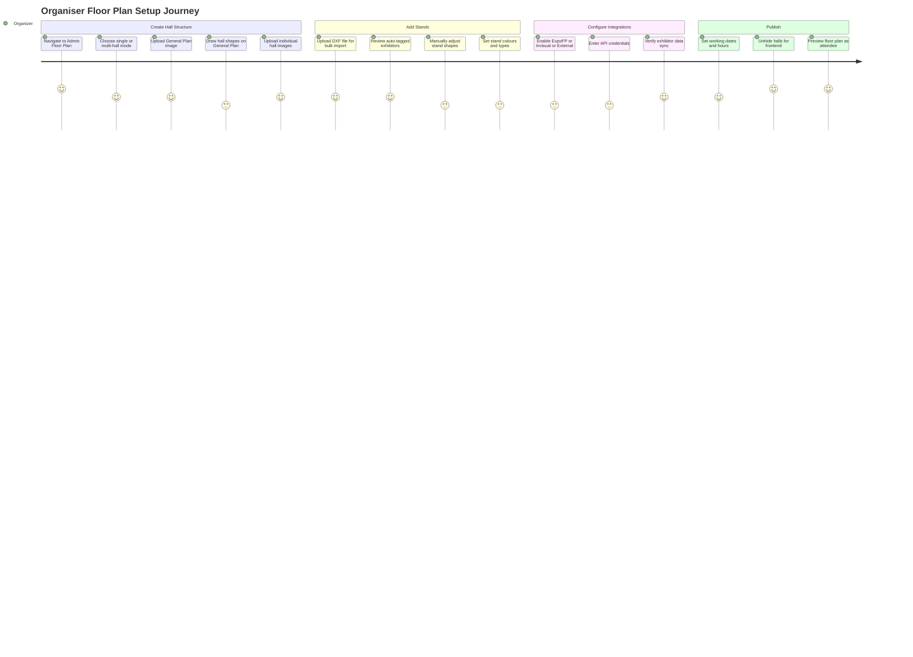
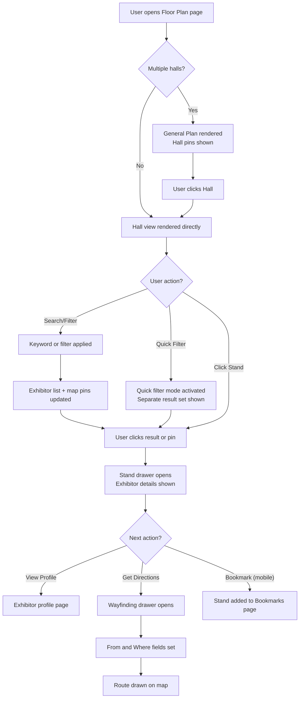
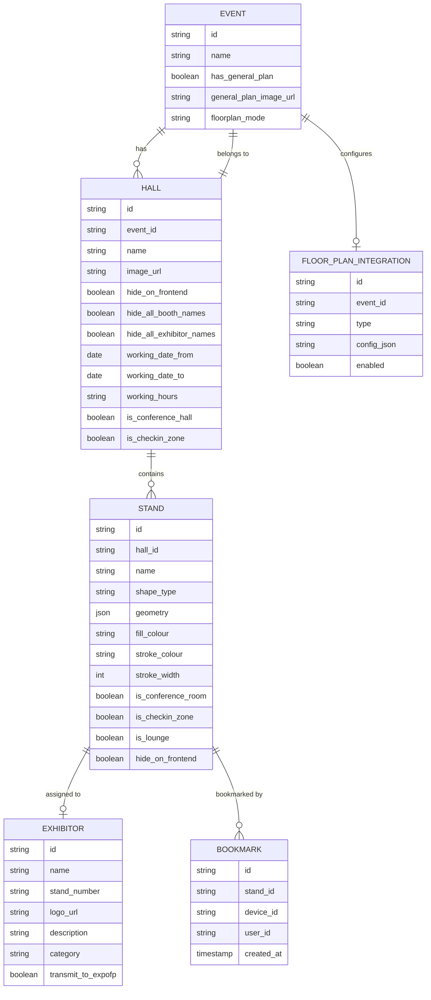
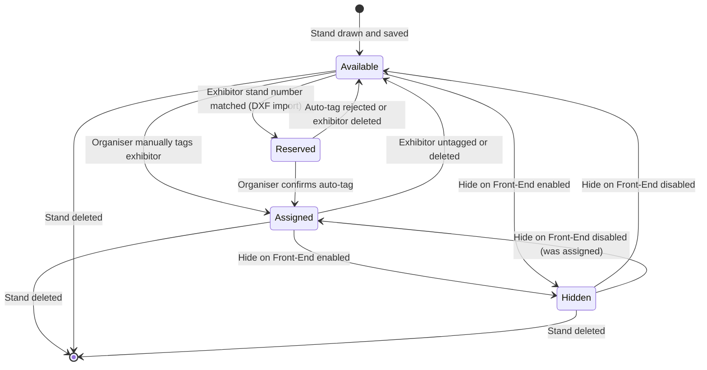
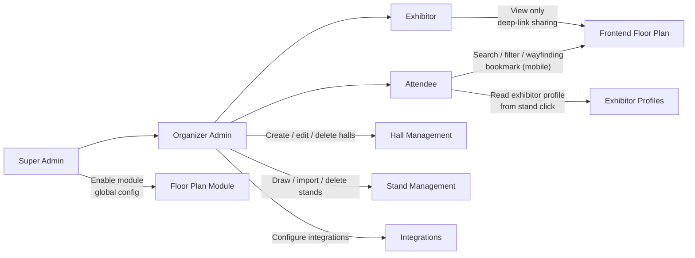

## 1. Product Overview

**Purpose.** The Floor Plan module is ExpoPlatform's interactive venue mapping and navigation system. It lets organisers build a digital replica of their exhibition halls — placing, configuring and publishing stands — and gives attendees, exhibitors and other users an interactive map they can search, filter and use to navigate the physical event space.

**Problem being solved.** Large exhibitions can contain hundreds of stands spread across multiple halls. Without a structured floor plan, attendees lose time locating exhibitors, exhibitors have no digital stand identity linked to their profiles, and organisers have no way to enforce stand ownership or communicate venue layout. The Floor Plan module bridges the physical venue and the digital platform by making the map a first-class, interactive data layer.

**Business value.**
- Drives stand traffic by letting attendees use keyword search, category filters and business-matching top-picks directly on the map.
- Reduces "where is stand X?" support queries by providing in-app wayfinding (stand-to-stand and stand-to-custom-point).
- Creates a monetisable surface: sponsor banners can be placed on the floor plan page.
- Supports third-party floor plan vendors (ExpoFP, Invisual) without losing EP's exhibitor data layer, giving organisers freedom to choose the rendering engine that fits their event.
- The three.js rewrite (EP-18007) eliminates performance degradation at scale, enabling events with 1000+ stands to pan and zoom without lag.
- CrowdConnected/Bluedot integration extends value to on-site mobile users through real-time indoor positioning.

**Target users.** Event organisers (admin panel setup), exhibitors and their team members (stand identity), attendees/visitors (navigation and discovery), and Super Admins (global configuration).

**User personas.**
- *Event Organiser* — builds halls, draws or imports stands, assigns exhibitors, configures integrations, publishes the plan.
- *Attendee / Visitor* — searches for exhibitors by name or category, uses wayfinding to reach a stand, marks stands as visited or favourited.
- *Exhibitor / Exhibitor Team Member* — appears on the map via their assigned stand; may share stand location deep-links.
- *Kiosk Operator* — uses ExpoFP floor plan on a kiosk device as a starting point for attendee wayfinding.
- *Super Admin* — enables floor plan modules, manages global integration keys, oversees event cloning safety rules.

**Success metrics.** Percentage of events with at least one hall published before event opens; average exhibitor stand assignment rate; floor plan page views per attendee per event day; wayfinding "Get Directions" interactions; search queries resolved without zero-results; CrowdConnected blue-dot session count per event.

## 2. Product Scope

### Included
- Hall management: create, edit, delete, hide, and set working dates/hours for single or multiple halls with a General Plan.
- Hall layout management: upload/replace background image, toggle booth-name and exhibitor-name visibility, manage stand list.
- Stand visual configuration: draw rectangle or polygon stands on the hall image, set fill/stroke colours, name stands, assign types (conference room, check-in zone, lounge, etc.).
- DXF stand import: bulk-create stands from AutoCAD DXF files with automatic exhibitor tagging by stand number.
- Basic floor plan display on web and mobile: General Plan overview, hall drill-down, stand click → exhibitor details drawer.
- Search and filtering: keyword search, default filters (hall, category, product category, country, tags), quick filters (My Meetings, My Sessions, Favorites, Top Matches, Visited).
- Wayfinding: stand-to-stand and stand-to-custom-point direction drawing within a hall; "Get Directions" drawer with From/Where fields.
- ExpoFP integration: bi-directional data sync (exhibitor data pushed to ExpoFP on create/edit/delete), ExpoFP iframe rendered on web and mobile, stand click → EP exhibitor profile, wayfinding with travel time and estimated arrival.
- Invisual floorplan integration: iframe-based third-party floor plan with deep-link event linking, QR code entry, bidirectional bookmark/favourite sync.
- External floorplan linking: generic iframe integration for any external floor plan URL.
- CrowdConnected/Bluedot integration: indoor positioning via SDK, real-time blue-dot location on ExpoFP map, route plotting, push messaging.
- Bookmarking stands on ExpoFP floor plan (mobile app).
- Three.js rendering engine (EP-18007 / EP-18599): GPU-accelerated canvas replacing react-konva for large stand counts.
- Standalone JS bundle deployable on web, admin panel and mobile (EP-19626).
- Banner placement on floor plan page (top or paired banners).
- Hyperlink location indicator on exhibitor cards (cursor change, EP-11652).
- Mobile redirection for ExpoFP floor plan links (EP-15109).
- Hall List Page in the admin floor plan editor.

### Excluded
- Physical floor plan design or CAD authoring (DXF files are authored externally).
- Exhibitor registration and profile management (covered by Exhibitor & Sponsor module).
- Session scheduling and agenda management (sessions appear as locations on the floor plan but are managed elsewhere).
- Payment processing for stand bookings (covered by Transactions & Purchasing).
- General analytics dashboards (covered by Organiser Analytics).
- Visioglobe and MapsPeople integrations (EP-1126 and EP-1285 are delivered but documented separately and not detailed in current Confluence pages).
- 3D modelling or AR/VR venue walkthroughs.

## 3. User Roles

| Role | Floor Plan Capabilities | Restrictions |
| --- | --- | --- |
| **Super Admin** | Enable/disable floor plan module globally; configure all integration keys; view all events' floor plans | Can clone events but must disable and re-enable ExpoFP integration on cloned event |
| **Organizer (Admin)** | Full admin panel access: create/edit/delete halls, draw/import stands, configure integrations, hide halls/stands, set working dates | Cannot modify another organiser's event floor plan |
| **Exhibitor** | Appears on the floor plan via assigned stand; can share stand deep-link; can transmit data to ExpoFP if enabled | Cannot create or edit stands; no admin panel access |
| **Exhibitor Team Member** | Inherits exhibitor stand appearance on map | No admin access; cannot modify stand assignment |
| **Attendee / Visitor** | Search stands, apply filters, use quick filters, click stands for exhibitor details, use wayfinding, mark visited, bookmark (mobile, ExpoFP) | Read-only; cannot modify any map data |
| **Speaker** | Appears as a custom location if their session is mapped to a stand/conference room | No map editing capability |
| **Kiosk Operator** | Can load ExpoFP floor plan on kiosk device and use as wayfinding starting point | No admin access; kiosk starts as fixed custom point for directions |

> [!INFO] Hall and stand visibility on the frontend is controlled by the "Hide on Front-End" toggle per hall and per stand. Hidden items are invisible to all end users but remain editable in the admin panel.

## 4. Feature Inventory

#### Basic Hall Management

**Description.** Allows organisers to define the venue structure — either a single hall or multiple halls with an overarching General Plan — and upload a background image for each.

**Why it exists.** Without a hall structure, there is no canvas on which stands can be placed. Halls also carry the working dates and hours that determine when the floor plan is visible and when session locations are available.

**User value.** Organisers can model any venue — single arena, multi-hall convention centre — and control which halls are visible to attendees on any given day.

**Functional logic.** Two primary modes: (1) Single Hall — upload one image, set name and working hours, confirm. (2) Multiple Halls with General Plan — upload a General Plan image, draw/place each hall shape on it, upload a separate image per hall. Switching between modes after setup: a single-hall event can add a General Plan later by enabling the toggle and uploading the plan image.

**Preconditions.** Organiser is authenticated; Floor Plan module is enabled for the event.

**Trigger conditions.** Organiser navigates to Admin panel → Management → Floor Plan.

**Processing logic.** Image upload supports drag-and-drop or file picker. After selection, the organiser can scale, crop and rotate (in 45° increments) before confirming. Hall metadata includes name, working dates, working hours, conference hall flag, check-in zone flag, and hide-on-front-end flag. Working dates/hours can be set per hall or propagated to the whole event or current month.

**Outputs.** Hall record stored; image stored; hall visible in the Hall List on the admin panel and (unless hidden) on the frontend floor plan.

**Dependencies.** Image storage service; Floor Plan API v2 (EP-14476); exhibitor service for location linking.

**Configurations.** Single-hall vs multi-hall mode; working dates and hours; hide on front-end toggle per hall.

**Validation rules.** Hall names must be unique across the event. A General Plan requires at least one hall to be placed on it. Working dates must fall within the event date range.

**Permissions.** Organizer and Super Admin only.

**Error handling.** If a hall image is deleted, stands/zones on that hall remain stored but are hidden from the frontend; they reappear when a new image is uploaded.

**Edge cases.** If an organiser initially selects single-hall mode then later enables a General Plan, they must manually add and position subsequent hall images. Location must be marked as both Conference Hall AND Check-in Zone for speed networking sessions to function.

---

#### Hall Layout Management

**Description.** After a hall is created, the Hall Layout view gives organisers control over the hall's display settings and is the entry point for adding and managing stands.

**Why it exists.** Organisers need a single screen from which they can adjust the hall image, toggle name visibility, access the DXF importer, add individual stands, and search for existing ones.

**User value.** Provides a visual workspace that mirrors what attendees will see, enabling confident stand placement and labelling decisions.

**Functional logic.** On entering a hall, the organiser sees the hall background image with all placed stands overlaid. Controls available: edit image (replace), delete image, hide all booth names on frontend, hide all exhibitor names on frontend. A zoom slider adjusts the canvas view. Right-side panel contains: Edit Hall (metadata), Add Stands (opens stand drawing mode), Search (find stand by name and click to edit), and Upload Stands DXF File button.

**Preconditions.** At least one hall has been created with a background image.

**Trigger conditions.** Organiser clicks on a hall from the Hall List, or from the General Plan overview.

**Processing logic.** Changes to booth/exhibitor name visibility apply globally to all stands in that hall immediately on save. The zoom slider affects only the admin view; it does not change the frontend zoom state.

**Outputs.** Updated hall display settings; navigation to stand drawing mode or DXF import.

**Dependencies.** Stand data service; DXF parser; image storage.

**Configurations.** Hide all booth names (boolean); hide all exhibitor names (boolean); image replacement.

**Permissions.** Organizer and Super Admin.

**Error handling.** If a DXF upload fails, the existing stands are unaffected. The error message should indicate the nature of the failure (format, encoding, duplicate stand name).

**Edge cases.** If the hall image is deleted while stands exist, stands are retained in the database and reappear when a new image is uploaded. Admin save does not synchronise in real time with users actively viewing the floor plan; those users see the previous state until they reload.

---

#### Stand Visual Configuration

**Description.** Organizers draw stands directly on the hall image using a rectangle or polygon tool, then configure the stand's visual properties (fill colour, stroke colour, stroke width) and metadata (name, type flags).

**Why it exists.** Stands are the atomic unit of the floor plan. Every exhibitor link, search result pin, and wayfinding route terminates at a stand. Visual configuration lets organisers match the digital stand shapes to their physical booth layouts.

**User value.** Exhibitors get accurate digital stand representation; attendees can visually identify their stand on the map.

**Functional logic.** After clicking "Add Stands", a pop-up offers Rectangle (default) or Polygon mode. Rectangle: drag to mark area; resize/move handles available. Polygon: click to place points (minimum 3); points can be adjusted or removed. Switching between Rectangle and Polygon clears any current in-progress marking. After marking, clicking Confirm opens the Stand Settings window. Settings: name (text field), stand type (check-in zone, conference room, lounge meeting room, buyer lounge, hide on front-end), fill colour (any hex via picker or predefined palette), stroke colour, stroke width (minimum 0 px). Clicking Save stores the stand and adds it to the hall panel.

**Preconditions.** Hall exists with a background image; organiser is in Hall Layout view.

**Trigger conditions.** Organiser clicks "Add Stands".

**Processing logic.** Stand areas cannot overlap each other. The confirmation step before delete ("Yes"/"No") is mandatory. Stands saved without an assigned exhibitor appear as unoccupied stands on the frontend. If "Hide on Front-End" is checked, the stand is invisible to end users until unchecked.

**Outputs.** Stand record persisted with shape geometry, colour settings, name, and type flags.

**Dependencies.** Floor Plan canvas renderer (three.js); stand data API.

**Configurations.** Rectangle vs polygon tool; fill/stroke colours; stand type flags; hide on front-end.

**Validation rules.** Stand names must be unique within the hall (shared with DXF import rule). Polygon requires at least 3 points. Overlapping shapes are rejected.

**Permissions.** Organizer and Super Admin.

**Error handling.** Overlap detection surfaces an inline error before save. Deleting a stand with an assigned exhibitor detaches the exhibitor from that stand; the exhibitor remains in the system.

**Edge cases.** If the hall image is deleted after stands are drawn, the stand geometries are preserved and re-displayed when a new image is added. Booth and exhibitor name visibility can be overridden globally via hall settings.

---

#### DXF Stand Import

**Description.** Enables bulk import of stand shapes and names from an AutoCAD DXF file, placing all shapes onto the hall background image in a single operation and automatically tagging exhibitors to stands whose numbers match.

**Why it exists.** Large exhibitions may have hundreds of stands. Drawing them one-by-one is impractical. DXF files are the standard export format from CAD-based floor plan design tools used by venue operators.

**User value.** Organizers save hours of manual stand creation; exhibitors are automatically assigned to their stands based on the stand number field on their exhibitor profile.

**Functional logic.** Organiser clicks "Upload Stands DXF File" in the Hall Layout view. On successful upload, stand shapes and names from the DXF are displayed on the hall image and listed in the All Stands panel. Automatic exhibitor tagging fires if the DXF stand number exactly matches the exhibitor's stand number field. Both the DXF layer and the background hall image can be dragged and resized for alignment. All imported shapes can be subsequently edited using the rectangle/polygon editor. Exhibitor tags can be manually added or removed from the exhibitor profile.

**Preconditions.** Hall exists with a background image; DXF file is in a compatible format and version.

**Trigger conditions.** Organiser clicks "Upload Stands DXF File".

**Processing logic.** The system parses the DXF file and maps each closed shape to a stand record. Name resolution matches DXF entity names to stand names. Exhibitor auto-tagging uses exact string match on stand number. Stand numbers must be unique within the event; duplicate stand names are rejected.

**Outputs.** Multiple stand records created; stands rendered on hall image; matched exhibitors tagged.

**Dependencies.** DXF parser library; stand data API; exhibitor data service.

**Configurations.** None beyond the upload action. Post-import editing uses the same stand configuration tooling.

**Validation rules.** Hall and stand names must be unique. Stand number match is case-sensitive exact match. DXF file must contain closed polygon entities. If a DXF stand number matches multiple exhibitors, only the first match is tagged.

**Permissions.** Organizer and Super Admin.

**Error handling.** Incompatible DXF format → user is prompted to save in a different version. Misaligned DXF-to-image: user adjusts with drag/resize tools. Exhibitor not tagged → verify exact stand number parity between DXF and exhibitor profile. Duplicate stand numbers → listed in an error report; user must resolve before re-upload.

**Edge cases.** DXF import while a user is actively using the floor plan design tool: the subsequent save by the active user can overwrite newly imported shapes. The tool is not synchronous. It is recommended to perform DXF imports during off-peak periods.

---

#### Basic Floor Plan Display

**Description.** The end-user facing interactive floor plan that presents the General Plan (if multiple halls), hall drill-downs, and stand detail drawers.

**Why it exists.** Attendees need a visual representation of the venue to locate exhibitors and understand the event layout without referring to printed maps.

**User value.** Interactive, searchable venue map accessible on web and mobile that links directly to exhibitor profiles.

**Functional logic.** General Plan view: all halls displayed; each hall is clickable and shows the total number of exhibitors inside on hover. Single-hall events skip the General Plan and open directly to the hall view. Hall view: all stands rendered on the background image with stand names and exhibitor labels (subject to admin visibility settings). Clicking a stand opens a lateral drawer with exhibitor details (company name, description, logo, stand location). Banner slots: up to two banners can be placed at the top of the floor plan page (one centred or two side-by-side, EP-11659).

**Preconditions.** At least one hall has been published; the Floor Plan module is enabled; the hall is not hidden on front-end.

**Trigger conditions.** Attendee navigates to the Floor Plan section of the event website or mobile app.

**Processing logic.** The floor plan is rendered using the three.js-based JS bundle (EP-18007 / EP-19626) for performant GPU-accelerated canvas rendering. Zooming and panning are handled by three.js, eliminating the performance degradation of the previous react-konva renderer at high stand counts. Stand colour and labels reflect admin configuration.

**Outputs.** Interactive map rendered in browser or app WebView; stand drill-down drawer.

**Dependencies.** Three.js bundle (hosted on S3); hall and stand data API; exhibitor data service; banner configuration.

**Configurations.** Hide on front-end per hall/stand; banner positions; booth-name and exhibitor-name visibility toggles.

**Permissions.** Any authenticated or guest user (depending on event access settings).

**Error handling.** If a stand is not mapped in General Plan settings, it is not clickable. If an exhibitor is not assigned to a stand, no drawer opens. Troubleshooting: check "Hide on Front-End" settings if a hall or stand does not appear.

**Edge cases.** If only one hall exists, the General Plan is bypassed entirely and the floor plan opens directly on the hall. Visited stands are shown with coloured pins only for users who have manually marked them.

---

#### Search and Filtering

**Description.** A multi-mode search and filter system on the floor plan that lets attendees locate exhibitors by name, category, country, tags, and personal context (meetings, sessions, favourites, top matches).

**Why it exists.** In an exhibition with hundreds of stands, unguided exploration is inefficient. Search and filtering converts the floor plan from a static map into a discovery engine.

**User value.** Attendees can find relevant exhibitors in seconds; business matching surfaces the highest-value connections automatically.

**Functional logic.** Keyword search: full-string match on exhibitor name, with a debounce delay to accommodate slow typists. Results are alphabetically sorted and paginated (10 per page). Each result page updates hall pins with the count of exhibitors on that page. Hovering a result enlarges the corresponding pin; hovering a hall shows a tooltip with up to 3 exhibitors (plus "show more" if more exist). Search persists until the user clears it with the X button or reloads the page. Default filters (independent of quick filters): Hall, Exhibitor Category, Product Category, Country, Tags. Quick filters (mutually exclusive from default filters): My Meetings (meeting cards with name, time, photo, location), My Sessions (session cards with name, time, track, live indicator), Favorites (exhibitors or products marked as favourite), Top Matches (top 20 exhibitors by business-matching score with match %), Visited (colour-pinned stands the user manually marked). Zero results: an explicit "no results" message is shown.

**Preconditions.** Exhibitors are assigned to stands. For quick filters: user is authenticated and has relevant meeting/session/favourite data.

**Trigger conditions.** User types in the search box or clicks a filter or quick-filter button.

**Processing logic.** Default filters and keyword search operate together (AND logic). Quick filters operate independently — applying a quick filter clears any active default filters and vice versa. Pin numbers on the General Plan reflect the current page's result set and update on page navigation. Top Matches draws from the platform's business-matching algorithm and shows the top 20 results only.

**Outputs.** Filtered exhibitor list in drawer; coloured pins on map; stand highlight on hover.

**Dependencies.** Exhibitor data service; business-matching engine; meeting and session services; favourites service.

**Configurations.** Available filter dimensions are configured per event (categories, tags, countries present in the exhibitor data).

**Permissions.** Any end user; quick filters requiring personal data (My Meetings, Favorites, Top Matches, Visited) require authentication.

**Error handling.** If no matches, explicit empty-state message. If business-matching data is unavailable, Top Matches quick filter shows zero results rather than an error.

**Edge cases.** Visited filter shows coloured pins with no cards in the drawer — this is by design. If a user navigates into a specific hall after applying a search, results persist but are scoped to that hall.

---

#### Wayfinding

**Description.** Enables end users to request turn-by-turn direction routes between two points on the floor plan — stand-to-stand or stand-to-custom-point — with a visual route drawn on the hall image.

**Why it exists.** Large multi-stand halls are difficult to traverse without navigational guidance. Wayfinding reduces attendee frustration and increases stand visit rates.

**User value.** Attendees can navigate efficiently between exhibitors, conference rooms, lounges and custom points without physical signage.

**Functional logic.** Entry point 1: clicking a stand opens the exhibitor drawer → "Get Directions" button pre-fills the destination. Entry point 2: "Get Directions" button in the filter panel opens the drawer with both fields blank. The "From" field accepts stand selection via dropdown, text search, or direct click on map. The "Where" field is pre-filled (if arriving from a stand drawer) or blank. A swap button exchanges From and Where. Clicking "Get Directions" draws a route line on the floor plan with a looped graphic fill indicating direction. A "Reset Route" button clears both fields. On the native (non-ExpoFP) floor plan, travel time and estimated arrival are not shown. On ExpoFP-integrated floor plans, the wayfinding popup shows travel time, distance and estimated arrival. Stand-to-Custom-Point: custom locations (conference rooms, recreational areas, lounges) are selectable as either From or Where endpoints.

**Preconditions.** Hall has stands drawn; at least two selectable points exist.

**Trigger conditions.** User clicks "Get Directions" from a stand drawer or from the filter panel.

**Processing logic.** Route is calculated as a path between the two geometric centroids of the selected stand shapes. The route line is rendered on the floor plan canvas. For ExpoFP mode, routing uses ExpoFP's native wayfinding engine which provides richer metrics.

**Outputs.** Visual route on map canvas; optional travel metadata (ExpoFP only).

**Dependencies.** Stand geometry data; ExpoFP wayfinding API (for ExpoFP mode); three.js canvas renderer.

**Configurations.** ExpoFP integration enabled/disabled; custom locations defined as stands with type flags.

**Permissions.** Any end user.

**Error handling.** If either the From or Where field is empty, the Get Directions action is disabled. If no path can be computed (e.g., points are in different halls), an informational message is shown.

**Edge cases.** Native floor plan does not show estimated arrival time — this is a documented limitation. In ExpoFP mode, the app does not offer a text search within the "Get Directions" popup for destinations; the user must click on the map to set their current position manually.

---

#### ExpoFP Integration

**Description.** A deep bi-directional integration with ExpoFP, a specialist floor plan SaaS, that uses ExpoFP's rendering engine for the displayed map while syncing exhibitor data in real time from ExpoPlatform.

**Why it exists.** ExpoFP provides sophisticated map rendering, wayfinding with travel time, kiosk support, and a rich stand-management toolset. Clients who have existing ExpoFP accounts or require those capabilities can use ExpoFP as the rendering layer without losing EP's exhibitor data integrity.

**User value.** Organisers get ExpoFP's powerful map features; exhibitors remain manageable from EP's single admin interface; attendees get enriched wayfinding (travel time, distance, estimated arrival).

**Functional logic.** Admin setup at `/admin/Event setup/general/settings`: enable ExpoFP integration toggle (disabling other floor plan integrations first), enter Event ID, API Token, and optional Script Source URL. When the "Transmit exhibitor data to ExpoFP" option is active for an exhibitor, every create/edit/delete event on that exhibitor fires an outbound API call to ExpoFP. Data transmitted: Exhibitor Name, Stand ID, Order ID (for parent-child visibility), Exhibitor Description, Image/Logo, Category. On-click behaviour: EP calls ExpoFP's `onDetails(details)` API method; ExpoFP returns a Stand Number (not exhibitor name) in the response. EP uses that Stand Number to look up the exhibitor profile and render EP's native exhibitor drawer. Parent-child relationship: only the parent label is visible on the booth by default; clicking reveals a popup listing all child exhibitors (collapsed by default). Custom locations: stands marked as conference rooms in both EP's admin and ExpoFP are searchable; clicking shows associated sessions. Sessions cannot be searched by name on the floor plan — only by location. If changes are made or a file is imported while someone is using the floor plan design tool, the save will overwrite later alterations; the tool is not synchronous. Event cloning: disable and re-enable the integration on the cloned event to avoid data conflicts.

**Preconditions.** ExpoFP account provisioned with Event ID and API Token; other floor plan integrations disabled; exhibitors have Stand IDs assigned.

**Trigger conditions.** Integration enabled in admin settings; exhibitor CRUD events; user navigates to floor plan; user clicks a stand or initiates wayfinding.

**Processing logic.** Exhibitor sync is event-driven (webhook-style outbound call on each CRUD operation). ExpoFP renders the map via iframe embed. EP overlays its own UI elements (search results, exhibitor drawer, wayfinding drawer) on top of the ExpoFP iframe. The `onDetails` callback from ExpoFP is intercepted by EP to look up the stand number and show the EP exhibitor profile. Mobile redirection logic (EP-15109): deep links to stands on the ExpoFP floor plan from mobile app and marketplace redirect correctly on all surfaces.

**Outputs.** ExpoFP floor plan rendered in iframe with EP exhibitor data; exhibitor profile navigation from stand clicks; wayfinding with travel time, distance and estimated arrival; bookmarking (mobile app, EP-bookmarking-stands).

**Dependencies.** ExpoFP API; ExpoFP SDK (for CrowdConnected route plotting); exhibitor data service; stand data API.

**Configurations.** Event ID, API Token, Script Source URL; Transmit exhibitor data toggle per exhibitor; custom location stand type; parent-child exhibitor relationships; map formats supported: PDF, SVG, PNG, DXF.

**Validation rules.** ExpoFP does not handle duplicate hall names or duplicate stand names well — all halls and stands must have unique names in EP's admin panel. Cloning events: integration must be toggled off then on again to avoid data collisions.

**Permissions.** Organizer/Super Admin for configuration; any end user for frontend viewing.

**Error handling.** If ExpoFP returns a non-stand-number value in `onDetails`, EP silently ignores it (no drawer opens). If exhibitor data transmission fails, the failure is logged and does not block the EP CRUD operation. Sponsor banners on ExpoFP floor plan: supported via ExpoFP's sponsorship feature.

**Edge cases.** Sessions with exhibitor events are not searched by session name; only the location/stand can be searched. Custom locations must exist on both EP's admin floorplan AND ExpoFP side to establish the integration connection. On mobile, custom locations cannot be searched in the get-directions popup — the user must tap the map to set location.

---

#### Invisual Floorplan Integration

**Description.** Embeds an Invisual-hosted interactive floor plan as an iframe within the EP web and mobile experience, with deep-link navigation from exhibitor/session/event pages and bidirectional bookmark-to-favourite synchronisation.

**Why it exists.** Invisual is a specialist floor plan vendor that some clients already have a relationship with, offering QR-code venue wayfinding and conference room linking capabilities beyond EP's native tools.

**User value.** Users can scan a QR code in the physical venue to land directly on their location in the floor plan (mobile app or browser). Favouriting an item in EP automatically bookmarks it in Invisual and vice versa.

**Functional logic.** Admin settings at `/admin/general/settings`: Enable toggle, Floor plan link (required, from Invisual), Deep link event pattern (required, from Invisual), JSON file with conference room IDs (maps stages/conference halls to Invisual IDs), Map zip-archive link (for mobile app). When enabled, the floor plan page embeds the Invisual URL in an iframe (web) or WebView (mobile). Linking: when a user clicks a location on an exhibitor, session, or exhibitor event page, EP opens the Invisual floor plan at the corresponding point. Stage/conference hall deep links use IDs from the attached JSON file. QR codes: scanning the venue QR code opens the mobile app (if installed) with the floor plan at the user's location; otherwise opens browser WebView. Integration direction is primarily EP → Invisual (data flows from EP pages to the floor plan). Exception: bookmarks/favourites are bidirectional. Bookmark sync: adding a bookmark in Invisual → item added to EP Favourites (visible on `/newfront/profile/favourites`). Bookmark for sessions/exhibitor events → added to user's schedule if the time slot is free; ignored if blocking. Items favourited on EP → bookmarked in Invisual. Scheduled sessions/events → bookmarked in Invisual.

**Preconditions.** Invisual account provisioned; floor plan link and deep link pattern provided by Invisual; JSON conference room IDs file prepared.

**Trigger conditions.** User clicks a location link from exhibitor/session page; user scans venue QR code; user adds/removes a bookmark.

**Processing logic.** QR code deep link pattern is configured in the admin panel's "Deep link event pattern" field. EP sends location context to the Invisual iframe via URL parameters in the iframe src. Bookmark events trigger API calls to EP's favourites service.

**Outputs.** Invisual floor plan displayed at correct location; item added to EP favourites and Invisual bookmarks; mobile app opened from QR code.

**Dependencies.** Invisual API; EP favourites service; EP schedule service; mobile deep link infrastructure.

**Configurations.** Floor plan link; deep link event pattern; JSON conference room IDs file; map zip-archive link; enable/disable toggle.

**Permissions.** Organizer/Super Admin for configuration; any end user for frontend.

**Error handling.** If the JSON file is missing, stage/conference room deep links will not navigate to the correct location. If the mobile app is not installed, QR code scanning falls back to browser WebView. Bookmark sync failure does not block the favouriting action on either side.

**Edge cases.** Bookmark for a session/event that blocks a time slot is silently ignored (not added to schedule). If multiple exhibitors share one stand, the floor plan popup shows all exhibitors. If an exhibitor is on multiple stands, separate location links exist for each.

---

#### External Floorplan Linking

**Description.** A generic integration mode that allows organisers to configure any external floor plan URL and embed it as an iframe on web and as a WebView on mobile, without requiring a specific vendor integration.

**Why it exists.** Some events use floor plan systems not covered by native EP integrations. The external linking option provides a universal fallback without requiring EP development effort for every possible vendor.

**User value.** Organisers can connect any third-party map service. Users on the event website and app can access the floor plan through the same navigation flow.

**Functional logic.** Admin settings at `/admin/general/settings`: Text/Label field for the external floor plan URL; enable/disable toggle. When enabled and configured, the floor plan page on the frontend opens an iframe (web) or WebView (mobile) using the configured URL. Users can navigate to the floor plan by clicking on location links from exhibitor, session, exhibitor event, and meeting pages. Stage and conference hall deep-link support follows the same JSON-based ID pattern as Invisual if the vendor supports it. When Invisual is connected, bookmarks from the external floor plan are transmitted to EP as favourites.

**Preconditions.** External floor plan URL available; no conflicting floor plan integration enabled simultaneously.

**Trigger conditions.** User clicks a floor plan link on any entity page; user navigates to the Floor Plan section.

**Processing logic.** URL is embedded as-is in the iframe `src`. EP does not parse or interact with the external floor plan content beyond passing the URL and any deep-link parameters.

**Outputs.** External floor plan rendered in iframe/WebView.

**Dependencies.** External floor plan service (third-party); EP favourites service (if Invisual is involved).

**Configurations.** External URL; enable/disable toggle.

**Permissions.** Organizer/Super Admin for setup; any end user for viewing.

**Error handling.** If the external URL is unreachable, the iframe renders an empty or error state from the browser — EP has no error recovery for external content. Users should verify the URL is publicly accessible.

**Edge cases.** Only one floor plan integration (ExpoFP, Invisual, or External) should be enabled at a time. Enabling multiple simultaneously will result in undefined rendering behaviour.

---

#### CrowdConnected / Bluedot Indoor Navigation

**Description.** Integrates CrowdConnected's indoor positioning SDK into the EP mobile app, displaying the user's real-time location as a blue dot on the ExpoFP floor plan and enabling GPS/IPS-guided route plotting and location-based push messaging.

**Why it exists.** In large venues, even with a digital floor plan, attendees cannot see where they currently are on the map. CrowdConnected's SDK uses Bluetooth beacons and/or GPS to pinpoint the user, converting the static map into a live "you are here" experience.

**User value.** Attendees see their precise location on the map and can plot routes from their current position to any stand without having to manually tap their location. Organisers gain enriched attendee movement data.

**Functional logic.** Admin setup at Event Set up → General → Settings: App key, Token, Secret, Mode (IPS only, GPS only, or IPS and GPS). The CrowdConnected SDK is bundled into the EP mobile app. When enabled, the SDK starts/stops automatically based on the operational mode. ExpoFP SDK integrates with CrowdConnected to relay coordinates to the floor plan. When a device can determine position and permissions are granted, a blue dot appears on the ExpoFP floor plan and updates in real time as the user moves. Users can build routes from their blue-dot location to any stand. Push messaging: CrowdConnected integrates directly with EP's backend (not Firebase) to deliver location-triggered push notifications. A new EP API for notifications handles receipt (EP-23578). User ID is passed from the mobile app to CrowdConnected via the ExpoFP SDK alias mechanism (EP-23579), enabling enriched movement analytics.

**Preconditions.** ExpoFP integration is active (CrowdConnected requires ExpoFP floor plan as the rendering surface); CrowdConnected account provisioned with App key, Token and Secret; mobile app updated to include the CrowdConnected SDK; venue has BLE beacons installed for IPS mode.

**Trigger conditions.** User opens Floor Plan in the mobile app; location permissions are granted; SDK is active.

**Processing logic.** The mobile OS prompts the user for location permission on first floor plan access. Foreground permission enables the blue dot during active app use. Background permission is required for location-based push notifications. If neither permission is granted, a reminder banner appears on the map view. As the user moves, the blue dot position updates in real time. Route plotting generates a route from the current blue-dot location to the destination stand.

**Outputs.** Real-time blue dot on floor plan; navigable routes from current position; location-triggered push notifications.

**Dependencies.** CrowdConnected SDK; ExpoFP SDK and floor plan; EP notifications API; mobile app build pipeline; BLE beacon infrastructure.

**Configurations.** App key, Token, Secret, Mode (IPS/GPS/both); background location permission prompt enabled. Note: if the integration is enabled after an app store submission, an app store update is required. Enabling this feature requires a video presentation and text description to be submitted to app stores (due to background location permission requirement).

**Permissions.** Super Admin/Organizer for configuration; mobile app users (end users) for location access (device permission).

**Error handling.** No location permission → reminder text displayed on map; blue dot hidden. SDK failure → falls back to manual location tap. Push notification cleared by user disappears — the redesigned notification architecture (EP-23578) ensures missed notifications can be recovered from the EP backend.

**Edge cases.** App must be updated and resubmitted to stores if CrowdConnected is enabled after the initial submission. The integration only works on the mobile app — web users do not see the blue dot. User IDs are passed to CrowdConnected for analytics enrichment; this has privacy/consent implications that should be addressed in the event's privacy policy.

---

#### Bookmarking Stands on ExpoFP Floor Plan

**Description.** Allows mobile app users to bookmark stands on the ExpoFP floor plan for easy revisitation, with bookmarks stored locally on the device and managed through a dedicated Bookmarks page.

**Why it exists.** Attendees at large expos may want to note stands for later visits without navigating away. Bookmarks persist within the app session without requiring a network call.

**Functional logic.** Any stand type (exhibitor, session, event, custom location) can be bookmarked. A bookmark button adds the stand to a persistent list; a filled icon confirms the bookmark. The Bookmarks page (accessible via bookmark icon) lists all bookmarked stands sorted alphanumerically, searchable by stand name or exhibitor name. Child exhibitors can be expanded; bookmarks are removed via the X icon. Data is stored locally in the app database — available for all users (logged in or not) on that device. Data persists until manually deleted or until the app is reinstalled.

**Preconditions.** ExpoFP integration is active; mobile app is installed.

**Trigger conditions.** User taps the bookmark button on a stand popup.

**Processing logic.** Bookmark is written to local device storage. No server sync for bookmarks in the current implementation (future web support and favourites sync are planned).

**Outputs.** Stand added to local Bookmarks page; bookmark icon updates to filled state; notification confirms the action.

**Dependencies.** ExpoFP floor plan; local app database.

**Configurations.** Multilanguage support: French, German, Spanish, Italian.

**Permissions.** Any mobile app user (authenticated or guest).

**Error handling.** App reinstall clears all bookmarks — this is a documented data lifecycle behaviour, not an error.

**Edge cases.** Web support is not yet available; bookmarks are device-local only. Favourites synchronisation with the EP platform is planned but not delivered in the current release.

---

#### Three.js Rendering Engine (Floor Plan Rewrite)

**Description.** The native EP floor plan canvas was rewritten from react-konva to three.js (WebGL), enabling GPU-accelerated rendering that maintains smooth pan/zoom performance even when hundreds of stands with text labels are displayed simultaneously.

**Why it exists.** With react-konva, rendering performance degraded progressively as stand count and text-label volume increased. Zooming and panning became sluggish for organisers with large halls, creating a poor experience that undermined the product's core value (EP-18007).

**User value.** Organisers and attendees experience smooth, responsive floor plan interaction regardless of stand count. Text rendering — previously the main bottleneck — is handled efficiently by the GPU.

**Functional logic.** The floor plan is compiled into a standalone JS bundle (EP-19626) hosted on S3. This bundle is consumed by the web frontend, admin panel, and mobile app WebView as a shared feature component. Parent components pass configuration props (background image, stands, events, banners). Three.js handles all canvas operations: render, pan, zoom, hover states, stand colouring, text labelling.

**Preconditions.** Three.js bundle deployed to S3; consuming applications updated to reference the bundle.

**Trigger conditions.** Any floor plan canvas render (admin layout editor or end-user view).

**Processing logic.** Stands and their geometries are passed as data props to the bundle. Three.js renders them as instanced meshes for efficiency. Text labels are rendered as billboard sprites to maintain legibility at all zoom levels.

**Outputs.** Performant floor plan canvas on all surfaces (web, admin, mobile WebView).

**Dependencies.** S3 bundle CDN; three.js library; WebGL support in browser/app WebView.

**Configurations.** Bundle version is managed via the S3 URL reference in each consuming app.

**Permissions.** No user-facing permission; internal rendering concern.

**Error handling.** If WebGL is not supported by the browser, a fallback (canvas 2D or message) should be displayed. Bundle loading failure → floor plan page shows an error state.

**Edge cases.** Mobile WebViews on older devices may have limited WebGL support. The S3 bundle must be versioned carefully to avoid breaking changes across web, admin and mobile consumers.

## 5. User Stories Mapping

| Story ID | Title | Summary | Acceptance Criteria | Related Feature | Status |
| --- | --- | --- | --- | --- | --- |
| EP-919 | (New UI) Floor plan | Redesigned floor plan UI | New UI matches Figma designs; floor plan accessible on frontend | Basic Floor Plan Display | COMPLETE |
| EP-1126 | Interactive Floorplans — Visioglobe | Visioglobe integration (superseded by ExpoFP/Invisual in current stack) | Visioglobe settings added to admin panel; floor plan loads in iframe | External Floorplan Linking | COMPLETE |
| EP-1285 | Floor plan integration — MapsPeople stage 1 | MapsPeople integration using same interface as Visioglobe; hash key connection | Hash key configured; exhibitor-stand linking via stand number match | External Floorplan Linking | COMPLETE |
| EP-10211 | Floorplan Admin Panel — Ability to Draw/Delete Stands | Organiser can draw and delete stands in the admin floor plan editor | Draw rectangle/polygon stands; delete with confirmation; saved to API | Stand Visual Configuration | COMPLETE |
| EP-11652 | New Floorplan — indication for hyperlinks (location) | Mouse cursor changes to pointer when hovering over exhibitor card location link | Cursor changes from arrow to finger on hover over location field | Basic Floor Plan Display | COMPLETE |
| EP-11659 | New Floorplan — new type of banner view | Two banner placement options: one centred at top or two in-line | Banners render correctly in both configurations on floor plan page | Basic Floor Plan Display | COMPLETE |
| EP-14476 | Floor plan API v2 (Epic) | API v2 for floor plan data; underpins all floor plan CRUD operations | API v2 endpoints functional; floor plan features operate via v2 | Hall Management / Stand Config | COMPLETE |
| EP-15109 | Mobile redirection ExpoFP Floorplan | Deep links to stands on ExpoFP floor plan redirect correctly from mobile app and marketplace | All clickable stands in mobile app and marketplace redirect to correct ExpoFP stand location | ExpoFP Integration | COMPLETE |
| EP-18007 | Rewrite floorplan in threejs (Epic) | Replace react-konva with three.js for performant rendering at scale | Zooming and panning remain smooth with 1000+ stands; text labels render without lag | Three.js Rendering Engine | COMPLETE |
| EP-18599 | FloorPlan optimization | Performance optimization tasks within the three.js rewrite epic | Canvas performance benchmarks met; no regression in stand interaction | Three.js Rendering Engine | COMPLETE |
| EP-19626 | Create JS bundle with floor plan | Standalone floor plan bundle for web, admin and mobile | Bundle deployed to S3; consumed by web frontend, admin panel and mobile app | Three.js Rendering Engine | COMPLETE |
| EP-22104 | Create default settings | Default configuration settings for the floor plan component library | Default settings applied when no override is present | Stand Visual Configuration | COMPLETE |
| EP-23578 | Push messaging through CrowdConnected on app | CrowdConnected integrates with EP backend (not Firebase) for notifications; new API for notification delivery | Notifications delivered via EP API; cleared notifications recoverable | CrowdConnected Integration | COMPLETE |
| EP-23579 | Pass User ID through to CrowdConnected | ExpoPlatform passes user IDs from mobile app to CrowdConnected via ExpoFP SDK | User IDs transmitted as aliases; movement data enriched with user IDs | CrowdConnected Integration | COMPLETE |
| EP-24164 | Redesign of ExpoFP UI elements | New design for EP's overlay UI elements on the ExpoFP floor plan | Search list, stand drawer, get direction drawer, route drawer all redesigned | ExpoFP Integration | COMPLETE |
| EP-26327 | ExpoFP — Data Integration | Set up data sync: exhibitor create/edit/delete on EP fires outbound data push to ExpoFP | Exhibitor data transmitted to ExpoFP on each CRUD event; correct fields sent | ExpoFP Integration | COMPLETE |
| EP-27382 | InVisual Floor Plan Integration | Native Invisual integration: QR wayfinding, agenda/exhibitor linking, bookmark-favourite sync | QR code navigation; deep-link from exhibitor/session pages; bookmarks synced to EP favourites | Invisual Integration | COMPLETE |

## 6. End-to-End Workflows

### Organiser Setup Workflow (Admin)

### Attendee Navigation Workflow (System)

### Happy Path
1. Organiser creates a multi-hall event, uploads General Plan and two hall images, imports DXF stands for each hall, verifies exhibitor auto-tagging, enables ExpoFP integration, enters credentials, confirms exhibitor data is transmitting, sets hall working dates and unhides halls.
2. Attendee opens the floor plan, sees the General Plan with two hall pins, clicks Hall A, searches for "TechCorp", finds the stand highlighted on the map, clicks the stand to see the exhibitor drawer, clicks "Get Directions" from their current stand to TechCorp's stand, route is drawn with travel time shown (ExpoFP mode).

### Alternate Path
Organiser uses native EP floor plan (no ExpoFP): draws stands manually, assigns exhibitors by name. Attendee uses wayfinding — route is drawn but no travel time or estimated arrival is shown (native limitation).

### Exception Path
Exhibitor is not assigned to any stand. Attendee searches by exhibitor name — the exhibitor appears in search results with a hall pin but clicking the pin shows no stand detail (no exhibitor drawer). Organiser must assign the exhibitor to a stand in the admin panel.

### Recovery Path
DXF import fails due to duplicate stand names. System returns an error listing the conflicting names. Organiser resolves duplicates in the DXF file externally, re-uploads the corrected file. Existing stands that were successfully imported on a previous attempt remain; only the new import batch is affected.

## 7. Business Rules Engine

| Rule | Condition | Exception / Priority | Conflict Resolution |
| --- | --- | --- | --- |
| Only one floor plan integration may be active at a time | Event has more than one of ExpoFP / Invisual / External enabled | N/A | Admin must disable all others before enabling a new one; UI should enforce this |
| Stand names must be unique within a hall | DXF import or manual stand creation | No exception | Import is blocked for conflicting names; user must rename before proceeding |
| Hall names must be unique within an event | Any hall creation operation | No exception | System rejects duplicate hall name with inline error |
| Exhibitor data sync to ExpoFP fires on every CRUD | "Transmit exhibitor data" toggle is active | If toggled off, no sync occurs | Toggle state determines sync; toggling off while stands are active leaves ExpoFP stale |
| Event cloning: ExpoFP integration must be re-initialised on clone | Event is cloned with ExpoFP active | Without re-init, data from source event may pollute clone | Organiser must disable and re-enable integration on the cloned event |
| Hidden halls and stands are invisible to all end users | "Hide on Front-End" is toggled on | No end-user role can override hidden state | Only admin can unhide; hidden items still count in admin stand totals |
| Quick filters operate independently from default filters | A quick filter is active | Default filters are cleared when a quick filter is selected | Switching to a default filter clears the active quick filter |
| CrowdConnected requires ExpoFP as rendering surface | CrowdConnected integration enabled | If ExpoFP is disabled, CrowdConnected blue dot cannot render | CrowdConnected should only be enabled when ExpoFP is also active |
| Session cannot be searched by session name on the floor plan | ExpoFP integration mode | Attendees must search by location/stand name | Sessions are found by searching their associated conference room stand |
| Speed networking requires Conference Hall AND Check-in Zone flags | Location is intended for speed networking sessions | Setting only one flag is insufficient | Both flags must be set on the location stand/hall |
| DXF save overwrites concurrent design-tool changes | Admin saves while another user has the design tool open | Design tool is not synchronous | Import/DXF operations should be performed when the design tool is not actively in use |

## 8. Data Model

**Inputs.** Hall images (raster), DXF files (vector CAD), exhibitor profile data, integration credentials.

**Outputs.** Interactive floor plan canvas, exhibitor detail drawers, wayfinding routes, search result pin sets, CrowdConnected location stream, bookmark lists.

**Data lifecycle.** Hall and stand records persist for the life of the event. Deleting a hall image hides the stands (soft delete of visibility, not data). Bookmarks are device-local and are deleted on app reinstall. ExpoFP sync is eventually consistent — EP fires the outbound call but cannot guarantee ExpoFP's processing latency.

### Stand Allocation State Diagram

## 9. Permissions Matrix

### Permission Flow

### Role × Capability Table

| Capability | Super Admin | Organizer | Exhibitor | Attendee | Speaker |
| --- | --- | --- | --- | --- | --- |
| Enable/disable Floor Plan module | Yes | No | No | No | No |
| Configure ExpoFP / Invisual / External integration | Yes | Yes | No | No | No |
| Create / edit / delete halls | Yes | Yes | No | No | No |
| Set hall working dates and hours | Yes | Yes | No | No | No |
| Hide/unhide hall on frontend | Yes | Yes | No | No | No |
| Draw / edit / delete stands | Yes | Yes | No | No | No |
| Import stands from DXF | Yes | Yes | No | No | No |
| Assign exhibitor to stand | Yes | Yes | No | No | No |
| Hide/unhide stand on frontend | Yes | Yes | No | No | No |
| Toggle hide all booth/exhibitor names | Yes | Yes | No | No | No |
| View floor plan on frontend | Yes | Yes | Yes | Yes | Yes |
| Search exhibitors on floor plan | Yes | Yes | Yes | Yes | Yes |
| Use wayfinding (Get Directions) | Yes | Yes | Yes | Yes | Yes |
| Use quick filters (My Meetings etc.) | Yes | Yes | Limited | Yes | Limited |
| Bookmark stands (mobile, ExpoFP) | No | No | No | Yes | No |
| Access CrowdConnected admin setup | Yes | Yes | No | No | No |
| Grant location permission (CrowdConnected) | N/A | N/A | N/A | Yes (device) | N/A |

## 10. Integrations

| Integration | Purpose | Trigger | Data Exchanged | Failure Handling | Retry | Security |
| --- | --- | --- | --- | --- | --- | --- |
| **ExpoFP** | Specialist floor plan rendering with rich wayfinding, kiosk support; exhibitor data sync | Exhibitor CRUD on EP side; user opens floor plan; user clicks stand | Outbound: Exhibitor Name, Stand ID, Order ID, Description, Logo, Category. Inbound: Stand Number from `onDetails` callback | EP CRUD completes even if ExpoFP sync fails; failure is logged | Manual re-trigger by re-saving exhibitor; no automatic retry specified | API Token stored in admin settings; HTTPS transport |
| **Invisual** | Third-party floor plan with QR code wayfinding; bookmark-to-favourite bidirectional sync | User clicks location link; user scans QR code; user adds/removes bookmark | EP → Invisual: deep-link URL parameters. Invisual → EP: bookmark events → favourites API | Bookmark sync failure does not block favouriting; missing JSON file breaks stage deep links | Not specified | Floor plan link and deep link pattern stored in admin settings; HTTPS |
| **External Floorplan** | Generic iframe embed for any third-party floor plan URL | User navigates to floor plan section | EP → iframe: URL with optional deep-link params | If external URL is unreachable, browser renders iframe error; EP has no recovery | N/A | URL stored in admin settings; relies on external service's own security |
| **CrowdConnected (Bluedot)** | Indoor positioning for real-time user location (blue dot) on ExpoFP map; location-based push messaging | User opens floor plan in mobile app with location permission granted | EP → CrowdConnected SDK: User ID alias. CrowdConnected → EP backend: location coordinates, push notification triggers | No location permission → blue dot hidden, reminder shown | SDK auto-restarts on mode change | App Key, Token, Secret stored in admin settings; SDK uses encrypted communication |
| **DXF File (AutoCAD)** | Bulk stand shape and name import | Organiser uploads DXF file | Inbound: DXF entities (closed polygons) → stand geometry and names | Incompatible format → error message; duplicate stand names → blocked | Re-upload after resolving errors | File upload via authenticated admin panel session |
| **S3 CDN (JS Bundle)** | Deliver three.js floor plan bundle to web, admin and mobile consumers | Any floor plan canvas render | Outbound: static JS bundle | Bundle load failure → floor plan page error state | Browser cache retry | HTTPS CDN; bundle versioned by URL |

## 11. Notifications

> [!INFO] The Floor Plan module has minimal native notification output. The primary notification mechanism is the CrowdConnected push messaging channel for mobile app users.

| Notification Type | Channel | Trigger | Recipient | Timing | Notes |
| --- | --- | --- | --- | --- | --- |
| Bookmark confirmed | In-app (mobile) | User taps bookmark button on ExpoFP floor plan | Attending user | Immediate | Toast notification; bookmark icon updates to filled state |
| Location-based push notification | Push (mobile) | CrowdConnected triggers based on user proximity to a defined zone | Attending mobile app user | Real-time (proximity-triggered) | CrowdConnected integrates with EP backend API (not Firebase) per EP-23578; notifications that are cleared are recoverable from EP backend |
| Stand save confirmation | In-app (admin) | Organiser saves stand changes in admin panel | Organiser | Immediate | Confirmation message displayed in admin UI |
| DXF import result | In-app (admin) | DXF file upload completes | Organiser | On upload completion | Success: stand count created; failure: error list with conflicting names |
| Exhibitor untagged warning | In-app (admin) | Organiser deletes a stand that has an assigned exhibitor | Organiser | On delete confirmation | Exhibitor is detached from stand; no notification sent to exhibitor |

> [!WARN] There are no email or SMS notifications generated by the Floor Plan module itself. Session and meeting notifications that reference floor plan locations are managed by the Agenda/Sessions and Meetings modules respectively.

## 12. Reporting and Analytics

> [!INFO] The Floor Plan module does not have a dedicated analytics dashboard in the admin panel. Floor plan engagement data surfaces through broader Organiser Analytics reports. The section below describes the available data points and how they are accessible.

| Metric / Report | Inputs | What is Measured | Filters | Export |
| --- | --- | --- | --- | --- |
| **Stand visit counts** | Stand click events from end users | Number of times each stand was opened (drawer viewed) | By hall; by date range | Via Organiser Analytics → Exhibitor Interactions export |
| **Wayfinding usage** | "Get Directions" interaction events | Number of wayfinding requests initiated; From/Where stand pairs | By date; by hall | Not available as a dedicated export in current Confluence documentation |
| **Search query volume** | Search bar input events | Keyword queries entered on floor plan | By date | Not available as a dedicated export |
| **Quick filter usage** | Quick filter click events | Which quick filters (My Meetings, Favorites, Top Matches, Visited) were used and how often | By filter type; by date | Not available as a dedicated export |
| **CrowdConnected movement data** | User IDs passed via ExpoFP SDK alias | Attendee movement paths through the venue; dwell time by stand area | Per user (anonymised or identified); by time block | CrowdConnected platform (external); not available in EP admin directly |
| **ExpoFP stand interaction** | ExpoFP `onDetails` callback events | Stands clicked within the ExpoFP floor plan | By stand; by date | ExpoFP admin panel (external) |
| **Visited stands** | User-marked visited events | Stands a user has manually marked as visited; visible via Visited quick filter | Per user session | Not available as a standalone export |

> [!WARN] Dedicated floor plan interaction analytics (wayfinding counts, search volume, quick filter breakdown) are not documented in current Confluence pages as being available in the EP admin analytics panel. Source gap: this may be tracked in the backend but is not surfaced in documented reports.

## 13. Configuration Guide

| Setting | Location | Effect | Who Can Set |
| --- | --- | --- | --- |
| Floor Plan module enable/disable | Module Management (Super Admin) | Shows or hides Floor Plan from the event navigation | Super Admin |
| Single Hall vs Multiple Halls + General Plan | Admin → Management → Floor Plan | Determines venue structure mode; switching modes requires re-uploading images | Organizer, Super Admin |
| Hall working dates | Admin → Hall edit dialog | Controls when the hall is "open" for session/meeting location resolution | Organizer, Super Admin |
| Hall working hours | Admin → Hall edit dialog | Daily open/close times for the hall; applies to speed networking and location availability | Organizer, Super Admin |
| Hide Hall on Front-End | Admin → Hall list or Hall edit dialog | Hides hall from all frontend views including wayfinding results | Organizer, Super Admin |
| Hide all booth names | Admin → Hall Layout settings | Suppresses stand name labels for all stands in the hall on frontend | Organizer, Super Admin |
| Hide all exhibitor names | Admin → Hall Layout settings | Suppresses exhibitor name labels for all stands in the hall on frontend | Organizer, Super Admin |
| Stand hide on front-end | Admin → Stand settings | Hides individual stand from all frontend views | Organizer, Super Admin |
| Stand type flags | Admin → Stand settings | Marks stand as conference room / check-in zone / lounge / buyer lounge; affects session linking and speed networking | Organizer, Super Admin |
| ExpoFP integration enable | Admin → Event Setup → General → Settings | Activates ExpoFP iframe floor plan; must disable other integrations first | Organizer, Super Admin |
| ExpoFP Event ID | Admin → ExpoFP settings section | Links EP event to specific ExpoFP event | Organizer, Super Admin |
| ExpoFP API Token | Admin → ExpoFP settings section | Authenticates outbound exhibitor data sync to ExpoFP | Organizer, Super Admin |
| ExpoFP Script Source URL | Admin → ExpoFP settings section | Optional custom JS for map customisation (e.g., floor/level naming) | Organizer, Super Admin |
| Transmit exhibitor data to ExpoFP | Admin → per-Exhibitor settings | When enabled per exhibitor, fires data sync on every exhibitor CRUD event | Organizer, Super Admin |
| Invisual floor plan link | Admin → General Settings | URL of the Invisual-hosted floor plan embedded as iframe | Organizer, Super Admin |
| Invisual deep link event pattern | Admin → General Settings | URL pattern used for QR code and location deep links | Organizer, Super Admin |
| Invisual JSON conference room IDs file | Admin → General Settings | Maps EP stage/conference hall IDs to Invisual IDs for deep-link navigation | Organizer, Super Admin |
| Invisual map zip-archive link | Admin → General Settings | Zip archive URL for the map used by the mobile app | Organizer, Super Admin |
| External floor plan URL | Admin → General Settings | URL of any external floor plan service to embed as iframe | Organizer, Super Admin |
| CrowdConnected App Key | Admin → Event Setup → General → Settings | Authenticates CrowdConnected SDK | Organizer, Super Admin |
| CrowdConnected Token | Admin → Event Setup → General → Settings | Authentication token for CrowdConnected | Organizer, Super Admin |
| CrowdConnected Secret | Admin → Event Setup → General → Settings | Authentication secret for CrowdConnected | Organizer, Super Admin |
| CrowdConnected Mode | Admin → Event Setup → General → Settings | IPS only / GPS only / IPS and GPS — determines location sensing method | Organizer, Super Admin |

## 14. Edge Cases

### User Edge Cases
- User has no internet connection on mobile: the floor plan WebView may not load; ExpoFP and Invisual integrations require network access; bookmarks stored locally remain accessible.
- User denies location permission for CrowdConnected: blue dot is not shown; a reminder banner is displayed; no route-from-current-location is possible; user can still use stand-to-stand wayfinding by manually selecting stands.
- Non-authenticated user on events with open access: quick filters requiring personal data (My Meetings, My Sessions, Favorites, Top Matches) return empty results rather than an error; Visited stands are only tracked per session.
- User with multiple device languages: CrowdConnected/ExpoFP bookmark notification labels are multilingual (French, German, Spanish, Italian); other floor plan UI labels depend on event language settings.

### Data Edge Cases
- Exhibitor with no stand assignment: appears in exhibitor search results but has no map pin; wayfinding cannot route to the exhibitor.
- Stand with no exhibitor assigned: renders on the map; clicking it opens an empty or unnamed drawer depending on stand type.
- DXF file with non-unique stand names: import is blocked for the conflicting entries; user must resolve in the source DXF before re-upload.
- Exhibitor with the same stand number on multiple halls: only the first match in the DXF import auto-tagging receives the exhibitor; subsequent halls must be manually tagged.
- Parent-child exhibitor with 10+ child companies on one stand: the popup becomes long; children are collapsed by default to manage visual clutter.
- Hall image deleted while stands exist: stand geometry is retained; stands are hidden on frontend until a new image is uploaded.

### Workflow Edge Cases
- Organiser clones event with ExpoFP active and forgets to re-initialise: exhibitor data from the source event populates the clone's ExpoFP account, causing data cross-contamination. Must disable and re-enable ExpoFP integration on the cloned event.
- DXF import performed while a user has the floor plan design tool open: the open user's save will overwrite the DXF import if they save after the import completes. The tool is not synchronous.
- Organiser enables multiple floor plan integrations simultaneously: undefined rendering behaviour; only one integration should be active at a time.
- Working dates not configured on a hall: sessions and meetings assigned to that location may not resolve correctly; always set working dates before publishing.

### Integration Edge Cases
- ExpoFP returns exhibitor name (not stand number) in `onDetails` response: EP's stand lookup fails silently; no exhibitor drawer opens. Requires ExpoFP event configuration to be corrected to return stand number.
- Invisual JSON conference room IDs file is missing or malformed: stage and conference hall deep links will navigate to the general floor plan view instead of the specific location.
- CrowdConnected integration enabled after app store submission: requires an app update and resubmission including a video presentation of the background location feature for app store review.
- ExpoFP exhibitor sync fails during a bulk import: EP's admin import may complete successfully while ExpoFP remains stale; organisers should verify ExpoFP stand assignments after any bulk operation.

### Permission Edge Cases
- Exhibitor attempts to access admin floor plan editor: redirected to login or access-denied page; no floor plan editor access.
- Super Admin clones event on behalf of an organiser: responsibility for re-initialising ExpoFP integration falls to the organiser of the cloned event; Super Admin should communicate this requirement.

### Concurrency Edge Cases
- Two organisers editing the same hall simultaneously: last-save-wins; no conflict detection is documented. Organisers should coordinate changes.
- Attendee viewing floor plan while organiser hides a hall: attendee's active session is unaffected until they reload; the change takes effect on next page load.
- CrowdConnected blue dot update rate: if the device loses BLE signal (indoors, dense crowd), the blue dot may lag or freeze; this is a physical environment limitation.

### Event Lifecycle Edge Cases
- Floor plan published before exhibitors are assigned to stands: map renders with empty stands; search returns results without pins; exhibitor assignment should precede publication.
- Event ends but floor plan is still accessible: working hours and dates on halls determine visibility; stands outside working hours are no longer shown as active locations for meetings/sessions.
- ExpoFP integration active during event wrap-up: deactivating the integration post-event does not remove exhibitor data already sent to ExpoFP; ExpoFP account must be separately managed.

## 15. FAQs

**Q: Can we use ExpoFP and Invisual at the same time?**
No. Only one floor plan integration should be active at a time. Enable one and disable all others before saving. Running multiple integrations simultaneously produces undefined rendering behaviour.

**Q: Why can't attendees search for sessions by session name on the floor plan?**
The floor plan is stand-centric, not session-centric. Sessions are linked to stands/conference room locations. Attendees search for the location (stand/conference room) and the sessions mapped to that location are shown. To find a specific session by name, use the Agenda/Sessions section of the event.

**Q: Why are stand shapes preserved after I delete the hall image?**
Stand geometry is stored independently of the background image. This lets organisers replace or update the hall image without losing manually drawn or imported stand data. Stands reappear automatically when a new image is uploaded.

**Q: The DXF import assigned the wrong exhibitor to a stand. How do I fix it?**
The auto-tagging uses an exact match between the DXF stand number and the exhibitor's stand number field. Check both values for typographic differences (case, spaces, leading zeros). You can manually untag and retag exhibitors from the exhibitor profile in the admin panel without re-running the DXF import.

**Q: Why is the estimated arrival time not showing in native wayfinding?**
Estimated arrival time (along with travel time and distance) is only available when using the ExpoFP integration. ExpoPlatform's native floor plan wayfinding draws a directional route line but does not calculate travel metrics.

**Q: Can we put the ExpoFP floor plan on kiosks?**
Yes. ExpoFP floor plans can be loaded on kiosk devices. Kiosks can be set as fixed starting points for wayfinding, helping attendees at entry points find their way to any stand.

**Q: We cloned our event and now exhibitor data is mixed up between the original and the clone. What happened?**
If the ExpoFP integration was active when the event was cloned, both events share the same ExpoFP connection momentarily. Disable the ExpoFP integration on the cloned event, then re-enable it to generate a clean connection specific to the cloned event.

**Q: Can the CrowdConnected blue dot feature be added after the mobile app is already in the app store?**
Yes, but it requires an app update and resubmission. Because CrowdConnected uses background location permissions, Apple App Store and Google Play Store require a video demonstration and text description of the feature to be submitted alongside the update.

**Q: Why do bookmarks on the ExpoFP floor plan disappear after reinstalling the app?**
Bookmarks on the ExpoFP floor plan (mobile app) are stored in the local app database on the device. They are not synced to the EP server or to ExpoFP's cloud. Reinstalling the app clears local storage, including bookmarks. Favourites synchronisation is planned for a future release.

**Q: Can we add sponsor banners on the floor plan page?**
Yes. On the floor plan page, up to two banner slots are available at the top: either one centred banner or two banners displayed side-by-side. For ExpoFP floor plans, ExpoFP also supports additional in-map sponsorship placements managed through the ExpoFP admin panel.

**Q: The hall is not showing on the frontend even though it has a background image and stands. What should we check?**
Check three things: (1) the hall does not have "Hide on Front-End" enabled; (2) the working dates and hours are set correctly and the current date falls within them; (3) the Floor Plan module is enabled in Module Management. Also verify that the event is published and accessible to the user trying to view it.
