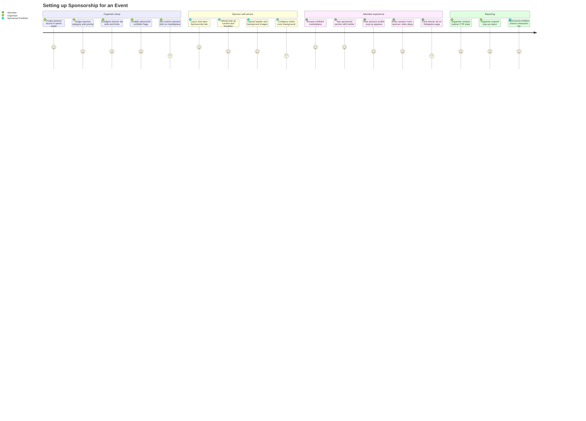
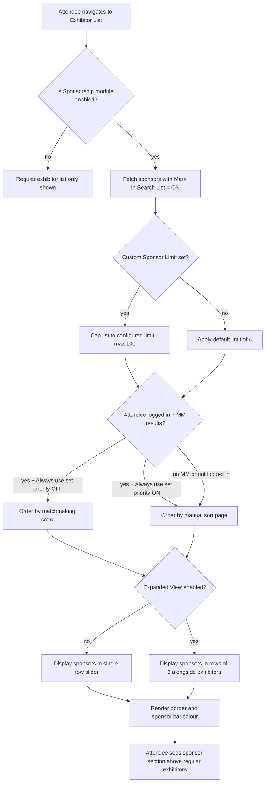
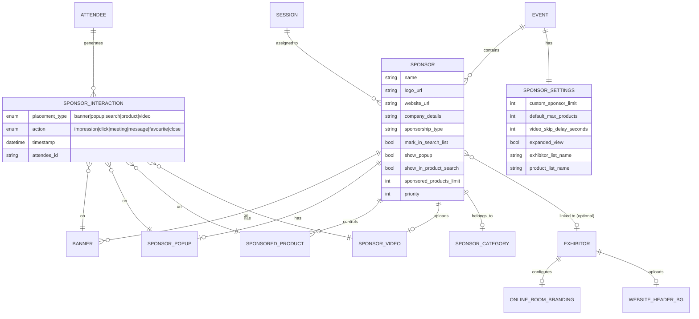
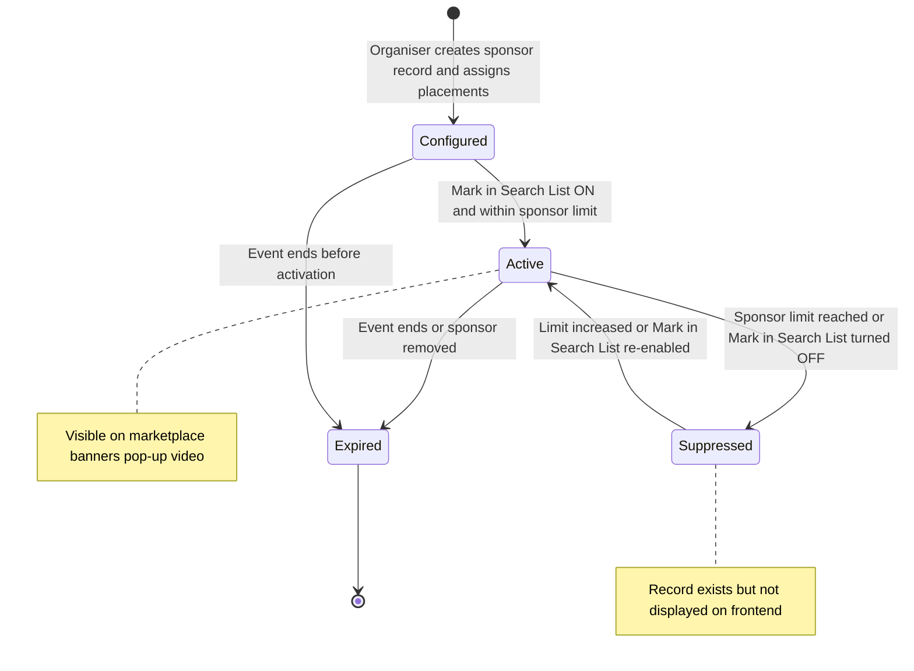
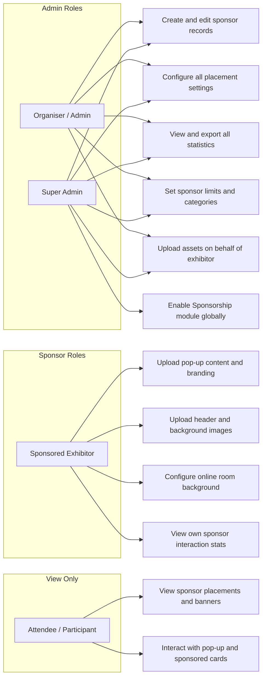

## 1. Product Overview

**Purpose.** The Sponsorship module enables event organisers to monetise platform real estate by offering a structured set of paid visibility placements to exhibitors and standalone sponsors. It surfaces sponsor brands across every key area of the platform — the exhibitor marketplace, product listings, session rooms, banners on system pages, pop-up cards, online meeting rooms, and the event website — and gives organisers granular control over which sponsors get which placements, limits, and display priorities.

**Problem being solved.** Without a unified sponsorship system, event organisers are forced to negotiate and manually fulfil ad-hoc visibility deals outside the platform (custom CSS, static pages, offline signage). This creates inconsistency in delivery, no measurable ROI for sponsors, and significant operational overhead. The Sponsorship module standardises every placement type, automates display logic (including matchmaking-aware ordering), and provides per-placement statistics for both the organiser and the sponsor.

**Business value.**
- Converts the platform itself into a revenue stream on top of registration and exhibition fees.
- Increases sponsor satisfaction by delivering measurable, data-backed impressions and click-through rates.
- Reduces operational effort: organiser sets placement rules once; the system handles ordering, limits, and rotation.
- Differentiates ExpoPlatform from competitors with richer, more trackable sponsorship tooling.
- Supports tiered sponsorship packages (categories, limits, presence across web and mobile app).

**Target users.**
- Event Organisers (admin panel) — configure sponsorship settings, create sponsor records, assign placements, view statistics.
- Exhibitors with sponsor status (frontend profile) — upload pop-up content, header/background images, online room branding.
- Sponsors without an exhibitor profile (admin-managed) — displayed via website builder sponsor blocks and banner placements.
- Attendees and participants (frontend) — passive recipients of sponsorship placements; interact with sponsor pop-ups, banners, and videos.

**User personas.**
- *Event Commercial Manager* — designs the sponsorship package tiers, sets limits, creates sponsor records and assigns categories.
- *Exhibitor/Sponsor Account Manager* — sets up pop-up content, uploads branding images, monitors sponsor stats on their interactions dashboard.
- *ExpoPlatform TAM / Support* — troubleshoots missing banners, incorrect display counts, and video skip configuration.
- *Event Attendee/Participant* — passively views banners, sponsor cards, and pop-ups; optionally interacts via meeting/message/favourite buttons.

**Success metrics.**
- Total sponsor impressions and CTR per event across all placement types.
- Number of active sponsors per event vs configured sponsor limit.
- Sponsor-to-attendee interaction rate (meeting requests, messages, favourites initiated via sponsor placements).
- Revenue generated from sponsorship packages per event.
- Organiser self-service rate (placements configured without TAM intervention).

---

## 2. Product Scope

### Included
- **Sponsor record management**: create standalone sponsors and convert exhibitors to sponsors; set company logo, website, details, and sponsorship type.
- **Sponsor categories**: create and assign sponsor-specific category labels used in website builder blocks.
- **Sponsored exhibitor designation**: mark exhibitor categories or individual exhibitors as sponsors with configurable sponsorship privileges.
- **Banner ads** (system pages and custom pages): placement on Exhibitors, Sessions, Delegates, Speakers, News, Floorplan pages; Top and Left positions; dimensions, links, disable-link option.
- **Sponsor pop-up**: configurable pop-up card on exhibitor profile pages with branding and one CTA button.
- **Sponsored exhibitor placement on marketplace**: separate sponsor section on the exhibitors list with slider or expanded view; custom display name; matchmaking-aware ordering.
- **Sponsored products**: dedicated section on the products list page; per-sponsor and global product limits.
- **Additional video in exhibitor profile**: uploaded video shown on exhibitor profile page.
- **Sponsor video in online session room**: pre-session video for sponsors on individual session rooms; skip delay; matchmaking-based rotation.
- **Online room customisation**: background image and font colour for sponsor's meeting room.
- **Background image for online rooms**: custom waiting-room image for meetings, sessions, and exhibitor events.
- **Website header and background images**: sponsored branding on the exhibitor's public page header and background.
- **Sponsored session block**: sponsor attribution visible on exhibitor profile and session cards.
- **Session sponsorship**: assign sponsor to individual sessions.
- **Sponsorship statistics for organisers**: banner, pop-up, search, product search, video stats with drill-down and export.
- **Sponsorship statistics for exhibitors (sponsors)**: per-user interaction view in the exhibitor's interactions dashboard.
- **Global Sponsor Limit on Marketplace**: configurable cap on sponsored exhibitor display (custom limit up to 100; default 4 shown with border).
- **Sponsor display settings**: expanded view toggle, custom block names, banner ad count per page.

### Excluded
- Mobile-app-only sponsorship types not covered in the web admin panel (referenced but not documented here; differences between web and app sponsorships exist).
- Billing and invoicing for sponsorship packages (handled outside the platform).
- Third-party ad-server integrations (e.g., Google Ads, DFP).
- Exhibitor registration configuration not related to sponsorship toggles (covered in Exhibitor Management product).
- Session content configuration beyond sponsor assignment (covered in Sessions product).
- Website builder configuration beyond sponsor block category filtering (covered in Event Website product).

---

## 3. User Roles

| Role | Sponsorship access | Restrictions |
| --- | --- | --- |
| **Super Admin / Admin (Organiser)** | Full: create/edit sponsors, set all placements, configure all settings, view all statistics, upload on behalf of exhibitor | Can set limits, categories, banner ad counts; manages all sponsor records |
| **Organiser (event-level admin)** | Create/edit sponsors for their event; configure settings; view all stats; export reports | Scoped to their event; cannot change global module management |
| **Sponsored Exhibitor (frontend)** | Upload pop-up content, header/background images, online room background and font; view their own sponsor interaction stats | Only sees own stats; can only manage placements enabled for their account by the organiser |
| **Regular Exhibitor** | No sponsorship configuration access | Cannot set sponsor placements unless designated as sponsor |
| **Sponsor (no exhibitor profile)** | No frontend self-management; all configuration done by organiser in admin | Cannot appear in Exhibitor Marketplace directly; appears only via sponsor block in Website Builder |
| **Attendee / Participant / Visitor** | View-only — sees banners, pop-ups, sponsored cards, videos | Cannot configure; interactions are tracked as impressions/clicks |
| **Speaker** | No sponsorship configuration access | — |
| **ExpoPlatform Staff (TAM/Support)** | Operational: configure on behalf of organiser; troubleshoot display and stats | Must not make unauthorised changes |

> [!INFO] The Sponsorship module must be enabled in Module Management for the relevant event. Session sponsorship is always configured inside individual session edit pages, not from the Sponsors management section.

---

## 4. Feature Inventory

#### 4.1 Creating and Managing Sponsor Records

**Description.** The sponsor management list at `admin/sponsors` (Management → Sponsors) is the central registry of all sponsors for an event. Sponsors can be standalone (no exhibitor account) or linked to an existing exhibitor.
**Why it exists.** Organisers need a single place to onboard sponsors, assign their assets, and control their visibility across the platform.
**User value.** Structured sponsor records enable consistent display across all placement types without per-placement rekeying.
**Functional logic.** Navigate Management → Sponsors → Add New Sponsors. Fields: company logo, website link, company details, sponsorship type, logo page allocation. Alternatively, click "Set Exhibitor as Sponsor" to elevate an existing exhibitor. Once elevated, the sponsor account is independent — changes in the exhibitor profile do not propagate to the sponsor account.
**Preconditions.** Organiser has admin access; Module Management has Sponsorship enabled.
**Trigger conditions.** Organiser clicks "Add New Sponsors" or "Set Exhibitor as Sponsor".
**Processing logic.** Standalone sponsor: stored in sponsor list only; visible in Website Builder sponsor blocks but not in Exhibitor Marketplace. Exhibitor-as-sponsor: separate account created; appears in both marketplace and sponsor placements depending on settings.
**Outputs.** Sponsor record in admin/sponsors/list; available for assignment to placements, categories, sessions, banners, and statistics.
**Dependencies.** Exhibitor records (for elevation); Module Management (Sponsorship enabled); Website Builder (for sponsor blocks).
**Configurations.** Logo, website URL, company details, sponsorship type, logo-to-page allocation, Sponsor Category, priority order.
**Validation rules.** Sponsor account changes do not sync to linked exhibitor account after elevation. Filters (standard and custom) persist across navigation until "Clear Filters" is clicked.
**Permissions.** Organiser/Admin.
**Error handling.** If sponsor not appearing in marketplace, check whether exhibitor-as-sponsor was created and "Mark in Search List" is enabled.
**Edge cases.** Standalone sponsor with no exhibitor profile cannot appear in the Exhibitor Marketplace; must use Website Builder sponsor block for website placement.

---

#### 4.2 Sponsor Categories

**Description.** A separate category taxonomy exclusive to sponsors and sponsored exhibitors, used to group sponsors and control which groups are shown in Website Builder sponsor blocks.
**Why it exists.** Organisers sell tiered packages (e.g., Gold, Silver, Bronze) and need a way to segment sponsors for display and reporting purposes without mixing with exhibitor categories.
**User value.** Enables visual hierarchy and targeted display of sponsor tiers on the event website.
**Functional logic.** Management → Sponsors → Categories → Add Category. Categories have no sub-settings (unlike exhibitor categories). In Website Builder, a sponsor block can be filtered to show only sponsors of a chosen category.
**Preconditions.** Sponsor category created before it can be assigned.
**Trigger conditions.** Organiser adds category; assigns to sponsor record.
**Processing logic.** For pure sponsors: category assigned in admin/sponsors/list profile. For sponsored exhibitors: assigned in admin/sponsors/list profile OR admin/exhibitors/list profile → Sponsorship tab (both paths are valid; individual level, not inherited from exhibitor category).
**Outputs.** Category label visible in Supplier Overview analytics (Sponsor Category column); used as filter in Website Builder sponsor block.
**Dependencies.** Website Builder (for block filtering); Organiser Analytics Supplier Overview.
**Validation rules.** Category is individual-level only; does not inherit from or interact with exhibitor categories. If sponsor not displaying on website, verify category assignment and that Website Builder block is configured for that category.
**Permissions.** Organiser/Admin.
**Edge cases.** A sponsored exhibitor has their sponsor category set independently of their exhibitor category — changing exhibitor category does not affect sponsor category.

---

#### 4.3 Sponsored Exhibitor Designation

**Description.** The "Is Sponsor" mechanism that grants exhibitors sponsor privileges: separate placement on the marketplace, pop-up capability, product listing prominence, and branding options.
**Why it exists.** Sponsors who are also exhibitors need elevated visibility beyond their standard exhibitor listing.
**User value.** Differentiates paying sponsors from regular exhibitors with a visual border and dedicated placement section.
**Functional logic.** Enabled at two levels: (1) Category level — Registration Settings → Exhibitor → Categories → gear icon → "Is Sponsor" toggle; (2) Individual level — Management → Exhibitors → exhibitor profile.
**Preconditions.** Exhibitor must exist; organiser enables "Is Sponsor" toggle.
**Trigger conditions.** Toggle enabled at category or individual level.
**Processing logic.** At category level, all exhibitors in that category get sponsor privileges. At individual level, the specific exhibitor gets privileges. Individual level takes precedence over category level for conflicts. Sponsor border colour is configured at Event Setup → New UI Settings → Theme Colours → "Sponsor bar Web" and "Sponsor bar App".
**Outputs.** Exhibitor appears in dedicated sponsor section on exhibitor list; sponsor statistics tabs available; sponsor-specific features unlocked.
**Dependencies.** Exhibitor registration settings; Theme Colours configuration; Matchmaking (for ordering).
**Configurations.** Is Sponsor toggle; Show Sponsor Pop-up; Show in Search List; Show in Product Search List; Sponsored Products Limit; Banners; Sponsor Category; Matchmaking/Product Categories; Sponsor Video for Online Room.
**Validation rules.** Matchmaking/Product Categories field is disabled on sponsored exhibitor profile — the system automatically uses the exhibitor's own matchmaking categories. Must also enable "Sponsor Video" under Registration → Exhibitor → Additional Settings before per-sponsor video option appears.
**Permissions.** Organiser/Admin.
**Error handling.** Sponsor not appearing on marketplace: check "Mark in Search List" toggle per sponsor in admin/sponsors/list. Wrong category weight in MM: allow time for category change propagation.
**Edge cases.** Sponsored exhibitors always display in card view; display format of regular exhibitors can be changed by view buttons but not sponsors. "Default Number of Items to Show" setting in admin/general/settings has no effect on sponsored exhibitors.

---

#### 4.4 Sponsor Limit on Marketplace

**Description.** Controls the maximum number of sponsored exhibitors displayed on the exhibitor list (marketplace).
**Why it exists.** Without a limit, a large sponsor roster could crowd the marketplace and degrade the attendee browsing experience.
**User value.** Organiser can calibrate how many sponsored slots are visible, protecting both commercial commitments and UX.
**Functional logic.** Default = 4 sponsors shown with differentiating border. Custom limit configured at Management → Sponsors → Settings → "Custom Sponsor Limit on Marketplace" (also accessible via admin/registration/settings). If the event has 20 sponsors but limit is 10, the system shows the first 10 based on matchmaking results or the manual sort order.
**Preconditions.** Sponsor records exist and "Is Sponsor" enabled for relevant exhibitors.
**Trigger conditions.** Sponsor limit setting saved.
**Processing logic.** Limit applies to both web and app. Cannot exceed 100. Up to 100 sponsors displayed in a single-row slider (default); up to 24 in expanded view (6 per row). Slider: interaction buttons shown on hover only; max 6 cards visible in viewport at once.
**Outputs.** Visible sponsor section on exhibitor list page capped at configured limit.
**Dependencies.** Matchmaking service (for ordering); admin/sponsors/sort/search-exhibitors (manual ordering).
**Configurations.** Custom Sponsor Limit on Marketplace; Expanded View for sponsor cards toggle.
**Validation rules.** Limit cannot exceed 100. Expanded View capped at 24 (6×4 rows shown simultaneously). Slider displays up to 100.
**Permissions.** Organiser/Admin.
**Error handling.** If more sponsors than limit, excess sponsors are suppressed based on MM or sort order.
**Edge cases.** If "Always use set priority" is ON and MM results exist, manual sort order overrides MM. "Matchmaking sorting on Marketplace" toggle has no effect on sponsored exhibitors — MM is handled differently for sponsors.

> [!INFO] The note "Increasing Sponsor Limit to 150" referenced in the Jira backlog is a requested enhancement. The current documented maximum is 100. This limit applies to both web and app.

---

#### 4.5 Banner Ads

**Description.** Image-based advertisements placed on designated system pages (Exhibitors, Sessions, Delegates, Speakers, News, Floorplan) at Top or Left positions, and on custom pages via Website Builder banner blocks.
**Why it exists.** Banners are the most universally recognised sponsorship placement type and provide broad impression coverage across the platform.
**User value.** Sponsors gain brand visibility every time an attendee browses any major section of the event.
**Functional logic — system page banners.** Uploaded at admin/sponsors (per-sponsor profile), synchronised with exhibitor profile Sponsorship page. Settings at Management → Sponsors → Settings → Banner Ad Settings control whether 1 or 2 banners appear per page/position. If 2 banners set but only 1 sponsor has a banner for that position, that single banner renders larger than it would in a 1-banner configuration.
**Functional logic — custom page banners.** Added via Banner block in Website Builder. Configurable: 1/2/3 banners per row, upload images, assign links, set rotation duration, choose carousel type (Default / Carousel / Carousel with Dots / Carousel with Numbers), Fit or Fill cropping, full-screen stretch option. Banners rotate automatically; no page refresh required.
**Dimensions (system page banners).**

| Position | Desktop | Tablet | Mobile |
| --- | --- | --- | --- |
| Full width (Top) | 1107×100 px | 991×120 px | 500×200 px |
| Half width (Top, 2-banner) | 530×100 px | 991×120 px | 500×200 px |
| Left Side | 275×275 px | 767×1750 px | 767×1750 px |

**Preconditions.** Sponsor record created; banner image uploaded.
**Trigger conditions.** Attendee navigates to a page where banners are configured.
**Processing logic.** On page load, banner impressions counted once. Switching between tabs on the same page does not re-count impressions. If using "Use external page visit warning" (admin/general/settings → Security), a warning dialog is shown before redirecting users who click a banner link. "Disable Link" toggle prevents redirect and stops click tracking.
**Outputs.** Banner displayed on configured pages; impressions and click stats in admin/sponsors/statistics/banner.
**Dependencies.** admin/sponsors for upload and configuration; admin/general/settings (external page warning); Website Builder (custom page banners).
**Configurations.** Upload image; link URL; Disable Link toggle; 1-or-2 banner setting per page; custom page carousel type and duration.
**Validation rules.** Stats tracked only for system page banners (not custom page banners). Disable Link = no redirect and no click tracking.
**Permissions.** Organiser/Admin uploads banners; sponsor stats visible to organiser.
**Error handling.** If 2-banner mode is set and only 1 sponsor has a banner, that banner renders at wider dimensions automatically.
**Edge cases.** All sponsors (standalone and exhibitor-sponsors) can have banners regardless of type. Banners and carousels are responsive and adapt to mobile layouts.

---

#### 4.6 Sponsor Pop-up

**Description.** A configurable overlay card displayed to attendees when they visit a sponsored exhibitor's profile page.
**Why it exists.** Gives sponsors a guaranteed high-visibility moment at the point of profile engagement with a single focused CTA.
**User value.** Drives targeted interactions (meeting request, message, or favourite) at the most relevant moment — when an attendee is already viewing the sponsor's profile.
**Functional logic.** Enabled by organiser via "Show Pop-up in Profile" toggle, at individual level (Management → Sponsors → sponsor profile) or at category level (Registration Settings → Exhibitor → Exhibitor Categories → gear icon). Individual-level setting supersedes category-level. Once enabled, the exhibitor configures the pop-up content themselves on the frontend under Profile Info → Sponsorship → Sponsor Pop-Up Card.
**Preconditions.** "Show Pop-up in Profile" enabled; exhibitor has logged in to set up content.
**Trigger conditions.** Attendee visits the exhibitor's profile page.
**Processing logic.** Pop-up card is displayed. Only one action button can be selected (favourite, meet, or message). If the attendee's account permissions do not allow meeting or messaging, those buttons will not work — must verify permissions matrix.
**Outputs.** Pop-up shown to attendee; interaction (close/meeting/message/favourite) recorded in stats.
**Dependencies.** Exhibitor permissions (meeting/messaging); admin/sponsors/statistics (for stats).
**Configurations.** Logo, Text, Image alignment (left/right), Action button choice (one of: favourite/meet/message), Button alignment, Text size, Border Radius, Button height, Button color, Text color, Border color, Hover color, Hover text color.
**Validation rules.** Pop-up page available on frontend only when "Show Pop-up in Profile" is enabled. Organiser-level and category-level both checked if pop-up not showing — individual takes precedence.
**Permissions.** Organiser enables; sponsored exhibitor configures content.
**Error handling.** If pop-up not appearing: check both individual and category-level toggles. If meet/message button non-functional: check exhibitor's meeting/messaging permissions in permissions matrix.
**Edge cases.** Category-level enabling gives pop-up access to all exhibitors in that category; individual disable on top of category enable will hide pop-up for that specific exhibitor.

---

#### 4.7 Sponsored Products

**Description.** A dedicated section at the top of the products list page showing sponsored exhibitors' products in a card view with a distinct border.
**Why it exists.** Sponsors need product-level visibility, not just exhibitor-level; this drives discovery of specific products they want to highlight.
**User value.** Attendees see sponsored products first, improving sponsor ROI from product-focused events.
**Functional logic.** "Show in Product Search List" setting enables placement; configurable in sponsor profile and in admin/sponsors/list (synchronised). Individual Sponsored Products Limit per sponsor overrides the Default max number of sponsored exhibitor products in admin/sponsors/settings. Frontend warning message informs exhibitor when they have reached their limit.
**Preconditions.** Sponsor has "Is Sponsor" enabled; "Show in Product Search List" is on; products are published.
**Trigger conditions.** Attendee navigates to the products list page.
**Processing logic.** Up to 6 sponsored products displayed per row. For >6 products, auto-scroll enabled. For ≤6, no scroll. Products appear in both sponsored section and regular section if a regular product is also sponsored. Search and filters apply to both sections. Pagination applies to regular products only. Interaction buttons visible on hover.
**Outputs.** Sponsored products displayed in dedicated section above regular products; interaction stats in Product Search Statistics.
**Dependencies.** Product records; admin/sponsors/settings (default limit); admin/sponsors/sort/search-products (order); matchmaking service.
**Configurations.** Show in Product Search List (per sponsor); Sponsored Products Limit (per sponsor, overrides default); Default max number of sponsored exhibitor products (global default).
**Validation rules.** Individual limit overrides global default. "Matchmaking sorting on Marketplace" toggle has no effect on sponsored products. Sorting is controlled by MM results and admin/sponsors/sort/search-products configuration.
**Permissions.** Organiser configures; sponsored exhibitor may manage which products are sponsored via their profile.
**Error handling.** Sponsored products not displaying: verify "Show in Product Search List" is on in both sponsor profile and admin/sponsors/list. Check that limit is not exceeded.
**Edge cases.** A product that is both regular and sponsored appears in both sections. Card view cannot be changed by attendee for sponsored products (view buttons apply to regular products only).

---

#### 4.8 Website Header and Background Images

**Description.** Sponsored exhibitors can upload a custom header image (displayed at the top of their profile page) and a background image (displayed as the page background), enhancing their brand presence on the event website.
**Why it exists.** Differentiates sponsored exhibitor profiles visually from non-sponsors, delivering a premium look-and-feel as part of the sponsorship package.
**User value.** Sponsors stand out on the marketplace with branded profile pages; attendees have a richer engagement experience.
**Functional logic.** Permissions granted at category level (Registration Settings → Exhibitor → Exhibitor categories → gear icon → enable header/background toggle) or individual level (Management → Exhibitors → Exhibitor Settings). Exhibitor with sponsorship status and granted permissions accesses image upload via Sponsorship → "Public page branding" on their frontend profile. Admin can also upload on behalf of the exhibitor. Admin-panel and frontend uploads are bidirectionally synchronised.
**Preconditions.** Exhibitor has sponsorship status; header/background image permissions granted at category or individual level.
**Trigger conditions.** Exhibitor uploads image on frontend or organiser uploads in admin panel.
**Processing logic.** Images sync between admin and frontend. Attendees see the header at the top of the exhibitor's profile page; background renders behind all profile content.
**Outputs.** Branded exhibitor profile page visible to all attendees.
**Dependencies.** Exhibitor sponsorship status; category/individual-level permission toggle; frontend profile Sponsorship tab.
**Configurations.** Header: PNG/JPG, up to 2 MB, aspect ratio 7.2:1. Background: PNG/JPG, up to 2 MB, aspect ratio 1.7:1.
**Validation rules.** Exhibitor must have sponsorship status AND permission to upload images (category or individual toggle enabled).
**Permissions.** Organiser enables; sponsored exhibitor uploads.
**Error handling.** Exhibitor missing "Public page branding" tab: check sponsorship status on individual or category profile. Image not rendering correctly: verify aspect ratio matches specs.
**Edge cases.** Deleting an image in one location (admin or frontend) deletes it in the other due to bidirectional sync.

---

#### 4.9 Sponsor Video in Online Session Room

**Description.** A short video played in the online session room waiting area before attendees can click "Continue" to enter the session, giving the sponsor a captive audience moment.
**Why it exists.** Session rooms have a guaranteed pre-entry dwell period; sponsors can use this to deliver an unmissable brand message before content begins.
**User value.** High-impact, skip-resistant (up to configurable duration) pre-roll video placement for sponsors.
**Functional logic.** Admin uploads the sponsored video on the sponsor's page in Management/Sponsors. Video is only played for sessions where the sponsor is assigned (session setup page in Management/Sessions). Skip delay configured at Management → Sponsors → Settings → "Duration Before Sponsored Video Can Be Skipped" (default: 0 seconds, not blocked; max set by organiser). Countdown shown next to "Continue" button. Pausing the video pauses the countdown. Cannot fast-forward or rewind; volume and pause only.
**Preconditions.** Sponsor has a video uploaded; sponsor is assigned to the specific session.
**Trigger conditions.** Attendee enters online session room.
**Processing logic — video selection.** If matchmaking results exist from sponsors with videos for that user: show highest-MM-score video. Note the video ID; on next room entry, remove that sponsor from the pool. Continue until 10 sponsors removed or no more MM results; then pool resets. If no MM results: show highest-priority sponsor (by Priority in Search List in Management/Sessions). Same exclusion logic applies. Pool resets when all sponsors exhausted.
**Processing logic — skip logic.** If skip delay > video length, "Continue" button becomes active after the video ends (not the full delay). If no video exists but skip delay is set, "Continue" button stays active. Sponsor bar (name, logo, link button to sponsor page in new tab) displayed during video.
**Outputs.** Sponsored video played; Show Total (views) and Click Total (name/logo clicks) in Video Statistics.
**Dependencies.** Session configuration (sponsor assignment); Management/Sessions Priority in Search List; Matchmaking service.
**Configurations.** Video file (MP4/WebM, ≤50 MB); skip delay (seconds); session-level sponsor assignment.
**Validation rules.** Video not shown if sponsor not added to specific session. Formats: MP4 or WebM only. File size: ≤50 MB.
**Permissions.** Organiser uploads and configures; attendee is the viewer.
**Error handling.** If "Continue" button blocked but no video: check if sponsor-assigned sessions have videos uploaded. Stale display: clear cache via admin/general/clearcache.
**Edge cases.** If skip delay shorter than video, video plays in full with "Continue" available once video ends. MM pool cycles ensure no single sponsor dominates across all a user's session room visits.

---

#### 4.10 Online Room Customisation (Background Image + Font Colour)

**Description.** Sponsored exhibitors can set a custom background image and font colour for their online meeting room, seen by attendees waiting to be admitted.
**Why it exists.** The meeting room waiting area is valuable brand space; sponsors using virtual meeting rooms can fully brand their space.
**User value.** Consistent brand experience for attendees entering a sponsor's private meeting room.
**Functional logic.** Organiser enables "Online Room Customization" in the exhibitor profile (Admin Panel → Management → Exhibitors → Exhibitor Profile → Exhibitor Settings → Show Room Section → Online Room Customization ON). Exhibitor then accesses customisation at Profile Info → Sponsorship Tab → Online Room Settings. Preview function available before saving.
**Preconditions.** (1) Exhibitor has sponsorship status; (2) "Allow customize room for exhibitors" enabled at admin/registration/esettings → Registration Settings → Exhibitor → Additional Settings.
**Trigger conditions.** Exhibitor accesses Online Room Settings on their frontend profile.
**Outputs.** Custom background and font colour rendered in the sponsor's online meeting room.
**Dependencies.** Exhibitor sponsorship status; admin/registration/esettings setting; frontend Sponsorship tab.
**Configurations.** Background image (PNG/JPG/JPEG, aspect ratio 1.7:1); font colour.
**Validation rules.** Both preconditions must be met. "Online room settings" tab hidden if "Allow customize room for exhibitors" is disabled.
**Permissions.** Organiser enables; sponsored exhibitor configures.
**Error handling.** Tab missing on frontend: verify both preconditions (sponsorship status + Allow customize room setting).
**Edge cases.** Cache may delay changes — clear via admin/general/clearcache.

---

#### 4.11 Sponsored Session Block on Exhibitor Profile

**Description.** When an exhibitor is assigned as sponsor to one or more sessions, a "Sponsored Session Block" automatically appears on their exhibitor profile, listing those sessions. If the exhibitor sponsors Exhibitor Events, a "Sponsored Event Block" also appears.
**Why it exists.** Surfaces the sponsor's session connection to profile visitors, increasing session discoverability and reinforcing the sponsor's content authority.
**User value.** Attendees browsing a sponsor's profile can see — and click through to — sessions the sponsor is affiliated with.
**Functional logic.** Organiser assigns sponsor to a session at the session edit page: Management → Sessions → session edit → Sponsor dropdown → Save. Sponsor then appears on the session card on `/newfront/sessions`. The Sponsored Session Block renders automatically on the exhibitor profile once the sponsor-session link is saved.
**Preconditions.** Sponsor exists; session exists; organiser assigns sponsor on session edit page.
**Trigger conditions.** Sponsor saved to session; exhibitor profile page loaded.
**Outputs.** Sponsored Session Block on exhibitor profile; sponsor name/logo visible on session card.
**Dependencies.** Session management module; exhibitor profile frontend.
**Validation rules.** Assignment is done inside the session edit page, NOT from the Sponsors section — this is the most commonly missed step.
**Permissions.** Organiser configures session sponsorship.
**Error handling.** Block not appearing: confirm sponsor is saved to the specific session (not just created in sponsor list). Clear cache if delay.
**Edge cases.** Multiple sessions sponsored by the same exhibitor all appear in the single Sponsored Session Block. Exhibitor Events sponsored appear in a separate Sponsored Event Block.

---

#### 4.12 Sponsorship Statistics for Organisers

**Description.** Dedicated statistics module at `admin/sponsors/statistics` providing per-placement performance data across all sponsor types.
**Why it exists.** Organisers must be able to report sponsor ROI to justify sponsorship pricing and renewal.
**User value.** Single dashboard covering all sponsorship placements with date-range filtering, sponsor-level drill-down, and export capability.
**Functional logic.** Sub-tabs: Banner Statistics, Pop-Up Statistics, Search Statistics, Product Search Statistics, Video Statistics. Each sub-tab: search for specific sponsor, choose date range, download report. Expanding a sponsor in the list shows per-participant interaction details (name, role, date, button used); "More Details" shows timestamp-level action log.
**Key metric definitions.**
- Line item lifetime impressions: number of times users saw the banner.
- Line item lifetime clicks: number of times users clicked the banner.
- CTR: (clicks / impressions) × 100%.
- Pop-Up stats: close / meeting / message / favourite counts per sponsor.
- Search stats: click / meeting / message / favourite on sponsor cards in exhibitor list.
- Product Search stats: click / meeting / message / favourite on sponsored product cards.
- Video stats: Show Total (views) + Click Total (name/logo clicks).
**Important tracking rule.** Clicks are tracked, not actions. Clicking "Meeting" but cancelling before submitting = +1 click counted.
**Slider impression rules.** Views recorded only for sponsors visible to users as they scroll the slider. Seeing the same 5 sponsors without refreshing = 1 show for all 5. Page refresh or re-navigation = additional show.
**Outputs.** On-screen stat tables; downloadable export file per sub-tab with impression/click totals.
**Dependencies.** Sponsor placement configuration; event participation data.
**Configurations.** Date range selector; sponsor search; export button.
**Permissions.** Organiser/Admin only.
**Error handling.** Empty sub-tab stats: verify that the sponsor actually has that placement type configured for the event.

---

#### 4.13 Sponsorship Statistics for Exhibitors (Sponsor View)

**Description.** Exhibitors with sponsor status see additional statistics tabs in their interactions dashboard on the frontend.
**Why it exists.** Sponsored exhibitors are paying commercial partners; they need visibility into how their placements are performing to justify renewal.
**User value.** Sponsors can self-serve their performance data without requesting a report from the organiser.
**Functional logic.** Additional tabs in interactions dashboard: Banner Statistics, Search Statistics, Product Search Statistics. All tabs are shown for every sponsor but only the tabs matching the sponsor's active placements are populated. Unlike organiser stats, these tabs show a list of individual users who interacted rather than aggregate totals. Hovering over the checkmark shows the date and time of each interaction.
**Outputs.** Per-user interaction list; hover reveals interaction timestamp.
**Dependencies.** Exhibitor sponsorship status; admin-side stat recording.
**Validation rules.** Empty tab likely means that placement type is not active for that exhibitor; check sponsorship configuration, not a bug.
**Permissions.** Sponsored exhibitor only (not regular exhibitors).
**Error handling.** Tab populated but incorrect data: team members assigned to a product — meeting/message clicks on product card are still attributed to the sponsor.
**Edge cases.** Pop-up close (no action taken) is recorded separately in organiser stats but not as an "interaction" for the exhibitor tab.

---

#### 4.14 Additional Video in Exhibitor Profile

**Description.** Allows sponsored exhibitors to upload a video to their exhibitor profile page, giving their listing richer multimedia content.
**Why it exists.** Video engages attendees longer on a sponsor's profile page and communicates brand/product stories more effectively than text and images alone.
**User value.** Increased profile dwell time; more engaging sponsor presence.
**Functional logic.** Admin enables "Allow additional video" at admin → registration → exhibitor registration → additional settings. Max upload size configured in admin/general/settings → Server settings. Category-level override: "Do not allow additional video" toggle in exhibitor category settings suppresses video for all exhibitors in that category regardless of global setting. Individual level: per-exhibitor control (when released, provides granular control beyond the category toggle).
**Preconditions.** "Allow additional video" enabled at global level; category-level "Do not allow additional video" is not blocking.
**Trigger conditions.** Exhibitor uploads video via their frontend profile.
**Outputs.** Video displayed on exhibitor profile page.
**Dependencies.** Server storage (max upload size in admin/general/settings); exhibitor category settings.
**Configurations.** Global allow/disallow toggle; category-level disallow toggle; max upload size.
**Validation rules.** Category-level "Do not allow" overrides global "Allow". Video file must not exceed max upload size; format must be supported by the platform.
**Permissions.** Organiser enables; sponsored exhibitor uploads.
**Error handling.** Upload failure: check file size against server setting. Format issue: verify supported formats. Visibility issue: check both global and category toggles.

---

## 5. User Stories Mapping

> [!INFO] Only 5 in-scope Jira stories are mapped to Sponsorship. The product is primarily governed by Confluence documentation (19 pages fetched). The table below covers all 5 stories from stories.json. All are COMPLETE.

| Story ID | Title | Summary | Acceptance criteria (from description) | Related feature | Status |
| --- | --- | --- | --- | --- | --- |
| EP-8019 | Sponsorship banner for NEW UI Floorplan | Enable sponsor banners on both the Global page and Hall page of the new UI floor plan | "Is Sponsor" toggle in Management/Sponsors enables banner creation for floor plan; checkbox on floor plan in banner settings activates the banner for a specific sponsor | 4.5 Banner Ads (Floorplan position) | COMPLETE |
| EP-11115 | Sponsor banners in profile | Add sponsor banner display to each page of "My Profile" section; two variants: 1 banner top or 2 banners top | Sponsor banners rendered on each My Profile page in the configured variant (1 or 2 at top) | 4.5 Banner Ads (profile pages) | COMPLETE |
| EP-18978 | Choosing the way sponsors displayed | Allow organiser to control whether sponsors appear as a slider or in expanded list view; add "Slider for sponsors" toggle in admin/sponsors/list | "Slider for sponsors" toggle in admin panel; spacing between sponsor list and "Add New Sponsors" button increased | 4.4 Sponsor Limit / Display Settings | COMPLETE |
| EP-20725 | Buttons for Sponsor cards on Marketplace | Restore interaction buttons (meeting/message/favourite) on sponsor and sponsored product cards after they were removed during a UI separation; restore empty interaction stats | Interaction buttons visible on sponsor cards in Marketplace and on sponsored product cards; stats no longer empty | 4.3 Sponsored Exhibitor, 4.7 Sponsored Products | COMPLETE |
| EP-23935 | Look of sponsors and sponsored products stats in export file | Fix confusing layout of sponsor stats in the export file; two proposed layout options for clearer presentation | Export file shows sponsor and sponsored product stats in a clear, unambiguous format | 4.12 Sponsorship Statistics for Organisers | COMPLETE |

---

## 6. End-to-End Workflows

### User journey — setting up and activating a sponsorship package

### System workflow — sponsored exhibitor display on marketplace

### Happy path
Organiser creates sponsor, assigns category, enables "Is Sponsor" for exhibitor, sets banners and pop-up permissions, configures sponsor limit. Sponsored exhibitor logs in, uploads pop-up and branding images. Attendees visit the event site, see the sponsor section on the marketplace, view sponsor profiles with pop-up, interact (meeting/message/favourite), and encounter pre-roll sponsor video in session rooms. Organiser reviews stats with full impressions/click data; exports report for the sponsor.

### Alternate paths
- Sponsor without exhibitor profile: organiser adds standalone sponsor; no marketplace listing; sponsor appears via sponsor block in Website Builder; banners still work.
- Organiser enables Expanded View: sponsors appear in rows of 6 instead of slider; max 24 visible in expanded view.
- Organiser disables "Use external page visit warning": banner clicks redirect directly without a warning dialog.
- Attendee not logged in: sponsors displayed in manual sort order (not MM-personalised).

### Exception paths
- Sponsor limit reached: additional sponsors do not appear; organiser must raise limit or remove existing sponsor.
- Video file > 50 MB: upload rejected; sponsor must compress or reformat.
- Sponsor video skip delay set but no video uploaded to session: "Continue" button remains active; no video shown.
- Session sponsor not assigned inside session edit page: no Sponsored Session Block on exhibitor profile.

### Recovery paths
- Missing banner impressions: check whether banner is uploaded and dimensions match spec; clear cache.
- Pop-up not appearing: verify both individual and category-level "Show Pop-up in Profile" toggles; confirm exhibitor has set up pop-up content on frontend.
- Stats not updating: click tracking is near-real-time; slider rule means visible-only sponsors are counted — check if sponsor is within viewport.
- Stale changes after config update: clear cache via admin/general/clearcache.

---

## 7. Business Rules Engine

| # | Rule | Condition | Exception / Priority | Conflict resolution |
| --- | --- | --- | --- | --- |
| BR-1 | Individual-level sponsor setting supersedes category-level | When both category and individual settings are configured | Individual always wins | Individual-off overrides category-on; individual-on overrides category-off |
| BR-2 | Custom Sponsor Limit on Marketplace cannot exceed 100 | Any configuration attempt | None | System enforces max 100 |
| BR-3 | Sponsored exhibitors always display in card view only | On exhibitor list page | View buttons apply to regular exhibitors only | Card view locked for sponsored section |
| BR-4 | Pagination applies only to regular exhibitors, not sponsors | On exhibitor list page | None | Sponsors not paginated |
| BR-5 | "Matchmaking sorting on Marketplace" toggle does not affect sponsors | Any sorting configuration | None | Sponsor ordering governed by MM directly and manual sort page |
| BR-6 | "Default Number of Items to Show" in admin/general/settings does not affect sponsors | Sponsor display | None | Sponsors governed by Custom Sponsor Limit |
| BR-7 | Individual Sponsored Products Limit overrides global default | Per sponsor vs global setting | Global default applies only when no individual limit is set | Individual limit always takes precedence |
| BR-8 | Clicks are counted, not completed actions | Any sponsor interaction button click | A user clicking "Meeting" without submitting = +1 click | Cannot be changed; by design for impression tracking |
| BR-9 | Banner impressions counted once per page load per session | User navigating between tabs on same page | Tab switch does not re-count | Banner counted on initial page load only |
| BR-10 | Slider impression rules: only visible sponsors counted | Sponsor in slider not scrolled into view | None | Sponsors not visible = no impression recorded |
| BR-11 | Sponsor video shown only for sessions where sponsor is assigned | Attendee enters session room | No video if sponsor not assigned to that session | Assignment must be done inside session edit page |
| BR-12 | Session sponsorship must be configured inside session edit, not from Sponsors section | Sponsor-session assignment | No other path | Most commonly missed step |
| BR-13 | Sponsored exhibitor's Matchmaking/Product Categories auto-populated from exhibitor profile | Sponsored exhibitor configuration | Field disabled on sponsor profile | Cannot be manually overridden on sponsor profile |
| BR-14 | Standalone sponsor account and associated exhibitor account are independent after elevation | Exhibitor elevated to sponsor | No sync post-elevation | Changes in one do not propagate to the other |
| BR-15 | Sponsor category is individual-level only and does not depend on exhibitor category | Category assignment | None | Changing exhibitor category has no effect on sponsor category |

---

## 8. Data Model

### Entity relationships

**Inputs.** Sponsor record data; banner image assets; pop-up configuration; product limit settings; session-sponsor assignments; attendee interaction events.
**Outputs.** Sponsor placements rendered on frontend pages; statistics records; export reports.
**Lifecycle states.** A sponsor record is created → configured (placements enabled) → active (visible on frontend) → deactivated (Mark in Search List = OFF or limit reached) → archived (removed from event).

### Sponsorship placement lifecycle — state diagram

---

## 9. Permissions Matrix

### Permission flow

### Role × Capability table

| Capability | Organiser/Admin | Super Admin | Sponsored Exhibitor | Regular Exhibitor | Attendee |
| --- | --- | --- | --- | --- | --- |
| Create/edit sponsor records | ✅ | ✅ | ❌ | ❌ | ❌ |
| Configure banner placements | ✅ | ✅ | ❌ | ❌ | ❌ |
| Enable pop-up at category/individual level | ✅ | ✅ | ❌ | ❌ | ❌ |
| Set sponsor limit and display settings | ✅ | ✅ | ❌ | ❌ | ❌ |
| Assign sponsor categories | ✅ | ✅ | ❌ | ❌ | ❌ |
| Assign sponsor to session | ✅ | ✅ | ❌ | ❌ | ❌ |
| Upload sponsor video for session room | ✅ | ✅ | ❌ | ❌ | ❌ |
| View all sponsor statistics + export | ✅ | ✅ | ❌ | ❌ | ❌ |
| Upload pop-up content on frontend | ❌ | ❌ | ✅ | ❌ | ❌ |
| Upload header/background images | ✅ (on behalf) | ✅ | ✅ (own) | ❌ | ❌ |
| Configure online room background | ❌ | ❌ | ✅ | ❌ | ❌ |
| View own interaction stats (frontend) | ❌ | ❌ | ✅ | ❌ | ❌ |
| View/interact with sponsor placements | ❌ | ❌ | ❌ | ❌ | ✅ |
| Enable Sponsorship module globally | ❌ | ✅ | ❌ | ❌ | ❌ |

---

## 10. Integrations

| Integration | Purpose | Trigger | Data exchanged | Failure handling | Retry | Security |
| --- | --- | --- | --- | --- | --- | --- |
| **Exhibitor Marketplace** | Displays sponsored exhibitors in dedicated section above regular exhibitor list | Attendee loads exhibitor list page | Sponsor flags, limit, sort order, MM scores | Sponsors not shown; regular list still renders | Retry on page refresh | Scoped to event; session-authenticated |
| **Matchmaking Engine** | Orders sponsored exhibitors and sponsored products based on attendee-sponsor relevance score | Marketplace/products page load for logged-in attendees | Attendee interest profile; sponsor matchmaking categories | Falls back to manual sort order if MM unavailable | Automatic on next page load | Internal service; attendee session required |
| **Session Management** | Surfaces sponsor-session links and plays sponsor video in session rooms | Session edit (assignment); attendee enters session room | Sponsor ID, session ID, video file, skip delay | No video shown if sponsor not assigned or file missing | Manual re-assignment by organiser | Admin authentication for assignment; frontend session auth for video |
| **Website Builder** | Displays sponsor blocks and custom page banners on event website | Website Builder configuration; page load | Sponsor category filter, banner assets, carousel settings | Sponsor block empty if category not assigned | Config update + cache clear | Admin authentication |
| **Statistics Engine** | Records all sponsor interaction events (impressions, clicks, actions) | Attendee interacts with any sponsor placement | Placement type, action type, sponsor ID, attendee ID, timestamp | Stats gap if tracking event lost | Near-real-time; no manual retry | Internal event bus; no PII in stat records |
| **Event Website Frontend** | Renders banners on system pages (Exhibitors/Sessions/Delegates/Speakers/News/Floorplan) | Attendee navigates to a system page | Banner image, link URL, page position, 1-or-2 banner setting | Banner not shown if image not uploaded | Page refresh | Session-authenticated frontend |
| **Mobile App** | Subset of web sponsorship features available on mobile; border colour configured separately | App launch / page load | Sponsor bar colour (app), sponsored exhibitor/product flags | Mobile-only gaps noted in source (no further details in this scope) | App re-launch | Mobile session auth |
| **Cache Layer** | Serves sponsor configuration and display data at scale | Sponsor config saved | All sponsor settings and asset references | Stale config shown until cleared | Manual cache clear via admin/general/clearcache | Internal; organiser-triggered |

---

## 11. Notifications

> [!INFO] The Sponsorship module does not have a dedicated notification workflow documented in Confluence. No email, SMS, push, or in-app alerts are triggered to sponsors or attendees by the sponsorship system itself. Interaction data (clicks, meetings, messages) flows into the Statistics engine but does not fire user-facing notifications. Attendees receive normal meeting-confirmation and message notifications through the Meetings and Messaging products when they interact via sponsor CTA buttons — those notifications are not part of this module.

The following event-driven in-platform moments are relevant:
- **Sponsor video "Continue" countdown**: visible countdown timer in session room waiting area — an in-UI cue, not a notification.
- **Frontend warning on sponsored products limit**: a warning message is shown to the exhibitor on their frontend profile when they have reached the maximum number of sponsored products.
- **External page visit warning**: if enabled in admin/general/settings, a dialog warns attendees before redirecting them to an external URL via a banner link click.

---

## 12. Reporting & Analytics

### 12.1 Banner Statistics (Organiser)

| Item | Detail |
| --- | --- |
| Location | admin/sponsors/statistics → Banner Statistics tab |
| Inputs | Sponsor search; date range selector |
| Metrics | Line item lifetime impressions; line item lifetime clicks; CTR (clicks/impressions × 100%) |
| Drill-down | Per sponsor: list of participants who clicked, with "More Details" showing timestamp and banner position (place) |
| Calculations | Impressions: counted once per page load; not re-counted on same-page tab switches. CTR: calculated in export |
| Filters | Sponsor search field; date range |
| Export | Downloadable report with all sponsors; impressions, clicks, CTR per banner |

### 12.2 Pop-Up Statistics (Organiser)

| Item | Detail |
| --- | --- |
| Location | admin/sponsors/statistics → Pop-Up Statistics tab |
| Inputs | Sponsor search; date range |
| Metrics | View count per sponsor; breakdown by action: close / meeting / message / favourite |
| Drill-down | Per sponsor info block expandable to per-participant level; hover shows date/time |
| Calculations | Click tracking (not completion); closing without action = "close" action recorded |
| Filters | Sponsor search; date range |
| Export | Downloadable report per sub-tab |

### 12.3 Search Statistics (Organiser)

| Item | Detail |
| --- | --- |
| Location | admin/sponsors/statistics → Search Statistics tab |
| Inputs | Sponsor search; date range |
| Metrics | Interactions on sponsor cards in exhibitor list: click / meeting / message / favourite |
| Filters | Sponsor search; date range |
| Export | Downloadable report |

### 12.4 Product Search Statistics (Organiser)

| Item | Detail |
| --- | --- |
| Location | admin/sponsors/statistics → Product Search Statistics tab |
| Inputs | Sponsor search; date range |
| Metrics | Interactions on sponsored product cards: click / meeting / message / favourite; data presented per sponsored product in export |
| Filters | Sponsor search; date range |
| Export | Downloadable report per sponsored product (EP-23935 improved export layout) |

### 12.5 Video Statistics (Organiser)

| Item | Detail |
| --- | --- |
| Location | admin/sponsors/statistics → Video Statistics tab |
| Inputs | Sponsor search; date range |
| Metrics | Show Total (number of video views per sponsor); Click Total (clicks on sponsor name/logo during video) |
| Drill-down | Dropdown per sponsor shows participants who clicked name/logo; "More Actions" popup with per-click detail |
| Filters | Sponsor list; date range |
| Export | Available per sub-tab |

### 12.6 Sponsor Statistics for Exhibitors (Frontend Interactions Dashboard)

| Item | Detail |
| --- | --- |
| Location | Exhibitor frontend profile → Interactions Dashboard → additional sponsor tabs |
| Tabs shown | Banner Statistics, Search Statistics (exhibitor list), Product Search Statistics; Pop-Up Statistics |
| Metrics | Per-user interaction list (not aggregate totals); hover on checkmark = timestamp |
| Note | All tabs shown to all sponsors; only tabs for active placements are populated with data |
| Export | Not documented as available from the exhibitor frontend view |

### 12.7 Supplier Overview (Organiser Analytics cross-reference)

> [!INFO] The Organiser Analytics Supplier Overview table includes a "Sponsor Category" column for each exhibitor, visible when the Sponsorship module is enabled. This surfaces sponsor tier data alongside standard exhibitor engagement metrics (profile views, meetings, messages, RFP). See the Organiser Analytics product documentation for full details.

---

## 13. Configuration Guide

| Setting | Location | Effect | Who can set |
| --- | --- | --- | --- |
| Custom Sponsor Limit on Marketplace | Management → Sponsors → Settings | Max sponsored exhibitors shown on exhibitor list (web + app); cannot exceed 100; default 4 | Organiser/Admin |
| Default max number of sponsored exhibitor products | Management → Sponsors → Settings | Global maximum active sponsored products per sponsor; overridden by individual sponsor limit | Organiser/Admin |
| Expanded View for sponsor cards | Management → Sponsors → Settings | OFF = single-row slider (up to 100); ON = multi-row view (up to 24, 6 per row) | Organiser/Admin |
| Duration Before Sponsored Video Can Be Skipped | Management → Sponsors → Settings | Seconds the "Continue" button is blocked in session room video; default 0 (not blocked) | Organiser/Admin |
| Name on the Exhibitors List Page | Management → Sponsors → Settings | Custom label for the sponsor section on the exhibitor list (web + app); max 60 chars | Organiser/Admin |
| Name on the Products List Page | Management → Sponsors → Settings | Custom label for the sponsored products section (web + app); max 60 chars | Organiser/Admin |
| Banner Ad Settings (per page) | Management → Sponsors → Settings | 1 full-width banner or 2 half-width banners per system page | Organiser/Admin |
| Is Sponsor (category level) | Registration Settings → Exhibitor → Categories → gear icon | Designates all exhibitors in this category as sponsors; unlocks sponsor sub-settings for the category | Organiser/Admin |
| Is Sponsor (individual level) | Management → Exhibitors → exhibitor profile | Designates this individual exhibitor as a sponsor | Organiser/Admin |
| Show Sponsor Pop-up in Profile | Management → Sponsors / exhibitor profile OR exhibitor category settings | Enables the pop-up card on the exhibitor's profile page; individual setting supersedes category | Organiser/Admin |
| Show in Search List | Management → Sponsors / exhibitor profile | Controls whether sponsor appears in dedicated sponsor section on exhibitor list | Organiser/Admin |
| Show in Product Search List | Management → Sponsors / exhibitor profile | Controls whether sponsor's products appear in dedicated sponsored products section | Organiser/Admin |
| Sponsored Products Limit (individual) | Management → Sponsors / exhibitor profile | Per-sponsor override of the default product limit | Organiser/Admin |
| Sponsor Category assignment | admin/sponsors/list profile → category field OR admin/exhibitors/list → Sponsorship tab | Assigns sponsor tier/category used for Website Builder block filtering and Supplier Overview column | Organiser/Admin |
| Allow customize room for exhibitors | Registration Settings → Exhibitor → Additional Settings | Enables the Online Room Settings tab under Sponsorship on exhibitor frontend profile | Organiser/Admin |
| Allow additional video | Registration Settings → Exhibitor → Additional Settings | Enables video upload on exhibitor profiles globally | Organiser/Admin |
| Do not allow additional video (category) | Registration Settings → Exhibitor → Categories → category settings | Suppresses video upload for all exhibitors in this category | Organiser/Admin |
| Sponsor bar Web / Sponsor bar App | Event Setup → New UI Settings → Theme Colours | Sets border colour for sponsored exhibitors and products on web and app respectively | Organiser/Admin |
| Session sponsor assignment | Management → Sessions → session edit page → Sponsor field | Assigns a sponsor to the session; triggers Sponsored Session Block on exhibitor profile and video playback eligibility | Organiser/Admin |
| Use external page visit warning | admin/general/settings → Security settings | If ON, banner link clicks trigger a redirect warning dialog before leaving the platform | Organiser/Admin |
| Disable Link (per banner) | Management → Sponsors → banner settings per sponsor | When ON, clicking the banner does not redirect and click count is not tracked | Organiser/Admin |
| Mark in Search List | admin/sponsors/list per-sponsor toggle | Determines which sponsors appear in the sponsored section on the exhibitor list | Organiser/Admin |
| Always use set priority | admin/sponsors/sort/search-exhibitors or /search-products | When ON, manual sort order overrides MM-based ordering even when MM results exist | Organiser/Admin |

---

## 14. Edge Cases

### User edge cases
- **Attendee not logged in**: Sponsor ordering defaults to manual sort order (no MM personalisation). Banner impressions and pop-up views still recorded.
- **Team member assigned to a sponsored product**: When an attendee clicks Meeting or Message on the product card, the interaction is attributed to the sponsor, not the team member.
- **Exhibitor with both sponsor status and regular exhibitor status**: appears in both the sponsored section (card view, top) and the regular exhibitor section. Cannot opt out of the duplicate appearance.
- **Sponsor with no content uploaded**: pop-up enabled but exhibitor has not set up pop-up content — the pop-up tab is available on the frontend but attendees see an empty or default state.

### Data edge cases
- **Sponsor elevated from exhibitor — subsequent data divergence**: once "Set Exhibitor as Sponsor" is executed, the two accounts are independent. Updating the exhibitor profile (company name, logo) does not update the sponsor account. Organisers must update both records separately.
- **Sponsored products limit set at individual level below default**: individual limit is honoured even if lower than the global default. Warning message shown to exhibitor at their product limit.
- **Banner dimensions mismatch**: uploading an image of incorrect dimensions does not block upload but may cause rendering artefacts (stretch or whitespace). Organiser should verify against the dimension table in 4.5.
- **Sponsor category deleted after assignment**: if a sponsor category used in a Website Builder block is deleted, that block may no longer filter correctly — sponsors previously in that category may not display.

### Workflow edge cases
- **Session sponsorship not set inside session edit page**: if an organiser creates a sponsor and assumes the Sponsored Session Block will appear automatically, it will not. Assignment must be done explicitly inside the individual session edit page.
- **Sponsor limit increase takes effect for already-loaded pages**: attendees with cached pages must refresh to see newly-added sponsored exhibitors once a limit is raised.
- **Standalone sponsor in Website Builder**: a sponsor without an exhibitor profile can only be surfaced via a sponsor block in Website Builder; adding them to admin/sponsors does not make them appear on the exhibitor list.
- **Expanded View cap**: organiser attempts to display 30 sponsors in expanded view — only 24 will render. Excess sponsors are suppressed (not shown with "load more").

### Integration edge cases
- **MM delay for new categories**: if a new product or matchmaking category is added to an exhibitor or sponsor, MM does not reflect the change immediately. Sponsor ordering may be based on stale scores until the MM index updates.
- **Mobile vs web sponsorship gap**: not all web sponsorship features are available on the mobile app. The source notes that differences exist (referenced in root Confluence page) but the specific mobile-only or web-only list is not fully documented.
- **Custom page banners and stats**: banners added via the Website Builder banner block are not tracked by the sponsor statistics engine (only system page banners are tracked).

### Permission edge cases
- **Category-level pop-up enabled, individual-level disabled**: the individual exhibitor will NOT have a pop-up, regardless of the category setting. Individual always wins.
- **Pop-up action button non-functional**: if the selected CTA (meeting/message) is not permitted for the exhibitor based on the event's permissions matrix, the button renders but the action will not proceed.
- **Organiser uploads image on behalf of exhibitor**: bidirectional sync means the exhibitor can then modify or delete the image from their frontend profile.

### Concurrency edge cases
- **Two admins editing sponsor settings simultaneously**: last write wins; no lock mechanism documented. Risk of overwriting in busy admin panels.
- **Sponsor limit raised while attendees are browsing**: existing marketplace page loads maintain the old cached state; only new page loads or refreshes reflect the increased limit.

### Event-lifecycle edge cases
- **Sponsor configured but event not live**: placements are configured but attendees cannot access them. Stats remain at zero.
- **Event ends with active sponsor placements**: sponsor stats are frozen at event-end state; historical reports remain accessible. Placements cease rendering once event is deactivated.
- **Sponsor record exists across multiple events for the same organiser**: each event has its own isolated sponsor configuration; changes in one event's sponsor settings do not propagate to another event.

---

## 15. FAQs

**Q: What is the difference between a standalone sponsor and a sponsored exhibitor?**
A standalone sponsor is created purely in Management → Sponsors and has no exhibitor profile. They cannot appear in the Exhibitor Marketplace list but can be displayed via a sponsor block in the Website Builder. A sponsored exhibitor is an existing exhibitor who has been granted sponsor status — they appear on the exhibitor marketplace in the dedicated sponsor section AND retain their full exhibitor profile. Each has different available features; see the comparison table in feature 4.3.

**Q: How many sponsors can be shown on the marketplace?**
By default, 4 sponsors are shown with a differentiating border. This can be increased up to a maximum of 100 via Management → Sponsors → Settings → Custom Sponsor Limit on Marketplace. In slider (default) mode, up to 100 sponsors can scroll in a single row. In Expanded View mode, up to 24 sponsors are shown (6 per row).

> [!WARN] The requested enhancement "Increasing Sponsor Limit to 150" (referenced in Jira backlog notes) is not yet delivered. The current maximum is 100.

**Q: Why is the Sponsored Session Block not appearing on the exhibitor profile?**
Session sponsorship must be configured inside the individual session edit page (Management → Sessions → session edit → Sponsor dropdown → Save). It cannot be set from the Sponsors management section. This is the most commonly missed step. After saving, clear cache to speed up display.

**Q: Why is the sponsor pop-up not showing to attendees?**
Check two places: (1) Is "Show Pop-up in Profile" enabled for the individual exhibitor in Management → Sponsors, or at the category level in Registration Settings → Exhibitor → Exhibitor Categories? (2) Has the exhibitor logged in and set up their pop-up content at Profile Info → Sponsorship → Sponsor Pop-Up Card? Both must be true.

**Q: How is the order of sponsored exhibitors on the marketplace determined?**
If the attendee is logged in with matchmaking results and "Always use set priority" is OFF, order is by MM score. If MM is off, no results, or "Always use set priority" is ON, order follows the settings at admin/sponsors/sort/search-exhibitors. Note that the "Matchmaking sorting on Marketplace" toggle has no effect on sponsors — it applies only to regular exhibitors.

**Q: Can banners on custom pages be tracked in sponsor statistics?**
No. Sponsor statistics (impressions and clicks) are tracked only for system page banners (Exhibitors, Sessions, Delegates, Speakers, News, Floorplan). Banners added via the Website Builder banner block to custom pages are not tracked.

**Q: What happens if the sponsor video skip delay is longer than the video duration?**
The "Continue" button becomes active as soon as the video ends, not after the full skip delay. So if the video is 20 seconds and the skip delay is 30 seconds, the button becomes clickable at 20 seconds.

**Q: How do sponsored product limits work?**
There is a global default set at Management → Sponsors → Settings → "Default max number of sponsored exhibitor products". Individual sponsors can have their own limit set on their sponsor profile, which overrides the global default. The frontend shows a warning message to the exhibitor when they reach their limit.

**Q: Can the same product appear in both the sponsored section and the regular products section?**
Yes. If a regular product is also designated as a sponsored product, it will appear in both the dedicated sponsored products section (above) and the regular products listing. This is by design.

**Q: Why are some sponsor statistics tabs empty for an exhibitor?**
All three stat tabs (Banner, Search, Product Search) are shown to every sponsor, but only the tabs corresponding to the sponsorship placements the exhibitor actually has will be populated with data. An empty tab indicates the exhibitor does not have that type of placement active for the event — it is not a bug.

**Q: What is the "Disable Link" option on banners?**
When the Disable Link toggle is enabled for a specific banner, clicking the banner will not redirect the attendee to any URL and the click will not be tracked in statistics. This is useful for display-only banners where the organiser wants impression data but no external redirection.

**Q: Can I have a different sponsor border colour on mobile vs web?**
Yes. Event Setup → New UI Settings → Theme Colours has two separate settings: "Sponsor bar Web" (for the web platform) and "Sponsor bar App" (for the mobile app).
