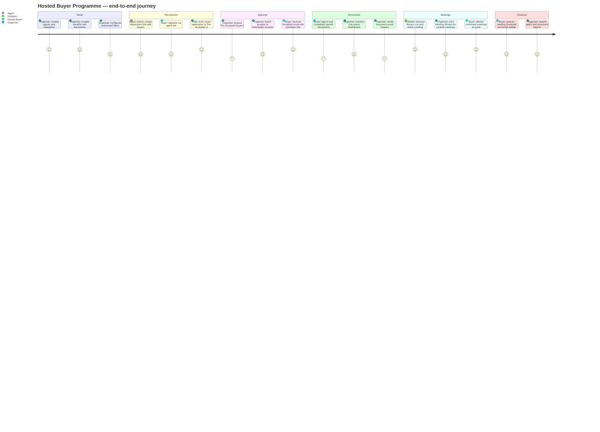
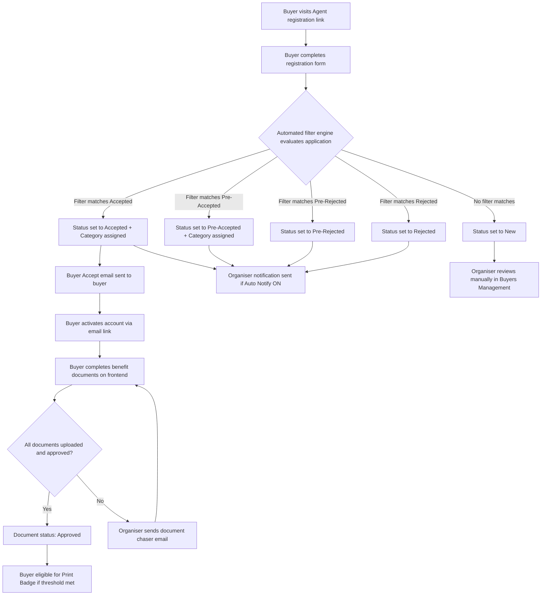
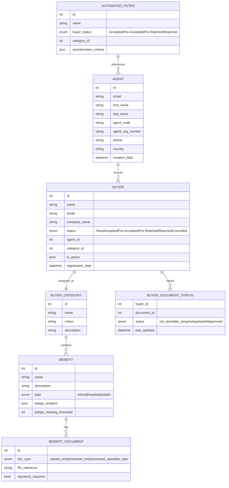
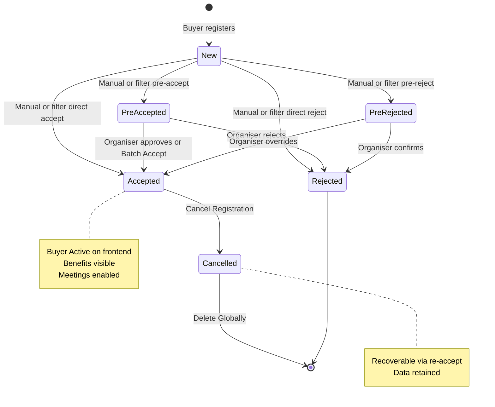
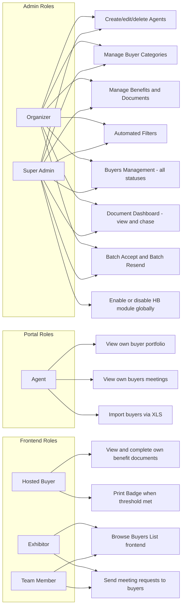

## 1. Product Overview

**Purpose.** Hosted Buyer Management is ExpoPlatform's programme management module for events that invite, vet, and host select buyers — typically senior purchasing decision-makers — under a free-of-charge or subsidised attendance model. It gives organisers a complete, end-to-end control plane: from recruiting buyers through agents, to categorising and approving applications, to managing the contractual document exchange (travel forms, NDAs, signed agreements), to surfacing the accepted buyer list to exhibitors for targeted meeting requests.

**Problem being solved.** Running a Hosted Buyer programme manually creates serious operational risk: disparate spreadsheets for agent tracking, email chains for approval decisions, no audit trail on signed documents, and no link between buyer status and the meeting-scheduling system. Hosted Buyer Management solves this by centralising every step — agent-driven acquisition, automated form-based approval, category-linked benefit management, and document compliance tracking — inside the platform that also drives meetings and matchmaking.

**Business value.**
- Drives exhibitor ROI by guaranteeing a qualified buyer audience with measurable meeting commitments.
- Automates high-volume approval workflows, reducing organiser manual effort by orders of magnitude for large buyer cohorts.
- Creates an auditable document trail (signed contracts, hospitality forms, NDA/waivers) for compliance and post-event reconciliation.
- Agent attribution reporting lets organisers measure and reward recruitment channels.
- Tight integration with the Meetings & Matchmaking module ensures accepted buyers feed directly into curated and concierge meeting pools.

**Target users.** Event organisers and their operations teams; agents who recruit buyers on behalf of the organiser; hosted buyers themselves who must complete documents to activate their benefits.

**User personas.**
- *Event Organiser (Admin)* — configures agents, categories, benefits, automated filters; reviews and approves buyer applications; monitors document compliance via the dashboard; triggers batch communications.
- *Agent* — recruits buyers using a unique registration link; views their own buyer portfolio, buyer meeting activity, and dashboard in a dedicated EP admin panel login.
- *Hosted Buyer* — registers via an agent link or direct invitation; completes benefit documents (upload, download, sign); views their benefits and meetings on the frontend profile page.
- *Exhibitor / Team Member* — views the accepted Buyers List on the event frontend to identify and request meetings with high-value buyers.

**Success metrics.** Buyer acceptance rate; document completion rate (% of accepted buyers reaching Approved document status); no-show rate at the event versus meeting commitments; agent attribution coverage; time from application to Accepted status; meeting fulfilment rate per buyer category.

## 2. Product Scope

### Included
- **Agent management** — create, edit, delete agents; generate unique registration links; export agent list to XLS; agent login portal with buyer portfolio and meeting visibility.
- **Buyer categories** — define named categories with colour, description, associated benefits, and required documents; assign categories to buyers.
- **Benefits management** — three benefit types (Benefit with refund / Benefit from Hospitality, Static Benefit); document builder for signable PDFs (Stripe payment card, custom forms, signature); frontend benefit and document display per buyer profile.
- **Document dashboard** — organiser-facing central view of all buyer document statuses; individual and bulk document export; pending document email chasers (individual and batch).
- **Automated filters** — rule-based auto-routing of buyer applications to Accepted, Pre-Accepted, Pre-Rejected, or Rejected with optional organiser email notification; questionnaire-field-level matching.
- **Buyers management (admin)** — full buyer list with status-based overview; search; multi-field filtering; Meeting Wizard integration; batch accept and batch resend email actions; per-buyer cancel or global delete.
- **Buyers list (frontend)** — exhibitor- and team-member-facing view of accepted buyers; search; rich filtering; interaction buttons; integration with Delegate List.
- **Email templates** — agent creation notification, buyer accept email, document information request, pending documents reminder.
- **Badge / Print badge** — static benefit with VivoTicket integration; minimum confirmed meetings threshold before badge prints.

### Excluded
- Meeting scheduling logic itself — that is covered by the **Meetings & Matchmaking** product. Hosted Buyer Management feeds accepted buyers into that system and surfaces Meeting Wizard as a quick-launch from the buyer record, but does not own meeting slot allocation or curated/concierge meeting engine.
- Registration form builder — buyer registration forms use the same registration module as other participant types. Hosted Buyer Management consumes questionnaire data via automated filters but does not own form design.
- Payment processing for buyer benefits — the Stripe integration (payment card in document builder) is handled by Transactions & Purchasing.
- VivoTicket integration internals — Hosted Buyer Management triggers the print-badge button when the meeting threshold is met, but the ticketing/badge-print pipeline is owned by the Onsite & Kiosk product.
- Sponsor-specific benefit programmes (those are configured under the Sponsor module).
- Analytics dashboards beyond the document dashboard — buyer meeting performance appears in Organiser Analytics.

## 3. User Roles

| Role | Access | Permissions / Restrictions |
| --- | --- | --- |
| **Organizer (Admin)** | Full access to all Hosted Buyer Management admin screens | Create/edit/delete agents, categories, benefits, filters; review and change buyer statuses; document dashboard; batch actions; email chasers |
| **Super Admin** | Same as Organizer plus Global/Event Module Management | Can enable or disable the Hosted Buyer module globally or per event |
| **Agent** | Dedicated EP admin panel login (Agent Login URL) | View own buyer list; view buyer meetings; import buyers via XLS; view dashboard for own cohort. Cannot see other agents' buyers or access organiser-level settings |
| **Hosted Buyer** | Frontend profile at /newfront/profile/benefits | View and complete their own benefit documents (upload, download, sign); view Print Badge when threshold met; no access to admin panel |
| **Exhibitor** | Frontend Buyers List at /newfront/participants?page=buyers | View accepted buyers; use search and filters; send meeting requests; view buyer profile. Cannot see non-accepted buyers or admin screens |
| **Team Member** | Same as Exhibitor | Same frontend buyer list access; cannot manage buyers in admin |
| **Attendee / Participant** | Sees buyers only in the Delegate List view | No Buyers List tab unless organiser has not excluded buyer categories from Delegates. No admin access |
| **Speaker / Sponsor** | No dedicated access | May appear as participants but have no Hosted Buyer Management capabilities |

> [!INFO] The Buyers List frontend tab is visible to Exhibitors and Team Members. General participants (non-exhibitor attendees) only see buyers via the Delegate List unless buyer categories are excluded from that list under Networking & Matchmaking > Delegate List settings.

## 4. Feature Inventory

#### Agents

**Description.** Agents are external recruiters or channel partners who bring buyers to the event. Each agent has a unique registration link that, when used by a buyer to register, creates a traceable attribution record.
**Why it exists.** Organisers rely on agent networks to reach senior buyer pools they cannot source directly. Attribution matters for commission and performance analysis.
**User value.** Organiser gains a sourced, attributed buyer cohort; agents gain a self-service portal to manage their buyers and monitor meeting activity.
**Functional logic.** Admin creates agent profile (Name, Email, Phone, Agent Code, Password, Buyer Type assignment). System generates a unique Agent Reg Number used in the buyer registration link and the Agent Login URL. Agent receives automated email on creation. Agent logs in at the Agent Login URL using the set email and password.
**Preconditions.** Hosted Buyer module enabled; organiser has admin access.
**Trigger conditions.** Organiser clicks Add Agent and completes the form.
**Processing logic.** Agent Code and Agent Reg Number are system-generated or manually set and cannot be changed post-creation (along with Email/Login and unique registration link). Agent portal displays only that agent's buyers and their meetings.
**Outputs.** Agent profile record; unique buyer registration link; agent email notification; XLS export of agent list (ID, Email, First/Last Name, Country, Phone, Agent Code, Agent Reg Number, Creation Date/Time).
**Dependencies.** Email system for agent creation notification; buyer registration module to consume the agent link parameter.
**Configurations.** Buyer Type assigned to agent; email template for agent creation notification (configurable under Email Templates).
**Validation rules.** Email/Login, unique registration link, and Agent Login URL cannot be edited after creation.
**Permissions.** Organizer only for create/edit/delete; Agent for read-only portal view.
**Error handling.** Deleting an agent does not delete the buyers they recruited — those buyer records remain with attribution preserved.
**Edge cases.** Multiple agents can be assigned to a single automated filter. An agent deleted mid-event leaves their buyers intact and attributed; the agent login URL ceases to function.

#### Buyer Categories

**Description.** Named segments used to classify accepted buyers, controlling which benefits and documents they receive and how they appear on the frontend.
**Why it exists.** Different buyer segments (e.g., Retailer, Distributor, VIP) receive different travel subsidies, documents, and meeting priorities. Categories make this targeting possible.
**User value.** Organiser can tailor the programme experience per buyer type; buyers see only their relevant benefits; exhibitors can filter the buyer list by category.
**Functional logic.** Category has a required name and colour. Optional description surfaces on the frontend at /newfront/profile/benefits when at least one document is attached. Benefits and documents are assigned to the category in the admin form. Document types per category: upload only, download only, download and upload, to sign. Deleting a category automatically unassigns it from all buyers who hold it.
**Preconditions.** Benefits must exist before they can be assigned to a category.
**Trigger conditions.** Organiser clicks Add Category on /admin/hostedbuyers/categories.
**Processing logic.** Category colour is used as a visual identifier in admin lists. Multiple benefits can be assigned; each benefit type displays separately on the buyer's profile page.
**Outputs.** Category record with colour, description, associated benefits, and documents; frontend /newfront/profile/benefits rendered per category.
**Dependencies.** Benefits module; document builder (for sign-type documents); buyer registration (categories are assignable to buyers during or after registration).
**Configurations.** Category name, colour, description; benefit assignments; document attachments.
**Validation rules.** Name and colour are required. "To sign" documents require document builder creation.
**Permissions.** Organizer and Super Admin.
**Error handling.** Deleting a category with buyers assigned: system auto-unassigns before deletion; confirmation warning pop-up required.
**Edge cases.** A buyer with no assigned category will have no benefits displayed on the frontend. Automated filters can only assign a category when the status is Accepted or Pre-Accepted.

#### Benefits

**Description.** Benefits are the concrete entitlements a buyer receives under their hosted programme: flights, hotels, subsistence, or access passes — each optionally backed by required documents.
**Why it exists.** The hosted buyer model is contractual: organisers commit to covering certain costs for buyers who fulfil meeting obligations. Benefits formalise this commitment inside the platform.
**User value.** Buyers see exactly what they are entitled to; documents they must complete are presented inline with clear call-to-action buttons; organiser can track compliance centrally.
**Functional logic.** Three benefit types:
- **Benefit with refund (a.k.a. Benefit from Hospitality)** — supports all four document types (upload only, download only, download and upload, to sign). Buyers submit evidence of spend or complete agreements.
- **Static Benefit** — supports download-only documents only. Typically used for information packs, access badges, schedules. Supports card colour and icon customisation. Has a "Badge" checkbox that unlocks a minimum confirmed-meetings threshold for the Print Badge button.
- All benefits appear on frontend at /newfront/profile/benefits, sorted and separated by type.
**Preconditions.** Benefit must have a Name and Description (both required). Type must be selected.
**Trigger conditions.** Organiser clicks Add Benefit on /admin/hostedbuyers/benefit.
**Processing logic.** For "to sign" documents: organiser uses the in-built document builder with elements (Document Name, Logo, Event Name, Footer, Signature, Payment card, General Text, Custom form, Footer text). Document can be previewed in pop-up or PDF before saving. Set Limit functionality is disabled.
**Outputs.** Benefit record; frontend display per buyer; document upload/download/sign interactions.
**Dependencies.** Document builder; Stripe (for payment card element); VivoTicket (for Print Badge on Static Benefit); Buyer Category assignment (benefits surfaced via category).
**Configurations.** Benefit type; document type and file; card colour/icon (Static Benefit); Badge threshold (Static Benefit).
**Validation rules.** Name and Description required. Type required. For sign-type documents, document builder must produce a valid document before saving.
**Permissions.** Organizer creates/edits/deletes benefits. Buyers interact with documents on frontend only.
**Error handling.** Deleting a benefit deletes attached documents; processed buyer documents are also deleted. Deleted benefits must have their documents manually cleaned up.
**Edge cases.** Print Badge only appears when (a) Badge checkbox is checked in admin AND (b) buyer has reached the required number of confirmed meetings. Print Badge functionality works strictly with VivoTicket integration.

#### Document Dashboard

**Description.** An organiser-side overview of every buyer's document compliance status, with tools to chase, export, and monitor progress at both the individual and bulk level.
**Why it exists.** For events with hundreds of hosted buyers, manually tracking who has submitted which document is not scalable. The dashboard provides a single status view and action centre.
**User value.** Organiser can instantly see which buyers are blocked, chase individuals or entire cohorts, and export all documents for compliance records.
**Functional logic.** Located at /admin/hostedbuyers/documents. Search by Name, Email, or Company Name (Enter or Search button to apply). Completion statuses (may update with a delay of a few minutes): Not Started (no document sent), In Progress (at least one document sent), Uploaded (all documents sent), Approved (all sent and approved — row background turns light green). Statuses are per-buyer aggregates.
**Preconditions.** Buyers must be accepted with a category that has documents attached.
**Trigger conditions.** Organiser navigates to Document Dashboard.
**Processing logic.** Individual chaser: click "Send Email" on documents list → fires "Buyer Document Information request" template (/admin/hostedbuyers/emails/buyer_doc_info). Custom text can be included. Bulk chaser: "Batch send email for buyers with pending documents" button fires "Buyer Pending Documents inform" template (/admin/hostedbuyers/emails/buyer_doc_pending_inform) to all buyers who have not uploaded or signed benefit documents yet.
**Outputs.** Status view; individual document downloads (click document name); per-buyer all-documents export (file with links); bulk all-documents export (Export All Documents button).
**Dependencies.** Benefits and documents configuration; email system; buyer registration and category assignment.
**Configurations.** Sort/filter by document status (All, Not Started, Approved, Uploaded, In Progress).
**Validation rules.** Status update delay — organisers should expect a few minutes before status changes reflect.
**Permissions.** Organizer and Super Admin.
**Error handling.** If no documents are attached to a buyer's category, the buyer will not appear with actionable document rows.
**Edge cases.** Approved status row turns light green as a visual cue — no other status changes colour. Individual export from Buyer Profile > Benefits > Actions > Export provides the same document as clicking the document name in the dashboard list.

#### Hosted Buyer Automated Filters

**Description.** Rule-based routing engine that automatically assigns a status (Accepted, Pre-Accepted, Pre-Rejected, Rejected) and optionally a buyer category to incoming buyer applications, based on agent attribution and questionnaire responses.
**Why it exists.** For large programmes, reviewing every application manually is impractical. Automated filters allow pre-defined criteria to instantly classify and route buyers, with human review reserved for edge cases.
**User value.** Organisers can guarantee VIP buyers are accepted instantly; bulk cohorts from trusted agents are auto-processed; the organiser is notified of every auto-status change in real time.
**Functional logic.** Filters are evaluated against each new buyer application. Each filter specifies: Filter Name; one or more Agents; one Buyer Status (Accepted, Pre-Accepted, Pre-Rejected, Rejected); a Buyer Category (only when status is Accepted or Pre-Accepted); and questionnaire field/value matching criteria drawn from the buyer registration form (sections mirror registration steps). When a buyer's application matches all criteria in a filter, their status is automatically set and (if Accepted or Pre-Accepted) a category is assigned.
**Preconditions.** Agents and categories must be created before a filter can reference them. "Buyer Filter Auto Status Notification" email notification toggle must be on to receive automatic status-change emails.
**Trigger conditions.** A buyer completes registration and their form data is evaluated against all active filters.
**Processing logic.** Multiple agents can be associated with one filter. Only one status value per filter. Filters are evaluated in sequence; the first matching filter applies. Category field only appears in the form when Accepted or Pre-Accepted is the selected status.
**Outputs.** Buyer status automatically set; buyer category assigned (if applicable); organiser email notification (if enabled).
**Dependencies.** Agent management; buyer category management; buyer registration form; email notification system.
**Configurations.** Filter Name; Agent selection (multi-select); Buyer Status; Buyer Category; Questionnaire field matching.
**Validation rules.** Status field is single-select. Category only applicable for Accepted or Pre-Accepted. Filters require at least a name and status to be saved.
**Permissions.** Organizer and Super Admin.
**Error handling.** Filter changes do not retroactively re-evaluate already-processed applications; only new registrations are assessed.
**Edge cases.** If two filters could match the same application, the first matching filter wins. A filter referencing a deleted agent or category should be reviewed; the category field auto-removes if the category is deleted.

#### Buyers Management (Admin)

**Description.** The primary admin list and action interface for all buyers associated with an event, across all statuses, with rich filtering, search, batch operations, and per-buyer quick-actions.
**Why it exists.** Organisers need a single screen to understand the health of their buyer cohort, action pending approvals, re-send activation emails, and escalate to meeting management for any buyer.
**User value.** Real-time status overview; batch processing of pre-accepted buyers at scale; direct launch into Meeting Wizard for any buyer without leaving the management screen.
**Functional logic.** Located at /admin/hostedbuyers/buyers. Statuses: New, Accepted, Pre-Accepted, Pre-Rejected, Rejected. Top-level statistics show count per status. Three-dots menu per buyer: Meeting Wizard (opens meeting setup tool), Manage Meetings (view/manage buyer meetings), Not Active (re-sends Accepted email to inactive accepted buyers), Delete (sub-options: Cancel Registration → status becomes Cancelled; Delete Globally → full data removal, only available for Cancelled buyers).
**Preconditions.** Buyers must have registered; the Hosted Buyer module must be enabled.
**Trigger conditions.** Organiser navigates to Buyers Management page.
**Processing logic.** Search by Name or Company Name — note that leading/trailing spaces prevent search from working. Advanced filtering via "+ Add filter fields": registration form fields, Category (Participant), Status, Meeting Tags, Favorited. Column-header filter icon adds: Company Name, Country, Status, Buyer Category, Agent Name, Unnamed filter (All buyers / Without photo / With photo / Not active). Each filter applied narrows all other filter options. Batch Accept: changes all Pre-Accepted buyers with an assigned category to Accepted and sends "Buyer Accept" email. Batch Resend: resends Accept Email to all non-active accepted buyers.
**Outputs.** Status-based buyer list; individual and batch status changes; email notifications; Meeting Wizard launch.
**Dependencies.** Buyer registration; automated filters; category management; email system; Meetings & Matchmaking (Meeting Wizard).
**Configurations.** Filter combinations; batch action confirmations.
**Validation rules.** Delete Globally is only available once a buyer is in Cancelled status. Batch Accept only applies to Pre-Accepted buyers with an assigned category. Leading/trailing spaces break search.
**Permissions.** Organizer and Super Admin.
**Error handling.** Batch Accept requires confirmation via warning pop-up. Delete Globally is irreversible.
**Edge cases.** "Not Active" status in the unnamed filter is specifically buyers who have not clicked the activation link in their Accepted email — it does not refer to event activity status. Cancel Registration is recoverable; Delete Globally is not.

#### Buyers List (Frontend)

**Description.** The event-frontend page where exhibitors and their team members browse, search, and filter all accepted buyers to identify meeting targets.
**Why it exists.** Exhibitors need to find the right buyers before and during an event to maximise meeting ROI. A searchable, filterable list with interaction shortcuts makes buyer discovery efficient.
**User value.** Exhibitors can identify buyers by category, interest, activity, country, and meeting availability, then immediately send a meeting request or start a chat without navigating away.
**Functional logic.** Located at /newfront/participants?page=buyers. Only shows buyers with Accepted status. Organiser can restrict which buyer categories are visible. Search fields: Name, Description, Category, Company Name, Job Title (ElasticSearch optional for enhanced search). Filters: Countries, Buyer Categories, Activity Categories, Interest Categories, Meeting Availability, Existing Meeting Initiator, Existing Meeting Status, Existing Chat. Interaction buttons follow the platform's Permission Matrix, Connections Settings, and Networking Opt-in rules. Clicking a buyer card opens their full profile (contact details, company, interests, activities).
**Preconditions.** Buyers must be in Accepted status. Exhibitors must be registered and logged in.
**Trigger conditions.** Exhibitor or Team Member navigates to /newfront/participants?page=buyers.
**Processing logic.** Buyers excluded from the Delegate list (via Networking & Matchmaking > Delegate List settings) are also hidden from non-exhibitor participants but remain on the Buyers List tab for exhibitors.
**Outputs.** Filtered buyer card grid; buyer profile page on click; meeting request / chat initiation via interaction buttons.
**Dependencies.** Buyer category management; Meetings & Matchmaking (interaction buttons, meeting availability filters); Networking module (Delegate List, Opt-in settings); ElasticSearch (optional).
**Configurations.** Which buyer categories are displayed (admin-controlled); ElasticSearch enabled/disabled.
**Validation rules.** Only Accepted status buyers shown. Non-exhibitor users cannot access the Buyers List tab directly.
**Permissions.** Exhibitors and Team Members; not accessible to general attendees via this tab.
**Error handling.** If no buyers match filters, an empty state is shown. Buyers that are accepted but have their category excluded from the display will not appear.
**Edge cases.** Buyers also appear in the Delegate List unless the organiser explicitly excludes their category under Networking & Matchmaking. This means a general attendee may see a buyer under Delegates even if they cannot see the Buyers tab.

## 5. User Stories Mapping

> [!INFO] Only 5 in-scope Jira stories are mapped to Hosted Buyer Management. The majority of Hosted Buyer features (agents, categories, benefits, document dashboard, filters, buyers list, buyers management) are documented primarily through Confluence (ExpoDoc) rather than through individually tracked feature stories. This is consistent with Hosted Buyer Management being a stable, mature module whose enhancements are tracked as smaller configuration or integration changes rather than large story bundles.

| Story ID | Title | Summary | Acceptance Criteria | Related Feature | Status |
| --- | --- | --- | --- | --- | --- |
| EP-66 | Advanced Search Filters — Backend | Implement advanced search for admin dashboards including Hosted Buyers; filter by any custom registration question field, modelled on Jira-style filtering | Organizer can filter buyer lists using any custom registration form field; filter works across Participants, Exhibitors, Hosted Buyers, and Meeting Wizard panels | Buyers Management — advanced filter fields | COMPLETE |
| EP-1885 | Disable emails for Bizmatch event | Disable specific Hosted Buyer email templates for the BizMatch event (domain h2kpartners/thepacker); affected template: Registration confirmation under Hosted Buyer Management > Emails | Named email templates are disabled per-event; no registration confirmation email sent to HB registrants for that event | Automated email notifications (HB email templates) | COMPLETE |
| EP-2749 | Team Member Approval Process for Hosted Buyer | Private event with public access requires double-approval for Team Members assigned a Buyer Category; add optional setting to bypass separate HB approval when already approved as Team Member | New setting visible when Private event + Public access is ON; default OFF; when ON, approved Team Member with Buyer Category automatically moves into buyer side without separate HB approval step | Buyers Management — approval workflow; Buyer Categories | COMPLETE |
| EP-10422 | Toggle to turn ON/OFF Signature field on Document to sign | Digital forms collected for Hosted Buyer module without mandatory signature field; reduce steps for buyer by making signature optional | Toggle available in admin; when OFF, signature field is not shown on the document-to-sign on the frontend; document can still be submitted without a signature | Benefits — Document to sign; Benefit with refund | COMPLETE |
| EP-23256 | Auto email reminders when meeting minimal requirement not met | Auto-send email reminders to hosted buyers (and optionally exhibitors) who have not yet reached their minimum required confirmed meetings; useful when FOC attendance is conditioned on meeting participation | Organizer can configure minimum meeting count threshold; system auto-sends reminder email when threshold not reached by a configurable date; applicable to HB and Exhibitors | Benefits — Static Benefit badge threshold; Buyers Management — meeting compliance | COMPLETE |

## 6. End-to-End Workflows

### User journey — hosted buyer programme from recruitment to event attendance

### System workflow — buyer application and automated filter processing

### Happy path
Agent shares unique registration link → buyer registers → automated filter sets status to Accepted and assigns category → system sends "Buyer Accept" email → buyer activates account → buyer logs in to frontend and completes benefit documents (upload/sign) → document dashboard shows Approved status → exhibitor browses Buyers List, sends meeting request → organiser uses Meeting Wizard to curate meetings → buyer attends meetings, meets threshold → Print Badge button appears → buyer prints badge/ticket via VivoTicket.

### Alternate paths
- Organiser has no automated filters: every application lands in New status. Organiser manually reviews in Buyers Management, individually or batch-accepts Pre-Accepted buyers.
- Buyer is imported by agent (bulk XLS import via agent portal) rather than registering individually.
- Organiser bypasses document requirement by not attaching documents to the buyer category.
- Team Member auto-approval setting is ON: a Team Member assigned a Buyer Category is automatically moved into the buyer side without separate HB approval (EP-2749).
- Buyer is invited directly by organiser without an agent link.

### Exception paths
- Buyer registers but no filter matches: status stays New; organiser must manually action.
- Buyer receives Accept email but never clicks the activation link: buyer shows as "Not Active" in Buyers Management; organiser uses Not Active re-send or Batch Resend.
- Document deadline passes with buyer in "In Progress" or "Not Started" status: organiser triggers bulk pending document email chaser.
- Automated filter references a deleted agent: filter may not match as expected; organiser must review filter configuration.

### Recovery paths
- Incorrectly accepted buyer: organiser can Cancel Registration (status → Cancelled) and then Delete Globally if needed. Cancel is recoverable; Delete Globally is not.
- Activated buyer who needs category change: organiser edits buyer record and reassigns category; buyer's frontend benefits update accordingly.
- Document in wrong state: organiser can view the document from the Document Dashboard and contact the buyer directly via the individual email chaser with a custom message.
- Agent deleted: buyer records remain attributed; organiser can re-assign buyers to a new agent if required.

## 7. Business Rules Engine

| # | Rule | Condition | Exception / Priority | Conflict resolution |
| --- | --- | --- | --- | --- |
| BR-1 | Only buyers in Accepted status appear on the frontend Buyers List | Always | Organiser may exclude specific buyer categories from display | Accepted status is necessary but not sufficient; category exclusion overrides display |
| BR-2 | Automated filter assigns at most one status per buyer application | First matching filter wins | If no filter matches, status is New | Filter evaluation order must be planned by organiser |
| BR-3 | Buyer Category can only be auto-assigned when status is Accepted or Pre-Accepted | Category field only appears in filter form for Accepted or Pre-Accepted | Manual admin can assign category at any status | Rejected / Pre-Rejected buyers retain no category assignment from filters |
| BR-4 | Batch Accept applies only to Pre-Accepted buyers with an assigned category | Missing category blocks the batch accept for that buyer | Buyer without category must be individually actioned | Category is a pre-condition for batch promotion |
| BR-5 | Delete Globally is only available once a buyer is in Cancelled status | Cancel Registration must be performed first | No exceptions | Two-step deletion prevents accidental full data loss |
| BR-6 | Deleting a category auto-unassigns it from all buyers | On category deletion | Confirmation warning required | Unassignment is immediate; buyers lose associated benefits on frontend |
| BR-7 | Deleting an agent does not delete the agent's buyers | On agent deletion | Buyer records are preserved | Agent attribution remains in the record even after agent deletion |
| BR-8 | Print Badge requires Badge checkbox enabled AND meeting threshold reached | Both conditions must be true | Threshold of 0 means no minimum required | VivoTicket integration must be active for badge print to function |
| BR-9 | Signature on "to sign" documents can be made optional via admin toggle (EP-10422) | Toggle available when signature-type document is configured | Default is signature required | Toggle OFF removes signature field from frontend document without deleting document type |
| BR-10 | Auto-reminder emails for meeting minimums are sent when threshold not reached by configured date | EP-23256 feature enabled; threshold and date configured | Applies to Hosted Buyers and optionally Exhibitors | Organiser configures threshold and trigger date |
| BR-11 | Search in Buyers Management fails if search term has leading/trailing spaces | System does not trim input | None | User must remove extra spaces manually |
| BR-12 | Buyers appear in the Delegate List unless their category is excluded | Default: buyers visible in Delegates | Exclusion configured per category under Networking > Matchmaking > Delegate List | Category-level exclusion takes precedence over individual buyer settings |

## 8. Data Model

### Entities, relationships, and lifecycle

**Inputs.** Agent profiles; buyer registration form data (including questionnaire responses); category and benefit configuration; document uploads and signatures from buyers; filter criteria from organiser.
**Outputs.** Buyer status records; document compliance statuses; agent attribution reports; frontend buyer list; Print Badge trigger.
**Lifecycle states.** Buyer: New → Pre-Accepted → Accepted (active programme participant) → Cancelled / Rejected (terminal). Document: Not Started → In Progress → Uploaded → Approved.

### State diagram — hosted buyer application lifecycle

## 9. Permissions Matrix

| Capability | Organizer | Super Admin | Agent | Hosted Buyer | Exhibitor | Team Member | Attendee |
| --- | --- | --- | --- | --- | --- | --- | --- |
| Create/edit/delete Agents | ✅ | ✅ | ❌ | ❌ | ❌ | ❌ | ❌ |
| Manage Buyer Categories | ✅ | ✅ | ❌ | ❌ | ❌ | ❌ | ❌ |
| Manage Benefits and Documents | ✅ | ✅ | ❌ | ❌ | ❌ | ❌ | ❌ |
| Configure Automated Filters | ✅ | ✅ | ❌ | ❌ | ❌ | ❌ | ❌ |
| Buyers Management (admin) | ✅ | ✅ | ❌ | ❌ | ❌ | ❌ | ❌ |
| Document Dashboard | ✅ | ✅ | ❌ | ❌ | ❌ | ❌ | ❌ |
| Batch Accept / Batch Resend | ✅ | ✅ | ❌ | ❌ | ❌ | ❌ | ❌ |
| Enable/disable HB module | ❌ | ✅ | ❌ | ❌ | ❌ | ❌ | ❌ |
| View own buyer portfolio (Agent portal) | ❌ | ❌ | ✅ | ❌ | ❌ | ❌ | ❌ |
| Import buyers via XLS (Agent portal) | ❌ | ❌ | ✅ | ❌ | ❌ | ❌ | ❌ |
| Complete own benefit documents | ❌ | ❌ | ❌ | ✅ | ❌ | ❌ | ❌ |
| Print Badge (when threshold met) | ❌ | ❌ | ❌ | ✅ | ❌ | ❌ | ❌ |
| Browse Buyers List (frontend) | ❌ | ❌ | ❌ | ❌ | ✅ | ✅ | ❌ |
| Send meeting requests to buyers | ❌ | ❌ | ❌ | ❌ | ✅ | ✅ | ❌ |

## 10. Integrations

| Integration | Purpose | Trigger | Data exchanged | Failure handling | Retry | Security |
| --- | --- | --- | --- | --- | --- | --- |
| **Meetings & Matchmaking** | Surface accepted buyers in meeting pools; enable curated and concierge meetings; Meeting Wizard launch from buyer record | Buyer status changes to Accepted; organiser opens Meeting Wizard from three-dots menu | Buyer ID, category, meeting availability, confirmed meeting count | Buyer will not appear in matchmaking pools if acceptance has not propagated | Status change re-evaluated on next sync | Shared authenticated session; admin-only Meeting Wizard access |
| **Stripe (Transactions & Purchasing)** | Payment card element in document builder for "to sign" benefit documents | Document builder element added by organiser | Payment authorisation token embedded in signed document | Document save fails if Stripe integration is not configured | Organiser must configure Stripe before using payment card element | Stripe-hosted payment iframe; PCI-scoped |
| **VivoTicket** | Print Badge functionality for Static Benefits | Buyer reaches minimum confirmed meetings threshold | Badge/ticket print request | Print Badge button does not appear if VivoTicket integration is not active | N/A — button only displays when integration is active | Integration credentials managed under platform integrations settings |
| **Email system (SMTP/SES)** | Agent creation notifications; Buyer Accept emails; Document information requests; Bulk pending document reminders; Auto meeting reminder emails | Agent created; buyer accepted; document chaser triggered; meeting threshold not met by configured date | Recipient address, template reference, optional custom message body | Email not sent visible as absence of mail icon indicator in document dashboard | Organiser can re-send individual chasers manually | Platform email credentials; template-based (not free-form) |
| **ElasticSearch** | Advanced full-text search on the frontend Buyers List | Optional — enabled in event settings | Buyer profile fields indexed for search | Falls back to standard DB search if ElasticSearch is unavailable | Auto-reconnect on next search | Platform internal network; not exposed externally |
| **Registration module** | Buyer registration form; questionnaire data consumed by automated filters | Buyer submits registration form via agent link | Registration form fields, questionnaire answers, agent attribution | Failed registration prevents buyer from entering any HB workflow | Buyer can retry registration | Standard registration authentication; agent link token validated on submission |

## 11. Notifications

| Notification | Type | Template | Recipient | Trigger | Timing | Configurable |
| --- | --- | --- | --- | --- | --- | --- |
| Agent creation notification | Email | Agent creation template (under Email Templates) | Newly created Agent | Organiser saves a new Agent profile | Immediate | Yes — template editable under Email Templates |
| Buyer Accept email | Email | Buyer Accept template | Hosted Buyer | Buyer status changes to Accepted (manual, batch, or automated filter) | Immediate | Yes — template editable |
| Buyer Filter Auto Status Notification | Email | Platform notification | Organizer | Automated filter changes any buyer status | Immediate | Yes — requires "Buyer Filter Auto Status Notification" toggle to be ON |
| Document information request (individual chaser) | Email | `/admin/hostedbuyers/emails/buyer_doc_info` | Individual Hosted Buyer | Organiser clicks "Send Email" on specific document in Document Dashboard or Buyer Profile | On-demand | Yes — custom text can be appended by organiser |
| Bulk pending document reminder | Email | `/admin/hostedbuyers/emails/buyer_doc_pending_inform` | All buyers with not-uploaded/not-signed documents | Organiser clicks "Batch send email for buyers with pending documents" on Document Dashboard | On-demand (batch) | Yes — template editable |
| Batch Resend Accept Email | Email | Buyer Accept template | All non-active Accepted buyers | Organiser triggers Batch Resend in Buyers Management | On-demand (batch) | Uses same Buyer Accept template |
| Auto meeting minimum reminder (EP-23256) | Email | Configurable template | Hosted Buyers (and optionally Exhibitors) who have not reached minimum meetings by configured date | Scheduled: meeting threshold not met by organiser-configured date | Scheduled (configurable date) | Yes — threshold and trigger date configured by organiser |

> [!INFO] SMS and push notifications are not documented for Hosted Buyer Management. All buyer-facing notifications in this module are email-based.

## 12. Reporting & Analytics

| Report / Surface | Inputs | Metrics / Data | Calculations | Filters | Export |
| --- | --- | --- | --- | --- | --- |
| **Document Dashboard** (/admin/hostedbuyers/documents) | Buyer records; benefit document assignments; upload/sign events | Per-buyer document completion status: Not Started, In Progress, Uploaded, Approved | Aggregate per buyer across all required documents; Approved requires all documents sent and approved | Name, Email, Company Name search; Status filter (All, Not Started, Approved, Uploaded, In Progress) | Per-buyer document download; per-buyer all-documents export file with links; Export All Documents (all buyers) |
| **Buyers Management status summary** (/admin/hostedbuyers/buyers) | Buyer status records | Count of buyers per status: New, Accepted, Pre-Accepted, Pre-Rejected, Rejected | Simple count per status bucket | Multi-field filter (registration form fields, category, status, meeting tags, favourited, company, country, buyer category, agent name, active/inactive) | No direct export documented; Buyers export report available via Organiser Analytics > Data Import/Export |
| **Agent performance tracking** (via Agents page and Agent portal) | Agent profiles; buyer attribution; meeting data | Number of buyers per agent; meeting activity for agent's buyers | Count of buyers attributed to each agent; meetings visible in Agent portal | Agent-specific view in portal | XLS export from Agents page: ID, Email, Name, Country, Phone, Agent Code, Agent Reg Number, Creation Date/Time |
| **Online Meeting Analytics — Account Agent column** | Meeting records; buyer-agent attribution | Agent name visible per buyer row in Online Meeting Analytics | Attribution lookup | Part of Online Meeting Analytics in Organiser Analytics module | XLS export includes Account Agent column |
| **Buyers export** (Organiser Analytics > Data Import/Export) | Buyer profile records | Buyer-specific profile fields and registration data | Raw export | Per-event | XLS |

> [!WARN] Dedicated Hosted Buyer analytics (e.g., meeting fulfilment rates per buyer category, document completion rates over time, agent conversion funnel) are not documented in ExpoDoc beyond the Document Dashboard view. These metrics may need to be assembled from the Buyers export and Meetings export via external BI tooling.

## 13. Configuration Guide

| Setting | Location | Effect | Who can set |
| --- | --- | --- | --- |
| Hosted Buyer module enabled/disabled | Global Module Management / Event Module Management | Enables or disables entire HB module for the event | Super Admin |
| Add/edit/delete Agents | Admin Panel > Hosted Buyer Management > Agents | Creates agent profile, unique link, agent login; sends creation email | Organizer, Super Admin |
| Buyer category name, colour, description | /admin/hostedbuyers/categories | Controls buyer segment labels, frontend category display, benefit linkage | Organizer, Super Admin |
| Benefit assignment to category | /admin/hostedbuyers/categories (edit category form) | Controls which benefits (and their documents) are shown to buyers in that category | Organizer, Super Admin |
| Benefit type and documents | /admin/hostedbuyers/benefit | Sets benefit type (refund/hospitality/static); configures required documents and document types | Organizer, Super Admin |
| Document signature toggle (EP-10422) | Benefit add/edit form — "to sign" document settings | Makes signature field optional on the frontend document completion form | Organizer, Super Admin |
| Badge checkbox and meeting threshold | Static Benefit add/edit form | Enables Print Badge button; sets minimum confirmed meetings required before badge appears | Organizer, Super Admin |
| Automated filter rules | Admin Panel > Hosted Buyer Management > Filters | Configures agent, status, category, and questionnaire-field matching for auto-routing | Organizer, Super Admin |
| Buyer Filter Auto Status Notification toggle | Automated Filters page | Sends organiser email when a filter auto-changes a buyer's status | Organizer, Super Admin |
| Buyers List category visibility | Networking & Matchmaking > Delegate List | Excludes specific buyer categories from appearing in the frontend Buyers List for non-exhibitor users | Organizer, Super Admin |
| ElasticSearch for Buyers List | Event settings | Enables advanced full-text search on frontend Buyers List | Super Admin |
| Email templates | /admin/hostedbuyers/emails/ | Customises content of buyer accept email, agent creation email, document request email, pending documents email | Organizer, Super Admin |
| Meeting minimum auto-reminder (EP-23256) | Meeting / Hosted Buyer settings | Configures minimum meeting threshold and trigger date for auto-reminder emails | Organizer, Super Admin |
| Team Member auto-approval into HB (EP-2749) | Private event + Public access settings | When ON, Team Members assigned a Buyer Category bypass separate HB approval step | Organizer, Super Admin |
| Buyer category exclusion from Delegate List | Networking & Matchmaking > Delegate List | Prevents buyers of that category from appearing in general participant Delegate view | Organizer, Super Admin |

## 14. Edge Cases

**User edge cases.**
- Buyer registers with an agent link but the agent is deleted before the buyer is approved. The buyer record retains attribution to the (now-deleted) agent; organiser must manually action the application as no automated filter can match on a deleted agent.
- An agent imports buyers in bulk via XLS in the agent portal. Duplicate email addresses in the import file may create duplicate or conflicting records; organiser should validate XLS before import.
- A Team Member is assigned a Buyer Category on a Private + Public access event. Without EP-2749 setting enabled, they face a double-approval requirement; with the setting ON, they bypass HB approval and enter the buyer side directly.
- A buyer who completes their documents but never clicks their activation link remains "Not Active" and cannot access the frontend or the meeting system until re-sent the activation email.

**Data edge cases.**
- Search in Buyers Management fails silently when the search term has a leading or trailing space. The system does not trim; the organiser must re-type the search term cleanly.
- Document Dashboard statuses may lag by a few minutes after a buyer completes a document. Organiser should not rely on real-time status for time-critical compliance checks.
- Deleting a benefit after buyers have processed documents: the buyer's processed documents are also deleted. This is irreversible and can destroy compliance records.
- Deleting a buyer category with assigned buyers: the category is automatically unassigned before deletion. Buyers then have no category and their benefits disappear from the frontend without notification.

**Workflow edge cases.**
- Automated filter with overlapping criteria: the first matching filter is applied; subsequent potentially matching filters are ignored. Organiser must sequence filters carefully.
- Batch Accept silently skips Pre-Accepted buyers who have no assigned category. There is no error or notification for skipped buyers; organiser must check manually.
- Cancel Registration sets buyer status to Cancelled but does not delete data. Delete Globally (only available for Cancelled buyers) is irreversible. Organiser must distinguish between suspension and deletion.
- A buyer in the Accepted status is not yet "active" on the frontend until they click the activation link in their email. The "Not Active" filter in Buyers Management surfaces these buyers for re-send.

**Integration edge cases.**
- Print Badge button will never appear if VivoTicket integration is not configured, regardless of whether the Badge checkbox is enabled and the meeting threshold is reached. Organiser must ensure VivoTicket is active before communicating badge availability to buyers.
- Stripe payment card element in the document builder only functions if Stripe is configured as a payment integration. Attempting to use it without Stripe configured will cause document save failure.
- ElasticSearch disabled: frontend Buyers List falls back to standard database search, which supports fewer fields and may miss partial matches.
- Meeting Wizard launch from Buyers Management three-dots menu requires the Meetings & Matchmaking module to be enabled. If the meetings module is off, the wizard will not open correctly.

**Permission edge cases.**
- An agent can only see their own buyers in the agent portal. If a buyer registered via a different agent's link, they will not appear in the first agent's portal even if the buyer later mentions them.
- Exhibitors can see accepted buyers on the Buyers List tab. If an organiser forgets to set a buyer category to "hidden from Delegate List," non-exhibitor attendees may also see those buyers under Delegates, unintentionally exposing buyer profiles to a wider audience.
- Super Admin can enable/disable the entire Hosted Buyer module. Disabling mid-event will remove the Buyers List from the frontend for all exhibitors and buyers without warning.

**Concurrency edge cases.**
- Two organisers simultaneously trigger Batch Accept on the same Pre-Accepted cohort: both confirm, and the second batch operation may find no pre-accepted buyers left to process (they have already been promoted by the first). No error is shown; the second batch completes with no changes.
- A buyer submits a document at the same moment an organiser deletes that document type from the benefit configuration. The in-flight submission may succeed or fail depending on race condition timing; organiser should not delete benefit document types while buyers are actively submitting.

**Event-lifecycle edge cases.**
- Automated filters are only evaluated on new registrations. Changing filter criteria after buyers have already been processed does not re-evaluate or re-route existing buyer applications.
- If the event ends and the Hosted Buyer module is disabled after the event, historical buyer data (statuses, documents) remains in the admin panel but the frontend Buyers List and buyer benefit pages become inaccessible to buyers.
- A buyer who loses Accepted status (e.g., organiser manually cancels them) disappears from the frontend Buyers List immediately. Any exhibitor who had previously saved a meeting request with that buyer will see the meeting in whatever state it was in; the system does not auto-cancel those meetings.

## 15. FAQs

**What is a Hosted Buyer programme?** A Hosted Buyer programme is an event model where the organiser subsidises the attendance of selected senior buyers (covering travel, accommodation, or subsistence) in exchange for a commitment to attend a minimum number of meetings with exhibitors. The Hosted Buyer Management module supports the full lifecycle of this programme within ExpoPlatform.

**How does an agent recruit buyers?** The organiser creates an Agent profile in the admin panel, which generates a unique registration link. The agent shares this link with potential buyers. When a buyer registers via that link, the system records the agent attribution, enabling the organiser to track which buyers each agent sourced.

**Can I auto-approve a large cohort of VIP buyers?** Yes. Create an automated filter targeting the relevant agent and set the Buyer Status to Accepted. Any buyer registering via that agent's link will be automatically accepted without manual review.

**What happens when I delete an agent?** The agent's login access is revoked and they no longer appear in the Agents list. However, all buyers recruited by that agent retain their records and agent attribution in the system. Existing buyers are not affected.

**A buyer is Accepted but not showing on the frontend Buyers List — why?** Check: (1) the buyer has clicked their activation link from the Accept email (they must be "active"); (2) the buyer's category is not excluded from the Buyers List display; (3) the Hosted Buyer module is enabled in Module Management.

**How does the Document Dashboard work?** The Document Dashboard (/admin/hostedbuyers/documents) shows every accepted buyer alongside their document completion status (Not Started, In Progress, Uploaded, Approved). Organisers can send individual email chasers per document or a bulk reminder to all buyers with pending documents. All documents can be exported via the Export All Documents button.

**When does the Print Badge button appear for a buyer?** Three conditions must all be true: (1) the Static Benefit in the admin panel has the "Badge" checkbox enabled; (2) the buyer has reached the minimum confirmed meetings number set in that benefit configuration; and (3) the VivoTicket integration is active. If any of these is missing, the button will not appear.

**Can I make the document signature optional?** Yes. The toggle introduced in EP-10422 allows organisers to turn off the mandatory signature field for "to sign" document types. When the toggle is off, buyers can submit the document form without adding a signature.

**How do I prevent Team Members from needing separate HB approval?** On a Private event with Public access, enable the Team Member auto-approval setting (EP-2749). When ON, a Team Member who is assigned a Buyer Category is automatically moved into the buyer side without requiring a separate Hosted Buyer approval step.

**Do exhibitors see all buyers or only accepted ones?** Exhibitors and Team Members browsing the frontend Buyers List (/newfront/participants?page=buyers) only see buyers with Accepted status. Non-accepted buyers (New, Pre-Accepted, Pre-Rejected, Rejected) are never visible on the frontend buyer browsing page.

**How does Hosted Buyer Management connect to meetings?** Accepted buyers are available in the Meetings & Matchmaking module as participants eligible for curated and concierge meetings. From the Buyers Management admin screen, the organiser can open Meeting Wizard directly from any buyer's three-dots menu to set up meetings for them. Accepted buyers also appear in the exhibitor-facing Buyers List where exhibitors can send direct meeting requests.

**Can buyers also appear in the general Delegate List?** Yes, by default accepted buyers appear in the Delegate List visible to general attendees. The organiser can exclude specific buyer categories from the Delegate List under Networking & Matchmaking > Delegate List settings, confining those buyers to the exhibitor-only Buyers List tab.
