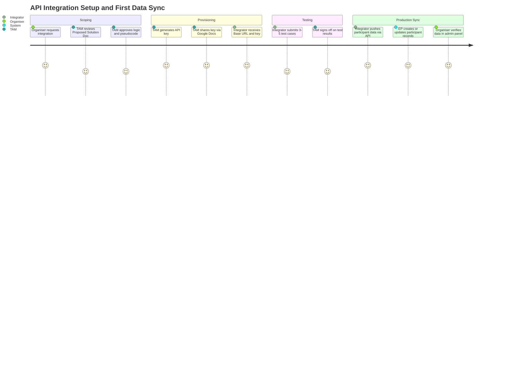
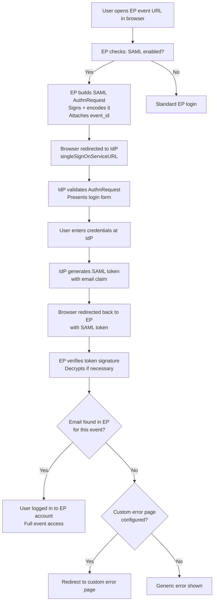
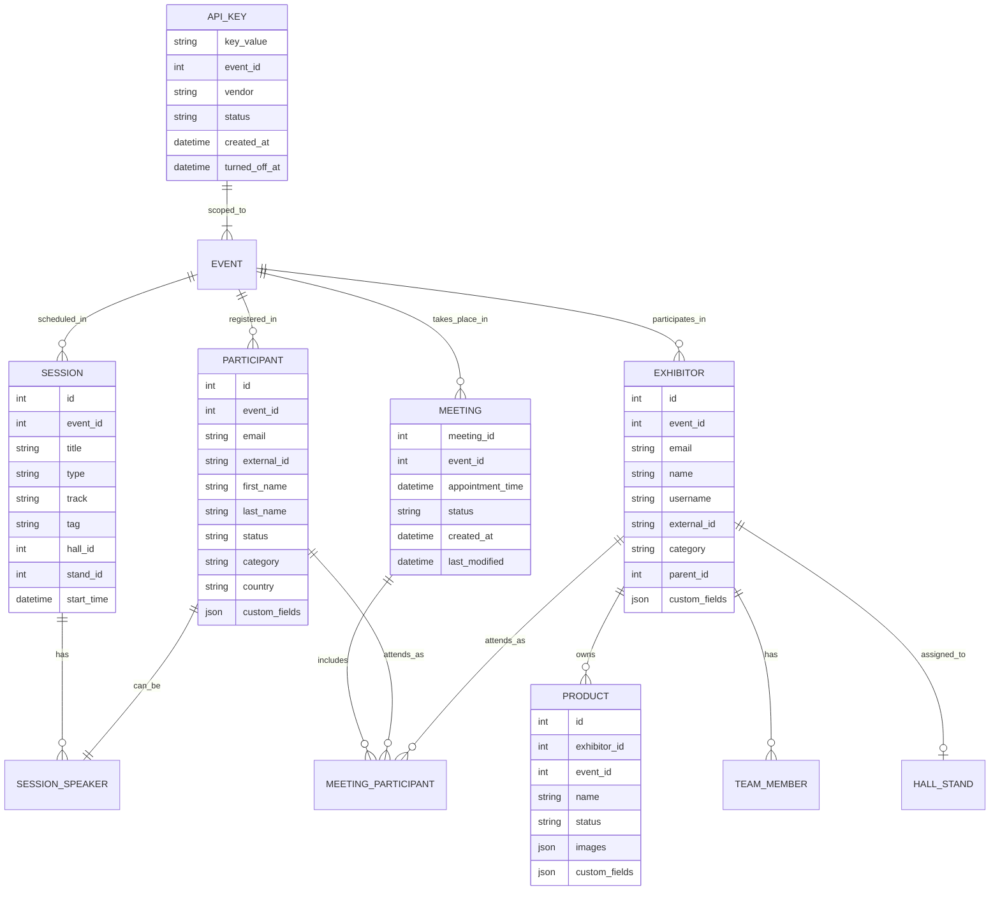
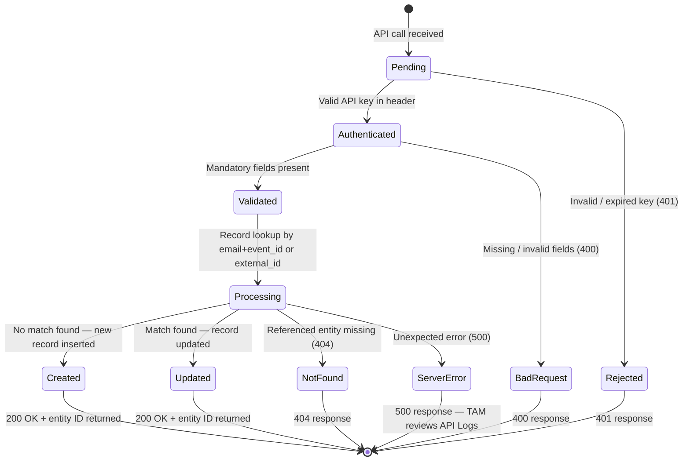

## 1. Product Overview

**Purpose.** The Integrations product is ExpoPlatform's connectivity layer, giving clients two distinct paths to synchronise data between their own systems and the ExpoPlatform event environment. Option 1 — the Open API — is a versioned REST interface that allows external systems to create, read, update, and delete records for all core event entities. Option 2 — Native Integrations — is a catalogue of pre-built, scoped connections to specific third-party suppliers covering registration systems, SSO providers, floor-plan vendors, and location-tracking services.

**Problem being solved.** Event organisers routinely manage data in multiple systems: a CRM, a registration platform, a badge system, a floor-plan tool, and their own ERP. Without integration, every data point must be manually re-entered or uploaded via spreadsheet, which is slow, error-prone, and impossible to keep in sync during a live event. The Open API solves real-time synchronisation for any system that can make HTTP calls. Native Integrations solve connectivity for partners whose systems either cannot call an API directly or where a pre-agreed data contract already exists.

**Business value.**
- Eliminates manual re-entry of participant, exhibitor, product, session, and meeting data across multiple systems.
- Enables real-time data parity — changes in the organiser's registration or CRM system flow into ExpoPlatform within seconds via API.
- Native SSO (SAML 2.0) removes password friction for large enterprise clients (e.g., Informa IIRIS), increasing event platform adoption.
- The floor-plan integrations (ExpoFP + Crowdconnected) add wayfinding and indoor positioning to the mobile app with no custom development.
- The Integration HUB (EP-45437) and Public API v3 migration (EP-46812) represent the platform's next-generation integration surface, consolidating all connectors into a single admin-managed hub.

**Target users.** Technical Account Managers (TAMs) who configure integrations per event; organiser IT teams and their third-party system integrators who consume the API; event organisers who manage SSO and floor-plan settings in the admin panel; Super Admins who provision API keys and manage the Integration HUB.

**User personas.**
- *API Integrator (third party)* — a developer at the organiser's registration vendor or CRM provider who calls `/api/v2/account/set` to sync attendees. Needs clear endpoint documentation, reliable error codes, and a valid API key.
- *Technical Account Manager (TAM / API Manager)* — EP staff who generate and rotate API keys, review API logs, approve Proposed Solution Documents, and act as the bridge between the organiser and the integrator.
- *Event Organiser (Admin)* — configures SAML SSO parameters, selects the custom error page, enables floor-plan integration tokens; does not typically call the REST API directly.
- *Super Admin* — has platform-wide visibility into Integration HUB connectors, API key management, and API log access.
- *Exhibitor / Participant* — indirect user; their data is the subject of integration operations. SAML SSO improves their login experience.

**Success metrics.** API uptime and error rate; percentage of events using at least one data integration; time-to-first-sync for new integrations; number of active API keys across the platform; adoption of Integration HUB (EP-45437); Public API v3 migration completion rate (EP-46812).

---

## 2. Product Scope

### Included
- **Open API (Option 1):** REST API v2 and v3 (in migration) over HTTPS with HTTP Basic authentication, covering all core resources: Accounts/Participants, Exhibitors, Products, Sessions, Meetings, Floor Plan (Halls and Stands), Statistics (Interactions), Location, News, Event Categories.
- **API Key management:** generation, per-event scoping, lifecycle enforcement (issue → active → turn off at event end → delete on supplier change).
- **API usage guidelines:** delta-sync patterns, `send_email` flag semantics, Proposed Solution Document workflow, testing sign-off process.
- **API Logs:** SuperAdmin-accessible log viewer filterable by endpoint, status, date, and parameters with XLS export.
- **Native Integrations (Option 2):** SAML 2.0 SSO (generic + IIRIS/Informa), ExpoFP floor plan, Crowdconnected indoor positioning, Aventri participant data sync.
- **SAML 2.0 configuration options:** entityID, SSO/SLO URLs, x509 cert, custom error page for non-existing records, login pop-up checkbox, Enable EP Authorization checkbox.
- **Integration HUB:** admin-panel-managed catalogue of native integration connectors (EP-45437, COMPLETE).
- **Public API v3 migration:** ongoing endpoint modernisation (EP-46812, In Progress).
- **Statistics API v2:** `/api/v2/statistics/accountsInteractions` with full interaction type/action/combination coverage and pagination.
- **Meetings export API:** `/api/v2/meetings/export` with pagination and `last_modified` filter for incremental sync.

### Excluded
- Manual spreadsheet data imports (covered by the Data Import module).
- Data Export reports (covered by Organiser Analytics / Data Export).
- Option 3 — custom integration development from scratch (scoped and estimated as a professional services engagement, not a product feature).
- Financial/payment gateway integrations (covered by Transactions & Purchasing).
- Google Analytics GA4 integration (referenced in the ecosystem map but not detailed in the current Confluence pages — noted as a source gap).
- Third-party marketing automation or CRM integrations not listed in the native catalogue.

---

## 3. User Roles

| Role | Access to Integration features | Notes / Restrictions |
| --- | --- | --- |
| **Super Admin** | Full access: Integration HUB, API key generation/revocation, API log viewer, all native integration configuration | Only role that can access API Logs; can delete and regenerate keys |
| **Organizer (Admin)** | SAML 2.0 settings (Event Setup → General → Settings); floor-plan token configuration; Integration HUB view for their events | Cannot generate or revoke API keys without TAM involvement |
| **TAM / API Manager** | API key generation, sharing, lifecycle management; review of Proposed Solution Documents; integration testing sign-off | EP internal staff role; not a platform login role but a process role |
| **Exhibitor** | No direct access to integration settings | Exhibitor records are managed via API; SAML SSO affects exhibitor login if the event uses SSO |
| **Participant / Visitor** | No direct access | Participant accounts are created and updated via API; SAML SSO affects login experience |
| **Speaker** | No direct access | Speaker records managed via Session API |
| **Team Member** | No direct access | Team member assignment managed via Exhibitor API |

> [!INFO] API key access is controlled entirely by the TAM / API Manager role. Organisers cannot self-serve key generation. Keys are scoped to a single event cycle and turned off after the event ends even if the same third-party provider is reused for the next event.

---

## 4. Feature Inventory

### 4.1 Open API — REST Interface (Option 1)

#### Description
A versioned REST API (currently v2 with v3 migration in progress) exposing CRUD operations for all core ExpoPlatform entities over HTTPS. Authentication uses HTTP Basic with a per-event API key passed in the `Authorization` header.

#### Why it exists
Organisers use multiple systems to manage event data. The API provides a single, machine-readable interface so external registration platforms, CRMs, and badge systems can push and pull data without manual re-entry.

#### User value
Real-time data parity between the organiser's systems and ExpoPlatform. Removes dependency on manual uploads. All fields available via API — no subset restrictions.

#### Functional logic
The base URL is event-specific and provided by the TAM. All requests must include `Authorization: Basic <API_KEY>` in the HTTP header. The API is RESTful: POST for create/update (most endpoints use a single `set` verb for upsert semantics), GET for retrieval, DELETE for removal. The `external_id` field on participant and exhibitor records is the preferred matching key for updates — it maps to the organiser's own database identifier.

#### Preconditions
API key generated by TAM; integrator has received Base URL, API key, and Swagger documentation link. A Proposed Solution Document with logic flow and pseudocode has been submitted to and approved by the TAM.

#### Trigger conditions
External system makes an HTTP request to the API endpoint with a valid key and payload.

#### Processing logic
- Upsert pattern: if `external_id` or `email`/`event_id` already matches a record, the endpoint updates; otherwise it creates.
- Status management: accounts provisioned as `UPLOADED` allow batch activation email sends later. Default when status omitted is `ACTIVE`.
- `send_email=true` triggers a platform email to the user; this must be explicitly set only when an email is desired.
- For bulk GET endpoints, a timestamp filter (delta pattern) must be used after the first full pull to retrieve only changed records.
- Partial updates: only changed fields should be included in update payloads — not the full record.
- High-volume data must be pushed in multiple streams.

#### Outputs
JSON responses including entity IDs, status codes, and error messages. On success: `200 OK` with entity ID. On failure: `400` / `401` / `404` / `500` with error detail.

#### Dependencies
Platform API gateway; event data services per resource type; authentication service; API key store.

#### Configurations
Per-event API key; Swagger documentation (`https://api-newdemo.expoplatform.com/apidocs/v2/swagger.html`); `send_email` parameter; `external_id` field on records.

#### Validation rules
Mandatory fields vary by resource (see §4.3–4.8). Missing mandatory fields return `400 Bad Request`. Invalid or expired keys return `401 Unauthorized`. Missing resources return `404 Not Found`.

#### Permissions
API key holder only. Keys are event-scoped. SuperAdmin access required to view API Logs.

#### Error handling
All errors return HTTP status codes with a JSON body containing an error message. Integrators must store and handle all error codes. On `500` errors, TAM should review API Logs in the admin panel.

#### Edge cases
- If `external_id` is not used, the integrator must store the EP-generated entity ID from the creation response to enable later updates.
- `send_email=false` or omitting the parameter entirely prevents unintended email sends to participants during bulk data loads.
- Partial payload updates during live events prevent accidental overwriting of data changed by users directly on the platform.

---

### 4.2 API Key Management

#### Description
The lifecycle process for provisioning, distributing, and retiring API keys for each integration. Every integration uses a unique, event-scoped key.

#### Why it exists
API keys are the primary security boundary for the Open API. Scoping each key to a single event cycle limits blast radius in the event of key compromise. Mandatory rotation at event end prevents stale keys from being used in subsequent events without oversight.

#### User value
Organisers and their vendors are protected from unauthorised data access. The TAM retains full control over who has access to each event's data stream.

#### Functional logic
- TAM generates a unique API key per integration per event cycle via the EP API Manager tooling.
- Key is shared in a Google Doc accessible only to restricted third-party personnel and the Lead TAM; shared by dedicated email always copying the Lead TAM and the organiser's main contact.
- At event end: key is turned off regardless of whether the same vendor is reused.
- If organiser changes suppliers: key is deleted. All other access methods (Admin Access) are also revoked.
- Key deletion is not permitted for ongoing integrations where the vendor remains the same — it is turned off at event end but may be regenerated for the next event cycle.

#### Preconditions
Organiser has signed off on which systems will integrate. Third-party contact details and restricted personnel list are confirmed.

#### Trigger conditions
New event cycle begins; organiser requests integration with a new third party; event ends; organiser changes suppliers.

#### Processing logic
Key generation → restricted sharing → active use during event → turn off at event end → optional deletion on supplier change.

#### Outputs
A Base64-encoded API key string for use in the `Authorization: Basic` header.

#### Dependencies
EP API Manager tooling; Google Docs (key distribution); TAM workflow.

#### Configurations
Key scope: per event; sharing restrictions: Lead TAM + named third-party personnel only.

#### Permissions
TAM / API Manager for generation and revocation. Super Admin for log review.

#### Error handling
Expired or revoked key returns `401 Unauthorized` on all API calls. Integrator must contact the TAM to request key renewal.

#### Edge cases
- If an integrator attempts to use a key from a previous event cycle, all calls return `401`.
- Key compromise: TAM must revoke immediately and regenerate; all in-flight integrations require updated key distribution.

---

### 4.3 Participant / Account API

#### Description
The full set of API endpoints for managing participant (visitor, buyer, speaker, team member) accounts. Covers creation, update of every profile field, status management, category management, bulk operations, and SSO token verification.

#### Why it exists
Participant data typically originates in an external registration system (e.g., Aventri/Cvent). The API enables real-time sync of registrations into ExpoPlatform without manual exports and imports.

#### User value
Attendees appear on the platform immediately after registering in the organiser's system. Status transitions (UPLOADED → ACTIVE) can be managed programmatically to control email sends.

#### Functional logic
**Core endpoint:** `POST /api/v2/account/set`
Mandatory fields: `event_id`, `email`, `first_name`, `last_name`.
Optional key fields: `status` (UPLOADED / ACTIVE / INACTIVE), `external_id`, `send_email`.
All 11 visitor endpoints available:

| Endpoint | Purpose |
| --- | --- |
| `/api/v2/account/set` | Create or update participant |
| `/api/v2/account/get` | Get individual record |
| `/api/v2/account/getList` | Get entire participant list (use delta filter) |
| `/api/v2/account/getCategories` | Retrieve participant category names and IDs |
| `/api/v2/account/setCategory` | Create/update a participant category |
| `/api/v2/account/delete` | Detach or delete single participant |
| `/api/v2/account/deleteBulk` | Bulk detach or delete |
| `/api/v2/account/checkToken` | Verify if an account token is valid |
| `/api/v2/account/exists` | Check if account exists in a specific event |
| `/api/v2/account/setSessions` | Add sessions to participant's calendar |
| `/api/v2/account/buyers` | Retrieve buyer information |

Update sub-operations (all via `/api/v2/account/set` with specific fields): Name and Photo, Status, Title, Category, Preferred Language, Custom Fields (Radio Group / Checkbox Group / Select / Text/TextArea / Date / Checkbox / File), Country/Region/City, External QR and Barcode, Social Media Pages, About me, Activity and Interest Categories, Team Member Assignment.

#### Preconditions
Event exists in EP; API key is valid; mandatory fields present in payload.

#### Processing logic
If `email` + `event_id` (or `external_id`) matches an existing record: update. Otherwise: create. Best practice is to provision with `UPLOADED` status and activate in a separate step.

#### Outputs
`200 OK` with participant ID and response body. Participant visible in admin panel under Management → Participants.

#### Dependencies
Account/identity service; category service; session service (for setSessions); authentication service.

#### Validation rules
`event_id`, `email`, `first_name`, `last_name` are mandatory for creation. Status defaults to ACTIVE if omitted on creation.

#### Error handling
`400` on missing mandatory fields or invalid format. `401` on invalid key. `404` if the referenced event or category does not exist.

#### Edge cases
If `send_email=true` is included in a bulk provisioning job, every account created triggers an activation email — use `send_email=false` or omit during bulk loads. Role changes (e.g., Participant to Team Member) affect analytics attribution retroactively.

---

### 4.4 Exhibitor API

#### Description
CRUD endpoints for exhibitor company profiles, covering all profile fields, hall/stand location assignment, parent/child relationships, team member administration, and VAT/accounting details.

#### Why it exists
Exhibitors are commonly managed in an external event management system or CRM. The API keeps the EP exhibitor directory in sync without manual updates.

#### User value
Exhibitor profiles on the attendee-facing platform are always current. Location data (hall/stand) flows in from the organiser's floor-plan system.

#### Functional logic
**Core endpoint:** `POST /api/v2/exhibitor/set`
Mandatory fields: `event_id`, `email`, `name`.
All 4 exhibitor endpoints:

| Endpoint | Purpose |
| --- | --- |
| `/api/v2/exhibitor/set` | Create or update exhibitor |
| `/api/v2/exhibitor/getList` | Get all exhibitors with basic data |
| `/api/v2/exhibitor/get` | Get full data for one exhibitor |
| `/api/v2/exhibitor/delete` | Detach from event or delete |

Update sub-operations: Name, Logo, Exhibitor Category, Video, About Information, Preferred Language, Product Categories, Custom Fields (same types as participant), Country/Region/City, VAT/Accounting Details, Social Pages, Activity and Interests, Contact Person Details, Team Member Admin, Parent, Children, Exhibitor Hall and Stand, Exhibitor Multiple Hall and Stand.

#### Preconditions
Event exists; API key valid; mandatory fields present.

#### Processing logic
If `email` + `event_id` or `external_id` matches: update. Otherwise: create. System auto-generates a username from name if not explicitly set — **security risk** — always set username explicitly.

#### Outputs
`200 OK` with exhibitor ID. Exhibitor visible in admin panel under Management → Exhibitors.

#### Validation rules
`event_id`, `email`, `name` mandatory for creation. Username should be supplied explicitly; auto-generated username based on company name can create duplicate or predictable login credentials.

#### Error handling
Same HTTP status codes as participant API. API Logs accessible to SuperAdmin for root-cause investigation.

#### Edge cases
Parent/child exhibitor relationships require the parent exhibitor to exist before the child can be assigned. Multiple hall/stand assignments must each be specified in the payload.

---

### 4.5 Product API

#### Description
Endpoints for managing exhibitor product profiles including images, custom fields, categories, and status.

#### Why it exists
Exhibitors often manage product catalogues in external PIM or ERP systems. The API keeps the EP marketplace product directory current.

#### Functional logic
**Core endpoint:** `POST /api/v2/product/set`

| Endpoint | Purpose |
| --- | --- |
| `/api/v2/product/set` | Create or update product |
| `/api/v2/product/getList` | Get product event list |
| `/api/v2/product/getCategories` | Get product categories |
| `/api/v2/product/delete` | Delete product |

Sub-operations: Product Create, Product Create – Images, Product Update – Name / Description / Images / Custom Fields / Status.

#### Preconditions
Exhibitor that owns the product must exist in the event before the product can be created under it.

#### Error handling
Product creation with a non-existent exhibitor reference returns `404`. Image URLs must be publicly accessible at time of API call.

#### Edge cases
Multiple image URLs for a product (EP-1070302219) — each image URL can be supplied separately. Status changes (e.g., to INACTIVE) hide the product from the marketplace without deleting it.

---

### 4.6 Session API

#### Description
Endpoints for creating, updating, and deleting event programme sessions, including track/tag/type taxonomy, speaker/moderator assignments, location (hall/stand), and online session configuration.

#### Why it exists
Conference programme data often originates in scheduling tools or CFP platforms. The API enables the organiser's programme management system to push sessions directly into EP.

#### Functional logic
All session operations use dedicated session endpoints. Key operations:

| Operation | Endpoint / Sub-operation |
| --- | --- |
| Create session | Session Creation |
| Update session | Session Update |
| Assign taxonomy | Creation – Track / Tag / Type / Exhibitor Event / Sponsored |
| Set location | Session – Set Location (Hall + Stand) |
| Assign people | Session – Assign Speaker / Assign Moderator |
| Configure delivery | Session – Online Type / Functionalities |
| GET sessions | Get Sessions (with bulk option) / Get Track / Tag / Type / Languages / Hall / Stand |
| Delete | Delete Session / Delete Tag / Delete Type / Delete Track |

#### Preconditions
Event exists; halls and stands must be provisioned via Floor Plan API before location assignment.

#### Edge cases
A session can be both an Exhibitor Event and a Sponsored session simultaneously. Online sessions require online meeting infrastructure to be enabled for the event. Deleting a tag/type/track does not delete sessions that have that tag/type/track — it removes the taxonomy item only.

---

### 4.7 Meetings API

#### Description
A read-focused export API for meeting records, supporting paginated bulk retrieval with rich filter options for incremental synchronisation.

#### Why it exists
Organiser CRM and badge systems need to receive confirmed meeting data for lead qualification and post-event follow-up. The export API provides a reliable, paginated interface with delta filters to avoid full dataset re-pulls.

#### Functional logic
**Endpoint:** `GET /api/v2/meetings/export`
Each row = one participant in one meeting. Use `meeting_id` to group participants.
Key parameters:

| Parameter | Type | Purpose |
| --- | --- | --- |
| `event_id` | integer | Required — event scope |
| `page` / `per_page` | integer | Pagination (default 100, max 500 per page) |
| `created_from` / `created_to` | unix timestamp | Filter by meeting creation time — best for daily sync |
| `last_modified_from` / `last_modified_to` | unix timestamp | Filter by last modification — for status change sync |
| `time_from` / `time_to` | unix timestamp | Filter by scheduled meeting time — use for timeline views, not sync |
| `account_id` | integer | Filter to one participant's meetings |
| `order` / `order_by` | string | Sort direction and field |

**Recommended sync workflow:**
- Initial: full export with `event_id` + pagination only.
- Incremental: store latest `creation_time`; use `created_from` for new meetings.
- Update sync: store latest `last_modified`; use `last_modified_from` for changed meetings.

#### Preconditions
Meetings module enabled; API key valid; `event_id` present in request.

#### Outputs
Paginated JSON array; one row per participant-meeting combination.

#### Dependencies
Meeting/appointment service; account service; API gateway.

#### Edge cases
Appointment time filters are not reliable for incremental sync — a meeting scheduled in the past may have been modified recently. Always prefer `created_from` / `last_modified_from` for sync operations.

---

### 4.8 Floor Plan API

#### Description
GET-only endpoints that return the identifiers for halls and stands in the event floor plan, enabling external systems to map physical locations to EP IDs.

#### Why it exists
Exhibitor hall/stand assignments in the Exhibitor API require valid EP-internal IDs. The Floor Plan API provides a lookup service so external floor-plan or registration systems can resolve those IDs.

#### Functional logic

| Endpoint | Purpose |
| --- | --- |
| Floor Plan – Get Hall | Returns hall ID and name list for the event |
| Floor Plan – Get Stand | Returns stand ID and number list for a given hall |

#### Preconditions
Event has halls and stands configured in the EP floor plan module.

#### Edge cases
If stands are not yet assigned in EP when the Exhibitor API call is made, the location fields will be empty. The integration must sequence floor-plan provisioning before exhibitor location assignment.

---

### 4.9 Statistics API v2

#### Description
Programmatic access to interaction data for external BI, reporting, and data warehouse integrations. The accounts interactions endpoint (`/api/v2/statistics/accountsInteractions`) supports pagination and detailed interaction type/action filtering.

#### Why it exists
Large clients (notably Informa EMEA) need to pull interaction statistics programmatically rather than via manual exports. Pagination (EP-8193) was introduced to prevent unbounded result sets from causing performance issues.

#### Functional logic
Base path: `/api/v2/statistics/`
Key endpoints:

| Endpoint | Description |
| --- | --- |
| `/api/v2/statistics/accountsInteractions` | All account-to-account interactions with pagination |
| `/api/v2/statistics/accountsPageVisits` | Page visit statistics |
| `/api/v2/meetings/export` | Meeting export with `last_modified` filter |

Pagination parameters on interactions: `page`, `per_page`, `total_pages`, `total_current_page_items`, `total_items`.
Interaction types include: Product View (13_21), Product Favourite (13_8), Exhibitor View (4_21), Exhibitor Favourite (4_8), News Interactions, Notification Interactions, and other combination types.

#### Preconditions
API key valid; time range filters recommended for all bulk GETs.

#### Edge cases
Clients not using pagination receive full result sets (backwards-compatible). The `last_modified` filter on the meetings export endpoint is optional; omitting it returns all meetings.

---

### 4.10 Native SAML 2.0 SSO

#### Description
A native integration enabling event organisers to delegate authentication to a third-party Identity Provider (IdP) using the SAML 2.0 standard. Implemented for enterprise clients including Informa's IIRIS system (EP-1947).

#### Why it exists
Enterprise event clients manage user identity centrally in their own IAM systems. Requiring separate EP password management creates friction, increases support overhead, and raises security risk. SAML 2.0 SSO eliminates per-platform passwords while keeping credentials entirely within the client's own IdP.

#### User value
Single sign-on — users authenticate once with their corporate credentials and gain access to all their events on ExpoPlatform without a separate password.

#### Functional logic
**Authentication flow:**
- Step A: User navigates to the EP event URL in their browser.
- Step B: EP constructs a signed, encoded SAML AuthnRequest containing the event ID and redirects the user's browser to the IdP's `singleSignOnServiceURL`.
- Step C: IdP presents its login form.
- Step D: User authenticates; IdP generates a SAML token containing the user's **email address** as the identity claim and redirects back to EP.
- Step E: EP verifies the SAML token signature, decrypts if necessary, extracts the email, and logs the user into their EP account. User credentials are never transmitted to EP.

**Result:** Users in the EP global database who are registered for the event are logged in automatically. Users in the EP database but not registered for the specific event can browse as a guest until they register.

**Configuration options (in admin panel — Event Setup → General → Settings → SAML 2.0):**

| Setting | Purpose |
| --- | --- |
| `entityID` | SP entity identifier |
| `singleSignOnServiceURL` | IdP SSO endpoint URL |
| `singleLogoutService` | IdP SLO endpoint URL |
| `x509cert` | IdP public certificate for signature verification |
| Custom error page | Landing page for users not found in EP environment |
| Login pop-up checkbox | Invokes SAML credential pop-up instead of full browser redirect on Sign In click |
| Enable EP authorization | When enabled: Sign In shows standard EP popup with an explicit SSO button; when disabled (default): Sign In auto-redirects to SAML |

#### Preconditions
A data integration (API or native) must already synchronise user accounts between the IdP's system and EP so that emails match. SAML parameters must be obtained from the IdP administrator.

#### Processing logic
On authentication success, EP matches the SAML token email to an existing participant record. If a custom error page is configured, users whose email is not found in EP are redirected to that custom page rather than receiving a generic error.

#### Outputs
Authenticated EP session for the user. All platform pages accessible as logged-in user.

#### Dependencies
External IdP (any SAML 2.0-compliant: Okta, Azure AD, IIRIS, etc.); data integration to pre-sync user accounts; EP authentication service.

#### Configurations
All four SAML parameters mandatory. Custom error page optional. Login pop-up and Enable EP Authorization are optional UI behaviour modifiers.

#### Permissions
Organizer (Admin) and Super Admin can configure SAML settings for their event.

#### Error handling
Invalid SAML token signature: authentication rejected. User email not found in EP: redirected to custom error page (if configured) or generic error. IdP unavailable: user cannot authenticate; fallback to EP native login is only available if "Enable EP Authorization" is active.

#### Edge cases
- User is in the EP global database but is not registered for the specific event: granted guest access until they register.
- "Enable EP Authorization" is off AND the IdP is down: all users are locked out. Enabling this setting as a fallback is recommended for mission-critical events.
- SAML token must contain the email claim — EP does not support alternative identity claims (e.g., username only).

---

### 4.11 ExpoFP Floor Plan Integration

#### Description
A native integration with ExpoFP, a third-party interactive floor-plan platform, enabling exhibitor stand locations and floor-plan maps to be embedded in the EP mobile app and web frontend. An API Token field (EP-20080) allows EP to pass the correct floor-plan context dynamically.

#### Why it exists
Exhibitors and attendees expect interactive, zoomable floor plans with exhibitor stand search. ExpoFP provides this capability as a specialist vendor; the native integration surfaces it inside the EP experience without custom development.

#### Functional logic
An API Token is configured in the admin panel at `/admin/general/settings` under "API Token". This token is transmitted dynamically to the frontend and to the mobile application via the EP API, allowing the ExpoFP SDK to load the correct event floor plan. The default token value is the ExpoFP account key. Stand IDs and Hall IDs from the Floor Plan API (`/api/...` GET Hall/Stand endpoints) can be used to cross-reference exhibitor locations.

#### Preconditions
ExpoFP account exists and floor plan is configured for the event. API Token field is populated in EP admin settings (EP-20080).

#### Configurations
`API Token` field in admin panel settings. Default value configurable per event.

#### Dependencies
ExpoFP platform; EP mobile app SDK; Floor Plan API for ID resolution.

---

### 4.12 ExpoFP — Crowdconnected Indoor Positioning

#### Description
An extension of the ExpoFP integration that adds real-time indoor positioning (blue-dot navigation) via the Crowdconnected SDK, delivered through the ExpoFP mobile SDK (EP-20467).

#### Why it exists
Large exhibition halls are difficult to navigate. Indoor positioning with a blue-dot provides attendees with real-time wayfinding — reducing time-to-exhibitor and increasing engagement.

#### Functional logic
The ExpoFP SDK (`CrowdConnectedProvider`) is integrated into the EP iOS and Android mobile apps. The SDK automatically starts and stops the Crowdconnected location service depending on the app's operating mode. Location coordinates are delivered to ExpoFP floor plans to display the blue-dot indicator.

Location permission flow (mobile):
- Initial foreground request: "Allow While Using App" — required for blue-dot.
- Subsequent background upgrade: "Always Allow" — required for location-based notifications.
- Permission reminder banner: shown in map view if no permission granted.

#### Preconditions
ExpoFP integration is active. Mobile app is deployed for the event. User has granted location permission.

#### Dependencies
ExpoFP SDK (iOS 4.2.5+, Android 4.2.4+); Crowdconnected account; EP mobile app build.

#### Edge cases
Users who deny location permission see the map without a blue-dot but retain full floor-plan browsing capability.

---

### 4.13 Aventri (Cvent) Participant Data Sync

#### Description
A native integration between ExpoPlatform and Aventri (now Cvent) that pulls participant registration data into EP from the Aventri registration form, including all custom fields (EP-263).

#### Why it exists
Many large event organisers (e.g., Informa) use Aventri/Cvent as their primary registration system. Manually exporting and importing participant data at scale is error-prone. The native integration automates this data pull.

#### Functional logic
The integration pulls participants from a specified Aventri event ID and account ID into EP. All form fields present in the Aventri registration form are mapped and imported. The integration uses the Aventri Developer API (`https://developer.aventri.com/`) with event-scoped credentials.

#### Preconditions
Aventri account ID and event ID are known. API credentials are provisioned. All registration form fields have been mapped between systems.

#### Dependencies
Aventri API; EP participant API; TAM field mapping sign-off.

> [!WARN] The Confluence pages do not document specific webhook or retry semantics for the Aventri integration. The information above is sourced from EP-263 (COMPLETE). Detailed field mapping documentation was not available in the fetched pages.

---

### 4.14 Integration HUB

#### Description
An admin-panel-managed catalogue of all native integration connectors for an event, providing a unified configuration interface for organisers to see which integrations are active and manage connection parameters (EP-45437).

#### Why it exists
As the number of native integrations grows, managing them through scattered settings pages becomes impractical. The Integration HUB centralises all integration connectors into a single admin interface.

#### Functional logic
All integration feature requests (FRs) are added to the Integration HUB Epic (EP-45437). Each connector appears as a configurable item within the hub. Configuration parameters vary by connector.

#### Preconditions
EP-45437 is COMPLETE. Integration HUB module is enabled for the event.

#### Dependencies
Admin interface (EP-45437 component: Admin Interface); underlying connector services.

> [!WARN] Detailed per-connector HUB UI documentation was not available in the fetched Confluence pages. The Integration HUB is confirmed COMPLETE (EP-45437) but specific UI screens and connector-level parameters are not documented in the current source.

---

### 4.15 Public API v3 Migration

#### Description
An ongoing effort to migrate all Open API endpoints from v2 to a new v3 architecture via a dedicated microservice pattern, as part of the platform's monolith decomposition (EP-46812, EP-45959, EP-51153).

#### Why it exists
The v2 API is hosted within the monolith. The v3 migration moves endpoints to dedicated microservices with a MicroGateway routing layer, improving scalability, observability, and independent deployability.

#### Functional logic
Each endpoint migration is a dedicated story under EP-46812. The MicroGateway routes v3 API traffic. Native integration migrations are tracked separately under EP-46491. Foundation work (EP-45959) established the API scaffold and routing layer.

#### Current status
EP-46812 (Migration of endpoints — Public API v3): **In Progress**.
EP-46491 (Native Integrations — Migrations): **In Progress**.
EP-45959 (Foundation of the API): **COMPLETE**.

> [!WARN] The v3 API endpoint URLs, contract changes, and breaking-change policy are not yet documented in the Confluence pages fetched. Integrators using v2 endpoints should monitor EP-46812 for migration guidance before v3 is GA.

---

## 5. User Stories Mapping

| Story ID | Title | Summary | Acceptance Criteria | Related Feature | Status |
| --- | --- | --- | --- | --- | --- |
| EP-263 | Aventri Integration V2 for Informa | Pull participant registration data from Aventri into EP for CPhI NA and MRO America events using Aventri Developer API | All fields from Aventri registration form imported into EP per event; field mapping confirmed by TAM | 4.13 Aventri Integration | COMPLETE |
| EP-1416 | Switch N200 Visit to JSON and Advanced API | Migrate N200 Visit integration to JSON payload format and use Advanced API | N200 visitor data transmitted via JSON; Advanced API endpoints used | 4.1 Open API | COMPLETE |
| EP-1947 | IIRIS integration (SSO) (Informa) | Native SSO integration for Informa's IIRIS identity platform | Users authenticated via IIRIS SSO can access EP events without a separate EP password | 4.10 Native SAML 2.0 SSO | COMPLETE |
| EP-9444 | SAML SSO improvement — External login popup | Add login popup option matching the IIRIS authentication scheme | Clicking Sign In invokes SAML credential pop-up (not full redirect) when checkbox enabled | 4.10 Native SAML 2.0 SSO | COMPLETE |
| EP-14474 | Accounts API v2 | Deliver accounts API v2 endpoints | All account CRUD operations available under `/api/v2/account/` with correct response schema | 4.3 Participant API | COMPLETE |
| EP-14477 | Location API v2 | Deliver location API v2 | Location endpoints available and functional | 4.8 Floor Plan API | COMPLETE |
| EP-14478 | News API v2 | Deliver news API v2 | News resource endpoints available under `/api/v2/` | 4.1 Open API | COMPLETE |
| EP-14479 | Product Categories API v2 | Deliver product categories API v2 | Product category CRUD endpoints functional | 4.5 Product API | COMPLETE |
| EP-14480 | Products API v2 | Deliver products API v2 | Full product CRUD endpoints functional under `/api/v2/product/` | 4.5 Product API | COMPLETE |
| EP-14890 | Sprint Automation API v3 | API automation sprint — v3 coverage | v3 endpoints verified and automated tests passing | 4.1 Open API | COMPLETE |
| EP-16283 | Sprint Automation API v4 | API automation sprint — v4 coverage | v4 endpoints covered | 4.1 Open API | COMPLETE |
| EP-16572 | Sprint Automation API v5 | API automation sprint — v5 coverage | v5 endpoints covered | 4.1 Open API | COMPLETE |
| EP-17411 | Sprint Automation API v6 | API automation sprint — v6 coverage | v6 endpoints covered | 4.1 Open API | COMPLETE |
| EP-17857 | Sprint Automation API v7 | API automation sprint — v7 coverage | v7 endpoints covered | 4.1 Open API | COMPLETE |
| EP-20080 | ExpoFP — Add field for account token | Add configurable API Token field in admin settings for ExpoFP integration | New "API Token" field added at `/admin/general/settings`; value transmitted to frontend and mobile apps dynamically | 4.11 ExpoFP Integration | COMPLETE |
| EP-20134 | Sprint Automation API v8 | API automation sprint — v8 | v8 endpoints covered | 4.1 Open API | COMPLETE |
| EP-20467 | ExpoFP — Crowdconnected Integration | Add Crowdconnected indoor positioning to ExpoFP SDK integration in mobile apps | Blue-dot navigation active in mobile app; location permissions flow implemented on iOS and Android | 4.12 ExpoFP Crowdconnected | COMPLETE |
| EP-22213 | Sprint Automation API v9 | API automation sprint — v9 | v9 endpoints covered | 4.1 Open API | COMPLETE |
| EP-22214 | Sprint Automation API v10 | API automation sprint — v10 | v10 endpoints covered | 4.1 Open API | COMPLETE |
| EP-23096 | Refactoring API — Test stage 1 | API refactoring with test coverage — stage 1 | Stage 1 refactoring complete; tests passing | 4.1 Open API | COMPLETE |
| EP-24622 | Sprint Automation API v11 | API automation sprint — v11 | v11 endpoints covered | 4.1 Open API | COMPLETE |
| EP-25192 | Sprint Automation API v12 | API automation sprint — v12 | v12 endpoints covered | 4.1 Open API | COMPLETE |
| EP-28089 | Writing tests for API V2 on PlayWright | Playwright test suite for API V2 endpoints | All V2 endpoints have Playwright test coverage | 4.1 Open API | COMPLETE |
| EP-36022 | Writing tests for API V1 Admin Panel on PlayWright | Playwright test suite for Admin Panel API V1 | Admin Panel V1 endpoints have Playwright coverage | 4.1 Open API | In Progress |
| EP-45437 | Integration HUB — Integrations EPIC | Create Integration HUB in admin panel for centralised connector management | All integration FRs added to HUB; connector catalogue accessible in admin panel | 4.14 Integration HUB | COMPLETE |
| EP-45959 | Foundation of the API | Establish foundation architecture for new API (MicroGateway, scaffold, routing) | API foundation deployed; MicroGateway routing functional; NewsMvp and core services connected | 4.15 Public API v3 Migration | COMPLETE |
| EP-46234 | Recreate Round Tables Service | Recreate the Round Tables microservice | Round Tables service functional as standalone microservice | 4.1 Open API / Platform | COMPLETE |
| EP-46491 | Native Integrations — Migrations | Migrate existing native integrations to new microservice architecture | Each integration has a dedicated migration story; migration in progress | 4.14 Integration HUB / 4.15 v3 Migration | In Progress |
| EP-46812 | Migration of endpoints (Public API v3) | Migrate all Open API v2 endpoints to v3 microservice architecture | All endpoints migrated and functional under v3; API component = Open API | 4.15 Public API v3 Migration | In Progress |
| EP-48249 | Post-Integration Refinement and Technical Debt | Resolve technical debt and post-integration refinements | Identified debt items resolved; integration stability improved | 4.1 Open API | In Progress |
| EP-51153 | Microservice Monolith Full Circle flow | Full-circle integration flow with MicroGateway, NewsMvp, and Analytics | End-to-end microservice flow functional across gateway, news, and analytics services | 4.15 Public API v3 Migration | COMPLETE |

---

## 6. End-to-End Workflows

### Option 1: API Integration Setup and First Data Sync

### Option 2: SAML SSO Authentication Flow

### Happy Path (API Integration)
The organiser's registration system calls `POST /api/v2/account/set` with `event_id`, `email`, `first_name`, `last_name`, and `status: UPLOADED`. EP returns `200 OK` with the participant ID. The TAM later triggers a batch activation email via the admin panel or the organiser calls the endpoint again with `status: ACTIVE` and `send_email: true`. The participant receives the activation email and logs in. All data is visible immediately in the EP admin panel.

### Alternate Path (ExternalID not stored)
If the integrator did not store the `external_id` returned from the creation call, subsequent updates must match on `email` + `event_id`. If the participant's email changes in the organiser's system, a new record will be created rather than the existing one updated — creating a duplicate. Resolution: always store and use `external_id`.

### Exception Path (API key expired)
The third-party system sends a request after the event cycle ends. All calls return `401 Unauthorized`. The integrator contacts the TAM. The TAM may issue a new key for a new cycle but will not reactivate the old event-scoped key.

### Recovery Path (SAML IdP outage)
SAML IdP becomes unavailable during the event. If "Enable EP Authorization" is enabled, users can fall back to EP native login. If not enabled, all attendees are locked out. TAM must disable SAML in admin settings (`Event Setup → General → Settings → SAML 2.0 → Disable`) as an emergency fallback, which restores EP native login for all users.

---

## 7. Business Rules Engine

| Rule | Condition | Exception / Priority | Conflict Resolution |
| --- | --- | --- | --- |
| One API key per integration per event cycle | A new event cycle begins or a new third-party integration is set up | The same vendor is reused across cycles — a new key must be generated for each cycle | TAM generates fresh key; old key turned off before new cycle starts |
| API key turned off at event end | Event ends | None — mandatory regardless of vendor continuity | TAM enforces at event close; organiser cannot reactivate a turned-off key |
| API key deletion only on supplier change | Organiser changes integration vendor | If vendor continues, key is turned off but not deleted | New key generated for new vendor; old key deleted; all admin access revoked |
| `send_email` defaults to false / omit | Bulk provisioning with `status: UPLOADED` | When individual activation is desired post-provisioning, resend with `send_email: true` | Never pass `send_email: true` in bulk data loads |
| Partial payload for updates | Update call must only include changed fields | Initial creation requires all mandatory fields | Integrator must diff records before sending update requests |
| Delta filter mandatory on bulk GET after first pull | After initial full export (timestamp=0), all subsequent GET calls use the last-call timestamp | First pull only uses timestamp=0 | Omitting delta filter on subsequent calls returns full dataset — wasteful but not erroneous |
| SAML prerequisite: data sync before SSO | SAML SSO can only match users if their email already exists in EP via a prior data integration | If user registers directly on EP first, SAML token email will match on login | Organiser must ensure data integration precedes SAML enablement |
| Username must be set explicitly on Exhibitor creation | Auto-generated username from company name is insecure | Only if the organiser accepts the security risk | Always supply an explicit `username` field in exhibitor creation payload |
| EP Authorization disabled = full SAML redirect on Sign In | Default SAML configuration | Enable EP Authorization to allow native login fallback alongside SSO button | Set `enableEpAuthorization=true` for events where IdP availability is not guaranteed |

---

## 8. Data Model

### Core API Entity Relationships

### API Request Lifecycle — State Diagram

### Data Inputs / Outputs / Lifecycle

**Inputs:** HTTP POST/GET/DELETE requests with JSON payload; API key in Authorization header; event_id as record scope key; external_id or email as match key for upsert operations.

**Outputs:** JSON responses with entity ID on success; HTTP error codes with descriptive error body on failure.

**Lifecycle states — Participant:** UPLOADED (provisioned, not yet active) → ACTIVE (can log in and receive emails) → INACTIVE (provisioned but access suspended).

**Lifecycle states — Exhibitor:** Pending → Approved → Active. Deleted = detached from event (soft delete preserving global profile) or fully deleted.

**Lifecycle states — Meeting:** Incoming (request sent) → Pending (awaiting confirmation) → Confirmed (both parties accepted) → Cancelled.

---

## 9. Permissions Matrix

### Permission Flow

```mermaid
flowchart TD
    R1["Super Admin"] --> A1["Generate / revoke API keys"]
    R1 --> A2["View API Logs"]
    R1 --> A3["Configure Integration HUB globally"]
    R1 --> A4["Disable SAML across events"]

    R2["Organizer / Admin"] --> B1["Configure SAML 2.0 for their event"]
    R2 --> B2["Set ExpoFP API Token"]
    R2 --> B3["Select custom SAML error page"]
    R2 --> B4["View Integration HUB for their event"]

    R3["TAM / API Manager"] --> C1["Generate and share API keys"]
    R3 --> C2["Review Proposed Solution Documents"]
    R3 --> C3["Sign off on integration test cases"]
    R3 --> C4["Revoke API keys on supplier change"]

    R4["API Integrator"] --> D1["Call REST API endpoints with valid key"]
    R4 --> D2["Read API documentation and Swagger"]

    R5["Participant / Exhibitor"] --> E1["Authenticate via SAML SSO"]
    R5 --> E2["Use blue-dot navigation (ExpoFP)"]
```

### Role × Capability Table

| Capability | Super Admin | Organizer (Admin) | TAM / API Manager | API Integrator | Participant / Exhibitor |
| --- | --- | --- | --- | --- | --- |
| Generate API keys | Yes | No | Yes | No | No |
| Revoke / delete API keys | Yes | No | Yes | No | No |
| View API Logs | Yes | No | Yes (via TAM tools) | No | No |
| Configure SAML 2.0 settings | Yes | Yes (own event) | No (config only) | No | No |
| Enable / disable SAML | Yes | Yes (own event) | No | No | No |
| Set ExpoFP API Token | Yes | Yes (own event) | No | No | No |
| Manage Integration HUB | Yes | View only | Yes | No | No |
| Call Open API endpoints | Yes (any key) | No | No | Yes (own key) | No |
| Authenticate via SAML SSO | No | No | No | No | Yes |
| Use floor-plan blue-dot | No | No | No | No | Yes |

---

## 10. Integrations

| Integration | Purpose | Trigger | Data Exchanged | Failure Handling | Retry | Security |
| --- | --- | --- | --- | --- | --- | --- |
| Open API — Participant (`/api/v2/account/set`) | Create / update participant records from external registration systems | External system POST; real-time or batched | event_id, email, first_name, last_name, status, external_id, custom fields | HTTP 400/401/404/500 returned; error logged | Integrator retries; exponential back-off recommended | HTTP Basic auth; per-event scoped API key; HTTPS |
| Open API — Exhibitor (`/api/v2/exhibitor/set`) | Create / update exhibitor profiles | External system POST | event_id, email, name, username, category, hall/stand, custom fields | Same HTTP error codes | Same retry pattern | Same auth model |
| Open API — Product (`/api/v2/product/set`) | Create / update product listings | External PIM POST | exhibitor_id, event_id, product name, images, custom fields, status | HTTP error codes | Same | Same |
| Open API — Session (session endpoints) | Create / update programme sessions | External CFP or scheduling system | event_id, title, type, track, speakers, location, time | HTTP error codes | Same | Same |
| Open API — Meetings (`GET /api/v2/meetings/export`) | Export meeting records for CRM / badge / lead retrieval | Scheduled pull or on-demand GET | meeting_id, participants, status, appointment_time, created_at, last_modified | HTTP error codes; pagination protects against timeouts | Retry full page on failure | Same |
| Statistics API v2 (`/api/v2/statistics/accountsInteractions`) | Export interaction data for BI and reporting | Scheduled pull | Interaction type, action, account IDs, timestamps; paginated | HTTP error codes; pagination prevents unbounded responses | Retry per page | Same |
| Native SAML 2.0 SSO | Federated authentication via third-party IdP | User click on Sign In (or automatic redirect) | SAML AuthnRequest (EP → IdP); SAML token with email (IdP → EP) | IdP unavailable: locked out unless Enable EP Authorization is on | N/A — user-initiated; browser handles redirect | SAML signed requests; x509 certificate verification; credentials never reach EP |
| IIRIS SSO (Informa) | Informa enterprise SSO using IIRIS IdP | User login at Informa-hosted EP events | SAML token with email identity from IIRIS | IIRIS downtime = lockout; fallback requires Enable EP Authorization | N/A | Same as SAML; Informa-controlled IdP |
| ExpoFP Floor Plan | Interactive floor-plan display in web and mobile app | Page load / map view open | API Token for floor-plan session; stand/hall IDs | Floor plan fails to load — user sees error or blank map | Client-side reload | API Token; HTTPS |
| ExpoFP — Crowdconnected (indoor positioning) | Real-time blue-dot navigation via Crowdconnected SDK | User opens map view in mobile app | Device GPS / BLE coordinates → Crowdconnected → ExpoFP → EP map | No permission / no signal: blue-dot not shown; map still functional | SDK auto-reconnects | Device location permission; Crowdconnected account auth |
| Aventri / Cvent Participant Sync | Pull participant registrations from Aventri into EP | Scheduled pull per event | Participant profile fields mapped from Aventri registration form | API failure: sync stalls until retry; TAM notified | Scheduled retry per integration agreement | Aventri API credentials; HTTPS |

---

## 11. Notifications

> [!INFO] The Integrations product does not have its own dedicated notification system. Notifications relevant to integrations are delivered through the platform's general email notification service.

**API key sharing notification:** When the TAM generates an API key, they manually send a dedicated email to the third-party integrator and copy the Lead TAM and organiser contact. This is a manual process — there is no automated platform notification for key distribution.

**`send_email` trigger:** The `send_email=true` parameter on account creation/update triggers the platform's standard participant activation email. This is the activation email (registration confirmation) sent from the platform email service — not an integration-specific notification.

**SAML SSO:** No email notifications are generated during the SAML authentication flow. Authentication is synchronous and browser-based.

**API errors:** No automated alerting on API call failures is documented in the source pages. The TAM reviews API Logs in the admin panel reactively. Proactive error alerting (e.g., webhook on repeated 500 errors) is not part of the current product.

**Integration HUB:** No in-platform notification for connector status changes is documented in the current source. This is identified as a source gap.

---

## 12. Reporting & Analytics

| Report / View | Inputs | Metrics | Calculations | Filters | Export Options |
| --- | --- | --- | --- | --- | --- |
| API Logs (Admin Panel) | All API calls to the event's endpoints | HTTP status code distribution; endpoint call frequency; error messages; response parameters | Counts of 200 / 400 / 401 / 404 / 500 responses per endpoint per time window | Endpoint name; HTTP status code; date range; specific request parameters | XLS export from admin panel |
| Swagger Documentation | API key + Base URL | Full endpoint reference: parameters, request/response schemas, example payloads | N/A — reference document | Filter by endpoint group (account, exhibitor, product, session, meeting) | Online viewer at `https://api-newdemo.expoplatform.com/apidocs/v2/swagger.html` |
| Statistics API v2 — Account Interactions | `event_id`; `time_from`; `time_to`; interaction type / action filters | Interaction counts by type (view, favourite, etc.) per account pair | Paginated counts: `total_items`, `total_pages`, current page items | Interaction type; interaction action; account ID; time range | JSON API response; downstream BI tool consumption |
| Meetings Export API | `event_id`; `created_from/to`; `last_modified_from/to`; `time_from/to`; `account_id`; pagination | Total meetings; per-participant rows; meeting status distribution | One row per participant per meeting; group by `meeting_id` for meeting-level aggregation | All query parameters listed in §4.7 | JSON API response; downstream CRM / BI integration |

> [!WARN] No dedicated integration-specific analytics dashboard exists in the admin panel beyond the API Logs view. Monitoring API throughput, error rates, and sync latency requires external tooling or manual log review.

---

## 13. Configuration Guide

| Setting | Location in Admin Panel | Effect | Who Can Set | Notes |
| --- | --- | --- | --- | --- |
| SAML 2.0 — `entityID` | Event Setup → General → Settings → SAML 2.0 | Sets the SP entity identifier sent in AuthnRequest | Organizer (Admin), Super Admin | Must match IdP-side SP configuration |
| SAML 2.0 — `singleSignOnServiceURL` | Same as above | Sets IdP SSO endpoint URL for AuthnRequest redirect | Organizer (Admin), Super Admin | Provided by IdP administrator |
| SAML 2.0 — `singleLogoutService` | Same as above | Sets IdP SLO endpoint URL for logout | Organizer (Admin), Super Admin | Provided by IdP administrator |
| SAML 2.0 — `x509cert` | Same as above | Public certificate for SAML token signature verification | Organizer (Admin), Super Admin | Exported from IdP metadata |
| SAML 2.0 — Enable button | Same as above | Activates SAML SSO for the event; locks all pages behind IdP authentication | Organizer (Admin), Super Admin | Requires all four SAML parameters to be filled first |
| SAML 2.0 — Custom error page | Same as above | Redirects users not found in EP to a custom page instead of generic error | Organizer (Admin), Super Admin | Custom page must be designed in the EP page builder first |
| SAML 2.0 — Login popup checkbox | Same as above | Changes Sign In button behaviour from full-page redirect to popup | Organizer (Admin), Super Admin | Optional; improves UX on events with mixed SSO and non-SSO users |
| SAML 2.0 — Enable EP Authorization | Same as above | When on: Sign In opens standard EP popup with explicit SSO button; when off: Sign In auto-redirects to SAML | Organizer (Admin), Super Admin | Recommended for events where IdP availability is not 100% guaranteed |
| ExpoFP — API Token | Admin Panel → `/admin/general/settings` → "API Token" | Sets the ExpoFP account token transmitted to web frontend and mobile app | Organizer (Admin), Super Admin | Default value pre-populated; override per event |
| API Key (Open API) | EP API Manager tooling (not self-service in admin panel) | Scopes API access to a specific event; used in `Authorization: Basic` header | TAM / API Manager only | Generated per event cycle; turned off at event end |
| Integration HUB — connector parameters | Admin Panel → Integration HUB | Configures individual native integration connectors | Organizer (Admin), Super Admin | Parameters vary by connector |

---

## 14. Edge Cases

### User Edge Cases
- **Participant with no `external_id` stored by integrator:** Subsequent updates must match on `email` + `event_id`. If the user's email changes in the external system, EP creates a duplicate record. Prevention: always store `external_id` from the creation response.
- **SAML user not yet registered for event:** User's email exists in EP global database but they are not registered for the specific event they are trying to access. They are granted guest-level access until they register — they are not blocked but cannot see their personalised content.
- **Participant role change mid-event:** A participant changes role (e.g., from Visitor to Team Member via API). All historical interaction and meeting data is retroactively re-attributed to the new role. Analytics for the previous role will decrease accordingly.

### Data Edge Cases
- **Exhibitor username auto-generation:** If `username` is omitted from exhibitor creation, the system generates one from the company name. Identical or similar company names can produce the same username, causing a collision. Always supply explicit usernames.
- **Product image URL accessibility:** Product image URLs passed via API must be publicly accessible at the time of the API call. Internally hosted or time-limited URLs will cause broken images on the platform.
- **Bulk account load with `send_email=true`:** Every account in the batch will receive an activation email if `send_email=true` is in the payload. During a bulk import of thousands of records, this can flood inboxes. Use `send_email=false` during provisioning; trigger activation emails separately.

### Workflow Edge Cases
- **Floor plan not provisioned before exhibitor assignment:** The Exhibitor API accepts hall/stand IDs that do not exist in EP. The assignment is stored but the location will not display. The Floor Plan API must be called first to retrieve valid IDs; stands must be configured in the EP floor plan module before assignment.
- **Meeting export without `last_modified` filter on re-sync:** Omitting the filter returns the entire meeting dataset on every sync call. For events with thousands of meetings, this creates unnecessary load and slows downstream processing. Always implement delta sync after the first full pull.
- **SAML configured before data integration is set up:** If SAML is enabled before the participant data sync is in place, all authenticated SAML users who are not yet in EP will land on the custom error page (if configured) or see a generic error. Sequencing requirement: data integration first, then SAML activation.

### Integration Edge Cases
- **API key reuse across event cycles:** The same key cannot be reused. Even if the same vendor runs the same integration for a new event, a new key must be generated and the old one turned off. Integrators who cache keys will start receiving `401` errors at event end.
- **Crowdconnected location permission denied:** User declines iOS/Android location permission. Blue-dot navigation is unavailable but all other floor-plan and event features function normally. A reminder banner is shown in the map view prompting permission update.
- **Aventri field mapping gaps:** If new custom fields are added to the Aventri registration form after the integration is live, they will not appear in EP until the field mapping is updated and the integration is re-tested.

### Permission Edge Cases
- **API Logs access on `500` error:** Only SuperAdmin can access API Logs. If a TAM or organiser observes unexpected API errors, they must escalate to a SuperAdmin to review the logs. There is no self-service error log for the organiser.
- **SAML disabled mid-event:** If a Super Admin or Organiser disables SAML after the event is live, all users who were authenticated via SSO will remain logged in (session cookies persist) but new logins will use EP native authentication. Users without EP passwords will be locked out until a password reset is triggered.

### Concurrency Edge Cases
- **Simultaneous API updates to the same participant:** Two external systems calling `/api/v2/account/set` for the same participant at the same time (e.g., a CRM sync and a badge scan system) can produce a race condition. The last write wins. Integrators must coordinate update sequencing or use field-specific update endpoints rather than full profile updates.
- **Bulk delete with active SAML sessions:** If `deleteBulk` is called while participants have active SAML sessions, their sessions persist until they expire or they attempt an action that requires a server-side auth check. Force-logout on deletion is not documented in the current source.

### Event-Lifecycle Edge Cases
- **Key turned off before event ends (early termination):** If an event is cancelled and the organiser requests early key revocation, the integrator's system will start receiving `401` errors immediately. The integrator must be notified by the TAM before revocation.
- **Integration active across multiple event instances:** A single API key is scoped to one event. Multi-event organisers must have one key per event. Sending `event_id` for the wrong event returns data for that (incorrect) event if the key has access — data contamination risk.

---

## 15. FAQs

**Q: What is the difference between Option 1 (Open API) and Option 2 (Native Integration)?**
Option 1 (Open API) requires the third-party system to call ExpoPlatform's REST API directly using an API key. It covers all data entities and supports real-time synchronisation. Option 2 (Native Integration) is a pre-built connector for specific vendors — it does not require the third-party to build an API client. Native integrations (e.g., SAML SSO, ExpoFP, Aventri) have pre-agreed data contracts and are configured via the admin panel rather than coded.

**Q: How do I get an API key?**
Contact your Technical Account Manager (TAM) at ExpoPlatform. The TAM will generate a unique key for your event cycle, share it via a restricted Google Doc, and copy the Lead TAM and your main organiser contact.

**Q: Can I use the same API key for multiple events?**
No. Each key is scoped to a single event cycle. Even if you use the same integration vendor for a subsequent event, a new key must be generated for that event. The previous key is turned off at the end of the show.

**Q: What happens to the API key after the event ends?**
The key is turned off by the TAM in accordance with EP processes. If your organisation is changing integration suppliers, the key is deleted. Otherwise it is turned off (not deleted) and a new key will be generated for the next event cycle.

**Q: What is the `external_id` field and why should I use it?**
`external_id` is a field on participant and exhibitor records that stores your own system's identifier (e.g., `VISITOR-01`, a CRM contact ID). When you use `external_id`, all subsequent update calls can match on it instead of relying on the EP-generated internal ID or the email address. This is essential if the participant's email can change — using `external_id` prevents duplicate record creation.

**Q: Why should I use `status: UPLOADED` instead of `ACTIVE` during bulk provisioning?**
Provisioning with `UPLOADED` allows you and the organiser to control exactly when activation emails are sent. If you provision 10,000 participants as `ACTIVE` with `send_email: true`, all 10,000 receive activation emails immediately — typically before the event is ready. Using `UPLOADED` first lets you trigger a batch activation at the right moment.

**Q: What `time_from` / `time_to` or timestamp filter should I use for incremental syncs?**
For participant and exhibitor lists: pass the timestamp of your last API call as the filter value — only changed records since that call will be returned. For the meetings export: use `created_from` for newly created meetings and `last_modified_from` for meetings whose status has changed. Do not use the appointment (scheduled) time for sync filtering.

**Q: How do I set up SAML SSO for my event?**
Go to Event Setup → General → Settings in the admin panel and navigate to the SAML 2.0 section. Fill in the four required parameters (entityID, singleSignOnServiceURL, singleLogoutService, x509cert) obtained from your Identity Provider administrator. Click Enable, then Save. Ensure your data integration (API or native) is already syncing user accounts with matching email addresses before enabling SAML.

**Q: What happens if our Identity Provider goes down during the event?**
If "Enable EP Authorization" is turned on, users can log in using their EP native password via the standard Sign In popup. If it is turned off and the IdP is unavailable, all users are locked out. It is strongly recommended to enable "Enable EP Authorization" as a fallback for any event where IdP uptime cannot be guaranteed as 100%.

**Q: Is there a webhook system for integration events (e.g., meeting confirmed, registration updated)?**
The current Confluence documentation does not describe an outbound webhook system for the Open API. Integrations are pull-based (the external system calls EP) or push-based (the external system pushes to EP via POST). If your system needs to react to EP-side changes in real-time, contact your TAM to discuss whether a custom integration (Option 3) or a scheduled pull with `last_modified` filtering meets your requirements.

**Q: What is the Integration HUB?**
The Integration HUB (EP-45437, COMPLETE) is a section of the admin panel that provides a unified catalogue of all native integration connectors for your event. Instead of configuring integrations through scattered settings pages, the Hub gives you a single place to see which integrations are active and configure their parameters.

**Q: What is the Public API v3 and how does it affect my current v2 integration?**
EP-46812 (In Progress) is migrating all Open API endpoints from v2 to a new v3 microservice architecture. The v2 endpoints remain available during the migration. Detailed migration guidance, including any breaking changes, will be published as EP-46812 progresses. Monitor the EP release notes or contact your TAM for migration timing.

**Q: Where can I find the full Swagger documentation for the API?**
The interactive Swagger documentation is available at `https://api-newdemo.expoplatform.com/apidocs/v2/swagger.html`. Contact your TAM to receive the Base URL for your specific event environment, as the API base domain is event-specific.
