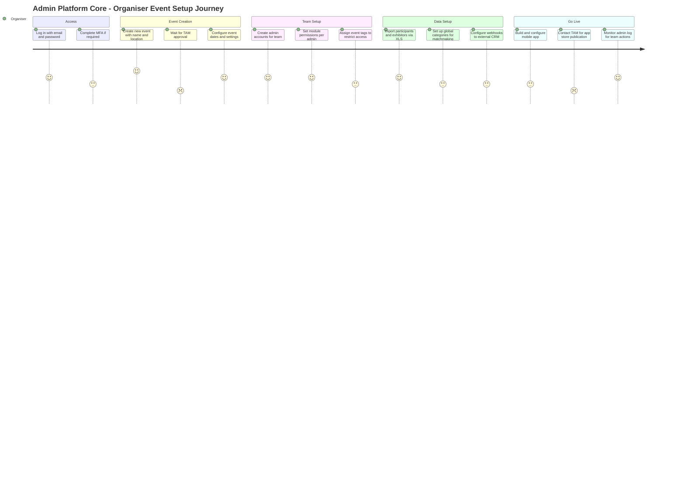
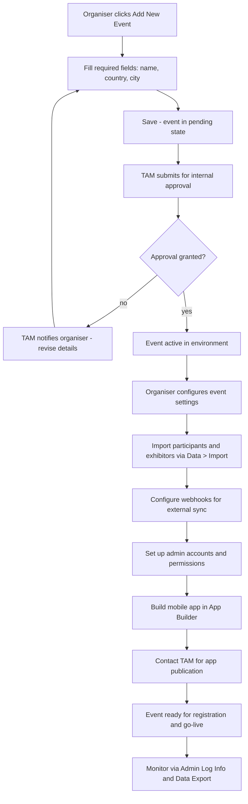
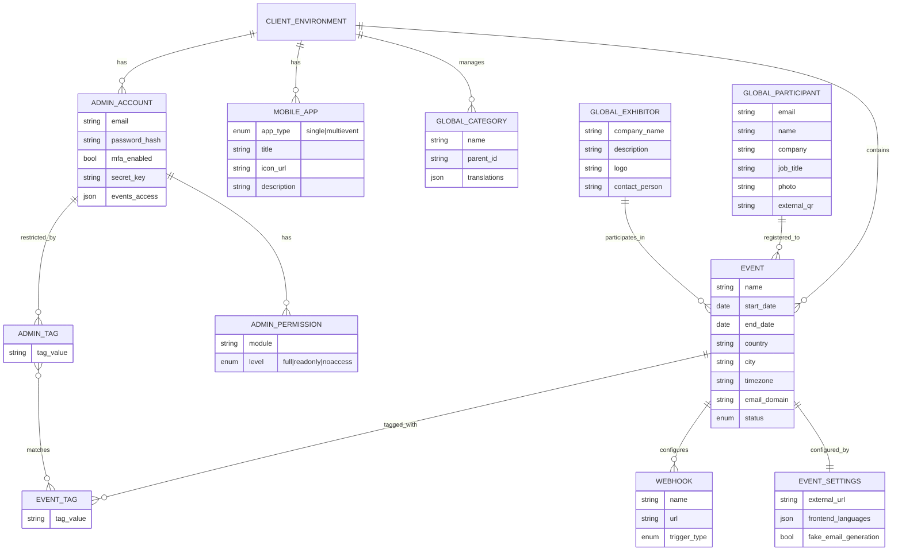
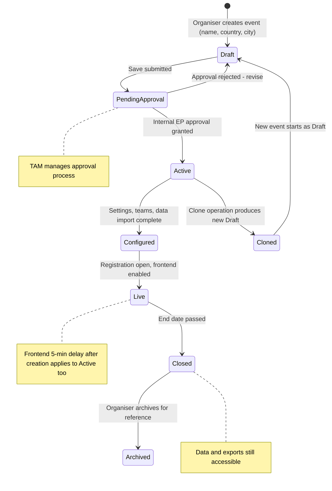
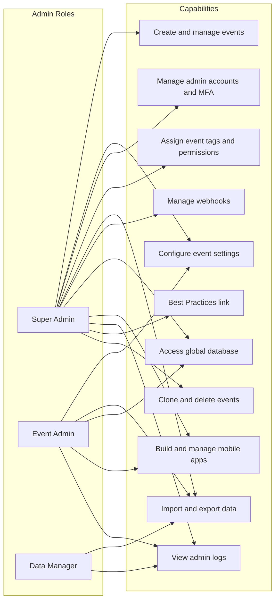

## 1. Product Overview

**Purpose.** Admin / Platform Core is the Organiser Client — the backbone of ExpoPlatform's event management infrastructure. It is the central admin panel through which an event organiser creates and configures events, manages their team's admin accounts and access, operates mobile apps, and governs the shared global database of participants and exhibitors across all their events.

**Problem being solved.** Large exhibition organisers run portfolios of many events, each requiring consistent branding, shared participant data, granular staff access control, and reliable data pipelines. Without a unified control plane they would need to re-enter data per event, grant overly broad access, and manage disconnected data silos. Admin / Platform Core solves all of this in one place.

**Business value.**
- One admin panel serves the entire client event portfolio with a single login and shared global database.
- Role-based permissions let organisers delegate safely — staff see exactly what they need and nothing more.
- Global vs. local field architecture ensures participants and exhibitors have consistent credentials and profiles across all events while per-event customisation remains possible.
- Bulk import / export and webhooks connect to external registration and CRM systems, removing manual re-keying.
- Mobile app creation and management are directly integrated, eliminating a separate tool.

**Target users.** Event organisers and their support staff who operate the back-end of events. Provisioning of the organiser's environment is done by ExpoPlatform staff via the separate Client Manager product.

**User personas.**
- *Lead Organiser / Super Admin* — configures all events, manages all admin accounts and permissions, accesses Best Practices configuration guidance, has no access restrictions.
- *Event Admin* — manages one or more assigned events within the permissions set for their account; may have Full Access, Read Only, or No Access per module.
- *TAM (Technical Account Manager)* — internal ExpoPlatform staff who manage event approval, app publication, and platform-level settings; uses Super Admin access.
- *Data Manager* — admin team member with access scoped to Data modules; handles imports, exports, and webhooks.

**Success metrics.** Time-to-configure a new event; number of permission-related support tickets; data import success rate; admin login failure / MFA adoption rate; global database record accuracy across events.

## 2. Product Scope

### Included
- **Event portfolio management** — create, search, clone, view (list/calendar), and approve events across the client's environment.
- **Per-event settings** — event name, dates, location (timezone), external URL, email domain, frontend language, country management.
- **Mobile app management** — access app builder, create apps (single / multi-event), configure app metadata, delete apps from builder.
- **Admin account management** — create accounts, assign permissions per module (Full / Read Only / No Access), manage admin categories, reset passwords, configure password-reset email template.
- **Multi-factor authentication (MFA)** — per-admin MFA setup with Google/Microsoft Authenticator, batch MFA email sending.
- **Admin Account Tags** — tag-based event-scoped access control, create/delete Exhibition-Event Tags.
- **Admin Log Info** — full audit trail of admin panel actions, filterable and exportable.
- **Global database** — shared participant and exhibitor records across all events; participants list, exhibitors list, global categories management.
- **Data import** — bulk import of Participants, Exhibitors, Products, Exhibitor Manual, Sessions, News via XLS templates.
- **Data export** — standard and custom export reports covering all entity types; field selection for key report types.
- **Webhooks** — event-driven outbound notifications on registration, cancellation, status changes, and session bookings.
- **Global vs. local fields** — architecture governing which participant/exhibitor data is shared cross-event vs. event-specific.
- **Global Search** (in progress, EP-3122) — cross-entity universal search across all content types on every admin page.
- **Pagination standardisation** — consistent pagination behaviour across admin lists.
- **Best Practices event configuration** — in-panel link to configuration guidance document (Super Admin only, EP-15563).
- **Admin panel tool tips and renamed settings** — usability improvements (EP-15966, EP-15967).

### Excluded
- Client environment provisioning (handled by Client Manager product).
- Global Module Management entitlements — governed by Client Manager / ExpoPlatform staff.
- Per-event frontend website building (handled by Website Builder / Sign In Page products).
- Registration form design and online registration pipeline (Online Registration product).
- Matchmaking, networking, and meetings (separate products).
- Analytics dashboards and reporting beyond raw data export (Organiser Analytics product).
- Mobile app store publication (requires TAM / developer via Jira request).
- Billing and invoicing (commercial systems external to the platform).

## 3. User Roles

> [!INFO] The platform defines external participant roles (Attendee, Exhibitor, Sponsor, Speaker) who access the event frontend. This product covers the **admin panel** only — accessed exclusively by organiser-side staff and ExpoPlatform team members.

| Role | Scope | Module access | Key restrictions |
| --- | --- | --- | --- |
| **Super Admin** | All events in the client environment | Full access to all modules, Accounts, Tags, MFA, Best Practices link | Assigned by ExpoPlatform TAM; no restrictions within the organiser panel |
| **Event Admin (Full Access)** | Events assigned to their account | Full create/edit/delete within permitted modules | Cannot access modules set to No Access; events filtered by assigned Admin Tags |
| **Event Admin (Read Only)** | Events assigned to their account | View content within permitted modules only; no create/edit/delete | Cannot modify data; useful for read-only reporting roles |
| **Event Admin (No Access)** | N/A for restricted modules | Blocked from viewing those modules entirely | Module not visible in the panel |
| **TAM (ExpoPlatform Staff)** | All client environments | Super Admin rights; also accesses Client Manager | Manages event approval, app publication, platform-level config |
| **Data Manager** | Events assigned | Access scoped to Data module only | No access to event configuration or account management unless explicitly granted |
| **Attendee / Speaker / Exhibitor / Sponsor** | Event frontend only | No access to admin panel | Cannot log in to the organiser admin panel at all |

**Permission levels applied per module:**
- **Full Access** — create, edit, and delete information within the module.
- **Read Only** — view information; no modifications allowed.
- **No Access** — module is completely hidden and inaccessible.

**Admin Tag filtering:** When an admin has Event Tags assigned to their account, they can only see and manage events carrying those same Exhibition-Event Tags. An admin with no tags assigned has default access to all events.

## 4. Feature Inventory

#### Admin Login — Native Authentication
**Description.** Email/password login for admins at the organiser's admin panel URL.
**Why it exists.** Restricts back-end access to authorised team members with personal credentials.
**User value.** Secure, auditable individual access; no shared passwords.
**Functional logic.** Admin enters username (email address) and password set during account creation. Credentials validated → session established → dashboard rendered.
**Preconditions.** Admin account must exist; credentials must be set.
**Trigger conditions.** Admin navigates to the admin panel URL.
**Processing logic.** Validate email/password → on success open session; on failure return error.
**Outputs.** Authenticated admin session.
**Dependencies.** Admin account record; password storage.
**Configurations.** Per-account email and password. Password reset email template configurable at `/admin/users/emails/reset_password_admin`.
**Validation rules.** Credentials are personal, not shared.
**Permissions.** All admin accounts.
**Error handling.** Invalid credentials → error message. Forgot Password: (1) another admin with equal rights resets from the panel; (2) "Forgot Password" button on login page → reset link sent to registered email.
**Edge cases.** Admin loses email access → requires Super Admin manual reset; stale browser session after password change.

#### Admin Login — Multi-Factor Authentication (MFA)
**Description.** Optional (configurable) additional TOTP authentication layer for the admin login flow. Delivered by EP-11695 (COMPLETE).
**Why it exists.** Protects admin panel against credential compromise, required by security-conscious clients (e.g. IMEX).
**User value.** Significantly reduces risk of unauthorised access.
**Functional logic.** Set up at Admin Panel → Accounts → MFA. Super Admin selects which admin users have access to the MFA setup tab. Global Enable/Disable MFA toggle controls the requirement. Supports Google Authenticator and Microsoft Authenticator. Each user is assigned a Secret Key. Batch Send MFA Email: send setup instructions to multiple admins at once. Individual Send MFA Email action per user. Event Selection dropdown to filter users by event.
**Preconditions.** Super Admin must enable MFA and select applicable users. Users must complete MFA enrolment.
**Processing logic.** On login: credential validation passes → TOTP code prompt → validate code → grant session.
**Outputs.** Authenticated session with MFA verification record.
**Dependencies.** Google / Microsoft Authenticator TOTP; email delivery for setup instructions.
**Configurations.** Per-event enable/disable; per-user access to MFA tab; selective disable for specific users.
**Permissions.** MFA setup tab: Super Admin by default; Super Admin can grant access to other admins.
**Error handling.** Invalid TOTP code → access denied. Lost device → Super Admin must reset/re-enrol.
**Edge cases.** MFA disabled selectively for specific admins; large batch MFA email send; user on multiple events.

#### Admin Password Reset — Template Configuration
**Description.** Customisable drag-and-drop email template for the password reset email sent to admins.
**Why it exists.** Allows organisers to brand the reset email and control its content.
**Functional logic.** Navigate to Admin Panel → Accounts → Reset Password Email Template. Drag-and-drop builder with Subject, From Name, From Email configuration. Variables available: `{NAME}`, `{LAST_NAME}`, `{RESET_LINK}`, `{LOGIN}`, `{PASSWORD}`. Mobile and desktop preview toggle. Save → applies immediately.
**Permissions.** Super Admin or admin with access to Accounts module.
**Edge cases.** Template not saved before testing → old template used; missing `{RESET_LINK}` variable → admins cannot complete reset.

#### Event List Management
**Description.** The main events dashboard at `/admin/exhibitions/list` showing all events in the client environment, with search, view switching, and CRUD operations.
**Why it exists.** Provides the organiser's single point of navigation across their entire event portfolio.
**User value.** Fast event location and status overview for multi-event organisations.
**Functional logic.** Two tabs: **Current Events** (today's date between Start Date and End Date) and **All Events** (all events including past). List view (default): columns Logo, Name, Event ID, Event Tags, City, Country, Start Date, End Date, Type (Event or Community), Attached to (parent event), Actions (Clone / Delete). Calendar view: days coloured Blue (events), Gray (past), White (empty); browse by month or year; Today button to return to current date.
**Search.** Search bar applies to event name and event tags. Space character included verbatim in query. Must press Enter or click magnifying glass to execute.
**Preconditions.** At least one event created and approved.
**Configurations.** Toggle between Current and All Events; toggle between list and calendar view.
**Permissions.** All logged-in admins (events filtered by Admin Tags if applicable).
**Error handling.** Search with leading/trailing space or misspelled tag returns no results.
**Edge cases.** Admin with specific Event Tags sees only tagged events; test events appear in list; community-type events appear alongside exhibition events.

#### Event Creation
**Description.** Creates a new event within the client's environment.
**Why it exists.** Enables the organiser to spin up new event editions or new event brands.
**Functional logic.** Click "Add New Event" on events list → opens `/admin/general/new?m=t`. Required fields: Event name, Country, City. Save → event submitted for internal approval. Note: wait at least 5 minutes after creation before the frontend becomes accessible (403 error shown immediately after creation).
**Trigger conditions.** Organiser starts a new event edition.
**Processing logic.** Validate required fields → save to database → submit for approval workflow.
**Outputs.** New event record in pending-approval state.
**Dependencies.** Event approval process (managed by TAM).
**Validation rules.** Event name, Country, City are mandatory.
**Permissions.** Super Admin; event admins with "Add New Event" access if granted.
**Error handling.** Missing required fields → validation error. Frontend 403 immediately after creation → expected, wait 5 minutes.
**Edge cases.** Creating a duplicate event name; test vs. real event affects billing.

#### Event Approval
**Description.** Internal approval gate before a newly created event becomes functional.
**Why it exists.** Ensures ExpoPlatform maintains oversight of new client events for billing and provisioning purposes.
**Functional logic.** On event creation, the event enters a pending state. Internal ExpoPlatform approvers (managed by the TAM) review and approve the event before it is accessible to the organiser for further configuration.
**Permissions.** Internal ExpoPlatform approvers only (outside organiser's control).
**Edge cases.** Approval delay blocks event configuration — organiser should coordinate with TAM.

#### Event Cloning
**Description.** Creates a copy of an existing event as the starting point for a new edition.
**Why it exists.** Saves significant setup time for recurring annual events by carrying over configuration, content, and optionally participant/exhibitor data.
**Functional logic.** Clone button on events list → pop-up. Checkbox "Exhibitors and their products" (products inactive by default in clone). Sub-options when checked: Product category relations (Activity/Interest categories, product categories, custom filters), Retain Product Status, Exhibitors' brands remain. Sessions: cloned in full with no opt-out; no bulk delete (each removed individually, ~20 min for 200+ sessions). Choose Real or Test event type.
**Outputs.** New event with cloned configuration.
**Post-Clone Checklist.** Review email templates (old event name/dates), registration pipeline conditional fields, exhibitor data (products inactive), session settings, floor plan assignments, event dates throughout settings, payment/invoice settings.
**Permissions.** Super Admin or admin with Clone access.
**Error handling.** Products inactive by default → organiser must activate them per-exhibitor.
**Edge cases.** Cloning an event with 200+ sessions — manual individual deletion required; product category custom filters optionally copied; test event has no external domain.

#### Per-Event Settings
**Description.** Core configuration fields for each individual event, accessed at `/admin/general/edit`.
**Why it exists.** Every event requires unique identity and operational parameters before any content or registration can work.
**Functional logic.** Settings managed per event:
- **Event name** — required; used throughout platform (website, emails).
- **Event dates** — start and end dates; define "Current Events" filter.
- **Event location** — Country (required) and City (required, used to set timezone), Address, Venue. Warning on change: alters timezone for meetings/sessions.
- **External URL** — link to an external event website if applicable.
- **Email domain** — the domain used for outbound event emails.
- **Frontend language** — languages available on the event frontend (must be pre-enabled for the client by Engineering; multilanguage toggle required in Global and Event Module Management). Available: AR, NL, EN, FI, FR, DE, IS, IT, PL, PT, RU, ES, ES_LAT, TR, THA, VT.
- **Country management** — manage countries available for address/profile fields.
- **Fake email generation** — if ON: new accounts created for existing email conflicts (import/API); if OFF: existing accounts updated.
**Validation rules.** Event name, Country, City mandatory. Email domain must be valid format. Language changes require Module Management toggle.
**Permissions.** Super Admin and admins with Event Setup access.
**Error handling.** Changing location after content entered → warning pop-up about potential time/date shifts.
**Edge cases.** Multilanguage enabled for client but not in Event Module Management → languages unavailable.

#### Mobile App Management — App Builder Access
**Description.** Entry point to the App Builder from the organiser admin panel.
**Why it exists.** Provides the organiser's route into building and managing mobile apps without needing a separate system.
**Functional logic.** Access via global management panel or event management section → redirected to `admin/appbuilder/list`. From here create, configure, or delete apps.
**Permissions.** Admins with App Builder access in their permissions.
**Dependencies.** App Builder module; Client Manager App Build pipeline for store publication (separate).

#### Mobile App Creation
**Description.** Create and configure a new mobile app (Single Event or Multi-event).
**Why it exists.** Allows organisers to deploy a branded event app without developer involvement for setup.
**Functional logic.** In App Builder: "Add New App" → empty app created → configure: App Type (Single Event / Multi-event), Event Tags (required for multi-event, links to tagged events), In-App Update toggle, App Title (store-facing name), Icon (JPG/PNG), Splash Screen (JPG/PNG), App Description. Save → app persists in list for further configuration.
**Preconditions.** For multi-event apps: event tags must be added to the target events.
**Outputs.** App configuration record in builder; publication to stores requires TAM / developer via Jira.
**Dependencies.** Event Tags on events (for multi-event); Client Manager build pipeline (for publication).
**Configurations.** App Type, Event Tags, visuals, description.
**Permissions.** Admin with App Builder access.
**Error handling.** Creating/deleting in builder does NOT affect published app store version.
**Edge cases.** Multi-event app with no event tags → no events linked; app created but not submitted to TAM → never published.

#### Mobile App Deletion
**Description.** Remove an app from the App Builder interface.
**Why it exists.** Declutters the builder interface from unused app configurations.
**Functional logic.** Delete in app builder removes the configuration record only. Does NOT remove the app from Apple App Store or Google Play if already published. Irreversible in builder. To remove from stores: submit Jira request to developers.
**Permissions.** Admin with App Builder access.
**Edge cases.** Deleting a live published app from builder does not alert users; app remains accessible to end-users in stores.

#### Admin Account Creation and Management
**Description.** Create and manage admin user accounts for the organiser's team.
**Why it exists.** Enables the organiser to safely delegate back-end operations to multiple team members with appropriate access.
**Functional logic.** Two paths:
- **Path 1 (Main Admin Panel → Accounts → Add User):** General account form — Photo, Name/Surname, Job Title, Email (username), Password, Admin Categories, Receive System Notifications, Events Access dropdown. Creates a cross-event account; event-specific permissions set separately.
- **Path 2 (Event-Specific):** Same base fields plus Pages to Access permissions table (Full Access / Read Only / No Access per module and submodule) and Admin Tags assignment.
**Key modules for permissions:** Event Setup, Registration Settings, Hospitality, Management, Exhibitor Manual, Hosted Buyers Management, Marketing, Analytics, OnSite, Data. Additional: Sessions, Forms, Zones, Events List, Add New Event, User Access, Database, Tags Manager.
**"All" checkbox** sets uniform access level across all modules at once.
**Admin Categories** (purely informational, no access effect): created at Admin Panel → Accounts → Admin Categories; assigned to users for organisational labelling.
**Preconditions.** Super Admin or account with Accounts module access.
**Outputs.** New admin account; immediately usable.
**Permissions.** Super Admin creates and manages all accounts; admins with Accounts access manage within scope.
**Error handling.** Duplicate email → account creation prevented. Events Access not set → admin may not see any events.
**Edge cases.** Account created on Path 1 with no permissions table set → default access level applies; event-specific permissions override general if set.

#### Admin Account Tags
**Description.** Tag-based mechanism to restrict which events an admin can see and manage.
**Why it exists.** Large organisations with multiple event brands need to silo their admin teams — TAMs or regional managers should only see their own events.
**Functional logic.** **Creating tags:** Events List in Admin Panel → "Event Tags" area → type tag name → Enter. Tags appear under Admin Panel → Tags → Event Tags. **Assigning to admin:** Admin Panel → Accounts → select admin → Admin Info → Admin Tags dropdown → select one or more tags → Save User. **Effect:** Admin sees only events with matching Exhibition-Event Tags. Multi-tag = union (access to events matching any selected tag). No tags = default access to all events. Tag filtering also applies in the multievent app builder. **Deleting tags:** Admin Panel → Tags → Exhibition-Event Tags → click "x". Warning: deletes tag from associated events; if only tag on an event, that event disappears from multievent app.
**Dependencies.** Event Tags on events; multievent App Builder (also filtered by tags).
**Configurations.** Tags are free-text strings; created at events list or Tags menu.
**Permissions.** Super Admin creates and manages tags; tag dropdown visible to Super Admin managing other accounts.
**Error handling.** Deleting a tag that is the sole tag on an event removes that event from multievent app visibility.
**Edge cases.** Note: "Admin Tags" listed in Admin Panel → Tags is non-functional — use "Event Tags" / "Exhibition-Event Tags" exclusively.

#### Admin Log Info
**Description.** Audit log of all actions performed by admins in the admin panel. Enhanced by EP-15209 (COMPLETE) with ClickHouse-backed data.
**Why it exists.** Provides accountability and traceability — organisers can see exactly what changes were made and by whom across their team.
**Functional logic.** Located at Admin Panel → Data → Log Info. Filter by: Events, Date Range, Username, Search field (search by request body), Controllers (which module was updated), Action taken. Advanced Filter for custom criteria. All log data can be exported.
**Outputs.** Filterable, exportable log table.
**Dependencies.** ClickHouse data store (post EP-15209); all admin actions feed the log.
**Permissions.** Admins with Data module access; typically Super Admin.
**Edge cases.** Logs from before EP-15209 may use the old `/admin/data/logInfo` data source; new logs use ClickHash/ClickHouse format matching API public logs design.

#### Global Database — Participants List
**Description.** Cross-event view of all participant (visitor) records in the shared global database.
**Why it exists.** Organisers need to manage the same person's profile across multiple event editions from one place.
**Functional logic.** Data blocks at top: Total Number = Visitors + Team Members; Total Active Visitors = Visitors only; Total Registered Visitors = Visitors only. Use Exhibitor filter to isolate Team Member count. Columns: Profile Avatar, Name, Company Name, Session. Quick Actions: Delete Globally (permanent, irreversible; confirmation modal), Deactivate (inactive across all events; data retained), Export Profile (XLS). Search by Name, Surname, or Email. Add New Participants. **Profile Completion Indicator** shows score per participant based on: photo, job title, interests, company, consent — helps identify participants needing profile completion reminders. EP-11654: Job title displayed in participants list (COMPLETE).
**Permissions.** Admins with Database or Management module access.
**Error handling.** Delete triggers confirmation modal: "cannot be reversed." Deactivate is reversible.
**Edge cases.** Total Number includes Team Members — use filter to get Visitor-only count; profile completion criteria version may differ from registration form.

#### Global Database — Exhibitors List
**Description.** Cross-event view of all exhibitor company records in the shared global database.
**Why it exists.** Exhibitor company profiles persist across events; admins manage them centrally.
**Functional logic.** Entries: Company Logo, Company Name, Session. Quick Actions: Delete Globally, Deactivate. Search by Name or Email. Add New Exhibitors. EP-23019: "Customer Service" button in "..." actions menu on the list allows logging in as exhibitor without navigating to the individual account first (COMPLETE). EP-23021: Persistent filter/search after returning from account (COMPLETE).
**Permissions.** Admins with Exhibitors / Database access.

#### Global Categories Management
**Description.** Manage the taxonomy of interest/activity categories used across all events for matchmaking and filtering.
**Why it exists.** Consistent category taxonomy is required for cross-event matchmaking, networking, and search filtering.
**Functional logic.** Global Categories section: "Create New Main Category" → edit/delete categories; "+" icon for subcategories. Bulk Import from XLS file (example file available) and Export to XLS. Content Language setting for multilingual category names.
**Dependencies.** Matchmaking / networking modules consume these categories; participant and exhibitor profiles reference them.
**Permissions.** Super Admin or admin with Categories / Database access.
**Edge cases.** Deleting a category used by participants/exhibitors may break existing profile-category links.

#### Data Import
**Description.** Bulk upload of event data via XLS/CSV templates.
**Why it exists.** Organisers receive data from external registration systems, CRM, or exhibitor portals and need to load it into ExpoPlatform efficiently.
**Functional logic.** Located at Admin Panel → Data > Import/Export. Importable types: Participants, Exhibitors, Products, Exhibitor Manual, Sessions, News. Download template for each type; last import date shown. Rules: do not change column positioning or naming; leave unused columns blank; select correct language for multi-language events. **Update existing records:** provide the record ID in the import file; without ID, system treats entry as new and creates a duplicate account.
**Outputs.** Records created or updated in the event/global database.
**Dependencies.** XLS/CSV templates; correct column structure.
**Validation rules.** ID required for updates; incorrect ID creates new record. Column headers must match template exactly.
**Permissions.** Admins with Data module access.
**Error handling.** Column header mismatch → import fails or data maps incorrectly; missing ID on update → new duplicate created.
**Edge cases.** Importing in wrong language for multi-language event; importing participant with existing global email (fake email generation setting affects behaviour).

#### Data Export
**Description.** Generate and download structured data reports for all entity types.
**Why it exists.** Organisers and their clients need raw data for CRM integration, compliance, reporting, and post-event analysis.
**Functional logic.** Admin Panel → Data > Import/Export → Export tab. Click Export button → report generated → download link appears above button. Re-click generates updated report. **Reports with field selection** (including custom fields): Visitors, Exhibitors, Pending Exhibitors, Team members, Speakers, Exhibitor Manual, Meeting Wizard, Custom Meeting Wizard, Check-in List. "All fields" checkbox exports every field including custom fields. **Reports without field selection:** Scanned badges (exhibitor/visitor), Visitors/exhibitors login data, Meetings, Seated Meetings, Favourites, Messages, Payments, Exhibitor interactions, Team member daily interactions, Product brands, Products, Downloaded content, QR codes, Sessions, Session ratings, Unique mobile app logins, Standard report, News, Speed Networking feedback. **Custom Reports:** "Create report" → select and order any available fields → saved for reuse; editable/deletable. Timezone shown per event's country setting on General Info; timezone changes apply to future reports only.
**Outputs.** XLS / CSV download files.
**Permissions.** Admins with Data module access.
**Edge cases.** Changed timezone → historical exports retain old timezone; custom report builder available for Visitors only (not all types).

#### Webhooks
**Description.** Event-driven outbound HTTP notifications to external systems.
**Why it exists.** Integrates ExpoPlatform with external CRM, registration, or analytics systems without requiring manual data exports.
**Functional logic.** Admin Panel → Data → WebHooks → Add New WebHook. Fields: WebHook Name, WebHook URL, Trigger Type. **Available triggers:** Buyer Registration (buyer registration completed), Buyer Status/Category change, Buyer Agent Change, Visitor Registration cancellation, Global Visitor Removal (participant deleted from global database), Session Booked (participant books a paid session). Test via Test Request button → POST sent with sample payload (JSON array with id, firstname, lastname, jobtitle, company, sessions[], event_id, time). Use `https://webhook.site/` to inspect test requests.
**Outputs.** HTTP POST to configured external URL.
**Dependencies.** External endpoint must accept POST requests.
**Configurations.** Name, URL, Trigger Type per webhook; multiple webhooks supported.
**Permissions.** Admins with Data module access.
**Error handling.** Use Test Request to validate endpoint before going live. No built-in retry logic documented — external system must handle delivery failures.
**Edge cases.** Webhook URL unreachable → payload lost; test payload is sample data, not live record.

#### Global vs. Local Fields Architecture
**Description.** The foundational data model governing which participant and exhibitor data is shared across all events vs. stored per event.
**Why it exists.** In a multi-event portfolio, certain profile data should follow the person across all events (consistent identity) while other data is specific to each event (event-specific registration choices).
**Functional logic.** **Global (shared across all events in environment):** Visitor — Name, Email, Company, Job title, Photo, Login credentials, Behavioural data for matchmaking, External QR; Exhibitor — Company name, description, logo, contact info, Contact Person, Login credentials, Products (add/update), Overall product taxonomy. **Local (per-event):** Visitor — Interests, Activities, T&C/privacy policy acceptance, Notification settings; Exhibitor — Team members (admin and regular), Activate/deactivate products, Product categories per event, Exhibitor category (gold/silver/bronze), News. **Note:** if previous edition content appears in new edition, resave the data on that page to refresh it.
**Dependencies.** All products that create or modify participant/exhibitor data must respect this architecture.
**Edge cases.** Stale content from previous edition → resave page to refresh; local fields reset per event while global fields persist.

#### Global Search (Admin Panel)
**Description.** Universal cross-entity search accessible on every page of the admin panel. Epic EP-3122 (In Progress); Stage 1 EP-13095 (COMPLETE).
**Why it exists.** Admins managing large events need to find any entity — participant, exhibitor, session, news article, product — without navigating to the specific list page first.
**User value.** Eliminates navigating between multiple list pages to find content; matches the expectation of a universal search bar (originally requested by Informa-QMED).
**Functional logic.** Stage 1 (EP-13095, COMPLETE): rewrote search mechanism with multiplicators as solid base. Current list-level search: Exhibitors page — search by Exhibitor Name or Email; Participants page — search by Name, Surname, or Email. Global epic (EP-3122, In Progress): extend search to all content types (suppliers, products, news, white papers, brochures) on every page with universal search results. Persistent filter/search behaviour (EP-23021, COMPLETE): filters and search values retained when navigating back to list from an account or session page.
**Configurations.** Per-page search fields vary; global search bar to be available across all pages.
**Permissions.** All logged-in admins (scoped to accessible entities per their permissions).
**Edge cases.** Search on Participants uses Name/Surname/Email; Exhibitors uses Name/Email only; space character included in query (affects results); EP-23021 persistent state resets on full page reload.

#### Admin Panel Pagination Standardisation
**Description.** Consistent pagination controls across all admin list views.
**Why it exists.** Large event datasets (hundreds of exhibitors, thousands of participants) require predictable, performant pagination.
**Functional logic.** Standard paginated tables across Participants, Exhibitors, Sessions, and other list views. Persistent filter/search state (EP-23021) ensures that navigating to a record and returning does not reset the current page or filters.
**Dependencies.** EP-23021 (COMPLETE); EP-49697 test data seeding infrastructure validates pagination correctness under varied inputs.
**Edge cases.** Filter returning zero results on a non-first page; concurrent admin users applying different filters.

#### Best Practices Event Configuration
**Description.** In-panel shortcut to the ExpoPlatform Best Practices configuration guide. Delivered by EP-15563 (COMPLETE).
**Why it exists.** TAMs and Super Admins need quick access to recommended event configuration patterns without leaving the admin panel.
**Functional logic.** Button placed in Admin Panel top menu bar next to Module Management option. Visible to Super Admins only. On click: opens linked Google Slides presentation (Best Practices: Event Configuration). Hyperlinked to the official presentation URL.
**Permissions.** Super Admin only.
**Edge cases.** Link to external document; if presentation URL changes, button target must be updated by ExpoPlatform team.

## 5. User Stories Mapping

| Story ID | Title | Summary | Acceptance criteria | Related feature | Status |
| --- | --- | --- | --- | --- | --- |
| EP-3122 | Global Search functionality | Universal search across all content types on every admin page | Search bar on every page; results include all content (suppliers, products, news, white papers, brochures) | Global Search | In Progress |
| EP-11654 | Display Job title in the Participants list on the back end | Show job title column in the Participants list | Job title visible in participants list for all admins | Participants List | COMPLETE |
| EP-11695 | MFA — Admins | Add MFA for admin login with Google/Microsoft Authenticator | MFA tab in Accounts; toggles per user; batch email; TOTP on login | Admin Login — MFA | COMPLETE |
| EP-13095 | Global search (Stage 1) | Rewrite search mechanism with multiplicators as solid base for global search | Old search replaced; multiplicators incorporated; new search passes testing | Global Search Stage 1 | COMPLETE |
| EP-15209 | Admin logs — Add logs from ClickHouse to admin panel | Replace old log page with ClickHouse-backed log matching API public logs design | New log page at Data → Log Info with ClickHouse data; filter by events, date, username, controllers, action | Admin Log Info | COMPLETE |
| EP-15563 | Incorporating Best Practices Event Configuration in Admin Panel | Add Best Practices link button in top menu for Super Admins | Button visible next to Module Management; Super Admin only; opens linked presentation | Best Practices Event Configuration | COMPLETE |
| EP-15966 | Adding Tool Tips in the Admin Panel | Add tool tips at various places within Admin Panel per module | Tool tips visible at all specified locations per reference spreadsheet | Admin panel UX | COMPLETE |
| EP-15967 | Renaming settings in the Admin Panel | Rename settings for clarity per reference spreadsheet | All listed settings renamed; confirmed by TAMs | Admin panel UX | COMPLETE |
| EP-23019 | Adding a customer service button to "..." actions in exhibitor/visitor list | Add Customer Service button to list-level actions menu | Button appears in "..." menu on exhibitor/visitor list; click logs in as that user | Exhibitors List / Participants List | COMPLETE |
| EP-23021 | Persistent Filter and Search Behavior for Visitor, Exhibitor, Sponsor, and Session lists | Retain filters and search values when navigating back to list | Filters and search values retained after clicking "back to list"; no re-entry needed | Admin Pagination / Search | COMPLETE |
| EP-37164 | Extending the List of Available Variables for Registration Email Templates | Add all standard and custom form fields as variables in registration email templates | All standard system fields and custom fields available as variables in registration email templates | Event Settings / Email | COMPLETE |
| EP-39637 | Hyve UX improvements | Add search and filtering to Favourites section for Participants and Exhibitors | Favourites section has same filters as main listings on both web and app | Global Database / Search | COMPLETE |
| EP-40301 | InfoSalons/Aditus Participant API | New native integration for Aditus/InfoSalons registration portal | Aditus API integration added; participants sync from InfoSalons portal | Data / Integrations | COMPLETE |
| EP-41867 | HINTE — Genesis World Integration | New native integration between ExpoPlatform and GenesisWorld CRM | GenesisWorld integration settings in Admin Panel; API key, username, password, URL, resync; exhibitor sync options | Data / Integrations | COMPLETE |
| EP-45281 | Security vulnerabilities | Remediate penetration test findings; improve security grade from D to B | Security grade improved to at least B; vulnerabilities from pentest list resolved | Admin Login / Security | In Progress |

> [!INFO] EP-10326, EP-22099, EP-39387, EP-46522, EP-49697 are engineering infrastructure epics (serverless migration, component library, communication improvements, microservices prep, test seeding) — not directly user-facing features, so not mapped to specific admin panel features above.

## 6. End-to-End Workflows

### User Journey — Organiser setting up a new event

### System Workflow — Event creation and configuration pipeline

### Happy Path
Organiser logs in with credentials and MFA → navigates to events list → creates new event (name, country, city) → TAM approves → configures event settings (dates, language, email domain) → creates admin accounts with module permissions → imports participants and exhibitors via XLS → configures webhooks → builds mobile app → contacts TAM for publication → event goes live → monitors admin log and runs data exports post-event.

### Alternate Paths
- **Cloning instead of creating:** For recurring events, organiser clones a prior edition → reviews post-clone checklist → updates dates and email templates → activates exhibitor products.
- **Admin Tag scoping:** For multi-brand organisations, admin accounts are restricted by event tags so regional teams manage only their events.
- **Custom export report:** Organiser creates a custom visitor export with specific field order for their CRM integration.

### Exception Paths
- **Approval delay:** Event created but not approved → organiser cannot configure; must contact TAM.
- **403 on frontend:** Expected immediately after event creation; wait 5 minutes.
- **Import creates duplicates:** ID not provided in import file → system creates new records instead of updating.
- **MFA device lost:** Admin cannot log in until Super Admin re-enrols them.

### Recovery Paths
- **Approval delay:** Escalate to TAM to fast-track approval.
- **Import duplicates:** Identify duplicates via Participants List, export to find IDs, re-import with IDs to merge/update.
- **Lost MFA device:** Super Admin disables MFA for that user → re-enrols on new device → re-enables.
- **Accidental profile deactivation:** Deactivate is reversible — navigate to profile and reactivate.
- **Accidental profile deletion:** Delete is irreversible — must be re-imported from external source.

## 7. Business Rules Engine

| # | Rule | Condition | Exception / Priority | Conflict resolution |
| --- | --- | --- | --- | --- |
| BR-1 | Admin login requires valid personal email/password | Every login attempt | No shared credentials | Login denied if credentials invalid |
| BR-2 | MFA code required when MFA enabled for the admin user | Login after credential validation passes | Super Admin can disable MFA per user | Login denied without valid TOTP |
| BR-3 | New events require internal approval before becoming functional | On event creation | Managed by TAM | Event remains non-configurable until approved |
| BR-4 | Event name, Country, and City are required for event creation | On save of new event | No exceptions | Save blocked until all three fields provided |
| BR-5 | Changing event Country/City after content exists may shift meeting/session times | On location save | Warning shown | Organiser must confirm; timezone shifts applied to all time-based content |
| BR-6 | Admin Account Tags restrict event visibility to matching Exhibition-Event Tags | When tags assigned to admin | No tags = default (all events visible) | Union logic for multi-tag; tag deletion removes event from multievent app if it was the only tag |
| BR-7 | Permission levels (Full/Read Only/No Access) apply per module per admin | Always | Super Admin has no restrictions | Most restrictive level applies if ambiguous |
| BR-8 | Importing without a record ID creates a new account; with correct ID updates existing | On data import | Fake email generation setting modifies behaviour for email conflicts | Always provide ID for update operations |
| BR-9 | Fake email generation ON: new account created for email conflict (import/API); OFF: existing account updated | When import/API hits existing email | Configured per event | Setting must be reviewed before each import run |
| BR-10 | Global fields (name, email, login credentials, behavioural data) are shared across all events | Always | Cannot make global fields local | Any update to global field propagates across all events |
| BR-11 | Local fields (interests, T&C, notification settings, exhibitor team members) are per-event only | Always | — | Local field reset on new event; not inherited |
| BR-12 | Deleting a participant from global database is irreversible | On delete action | Confirmation modal required | No recovery path; use Deactivate instead if recovery needed |
| BR-13 | App deletion in App Builder does not remove app from stores | Always | Requires Jira request to developers for store removal | Builder deletion is irreversible |
| BR-14 | Frontend language requires client-level enablement by Engineering AND multilanguage toggle in Module Management | On language selection | — | Both conditions must be true for language to appear |
| BR-15 | Best Practices Event Configuration button visible to Super Admin only | Always | TAMs who are Super Admins can access | Non-Super Admins do not see the button |
| BR-16 | Persistent filter/search state retained when returning to list page | After EP-23021 | Full page reload resets state | Back navigation preserves filters; fresh navigation resets |

## 8. Data Model

### Entity Relationship Diagram

**Inputs.** Admin credentials; event configuration fields; import XLS files; webhook payloads; app metadata; permission assignments; event tags.

**Outputs.** Authenticated sessions; event configurations; participant/exhibitor records; export files; webhook POST calls; app builder records; audit logs.

**Lifecycle states.**
- *Event:* Draft (pending approval) → Active (approved, configurable) → Live (registration open) → Closed (past end date) → Archived.
- *Admin account:* Active → Deactivated (blocked login) → Deleted (removed).
- *Participant/Exhibitor record:* Active → Deactivated (visible in DB, excluded from event) → Deleted (global irreversible removal).
- *Mobile app:* Draft (in builder) → Submitted (to TAM for publication) → Published (in stores) → Removed from builder (stores unaffected).

### State Diagram — Event Lifecycle within the Organiser Client

## 9. Permissions Matrix

### Permission Flow

### Role × Capability Table

| Capability | Super Admin | Event Admin (Full) | Event Admin (Read Only) | Data Manager | Attendee/Exhibitor/Speaker |
| --- | --- | --- | --- | --- | --- |
| Create / clone / delete events | ✅ | ❌ unless granted | ❌ | ❌ | ❌ |
| Configure event settings | ✅ | ✅ if Event Setup granted | Read only | ❌ | ❌ |
| Create / manage admin accounts | ✅ | ✅ if Accounts granted | Read only | ❌ | ❌ |
| Set module permissions | ✅ | ✅ if Accounts granted | ❌ | ❌ | ❌ |
| Configure MFA | ✅ | ✅ if granted in MFA tab | ❌ | ❌ | ❌ |
| Manage admin account tags | ✅ | ❌ unless Tags access granted | ❌ | ❌ | ❌ |
| Import data | ✅ | ✅ if Data granted | ❌ | ✅ | ❌ |
| Export data | ✅ | ✅ if Data granted | ✅ if Data Read Only | ✅ | ❌ |
| Manage webhooks | ✅ | ✅ if Data granted | ❌ | ✅ | ❌ |
| Global database (view/edit) | ✅ | ✅ if Database granted | Read only | Read only | ❌ |
| Global categories management | ✅ | ✅ if Categories granted | Read only | ❌ | ❌ |
| Build mobile apps | ✅ | ✅ if App Builder granted | ❌ | ❌ | ❌ |
| View admin logs | ✅ | ✅ if Data granted | Read only | ✅ | ❌ |
| Best Practices link | ✅ | ❌ | ❌ | ❌ | ❌ |
| Access admin panel | ✅ | ✅ | ✅ | ✅ | ❌ |

> [!INFO] Event Admin access is always bounded by their Admin Account Tags — even Full Access admins only see events whose tags match their assigned tags. No tags = all events visible.

## 10. Integrations

| Integration | Purpose | Trigger | Data exchanged | Failure handling | Retry | Security |
| --- | --- | --- | --- | --- | --- | --- |
| **Webhooks (outbound)** | Push registration/status events to external CRM or registration system | Buyer Registration, Buyer Status/Category change, Buyer Agent Change, Visitor Registration cancellation, Global Visitor Removal, Session Booked | JSON payload: participant id, name, jobtitle, company, sessions[], event_id, timestamp | No built-in retry; external system must handle; use webhook.site for testing | Manual re-trigger via Test Request | HTTPS POST to configured URL; organiser responsible for endpoint security |
| **Data Import (XLS/CSV)** | Bulk load participants, exhibitors, products, sessions, news | Manual upload by admin | XLS file per import type; column-specific templates | Import fails or creates duplicates on wrong structure; last import date visible | Re-import with corrected file | Admin authentication required; file validated against template structure |
| **Data Export (XLS)** | Extract event data for external analysis or CRM sync | Manual export click or report regeneration | XLS/CSV export files; all field types including custom fields | Re-click Export for fresh file; timezone may differ if changed post-export | Re-click Export button | Admin authentication required |
| **InfoSalons/Aditus Participant API (EP-40301)** | Sync participants registered via Aditus/InfoSalons portal | API call from InfoSalons on registration | Participant registration data | Platform processes API payload; errors logged | External system retries | Native integration; API-key authenticated |
| **GenesisWorld CRM (EP-41867)** | Bidirectional sync between EP and GenesisWorld | Resync button in Admin Panel → General → Settings → GenesisWorld | Exhibitor data; API key, username, password, main URL | Error shown in settings; resync button available | Manual Resync button | Credentials stored in settings; HTTPS |
| **Google / Microsoft Authenticator (MFA)** | Second factor for admin login | Each admin login with MFA enabled | TOTP code validation | Access denied on invalid code; admin must re-enrol on device change | N/A (per-login) | TOTP (time-based one-time password); Secret Key per user |
| **App Store Build Pipeline** | Publish mobile apps to Apple App Store and Google Play | TAM-initiated via Client Manager (after organiser request) | App build metadata; publish outcome | Error status in Client Manager; TAM contacts developer | Manual re-trigger via Client Manager | Managed by ExpoPlatform Engineering |

## 11. Notifications

> [!INFO] Admin / Platform Core is a back-end management tool. Most notifications are operational (account-specific) rather than mass marketing communications.

**Admin password reset email.** Sent to admin when they click "Forgot Password" on the login page. Customisable template at `/admin/users/emails/reset_password_admin` and Admin Panel → Accounts → Reset Password Email Template. Variables: `{NAME}`, `{LAST_NAME}`, `{RESET_LINK}`, `{LOGIN}`, `{PASSWORD}`.

**MFA setup email.** Sent to admin users when their MFA enrolment is triggered. Configurable template via MFA Email Setup button. Batch send available. Contains MFA secret key and setup instructions.

**System notifications.** Admins with "Receive System Notifications" checked on their account profile receive relevant system updates and alerts (exact content depends on platform-level system events).

**No-access / login-required messages.** Pages set to "Sign-in only" mode redirect unauthenticated visitors to the login page. Pages in "Open access" mode show a login pop-up on interaction attempt.

**Frontend 403 notice.** Immediately after event creation, visitors to the event frontend see a 403 error. This is transient (clears within 5 minutes); no action required.

> [!WARN] Mass email/SMS/push notifications to participants and exhibitors are NOT managed from Admin / Platform Core — those are handled by the User Engagement / Communications products.

## 12. Reporting & Analytics

Admin / Platform Core provides raw data export capability rather than built-in analytics dashboards. Analytical visualisations for event performance live in the Organiser Analytics product.

| Report / Export | Inputs | Metrics / Fields | Filters | Export format |
| --- | --- | --- | --- | --- |
| **Visitors export (field selection)** | Event, field selection including custom fields | All standard + custom visitor profile fields | "All fields" checkbox; field picker | XLS |
| **Exhibitors export (field selection)** | Event, field selection | Company profile, team members, categories | Field picker | XLS |
| **Check-in List export** | Event | Attendee check-in records | Field picker | XLS |
| **Standard Report export** | Event | Comprehensive platform-standard field set | None | XLS |
| **Meetings export** | Event | Meeting records (participants, time, location) | None | XLS |
| **Sessions export** | Event | Session records, speaker, capacity, bookings | None | XLS |
| **Speed Networking Feedback export** | Event | Feedback ratings from speed networking sessions | None | XLS |
| **Unique Mobile App Login export** | Event | Unique mobile app logins per user | None | XLS |
| **Visitor/Exhibitor Login Data** | Event | Login timestamps and user identifiers | None | XLS |
| **Scanned badges (exhibitor/visitor)** | Event | Badge scan records | None | XLS |
| **Favourites export** | Event | Favourite connections made by participants/exhibitors | None | XLS |
| **Products export** | Event | Product catalogue per exhibitor | None | XLS |
| **Custom Visitor report** | Event, custom field selection | Any available visitor fields in chosen order | Saved custom report configuration | XLS |
| **Admin Log Info** | Event, date range, username, controller, action | Admin action records from ClickHouse | Events, Date Range, Username, Controller, Action; Advanced Filter | Exportable table |
| **Global categories export** | Client environment | Category hierarchy with multilingual translations | Content language | XLS |

**Timezone note.** All report timestamps reflect the timezone set on the event's General Info (country-based). A timezone change applies to future exports only; historical exports retain the timezone at the time they were generated.

## 13. Configuration Guide

| Setting | Location | Effect | Who can set |
| --- | --- | --- | --- |
| Event name | `/admin/general/edit` | Required identity field; used in website and emails | Admins with Event Setup access |
| Event start and end dates | `/admin/general/edit` | Defines "Current Events" filter; drives time-based logic | Admins with Event Setup access |
| Country and City (timezone) | `/admin/general/edit` | Sets event timezone; required fields; changing after content exists risks time shifts | Admins with Event Setup access |
| Email domain | `/admin/general/edit` | Outbound email domain for event communications | Admins with Event Setup access |
| Frontend languages | `/admin/general/edit` | Choose from client-enabled languages; multilanguage toggle must be ON in Global and Event Module Management | Admins with Event Setup access; engineering enables client-level languages |
| Fake email generation | Event Setup → General → Settings | ON = new account on email conflict (import/API); OFF = update existing account | Super Admin |
| Admin account (email, password, permissions) | Admin Panel → Accounts → Add User | Creates admin login; module permissions control panel access | Super Admin or admin with Accounts access |
| Admin Categories | Admin Panel → Accounts → Admin Categories | Informational labels on admin profiles; no access effect | Super Admin |
| Admin Account Tags | Admin Panel → Accounts → [account] → Admin Tags | Restricts admin's event visibility to matching Exhibition-Event Tags | Super Admin |
| MFA enable/disable and user access | Admin Panel → Accounts → MFA | Activates TOTP requirement for selected admins | Super Admin (and admins granted MFA tab access) |
| Password Reset Email Template | Admin Panel → Accounts → Reset Password Email Template | Customises password reset email content and branding | Admins with Accounts access |
| Event Tags (Exhibition Tags) | Events List → Event Tags field | Tags applied to events; used for admin access scoping and multievent app builder | Super Admin |
| Webhooks (name, URL, trigger type) | Admin Panel → Data → WebHooks | Configures outbound HTTP notification per trigger event | Admins with Data access |
| Import template and upload | Admin Panel → Data → Import/Export → Import tab | Bulk-loads or updates participants, exhibitors, products, sessions, news | Admins with Data access |
| Custom export reports | Admin Panel → Data → Import/Export → Export tab | Creates saved field-selection template for custom visitor exports | Admins with Data access |
| Global categories | Global Categories section | Defines interest/activity taxonomy shared across all events | Super Admin or admin with Categories access |
| App Builder settings (type, tags, title, icon, splash, description) | admin/appbuilder/list → app record | Configures mobile app metadata; does not publish | Admins with App Builder access |
| GenesisWorld integration | Admin Panel → General → Settings → GenesisWorld | API key, username, password, URL, Resync button, exhibitor sync toggles | Super Admin |
| Best Practices link | Admin Panel top menu (Super Admin only) | Opens Best Practices configuration presentation | Super Admin |

## 14. Edge Cases

**User edge cases.**
- Admin forgets password with no other admin available to reset → must use "Forgot Password" self-service flow; requires access to registered email.
- Admin loses MFA device → locked out until Super Admin disables their MFA and re-enrols on new device.
- Admin with no events access assigned → can log in but sees no events in the list.
- Two admins simultaneously editing the same event settings → last save wins; no conflict warning shown.

**Data edge cases.**
- Import file without ID column populated → every row creates a new account, causing duplicates; fix by exporting existing records to obtain IDs and re-importing with IDs.
- Fake email generation ON when bulk-importing participants with emails that already exist globally → new ghost accounts created instead of updating existing ones; review setting before each import.
- Changing event Country/City after sessions/meetings created → timezone shift applied; review all time-based content after change.
- Stale global field content from a previous event edition appearing in new edition → resave the relevant page to force a refresh.
- Export timezone reflects the timezone at export time; if timezone changed, historical exports and new exports disagree.

**Workflow edge cases.**
- Event creation: 403 error on frontend for first 5 minutes after creation → expected behaviour; do not raise a support ticket.
- Cloning an event with 200+ sessions → no bulk session delete; manual removal of each session required (~20 minutes of work).
- App deleted from builder → still live in app stores; users continue to access it; only a Jira request to developers removes it from stores.
- Test event created instead of real event → no external domain; creation does not affect billing.

**Integration edge cases.**
- Webhook URL unreachable → payload lost with no retry; external system misses the event; use webhook.site testing before production.
- GenesisWorld resync button triggered while sync already running → potential duplicate requests; verify sync completion before re-triggering.
- Import file column headers changed → import silently maps incorrectly or fails; always use downloaded template without header modifications.

**Permission edge cases.**
- Event Admin with no event tags assigned sees all events → may unintentionally access events not in their remit; assign event tags to scope access.
- Admin Tags non-functional option in Admin Panel → Tags → use "Exhibition-Event Tags" only; Admin Tags in that menu does not restrict access.
- Read Only admin in Data module can run exports but cannot import → correct and expected; if import needed, upgrade to Full Access.
- Super Admin deletes an event tag that was the only tag on an event → that event disappears from the multievent app immediately; coordinate with event teams before deleting tags.

**Concurrency edge cases.**
- Two admins running the same export simultaneously → two independent files generated; no conflict.
- Import file uploaded while another import of the same type is processing → race condition; wait for confirmation of last import date before re-importing.
- Admin account created by two Super Admins with the same email → duplicate account prevention should block second creation; verify before proceeding.

**Event-lifecycle edge cases.**
- Organiser configures event before approval → blocked; configuration only possible after approval.
- Event cloned while original event is live → clone starts as Draft (pending approval); original event unaffected.
- Event archived with active webhooks → webhooks may still fire for the archived event if triggers occur; deactivate webhooks post-close to prevent unintended calls.
- Global participant deleted during a live event → deletion is immediate and irreversible across all events; participant loses access everywhere; use Deactivate instead during active events.

## 15. FAQs

**How is Admin / Platform Core different from Client Manager?**
Client Manager is an ExpoPlatform-internal tool used by EP staff to provision and govern client environments. Admin / Platform Core (the Organiser Client) is the panel used by the client's own team to manage their events, admins, data, and apps. Client Manager provisions the environment; Admin / Platform Core is what you work in once it is provisioned. See the [Client Manager](../01_Client_Manager.md) product documentation for details.

**How do I create a new event?**
Go to `/admin/exhibitions/list` and click "Add New Event." Enter the event name, country, and city (required), then click Save. The event enters a pending-approval state — your TAM will manage the approval. You cannot configure the event further until approval is granted. Allow at least 5 minutes after creation before testing the event frontend (a 403 error is shown during this period).

**Why can one of my admin team members not see a specific event?**
Check their Admin Account Tags. If they have any Event Tags assigned on their account, they can only see events that carry a matching Exhibition-Event Tag. Either add the correct tag to their account or add the matching tag to the event they should see. An admin with no tags assigned sees all events.

**How do I give a team member access to only specific modules?**
Navigate to Admin Panel → Accounts → select the admin → use the Pages to Access permissions table to set Full Access, Read Only, or No Access per module. You can also use the "All" checkbox to set a uniform level and then fine-tune individual modules. For event-specific permissions, create the account from within the specific event (Path 2).

**What is the difference between Deactivate and Delete for a participant or exhibitor?**
Deactivate makes the profile inactive across all events — the data stays in the global database but the participant/exhibitor is excluded from active participation. Delete permanently removes all profile data from the global database and is irreversible (confirmation modal shown). Use Deactivate when recovery might be needed; only use Delete for GDPR removal or confirmed duplicates.

**My data import is creating duplicate accounts instead of updating existing ones.**
The import needs the record ID to update an existing account. Without the ID, the system treats each row as a new account. Export the existing participant/exhibitor list to get the IDs, add them to your import file, and re-import. Also check the "Fake email generation" setting under Event Setup → General → Settings — if this is ON, the system creates new accounts for email conflicts instead of updating existing ones.

**How do I set up MFA for my admin team?**
Go to Admin Panel → Accounts → MFA. Use the Enable/Disable MFA toggle to activate the requirement. Select the admin users who should have access to configure MFA. Use "Batch Send MFA Email" to send setup instructions to multiple users at once. Users must install Google Authenticator or Microsoft Authenticator and complete enrolment.

**Can I add multiple languages to my event frontend?**
Yes, but there are two prerequisites: (1) the languages must be enabled for your client environment by the ExpoPlatform Engineering team; and (2) the Multilanguage toggle must be turned ON in both Global Module Management and Event Module Management. Once both conditions are met, the enabled languages appear in the Frontend Languages selector at `/admin/general/edit`. Contact your TAM to enable additional languages for your environment.

**How do I set up webhooks to sync registrations to my CRM?**
Navigate to Admin Panel → Data → WebHooks → Add New WebHook. Enter a name, your CRM's receiving URL, and select the trigger type (e.g. Buyer Registration). Use the Test Request button to validate the endpoint using `https://webhook.site/`. Once verified, your CRM will receive POST payloads in real time when the trigger events occur. Note: there is no automatic retry — ensure your endpoint has appropriate error handling.

**Why does Global Search only find names and emails right now?**
The current list-level search (Participants: Name/Surname/Email; Exhibitors: Name/Email) is the Stage 1 implementation (EP-13095, COMPLETE). The full Global Search epic (EP-3122) is In Progress and will extend search to all content types (products, news, white papers, brochures) on every admin page. Watch release notes for availability.

**How do I access the Best Practices Event Configuration guide?**
If you are a Super Admin, look for the button in the Admin Panel top menu bar next to the Module Management option. Click it to open the ExpoPlatform Best Practices configuration presentation. If you do not see the button, your account does not have Super Admin privileges.

**Can I undo an event clone if I made a mistake?**
Cloning creates a new event in Draft state, independent of the original. You can delete the cloned event (using the Delete action on the events list) as long as it has not been approved and populated with significant data. The original event is not affected by cloning or deleting the clone.
